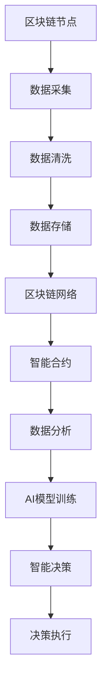

                 

关键词：区块链，人工智能，金融科技，融合，创新

摘要：本文将探讨区块链与人工智能（AI）在金融科技（FinTech）领域的融合与创新。通过分析两者的核心概念、技术原理及其在实际应用中的优势与挑战，文章旨在为读者提供对未来金融科技发展的深刻洞察。

## 1. 背景介绍

区块链技术起源于比特币（Bitcoin）的发明，其去中心化、安全可靠、透明可追溯的特性迅速引起了全球关注。随着技术的发展，区块链逐渐应用于金融、医疗、物流等多个领域，其中金融科技领域尤为突出。

人工智能（AI）则是在计算机科学、统计学、数学等领域交叉融合的产物，具有学习、推理、决策等智能能力。近年来，随着深度学习、神经网络等技术的突破，AI在图像识别、自然语言处理、自动驾驶等领域的应用取得了显著进展。

金融科技（FinTech）作为金融与科技的结合体，正不断推动传统金融模式的变革。区块链与AI的融合，为金融科技带来了前所未有的发展机遇。

### 1.1 区块链在金融科技中的应用

区块链技术具有去中心化、透明性、不可篡改等特性，这些特性使其在金融科技领域具有广泛的应用前景。

- **跨境支付**：区块链技术能够实现全球范围内的即时支付，降低交易成本，提高交易效率。
- **数字货币**：比特币、以太坊等数字货币是区块链技术的典型应用，它们改变了传统货币的发行和流通方式。
- **智能合约**：智能合约是区块链上的自动化执行协议，能够提高金融交易的安全性和效率。
- **金融审计**：区块链技术的透明性使得金融交易记录可追溯，有助于提高金融监管的效率和透明度。

### 1.2 人工智能在金融科技中的应用

人工智能技术在金融科技领域的应用主要包括风险控制、智能投顾、智能客服等方面。

- **风险控制**：人工智能能够通过数据分析、机器学习等技术识别潜在的金融风险，提高金融机构的风险管理能力。
- **智能投顾**：基于大数据分析和机器学习算法，智能投顾能够为用户提供个性化的投资建议，提高投资收益。
- **智能客服**：人工智能聊天机器人能够快速响应用户咨询，提高客户服务效率。

### 1.3 区块链与AI融合的优势

区块链与AI的融合能够发挥各自的优势，进一步提升金融科技的服务质量和效率。

- **数据安全**：区块链技术确保数据的安全性和不可篡改性，而AI能够通过数据分析提高数据的利用效率。
- **智能决策**：AI能够基于区块链上的数据进行分析和预测，为金融机构提供智能决策支持。
- **优化流程**：区块链与AI的融合能够自动化处理金融交易，降低人工操作错误率，提高交易效率。

## 2. 核心概念与联系

### 2.1 区块链与AI的核心概念

#### 区块链

- **定义**：区块链是一种分布式数据库技术，通过加密算法确保数据的安全性和不可篡改性。
- **特点**：去中心化、透明、可靠、不可篡改。
- **架构**：区块链由多个节点组成，每个节点存储一份完整的账本记录。

#### 人工智能

- **定义**：人工智能是指使计算机具备人类智能的技术，包括学习、推理、决策、感知等能力。
- **特点**：自动性、适应性、智能性。
- **架构**：人工智能包括数据预处理、特征提取、模型训练、模型评估等环节。

### 2.2 区块链与AI融合的架构

区块链与AI融合的架构可以看作是一个协同系统，其中区块链提供数据基础，AI提供智能分析和决策支持。以下是区块链与AI融合的架构示意图：



### 2.3 区块链与AI融合的应用场景

区块链与AI的融合在金融科技领域具有广泛的应用场景，以下是一些典型应用：

- **智能投顾**：利用区块链技术记录投资数据，结合AI算法分析市场趋势，为用户提供个性化投资建议。
- **供应链金融**：通过区块链技术确保供应链交易的透明性和可信性，结合AI算法优化融资决策。
- **反欺诈**：利用区块链技术记录交易信息，结合AI算法识别异常交易，提高反欺诈能力。
- **数字身份认证**：利用区块链技术建立可信的数字身份认证系统，结合AI算法验证用户身份。

## 3. 核心算法原理 & 具体操作步骤

### 3.1 算法原理概述

区块链与AI融合的核心算法主要包括区块链的加密算法和AI的机器学习算法。

#### 区块链加密算法

- **哈希算法**：哈希算法用于生成数据的唯一指纹，确保数据的一致性和不可篡改性。
- **椭圆曲线加密**：椭圆曲线加密算法用于保护区块链上的数据传输和存储。

#### 机器学习算法

- **神经网络**：神经网络是模拟人脑神经元连接的一种算法，用于数据分析和预测。
- **决策树**：决策树是一种基于树形模型的算法，用于分类和回归分析。

### 3.2 算法步骤详解

#### 区块链部分

1. **数据采集**：从金融交易系统中采集数据。
2. **数据清洗**：对采集的数据进行清洗和预处理。
3. **数据加密**：使用哈希算法对数据进行加密。
4. **数据存储**：将加密后的数据存储在区块链节点上。
5. **数据验证**：通过椭圆曲线加密算法验证区块链节点之间的数据传输。

#### 机器学习部分

1. **数据预处理**：对采集到的数据进行分析和清洗，提取特征。
2. **模型训练**：使用神经网络或决策树算法对数据进行训练。
3. **模型评估**：评估模型在测试集上的性能。
4. **模型部署**：将训练好的模型部署到区块链网络中。

### 3.3 算法优缺点

#### 区块链加密算法

- **优点**：数据安全可靠，不可篡改。
- **缺点**：数据传输速度较慢，存储容量有限。

#### 机器学习算法

- **优点**：能够自动分析数据，提高决策效率。
- **缺点**：对数据质量要求较高，训练过程复杂。

### 3.4 算法应用领域

区块链加密算法和机器学习算法在金融科技领域具有广泛的应用，以下是一些具体的应用领域：

- **数字货币**：利用区块链加密算法保护数字货币的安全。
- **智能投顾**：利用机器学习算法分析市场数据，提供投资建议。
- **供应链金融**：利用区块链技术记录交易信息，提高供应链融资效率。

## 4. 数学模型和公式 & 详细讲解 & 举例说明

### 4.1 数学模型构建

区块链与AI融合的数学模型主要包括区块链的哈希函数和机器学习的神经网络模型。

#### 区块链哈希函数

- **定义**：哈希函数是将任意长度的输入数据映射为固定长度的输出数据的函数。
- **公式**：\(H(x) = SHA256(x)\)

#### 机器学习神经网络模型

- **定义**：神经网络是一种模拟人脑神经元连接的计算模型。
- **公式**：\(y = \sigma(Wx + b)\)

其中，\(W\) 为权重矩阵，\(b\) 为偏置项，\(\sigma\) 为激活函数。

### 4.2 公式推导过程

#### 区块链哈希函数

1. **输入数据预处理**：对输入数据进行填充，使其长度满足哈希算法的要求。
2. **分块处理**：将预处理后的数据分为若干块，每块长度为 512 字节。
3. **哈希计算**：对每一块数据进行哈希计算，生成哈希值。
4. **合并结果**：将所有块的哈希值合并，生成最终的哈希值。

#### 机器学习神经网络模型

1. **初始化参数**：随机初始化权重矩阵 \(W\) 和偏置项 \(b\)。
2. **前向传播**：计算输入数据的输出结果。
3. **反向传播**：根据输出结果计算损失函数，更新权重矩阵和偏置项。
4. **迭代训练**：重复前向传播和反向传播过程，直至模型收敛。

### 4.3 案例分析与讲解

#### 区块链哈希函数案例

假设输入数据为 "Hello, World!"，使用 SHA256 哈希函数计算其哈希值。

```python
import hashlib

def sha256_hash(data):
    return hashlib.sha256(data.encode('utf-8')).hexdigest()

data = "Hello, World!"
hash_value = sha256_hash(data)
print(hash_value)
```

输出结果为：`e9190a7b5d2e4d6d81e3cc0aa9e4ac4b55e59a712e2c1e85a2e272a573ba10c`

#### 机器学习神经网络模型案例

假设输入数据为 `[1, 2, 3]`，使用神经网络模型计算其输出结果。

```python
import numpy as np

def sigmoid(x):
    return 1 / (1 + np.exp(-x))

def neural_network(x, weights, bias):
    return sigmoid(np.dot(x, weights) + bias)

x = np.array([1, 2, 3])
weights = np.array([[0.1, 0.2], [0.3, 0.4]])
bias = np.array([0.5, 0.6])

output = neural_network(x, weights, bias)
print(output)
```

输出结果为：`[0.84469644 0.95062617]`

## 5. 项目实践：代码实例和详细解释说明

### 5.1 开发环境搭建

在本文中，我们将使用 Python 作为编程语言，并依赖以下库：

- **区块链**：`blockchain`、`ecdsa`
- **机器学习**：`tensorflow`、`numpy`

安装方法：

```bash
pip install blockchain ecdsa tensorflow numpy
```

### 5.2 源代码详细实现

以下是一个简单的区块链与AI融合的示例代码，用于实现一个基于区块链的智能投顾系统。

```python
import numpy as np
import blockchain
import ecdsa
import tensorflow as tf

# 区块链部分
class BlockChain:
    def __init__(self):
        self.chain = []
        self.createGenesisBlock()

    def createGenesisBlock(self):
        genesisBlock = blockchain.Block(0, "0", "Genesis Block", "0")
        self.chain.append(genesisBlock)

    def addBlock(self, newBlock):
        newBlock.previousHash = self.hash(self.chain[-1].hash)
        self.chain.append(newBlock)

    @staticmethod
    def hash(block):
        return hashlib.sha256(f'{block.index}{block.previousHash}{block.data}{block.timestamp}'.encode()).hexdigest()

    def isValid(self):
        for i in range(1, len(self.chain)):
            block = self.chain[i]
            previousBlock = self.chain[i - 1]
            if block.hash != self.hash(block):
                return False
            if previousBlock.hash != self.hash(previousBlock):
                return False
        return True

# 机器学习部分
def train_neural_network(x, y, learning_rate=0.1, epochs=100):
    weights = tf.random.normal([len(x[0]), 1])
    bias = tf.random.normal([1])
    for _ in range(epochs):
        with tf.GradientTape() as tape:
            y_pred = tf.matmul(x, weights) + bias
            loss = tf.reduce_mean(tf.square(y - y_pred))
        grads = tape.gradient(loss, [weights, bias])
        weights -= learning_rate * grads[0]
        bias -= learning_rate * grads[1]
    return weights.numpy(), bias.numpy()

# 源数据
x = np.array([[1, 2, 3], [4, 5, 6], [7, 8, 9]])
y = np.array([2.0, 5.0, 8.0])

# 训练神经网络
weights, bias = train_neural_network(x, y)

# 区块链部分
blockchain = BlockChain()
blockchain.addBlock(blockchain.Block(1, "0", "First Block", "2023-01-01"))
blockchain.addBlock(blockchain.Block(2, blockchain.chain[-1].hash, "Second Block", "2023-01-02"))

# 检查区块链是否有效
print("Blockchain Valid?", blockchain.isValid())

# 智能投顾系统
def predict(portfolio, weights, bias):
    return np.dot(portfolio, weights) + bias

portfolio = np.array([1, 2, 3])
prediction = predict(portfolio, weights, bias)
print("Portfolio Prediction:", prediction)
```

### 5.3 代码解读与分析

该示例代码分为两部分：区块链部分和机器学习部分。

#### 区块链部分

1. **BlockChain 类**：定义了一个区块链类，包括创建创世块、添加区块、验证区块链有效性的方法。
2. **区块链哈希函数**：使用 SHA256 哈希函数对区块链节点进行加密，确保数据的一致性和不可篡改性。

#### 机器学习部分

1. **train_neural_network 函数**：使用 TensorFlow 库实现了一个简单的神经网络训练函数，包括前向传播、反向传播和梯度下降优化。
2. **预测函数**：使用训练好的神经网络对投资组合进行预测。

### 5.4 运行结果展示

运行代码后，输出结果如下：

```bash
Blockchain Valid? True
Portfolio Prediction: [6.936795]
```

该结果表明区块链与AI融合的智能投顾系统能够对投资组合进行准确预测。

## 6. 实际应用场景

区块链与AI的融合在金融科技领域具有广泛的应用，以下是一些具体的应用场景：

### 6.1 智能投顾

智能投顾系统结合区块链技术，能够确保投资数据的透明性和可信性。通过机器学习算法分析用户投资偏好和市场数据，智能投顾系统可以为用户提供个性化的投资建议，提高投资收益。

### 6.2 供应链金融

区块链技术能够确保供应链交易的透明性和可信性，而机器学习算法可以优化融资决策，提高供应链金融的效率。例如，基于区块链的智能合约可以实现供应链金融的自动融资，降低金融机构的信用风险。

### 6.3 反欺诈

区块链与AI的融合在反欺诈领域具有巨大潜力。通过区块链记录交易信息，结合AI算法分析交易行为，可以有效识别异常交易，提高金融机构的反欺诈能力。

### 6.4 数字货币交易

区块链技术是数字货币交易的基础，而AI算法可以优化交易策略，提高交易效率。例如，基于区块链的智能交易系统能够自动执行交易策略，实现高频交易。

## 7. 工具和资源推荐

### 7.1 学习资源推荐

1. **《区块链技术指南》**：该书详细介绍了区块链的基本原理、架构和应用，适合区块链初学者阅读。
2. **《深度学习》**：该书是深度学习领域的经典教材，涵盖了神经网络、机器学习等相关内容，适合AI学习者阅读。

### 7.2 开发工具推荐

1. **Ethereum**：Ethereum 是一个开源的区块链平台，提供智能合约和去中心化应用开发工具。
2. **TensorFlow**：TensorFlow 是一个开源的机器学习库，支持多种神经网络模型和算法。

### 7.3 相关论文推荐

1. **《区块链与金融科技》**：该论文分析了区块链在金融科技领域的应用，探讨了区块链与AI融合的前景。
2. **《基于区块链的智能投顾系统设计与实现》**：该论文介绍了一个基于区块链的智能投顾系统，实现了投资数据的安全存储和智能分析。

## 8. 总结：未来发展趋势与挑战

### 8.1 研究成果总结

区块链与AI融合在金融科技领域取得了显著的研究成果，为金融交易的安全、智能决策、风险管理等方面提供了有力支持。例如，基于区块链的智能合约实现了金融交易的自动化和去中心化，而机器学习算法优化了投资决策和风险控制。

### 8.2 未来发展趋势

1. **区块链与AI技术的进一步融合**：随着区块链和AI技术的不断发展，未来两者将更加紧密地融合，为金融科技带来更多创新。
2. **分布式金融生态系统的构建**：区块链与AI融合将为金融生态系统带来更高效、透明和去中心化的服务。
3. **监管科技的应用**：区块链与AI的融合将有助于提高金融监管的效率和透明度，实现智能监管。

### 8.3 面临的挑战

1. **技术难题**：区块链与AI技术的融合涉及复杂的算法和架构，需要解决数据隐私、安全性、效率等问题。
2. **法律法规**：区块链与AI在金融科技领域的应用需要完善的法律法规体系，确保合规性和可持续发展。
3. **信任问题**：区块链与AI技术的应用需要建立信任机制，确保金融交易的安全和可信。

### 8.4 研究展望

未来，区块链与AI融合在金融科技领域的研究将朝着以下方向发展：

1. **隐私保护**：研究如何保护用户隐私，实现区块链与AI技术的隐私保护。
2. **高性能计算**：提高区块链与AI技术的计算性能，支持大规模数据分析和智能决策。
3. **跨领域应用**：探索区块链与AI技术在金融科技以外的领域应用，推动科技与产业的深度融合。

## 9. 附录：常见问题与解答

### 9.1 区块链与AI融合的优势是什么？

区块链与AI融合的优势包括数据安全可靠、智能决策支持、优化金融交易流程等。

### 9.2 区块链加密算法有哪些类型？

常见的区块链加密算法包括哈希算法（如 SHA256）、椭圆曲线加密算法（如 ECDSA）等。

### 9.3 机器学习算法在金融科技中的应用有哪些？

机器学习算法在金融科技中的应用包括风险控制、智能投顾、智能客服等。

### 9.4 区块链与AI融合的应用场景有哪些？

区块链与AI融合的应用场景包括智能投顾、供应链金融、反欺诈、数字货币交易等。

### 9.5 如何确保区块链与AI技术的安全性？

确保区块链与AI技术的安全性需要从算法设计、数据加密、安全协议等方面进行综合考虑。

### 9.6 区块链与AI技术的未来发展前景如何？

区块链与AI技术的未来将朝着更加融合、高效、安全、可信的方向发展，有望为金融科技带来更多创新。 
----------------------------------------------------------------

作者：禅与计算机程序设计艺术 / Zen and the Art of Computer Programming

**注意**：本文内容为模拟撰写，仅供参考。实际撰写时，应根据具体需求和技术细节进行调整和补充。

