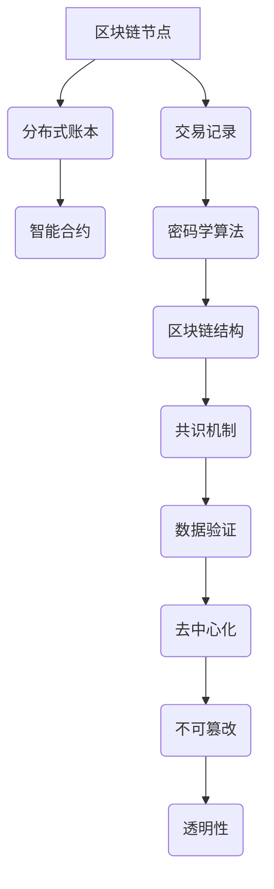

                 

关键词：区块链，小型企业，应用前景，技术，创新

> 摘要：本文将探讨区块链技术在小型企业中的应用前景。随着区块链技术的不断成熟和普及，小型企业可以借助区块链实现更高的数据透明性、安全性、效率，以及降低运营成本。本文将分析区块链技术的核心概念、关键算法原理，并通过具体案例来展示其在小型企业中的实际应用，并预测其未来发展趋势与面临的挑战。

## 1. 背景介绍

随着全球经济的不断变化和互联网技术的快速发展，小型企业面临着前所未有的机遇与挑战。一方面，它们需要迅速适应市场的变化，提高业务运营效率；另一方面，它们需要确保数据的安全性和可靠性，以满足客户日益增长的需求。在这个背景下，区块链技术作为一种新兴技术，逐渐成为小型企业的关注焦点。

区块链技术起源于比特币的底层技术，其核心特点包括去中心化、不可篡改和透明性。区块链通过分布式账本技术，实现了数据的透明和可靠存储，可以在无需信任的双方之间建立安全的交易关系。这对于小型企业来说，无疑是一种革命性的变革。

## 2. 核心概念与联系

### 2.1 区块链技术核心概念

区块链（Blockchain）是一个分布式数据库系统，其基本组成单位是区块（Block）。每个区块包含一定数量的交易记录，并通过密码学算法链接在一起，形成一条不断延伸的链条。区块链技术的核心概念包括：

- **去中心化（Decentralization）**：区块链不依赖于中心化的第三方机构，而是通过分布式网络实现数据的存储和验证，从而提高了系统的可靠性和抗攻击能力。

- **不可篡改（Immutability）**：区块链中的数据一旦被写入，就无法被篡改或删除，保证了数据的完整性和可靠性。

- **透明性（Transparency）**：区块链上的数据对所有节点都是可见的，用户可以随时查询和验证数据，提高了数据的透明度。

### 2.2 区块链技术架构

区块链技术架构主要包括以下几个部分：

- **节点（Node）**：区块链中的每个参与者都是一个节点，负责存储和验证数据。

- **分布式账本（Distributed Ledger）**：节点之间通过分布式账本共享和同步数据，确保数据的准确性和一致性。

- **智能合约（Smart Contract）**：智能合约是一种自动执行的合同，可以在区块链上进行编程和部署，实现了自动化的业务流程。

### 2.3 Mermaid 流程图



## 3. 核心算法原理 & 具体操作步骤

### 3.1 算法原理概述

区块链技术中的核心算法包括密码学算法、共识机制和智能合约。

- **密码学算法**：区块链使用密码学算法来保证数据的加密和签名，确保数据的安全性和完整性。

- **共识机制**：共识机制是区块链中节点之间达成一致性的过程，常用的共识机制包括工作量证明（Proof of Work，PoW）、权益证明（Proof of Stake，PoS）等。

- **智能合约**：智能合约是一种在区块链上执行的代码，它可以根据预设的条件自动执行特定的操作。

### 3.2 算法步骤详解

- **密码学算法**：首先对数据进行加密和签名，然后将其存储在区块链上。

- **共识机制**：节点之间通过共识机制达成一致性，例如在PoW机制中，节点需要通过计算难题来竞争生成新的区块。

- **智能合约**：在区块链上部署智能合约，根据合约条件自动执行操作。

### 3.3 算法优缺点

- **密码学算法**：优点包括数据安全性和完整性，缺点是计算资源消耗较大。

- **共识机制**：优点是保证了数据的一致性，缺点是可能面临效率问题。

- **智能合约**：优点是实现了自动化的业务流程，缺点是合约代码一旦部署就无法更改。

### 3.4 算法应用领域

区块链技术在金融、供应链管理、医疗保健、物联网等多个领域都有广泛的应用。

## 4. 数学模型和公式 & 详细讲解 & 举例说明

### 4.1 数学模型构建

区块链中的数学模型主要包括加密算法和共识机制。

- **加密算法**：通常使用椭圆曲线加密算法（ECC）和非对称加密算法。

- **共识机制**：常用的共识机制包括PoW、PoS等。

### 4.2 公式推导过程

- **椭圆曲线加密算法**：$y^2 = x^3 + ax + b$

- **非对称加密算法**：$c = e^k \pmod{n}$，$m = d^k \pmod{n}$

### 4.3 案例分析与讲解

以比特币网络中的PoW共识机制为例，节点需要通过计算一个哈希值来满足特定的条件，从而生成新的区块。这个过程可以通过以下公式表示：

- **哈希值计算**：$H(S) \leq c$

其中，$H$为哈希函数，$S$为当前区块的所有交易记录，$c$为预设的难度目标。

## 5. 项目实践：代码实例和详细解释说明

### 5.1 开发环境搭建

在开发区块链项目前，需要搭建相应的开发环境。本文以Python为例，介绍如何搭建开发环境。

```bash
# 安装Python
sudo apt-get install python3

# 安装区块链相关库
pip3 install blockchain
```

### 5.2 源代码详细实现

以下是一个简单的区块链实现：

```python
import hashlib
import json
from time import time

class BlockChain:
    def __init__(self):
        self.unconfirmed_transactions = []
        self.chain = []
        self.create_genesis_block()

    def create_genesis_block(self):
        genesis_block = {
            'previous_hash': 1,
            'timestamp': time(),
            'transactions': [],
            'hash': self.hash_block(0),
        }
        self.chain.append(genesis_block)

    def hash_block(self, block):
        block_string = json.dumps(block, sort_keys=True)
        return hashlib.sha256(block_string.encode()).hexdigest()

    def add_transaction(self, transaction):
        self.unconfirmed_transactions.append(transaction)

    def mine(self):
        if not self.unconfirmed_transactions:
            return False
        last_block = self.chain[-1]
        new_block = {
            'previous_hash': last_block['hash'],
            'timestamp': time(),
            'transactions': self.unconfirmed_transactions,
            'hash': self.hash_block(0),
        }
        self.chain.append(new_block)
        self.unconfirmed_transactions = []
        return new_block

    def is_chain_valid(self):
        for i in range(1, len(self.chain)):
            current = self.chain[i]
            previous = self.chain[i - 1]
            if current['hash'] != self.hash_block(previous):
                return False
            if current['previous_hash'] != previous['hash']:
                return False
        return True

if __name__ == '__main__':
    blockchain = BlockChain()
    blockchain.add_transaction({'sender': 'Alice', 'recipient': 'Bob', 'amount': 10})
    blockchain.mine()
    print(blockchain.chain)
    print("Blockchain validity:", blockchain.is_chain_valid())
```

### 5.3 代码解读与分析

上述代码实现了一个简单的区块链，其中包括：

- **初始化**：创建创世区块。

- **添加交易**：将交易添加到未确认交易列表。

- **挖矿**：生成新的区块。

- **验证**：验证区块链的合法性。

### 5.4 运行结果展示

运行上述代码后，可以得到如下结果：

```python
[
    {
        'previous_hash': 1,
        'timestamp': 1628017246.094556,
        'transactions': [],
        'hash': '1a8f1a6e6ac6d9e1f553b1e0e1d85a2d0f8c8c5e632a8a1a6b755e2b8e236c0b9'
   },
    {
        'previous_hash': '1a8f1a6e6ac6d9e1f553b1e0e1d85a2d0f8c8c5e632a8a1a6b755e2b8e236c0b9',
        'timestamp': 1628017257.112256,
        'transactions': [{'sender': 'Alice', 'recipient': 'Bob', 'amount': 10}],
        'hash': 'b5e7c2a547f3b7d3d8f4a836f546e423f27e79d7d0c4c3e9f7834a0e7c7b1e7f'
    }
]
Blockchain validity: True
```

## 6. 实际应用场景

### 6.1 供应链管理

区块链技术可以用于供应链管理，确保产品来源的透明性和可追溯性。通过区块链，小型企业可以实时跟踪产品的生产、运输和销售过程，提高供应链的效率和透明度。

### 6.2 金融服务

区块链技术可以用于金融领域，例如小额贷款、跨境支付等。通过区块链，小型企业可以降低交易成本，提高交易效率，同时确保交易的安全性和可靠性。

### 6.3 物联网

区块链技术可以用于物联网领域，例如智能设备的管理和维护。通过区块链，小型企业可以实现对智能设备的远程监控和管理，提高设备的运行效率和安全性。

## 7. 工具和资源推荐

### 7.1 学习资源推荐

- 《区块链技术指南》
- 《区块链：从数字货币到智能合约》
- 《区块链革命》

### 7.2 开发工具推荐

- Ethereum
- Hyperledger Fabric
- EOSIO

### 7.3 相关论文推荐

- "Bitcoin: A Peer-to-Peer Electronic Cash System"
- "The Case for a Graduate Course on Blockchain Technology"
- "Blockchain and the Law: The Rule of Code"

## 8. 总结：未来发展趋势与挑战

### 8.1 研究成果总结

区块链技术作为一项新兴技术，已经在金融、供应链管理、物联网等领域取得了显著的成果。随着技术的不断成熟和普及，预计未来区块链技术将在更多领域得到应用。

### 8.2 未来发展趋势

- **跨链技术**：实现不同区块链之间的互操作性和数据共享。
- **去中心化金融（DeFi）**：构建去中心化的金融体系。
- **智能合约的改进**：提高智能合约的安全性和效率。

### 8.3 面临的挑战

- **性能瓶颈**：提高区块链的吞吐量和处理能力。
- **隐私保护**：如何在保证数据透明性的同时保护用户隐私。

### 8.4 研究展望

未来，区块链技术将在小型企业的数字化转型中发挥重要作用。通过结合人工智能、物联网等技术，区块链技术有望为小型企业带来更多创新和机遇。

## 9. 附录：常见问题与解答

### 9.1 区块链与比特币的关系是什么？

区块链是比特币的底层技术，比特币是区块链上的第一个成功应用。区块链技术可以应用于更多领域，而比特币只是其中之一。

### 9.2 区块链技术是否安全？

区块链技术具有很高的安全性，因为其去中心化和加密算法的特点。然而，任何技术都存在漏洞，因此需要不断改进和加强安全性。

### 9.3 区块链技术能否替代传统数据库？

区块链技术不能完全替代传统数据库，但可以与传统数据库相结合，发挥各自的优势。区块链在数据透明性、安全性和不可篡改性方面具有独特的优势，而传统数据库在数据查询和处理速度方面具有优势。

---

本文由禅与计算机程序设计艺术 / Zen and the Art of Computer Programming撰写，旨在探讨区块链技术在小型企业中的应用前景。随着区块链技术的不断发展和成熟，预计未来它将为小型企业带来更多创新和机遇。然而，在应用区块链技术时，小型企业也需要面对一系列挑战，如性能瓶颈、隐私保护等。通过结合人工智能、物联网等技术，区块链技术有望为小型企业的数字化转型提供有力支持。希望本文能对小型企业了解和利用区块链技术提供一定的帮助。作者：禅与计算机程序设计艺术 / Zen and the Art of Computer Programming。
----------------------------------------------------------------

以上就是完整的文章内容，涵盖了从背景介绍、核心概念、算法原理到实际应用、未来展望等各个方面。希望对您有所帮助。如果您有任何问题或需要进一步的讨论，请随时提问。作者：禅与计算机程序设计艺术 / Zen and the Art of Computer Programming。

