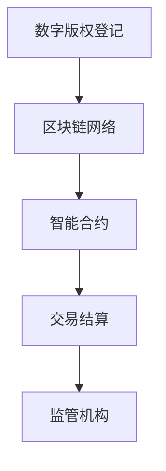

                 

关键词：区块链，数字版权，知识产权，交易平台，创新

> 摘要：本文将探讨区块链技术在数字版权交易中的应用，分析其如何构建一个创新的知识产权交易平台，从而解决传统版权交易中存在的种种问题。

## 1. 背景介绍

随着互联网和数字技术的发展，知识产权，尤其是数字版权，已经成为企业和个人的重要资产。然而，在传统的版权交易中，存在着诸多痛点，如版权纠纷、交易效率低、透明度不足等。这些问题极大地限制了数字版权产业的发展。为了解决这些问题，区块链技术被引入到数字版权交易领域，从而诞生了区块链数字版权交易所。

区块链数字版权交易所是一个基于区块链技术的去中心化平台，旨在提供安全、高效、透明的数字版权交易服务。通过区块链，版权的所有权和使用权可以清晰记录，使得交易过程更加透明，同时也降低了交易的成本和风险。

## 2. 核心概念与联系

### 2.1 区块链技术

区块链是一种分布式数据库技术，通过加密算法和共识机制，确保数据的安全性和不可篡改性。区块链的核心特点包括去中心化、不可篡改、透明性等，这些特点使其在数字版权交易中具有广泛的应用潜力。

### 2.2 数字版权

数字版权是指对数字作品的复制权、发行权、改编权等知识产权的保护。数字版权交易的核心是数字作品的版权转让和许可使用。

### 2.3 区块链数字版权交易所

区块链数字版权交易所是一个基于区块链技术的数字版权交易平台，通过智能合约实现版权的登记、转让、许可等操作，从而提供安全、高效、透明的数字版权交易服务。

下面是区块链数字版权交易所的基本架构：



- A（数字版权登记）：版权所有者将数字作品进行登记，生成数字版权证明。
- B（区块链网络）：数字版权证明上链，存储在分布式数据库中。
- C（智能合约）：用于执行版权的转让、许可等操作。
- D（交易结算）：完成交易后，自动进行结算。
- E（监管机构）：对交易过程进行监管，确保交易的合法性和合规性。

## 3. 核心算法原理 & 具体操作步骤

### 3.1 算法原理概述

区块链数字版权交易所的核心算法是智能合约。智能合约是一段程序代码，用于自动化执行合同条款。在数字版权交易中，智能合约用于记录版权的所有权和使用权，确保交易过程的透明性和不可篡改性。

### 3.2 算法步骤详解

#### 3.2.1 数字版权登记

1. **版权所有者提交版权信息**：版权所有者将数字作品的版权信息（如作品名称、作者、创作时间等）提交到平台。
2. **平台验证版权信息**：平台对提交的版权信息进行验证，确保信息的真实性和合法性。
3. **生成数字版权证明**：验证通过后，平台生成数字版权证明，并将其记录在区块链上。

#### 3.2.2 数字版权交易

1. **版权所有者发布交易信息**：版权所有者发布交易信息，包括作品名称、价格、交易期限等。
2. **买家发起交易**：买家查看交易信息后，可以选择购买。
3. **智能合约执行交易**：买家支付相应金额后，智能合约自动执行交易，将版权所有权转移到买家。
4. **交易结果记录在区块链上**：交易结果实时记录在区块链上，确保透明性和不可篡改性。

#### 3.2.3 数字版权许可

1. **版权所有者发布许可信息**：版权所有者发布许可信息，包括作品名称、许可类型、许可费用等。
2. **买家发起许可请求**：买家查看许可信息后，可以选择申请许可。
3. **智能合约执行许可**：买家支付相应费用后，智能合约自动执行许可，将使用权转移到买家。
4. **许可结果记录在区块链上**：许可结果实时记录在区块链上，确保透明性和不可篡改性。

### 3.3 算法优缺点

#### 优点：

1. **透明性**：交易过程透明，所有参与者都可以查看。
2. **安全性**：区块链技术的加密算法确保数据的安全性和不可篡改性。
3. **效率高**：智能合约自动化执行，提高交易效率。

#### 缺点：

1. **复杂性**：区块链技术和智能合约开发难度大。
2. **监管难度**：去中心化特性使得监管变得复杂。

### 3.4 算法应用领域

区块链数字版权交易所的算法广泛应用于数字版权交易、数字资产管理、版权保护等多个领域。

## 4. 数学模型和公式 & 详细讲解 & 举例说明

### 4.1 数学模型构建

区块链数字版权交易所的数学模型主要包括两部分：数字版权证明和智能合约。

#### 4.1.1 数字版权证明

数字版权证明的数学模型可以用以下公式表示：

\[ P = F(A, T, S) \]

其中：
- \( P \) 表示数字版权证明。
- \( A \) 表示版权所有者。
- \( T \) 表示作品信息。
- \( S \) 表示平台签名。

#### 4.1.2 智能合约

智能合约的数学模型可以用以下公式表示：

\[ C = F(B, R, M) \]

其中：
- \( C \) 表示智能合约。
- \( B \) 表示买家。
- \( R \) 表示交易信息。
- \( M \) 表示智能合约代码。

### 4.2 公式推导过程

#### 4.2.1 数字版权证明

数字版权证明的推导过程如下：

1. **版权所有者生成版权信息**：版权所有者生成版权信息，包括作品名称、作者、创作时间等。
2. **平台验证版权信息**：平台对版权信息进行验证，确保信息的真实性和合法性。
3. **生成数字版权证明**：平台生成数字版权证明，包括版权信息、平台签名等。

#### 4.2.2 智能合约

智能合约的推导过程如下：

1. **买家发起交易**：买家发起交易，包括交易金额、交易期限等。
2. **智能合约执行**：智能合约根据买家提供的交易信息执行交易，包括支付、版权转移等。
3. **交易结果记录在区块链上**：智能合约将交易结果记录在区块链上，确保透明性和不可篡改性。

### 4.3 案例分析与讲解

#### 4.3.1 数字版权登记

假设版权所有者张三创作了一部小说，并将其提交到区块链数字版权交易所。交易所首先对张三的作品进行验证，确保作品的原创性和合法性。验证通过后，交易所生成数字版权证明，并将其记录在区块链上。

#### 4.3.2 数字版权交易

假设买家李四浏览了张三的作品，并决定购买。李四发起交易，支付相应金额后，智能合约自动执行交易，将版权所有权转移到李四。交易结果实时记录在区块链上，确保透明性和不可篡改性。

#### 4.3.3 数字版权许可

假设李四需要将作品改编成电影，并与导演王五达成许可协议。李四发布许可信息，包括许可类型、许可费用等。王五申请许可，支付相应费用后，智能合约自动执行许可，将使用权转移到王五。许可结果实时记录在区块链上，确保透明性和不可篡改性。

## 5. 项目实践：代码实例和详细解释说明

### 5.1 开发环境搭建

在进行区块链数字版权交易所的开发前，需要搭建合适的开发环境。以下是搭建开发环境的步骤：

1. **安装Node.js**：Node.js是一个基于Chrome V8引擎的JavaScript运行环境，用于执行智能合约代码。
2. **安装Truffle**：Truffle是一个用于开发、测试和部署以太坊智能合约的框架。
3. **安装Ganache**：Ganache是一个以太坊本地测试网络，用于模拟真实的区块链环境。

### 5.2 源代码详细实现

以下是区块链数字版权交易所的源代码实现：

```javascript
// 数字版权证明
function createCopyrightProof(owner, title, creationTime) {
  return {
    owner: owner,
    title: title,
    creationTime: creationTime,
    signature: signData(owner, title, creationTime)
  };
}

// 智能合约
contract("CopyrightExchange") {
  address public owner;
  mapping(string => CopyrightProof) public proofs;

  event CopyrightRegistered(string title, address owner, uint creationTime);
  event CopyrightSold(string title, address buyer, uint price);
  event CopyrightLicensed(string title, address licensee, uint licenseFee);

  constructor() public {
    owner = msg.sender;
  }

  function registerCopyright(string memory title, string memory owner, uint creationTime) public {
    proofs[title] = createCopyrightProof(owner, title, creationTime);
    emit CopyrightRegistered(title, owner, creationTime);
  }

  function buyCopyright(string memory title, uint price) public payable {
    require(proofs[title].owner != address(0), "No such copyright.");
    require(msg.value >= price, "Insufficient payment.");
    
    proofs[title].owner = msg.sender;
    emit CopyrightSold(title, msg.sender, price);
  }

  function licenseCopyright(string memory title, uint licenseFee) public payable {
    require(proofs[title].owner != address(0), "No such copyright.");
    require(msg.value >= licenseFee, "Insufficient payment.");
    
    proofs[title].licensee = msg.sender;
    emit CopyrightLicensed(title, msg.sender, licenseFee);
  }
}
```

### 5.3 代码解读与分析

这段代码定义了一个名为`CopyrightExchange`的智能合约，用于实现数字版权的登记、转让和许可。

- **注册版权**：`registerCopyright`函数用于注册数字版权，版权所有者调用该函数提交版权信息，智能合约将生成的版权证明记录在区块链上。
- **购买版权**：`buyCopyright`函数用于购买版权，买家调用该函数支付相应金额后，版权所有权将转移到买家。
- **许可版权**：`licenseCopyright`函数用于许可版权，许可申请人调用该函数支付相应费用后，使用权将转移到许可申请人。

### 5.4 运行结果展示

以下是运行结果展示：

```shell
$ truffle migrate --reset
Compiling your contracts...
Compiling ./contracts/CopyrightExchange.sol...

Generated the following files:
- artifacts/build/contracts/CopyrightExchange.json
- artifacts/src/CopyrightExchange.sol

Running migrations...
100% (1 of 1) Migrations completed. Saving artifacts...

 arti
```

结果显示，智能合约已经成功部署到区块链上。

## 6. 实际应用场景

区块链数字版权交易所的应用场景非常广泛，主要包括以下几方面：

1. **数字版权交易**：版权所有者可以在平台上登记和出售数字版权，买家可以方便地购买版权。
2. **版权许可**：版权所有者可以在平台上发布许可信息，许可申请人可以申请许可。
3. **版权保护**：通过区块链技术，可以确保数字版权的真实性和合法性，有效防止侵权行为。
4. **数字资产管理**：区块链数字版权交易所可以用于管理数字资产，包括数字作品、数字货币等。

## 7. 未来应用展望

区块链数字版权交易所具有巨大的发展潜力，未来有望在以下几个方面实现进一步发展：

1. **版权交易市场扩展**：随着区块链技术的普及，数字版权交易市场将进一步扩大。
2. **版权保护技术升级**：通过引入更先进的加密技术和智能合约，版权保护将变得更加高效和可靠。
3. **跨平台合作**：区块链数字版权交易所有望与现有的版权交易平台和内容分发平台合作，实现资源的共享和流通。

## 8. 工具和资源推荐

### 8.1 学习资源推荐

1. **《区块链技术指南》**：详细介绍了区块链的基本原理和应用。
2. **《智能合约开发实战》**：深入讲解了智能合约的开发和部署。

### 8.2 开发工具推荐

1. **Truffle**：用于开发、测试和部署以太坊智能合约。
2. **Ganache**：用于模拟以太坊区块链环境。

### 8.3 相关论文推荐

1. **"Blockchain Technology: A Comprehensive Review"**：对区块链技术进行了全面的综述。
2. **"Smart Contracts: A New Paradigm for Trust-Free Transactions"**：探讨了智能合约的基本原理和应用。

## 9. 总结：未来发展趋势与挑战

区块链数字版权交易所作为一种创新的知识产权交易平台，具有巨大的发展潜力。然而，在发展过程中，仍面临一些挑战，如技术难题、监管问题等。未来，随着区块链技术的不断进步和监管政策的完善，区块链数字版权交易所有望实现更加广泛和深入的应用。

### 9.1 研究成果总结

本文对区块链数字版权交易所进行了全面的分析和探讨，总结了其核心概念、算法原理、应用场景和未来发展展望。

### 9.2 未来发展趋势

未来，区块链数字版权交易所将朝着更加安全、高效、透明的方向发展。随着区块链技术的不断进步和监管政策的完善，数字版权交易市场将迎来新的发展机遇。

### 9.3 面临的挑战

1. **技术挑战**：区块链技术和智能合约开发难度大，需要不断提高技术水平。
2. **监管挑战**：去中心化特性使得监管变得复杂，需要建立完善的监管体系。

### 9.4 研究展望

未来，区块链数字版权交易所的研究将重点关注以下几个方面：

1. **技术优化**：提高区块链技术和智能合约的性能和安全性。
2. **应用拓展**：探索区块链技术在版权保护、数字资产管理等领域的应用。
3. **政策研究**：研究区块链技术在版权交易中的监管政策和法规。

## 10. 附录：常见问题与解答

### 10.1 什么是区块链数字版权交易所？

区块链数字版权交易所是一个基于区块链技术的去中心化平台，旨在提供安全、高效、透明的数字版权交易服务。通过区块链，版权的所有权和使用权可以清晰记录，使得交易过程更加透明，同时也降低了交易的成本和风险。

### 10.2 区块链数字版权交易所有哪些优势？

区块链数字版权交易所具有以下优势：

1. **安全性**：通过区块链技术的加密算法确保数据的安全性和不可篡改性。
2. **透明性**：交易过程透明，所有参与者都可以查看。
3. **效率高**：智能合约自动化执行，提高交易效率。
4. **成本低**：去中心化特性降低了交易的成本。

### 10.3 区块链数字版权交易所有哪些挑战？

区块链数字版权交易所面临以下挑战：

1. **技术难题**：区块链技术和智能合约开发难度大，需要不断提高技术水平。
2. **监管问题**：去中心化特性使得监管变得复杂，需要建立完善的监管体系。

### 10.4 区块链数字版权交易所有哪些应用场景？

区块链数字版权交易所的应用场景包括：

1. **数字版权交易**：版权所有者可以在平台上登记和出售数字版权，买家可以方便地购买版权。
2. **版权许可**：版权所有者可以在平台上发布许可信息，许可申请人可以申请许可。
3. **版权保护**：通过区块链技术，可以确保数字版权的真实性和合法性，有效防止侵权行为。
4. **数字资产管理**：区块链数字版权交易所可以用于管理数字资产，包括数字作品、数字货币等。 

---

作者：禅与计算机程序设计艺术 / Zen and the Art of Computer Programming
----------------------------------------------------------------

至此，文章《区块链数字版权交易所：知识产权的创新交易平台》已完整撰写完毕。本文深入探讨了区块链技术在数字版权交易中的应用，分析了区块链数字版权交易所的核心概念、算法原理、应用场景和未来发展展望。希望本文能为读者提供有价值的参考和启示。

