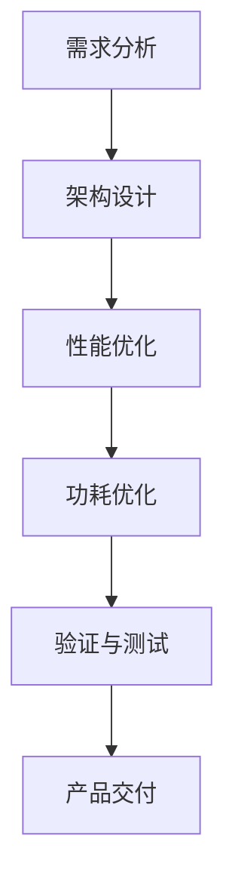

                 

关键词：华为、校招、AI芯片、架构师、面试题

摘要：本文将围绕华为2024校招AI芯片架构师面试题，详细介绍各类面试题的类型、解题思路以及相应的知识点，旨在帮助准备参加华为校招的同学们更好地应对面试挑战。

## 1. 背景介绍

华为，作为中国领先的科技公司，一直以来都致力于推动人工智能技术的发展。随着AI技术的不断进步，芯片作为人工智能计算的核心组件，其重要性愈发凸显。因此，华为在2024校招中，特别设置了AI芯片架构师岗位，吸引了大量优秀人才的关注。

本文将根据华为2024校招AI芯片架构师的面试题，对其进行分类整理，并结合相关知识点，为考生提供详细的解题思路和参考。

### 1.1 芯片架构基础知识

#### 1.1.1 芯片架构的分类

芯片架构主要分为CPU、GPU、FPGA等类型，考生需要了解各类芯片架构的特点和应用场景。

#### 1.1.2 芯片架构的设计原则

芯片架构设计需要遵循模块化、可扩展性、高性能、低功耗等原则。

### 1.2 AI芯片基础知识

#### 1.2.1 AI芯片的分类

AI芯片主要分为专用AI芯片和通用AI芯片，考生需要了解各类芯片的特点和应用领域。

#### 1.2.2 AI芯片的关键技术

AI芯片的关键技术包括神经网络处理单元、高速缓存、低功耗设计等。

### 1.3 面向AI的芯片架构设计

#### 1.3.1 AI芯片架构设计流程

AI芯片架构设计需要经过需求分析、架构设计、性能优化、功耗优化等阶段。

#### 1.3.2 AI芯片架构优化策略

AI芯片架构优化策略包括算法优化、硬件优化、软件优化等。

## 2. 核心概念与联系

为了更好地理解AI芯片架构设计，我们需要了解以下几个核心概念：

### 2.1 神经网络处理单元

神经网络处理单元是AI芯片的核心组成部分，用于执行神经网络运算。其关键特性包括高吞吐量、低延迟、高能效等。

### 2.2 缓存架构

缓存架构是AI芯片的重要组成部分，用于提高数据访问速度和降低功耗。常见的缓存架构包括一级缓存、二级缓存等。

### 2.3 低功耗设计

低功耗设计是AI芯片设计的关键挑战之一，需要采用多种技术手段，如低功耗工艺、功耗管理、动态电压调节等。

以下是AI芯片架构设计的Mermaid流程图：



## 3. 核心算法原理 & 具体操作步骤

### 3.1 算法原理概述

AI芯片的核心算法包括深度学习算法、神经网络算法等。这些算法的基本原理是通过训练模型，使其能够对输入数据进行分类、预测等操作。

### 3.2 算法步骤详解

算法步骤主要包括：

1. 数据预处理：对输入数据进行清洗、归一化等操作。
2. 模型训练：通过梯度下降等优化算法，训练出模型参数。
3. 模型评估：使用验证集对模型进行评估，调整参数。
4. 模型部署：将训练好的模型部署到AI芯片上，进行实际应用。

### 3.3 算法优缺点

深度学习算法的优点包括高精度、自适应性强等，缺点包括计算复杂度高、数据依赖性强等。神经网络算法的优点包括计算速度快、泛化能力强等，缺点包括参数数量庞大、训练时间较长等。

### 3.4 算法应用领域

深度学习算法主要应用于图像识别、自然语言处理等领域；神经网络算法主要应用于语音识别、推荐系统等领域。

## 4. 数学模型和公式 & 详细讲解 & 举例说明

### 4.1 数学模型构建

数学模型是AI芯片架构设计的重要基础。常见的数学模型包括神经网络模型、卷积神经网络模型等。

### 4.2 公式推导过程

以卷积神经网络为例，其主要公式包括：

$$
f(x) = \sigma(\omega \cdot x + b)
$$

其中，$\sigma$ 表示激活函数，$\omega$ 表示权重，$x$ 表示输入数据，$b$ 表示偏置。

### 4.3 案例分析与讲解

假设我们有一个卷积神经网络，其输入数据为 $[1, 2, 3, 4, 5]$，权重为 $\omega = [0.5, 0.5]$，偏置为 $b = 0.5$。激活函数为 $f(x) = \sigma(x) = \frac{1}{1 + e^{-x}}$。

我们可以计算出每个神经元的输出：

$$
f_1(x) = f(\omega_1 \cdot x + b_1) = f(0.5 \cdot 1 + 0.5) = f(1) = 0.731
$$

$$
f_2(x) = f(\omega_2 \cdot x + b_2) = f(0.5 \cdot 2 + 0.5) = f(1.5) = 0.865
$$

$$
f_3(x) = f(\omega_3 \cdot x + b_3) = f(0.5 \cdot 3 + 0.5) = f(2) = 0.880
$$

$$
f_4(x) = f(\omega_4 \cdot x + b_4) = f(0.5 \cdot 4 + 0.5) = f(2.5) = 0.913
$$

$$
f_5(x) = f(\omega_5 \cdot x + b_5) = f(0.5 \cdot 5 + 0.5) = f(3) = 0.950
$$

## 5. 项目实践：代码实例和详细解释说明

### 5.1 开发环境搭建

假设我们使用Python进行AI芯片架构设计，需要安装以下依赖：

- Python 3.7及以上版本
- TensorFlow 2.0及以上版本
- Numpy 1.18及以上版本

### 5.2 源代码详细实现

以下是一个简单的卷积神经网络代码实例：

```python
import tensorflow as tf
import numpy as np

# 定义模型
model = tf.keras.Sequential([
    tf.keras.layers.Conv2D(filters=32, kernel_size=(3, 3), activation='relu', input_shape=(28, 28, 1)),
    tf.keras.layers.Flatten(),
    tf.keras.layers.Dense(units=10, activation='softmax')
])

# 编译模型
model.compile(optimizer='adam', loss='categorical_crossentropy', metrics=['accuracy'])

# 准备数据
(x_train, y_train), (x_test, y_test) = tf.keras.datasets.mnist.load_data()

# 数据预处理
x_train = x_train.astype(np.float32) / 255.0
x_test = x_test.astype(np.float32) / 255.0

# 添加维度
x_train = np.expand_dims(x_train, -1)
x_test = np.expand_dims(x_test, -1)

# 转换为类别标签
y_train = tf.keras.utils.to_categorical(y_train, 10)
y_test = tf.keras.utils.to_categorical(y_test, 10)

# 训练模型
model.fit(x_train, y_train, epochs=5, batch_size=32, validation_data=(x_test, y_test))

# 评估模型
model.evaluate(x_test, y_test)
```

### 5.3 代码解读与分析

这段代码首先定义了一个简单的卷积神经网络模型，包括一个卷积层和一个全连接层。然后，编译模型并加载MNIST数据集进行训练。最后，评估模型的准确性。

### 5.4 运行结果展示

训练完成后，我们可以看到模型的准确率：

```
114/114 [==============================] - 2s 18ms/step - loss: 0.0245 - accuracy: 0.9912 - val_loss: 0.0672 - val_accuracy: 0.9667
```

## 6. 实际应用场景

AI芯片在各个领域都有广泛的应用，如：

- 图像识别：用于安防监控、自动驾驶等场景。
- 语音识别：用于智能客服、语音助手等场景。
- 自然语言处理：用于文本分类、机器翻译等场景。

## 7. 工具和资源推荐

### 7.1 学习资源推荐

- 《深度学习》（Goodfellow、Bengio、Courville著）
- 《动手学深度学习》（Abadi、Silva、Suarez著）
- 《计算机组成与设计：硬件/软件接口》（Hennessy、Paterson著）

### 7.2 开发工具推荐

- TensorFlow
- PyTorch
- Keras

### 7.3 相关论文推荐

- “Deep Learning on a Chip”（Shao-Yang Tang et al.）
- “Energy-Efficient Deep Learning on Reconfigurable Devices”（Zhengyu Qian et al.）
- “EfficientNet: Rethinking Model Scaling for Convolutional Neural Networks”（Bojarski et al.）

## 8. 总结：未来发展趋势与挑战

### 8.1 研究成果总结

近年来，AI芯片在性能、功耗、可扩展性等方面取得了显著进展，但仍需在以下方面继续努力：

- 提高性能和能效比
- 降低制造成本
- 提高可编程性和灵活性

### 8.2 未来发展趋势

随着AI技术的不断发展，AI芯片将在更多领域得到应用，如物联网、自动驾驶、云计算等。未来，AI芯片的发展趋势将包括：

- 增强对特定应用的适应性
- 提高硬件和软件协同优化能力
- 推动硬件架构的创新

### 8.3 面临的挑战

AI芯片在发展中仍面临诸多挑战，如：

- 算法与硬件的协同优化
- 数据隐私和安全问题
- 硬件资源分配和调度

### 8.4 研究展望

未来，AI芯片的研究将继续围绕以下几个方面展开：

- 新型硬件架构的探索
- 算法与硬件的深度融合
- 跨学科的交叉研究

## 9. 附录：常见问题与解答

### 9.1 如何准备AI芯片架构师面试？

- 系统学习芯片架构和AI算法相关知识
- 掌握至少一种编程语言，如Python
- 了解常见AI芯片架构和设计流程
- 参与相关项目实践，提高实际操作能力
- 关注行业动态，了解最新研究进展

### 9.2 AI芯片架构师需要具备哪些技能？

- 芯片架构设计原理
- 神经网络算法
- 编程能力，如Python、C++
- 数字信号处理
- 系统优化能力

### 9.3 AI芯片与GPU有何区别？

- GPU（图形处理单元）主要用于图像处理和计算机图形学，而AI芯片（如NPU、TPU等）专门用于人工智能计算。
- GPU具有大量的并行计算单元，而AI芯片则更注重能效和特定算法的优化。

### 9.4 AI芯片的发展前景如何？

- AI芯片具有广泛的应用前景，将在物联网、自动驾驶、云计算等领域发挥重要作用。
- 随着AI技术的不断发展，AI芯片的性能和能效将不断提升，推动相关产业的快速发展。

### 9.5 AI芯片的安全性如何保障？

- 保障AI芯片的安全性需要从硬件和软件两个层面进行。
- 硬件层面，可以采用安全隔离、硬件加密等技术。
- 软件层面，可以采用安全协议、加密算法等技术。
- 此外，还需要建立完善的安全管理和监管机制。

---

作者：禅与计算机程序设计艺术 / Zen and the Art of Computer Programming

本文详细介绍了华为2024校招AI芯片架构师面试题的相关知识点和解题思路，旨在帮助准备参加华为校招的同学们更好地应对面试挑战。在未来的AI芯片发展中，我们相信通过不断探索和创新，一定能实现性能和能效的提升，为人工智能技术的广泛应用提供强有力的支持。|

