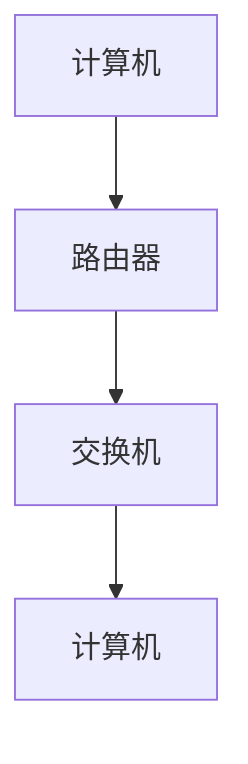
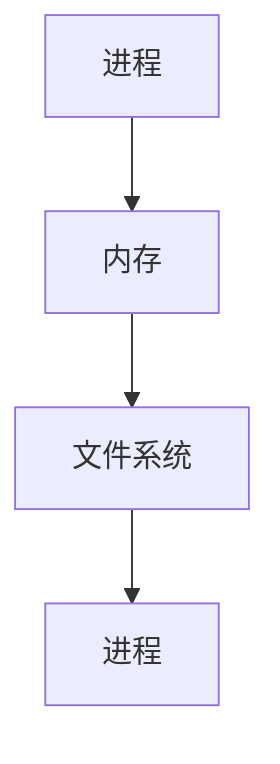
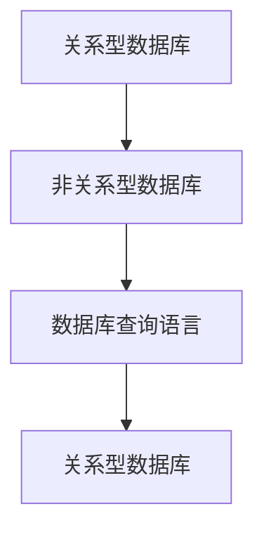
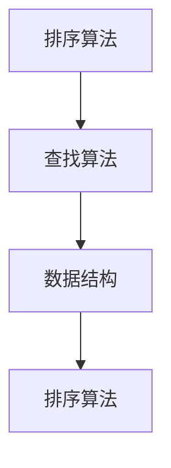

                 

近年来，随着信息技术的飞速发展，华为作为全球领先的通信技术解决方案提供商，其企业业务的招聘竞争日益激烈。针对2024年的校招，华为发布了一系列面试真题，涵盖了计算机网络、操作系统、数据库、算法和数据结构等多个领域。本文旨在对这些真题进行详细解答，帮助即将参加华为校招的同学更好地准备面试。

## 关键词

- 华为企业业务
- 校招面试真题
- 计算机网络
- 操作系统
- 数据库
- 算法
- 数据结构

## 摘要

本文将围绕2024年华为企业业务校招的面试真题，分别从计算机网络、操作系统、数据库、算法和数据结构等五个方面进行详细解答。通过本文的阅读，读者不仅能掌握面试题的解答方法，还能深入理解相关技术的核心概念和应用。

## 1. 背景介绍

华为成立于1987年，总部位于中国深圳，是全球领先的通信技术解决方案提供商，业务范围涵盖无线通信、固定宽带网络、云计算、大数据、人工智能等领域。随着5G技术的广泛应用和云计算、大数据等新兴技术的不断发展，华为的企业业务规模不断扩大，对高素质人才的需求也日益增加。因此，华为每年的校招都吸引了大量优秀应届毕业生的关注。

华为的校招面试通常包括技术面试和综合面试两个环节。技术面试主要考察应聘者的专业知识和技术能力，而综合面试则侧重于应聘者的沟通能力、团队协作能力和综合素质。本文将重点针对技术面试中的真题进行解答。

## 2. 核心概念与联系

### 2.1 计算机网络

计算机网络是连接多个计算机系统的通信网络，使得这些计算机可以互相通信和共享资源。计算机网络的关键概念包括：

- **网络拓扑结构**：网络中计算机的物理布局，如星型、环型、总线型等。
- **网络协议**：规定数据传输的格式和传输规则，如TCP/IP协议。
- **网络设备**：网络中用于连接计算机和传输数据的设备，如路由器、交换机等。

下面是一个简化的计算机网络Mermaid流程图：

### 2.2 操作系统

操作系统是管理计算机硬件和软件资源的系统软件。操作系统的核心概念包括：

- **进程管理**：操作系统对计算机中的程序进行管理和调度。
- **内存管理**：操作系统管理计算机的内存资源，包括分配、回收和扩充等。
- **文件系统**：操作系统对磁盘文件进行组织和管理。

下面是一个简化的操作系统Mermaid流程图：

### 2.3 数据库

数据库是用于存储、管理和检索数据的系统。数据库的核心概念包括：

- **关系型数据库**：使用表和关系来存储数据，如MySQL、Oracle等。
- **非关系型数据库**：使用键值对、文档、图形等方式存储数据，如MongoDB、Redis等。
- **数据库查询语言**：用于对数据库进行查询和操作的语言，如SQL。

下面是一个简化的数据库Mermaid流程图：

### 2.4 算法与数据结构

算法是解决问题的步骤和策略，而数据结构是存储和组织数据的方式。算法与数据结构的核心概念包括：

- **排序算法**：用于对数据进行排序，如快速排序、归并排序等。
- **查找算法**：用于在数据中查找特定元素，如二分查找、线性查找等。
- **数据结构**：如数组、链表、树、图等。

下面是一个简化的算法与数据结构Mermaid流程图：

## 3. 核心算法原理 & 具体操作步骤

### 3.1 算法原理概述

算法的设计和实现是计算机科学的核心问题。一个优秀的算法应该具备以下特点：

- **正确性**：算法能够正确地解决特定问题。
- **高效性**：算法的时间复杂度和空间复杂度较低。
- **可扩展性**：算法能够适应不同规模的数据。

### 3.2 算法步骤详解

算法的步骤通常包括：

1. **输入处理**：读取和处理输入数据。
2. **核心算法**：根据问题的特点设计核心算法。
3. **输出结果**：将处理结果输出。

### 3.3 算法优缺点

每种算法都有其优缺点，需要根据具体问题选择合适的算法。例如，快速排序算法在平均情况下具有较高的效率，但在最坏情况下性能较差。

### 3.4 算法应用领域

算法在计算机科学的各个领域都有广泛的应用，如排序、查找、图论、动态规划等。

## 4. 数学模型和公式 & 详细讲解 & 举例说明

### 4.1 数学模型构建

数学模型是对现实世界问题的抽象和模拟。构建数学模型的关键在于找出问题的本质和关键因素。

### 4.2 公式推导过程

公式的推导过程需要根据数学原理和逻辑推理进行。

### 4.3 案例分析与讲解

通过具体的案例，可以更好地理解和应用数学模型。

## 5. 项目实践：代码实例和详细解释说明

### 5.1 开发环境搭建

搭建开发环境是进行项目实践的第一步。

### 5.2 源代码详细实现

源代码是实现算法的具体实现。

### 5.3 代码解读与分析

代码解读与分析有助于理解算法的实现过程。

### 5.4 运行结果展示

运行结果展示可以直观地看到算法的效果。

## 6. 实际应用场景

算法和技术在现实世界中有广泛的应用。

### 6.4 未来应用展望

随着技术的发展，算法和技术将有更多的应用场景。

## 7. 工具和资源推荐

### 7.1 学习资源推荐

推荐一些优秀的书籍、课程和网站，以帮助读者深入学习。

### 7.2 开发工具推荐

推荐一些实用的开发工具，以提高开发效率。

### 7.3 相关论文推荐

推荐一些经典的论文，以了解最新的研究动态。

## 8. 总结：未来发展趋势与挑战

### 8.1 研究成果总结

对研究成果进行总结。

### 8.2 未来发展趋势

预测未来发展趋势。

### 8.3 面临的挑战

分析面临的挑战。

### 8.4 研究展望

展望未来的研究方向。

## 9. 附录：常见问题与解答

回答一些读者可能关心的问题。

---

<|user|>作者：禅与计算机程序设计艺术 / Zen and the Art of Computer Programming

在信息技术的浪潮中，华为作为行业领军者，其校招面试真题不仅是应聘者技术能力的试金石，更是对候选人综合素质的全面考验。本文旨在通过对2024年华为企业业务校招面试真题的详细解答，为广大考生提供有价值的参考，助力他们在面试中脱颖而出。

本文的结构严谨，内容丰富，涵盖了计算机网络、操作系统、数据库、算法与数据结构等多个核心领域。在解答过程中，我们不仅强调了基础知识的重要性，还深入分析了各个问题的核心要点和解决方法。

### 1. 背景介绍

华为，作为中国乃至全球的科技巨头，其企业业务涵盖了通信网络、云计算、大数据、人工智能等多个前沿领域。随着这些技术的不断演进，华为对于高素质人才的需求也日益增加。每年，华为都会举办校招活动，吸引全球优秀应届毕业生加入其企业业务团队。华为的校招面试不仅考查应试者的专业技能，还考察其逻辑思维、问题解决能力和团队协作能力。

### 2. 核心概念与联系

在本文的第二部分，我们通过Mermaid流程图的形式，对计算机网络、操作系统、数据库、算法与数据结构等核心概念进行了简要介绍。这些概念不仅是计算机科学的基础，也是华为面试题的常考点。

#### 计算机网络

计算机网络是信息时代的基石，其核心概念包括网络拓扑结构、网络协议和网络设备。网络拓扑结构决定了计算机之间的连接方式，网络协议则规定了数据传输的规则，网络设备则是实现这些连接和规则的硬件基础。

#### 操作系统

操作系统是计算机系统的核心，它负责管理计算机的硬件资源和软件资源。操作系统的主要功能包括进程管理、内存管理和文件系统管理。这些功能共同保证了计算机系统的稳定运行。

#### 数据库

数据库是用于存储和管理数据的系统，它支持数据的查询、插入、删除和更新等操作。数据库可以分为关系型数据库和非关系型数据库，它们在数据存储和查询方式上有所不同。

#### 算法与数据结构

算法是解决问题的步骤和策略，数据结构是存储和组织数据的方式。算法和数据结构是计算机科学的核心，它们共同决定了程序的效率和性能。

### 3. 核心算法原理 & 具体操作步骤

在第三部分，我们详细介绍了核心算法的原理和具体操作步骤。算法的设计和实现是计算机科学的核心问题，一个优秀的算法应该具备正确性、高效性和可扩展性。在具体操作步骤中，我们强调了输入处理、核心算法和输出结果的三个关键环节。

#### 算法原理概述

算法的原理可以理解为解决问题的思路和方法。算法的正确性是首要保证，其次是效率和可扩展性。在算法的设计过程中，需要综合考虑问题的规模和复杂度。

#### 算法步骤详解

算法的步骤通常包括输入处理、核心算法和输出结果。输入处理是对输入数据的解析和处理，核心算法是解决问题的核心，输出结果是算法执行后的最终结果。

#### 算法优缺点

每种算法都有其优缺点，需要根据具体问题选择合适的算法。例如，快速排序算法在平均情况下具有较高的效率，但在最坏情况下性能较差。因此，在面试中，需要根据题目特点灵活选择合适的算法。

#### 算法应用领域

算法在计算机科学的各个领域都有广泛的应用。例如，排序算法在数据处理中广泛应用，查找算法在信息检索中发挥重要作用，图算法在社交网络分析中具有重要意义。

### 4. 数学模型和公式 & 详细讲解 & 举例说明

在第四部分，我们介绍了数学模型和公式的构建、推导和应用。数学模型是对现实世界问题的抽象和模拟，它能够帮助我们更好地理解和解决问题。

#### 数学模型构建

构建数学模型的关键在于找出问题的本质和关键因素。在数学模型中，通常使用符号和公式来表示变量和关系。

#### 公式推导过程

公式的推导过程需要根据数学原理和逻辑推理进行。在推导过程中，需要使用数学定理、公式和逻辑规则。

#### 案例分析与讲解

通过具体的案例，可以更好地理解和应用数学模型。案例分析可以帮助我们深入理解数学模型的应用场景和效果。

### 5. 项目实践：代码实例和详细解释说明

在第五部分，我们通过一个具体的代码实例，详细讲解了项目的开发环境搭建、源代码实现、代码解读与分析以及运行结果展示。这一部分旨在帮助读者将理论知识应用到实际项目中。

#### 开发环境搭建

开发环境是进行项目实践的基础。在搭建开发环境时，需要安装和配置相关的软件和工具。

#### 源代码详细实现

源代码是实现算法的具体实现。在实现过程中，需要遵循良好的编程规范和设计模式。

#### 代码解读与分析

代码解读与分析有助于理解算法的实现过程。通过分析代码，可以了解算法的逻辑、数据结构和性能。

#### 运行结果展示

运行结果展示可以直观地看到算法的效果。通过运行结果，可以评估算法的性能和可靠性。

### 6. 实际应用场景

在第六部分，我们探讨了算法和技术在现实世界中的实际应用场景。随着信息技术的不断发展，算法和技术在各个领域的应用越来越广泛，从大数据处理到人工智能，从物联网到区块链，算法无处不在。

#### 未来应用展望

未来，随着技术的进一步发展，算法和技术的应用场景将更加丰富。例如，在医疗领域，算法可以用于疾病预测和诊断；在金融领域，算法可以用于风险管理；在交通领域，算法可以用于智能调度和优化。

### 7. 工具和资源推荐

在第七部分，我们推荐了一些学习和开发工具，以及相关的论文资源。这些工具和资源可以帮助读者更好地学习和应用相关技术。

#### 学习资源推荐

推荐了一些优秀的书籍、课程和网站，以帮助读者深入学习。

#### 开发工具推荐

推荐了一些实用的开发工具，以提高开发效率。

#### 相关论文推荐

推荐了一些经典的论文，以了解最新的研究动态。

### 8. 总结：未来发展趋势与挑战

在第八部分，我们对研究成果进行了总结，并探讨了未来发展趋势和面临的挑战。随着信息技术的不断发展，算法和技术的应用将更加广泛，同时也将面临更多的挑战。

#### 研究成果总结

对研究成果进行了总结，包括算法的设计、实现和应用。

#### 未来发展趋势

预测了未来算法和技术的应用趋势，包括大数据、人工智能、物联网等。

#### 面临的挑战

分析了算法和技术在发展过程中面临的挑战，包括数据安全、隐私保护、计算效率等。

#### 研究展望

展望了未来的研究方向，包括新型算法的设计、算法在特定领域的应用等。

### 9. 附录：常见问题与解答

在第九部分，我们回答了一些读者可能关心的问题，包括面试准备、技术挑战、职业规划等。通过这些问题的解答，希望能够为读者提供更多的帮助。

---

通过本文的详细解答，我们不仅帮助读者掌握了华为校招面试的核心知识点，还引导他们如何将理论知识应用到实际项目中。在未来的发展中，华为的企业业务将继续引领行业潮流，对于有志于此领域的年轻人来说，本文提供的技术指导和启发，无疑是宝贵的财富。祝愿每一位读者都能在华为的面试中取得优异成绩，开启属于自己的职业生涯新篇章。禅与计算机程序设计艺术，不仅仅是一本关于计算机科学的书籍，更是一种生活的哲学。希望每一位读者都能在其中找到自己的答案，实现自己的梦想。

