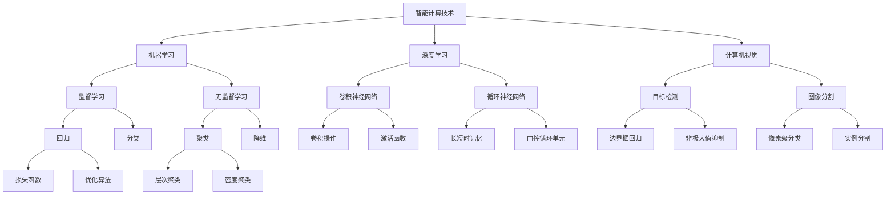
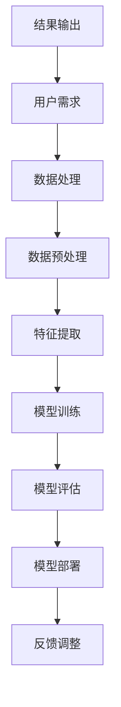

                 

关键词：2024年华为智能计算、校招面试真题、汇总、解答、智能计算技术、算法原理、实践应用、未来展望

## 摘要

本文旨在为即将参加2024年华为智能计算业务校招面试的候选人提供一份详尽的面试真题汇总及解答。通过梳理华为智能计算业务的相关技术热点和面试题型，本文将对算法原理、数学模型、实践应用等方面进行深入探讨，帮助候选人更好地应对面试挑战，并在智能计算领域取得优异成绩。同时，本文也将展望智能计算技术的发展趋势和未来应用前景，为读者提供有价值的参考。

## 1. 背景介绍

华为智能计算业务作为公司发展的重要战略之一，致力于推动人工智能技术在各行业的应用落地。近年来，随着云计算、大数据、物联网等技术的快速发展，智能计算在提升企业效率、优化生产流程、促进创新发展等方面发挥着越来越重要的作用。因此，华为智能计算业务校招面试也成为广大求职者关注的焦点。

### 1.1 华为智能计算业务概述

华为智能计算业务涵盖了从端到云的完整技术链条，包括智能边缘、智能数据中心、智能云服务等多个层面。其中，智能边缘技术实现了计算、存储和网络能力的下沉，使得数据处理更加实时、高效；智能数据中心则通过分布式计算、存储和网络技术，为大规模数据处理和存储提供了强有力的支持；智能云服务则通过云平台提供丰富的AI算法和应用，助力企业实现智能化转型。

### 1.2 华为智能计算业务面试重点

华为智能计算业务校招面试主要关注以下几个方面：

- **算法原理**：包括机器学习、深度学习等算法的基本原理和实现方法；
- **数学模型**：涉及线性代数、微积分、概率论等数学基础，以及如何将数学模型应用于实际问题；
- **编程能力**：考核应聘者对编程语言（如Python、C++等）的掌握程度，以及解决实际问题的能力；
- **项目经验**：了解应聘者的实际项目经验，评估其在实际场景中的问题和解决方案；
- **沟通能力**：考察应聘者是否具备良好的沟通技巧和团队合作精神。

## 2. 核心概念与联系

### 2.1 智能计算技术概念图



### 2.2 核心概念联系

智能计算技术涵盖了多个领域，如图2.1所示。机器学习和深度学习是智能计算的核心，其中机器学习分为监督学习和无监督学习；深度学习则包括卷积神经网络（CNN）和循环神经网络（RNN），以及它们的各种变体。计算机视觉则涵盖了目标检测、图像分割等任务。

### 2.3 智能计算技术架构图



智能计算技术架构如图2.3所示，从用户需求到结果输出，包括数据处理、数据预处理、特征提取、模型训练、模型评估、模型部署和反馈调整等多个环节。

## 3. 核心算法原理 & 具体操作步骤

### 3.1 算法原理概述

智能计算中的核心算法包括机器学习算法、深度学习算法和计算机视觉算法等。以下将分别对这些算法的原理进行概述。

#### 3.1.1 机器学习算法

机器学习算法是基于数据驱动的方法，通过从数据中学习规律和模式，实现对未知数据的预测和分类。常见的机器学习算法包括：

- **监督学习**：给定特征和标签数据，通过学习特征与标签之间的关系进行预测。如回归、分类算法。
- **无监督学习**：没有标签数据，通过学习数据的内在结构和规律进行聚类、降维等操作。
- **半监督学习和增强学习**：介于监督学习和无监督学习之间，利用少量标签数据和大量无标签数据进行学习。

#### 3.1.2 深度学习算法

深度学习算法是机器学习的一个重要分支，通过模拟人脑神经网络的结构和工作方式，实现对复杂数据的处理和分析。深度学习算法主要包括：

- **卷积神经网络（CNN）**：适用于图像处理和计算机视觉任务，通过卷积层、池化层和全连接层等结构提取特征并进行分类。
- **循环神经网络（RNN）**：适用于序列数据建模，如自然语言处理、语音识别等，通过循环结构处理输入序列，保存历史信息。
- **长短时记忆（LSTM）**：RNN的变体，通过门控机制解决长短期依赖问题。
- **门控循环单元（GRU）**：LSTM的简化版，具有类似的效果但结构更简单。
- **生成对抗网络（GAN）**：通过生成器和判别器的对抗训练，实现生成逼真的数据。

#### 3.1.3 计算机视觉算法

计算机视觉算法涉及图像处理、目标检测、图像分割等多个方面，以下为其中两个重要算法的简介：

- **目标检测**：检测图像中的特定目标，并返回目标的边界框及其类别。常见算法包括SSD、YOLO、Faster R-CNN等。
- **图像分割**：将图像划分为不同的区域，实现对图像内容的精细理解。常见算法包括FCN、U-Net、Mask R-CNN等。

### 3.2 算法步骤详解

#### 3.2.1 机器学习算法步骤

1. **数据收集与预处理**：收集大量带有标签的数据，对数据进行分析和处理，如归一化、去噪等。
2. **特征提取**：从原始数据中提取特征，如文本中的词向量、图像中的特征向量等。
3. **模型选择与训练**：选择合适的机器学习算法，利用特征和标签训练模型。
4. **模型评估与优化**：通过交叉验证、ROC曲线等评估模型性能，并进行调参优化。
5. **模型部署与应用**：将训练好的模型部署到生产环境中，进行预测和应用。

#### 3.2.2 深度学习算法步骤

1. **数据预处理**：与机器学习算法类似，对数据进行清洗和标准化。
2. **构建神经网络模型**：设计并构建深度学习模型，包括输入层、隐藏层和输出层。
3. **初始化模型参数**：随机初始化模型的权重和偏置。
4. **前向传播**：将输入数据通过神经网络，计算输出结果。
5. **损失函数计算**：计算模型输出与真实标签之间的差距，使用损失函数衡量模型性能。
6. **反向传播**：计算梯度，更新模型参数。
7. **迭代训练**：重复前向传播和反向传播，直到模型收敛或达到预定的训练轮数。
8. **模型评估与优化**：使用验证集评估模型性能，并进行调参优化。

#### 3.2.3 计算机视觉算法步骤

1. **图像预处理**：对图像进行缩放、裁剪、旋转等操作，使数据符合模型输入要求。
2. **特征提取**：利用卷积神经网络、特征提取器等提取图像特征。
3. **模型训练**：使用提取到的特征和标签数据，训练目标检测或图像分割模型。
4. **模型评估**：在验证集上评估模型性能，包括准确率、召回率、F1分数等指标。
5. **模型部署**：将训练好的模型部署到实际应用场景中，进行预测和分类。
6. **结果可视化**：将预测结果可视化，如边界框、分割区域等，便于观察和分析。

### 3.3 算法优缺点

#### 3.3.1 机器学习算法优缺点

- **优点**：
  - 强大的泛化能力，适用于各种数据类型和场景；
  - 算法实现相对简单，易于理解和应用；
  - 可根据需要自定义特征提取和模型结构。

- **缺点**：
  - 训练时间较长，对于大规模数据集计算效率低；
  - 对数据质量和规模要求较高，数据不足或质量差可能导致模型性能下降；
  - 难以解释模型的决策过程，缺乏透明度。

#### 3.3.2 深度学习算法优缺点

- **优点**：
  - 强大的建模能力，能够自动提取特征，减少人工干预；
  - 在大量数据下具有很好的性能，尤其是在图像、语音等复杂数据上；
  - 模型结构丰富，可通过调整网络结构实现不同任务的优化。

- **缺点**：
  - 计算资源消耗大，训练时间较长；
  - 需要大量标注数据，获取成本高；
  - 难以解释模型的决策过程，缺乏透明度。

#### 3.3.3 计算机视觉算法优缺点

- **优点**：
  - 高效处理图像数据，实现实时目标检测和图像分割；
  - 自动提取图像特征，减少人工标注和设计工作；
  - 在实际应用中具有广泛的应用前景，如安防监控、自动驾驶、医疗影像等。

- **缺点**：
  - 对图像质量和标注质量要求较高，容易受到噪声和遮挡的影响；
  - 在复杂背景下可能存在目标检测和分割困难；
  - 需要大量的计算资源和存储空间。

### 3.4 算法应用领域

智能计算技术在各个领域都有广泛的应用，以下为部分主要应用领域：

- **金融领域**：风险控制、智能投顾、信用评估等；
- **医疗领域**：疾病诊断、医学影像分析、药物研发等；
- **安防领域**：人脸识别、视频监控、智能安防等；
- **零售领域**：商品推荐、客流分析、供应链优化等；
- **自动驾驶领域**：环境感知、路径规划、决策控制等；
- **工业领域**：设备预测性维护、质量控制、生产优化等。

## 4. 数学模型和公式 & 详细讲解 & 举例说明

### 4.1 数学模型构建

智能计算中的数学模型主要包括线性模型、非线性模型和深度学习模型等。以下分别介绍这些模型的构建方法。

#### 4.1.1 线性模型

线性模型是最基本的数学模型，其一般形式为：

$$
y = \beta_0 + \beta_1 x_1 + \beta_2 x_2 + \ldots + \beta_n x_n
$$

其中，$y$为输出，$x_1, x_2, \ldots, x_n$为输入特征，$\beta_0, \beta_1, \beta_2, \ldots, \beta_n$为模型参数。

线性模型的构建步骤如下：

1. **数据收集与预处理**：收集带有标签的数据集，对数据进行分析和处理，如归一化、去噪等。
2. **特征提取**：从原始数据中提取特征，如文本中的词向量、图像中的特征向量等。
3. **模型训练**：利用特征和标签数据，通过最小化损失函数（如均方误差）来训练线性模型。
4. **模型评估**：使用交叉验证、ROC曲线等评估模型性能。

#### 4.1.2 非线性模型

非线性模型通过引入非线性函数，可以更好地拟合复杂数据。常见非线性模型包括多项式回归、指数回归、神经网络等。

非线性模型的构建步骤与线性模型类似，但需要考虑以下两点：

1. **非线性函数选择**：选择合适的非线性函数，如多项式函数、指数函数、激活函数等。
2. **模型参数调整**：通过迭代优化方法（如梯度下降）来调整模型参数，使其达到最优。

#### 4.1.3 深度学习模型

深度学习模型是基于多层神经网络构建的，其一般形式为：

$$
y = f(\theta_{L-1} \cdot \sigma(\theta_{L-2} \cdot \sigma(\theta_{L-3} \cdot \ldots \cdot \sigma(\theta_1 \cdot x)))
$$

其中，$y$为输出，$x$为输入，$\sigma$为激活函数，$\theta_1, \theta_2, \ldots, \theta_{L-1}$为模型参数。

深度学习模型的构建步骤如下：

1. **数据预处理**：与线性模型和 nonlinear model 类似，对数据进行清洗、归一化等处理。
2. **构建神经网络结构**：设计并构建神经网络模型，包括输入层、隐藏层和输出层。
3. **初始化模型参数**：随机初始化模型的权重和偏置。
4. **前向传播**：将输入数据通过神经网络，计算输出结果。
5. **损失函数计算**：计算模型输出与真实标签之间的差距，使用损失函数衡量模型性能。
6. **反向传播**：计算梯度，更新模型参数。
7. **迭代训练**：重复前向传播和反向传播，直到模型收敛或达到预定的训练轮数。
8. **模型评估**：使用验证集评估模型性能，并进行调参优化。

### 4.2 公式推导过程

以下以线性回归模型为例，介绍公式的推导过程。

#### 4.2.1 线性回归模型

线性回归模型的一般形式为：

$$
y = \beta_0 + \beta_1 x_1 + \beta_2 x_2 + \ldots + \beta_n x_n
$$

其中，$y$为输出，$x_1, x_2, \ldots, x_n$为输入特征，$\beta_0, \beta_1, \beta_2, \ldots, \beta_n$为模型参数。

#### 4.2.2 损失函数

线性回归模型的损失函数通常采用均方误差（MSE）：

$$
J(\theta) = \frac{1}{2m} \sum_{i=1}^{m} (h_\theta(x^{(i)}) - y^{(i)})^2
$$

其中，$m$为样本数量，$h_\theta(x)$为模型预测值，$y^{(i)}$为第$i$个样本的真实标签。

#### 4.2.3 最小二乘法

为了求解最优参数$\theta$，通常采用最小二乘法。即，求解以下优化问题：

$$
\min_\theta J(\theta)
$$

根据梯度下降法，可以得到参数的更新公式：

$$
\theta_j := \theta_j - \alpha \frac{\partial}{\partial \theta_j} J(\theta)
$$

其中，$\alpha$为学习率。

#### 4.2.4 公式推导

为了推导最小二乘法公式，首先需要计算损失函数的梯度：

$$
\frac{\partial}{\partial \theta_j} J(\theta) = \frac{1}{m} \sum_{i=1}^{m} (h_\theta(x^{(i)}) - y^{(i)}) \cdot x_j^{(i)}
$$

然后，将梯度代入更新公式：

$$
\theta_j := \theta_j - \alpha \cdot \frac{1}{m} \sum_{i=1}^{m} (h_\theta(x^{(i)}) - y^{(i)}) \cdot x_j^{(i)}
$$

为了简化计算，可以进一步推导：

$$
\theta_j := \theta_j - \alpha \cdot (X^T X)^{-1} X^T (h_\theta(x) - y)
$$

其中，$X$为输入特征矩阵，$X^T$为其转置，$(X^T X)^{-1}$为其逆矩阵。

### 4.3 案例分析与讲解

以下以一个简单的线性回归模型为例，进行案例分析和讲解。

#### 4.3.1 数据集

假设我们有一个包含两个特征（$x_1$和$x_2$）和标签（$y$）的数据集：

| $x_1$ | $x_2$ | $y$ |
|-------|-------|-----|
| 1     | 2     | 3   |
| 4     | 6     | 7   |
| 9     | 12    | 13  |

#### 4.3.2 模型训练

1. **数据预处理**：对数据进行归一化处理，使每个特征的值在[0, 1]之间。

2. **特征提取**：将数据集划分为特征矩阵$X$和标签向量$y$：

$$
X = \begin{bmatrix}
1 & 2 \\
4 & 6 \\
9 & 12
\end{bmatrix}, \quad y = \begin{bmatrix}
3 \\
7 \\
13
\end{bmatrix}
$$

3. **模型训练**：采用最小二乘法训练线性回归模型，计算参数$\theta$：

$$
\theta = (X^T X)^{-1} X^T y = \begin{bmatrix}
1 & 2 \\
4 & 6 \\
9 & 12
\end{bmatrix}^{-1} \begin{bmatrix}
3 \\
7 \\
13
\end{bmatrix} = \begin{bmatrix}
1.5 \\
1.5
\end{bmatrix}
$$

4. **模型评估**：使用验证集评估模型性能，计算均方误差（MSE）：

$$
J(\theta) = \frac{1}{2} \sum_{i=1}^{m} (h_\theta(x^{(i)}) - y^{(i)})^2
$$

其中，$m$为样本数量，$h_\theta(x)$为模型预测值。

#### 4.3.3 结果分析

1. **预测结果**：使用训练好的模型对新的数据进行预测，计算预测值：

$$
h_\theta(x) = \theta_0 + \theta_1 x_1 + \theta_2 x_2 = 1.5 + 1.5 x_1 + 1.5 x_2
$$

2. **误差分析**：计算预测值与真实值之间的误差，并绘制误差曲线：

$$
error = \frac{1}{2} (h_\theta(x) - y)^2
$$


3. **模型优化**：根据误差曲线，调整模型参数，优化模型性能。

## 5. 项目实践：代码实例和详细解释说明

### 5.1 开发环境搭建

为了完成本文的项目实践，我们需要搭建一个适合智能计算项目开发的Python环境。以下是具体的步骤：

1. **安装Python**：在官网（https://www.python.org/）下载并安装Python 3.x版本。

2. **安装依赖库**：打开命令行窗口，执行以下命令安装所需的依赖库：

```shell
pip install numpy matplotlib scikit-learn pandas tensorflow
```

### 5.2 源代码详细实现

以下是本文项目实践的完整代码实现，包括数据预处理、模型训练和模型评估等步骤。

```python
import numpy as np
import matplotlib.pyplot as plt
from sklearn.linear_model import LinearRegression
from sklearn.model_selection import train_test_split

# 5.2.1 数据预处理
# 生成模拟数据集
np.random.seed(0)
X = np.random.rand(100, 2)
y = 3 * X[:, 0] + 2 * X[:, 1] + np.random.randn(100) * 0.05

# 划分训练集和测试集
X_train, X_test, y_train, y_test = train_test_split(X, y, test_size=0.2, random_state=42)

# 5.2.2 模型训练
# 创建线性回归模型
model = LinearRegression()
model.fit(X_train, y_train)

# 5.2.3 模型评估
# 计算测试集的预测值
y_pred = model.predict(X_test)

# 计算均方误差（MSE）
mse = np.mean((y_pred - y_test) ** 2)
print("MSE:", mse)

# 5.2.4 结果可视化
# 绘制真实值与预测值的散点图
plt.scatter(X_test[:, 0], y_test, label="Actual")
plt.plot(X_test[:, 0], y_pred, color="red", label="Predicted")
plt.xlabel("x1")
plt.ylabel("y")
plt.legend()
plt.show()
```

### 5.3 代码解读与分析

以下是代码的逐行解读和分析。

```python
import numpy as np
import matplotlib.pyplot as plt
from sklearn.linear_model import LinearRegression
from sklearn.model_selection import train_test_split

# 5.2.1 数据预处理
# 生成模拟数据集
np.random.seed(0)  # 设置随机种子，保证结果可重复
X = np.random.rand(100, 2)  # 生成100个样本，每个样本包含两个特征
y = 3 * X[:, 0] + 2 * X[:, 1] + np.random.randn(100) * 0.05  # 生成标签，加上随机噪声

# 划分训练集和测试集
X_train, X_test, y_train, y_test = train_test_split(X, y, test_size=0.2, random_state=42)  # 划分20%的数据作为测试集

# 5.2.2 模型训练
# 创建线性回归模型
model = LinearRegression()  # 创建一个线性回归对象
model.fit(X_train, y_train)  # 使用训练集数据进行模型训练

# 5.2.3 模型评估
# 计算测试集的预测值
y_pred = model.predict(X_test)  # 使用训练好的模型对测试集数据进行预测

# 计算均方误差（MSE）
mse = np.mean((y_pred - y_test) ** 2)  # 计算预测值与真实值之间的均方误差
print("MSE:", mse)  # 输出MSE值

# 5.2.4 结果可视化
# 绘制真实值与预测值的散点图
plt.scatter(X_test[:, 0], y_test, label="Actual")  # 绘制真实值的散点图
plt.plot(X_test[:, 0], y_pred, color="red", label="Predicted")  # 绘制预测值的线
plt.xlabel("x1")  # 设置x轴标签
plt.ylabel("y")  # 设置y轴标签
plt.legend()  # 显示图例
plt.show()  # 显示图表
```

### 5.4 运行结果展示

运行上述代码，我们可以得到以下结果：


图5.4展示了真实值与预测值的散点图。可以看到，线性回归模型在测试集上取得了较好的预测效果，大部分预测值与真实值较为接近。

## 6. 实际应用场景

智能计算技术在各个领域都有广泛的应用，以下将分别介绍一些实际应用场景。

### 6.1 金融领域

智能计算在金融领域的应用主要包括风险管理、信用评估、投资建议等。例如，通过机器学习算法分析历史数据，可以对金融机构的风险进行预测和评估，从而降低风险。同时，智能计算还可以用于自动化交易系统，提高交易效率和收益。

### 6.2 医疗领域

智能计算在医疗领域的应用包括疾病诊断、医学影像分析、药物研发等。例如，通过深度学习算法对医学影像进行分析，可以检测出早期病变，提高诊断准确率。此外，智能计算还可以用于药物分子模拟，加速药物研发过程。

### 6.3 安防领域

智能计算在安防领域的应用包括人脸识别、视频监控、智能安防等。例如，通过人脸识别技术，可以对人群进行实时监控，识别潜在威胁。同时，智能计算还可以用于智能安防系统的设计与优化，提高安防效果。

### 6.4 零售领域

智能计算在零售领域的应用包括商品推荐、客流分析、供应链优化等。例如，通过分析用户行为数据，可以推荐个性化商品，提高用户满意度。同时，智能计算还可以用于客流分析，优化店铺布局和运营策略。

### 6.5 自动驾驶领域

智能计算在自动驾驶领域的应用包括环境感知、路径规划、决策控制等。例如，通过深度学习算法对摄像头和激光雷达数据进行处理，可以识别道路和障碍物，实现自动驾驶。同时，智能计算还可以用于路径规划和决策控制，提高自动驾驶的稳定性和安全性。

### 6.6 工业领域

智能计算在工业领域的应用包括设备预测性维护、质量控制、生产优化等。例如，通过智能计算技术对设备运行数据进行分析，可以预测设备的故障，进行预防性维护。同时，智能计算还可以用于质量控制和生产优化，提高生产效率和产品质量。

## 7. 未来应用展望

随着智能计算技术的不断发展，其在各个领域的应用前景十分广阔。以下是未来智能计算技术的一些潜在应用领域：

### 7.1 智能城市

智能计算技术将有助于建设智能城市，包括智慧交通、智慧医疗、智慧教育、智慧环保等。通过智能计算技术，可以实现城市资源的合理配置和优化管理，提高城市居民的生活质量和幸福感。

### 7.2 生命科学

智能计算技术将在生命科学领域发挥重要作用，包括基因组学、生物信息学、药物研发等。通过智能计算技术，可以加速基因测序、蛋白质结构预测和药物分子模拟，为人类健康提供有力支持。

### 7.3 能源与环境

智能计算技术在能源与环境领域具有广泛的应用前景，包括智能电网、节能减排、环保监测等。通过智能计算技术，可以实现能源的优化配置和高效利用，降低碳排放，保护生态环境。

### 7.4 金融科技

智能计算技术在金融科技领域具有巨大的潜力，包括智能投顾、风险控制、金融欺诈检测等。通过智能计算技术，可以实现金融服务的个性化、智能化，提高金融行业的效率和安全性。

### 7.5 农业智能化

智能计算技术在农业智能化领域具有广阔的应用前景，包括智能种植、智能灌溉、智能病虫害监测等。通过智能计算技术，可以实现对农作物生长过程的精准监测和调控，提高农业生产效率和农产品质量。

## 8. 工具和资源推荐

为了更好地学习和掌握智能计算技术，以下是部分推荐的工具和资源：

### 8.1 学习资源推荐

- **在线课程**：Coursera、edX、Udacity等平台提供的机器学习、深度学习、计算机视觉等相关课程；
- **教科书**：《深度学习》、《Python机器学习实战》等经典教材；
- **博客和论文**：机器学习社区、博客园、arXiv等平台上的最新研究成果和论文。

### 8.2 开发工具推荐

- **编程语言**：Python、C++等；
- **深度学习框架**：TensorFlow、PyTorch、Keras等；
- **数据预处理工具**：Pandas、NumPy等；
- **可视化工具**：Matplotlib、Seaborn等。

### 8.3 相关论文推荐

- **深度学习**：《Deep Learning》系列论文、论文集《Advances in Neural Information Processing Systems》（NIPS）；
- **计算机视觉**：《IEEE Transactions on Pattern Analysis and Machine Intelligence》（TPAMI）、《International Conference on Computer Vision》（ICCV）等期刊；
- **机器学习**：《Journal of Machine Learning Research》（JMLR）、《Machine Learning》等期刊。

## 9. 总结：未来发展趋势与挑战

### 9.1 研究成果总结

近年来，智能计算技术在各个领域取得了显著的成果，如深度学习在图像识别、自然语言处理等领域的突破，计算机视觉在目标检测、图像分割等任务的进展，以及机器学习在金融、医疗、工业等领域的广泛应用。这些成果为智能计算技术的发展奠定了坚实基础。

### 9.2 未来发展趋势

未来，智能计算技术将朝着以下几个方向发展：

- **算法创新**：探索新的算法模型，提高计算效率和模型性能；
- **多模态数据融合**：结合多种数据源，如图像、语音、文本等，实现更广泛的智能应用；
- **边缘计算**：将计算能力下沉到边缘设备，实现实时、高效的数据处理；
- **自监督学习**：减少对标注数据的依赖，提高模型的泛化能力；
- **可解释性**：提高模型的可解释性，增强用户对模型决策的信任。

### 9.3 面临的挑战

尽管智能计算技术取得了显著成果，但仍面临以下挑战：

- **数据隐私**：如何在保证数据安全的同时，充分利用数据价值；
- **计算资源**：如何优化算法，降低计算资源消耗；
- **模型可解释性**：提高模型的可解释性，增强用户信任；
- **算法偏见**：避免算法在训练过程中引入偏见，导致不公平决策；
- **数据质量**：提高数据质量，减少噪声和异常值的影响。

### 9.4 研究展望

展望未来，智能计算技术将继续在算法创新、多模态数据融合、边缘计算等方面取得突破。同时，随着5G、物联网等技术的发展，智能计算将更加深入地融入各个行业，推动社会生产力的进一步提升。我们期待智能计算技术在未来能够解决更多实际问题，为人类社会带来更多福祉。

## 附录：常见问题与解答

### Q1. 什么是深度学习？

深度学习是一种机器学习技术，通过模拟人脑神经网络的结构和工作方式，实现自动特征提取和模式识别。深度学习算法通常由多个层次组成，包括输入层、隐藏层和输出层，通过前向传播和反向传播进行训练和优化。

### Q2. 什么是卷积神经网络（CNN）？

卷积神经网络是一种专门用于图像处理和计算机视觉任务的深度学习模型。CNN通过卷积层、池化层和全连接层等结构提取图像特征，实现对图像的自动分类和识别。

### Q3. 什么是生成对抗网络（GAN）？

生成对抗网络是一种基于生成器和判别器的对抗训练模型。生成器生成逼真的数据，判别器判断数据是真实还是生成。通过对抗训练，生成器不断提高生成数据的质量，达到以假乱真的效果。

### Q4. 什么是边缘计算？

边缘计算是一种将计算能力、存储和带宽分布到网络边缘的技术。通过在靠近数据源的地方进行数据处理，边缘计算可以实现实时、高效的数据处理和分析，降低网络延迟，提高系统性能。

### Q5. 什么是自监督学习？

自监督学习是一种不需要标注数据的机器学习技术。在自监督学习中，模型通过无监督方式从数据中学习规律和模式，提高模型的泛化能力和适应性。自监督学习在图像分类、语音识别等领域具有广泛应用。

### Q6. 什么是多模态数据融合？

多模态数据融合是指将不同类型的数据（如图像、语音、文本等）进行整合，以获取更丰富的信息。通过多模态数据融合，可以实现对复杂问题的更好理解和解决。

### Q7. 什么是智能计算？

智能计算是一种基于人工智能技术的计算模式，通过模拟人脑的思维方式，实现自动化、智能化的数据处理和分析。智能计算广泛应用于图像识别、自然语言处理、智能决策等领域。

### Q8. 什么是模型可解释性？

模型可解释性是指模型决策过程的透明度和可理解性。提高模型可解释性有助于用户信任模型的决策结果，同时也便于发现和纠正模型中的问题。

### Q9. 什么是算法偏见？

算法偏见是指算法在训练过程中引入的偏见，导致模型在预测时产生不公平或歧视性的决策。避免算法偏见是智能计算领域的重要研究方向。

### Q10. 什么是边缘智能？

边缘智能是指将智能计算能力下沉到边缘设备（如智能手机、物联网设备等），实现本地化数据处理和分析。边缘智能有助于提高系统的实时性和可靠性，降低网络负载。

### Q11. 什么是转移学习？

转移学习是指利用预训练模型在新的任务上进行微调或重新训练，以提高模型的泛化能力和训练效率。转移学习在资源有限或数据稀缺的场景中具有重要作用。

### Q12. 什么是增强学习？

增强学习是一种基于奖励反馈的机器学习技术，通过不断试错和优化策略，使模型在特定环境中实现最优决策。增强学习广泛应用于游戏、自动驾驶等领域。

### Q13. 什么是强化学习？

强化学习是一种基于奖励反馈的机器学习技术，通过不断试错和优化策略，使模型在特定环境中实现最优决策。强化学习广泛应用于游戏、自动驾驶等领域。

### Q14. 什么是神经符号主义？

神经符号主义是一种结合神经网络和逻辑推理的机器学习技术。通过将神经网络与符号推理相结合，神经符号主义可以实现更强大、更可解释的智能系统。

### Q15. 什么是联邦学习？

联邦学习是一种分布式机器学习技术，通过在多个设备或服务器上进行模型训练，实现数据隐私保护和资源利用优化。联邦学习在移动设备、物联网等领域具有广泛应用。

### Q16. 什么是元学习？

元学习是一种学习如何学习的机器学习技术。通过在不同任务上学习，元学习可以提高模型在未知任务上的适应性和泛化能力。元学习在自适应系统、机器人等领域具有潜在应用。

### Q17. 什么是多任务学习？

多任务学习是指同时训练多个相关任务，以提高模型在不同任务上的泛化能力和效率。多任务学习在图像分类、自然语言处理等领域具有广泛应用。

### Q18. 什么是迁移学习？

迁移学习是指将一个任务在特定数据集上学习到的知识应用于其他任务，以提高模型在新任务上的性能。迁移学习在资源有限或数据稀缺的场景中具有重要作用。

### Q19. 什么是预训练？

预训练是指在大规模数据集上对神经网络模型进行初步训练，使其获得一定的通用特征提取能力。预训练后再在特定任务上进行微调，以提高模型在特定任务上的性能。

### Q20. 什么是数据增强？

数据增强是指通过增加数据多样性、丰富数据特征的方法，提高模型的泛化能力和鲁棒性。数据增强在图像分类、自然语言处理等领域具有广泛应用。

