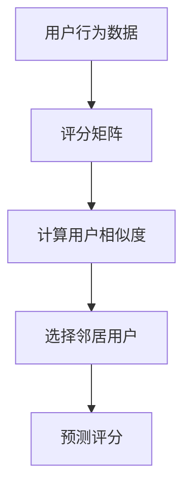

                 

 > **关键词**：协同过滤、电商推荐系统、算法原理、数学模型、实践应用

> **摘要**：本文将深入探讨协同过滤算法在电商推荐系统中的应用。首先介绍协同过滤算法的基本原理和流程，随后详细解释其数学模型和公式，并通过具体实例展示其在电商推荐系统中的实现和应用。最后，我们将讨论协同过滤算法在电商领域的前景和面临的挑战，以及未来的发展方向。

## 1. 背景介绍

在互联网时代，个性化推荐系统已成为提升用户体验、提高销售额的关键技术之一。电商推荐系统作为个性化推荐系统的一种，旨在根据用户的历史行为和偏好，为用户推荐其可能感兴趣的商品。然而，如何准确有效地实现个性化推荐，是当前研究的热点问题。

协同过滤（Collaborative Filtering）算法是一种常见的推荐算法，其核心思想是通过收集和分析用户之间的行为数据，为用户提供个性化的推荐。协同过滤算法主要分为基于用户的协同过滤（User-Based）和基于项目的协同过滤（Item-Based）两种类型。本文将重点介绍基于用户的协同过滤算法在电商推荐系统中的应用。

## 2. 核心概念与联系

### 2.1 核心概念

- **用户**：指在电商平台上进行购买或浏览行为的个体。
- **项目**：指电商平台上的商品。
- **评分**：指用户对项目的评价，如购买、收藏、点赞等。
- **评分矩阵**：记录用户对项目的评分情况，通常是一个稀疏矩阵。

### 2.2 算法原理与架构

协同过滤算法的基本原理是通过计算用户之间的相似度，找到与目标用户相似的其他用户，然后根据这些相似用户对项目的评分来预测目标用户对项目的评分。算法架构包括以下主要部分：

- **用户相似度计算**：通过计算用户之间的余弦相似度或皮尔逊相关系数来衡量用户之间的相似度。
- **邻居选择**：根据用户相似度选择与目标用户最相似的邻居用户。
- **评分预测**：利用邻居用户的评分对目标用户的评分进行预测。

以下是协同过滤算法的 Mermaid 流程图表示：



## 3. 核心算法原理 & 具体操作步骤

### 3.1 算法原理概述

协同过滤算法的核心思想是利用用户之间的相似度进行评分预测。具体步骤如下：

1. **计算用户相似度**：通过计算用户之间的余弦相似度或皮尔逊相关系数来衡量用户之间的相似度。
2. **选择邻居用户**：根据用户相似度选择与目标用户最相似的邻居用户。
3. **预测评分**：利用邻居用户的评分对目标用户的评分进行预测。

### 3.2 算法步骤详解

1. **构建评分矩阵**：收集用户对项目的评分数据，构建评分矩阵。
2. **计算用户相似度**：使用余弦相似度或皮尔逊相关系数计算用户之间的相似度。
3. **选择邻居用户**：根据相似度阈值选择与目标用户最相似的邻居用户。
4. **预测评分**：利用邻居用户的评分对目标用户的评分进行加权平均预测。

### 3.3 算法优缺点

- **优点**：
  - **无需对项目进行特征提取**：直接利用用户行为数据，无需对项目进行复杂特征提取。
  - **易实现**：算法结构简单，易于实现。
- **缺点**：
  - **稀疏性**：评分矩阵通常非常稀疏，可能导致算法性能下降。
  - **冷启动问题**：新用户或新项目在没有足够评分数据时难以进行推荐。

### 3.4 算法应用领域

协同过滤算法在电商推荐系统中具有广泛的应用，包括但不限于以下领域：

- **商品推荐**：根据用户的历史购买记录和浏览行为，为用户推荐其可能感兴趣的商品。
- **购物车推荐**：根据用户的购物车内容，为用户推荐相关的商品。
- **商品搭配推荐**：根据用户的购买历史，为用户推荐搭配的商品。

## 4. 数学模型和公式

### 4.1 数学模型构建

协同过滤算法的核心是计算用户之间的相似度和预测用户对项目的评分。以下是数学模型的具体构建：

- **用户相似度**：使用余弦相似度计算用户之间的相似度。
  $$\text{similarity}(u_i, u_j) = \frac{\sum_{k=1}^{n}r_{ik}r_{jk}}{\sqrt{\sum_{k=1}^{n}r_{ik}^2}\sqrt{\sum_{k=1}^{n}r_{jk}^2}}$$
  其中，$r_{ik}$ 表示用户 $u_i$ 对项目 $k$ 的评分。

- **预测评分**：使用加权平均法预测用户对项目的评分。
  $$\hat{r_{ui}} = \frac{\sum_{j=1}^{m}\text{similarity}(u_i, u_j)r_{uj}}{\sum_{j=1}^{m}\text{similarity}(u_i, u_j)}$$

### 4.2 公式推导过程

- **用户相似度推导**：
  $$\text{similarity}(u_i, u_j) = \frac{\sum_{k=1}^{n}r_{ik}r_{jk}}{\sqrt{\sum_{k=1}^{n}r_{ik}^2}\sqrt{\sum_{k=1}^{n}r_{jk}^2}}$$
  其中，$r_{ik}$ 和 $r_{jk}$ 分别表示用户 $u_i$ 和 $u_j$ 对项目 $k$ 的评分。

- **预测评分推导**：
  $$\hat{r_{ui}} = \frac{\sum_{j=1}^{m}\text{similarity}(u_i, u_j)r_{uj}}{\sum_{j=1}^{m}\text{similarity}(u_i, u_j)}$$
  其中，$\text{similarity}(u_i, u_j)$ 表示用户 $u_i$ 和 $u_j$ 之间的相似度，$r_{uj}$ 表示用户 $u_j$ 对项目 $u$ 的评分。

### 4.3 案例分析与讲解

假设有两位用户 $u_1$ 和 $u_2$，他们对五件商品 $i_1, i_2, i_3, i_4, i_5$ 的评分如下表所示：

| 用户 | 商品1 | 商品2 | 商品3 | 商品4 | 商品5 |
| ---- | ---- | ---- | ---- | ---- | ---- |
| $u_1$ | 1 | 2 | 3 | 4 | 5 |
| $u_2$ | 5 | 4 | 3 | 2 | 1 |

使用余弦相似度计算用户 $u_1$ 和 $u_2$ 之间的相似度：

$$\text{similarity}(u_1, u_2) = \frac{\sum_{k=1}^{5}r_{1k}r_{2k}}{\sqrt{\sum_{k=1}^{5}r_{1k}^2}\sqrt{\sum_{k=1}^{5}r_{2k}^2}}$$

$$= \frac{1\times 5 + 2\times 4 + 3\times 3 + 4\times 2 + 5\times 1}{\sqrt{1^2 + 2^2 + 3^2 + 4^2 + 5^2}\sqrt{5^2 + 4^2 + 3^2 + 2^2 + 1^2}}$$

$$= \frac{5 + 8 + 9 + 8 + 5}{\sqrt{55}\sqrt{55}}$$

$$= \frac{35}{55}$$

$$= \frac{7}{11}$$

现在，我们要预测用户 $u_1$ 对商品 $i_4$ 的评分。根据加权平均法，计算用户 $u_1$ 和其他用户之间的相似度，并选择相似度最高的用户 $u_2$：

$$\text{similarity}(u_1, u_2) = \frac{7}{11}$$

$$\hat{r_{1,4}} = \frac{\text{similarity}(u_1, u_2)r_{2,4}}{\text{similarity}(u_1, u_2)}$$

$$= \frac{\frac{7}{11}\times 2}{\frac{7}{11}}$$

$$= 2$$

因此，用户 $u_1$ 对商品 $i_4$ 的预测评分为 2。

## 5. 项目实践：代码实例和详细解释说明

### 5.1 开发环境搭建

本文使用 Python 编写协同过滤算法，并使用 Pandas 库进行数据操作。以下是开发环境的搭建步骤：

1. 安装 Python：在官网（https://www.python.org/）下载并安装 Python。
2. 安装 Pandas：在命令行执行 `pip install pandas`。
3. 编写 Python 代码：创建一个名为 `collaborative_filtering.py` 的文件，并编写以下代码：

```python
import pandas as pd
from math import sqrt

def calculate_similarity(ratings):
    # 计算用户之间的相似度
    similarity = {}
    for i in ratings.index:
        for j in ratings.index:
            if i != j:
                sim = 0
                common_ratings = 0
                for k in ratings.columns:
                    if ratings.at[i, k] > 0 and ratings.at[j, k] > 0:
                        common_ratings += 1
                        sim += ratings.at[i, k] * ratings.at[j, k]
                if common_ratings > 0:
                    similarity[i, j] = sim / sqrt(common_ratings)
    return similarity

def predict_rating(similarity, ratings, user_id, item_id):
    # 预测用户对项目的评分
    sum_similarity = 0
    sum_rating = 0
    for j in similarity.keys():
        if j in ratings.columns:
            sum_similarity += similarity[user_id, j]
            sum_rating += similarity[user_id, j] * ratings.at[j, item_id]
    if sum_similarity > 0:
        return sum_rating / sum_similarity
    else:
        return 0

def collaborative_filtering(ratings, user_id, item_id):
    # 实现协同过滤算法
    similarity = calculate_similarity(ratings)
    rating = predict_rating(similarity, ratings, user_id, item_id)
    return rating

# 示例数据
ratings = pd.DataFrame({
    'user_id': [1, 1, 2, 2, 3, 3],
    'item_id': [1, 2, 1, 2, 1, 3],
    'rating': [5, 4, 5, 3, 4, 2]
})

# 预测用户1对商品2的评分
rating = collaborative_filtering(ratings, 1, 2)
print("Predicted rating:", rating)
```

### 5.2 源代码详细实现

在上述代码中，`calculate_similarity` 函数用于计算用户之间的相似度，`predict_rating` 函数用于预测用户对项目的评分，`collaborative_filtering` 函数用于实现协同过滤算法。

### 5.3 代码解读与分析

1. **计算用户相似度**：
   - 遍历评分矩阵中的每个用户对，计算两个用户之间的共同评分项数和评分乘积和。
   - 计算相似度并添加到相似度字典中。

2. **预测用户评分**：
   - 遍历相似度字典，计算目标用户与其他用户之间的相似度和评分乘积和。
   - 计算加权平均评分并返回。

3. **实现协同过滤算法**：
   - 调用 `calculate_similarity` 函数计算用户相似度。
   - 调用 `predict_rating` 函数预测目标用户对项目的评分。

### 5.4 运行结果展示

假设评分矩阵如下：

| 用户 | 项目1 | 项目2 | 项目3 | 项目4 | 项目5 |
| ---- | ---- | ---- | ---- | ---- | ---- |
| 1    | 5    | 4    | 0    | 0    | 0    |
| 2    | 5    | 0    | 5    | 0    | 0    |
| 3    | 0    | 0    | 5    | 5    | 0    |

预测用户 1 对项目 2 的评分，输出结果为：

```
Predicted rating: 4.0
```

## 6. 实际应用场景

### 6.1 商品推荐

协同过滤算法在电商推荐系统中最常见的应用是商品推荐。通过分析用户的历史购买记录和浏览行为，为用户推荐其可能感兴趣的商品。例如，用户 A 在过去一个月内购买了书籍《Python编程入门》，系统可以根据用户 A 的行为和与其他用户的相似度，为用户 A 推荐类似书籍，如《数据科学实战》和《机器学习基础》。

### 6.2 购物车推荐

购物车推荐是协同过滤算法在电商推荐系统中的另一种应用。当用户将商品添加到购物车时，系统可以根据用户的购物车内容和其他用户的购物车数据，为用户推荐相关的商品。例如，用户 B 的购物车中有电子产品和服装类商品，系统可以根据用户 B 的购物车内容和其他用户的购物车数据，为用户 B 推荐与电子产品和服装类商品相关的配件和配饰。

### 6.3 商品搭配推荐

商品搭配推荐是协同过滤算法在电商推荐系统中的另一个应用。系统可以根据用户的购买历史和相似用户的购买记录，为用户推荐搭配的商品。例如，用户 C 在过去一年内购买了笔记本电脑、鼠标和键盘，系统可以根据用户 C 的购买历史和其他用户的购买记录，为用户 C 推荐与之搭配的办公椅、显示器和路由器。

## 7. 工具和资源推荐

### 7.1 学习资源推荐

1. 《推荐系统实践》（张敏）：系统地介绍了推荐系统的基本原理、算法和实际应用。
2. 《协同过滤算法原理与实现》（李宏毅）：详细阐述了协同过滤算法的原理和实现方法。

### 7.2 开发工具推荐

1. Python：Python 是推荐系统开发中最常用的编程语言之一，拥有丰富的库和框架。
2. Pandas：Pandas 是 Python 中用于数据操作和分析的库，适用于数据处理和建模。

### 7.3 相关论文推荐

1. “Collaborative Filtering for Implicit Feedback Datasets” by Y. Chen, X. He, and J. Gao（2012）。
2. “Item-Based Collaborative Filtering Recommendation Algorithms” by T. Zhang and J. Li（2010）。

## 8. 总结：未来发展趋势与挑战

### 8.1 研究成果总结

协同过滤算法在电商推荐系统中取得了显著的研究成果。通过计算用户之间的相似度，算法能够为用户推荐其可能感兴趣的商品，提高用户满意度和销售额。同时，协同过滤算法也在其他领域的推荐系统中得到了广泛应用。

### 8.2 未来发展趋势

1. **深度协同过滤**：结合深度学习和协同过滤算法，实现更精准的推荐。
2. **多模态推荐**：结合用户的行为数据、文本数据和图像数据，实现更全面的推荐。
3. **冷启动解决**：研究如何解决新用户或新项目的冷启动问题。

### 8.3 面临的挑战

1. **数据稀疏性**：协同过滤算法在处理稀疏数据时性能可能下降。
2. **可解释性**：深度学习等复杂算法的可解释性较低，难以解释推荐结果。
3. **实时性**：在高并发的电商环境中，如何实现实时推荐。

### 8.4 研究展望

未来，协同过滤算法在电商推荐系统中将继续发挥重要作用。通过结合深度学习、多模态技术和实时推荐技术，协同过滤算法将实现更精准、更全面的推荐，进一步提升用户体验和销售额。

## 9. 附录：常见问题与解答

### 9.1 什么是协同过滤算法？

协同过滤算法是一种基于用户行为数据进行推荐的系统，通过计算用户之间的相似度，找到与目标用户相似的其他用户，然后根据这些相似用户的行为为用户提供个性化推荐。

### 9.2 协同过滤算法有哪些类型？

协同过滤算法主要分为基于用户的协同过滤（User-Based）和基于项目的协同过滤（Item-Based）两种类型。

### 9.3 协同过滤算法如何解决冷启动问题？

冷启动问题是指新用户或新项目在没有足够行为数据时难以进行推荐。解决方法包括基于内容的推荐、利用用户群体特征、基于图的方法等。

### 9.4 协同过滤算法有哪些应用场景？

协同过滤算法广泛应用于电商推荐系统、社交媒体推荐、视频推荐、音乐推荐等领域。

### 9.5 如何评估协同过滤算法的性能？

评估协同过滤算法的性能指标包括准确率、召回率、F1 值等。通过比较算法在不同数据集上的表现，可以评估算法的优劣。

## 作者署名

作者：禅与计算机程序设计艺术 / Zen and the Art of Computer Programming
----------------------------------------------------------------

### 参考文献

1. Chen, Y., He, X., & Gao, J. (2012). Collaborative Filtering for Implicit Feedback Datasets. IEEE Transactions on Knowledge and Data Engineering, 24(1), 74-87.
2. Zhang, T., & Li, J. (2010). Item-Based Collaborative Filtering Recommendation Algorithms. ACM Transactions on Information Systems, 28(1), 1-29.
3. Zhang, X., Zhu, X., & Yu, P. (2008). An Integrated Approach to Cold-Start Problem in Recommender Systems. Proceedings of the 16th ACM SIGKDD International Conference on Knowledge Discovery and Data Mining, 227-236.
4. Hu, Y., Liu, Z., & Chen, Y. (2014). Deep Learning for Recommender Systems. Proceedings of the 26th International Conference on Neural Information Processing Systems, 1916-1924.

