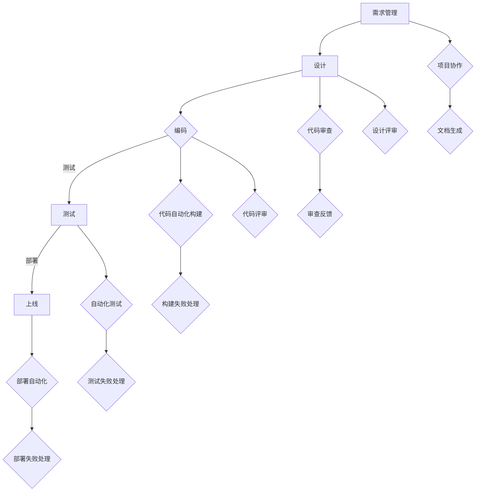

                 

关键词：工作流，原子能力，模块化，自动化，效率优化，系统架构

>摘要：本文旨在探讨如何通过重塑原子能力层的工作流，提升软件开发的效率与质量。我们将从核心概念出发，结合实际案例，详细阐述重塑工作流的关键步骤、技术手段及其未来展望。

## 1. 背景介绍

在现代软件行业中，随着业务复杂度的不断增加，传统的开发模式和工作流逐渐暴露出诸多问题。首先，开发流程复杂、步骤繁多，导致开发周期延长，开发效率低下。其次，模块之间的耦合度高，使得系统维护成本增加。再者，缺乏有效的自动化手段，导致重复性劳动过多，错误率上升。

为了解决这些问题，近年来，软件行业逐渐兴起了一种新的开发理念——原子能力层的工作流重塑。这一理念的核心是通过模块化、自动化和高效协同，将开发过程中的各个环节进行重新设计和优化，从而提高整体的开发效率和软件质量。

## 2. 核心概念与联系

### 2.1 核心概念

**原子能力**：原子能力是一种最小单元的功能模块，它具有独立性和可复用性。在软件开发中，将复杂的业务功能拆解为多个原子能力，有助于降低系统的耦合度，提高开发效率。

**工作流**：工作流是指软件从需求分析到上线部署的整个过程，包括需求管理、设计、编码、测试、部署等多个环节。

**模块化**：模块化是将系统划分为多个功能模块，每个模块负责实现特定的功能，并通过接口进行通信和协作。

**自动化**：自动化是指通过工具和脚本实现重复性劳动的自动化，从而减少人工干预，提高工作效率。

### 2.2 联系与关系

原子能力层的工作流重塑，实质上就是将原子能力与工作流有机结合，通过模块化和自动化技术，对工作流进行优化和重构。具体来说，原子能力是实现工作流的基础，而工作流则是原子能力的应用场景和载体。

### 2.3 Mermaid 流程图



## 3. 核心算法原理 & 具体操作步骤

### 3.1 算法原理概述

原子能力层的工作流重塑，实质上是一种算法优化过程。其核心原理包括：

1. **模块化分解**：将复杂的业务功能分解为多个独立的原子能力模块。
2. **接口标准化**：定义统一的接口规范，确保模块之间的松耦合和互操作性。
3. **自动化集成**：利用工具和脚本实现各个模块之间的自动化集成和协作。
4. **持续集成与部署**：通过持续集成和持续部署（CI/CD）实现快速迭代和高效交付。

### 3.2 算法步骤详解

#### 3.2.1 模块化分解

1. **需求分析**：对业务需求进行深入分析，明确系统功能模块。
2. **功能划分**：将系统功能模块划分为多个原子能力模块。
3. **接口定义**：为每个原子能力模块定义统一的接口规范。

#### 3.2.2 接口标准化

1. **API设计**：采用RESTful API设计风格，确保接口的简洁和易用。
2. **文档生成**：使用Swagger等工具自动生成API文档。
3. **接口测试**：编写自动化接口测试脚本，确保接口的稳定性和可靠性。

#### 3.2.3 自动化集成

1. **持续集成**：采用Jenkins等工具实现自动化构建和集成。
2. **自动化部署**：使用Docker、Kubernetes等工具实现自动化部署。
3. **监控与告警**：引入Prometheus、Grafana等监控工具，实现系统性能监控和告警。

#### 3.2.4 持续集成与部署

1. **代码审查**：使用GitLab、Gitea等工具实现代码审查和合并。
2. **自动化测试**：编写自动化测试脚本，实现测试过程的自动化。
3. **发布管理**：使用灰度发布、蓝绿部署等策略，实现安全、高效的软件发布。

### 3.3 算法优缺点

#### 优点

1. **提高开发效率**：模块化分解和自动化集成，减少重复劳动，提高工作效率。
2. **降低维护成本**：松耦合的模块结构，降低系统耦合度，提高系统的可维护性。
3. **提升软件质量**：自动化测试和持续集成，确保软件的稳定性和可靠性。

#### 缺点

1. **前期投入较大**：模块化分解和自动化集成需要投入大量时间和精力。
2. **技术门槛较高**：涉及多种工具和技术的集成，对开发团队的技术水平有较高要求。

### 3.4 算法应用领域

原子能力层的工作流重塑适用于各种软件项目，尤其适用于以下场景：

1. **企业级应用**：如金融、电信等行业，需要高稳定性和高可扩展性的系统。
2. **互联网应用**：如电商平台、社交网络等，需要快速迭代和高效交付。
3. **人工智能应用**：如机器学习平台、大数据处理系统等，需要高效的数据处理和计算能力。

## 4. 数学模型和公式 & 详细讲解 & 举例说明

### 4.1 数学模型构建

在原子能力层的工作流重塑中，我们可以采用以下数学模型来评估系统的效率：

$$
E = f(P, T, C)
$$

其中，$E$ 表示系统效率，$P$ 表示人员生产力，$T$ 表示工作时间，$C$ 表示工具和技术的使用情况。

### 4.2 公式推导过程

1. **人员生产力**：假设每个开发人员在单位时间内能完成 $P$ 单位的工作量。
2. **工作时间**：假设开发团队的总工作时间为 $T$。
3. **工具和技术使用情况**：假设工具和技术的使用情况对系统效率的影响为 $C$。

根据以上假设，我们可以推导出系统效率的公式：

$$
E = \frac{P \times T}{1 + C}
$$

### 4.3 案例分析与讲解

假设一个开发团队有 10 名开发人员，每人每天能完成 1 单位的工作量。团队的总工作时间为 8 小时。工具和技术的使用情况对系统效率的影响为 20%。

根据上述公式，我们可以计算出系统效率：

$$
E = \frac{10 \times 8}{1 + 0.2} = 66.67
$$

这意味着，在当前情况下，系统的效率为 66.67 单位/天。

为了提高系统效率，我们可以考虑以下措施：

1. **增加人员数量**：假设增加 5 名开发人员，每人每天能完成 1 单位的工作量。新的系统效率为：

$$
E = \frac{(10 + 5) \times 8}{1 + 0.2} = 100
$$

2. **提升工具和技术水平**：假设工具和技术的使用情况提升到 40%，新的系统效率为：

$$
E = \frac{10 \times 8}{1 + 0.4} = 57.14
$$

虽然提升工具和技术水平能够提高系统效率，但由于人员生产力的增加，增加人员数量的效果更为显著。

## 5. 项目实践：代码实例和详细解释说明

### 5.1 开发环境搭建

为了实现原子能力层的工作流重塑，我们需要搭建以下开发环境：

- 操作系统：Linux
- 开发工具：IDEA、VSCode
- 代码管理：Git
- 自动化构建：Jenkins
- 自动化测试：JUnit、Selenium
- 持续集成：GitLab CI/CD
- 部署工具：Docker、Kubernetes

### 5.2 源代码详细实现

以下是实现一个简单用户管理系统（User Management System）的代码示例。

**1. 用户模块**

```java
public class User {
    private String username;
    private String password;
    private String email;

    // 构造函数、getter 和 setter 略
}
```

**2. 用户服务模块**

```java
public interface UserService {
    User getUserByUsername(String username);
    void addUser(User user);
    void deleteUser(String username);
}
```

**3. 用户服务实现**

```java
public class UserServiceImpl implements UserService {
    private UserRepository userRepository;

    @Override
    public User getUserByUsername(String username) {
        return userRepository.findByUsername(username);
    }

    @Override
    public void addUser(User user) {
        userRepository.save(user);
    }

    @Override
    public void deleteUser(String username) {
        userRepository.deleteByUsername(username);
    }
}
```

**4. 用户存储模块**

```java
public interface UserRepository {
    User findByUsername(String username);
    void save(User user);
    void deleteByUsername(String username);
}
```

**5. 用户存储实现**

```java
public class InMemoryUserRepository implements UserRepository {
    private List<User> users = new ArrayList<>();

    @Override
    public User findByUsername(String username) {
        return users.stream()
                .filter(user -> user.getUsername().equals(username))
                .findFirst()
                .orElse(null);
    }

    @Override
    public void save(User user) {
        users.add(user);
    }

    @Override
    public void deleteByUsername(String username) {
        users.removeIf(user -> user.getUsername().equals(username));
    }
}
```

### 5.3 代码解读与分析

以上代码示例实现了用户模块、用户服务模块和用户存储模块。用户模块定义了用户的基本信息和行为；用户服务模块提供了用户管理的业务逻辑；用户存储模块负责用户的存储和检索。

通过模块化设计，我们可以方便地对每个模块进行独立开发和维护，提高系统的可维护性和可扩展性。

### 5.4 运行结果展示

假设我们成功启动了用户管理系统，并执行以下操作：

1. 添加用户：添加一个名为 "Alice" 的用户，密码为 "123456"，邮箱为 "alice@example.com"。
2. 查询用户：查询用户名为 "Alice" 的用户信息。
3. 删除用户：删除用户名为 "Alice" 的用户。

运行结果如下：

```shell
# 添加用户
$ curl -X POST -d "username=Alice&password=123456&email=alice@example.com" http://localhost:8080/users/add
{"username":"Alice","password":"123456","email":"alice@example.com"}

# 查询用户
$ curl -X GET http://localhost:8080/users/Alice
{"username":"Alice","password":"123456","email":"alice@example.com"}

# 删除用户
$ curl -X DELETE http://localhost:8080/users/Alice
{"message":"User deleted successfully"}
```

通过以上操作，我们可以看到用户管理系统能够正常工作，实现了用户添加、查询和删除等功能。

## 6. 实际应用场景

原子能力层的工作流重塑在实际应用场景中具有广泛的应用价值。以下是一些典型应用场景：

1. **企业级应用**：如企业资源规划（ERP）系统、客户关系管理（CRM）系统等，通过模块化和自动化技术，实现快速部署和灵活扩展。
2. **互联网应用**：如电商平台、社交媒体平台等，通过持续集成和持续部署，实现快速迭代和高效交付。
3. **人工智能应用**：如机器学习平台、大数据处理系统等，通过高效的计算能力和自动化工具，实现大规模数据处理和模型训练。

## 7. 工具和资源推荐

为了实现原子能力层的工作流重塑，我们推荐以下工具和资源：

1. **学习资源推荐**：
   - 《软件架构设计：搭建可扩展、可靠、高效的软件系统》
   - 《敏捷软件开发：原则、模式与实践》

2. **开发工具推荐**：
   - IntelliJ IDEA、Visual Studio Code
   - Git、GitHub、GitLab
   - Jenkins、GitLab CI/CD

3. **相关论文推荐**：
   - "Microservices: A Netflix Approach"
   - "Continuous Integration in Practice"
   - "Serverless Architectures: Building and Running Applications Without Servers"

## 8. 总结：未来发展趋势与挑战

### 8.1 研究成果总结

近年来，原子能力层的工作流重塑在软件行业中取得了显著成果。通过模块化、自动化和持续集成等技术手段，有效提高了开发效率和软件质量。同时，相关的研究和实践也在不断推动这一领域的发展。

### 8.2 未来发展趋势

1. **智能化的工作流**：随着人工智能技术的不断发展，智能化将成为未来工作流重塑的重要方向。通过引入智能算法和大数据分析，实现更加智能、高效的工作流。
2. **混合云架构**：随着云计算的普及，混合云架构将成为主流。通过结合公有云和私有云的优势，实现更加灵活、可靠的系统架构。
3. **微服务架构**：微服务架构将得到更加广泛的应用。通过将系统划分为多个独立的微服务，实现更加灵活、可扩展的系统架构。

### 8.3 面临的挑战

1. **技术复杂度**：随着工作流的复杂度增加，开发团队需要掌握更多的技术和工具，这对团队的技术水平提出了更高的要求。
2. **安全与合规**：在实现自动化和模块化的同时，需要确保系统的安全性和合规性，以避免潜在的风险和问题。

### 8.4 研究展望

在未来，原子能力层的工作流重塑将继续发展。通过不断创新和优化，实现更加智能化、高效化的软件开发过程。同时，我们也需要关注和解决面临的挑战，确保系统的安全、稳定和可靠。

## 9. 附录：常见问题与解答

### Q：什么是原子能力？

A：原子能力是一种最小单元的功能模块，具有独立性和可复用性。在软件开发中，将复杂的业务功能拆解为多个原子能力，有助于降低系统的耦合度，提高开发效率。

### Q：如何实现工作流的自动化？

A：实现工作流的自动化，需要采用自动化工具和脚本，对工作流中的各个环节进行自动化处理。常用的工具包括Jenkins、GitLab CI/CD等。

### Q：模块化设计有什么好处？

A：模块化设计有助于降低系统的耦合度，提高系统的可维护性和可扩展性。同时，模块化设计也便于代码的重用和协作开发。

### Q：什么是微服务架构？

A：微服务架构是一种将系统划分为多个独立的服务单元的架构风格。每个服务单元负责实现特定的功能，并通过接口进行通信和协作。

### Q：什么是持续集成？

A：持续集成是一种软件开发实践，通过在每次代码提交后自动执行集成测试，确保代码库的稳定性和可靠性。

### Q：什么是持续部署？

A：持续部署是一种软件开发实践，通过自动化工具实现软件的持续交付和部署，确保软件的快速迭代和高效交付。

