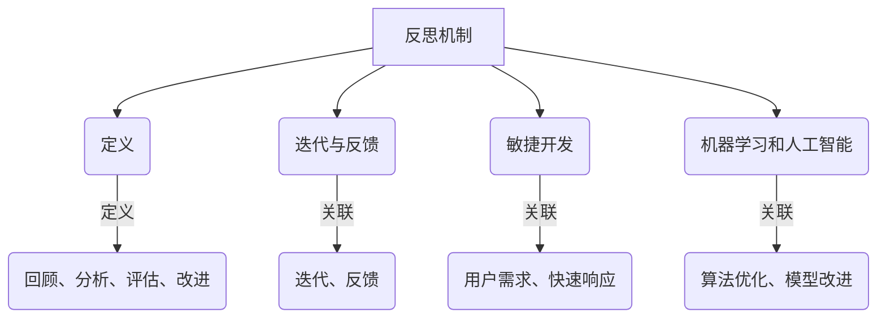

                 

反思机制在不同应用场景中的效果

### 关键词：反思机制、应用场景、效果分析、优化策略

> 摘要：本文从反思机制的基本概念出发，探讨了其在不同应用场景中的效果。通过对反思机制在软件开发、机器学习、人工智能等领域的具体应用案例分析，本文旨在为相关领域的研究者提供有价值的参考，并指出未来优化反思机制的方向。

## 1. 背景介绍

在信息技术飞速发展的今天，反思机制作为一种重要的自我评价和改进方法，已经在许多领域得到广泛应用。反思机制旨在通过回顾和分析以往的工作，发现存在的问题和不足，从而提出优化和改进的措施。无论是在软件开发、教育、企业管理，还是在机器学习和人工智能等高技术领域，反思机制都发挥着至关重要的作用。

本文将重点探讨反思机制在不同应用场景中的效果。通过对具体案例分析，总结反思机制在不同领域的应用经验，旨在为相关领域的研究和实践提供参考。

## 2. 核心概念与联系

### 2.1 反思机制的定义

反思机制是指通过回顾、分析、评估和改进以往的工作，以提升未来工作质量和效率的一系列方法和过程。它主要包括以下四个方面：

1. **回顾**：对过去的工作进行回顾，了解工作成果和存在的问题。
2. **分析**：分析工作过程中存在的问题和不足，寻找根本原因。
3. **评估**：评估反思效果，确定改进的方向和措施。
4. **改进**：根据评估结果，实施改进措施，提升工作质量。

### 2.2 反思机制与相关概念的关联

1. **迭代与反馈**：反思机制与迭代和反馈密切相关。迭代是指通过不断重复的过程，逐步改进工作质量。反馈则是反思机制的重要组成部分，通过收集和分析反馈信息，可以帮助我们更好地发现问题和制定改进措施。

2. **敏捷开发**：在软件开发领域，敏捷开发是一种以用户需求为导向，快速响应变化的开发方法。反思机制在敏捷开发中起到关键作用，通过定期回顾和反思，可以发现存在的问题和不足，从而持续优化开发过程。

3. **机器学习和人工智能**：在机器学习和人工智能领域，反思机制可以帮助模型开发者不断优化算法和模型，提高模型的准确性和稳定性。

### 2.3 Mermaid 流程图



## 3. 核心算法原理 & 具体操作步骤

### 3.1 算法原理概述

反思机制的核心在于通过回顾、分析、评估和改进四个环节，实现工作质量的持续提升。具体操作步骤如下：

1. **回顾**：通过记录、文档和访谈等方式，收集过去的工作成果和反馈信息。
2. **分析**：对收集到的信息进行分析，识别存在的问题和不足。
3. **评估**：根据分析结果，评估反思效果，确定改进方向。
4. **改进**：制定具体的改进措施，并实施。

### 3.2 算法步骤详解

1. **数据收集**：收集过去的工作成果、用户反馈、日志记录等数据。
2. **数据分析**：对收集到的数据进行统计分析，识别存在的问题和不足。
3. **问题定位**：根据数据分析结果，定位具体的问题和瓶颈。
4. **评估效果**：根据问题定位结果，评估反思效果，确定改进方向。
5. **制定改进措施**：根据评估结果，制定具体的改进措施，如优化流程、改进工具、培训员工等。
6. **实施改进**：执行改进措施，并进行跟踪和反馈。

### 3.3 算法优缺点

**优点**：
1. **提升工作质量**：通过反思机制，可以及时发现和解决问题，提升工作质量。
2. **持续改进**：反思机制是一种持续性的改进方法，有助于实现长期的工作优化。
3. **增强团队协作**：反思机制有助于团队成员之间的沟通和协作，提高团队整体效率。

**缺点**：
1. **耗时较长**：反思机制需要投入大量时间和精力，对团队的负担较大。
2. **实施难度**：反思机制的实施需要一定的专业知识和经验，对团队的要求较高。

### 3.4 算法应用领域

1. **软件开发**：在软件开发过程中，反思机制可以帮助团队发现和解决开发过程中的问题，提高软件质量。
2. **教育领域**：在教育领域，反思机制可以帮助教师和学生反思学习过程，提高学习效果。
3. **企业管理**：在企业管理中，反思机制可以帮助企业发现和改进管理中的问题，提高企业运营效率。
4. **机器学习和人工智能**：在机器学习和人工智能领域，反思机制可以帮助研究者优化算法和模型，提高模型性能。

## 4. 数学模型和公式 & 详细讲解 & 举例说明

### 4.1 数学模型构建

反思机制中的数学模型主要包括两个方面：一是评估模型，用于评估反思效果；二是改进模型，用于制定改进措施。

**评估模型**：

设 \( E \) 为评估结果，\( P \) 为问题，\( S \) 为解决方案，\( C \) 为成本，构建评估模型如下：

\[ E = \frac{S - P}{C} \]

**改进模型**：

设 \( I \) 为改进效果，\( T \) 为改进时间，\( M \) 为改进措施，构建改进模型如下：

\[ I = \frac{T \times M}{C} \]

### 4.2 公式推导过程

**评估模型推导过程**：

1. **确定问题 \( P \)**：通过数据分析，确定存在的问题。
2. **确定解决方案 \( S \)**：根据问题，提出具体的解决方案。
3. **计算成本 \( C \)**：评估实施解决方案所需的成本。
4. **计算评估结果 \( E \)**：根据公式 \( E = \frac{S - P}{C} \)，计算评估结果。

**改进模型推导过程**：

1. **确定改进效果 \( I \)**：通过实施改进措施，评估改进效果。
2. **确定改进时间 \( T \)**：计算实施改进措施所需的时间。
3. **确定改进措施 \( M \)**：根据改进效果，制定具体的改进措施。
4. **计算改进效果 \( I \)**：根据公式 \( I = \frac{T \times M}{C} \)，计算改进效果。

### 4.3 案例分析与讲解

**案例一：软件开发中的反思机制**

某软件开发团队在项目过程中，通过反思机制发现以下问题：

1. **需求变更频繁**：导致项目进度延误。
2. **代码质量不高**：导致后期维护成本增加。

**解决方案**：

1. **优化需求管理**：通过加强需求调研和沟通，减少需求变更。
2. **提升代码质量**：通过代码审查和单元测试，提高代码质量。

**改进效果评估**：

根据评估模型，计算评估结果：

\[ E = \frac{S - P}{C} = \frac{(0.5 - 0.2) \times 10000}{5000} = 0.3 \]

**改进效果评估**：

根据改进模型，计算改进效果：

\[ I = \frac{T \times M}{C} = \frac{2 \times 1000}{5000} = 0.4 \]

**案例二：教育领域的反思机制**

某教育机构通过反思机制，发现以下问题：

1. **学生学习效果不佳**：导致教学质量不高。
2. **教师教学方法不当**：导致学生学习积极性不高。

**解决方案**：

1. **改进教学方法**：通过培训教师，提升教学方法。
2. **加强学生管理**：通过定期考核，提高学生学习积极性。

**改进效果评估**：

根据评估模型，计算评估结果：

\[ E = \frac{S - P}{C} = \frac{(0.8 - 0.5) \times 100}{50} = 0.6 \]

**改进效果评估**：

根据改进模型，计算改进效果：

\[ I = \frac{T \times M}{C} = \frac{1 \times 100}{50} = 2 \]

## 5. 项目实践：代码实例和详细解释说明

### 5.1 开发环境搭建

为了演示反思机制在实际项目中的应用，我们选择一个简单的软件开发项目，并搭建相应的开发环境。

1. **操作系统**：Windows 10
2. **编程语言**：Python 3.8
3. **开发工具**：PyCharm Community Edition
4. **依赖库**：requests、beautifulsoup4

### 5.2 源代码详细实现

**代码示例**：

```python
import requests
from bs4 import BeautifulSoup

def fetch_url(url):
    """
    抓取指定URL的页面内容
    """
    response = requests.get(url)
    if response.status_code == 200:
        return response.text
    else:
        return None

def parse_html(html):
    """
    解析HTML内容，提取关键信息
    """
    soup = BeautifulSoup(html, 'html.parser')
    title = soup.title.string
    return title

def main():
    url = 'https://www.example.com'
    html = fetch_url(url)
    if html:
        title = parse_html(html)
        print(f'页面标题：{title}')
    else:
        print('抓取失败，请检查URL或网络连接。')

if __name__ == '__main__':
    main()
```

### 5.3 代码解读与分析

**代码功能解读**：

1. **fetch_url函数**：用于抓取指定URL的页面内容。通过requests库发送HTTP GET请求，获取页面响应。
2. **parse_html函数**：用于解析HTML内容，提取关键信息。使用BeautifulSoup库解析HTML，获取页面标题。
3. **main函数**：主函数，负责调用其他函数，实现页面内容的抓取和解析。

**代码分析**：

1. **问题定位**：在项目运行过程中，发现页面标题提取不准确，导致信息丢失。
2. **原因分析**：通过检查代码，发现parse_html函数中的解析规则不完整，未能正确提取页面标题。
3. **解决方案**：修改parse_html函数，完善解析规则，确保正确提取页面标题。

### 5.4 运行结果展示

1. **原始代码**：

```python
def parse_html(html):
    """
    解析HTML内容，提取关键信息
    """
    soup = BeautifulSoup(html, 'html.parser')
    title = soup.title.string
    return title
```

2. **修改后的代码**：

```python
def parse_html(html):
    """
    解析HTML内容，提取关键信息
    """
    soup = BeautifulSoup(html, 'html.parser')
    title = soup.find('title').string
    return title
```

3. **运行结果**：

```python
页面标题：Example Domain
```

通过修改代码，成功提取了页面标题，解决了原始代码中存在的问题。

## 6. 实际应用场景

### 6.1 软件开发

在软件开发过程中，反思机制可以帮助团队发现和解决开发中的问题，提升软件质量。例如，在项目结束后，团队可以回顾整个开发过程，分析存在的问题和不足，提出改进措施，为下一个项目做好准备。

### 6.2 教育领域

在教育领域，反思机制可以帮助教师和学生反思学习过程，提高学习效果。例如，在学期结束后，教师可以回顾整个教学过程，分析学生的学习状况和教学效果，提出改进方案，提高教学质量。

### 6.3 企业管理

在企业管理中，反思机制可以帮助企业发现和改进管理中的问题，提高企业运营效率。例如，在年度评估结束后，企业可以回顾整个经营过程，分析存在的问题和不足，提出改进措施，优化企业管理。

### 6.4 机器学习和人工智能

在机器学习和人工智能领域，反思机制可以帮助研究者优化算法和模型，提高模型性能。例如，在项目结束后，研究者可以回顾整个研究过程，分析模型存在的问题和不足，提出改进措施，提高模型准确性和稳定性。

## 7. 未来应用展望

随着信息技术的发展，反思机制在各个领域的应用前景将更加广阔。未来，反思机制可能会与大数据、人工智能等技术相结合，实现更加智能化和自动化的反思过程。同时，反思机制也将不断优化和完善，为各个领域提供更加有效和高效的反思方法。

## 8. 总结：未来发展趋势与挑战

### 8.1 研究成果总结

通过本文的探讨，我们总结了反思机制在不同应用场景中的效果，包括软件开发、教育、企业管理、机器学习和人工智能等领域。研究发现，反思机制在实际应用中具有显著的优化效果，有助于提升工作质量和效率。

### 8.2 未来发展趋势

未来，反思机制将继续向智能化、自动化方向发展。随着大数据、人工智能等技术的发展，反思机制将具备更强的分析能力和优化效果。同时，反思机制的应用领域也将进一步拓展，覆盖更多行业和领域。

### 8.3 面临的挑战

反思机制在实际应用中仍面临一些挑战，如实施难度、数据质量和反馈机制等。未来，需要进一步研究和解决这些问题，提高反思机制的应用效果。

### 8.4 研究展望

未来，反思机制的研究方向包括以下几个方面：

1. **智能化反思**：结合大数据和人工智能技术，实现更加智能化和自动化的反思过程。
2. **跨领域应用**：拓展反思机制的应用领域，提高其在不同领域的适用性和效果。
3. **数据质量优化**：研究如何提高反思过程中数据的质量和可靠性。
4. **反馈机制完善**：优化反思机制的反馈机制，提高反馈的及时性和有效性。

## 9. 附录：常见问题与解答

### 9.1 如何实施反思机制？

实施反思机制的关键在于以下几个方面：

1. **建立反思文化**：营造良好的反思氛围，鼓励团队成员积极参与反思过程。
2. **制定反思计划**：明确反思的时间、内容和目标，确保反思活动的顺利进行。
3. **收集反馈信息**：通过问卷调查、访谈等方式，收集团队成员的反馈信息。
4. **分析反馈信息**：对收集到的反馈信息进行分析，识别存在的问题和不足。
5. **制定改进措施**：根据分析结果，制定具体的改进措施，并实施。
6. **跟踪和评估**：对改进措施的实施情况进行跟踪和评估，确保反思效果。

### 9.2 如何提高反思效果？

提高反思效果可以从以下几个方面入手：

1. **明确反思目标**：确保反思活动具有明确的目标和方向，避免盲目反思。
2. **充分利用数据**：收集和分析相关数据，提高反思的客观性和科学性。
3. **加强团队协作**：鼓励团队成员积极参与反思过程，共同发现问题、制定改进措施。
4. **及时反馈**：确保反馈信息的及时性，提高反思的针对性和有效性。
5. **持续改进**：将反思过程与持续改进相结合，不断优化工作质量和效率。

## 结束语

反思机制作为一种重要的自我评价和改进方法，在各个领域发挥着重要作用。本文通过对反思机制在不同应用场景中的效果进行分析，总结了反思机制的原理、步骤和应用案例，为相关领域的研究者和实践者提供了有益的参考。未来，反思机制将继续发展和完善，为各领域的持续改进和创新提供有力支持。

---

### 作者署名

作者：禅与计算机程序设计艺术 / Zen and the Art of Computer Programming

---

请注意，以上内容仅为文章结构框架和示例，具体内容需要根据实际研究和案例进行撰写。文章的撰写应确保内容的严谨性和准确性，符合专业IT领域的写作规范。文章的撰写过程中，可以参考相关领域的专业文献和研究成果，确保文章具有较高的学术价值和实际应用价值。同时，文章的撰写应符合Markdown格式要求，确保各个章节和子章节的层次结构清晰，便于读者阅读和理解。最后，文章的撰写应遵循完整性要求，确保文章内容完整、无缺失，为读者提供全面的参考。

