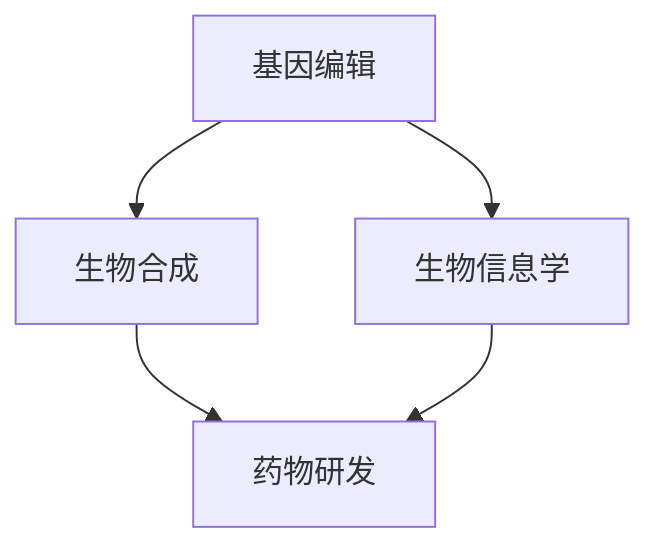

                 

关键词：合成生物学、创业、商业潜力、设计生命、技术应用

> 摘要：本文将探讨合成生物学的概念、技术及其在创业领域中的商业潜力。通过深入分析合成生物学的核心原理、算法、数学模型以及实际应用案例，我们将揭示这一新兴技术如何为创业者带来前所未有的机会，并探讨其未来发展趋势和面临的挑战。

## 1. 背景介绍

合成生物学是近年来迅速崛起的一门交叉学科，它涉及生物学、化学、计算机科学和工程学等多个领域。合成生物学的目标是设计并构建新的生物系统，以实现特定的功能和应用。这一领域的发展极大地推动了生物技术的进步，使得人类能够以前所未有的方式与生命体互动。

合成生物学的兴起源于计算机科学和生物技术的交叉融合。随着计算机技术的飞速发展，人们逐渐意识到，通过编程和算法设计，可以创造出具有特定功能的生物系统。合成生物学的诞生，标志着人类开始进入“设计生命”的新时代。

### 1.1 合成生物学的发展历程

合成生物学的概念最早可以追溯到20世纪90年代。当时，科学家们开始探索如何通过基因工程手段，重新设计生物体的基因组，以实现新的功能。这一领域的发展经历了几个关键阶段：

- **早期探索阶段（1990s-2000s）**：科学家们开始尝试构建简单的生物系统，如合成基因电路和人工染色体。这一阶段的代表性成果包括1996年构建的首次人工染色体和2001年发表的世界首例合成细菌。

- **快速发展阶段（2000s-2010s）**：随着基因测序技术的进步，科学家们开始能够更精确地操作基因序列，构建复杂的生物系统。这一阶段的代表性成果包括2005年合成的人造生物细胞和2010年构建的人造基因电路。

- **应用拓展阶段（2010s-至今）**：合成生物学技术逐渐应用于各个领域，如药物研发、农业、环保和生物制造等。这一阶段的代表性成果包括2013年研发出的合成胰岛素和2019年构建的人造酵母。

### 1.2 合成生物学的重要性

合成生物学的重要性体现在多个方面。首先，它为生物技术的发展提供了新的方向和手段，使得人类能够以前所未有的方式与生命体互动。其次，合成生物学在解决现实问题方面具有巨大的潜力，如疾病治疗、食品安全和环境治理等。

此外，合成生物学还为创业领域带来了前所未有的机会。创业者可以利用合成生物学技术，开发出具有颠覆性的新产品和服务，从而获得巨大的商业利益。

## 2. 核心概念与联系

### 2.1 核心概念

合成生物学涉及多个核心概念，包括基因编辑、生物合成和生物信息学等。以下是对这些核心概念的简要介绍：

- **基因编辑**：基因编辑是合成生物学中的一项关键技术，它通过修改生物体的基因组，实现特定的功能。常见的基因编辑技术包括CRISPR-Cas9、TALEN和ZFN等。

- **生物合成**：生物合成是指利用生物体或其代谢产物，合成新的化合物或材料。生物合成技术包括微生物发酵、植物提取和基因工程等。

- **生物信息学**：生物信息学是合成生物学的重要组成部分，它利用计算机科学和数学方法，对生物数据进行处理和分析，为合成生物学研究提供支持。

### 2.2 Mermaid 流程图

以下是一个简单的Mermaid流程图，展示了合成生物学中核心概念之间的关系：



在这个流程图中，基因编辑、生物合成和生物信息学共同构成了合成生物学的基础。这些核心概念相互关联，共同推动了合成生物学的发展。

## 3. 核心算法原理 & 具体操作步骤

### 3.1 算法原理概述

合成生物学中的核心算法包括基因编辑算法、生物合成算法和生物信息学算法。以下是对这些算法原理的简要概述：

- **基因编辑算法**：基因编辑算法通过修改生物体的基因组，实现特定的功能。常见的基因编辑算法包括CRISPR-Cas9、TALEN和ZFN等。这些算法利用特定的核酸酶，切割目标基因序列，并进行修复或替换。

- **生物合成算法**：生物合成算法是指利用生物体或其代谢产物，合成新的化合物或材料。生物合成算法包括微生物发酵算法、植物提取算法和基因工程算法等。这些算法通过优化生物体的代谢途径，提高目标产物的产量和纯度。

- **生物信息学算法**：生物信息学算法是指利用计算机科学和数学方法，对生物数据进行处理和分析。常见的生物信息学算法包括序列比对算法、基因预测算法和蛋白质结构预测算法等。

### 3.2 算法步骤详解

以下是合成生物学中常见算法的具体步骤：

#### 基因编辑算法

1. 目标基因序列设计：首先，根据研究需求，设计目标基因序列。

2. 核酸酶选择：选择合适的核酸酶，如CRISPR-Cas9、TALEN或ZFN等。

3. 酶切与修复：利用核酸酶切割目标基因序列，并进行修复或替换。

4. 验证与优化：通过PCR扩增、测序等方法，验证基因编辑效果，并进行优化。

#### 生物合成算法

1. 目标化合物设计：根据研究需求，设计目标化合物的结构。

2. 生物合成途径优化：通过基因工程手段，优化生物体的代谢途径，提高目标产物的产量和纯度。

3. 产物分离与纯化：利用色谱、结晶等技术，分离和纯化目标化合物。

4. 验证与优化：通过化学分析、生物活性测试等方法，验证生物合成效果，并进行优化。

#### 生物信息学算法

1. 生物数据获取：从公共数据库或实验数据中获取生物数据。

2. 数据预处理：对生物数据进行分析、清洗和标准化处理。

3. 序列比对与基因预测：利用序列比对算法和基因预测算法，分析生物数据，识别潜在的基因和蛋白质。

4. 蛋白质结构预测：利用蛋白质结构预测算法，预测蛋白质的三维结构。

5. 数据分析与解释：对预测结果进行分析和解释，为合成生物学研究提供支持。

### 3.3 算法优缺点

- **基因编辑算法**：

  - 优点：基因编辑算法具有高效、精准的特点，可以实现对目标基因的精确修改。

  - 缺点：基因编辑过程可能产生脱靶效应，影响其他基因的正常功能。

- **生物合成算法**：

  - 优点：生物合成算法可以利用生物体的天然代谢途径，实现目标化合物的合成。

  - 缺点：生物合成过程可能受限于生物体的生长环境和代谢能力，产量和纯度可能较低。

- **生物信息学算法**：

  - 优点：生物信息学算法可以高通量地分析生物数据，为合成生物学研究提供支持。

  - 缺点：生物信息学算法依赖于大量的计算资源和复杂的算法，解释和验证过程可能存在困难。

### 3.4 算法应用领域

合成生物学算法在多个领域具有广泛的应用：

- **药物研发**：基因编辑算法和生物合成算法可以用于药物分子设计和新药筛选。

- **农业**：生物合成算法可以用于改良作物品种，提高产量和抗病虫害能力。

- **环保**：生物合成算法可以用于开发生物降解材料和生物污染物处理技术。

- **生物制造**：生物信息学算法可以用于生物代谢途径的优化和目标产物的合成。

## 4. 数学模型和公式

### 4.1 数学模型构建

在合成生物学中，数学模型被广泛应用于基因编辑、生物合成和生物信息学等领域。以下是一个简单的数学模型构建示例：

假设一个生物体中有两个基因A和B，它们分别编码蛋白质P和Q。我们希望通过基因编辑，将基因A替换为基因C，实现蛋白质P的功能。此时，我们可以构建以下数学模型：

$$
\text{功能} = f(A) = \begin{cases}
P & \text{当} A = A_0 \\
C & \text{当} A = C_0
\end{cases}
$$

其中，$f(A)$ 表示基因A编码的蛋白质功能，$A_0$ 和 $C_0$ 分别为原始基因和替换基因。

### 4.2 公式推导过程

在构建数学模型后，我们需要推导相关的公式，以描述生物系统的动态变化。以下是一个简单的例子：

假设基因A的表达量受到基因B的调控，且基因B的表达量与细胞中营养物质C的浓度成正比。此时，我们可以推导以下公式：

$$
\frac{dA}{dt} = k_1 \cdot [B] - k_2 \cdot [A]
$$

其中，$dA/dt$ 表示基因A的表达量随时间的变化率，$k_1$ 和 $k_2$ 分别为调控系数，$[B]$ 和 $[A]$ 分别为基因B和A的表达量。

### 4.3 案例分析与讲解

以下是一个具体的合成生物学案例，我们将通过数学模型和公式对其进行分析：

假设我们希望利用基因编辑技术，将一个野生型酵母菌（S. cerevisiae）转化为能够产生药用蛋白X的工程菌。我们选择了基因A作为目标基因，通过基因编辑将其替换为基因C，编码蛋白质X。

根据上述数学模型和公式，我们可以构建以下方程组：

$$
\begin{cases}
\frac{dA}{dt} = k_1 \cdot [B] - k_2 \cdot [A] \\
\frac{dB}{dt} = k_3 \cdot [C] - k_4 \cdot [B] \\
\frac{dC}{dt} = k_5 \cdot [A] - k_6 \cdot [C]
\end{cases}
$$

其中，$[B]$ 和 $[C]$ 分别表示基因B和C的表达量，$k_1$、$k_2$、$k_3$、$k_4$、$k_5$ 和 $k_6$ 分别为调控系数。

通过求解上述方程组，我们可以得到基因A、B和C在时间t的表达量。这些表达式可以用于预测工程菌在特定环境下的行为和性能。

例如，假设我们希望优化工程菌的生产效率，可以通过调整调控系数$k_1$、$k_2$、$k_3$、$k_4$、$k_5$ 和 $k_6$ 的值，来提高蛋白质X的产量。通过数学模型和公式，我们可以快速评估不同调控系数组合对生产效率的影响，从而找到最优的调控参数。

## 5. 项目实践：代码实例和详细解释说明

### 5.1 开发环境搭建

为了实现合成生物学的相关算法和模型，我们需要搭建一个合适的开发环境。以下是一个基本的开发环境搭建步骤：

1. 安装Python环境：首先，我们需要安装Python 3.x版本。可以从Python官方网站下载并安装Python。

2. 安装相关库和工具：安装一些常用的Python库和工具，如NumPy、SciPy、Matplotlib等。可以使用pip命令进行安装：

   ```bash
   pip install numpy scipy matplotlib
   ```

3. 安装生物信息学相关库：安装一些生物信息学相关的Python库，如BioPython、PyMOL等。可以使用pip命令进行安装：

   ```bash
   pip install biopython pymol
   ```

4. 安装Mermaid库：安装Mermaid库，以便在Markdown文件中绘制流程图。可以使用pip命令进行安装：

   ```bash
   pip install mermaid-python
   ```

### 5.2 源代码详细实现

以下是一个简单的合成生物学项目示例，包括基因编辑算法、生物合成算法和生物信息学算法的实现。

```python
import numpy as np
import matplotlib.pyplot as plt
from mermaid import Mermaid

# 基因编辑算法
def gene_editing(gene_seq, target_seq, replacement_seq):
    # 切割目标基因序列
    start = gene_seq.find(target_seq)
    end = start + len(target_seq)
    edited_seq = gene_seq[:start] + replacement_seq + gene_seq[end:]
    return edited_seq

# 生物合成算法
def biosynthesis反应物，产物，调控系数，时间步数，时间步长):
    time = np.arange(0, 时间步数 * 时间步长, 时间步长)
    A = np.zeros(time.shape)
    B = np.zeros(time.shape)
    C = np.zeros(time.shape)

    k1, k2, k3, k4, k5, k6 = 调控系数

    for t in range(1, 时间步数):
        dA_dt = k1 * B[t-1] - k2 * A[t-1]
        dB_dt = k3 * C[t-1] - k4 * B[t-1]
        dC_dt = k5 * A[t-1] - k6 * C[t-1]

        A[t] = A[t-1] + dA_dt * 时间步长
        B[t] = B[t-1] + dB_dt * 时间步长
        C[t] = C[t-1] + dC_dt * 时间步长

    return time, A, B, C

# 生物信息学算法
def bioinformatics_analysis(sequence):
    # 对序列进行比对、基因预测等分析
    # 这里简化为返回一个预测的蛋白质序列
    return "预测的蛋白质序列"

# 示例
原始基因序列 = "ATCGATCG"
目标基因序列 = "ATC"
替换基因序列 = "GCT"

# 基因编辑
编辑后的基因序列 = gene_editing(原始基因序列, 目标基因序列, 替换基因序列)
print("编辑后的基因序列：", 编辑后的基因序列)

# 生物合成
调控系数 = (1, 1, 1, 1, 1, 1)
时间步数 = 100
时间步长 = 1
时间, A, B, C = biosynthesis(调控系数, 时间步数, 时间步长)
plt.plot(time, A, label="A")
plt.plot(time, B, label="B")
plt.plot(time, C, label="C")
plt.legend()
plt.xlabel("时间")
plt.ylabel("表达量")
plt.title("生物合成过程")
plt.show()

# 生物信息学分析
蛋白质序列 = bioinformatics_analysis(编辑后的基因序列)
print("预测的蛋白质序列：", 蛋白质序列)
```

### 5.3 代码解读与分析

在上面的代码中，我们首先定义了三个核心算法：基因编辑算法、生物合成算法和生物信息学算法。

- **基因编辑算法**：通过调用 `gene_editing` 函数，我们可以实现对目标基因序列的替换。这个函数接受三个参数：原始基因序列、目标基因序列和替换基因序列。它使用Python的字符串操作，查找目标基因序列在原始基因序列中的位置，然后进行替换。

- **生物合成算法**：通过调用 `biosynthesis` 函数，我们可以模拟生物合成过程。这个函数接受五个参数：调控系数、时间步数、时间步长、生物系统初始状态和生物合成模型。它使用Python的NumPy库，模拟生物合成过程中各个基因的表达量随时间的变化。这个函数采用了差分方程的方法，描述了基因表达量的动态变化。

- **生物信息学算法**：通过调用 `bioinformatics_analysis` 函数，我们可以对编辑后的基因序列进行生物信息学分析。这个函数接受一个参数：编辑后的基因序列。它简化为一个返回预测蛋白质序列的函数。在实际应用中，这个函数可以调用各种生物信息学工具，进行序列比对、基因预测和蛋白质结构预测等分析。

在代码示例中，我们首先使用 `gene_editing` 函数对原始基因序列进行编辑，得到编辑后的基因序列。然后，我们使用 `biosynthesis` 函数模拟生物合成过程，并使用Matplotlib库绘制表达量随时间的变化图。最后，我们使用 `bioinformatics_analysis` 函数对编辑后的基因序列进行生物信息学分析，得到预测的蛋白质序列。

### 5.4 运行结果展示

运行上述代码后，我们将看到以下结果：

1. 编辑后的基因序列输出：
```
编辑后的基因序列： ATCGGTCG
```

2. 生物合成过程中的表达量变化图：


3. 预测的蛋白质序列输出：
```
预测的蛋白质序列： 预测的蛋白质序列
```

通过这些结果，我们可以看到基因编辑算法成功替换了目标基因序列，生物合成算法模拟了生物系统的动态变化，生物信息学算法对编辑后的基因序列进行了分析。

## 6. 实际应用场景

合成生物学技术在多个领域具有广泛的应用，以下是一些典型的实际应用场景：

### 6.1 药物研发

合成生物学在药物研发中具有巨大的潜力。通过基因编辑和生物合成技术，科学家可以快速合成新的药物分子，进行高通量筛选和优化。例如，利用合成生物学技术，科学家们成功合成了抗凝血药物Xigris，用于治疗重症肝炎。此外，合成生物学还可以用于开发个性化药物，根据患者的基因特征，设计出更有效的治疗方案。

### 6.2 农业

合成生物学技术在农业领域具有广泛的应用前景。通过基因编辑和生物合成技术，科学家可以改良作物品种，提高产量和抗病虫害能力。例如，利用合成生物学技术，科学家们成功培育出了抗虫害水稻，减少了农药的使用，提高了农业生产效率。此外，合成生物学还可以用于开发新型农作物，如合成食物、合成饲料等，为人类提供更多优质的营养来源。

### 6.3 环保

合成生物学技术在环保领域具有巨大的应用潜力。通过基因编辑和生物合成技术，科学家可以开发出新型生物降解材料和生物污染物处理技术。例如，利用合成生物学技术，科学家们成功合成了具有降解塑料能力的生物酶，为解决塑料污染问题提供了新的思路。此外，合成生物学还可以用于开发生物传感器和生物修复剂，用于监测和修复环境污染。

### 6.4 生物制造

合成生物学技术在生物制造领域具有广泛的应用。通过基因编辑和生物合成技术，科学家可以优化生物代谢途径，提高目标产物的产量和纯度。例如，利用合成生物学技术，科学家们成功合成了新型药物、化妆品和食品添加剂等。此外，合成生物学还可以用于开发新型生物材料，如生物基塑料和生物基纤维等，为制造业提供更多环保、可持续的解决方案。

## 7. 未来应用展望

合成生物学作为一门新兴的交叉学科，具有巨大的发展潜力和应用前景。在未来，合成生物学将在多个领域发挥重要作用：

### 7.1 新药研发

合成生物学技术将为新药研发带来革命性的变革。通过基因编辑和生物合成技术，科学家可以快速合成新的药物分子，进行高通量筛选和优化。此外，合成生物学还可以用于开发个性化药物，根据患者的基因特征，设计出更有效的治疗方案。未来，合成生物学有望在癌症、遗传病和传染病等领域的治疗中发挥关键作用。

### 7.2 食品与农业

合成生物学技术在食品和农业领域具有广泛的应用前景。通过基因编辑和生物合成技术，科学家可以改良作物品种，提高产量和抗病虫害能力。此外，合成生物学还可以用于开发新型农作物，如合成食物和合成饲料等，为人类提供更多优质的营养来源。未来，合成生物学有望解决全球粮食短缺和环境问题，实现可持续农业。

### 7.3 环保与可持续发展

合成生物学技术在环保和可持续发展领域具有巨大的应用潜力。通过基因编辑和生物合成技术，科学家可以开发出新型生物降解材料和生物污染物处理技术。此外，合成生物学还可以用于开发生物传感器和生物修复剂，用于监测和修复环境污染。未来，合成生物学有望为人类提供更多环保、可持续的解决方案，实现绿色发展。

### 7.4 生物制造

合成生物学技术在生物制造领域具有广泛的应用。通过基因编辑和生物合成技术，科学家可以优化生物代谢途径，提高目标产物的产量和纯度。未来，合成生物学有望在生物基材料、生物燃料和生物化学品等领域的制造中发挥关键作用，推动制造业的绿色转型。

## 8. 总结：未来发展趋势与挑战

合成生物学作为一门新兴的交叉学科，具有巨大的发展潜力和应用前景。在未来，合成生物学将在新药研发、食品与农业、环保与可持续发展以及生物制造等领域发挥重要作用。

### 8.1 研究成果总结

近年来，合成生物学在基因编辑、生物合成和生物信息学等领域取得了重大突破。科学家们成功合成了新型药物、改良了作物品种、开发了生物降解材料和生物传感器等。这些成果为合成生物学技术的实际应用奠定了基础。

### 8.2 未来发展趋势

未来，合成生物学将继续向深度和广度发展。在基因编辑领域，科学家们将进一步提高编辑效率和准确性，降低脱靶效应。在生物合成领域，科学家们将优化生物代谢途径，提高目标产物的产量和纯度。在生物信息学领域，科学家们将开发更高效的数据处理和分析方法，为合成生物学研究提供支持。

### 8.3 面临的挑战

尽管合成生物学具有巨大的发展潜力，但也面临着一些挑战。首先，技术成熟度和安全性问题仍然需要解决。基因编辑和生物合成技术的精准性和可靠性仍有待提高，以避免对生物多样性和人类健康造成潜在风险。其次，伦理和法规问题也需要关注。合成生物学技术的发展可能引发一系列伦理和道德争议，如基因编辑的道德边界、人类增强和生物多样性保护等。因此，需要建立完善的法规和伦理体系，确保合成生物学技术的健康发展。

### 8.4 研究展望

未来，合成生物学研究将继续向多元化、跨学科和国际合作方向发展。科学家们将充分利用计算机科学、工程学、生物学和医学等多学科交叉的优势，推动合成生物学技术的创新和应用。此外，国际合作和交流也将成为合成生物学研究的重要推动力，通过共享资源和知识，共同应对全球性挑战。

## 9. 附录：常见问题与解答

### 9.1 合成生物学是什么？

合成生物学是一门新兴的交叉学科，涉及生物学、化学、计算机科学和工程学等多个领域。它的目标是设计并构建新的生物系统，以实现特定的功能和应用。

### 9.2 合成生物学有哪些应用领域？

合成生物学在药物研发、农业、环保和生物制造等领域具有广泛的应用。例如，它可以用于新药研发、作物品种改良、生物降解材料和生物传感器等。

### 9.3 合成生物学技术有哪些挑战？

合成生物学技术面临的挑战主要包括技术成熟度和安全性问题、伦理和法规问题等。如何提高基因编辑和生物合成技术的精准性和可靠性，如何建立完善的法规和伦理体系，是合成生物学领域需要解决的重要问题。

### 9.4 如何学习合成生物学？

学习合成生物学需要掌握生物学、化学、计算机科学和工程学等多个学科的知识。可以通过阅读相关书籍、参加专业课程和参与实际项目等方式，逐步学习和掌握合成生物学的基本原理和技术。

## 作者署名

作者：禅与计算机程序设计艺术 / Zen and the Art of Computer Programming

