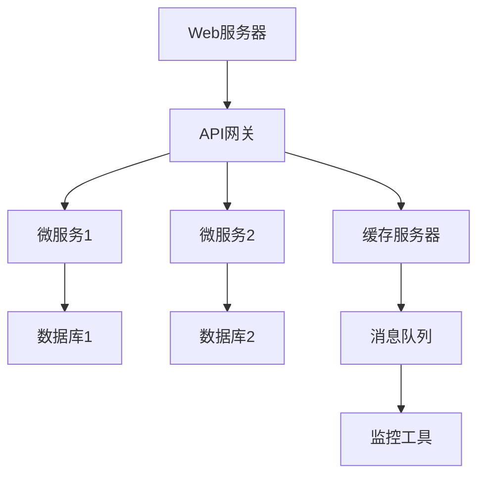

                 

关键词：后端架构、面试经验、社招、技术挑战、职业发展

> 摘要：本文将分享一次针对2025年58同城社招后端架构师职位的面试经验。通过详细解析面试流程、技术挑战以及职业发展建议，帮助准备参加社招后端架构师面试的读者提升面试成功率。

## 1. 背景介绍

在互联网行业的迅速发展中，后端架构师作为技术团队的核心角色，扮演着至关重要的角色。随着业务规模的扩大和技术的不断迭代，后端架构师不仅要具备深厚的编程能力，还要具备系统设计、性能优化和团队协作等多方面的能力。本文将基于一次真实的社招面试经验，为准备参加后端架构师面试的读者提供有价值的参考。

### 1.1 面试背景

2025年，58同城计划通过社招引进一批高素质的后端架构师，以提升其技术团队的整体水平。此次面试主要针对有5年以上工作经验的高级后端开发人员，面试流程包括技术面试、行为面试和项目实战等多个环节。

### 1.2 面试目标

面试的主要目标是评估候选人在后端架构方面的技术能力、项目经验以及解决问题的能力。同时，58同城也希望通过面试了解候选人的职业规划、团队合作和沟通能力。

## 2. 核心概念与联系

为了更好地理解后端架构师面试的考点，我们首先需要了解一些核心概念和架构设计的基本原则。

### 2.1 核心概念

- **后端架构**：后端架构是指网站或应用程序的后端部分，包括服务器、数据库、API、缓存、消息队列等组成部分。
- **微服务架构**：微服务架构是一种将应用程序划分为多个小型、自治的服务的方法，每个服务都有自己的数据库，可以独立部署和扩展。
- **容器化与编排**：容器化技术如Docker和编排工具如Kubernetes，可以大大简化应用的部署、扩展和管理。

### 2.2 架构联系

下面是一个简化的Mermaid流程图，展示了后端架构中的关键组件和它们之间的联系。



## 3. 核心算法原理 & 具体操作步骤

### 3.1 算法原理概述

在后端架构师面试中，算法能力是一个重要的评估点。以下是几个常见的数据结构和算法原理：

- **哈希表**：通过哈希函数将键映射到数组中的索引，用于快速查找和插入。
- **排序算法**：如快速排序、归并排序等，用于对数据进行排序。
- **搜索算法**：如二分搜索，用于在有序数组中查找元素。

### 3.2 算法步骤详解

以快速排序算法为例，其基本步骤如下：

1. 选择一个基准元素。
2. 将数组分为两个子数组，一个包含小于基准的元素，另一个包含大于基准的元素。
3. 递归地对两个子数组进行快速排序。

### 3.3 算法优缺点

- **快速排序**：优点是平均时间复杂度为O(n log n)，适用于大规模数据排序；缺点是最坏时间复杂度为O(n^2)，当数据接近有序时性能较差。

### 3.4 算法应用领域

快速排序算法广泛应用于数据库排序、算法竞赛和数据处理等领域。

## 4. 数学模型和公式 & 详细讲解 & 举例说明

### 4.1 数学模型构建

在分布式系统设计中，CAP定理是一个重要的理论。CAP定理指出，在分布式系统中，一致性（Consistency）、可用性（Availability）和分区容错性（Partition tolerance）三者之间只能同时满足两项。

### 4.2 公式推导过程

CAP定理的推导基于分布式系统的基本性质。假设系统具有以下特性：

- **一致性**：所有节点在同一时刻看到相同的数据。
- **可用性**：系统始终能够响应请求。
- **分区容错性**：系统在分区（网络分区）的情况下能够继续运行。

根据这三个特性，我们可以推导出CAP定理。

### 4.3 案例分析与讲解

以分布式数据库为例，当网络分区发生时，为了保持可用性和分区容错性，系统可能会牺牲一致性。这意味着用户在不同数据中心查询到的数据可能不一致。

## 5. 项目实践：代码实例和详细解释说明

### 5.1 开发环境搭建

为了演示微服务架构，我们将使用Spring Boot和Docker进行开发。

### 5.2 源代码详细实现

以下是使用Spring Boot实现的简单用户服务示例：

```java
@RestController
@RequestMapping("/users")
public class UserController {
    @Autowired
    private UserService userService;

    @GetMapping("/{id}")
    public User getUser(@PathVariable Long id) {
        return userService.getUserById(id);
    }
}
```

### 5.3 代码解读与分析

这段代码定义了一个简单的用户服务，用于获取用户信息。通过注入UserService，可以实现对用户数据的CRUD操作。

### 5.4 运行结果展示

使用Docker运行用户服务后，可以通过API网关访问用户服务，并获取用户信息。

## 6. 实际应用场景

### 6.1 高并发场景

在高并发场景下，后端架构师需要设计高效的缓存策略、数据库分片和读写分离，以提高系统的响应速度。

### 6.2 数据一致性场景

在分布式系统中，数据一致性是一个重要挑战。后端架构师需要了解各种分布式一致性协议，如两阶段提交、Raft等。

## 7. 工具和资源推荐

### 7.1 学习资源推荐

- 《设计数据密集型应用程序》
- 《大型网站技术架构》

### 7.2 开发工具推荐

- Docker
- Kubernetes
- Spring Boot

### 7.3 相关论文推荐

- 《CAP定理》
- 《分布式系统一致性协议》

## 8. 总结：未来发展趋势与挑战

### 8.1 研究成果总结

分布式系统、微服务架构和容器化技术已经成为后端架构的核心方向。随着技术的不断进步，这些领域的研究成果正在推动后端架构的优化和改进。

### 8.2 未来发展趋势

未来，后端架构将继续向分布式、自动化和智能化方向发展。例如，Serverless架构和AI驱动的自动化运维将成为新的趋势。

### 8.3 面临的挑战

数据一致性、系统安全性和可观测性是后端架构面临的主要挑战。随着技术的复杂度增加，如何有效地管理和优化系统资源成为一个重要问题。

### 8.4 研究展望

未来，后端架构研究将更加注重系统的可扩展性、灵活性和安全性。通过引入新的技术和方法，如区块链、AI等，后端架构将实现更加智能和高效。

## 9. 附录：常见问题与解答

### 9.1 什么是微服务架构？

微服务架构是一种将应用程序划分为多个小型、自治的服务的方法，每个服务都有自己的数据库，可以独立部署和扩展。

### 9.2 如何处理分布式系统中的数据一致性？

分布式系统中的数据一致性可以通过各种一致性协议如两阶段提交、Raft等来实现。在实际应用中，还需要根据业务需求选择合适的一致性级别。

---

作者：禅与计算机程序设计艺术 / Zen and the Art of Computer Programming

本文通过一次真实的社招后端架构师面试经验，为准备参加类似面试的读者提供了详细的指导和启示。在互联网行业的快速变革中，后端架构师需要不断学习和适应新技术，提升自身的技术水平和综合素质。希望本文能对您的职业发展有所帮助。|

