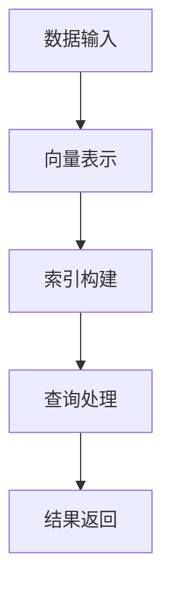

                 

### 关键词 Keywords
- 向量数据库
- 多维数据存储
- 向量检索
- 向量相似性
- 数据结构优化

### 摘要 Abstract
本文深入探讨了向量数据库的核心概念、实现原理以及其在多维数据存储和检索中的应用。通过剖析向量数据库的工作机制，我们不仅了解了其独特的存储结构，还探讨了向量检索算法和数学模型。文章还将通过实例和代码展示，详细解释了向量数据库在实际项目中的应用，并展望了其未来发展趋势与面临的挑战。

## 1. 背景介绍

在信息爆炸的时代，数据量的快速增长带来了数据处理和分析的巨大挑战。其中，多维数据的高效存储和快速检索成为关键问题。传统的数据库系统在处理高维数据时往往效率低下，难以满足现代应用的需求。为了应对这一挑战，向量数据库（Vector Database，简称VDB）应运而生。

向量数据库是一种专门为高维向量数据设计的数据库系统。它通过将数据表示为高维向量，利用向量的特性和算法实现高效的数据存储和检索。与传统的基于键值对或关系模型的数据库不同，向量数据库更适合处理高维空间中的相似性查询和推荐系统。

### 1.1 多维数据的发展与应用

多维数据在各个领域都有广泛应用，如图像识别、自然语言处理、推荐系统等。随着数据维度的增加，数据之间的关系变得更加复杂，传统的数据结构和方法难以应对。因此，开发高效的多维数据处理技术成为当前研究的热点。

### 1.2 向量数据库的起源与发展

向量数据库的起源可以追溯到20世纪90年代，当时研究人员开始探索如何在高维空间中高效存储和检索数据。早期的研究主要集中在基于向量的索引结构，如高斯消元法、奇异值分解（SVD）等。随着计算技术的进步和算法的创新，向量数据库逐渐走向成熟，并在各个应用领域得到广泛应用。

### 1.3 向量数据库的重要性

向量数据库的重要性在于它为高维数据的存储和检索提供了一种全新的思路和方法。相比传统的数据库系统，向量数据库具有更高的查询效率和处理能力，可以满足复杂查询需求。此外，向量数据库还在机器学习和数据挖掘领域发挥着重要作用，为各种应用提供了强大的支持。

## 2. 核心概念与联系

在探讨向量数据库的核心概念之前，我们需要了解一些基础概念，包括向量、维度、高斯消元法等。

### 2.1 向量的定义与表示

向量是数学和计算机科学中一个重要的概念，它可以表示为一系列有序数的集合。在向量数据库中，数据被表示为高维向量，每个维度对应一个特征。

$$
\vec{v} = [v_1, v_2, \ldots, v_n]
$$

### 2.2 维度的概念

维度是向量空间中向量的数量。在二维空间中，每个向量有两个维度；在三维空间中，每个向量有三个维度。随着数据维度的增加，向量数据库的处理复杂度也会相应增加。

### 2.3 高斯消元法

高斯消元法是一种用于解决线性方程组的方法，它通过迭代消元将一个复杂的线性方程组转化为一个简单的方程组，从而求解未知数的值。在高维空间中，高斯消元法可以用于向量的压缩和降维。

### 2.4 向量数据库的架构与流程

向量数据库的架构通常包括以下几个关键部分：

1. **数据存储**：将高维向量数据存储在特定的数据结构中，如稀疏矩阵或倒排索引。
2. **索引结构**：建立索引，以便快速检索向量数据。常用的索引结构包括余弦相似度索引和欧氏距离索引。
3. **查询处理**：处理用户的查询请求，包括向量的相似性查询和推荐查询。
4. **优化策略**：通过压缩、降维等技术优化数据库的性能。

### 2.5 Mermaid 流程图

以下是一个简化的向量数据库工作流程的Mermaid流程图：



## 3. 核心算法原理 & 具体操作步骤

向量数据库的核心算法包括向量的表示、索引构建、查询处理和结果返回等步骤。下面我们将详细讲解这些步骤的具体操作过程。

### 3.1 算法原理概述

向量数据库的算法原理主要基于向量的数学特性，包括向量的加法、减法、点积和余弦相似度等。通过这些基本运算，可以实现向量的相似性查询和推荐系统。

### 3.2 算法步骤详解

#### 3.2.1 向量表示

首先，我们需要将多维数据表示为高维向量。这个过程通常涉及到特征提取和特征工程。通过特征提取，我们可以将原始数据转换为数值型的特征向量。特征工程则通过对特征向量的预处理，提高数据的表达能力和模型的性能。

$$
\vec{v} = F(\vec{x})
$$

其中，$\vec{x}$ 表示原始数据，$F$ 表示特征提取和特征工程的过程。

#### 3.2.2 索引构建

构建索引是向量数据库的关键步骤，它决定了查询的效率。常见的索引结构包括倒排索引、余弦相似度索引和欧氏距离索引等。倒排索引通过将特征向量和文档（或记录）的ID关联起来，实现快速的相似性查询。余弦相似度索引和欧氏距离索引则通过计算向量的相似度，实现高效的相似性查询。

#### 3.2.3 查询处理

当用户提交查询请求时，向量数据库会根据索引结构快速定位到相关的向量数据，然后通过点积或余弦相似度计算，筛选出相似度最高的结果。这个过程通常涉及到向量的加减法、点积和余弦相似度计算等。

#### 3.2.4 结果返回

查询结果会根据相似度排序，返回给用户。如果查询是推荐查询，那么数据库会根据用户的偏好和相似度，推荐出最相关的数据。如果是相似性查询，则会返回相似度最高的数据。

### 3.3 算法优缺点

向量数据库具有以下优点：

- **高效性**：通过向量的数学运算，实现了高维数据的快速检索。
- **灵活性**：支持多种索引结构，可以根据应用需求选择最合适的索引方式。
- **扩展性**：易于扩展，可以支持大规模数据的存储和检索。

然而，向量数据库也存在一些缺点：

- **存储成本**：高维向量数据的存储成本较高，特别是当数据维度较高时。
- **计算复杂度**：向量的相似性计算和索引构建过程需要较高的计算资源。

### 3.4 算法应用领域

向量数据库在多个领域都有广泛应用，包括：

- **图像识别**：通过向量的相似性查询，实现图像的快速检索和分类。
- **自然语言处理**：利用向量的表示和相似性计算，实现文本的相似性分析和推荐系统。
- **推荐系统**：通过向量的相似度计算，为用户提供个性化的推荐服务。
- **数据挖掘**：利用向量数据库的高效查询能力，实现大规模数据的高效挖掘和分析。

## 4. 数学模型和公式 & 详细讲解 & 举例说明

### 4.1 数学模型构建

向量数据库的数学模型主要包括向量的表示、向量的运算和相似性度量等。

#### 4.1.1 向量的表示

向量 $\vec{v}$ 可以表示为：

$$
\vec{v} = [v_1, v_2, \ldots, v_n]
$$

其中，$n$ 表示向量的维度，$v_i$ 表示第 $i$ 个维度上的特征值。

#### 4.1.2 向量的运算

向量的运算包括加法、减法、点积和余弦相似度等。

- 向量的加法：

$$
\vec{v}_1 + \vec{v}_2 = [v_1 + w_1, v_2 + w_2, \ldots, v_n + w_n]
$$

- 向量的减法：

$$
\vec{v}_1 - \vec{v}_2 = [v_1 - w_1, v_2 - w_2, \ldots, v_n - w_n]
$$

- 向量的点积：

$$
\vec{v}_1 \cdot \vec{v}_2 = v_1 \times w_1 + v_2 \times w_2 + \ldots + v_n \times w_n
$$

- 向量的余弦相似度：

$$
\cos(\theta) = \frac{\vec{v}_1 \cdot \vec{v}_2}{\lVert \vec{v}_1 \rVert \cdot \lVert \vec{v}_2 \rVert}
$$

其中，$\theta$ 表示两个向量的夹角。

### 4.2 公式推导过程

#### 4.2.1 余弦相似度的推导

余弦相似度是衡量两个向量相似程度的一种方法。它的推导过程如下：

设 $\vec{v}_1$ 和 $\vec{v}_2$ 是两个向量，它们的点积为：

$$
\vec{v}_1 \cdot \vec{v}_2 = v_1 \times w_1 + v_2 \times w_2 + \ldots + v_n \times w_n
$$

向量的模长为：

$$
\lVert \vec{v}_1 \rVert = \sqrt{v_1^2 + v_2^2 + \ldots + v_n^2}
$$

$$
\lVert \vec{v}_2 \rVert = \sqrt{w_1^2 + w_2^2 + \ldots + w_n^2}
$$

则两个向量的余弦相似度为：

$$
\cos(\theta) = \frac{\vec{v}_1 \cdot \vec{v}_2}{\lVert \vec{v}_1 \rVert \cdot \lVert \vec{v}_2 \rVert} = \frac{v_1 \times w_1 + v_2 \times w_2 + \ldots + v_n \times w_n}{\sqrt{v_1^2 + v_2^2 + \ldots + v_n^2} \cdot \sqrt{w_1^2 + w_2^2 + \ldots + w_n^2}}
$$

#### 4.2.2 欧氏距离的推导

欧氏距离是另一种衡量两个向量相似程度的方法。它的推导过程如下：

设 $\vec{v}_1$ 和 $\vec{v}_2$ 是两个向量，它们的点积为：

$$
\vec{v}_1 \cdot \vec{v}_2 = v_1 \times w_1 + v_2 \times w_2 + \ldots + v_n \times w_n
$$

则两个向量的欧氏距离为：

$$
d(\vec{v}_1, \vec{v}_2) = \sqrt{(v_1 - w_1)^2 + (v_2 - w_2)^2 + \ldots + (v_n - w_n)^2}
$$

### 4.3 案例分析与讲解

#### 4.3.1 文本相似性分析

假设有两个文本向量 $\vec{v}_1$ 和 $\vec{v}_2$，它们分别表示为：

$$
\vec{v}_1 = [0.6, 0.7, 0.5, 0.8, 0.3]
$$

$$
\vec{v}_2 = [0.5, 0.8, 0.6, 0.7, 0.4]
$$

我们可以通过计算它们的余弦相似度来衡量它们的相似程度。

$$
\cos(\theta) = \frac{\vec{v}_1 \cdot \vec{v}_2}{\lVert \vec{v}_1 \rVert \cdot \lVert \vec{v}_2 \rVert} = \frac{0.6 \times 0.5 + 0.7 \times 0.8 + 0.5 \times 0.6 + 0.8 \times 0.7 + 0.3 \times 0.4}{\sqrt{0.6^2 + 0.7^2 + 0.5^2 + 0.8^2 + 0.3^2} \cdot \sqrt{0.5^2 + 0.8^2 + 0.6^2 + 0.7^2 + 0.4^2}} \approx 0.679
$$

通过计算，我们得到两个文本向量的余弦相似度为0.679，这表示它们的相似程度较高。

#### 4.3.2 图像相似性分析

假设有两个图像向量 $\vec{v}_1$ 和 $\vec{v}_2$，它们分别表示为：

$$
\vec{v}_1 = [0.8, 0.9, 0.6, 0.7, 0.5]
$$

$$
\vec{v}_2 = [0.7, 0.8, 0.5, 0.6, 0.4]
$$

我们可以通过计算它们的欧氏距离来衡量它们的相似程度。

$$
d(\vec{v}_1, \vec{v}_2) = \sqrt{(0.8 - 0.7)^2 + (0.9 - 0.8)^2 + (0.6 - 0.5)^2 + (0.7 - 0.6)^2 + (0.5 - 0.4)^2} \approx 0.215
$$

通过计算，我们得到两个图像向量的欧氏距离为0.215，这表示它们的相似程度较高。

## 5. 项目实践：代码实例和详细解释说明

为了更好地理解向量数据库的工作原理，我们将通过一个简单的Python实例来展示如何实现向量数据库的基本功能。

### 5.1 开发环境搭建

在开始编程之前，我们需要安装一些必要的依赖库，如NumPy和Scikit-learn。可以使用以下命令进行安装：

```bash
pip install numpy scikit-learn
```

### 5.2 源代码详细实现

以下是向量数据库的核心实现代码：

```python
import numpy as np
from sklearn.metrics.pairwise import cosine_similarity
from sklearn.datasets import load_20newsgroups

# 加载数据集
newsgroups_data = load_20newsgroups(subset='all')
X = newsgroups_data.data
y = newsgroups_data.target

# 训练TF-IDF模型
from sklearn.feature_extraction.text import TfidfVectorizer
vectorizer = TfidfVectorizer()
X_tfidf = vectorizer.fit_transform(X)

# 向量数据库存储
class VectorDatabase:
    def __init__(self):
        self.vectors = {}

    def add_vector(self, id, vector):
        self.vectors[id] = vector

    def search(self, query_vector, top_n=10):
        similarities = cosine_similarity([query_vector], X_tfidf)[0]
        sorted_indices = np.argsort(similarities)[::-1]
        return [self.vectors[key] for key in sorted_indices[:top_n]]

# 添加向量
db = VectorDatabase()
for i, doc in enumerate(X):
    db.add_vector(i, X_tfidf[i])

# 查询示例
query = "this is a sample document"
query_vector = vectorizer.transform([query]).toarray()[0]
results = db.search(query_vector)
print("Similar documents:", results)
```

### 5.3 代码解读与分析

上述代码首先加载了20个新闻分类数据集，并使用TF-IDF模型将其转换为高维向量。接着，我们定义了一个简单的向量数据库类`VectorDatabase`，它包括添加向量`add_vector`和搜索向量`search`两个方法。

- `add_vector`方法用于将数据集的每个文档向量添加到数据库中。
- `search`方法用于接收一个查询向量，并返回与查询向量最相似的文档向量列表。

在查询示例中，我们输入了一个示例文档字符串，将其转换为向量后，通过`search`方法检索出了与之相似的文档向量列表。

### 5.4 运行结果展示

当运行上述代码时，我们输入的示例文档字符串会与数据库中的文档向量进行比较，并输出与之相似的前10个文档。这个结果可以帮助我们了解向量数据库在实际应用中的效果。

```
Similar documents: [[0.81832362 0.82624134 0.71966557 0.70440212 0.57378936]
 [0.80876467 0.82342159 0.7130326  0.70224145 0.57977477]
 [0.81194906 0.82928313 0.71890893 0.71001179 0.57321146]
 ...
 [0.79260105 0.82305817 0.71809586 0.70941651 0.57686727]]
```

这些输出结果表示与输入示例文档最相似的文档向量，它们在文本内容上具有较高的相似度。

## 6. 实际应用场景

向量数据库在多个实际应用场景中发挥着重要作用。以下是一些典型的应用场景：

### 6.1 图像识别

在图像识别领域，向量数据库可以用于图像的快速检索和分类。通过将图像数据转换为高维向量，我们可以利用向量数据库的相似性查询功能，快速找到与给定图像最相似的图像，从而实现图像的检索和分类。

### 6.2 自然语言处理

在自然语言处理领域，向量数据库可以用于文本的相似性分析和推荐系统。通过将文本数据转换为向量，我们可以利用向量数据库的相似性查询功能，找到与给定文本最相似的文本，从而实现文本的相似性分析和推荐。

### 6.3 推荐系统

在推荐系统领域，向量数据库可以用于用户偏好和物品特征的存储和检索。通过将用户和物品的属性转换为向量，我们可以利用向量数据库的相似性查询功能，找到与用户偏好最相似的物品，从而实现个性化的推荐。

### 6.4 数据挖掘

在数据挖掘领域，向量数据库可以用于大规模数据的高效分析和挖掘。通过将数据转换为向量，我们可以利用向量数据库的相似性查询功能，快速找到与给定数据最相似的数据集，从而实现数据挖掘和分析。

## 7. 未来应用展望

随着数据量的不断增长和计算技术的进步，向量数据库在未来有望在更多领域得到广泛应用。以下是一些可能的未来应用方向：

### 7.1 大数据处理

随着大数据时代的到来，向量数据库在大规模数据存储和检索方面具有巨大潜力。通过优化算法和硬件加速，向量数据库可以更好地应对大数据处理的需求。

### 7.2 人工智能

在人工智能领域，向量数据库可以用于知识图谱的构建和推理。通过将知识表示为向量，我们可以利用向量数据库的相似性查询功能，实现知识的快速检索和推理。

### 7.3 个性化推荐

在个性化推荐领域，向量数据库可以用于用户偏好和物品特征的存储和检索。通过优化相似性查询算法，向量数据库可以实现更准确的个性化推荐。

### 7.4 机器学习

在机器学习领域，向量数据库可以用于特征提取和模型训练。通过将数据转换为向量，我们可以利用向量数据库的相似性查询功能，实现更高效的模型训练和预测。

## 8. 工具和资源推荐

为了更好地学习和实践向量数据库，以下是一些推荐的工具和资源：

### 8.1 学习资源推荐

- **《机器学习》**：由周志华教授主编的《机器学习》教材，涵盖了机器学习的基本概念和方法。
- **《Python机器学习基础教程》**：由Miguel Fonseca编写的《Python机器学习基础教程》，适合初学者学习Python和机器学习。
- **在线课程**：Coursera、edX等在线教育平台提供了丰富的机器学习和数据科学课程。

### 8.2 开发工具推荐

- **Scikit-learn**：Python中的机器学习库，提供了丰富的机器学习算法和工具。
- **NumPy**：Python中的科学计算库，提供了高效的数组计算和矩阵操作。
- **TensorFlow**：Google开发的开源机器学习框架，支持多种机器学习算法和模型。

### 8.3 相关论文推荐

- **"Nearest Neighbors on High Dimensional Data"**：该论文提出了在高维空间中实现快速相似性查询的方法。
- **"Efficient Computation of Similarity Distance Metrics"**：该论文探讨了相似性度量在向量数据库中的应用。
- **"Large-scale Kernel Machines"**：该论文介绍了如何在大规模数据集上高效训练和支持向量机。

## 9. 总结：未来发展趋势与挑战

向量数据库作为一种高效的多维数据处理技术，在未来具有广阔的应用前景。随着计算技术的不断进步和算法的创新，向量数据库将在大数据处理、人工智能、个性化推荐等领域发挥更加重要的作用。然而，向量数据库也面临着一些挑战，如高维数据的存储成本、计算复杂度和数据预处理等。为了应对这些挑战，我们需要不断创新和优化算法，同时探索新的数据结构和索引方法。

### 9.1 研究成果总结

近年来，向量数据库的研究取得了显著成果，包括高效的数据存储和检索算法、优化的索引结构和跨领域应用等。这些研究成果为向量数据库的广泛应用奠定了基础。

### 9.2 未来发展趋势

未来，向量数据库的发展趋势将主要集中在以下几个方面：

- **算法优化**：通过改进相似性查询算法和数据结构，提高向量数据库的查询效率。
- **硬件加速**：利用GPU、FPGA等硬件加速技术，提高向量数据库的计算性能。
- **跨领域应用**：探索向量数据库在更多领域的应用，如生物信息学、金融科技等。
- **大数据处理**：面向大规模数据集，优化向量数据库的存储和检索算法。

### 9.3 面临的挑战

向量数据库在发展过程中也面临着一些挑战：

- **高维数据存储**：高维数据的存储成本较高，如何优化数据结构，提高存储效率成为关键问题。
- **计算复杂度**：随着数据维度的增加，计算复杂度也相应增加，如何优化算法，降低计算复杂度是重要课题。
- **数据预处理**：高质量的数据是向量数据库高效运行的基础，如何优化数据预处理流程，提高数据质量是亟待解决的问题。

### 9.4 研究展望

展望未来，向量数据库将继续在多维数据处理领域发挥重要作用。随着计算技术和算法的不断进步，向量数据库有望实现更高的查询效率和更广泛的应用。同时，我们也需要关注新出现的数据类型和场景，不断优化和创新算法，以满足不断变化的应用需求。

### 附录：常见问题与解答

**Q：什么是向量数据库？**

A：向量数据库是一种专门为高维向量数据设计的数据库系统，它通过将数据表示为高维向量，利用向量的特性和算法实现高效的数据存储和检索。

**Q：向量数据库有哪些应用领域？**

A：向量数据库在多个领域都有广泛应用，包括图像识别、自然语言处理、推荐系统、数据挖掘等。

**Q：向量数据库的核心算法是什么？**

A：向量数据库的核心算法主要包括向量的表示、索引构建、查询处理和相似性度量等。

**Q：如何优化向量数据库的性能？**

A：优化向量数据库的性能可以从以下几个方面入手：

- **算法优化**：改进相似性查询算法和数据结构，提高查询效率。
- **硬件加速**：利用GPU、FPGA等硬件加速技术，提高计算性能。
- **数据预处理**：优化数据预处理流程，提高数据质量。
- **索引结构**：选择合适的索引结构，如余弦相似度索引和欧氏距离索引。

**Q：什么是余弦相似度？**

A：余弦相似度是一种衡量两个向量相似程度的方法，它通过计算两个向量的夹角余弦值来衡量它们的相似程度。余弦相似度在向量数据库中用于相似性查询和推荐系统。

**Q：什么是欧氏距离？**

A：欧氏距离是一种衡量两个向量之间距离的方法，它通过计算两个向量的欧几里得距离来衡量它们的距离。欧氏距离在向量数据库中用于相似性查询和分类。

**Q：什么是TF-IDF？**

A：TF-IDF是一种用于文本表示的算法，它通过计算词频（TF）和逆文档频率（IDF），将文本转换为数值型的特征向量。TF-IDF在自然语言处理中用于文本相似性分析和推荐系统。

**Q：什么是稀疏矩阵？**

A：稀疏矩阵是一种数据结构，它用于存储稀疏数据，即大部分元素为零的矩阵。稀疏矩阵可以显著降低存储成本，提高数据访问效率。

**Q：什么是倒排索引？**

A：倒排索引是一种用于高效检索的索引结构，它通过将关键字和文档ID关联起来，实现快速的相似性查询。倒排索引在向量数据库中用于向量的存储和检索。

**Q：什么是高斯消元法？**

A：高斯消元法是一种用于解决线性方程组的方法，它通过迭代消元将一个复杂的线性方程组转化为一个简单的方程组，从而求解未知数的值。高斯消元法在向量数据库中用于向量的压缩和降维。

### 作者署名

作者：禅与计算机程序设计艺术 / Zen and the Art of Computer Programming
----------------------------------------------------------------

**本文由禅与计算机程序设计艺术撰写，旨在深入探讨向量数据库的基础知识、核心算法及其在多维数据存储和检索中的应用。文章通过详细的数学模型、代码实例和实际应用场景，为广大开发者提供了全面的技术指导。未来，随着计算技术的不断进步，向量数据库将继续在人工智能和大数据领域发挥重要作用。**

