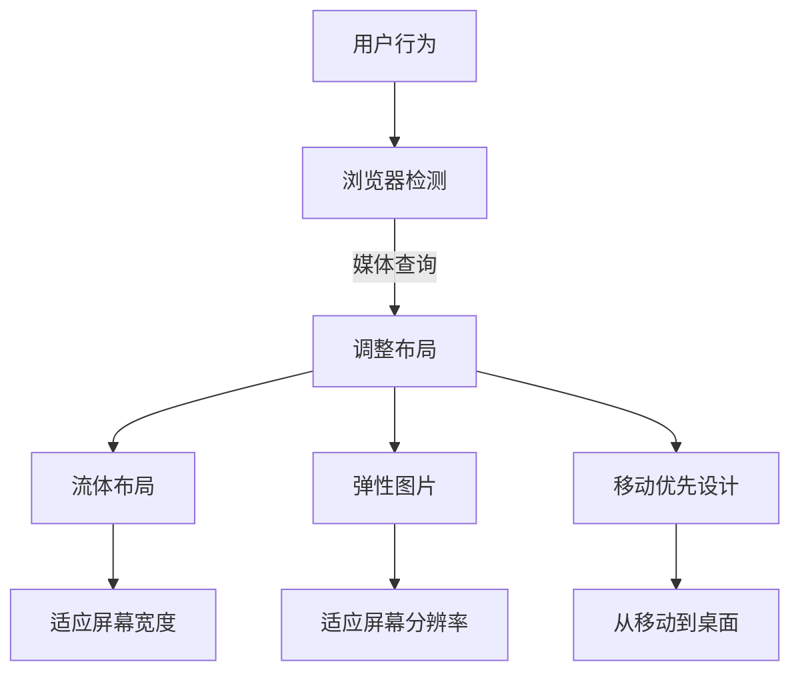

                 

关键词：响应式Web设计、多设备兼容、用户界面设计、流体布局、响应式框架、媒体查询、弹性图片、移动优先设计

> 摘要：本文将深入探讨响应式Web设计的核心概念、技术实现和未来趋势，通过理论分析和实际案例，帮助开发者更好地理解并应用响应式设计，以创建适应多种设备的用户界面。

## 1. 背景介绍

在互联网技术飞速发展的今天，Web应用的访问设备种类和分辨率日趋多样化。从桌面电脑到平板电脑，从智能手机到智能手表，不同设备之间的屏幕尺寸、分辨率、输入方式等差异，使得传统单一布局的Web设计已经无法满足用户的需求。响应式Web设计（Responsive Web Design，简称RWD）因此应运而生，它旨在通过灵活、动态的布局和设计，使得Web应用在不同设备上都能提供一致且优秀的用户体验。

响应式Web设计不仅仅是适应屏幕尺寸的变化，更涉及到布局、字体、图片、内容等各种元素的优化。随着移动设备的普及，响应式设计已经成为现代Web开发不可或缺的一部分。本文将详细探讨响应式Web设计的核心概念、技术实现、数学模型、实际应用，以及未来发展的趋势和挑战。

## 2. 核心概念与联系

### 2.1 响应式Web设计的核心概念

响应式Web设计的核心概念包括：

- **流体布局**（Fluid Layout）：通过相对单位（如百分比）来定义元素的宽度和间距，使得布局在不同屏幕尺寸下能够自动适应。

- **弹性图片**（Responsive Images）：通过调整图片的尺寸和分辨率，以适应不同的屏幕尺寸和分辨率。

- **媒体查询**（Media Queries）：CSS特性，用于在不同屏幕尺寸和设备特性下应用不同的样式。

- **移动优先设计**（Mobile-First Approach）：首先为移动设备设计，然后逐步扩展到桌面和大屏幕设备。

### 2.2 响应式Web设计的原理和架构

响应式Web设计的原理和架构可以用以下Mermaid流程图来表示：



### 2.3 响应式Web设计的技术实现

响应式Web设计的技术实现主要包括：

- **CSS3 Media Queries**：用于在特定屏幕尺寸下应用不同的CSS规则。

- **Flexbox和Grid布局**：CSS3新增的布局模块，提供更加灵活和强大的布局能力。

- **Viewport**：用于控制网页在移动设备上的显示尺寸。

## 3. 核心算法原理 & 具体操作步骤

### 3.1 算法原理概述

响应式Web设计的核心算法原理主要涉及以下几个部分：

- **流体布局算法**：通过相对单位（如百分比）和CSS3 Flexbox布局，实现网页布局的自动适应。

- **弹性图片算法**：通过判断屏幕尺寸和分辨率，动态调整图片的宽高和分辨率。

- **媒体查询算法**：根据屏幕尺寸和设备特性，应用不同的CSS规则，实现样式适配。

### 3.2 算法步骤详解

1. **初始布局设置**：定义网页的基本结构和样式。

2. **检测屏幕尺寸**：使用JavaScript或CSS3 Media Queries检测屏幕尺寸。

3. **应用流体布局**：根据屏幕尺寸，动态调整元素的宽度和间距。

4. **应用弹性图片**：根据屏幕尺寸和分辨率，调整图片的尺寸和分辨率。

5. **应用媒体查询**：在特定屏幕尺寸下，应用不同的CSS规则。

6. **优化和调整**：根据实际效果，对布局和样式进行优化和调整。

### 3.3 算法优缺点

#### 优点：

- **适应性**：能够适应各种屏幕尺寸和分辨率，提供一致的体验。

- **可维护性**：使用相对单位和解耦的CSS规则，使得代码更易于维护。

- **灵活性**：通过流体布局和弹性图片，能够实现复杂的布局和设计。

#### 缺点：

- **性能**：复杂的布局和响应式设计可能会降低页面性能。

- **兼容性**：早期浏览器可能不支持所有的响应式特性。

### 3.4 算法应用领域

响应式Web设计适用于各种领域，包括但不限于：

- **电子商务**：确保商品展示在不同设备上的清晰和一致性。

- **媒体网站**：适应不同屏幕尺寸，提供良好的阅读体验。

- **企业应用**：确保企业信息在各种设备上的可访问性和专业性。

## 4. 数学模型和公式

### 4.1 数学模型构建

响应式Web设计的数学模型主要涉及以下方面：

- **屏幕尺寸检测**：通过JavaScript或CSS3 Media Queries检测屏幕尺寸。

- **布局计算**：根据屏幕尺寸和元素尺寸，计算布局的宽度和间距。

- **图片调整**：根据屏幕尺寸和分辨率，计算图片的宽高和分辨率。

### 4.2 公式推导过程

1. **屏幕尺寸检测**：

   ```math
   \text{screenWidth} = \text{documentElement.clientWidth}
   \text{screenHeight} = \text{documentElement.clientHeight}
   ```

2. **布局计算**：

   ```math
   \text{elementWidth} = \frac{\text{screenWidth}}{100} \times \text{elementPercentageWidth}
   \text{elementHeight} = \frac{\text{screenHeight}}{100} \times \text{elementPercentageHeight}
   ```

3. **图片调整**：

   ```math
   \text{imageWidth} = \text{screenWidth} \times \frac{\text{imageBaseWidth}}{\text{imageMaxWidth}}
   \text{imageHeight} = \text{screenHeight} \times \frac{\text{imageBaseHeight}}{\text{imageMaxHeight}}
   ```

### 4.3 案例分析与讲解

以一个简单的响应式网页为例，我们可以通过以下步骤来实现：

1. **初始布局**：

   ```html
   <div class="container">
     
     <p>这是一段文本内容。</p>
   </div>
   ```

2. **CSS规则**：

   ```css
   .container {
     max-width: 100%;
     margin: 0 auto;
   }

   .responsive-image {
     max-width: 100%;
     height: auto;
   }
   ```

3. **媒体查询**：

   ```css
   @media (max-width: 600px) {
     .container {
       font-size: 14px;
     }
   }
   ```

通过以上步骤，我们可以实现一个基本响应式的网页布局，图片会根据屏幕宽度自动调整大小，文本内容也会在小于600px的屏幕尺寸下缩小。

## 5. 项目实践：代码实例和详细解释说明

### 5.1 开发环境搭建

为了实践响应式Web设计，我们需要搭建一个基本的开发环境。以下是搭建过程的简要步骤：

1. 安装Node.js和npm（Node Package Manager）。

2. 安装一个代码编辑器，如Visual Studio Code。

3. 创建一个新的Web项目，可以使用任何你喜欢的Web框架，如Bootstrap、Foundation等。

4. 配置你的Web服务器，如Apache或Nginx。

### 5.2 源代码详细实现

以下是一个简单的响应式网页的HTML和CSS代码实例：

```html
<!DOCTYPE html>
<html lang="en">
<head>
  <meta charset="UTF-8">
  <meta name="viewport" content="width=device-width, initial-scale=1.0">
  <title>Responsive Web Design Example</title>
  <link rel="stylesheet" href="styles.css">
</head>
<body>
  <header>
    <h1>我的响应式网站</h1>
    <nav>
      <ul>
        <li><a href="#">首页</a></li>
        <li><a href="#">关于我们</a></li>
        <li><a href="#">服务</a></li>
        <li><a href="#">联系</a></li>
      </ul>
    </nav>
  </header>
  <section>
    <h2>欢迎来到我的网站</h2>
    <p>这是一个响应式Web设计的示例。</p>
    
  </section>
  <footer>
    <p>版权所有 © 2023 我的响应式网站</p>
  </footer>
</body>
</html>
```

```css
/* styles.css */
* {
  margin: 0;
  padding: 0;
  box-sizing: border-box;
}

body {
  font-family: Arial, sans-serif;
  line-height: 1.6;
}

header {
  background-color: #333;
  padding: 20px;
}

header h1 {
  color: #fff;
  text-align: center;
}

nav ul {
  list-style-type: none;
  display: flex;
  justify-content: space-around;
  padding: 0;
}

nav ul li a {
  color: #fff;
  text-decoration: none;
}

section {
  padding: 20px;
}

.responsive-image {
  max-width: 100%;
  height: auto;
}

footer {
  background-color: #333;
  color: #fff;
  text-align: center;
  padding: 20px;
  position: absolute;
  bottom: 0;
  width: 100%;
}
```

### 5.3 代码解读与分析

以上代码实现了一个基本的响应式Web设计。HTML部分定义了网页的结构，包括头部（header）、导航（nav）、主体（section）和尾部（footer）。CSS部分负责样式的定义，包括背景颜色、字体、文本对齐等。其中，`.responsive-image`类使用了`max-width: 100%; height: auto;`规则，使得图片会根据屏幕宽度自动调整大小，而不会拉伸或缩小失真。

通过使用媒体查询，我们可以进一步优化不同屏幕尺寸下的样式。例如，在小于600px的屏幕尺寸下，导航菜单可以使用折叠式设计，以节省空间。

### 5.4 运行结果展示

在浏览器中打开上述代码，我们可以看到以下运行结果：

- **桌面浏览器**：网页会在屏幕宽度范围内均匀分布，导航菜单在较大屏幕下显示为水平排列，图片会根据屏幕宽度自动调整大小。

- **平板浏览器**：导航菜单会折叠成一行，以适应较小的屏幕宽度。图片会保持适当的尺寸，不会失真。

- **手机浏览器**：导航菜单会使用折叠式设计，以节省空间。图片会根据屏幕宽度自动调整大小，以适应手机屏幕。

这些运行结果展示了响应式Web设计的核心优势：在不同设备上提供一致且优秀的用户体验。

## 6. 实际应用场景

响应式Web设计在许多实际应用场景中得到了广泛应用，以下是一些典型的应用场景：

### 6.1 电子商务平台

电子商务平台需要确保产品展示在不同设备上的清晰和一致性。通过响应式Web设计，开发者可以创建一个能够自动适应各种屏幕尺寸和分辨率的购物网站，提升用户体验。

### 6.2 媒体网站

媒体网站通常需要提供大量的文本和图片内容。响应式Web设计可以帮助开发者创建一个能够适应不同屏幕尺寸和分辨率的阅读网站，提供良好的阅读体验。

### 6.3 企业应用

企业应用需要确保信息在各种设备上的可访问性和专业性。通过响应式Web设计，开发者可以创建一个能够适应各种屏幕尺寸和分辨率的内部系统，提高员工的工作效率。

### 6.4 教育网站

教育网站需要提供大量的教学资源和互动功能。通过响应式Web设计，开发者可以创建一个能够适应各种屏幕尺寸和分辨率的在线教育平台，提升教学效果。

## 7. 未来应用展望

随着互联网技术的不断发展，响应式Web设计在未来将会面临更多的挑战和机遇。以下是一些未来应用展望：

### 7.1 更高效的响应式框架

现有的响应式框架（如Bootstrap、Foundation等）已经非常成熟，但未来可能会出现更高效、更灵活的响应式框架，以满足开发者对性能和个性化的需求。

### 7.2 更强大的CSS特性

CSS3提供了许多响应式特性，但未来可能会引入更多的CSS特性，如更复杂的布局算法、更高效的媒体查询等，以进一步优化响应式Web设计。

### 7.3 更智能的适配算法

通过引入人工智能和机器学习技术，未来的响应式Web设计可能会更加智能，能够根据用户的行为和设备特性自动调整布局和样式。

### 7.4 虚拟现实和增强现实

随着虚拟现实（VR）和增强现实（AR）技术的普及，响应式Web设计可能会扩展到这些领域，为用户提供更加沉浸式的体验。

## 8. 工具和资源推荐

### 8.1 学习资源推荐

- **《响应式Web设计：HTML5和CSS3实战》**：一本深入浅出的响应式Web设计教程。
- **MDN Web Docs**：Mozilla提供的全面且详细的Web开发文档。
- **响应式Web设计教程**：W3Schools提供的响应式Web设计教程。

### 8.2 开发工具推荐

- **Visual Studio Code**：一款功能强大、易于扩展的代码编辑器。
- **Bootstrap**：一个流行的响应式前端框架。
- **Foundation**：一个现代化的响应式前端框架。

### 8.3 相关论文推荐

- **"Responsive Web Design" by Ethan Marcotte**：响应式Web设计的开创性论文。
- **"Progressive Web Apps" by Google**：关于渐进式Web应用的论文。

## 9. 总结：未来发展趋势与挑战

### 9.1 研究成果总结

响应式Web设计已经成为现代Web开发的核心技术之一，通过灵活、动态的布局和设计，为用户提供一致且优秀的用户体验。随着互联网技术的不断发展，响应式Web设计在性能、灵活性和智能化方面取得了显著成果。

### 9.2 未来发展趋势

未来的响应式Web设计将会更加高效、灵活和智能。更高效的响应式框架、更强大的CSS特性和更智能的适配算法将是未来的发展趋势。

### 9.3 面临的挑战

响应式Web设计在性能、兼容性和开发效率方面仍面临一定的挑战。未来需要在性能优化、浏览器兼容性和开发工具等方面进行改进。

### 9.4 研究展望

未来的研究可以关注更高效的响应式框架、更智能的适配算法和虚拟现实/增强现实领域的响应式设计。通过这些研究，有望进一步提升响应式Web设计的性能和用户体验。

## 10. 附录：常见问题与解答

### 10.1 响应式Web设计与移动优先设计的区别

**响应式Web设计**：旨在创建一个单一的网站，通过媒体查询和流体布局，使其在不同设备上都能提供一致的用户体验。

**移动优先设计**：首先为移动设备设计，然后逐步扩展到桌面和大屏幕设备。这种方法强调为移动用户提供最佳体验。

### 10.2 如何优化响应式Web设计的性能

- 使用懒加载技术，减少页面加载时间。
- 使用CSS3的`transition`和`transform`属性，优化动画效果。
- 使用响应式图片，根据屏幕尺寸和分辨率加载合适的图片。

### 10.3 如何测试响应式Web设计

- 使用浏览器开发者工具模拟不同设备和屏幕尺寸。
- 使用第三方响应式设计测试工具，如Responsinator。
- 进行真实设备测试，确保在不同设备上都能提供良好的用户体验。

---

作者：禅与计算机程序设计艺术 / Zen and the Art of Computer Programming
------------------------------------------------------------------------<|text_end|>

