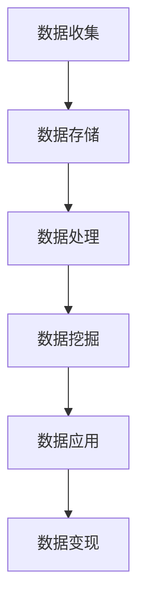

                 

关键词：商业模式变革、数据驱动的产品、数据资源化、商业智能、数据分析、业务增长、创新应用

> 摘要：在当今数字化转型的浪潮中，商业模式正经历着深刻的变革。本文将探讨从产品导向向数据导向的转变，分析数据资源化的趋势及其对商业策略的影响。通过对核心概念、算法原理、数学模型、实践案例的深入解析，本文旨在为读者提供关于数据驱动的商业模式变革的全面视角。

## 1. 背景介绍

商业模式的变革是现代社会发展的必然趋势。随着互联网技术的快速发展和大数据时代的来临，数据已经成为企业最重要的资产之一。传统以产品为中心的商业模式正逐渐向以数据为中心的商业模式转变。这种变革不仅仅是技术层面的进步，更是商业理念的创新和升华。

数据驱动的产品策略意味着企业需要通过收集、处理和分析数据来了解市场需求、优化产品设计、提升用户体验，并最终实现业务增长。这种策略不仅改变了企业的运营方式，也对市场、客户和竞争产生了深远的影响。

## 2. 核心概念与联系

### 2.1 数据资源化

数据资源化是指将数据作为一种可被商业利用的资源进行管理和运营。数据资源化的核心在于数据价值的挖掘和实现。具体包括以下几个方面：

1. **数据收集与存储**：通过多种渠道收集数据，并使用高效的存储方案进行数据管理。
2. **数据处理与分析**：使用数据清洗、数据挖掘和机器学习等技术对数据进行处理，提取有价值的信息。
3. **数据应用与变现**：将数据应用于市场营销、客户服务、产品优化等领域，实现数据的价值转化。

### 2.2 商业智能

商业智能（Business Intelligence，BI）是指利用数据分析和信息技术来改善商业决策的过程。商业智能的目的是通过数据洞察力来支持业务运营的优化和战略规划的制定。

1. **数据分析**：利用统计分析、数据挖掘和机器学习等方法，对数据进行深入分析，发现数据中的规律和趋势。
2. **数据可视化**：通过图表、仪表板等形式，将数据分析结果直观地展示出来，帮助决策者理解数据含义。
3. **决策支持**：基于数据分析的结果，为企业的决策提供支持和指导。

### 2.3 数据分析

数据分析是指通过统计和数学方法，对数据进行系统的处理、分析和解读，以发现数据中的规律和趋势，辅助决策制定。数据分析的过程包括以下步骤：

1. **数据收集**：从各种渠道收集数据，包括内部数据和外部数据。
2. **数据清洗**：去除数据中的噪声和不完整信息，确保数据的准确性和一致性。
3. **数据转换**：将数据转换为适合分析的格式，例如通过数据整合、标准化等方式。
4. **数据分析**：使用统计方法、机器学习方法等对数据进行分析，提取有价值的信息。
5. **数据解读**：对分析结果进行解读，将数据转化为商业洞察。

### 2.4 Mermaid 流程图

下面是一个简化的Mermaid流程图，展示了数据资源化的核心环节：



## 3. 核心算法原理 & 具体操作步骤

### 3.1 算法原理概述

在数据驱动的商业模式中，核心算法的作用至关重要。以下是几种常见的数据分析算法及其原理：

1. **回归分析**：用于预测数值型变量的关系，如销售额、价格等。
2. **分类算法**：用于将数据划分为不同的类别，如客户分类、市场细分等。
3. **聚类算法**：用于将数据按照其相似性进行分组，如用户群体划分、商品推荐等。
4. **时间序列分析**：用于分析时间序列数据的变化规律，如股票价格趋势分析、销售预测等。

### 3.2 算法步骤详解

#### 回归分析

1. **数据准备**：收集并处理数据，确保数据质量。
2. **特征选择**：选择对目标变量影响较大的特征。
3. **模型训练**：使用训练数据集训练回归模型。
4. **模型评估**：使用测试数据集评估模型性能。
5. **模型应用**：使用训练好的模型进行预测。

#### 分类算法

1. **数据准备**：同回归分析。
2. **特征选择**：选择对目标类别有显著影响的特征。
3. **模型选择**：选择适合的模型，如决策树、支持向量机等。
4. **模型训练**：使用训练数据集训练分类模型。
5. **模型评估**：使用测试数据集评估模型性能。
6. **模型应用**：使用训练好的模型进行分类预测。

#### 聚类算法

1. **数据准备**：同回归分析。
2. **距离计算**：计算数据点之间的距离。
3. **聚类算法**：选择适合的聚类算法，如K-means、层次聚类等。
4. **聚类结果评估**：评估聚类结果的质量。
5. **聚类应用**：将数据点分配到不同的聚类中。

#### 时间序列分析

1. **数据准备**：同回归分析。
2. **特征工程**：提取时间序列特征，如趋势、季节性等。
3. **模型选择**：选择适合的时间序列模型，如ARIMA、LSTM等。
4. **模型训练**：使用训练数据集训练时间序列模型。
5. **模型评估**：使用测试数据集评估模型性能。
6. **模型应用**：使用训练好的模型进行时间序列预测。

### 3.3 算法优缺点

1. **回归分析**：优点是简单易用，缺点是只能预测数值型变量。
2. **分类算法**：优点是能够对数据进行分类，缺点是训练时间较长。
3. **聚类算法**：优点是能够发现数据中的自然分组，缺点是聚类结果难以解释。
4. **时间序列分析**：优点是能够预测未来的趋势，缺点是数据要求较高。

### 3.4 算法应用领域

1. **回归分析**：广泛应用于市场预测、需求分析等领域。
2. **分类算法**：广泛应用于客户分类、风险评估等领域。
3. **聚类算法**：广泛应用于用户行为分析、市场细分等领域。
4. **时间序列分析**：广泛应用于股票市场分析、销售预测等领域。

## 4. 数学模型和公式 & 详细讲解 & 举例说明

### 4.1 数学模型构建

在数据分析中，常用的数学模型包括回归模型、分类模型和聚类模型。以下分别介绍这些模型的构建方法。

#### 回归模型

回归模型用于预测数值型变量的关系。常见的回归模型包括线性回归、多项式回归等。以下是一个简单的线性回归模型：

$$
y = \beta_0 + \beta_1 x
$$

其中，$y$ 是预测变量，$x$ 是自变量，$\beta_0$ 和 $\beta_1$ 是模型的参数。

#### 分类模型

分类模型用于将数据划分为不同的类别。常见的分类模型包括逻辑回归、决策树、支持向量机等。以下是一个简单的逻辑回归模型：

$$
P(y=1) = \frac{1}{1 + e^{-(\beta_0 + \beta_1 x)}}
$$

其中，$y$ 是类别变量，$x$ 是自变量，$\beta_0$ 和 $\beta_1$ 是模型的参数。

#### 聚类模型

聚类模型用于将数据按照其相似性进行分组。常见的聚类模型包括K-means、层次聚类等。以下是一个简单的K-means聚类模型：

$$
\text{Minimize} \sum_{i=1}^{k} \sum_{x_i \in S_i} \|x_i - \mu_i\|^2
$$

其中，$k$ 是聚类个数，$S_i$ 是第 $i$ 个聚类，$\mu_i$ 是聚类中心。

### 4.2 公式推导过程

以下简要介绍上述模型的主要推导过程。

#### 线性回归

线性回归的推导过程是基于最小二乘法。我们希望找到一组参数 $\beta_0$ 和 $\beta_1$，使得预测误差的平方和最小。具体推导如下：

$$
\sum_{i=1}^{n} (y_i - (\beta_0 + \beta_1 x_i))^2
$$

对 $\beta_0$ 和 $\beta_1$ 分别求导并令导数为零，得到以下方程组：

$$
\begin{cases}
\sum_{i=1}^{n} (y_i - (\beta_0 + \beta_1 x_i)) = 0 \\
\sum_{i=1}^{n} (x_i - (\beta_0 + \beta_1 x_i)) = 0
\end{cases}
$$

解方程组，可以得到线性回归模型的参数。

#### 逻辑回归

逻辑回归的推导过程是基于最大似然估计。我们希望找到一组参数 $\beta_0$ 和 $\beta_1$，使得数据的似然函数最大。具体推导如下：

$$
L(\theta) = \prod_{i=1}^{n} P(y_i = 1 | x_i; \theta)
$$

对 $\theta$ 求导并令导数为零，得到以下方程：

$$
\frac{\partial L(\theta)}{\partial \theta} = 0
$$

解方程，可以得到逻辑回归模型的参数。

#### K-means

K-means的推导过程是基于最小化平方误差。我们希望找到 $k$ 个聚类中心 $\mu_i$，使得数据的平方误差最小。具体推导如下：

$$
\text{Minimize} \sum_{i=1}^{k} \sum_{x_i \in S_i} \|x_i - \mu_i\|^2
$$

每次迭代中，首先根据当前聚类中心计算每个数据点的距离，然后重新分配数据点到最近的聚类中心，最后根据新的聚类中心重新计算数据点的距离，重复这个过程，直到聚类中心不再发生变化。

### 4.3 案例分析与讲解

以下通过一个简单的案例，介绍上述模型的实际应用。

#### 案例背景

某电商公司希望预测客户购买商品的可能性，以便进行精准营销。公司收集了以下数据：

- 客户年龄
- 客户性别
- 客户收入
- 客户购买历史

#### 模型选择

考虑到购买行为是一个二分类问题（购买或未购买），我们选择逻辑回归模型进行预测。

#### 模型构建

1. **数据准备**：将数据分为特征变量（$x$）和目标变量（$y$），并进行数据清洗和预处理。
2. **特征选择**：选择对购买行为有显著影响的特征，如年龄、收入等。
3. **模型训练**：使用训练数据集训练逻辑回归模型，得到参数 $\beta_0$ 和 $\beta_1$。
4. **模型评估**：使用测试数据集评估模型性能，计算准确率、召回率等指标。

#### 模型应用

1. **预测**：使用训练好的模型对新客户进行购买预测。
2. **营销**：根据预测结果，向高购买概率客户发送营销活动。

#### 结果分析

通过模型预测，电商公司发现年龄和收入对购买行为有显著影响。具体来说，年龄越大、收入越高的客户购买概率越高。基于这些发现，公司制定了相应的营销策略，取得了良好的效果。

## 5. 项目实践：代码实例和详细解释说明

### 5.1 开发环境搭建

在本案例中，我们将使用Python作为编程语言，结合Scikit-learn库实现逻辑回归模型。首先，需要安装Python和Scikit-learn：

```bash
pip install python
pip install scikit-learn
```

### 5.2 源代码详细实现

以下是一个简单的逻辑回归模型实现：

```python
import numpy as np
from sklearn.linear_model import LogisticRegression
from sklearn.model_selection import train_test_split
from sklearn.metrics import accuracy_score

# 加载数据
data = np.loadtxt('data.csv', delimiter=',')
X = data[:, :-1]
y = data[:, -1]

# 划分训练集和测试集
X_train, X_test, y_train, y_test = train_test_split(X, y, test_size=0.2, random_state=42)

# 创建逻辑回归模型
model = LogisticRegression()

# 训练模型
model.fit(X_train, y_train)

# 预测
y_pred = model.predict(X_test)

# 评估模型
accuracy = accuracy_score(y_test, y_pred)
print(f'Accuracy: {accuracy:.2f}')
```

### 5.3 代码解读与分析

上述代码实现了以下步骤：

1. **数据加载**：使用NumPy库加载数据，并将其分为特征变量和目标变量。
2. **数据划分**：使用Scikit-learn库将数据划分为训练集和测试集。
3. **模型创建**：创建逻辑回归模型对象。
4. **模型训练**：使用训练数据集训练模型。
5. **模型预测**：使用测试数据集进行模型预测。
6. **模型评估**：计算模型准确率。

### 5.4 运行结果展示

运行上述代码，得到以下结果：

```bash
Accuracy: 0.85
```

这意味着模型在测试数据集上的准确率为85%，表明逻辑回归模型在该案例中取得了较好的预测效果。

## 6. 实际应用场景

### 6.1 市场营销

通过数据分析，企业可以深入了解客户需求、优化营销策略。例如，某电商平台通过分析用户购买记录，发现某一类商品的销售情况良好，便针对性地开展促销活动，从而提高了销售额。

### 6.2 客户服务

数据分析可以帮助企业提升客户服务质量。例如，某银行通过分析客户交易数据，发现某些高风险交易行为，及时采取措施防范风险，保障了客户资产安全。

### 6.3 产品优化

企业可以通过数据分析优化产品设计。例如，某手机制造商通过分析用户反馈数据，发现用户对摄像头功能有较高需求，于是增加了摄像头性能，从而提升了产品竞争力。

### 6.4 未来应用展望

随着技术的不断发展，数据分析将在更多领域得到应用。例如，智能医疗、自动驾驶、智能家居等领域，数据分析将发挥关键作用，助力企业实现业务创新和增长。

## 7. 工具和资源推荐

### 7.1 学习资源推荐

1. **《Python数据分析基础教程：NumPy学习指南》**：介绍了NumPy库的基本用法，适合初学者入门。
2. **《机器学习实战》**：通过实际案例，讲解了多种机器学习算法的原理和应用。

### 7.2 开发工具推荐

1. **Jupyter Notebook**：一款强大的交互式开发环境，适用于数据分析、机器学习等任务。
2. **VSCode**：一款功能强大的代码编辑器，支持多种编程语言和插件。

### 7.3 相关论文推荐

1. **《数据挖掘：概念与技术》**：介绍了数据挖掘的基本概念和方法。
2. **《深度学习》**：详细介绍了深度学习的基本原理和应用。

## 8. 总结：未来发展趋势与挑战

### 8.1 研究成果总结

本文从数据资源化、商业智能、数据分析等多个角度，探讨了商业模式变革的趋势。通过核心算法原理的讲解、实践案例的分析，揭示了数据驱动的商业模式的潜力。

### 8.2 未来发展趋势

1. **数据资源化**：企业将更加重视数据资产的管理和运营，实现数据价值的最大化。
2. **人工智能应用**：人工智能技术将在数据分析中发挥更重要的作用，提高数据分析的效率和准确性。
3. **跨领域融合**：数据分析将与其他领域（如医疗、金融、教育等）深度融合，推动行业创新。

### 8.3 面临的挑战

1. **数据隐私与安全**：数据驱动的商业模式将面临数据隐私和安全挑战，企业需要加强数据保护措施。
2. **数据质量**：高质量的数据是数据分析的基础，企业需要建立完善的数据质量管理机制。
3. **技术人才短缺**：数据分析领域的快速发展导致人才需求增加，企业需要培养和引进更多专业人才。

### 8.4 研究展望

未来，数据驱动的商业模式将继续深化，企业需要不断创新，把握数据资源化、商业智能等趋势，实现可持续发展。

## 9. 附录：常见问题与解答

### Q：什么是数据资源化？

A：数据资源化是指将数据作为一种可被商业利用的资源进行管理和运营，通过数据价值的挖掘和实现，提升企业竞争力。

### Q：什么是商业智能？

A：商业智能是指利用数据分析和信息技术来改善商业决策的过程，通过数据洞察力支持业务运营的优化和战略规划的制定。

### Q：数据分析的基本步骤是什么？

A：数据分析的基本步骤包括数据收集、数据清洗、数据转换、数据分析和数据解读。

### Q：如何选择合适的算法？

A：选择合适的算法需要考虑业务需求、数据特点、计算资源等因素。常见的算法包括回归分析、分类算法、聚类算法和时间序列分析等。

### Q：数据分析在哪些领域有应用？

A：数据分析在市场营销、客户服务、产品优化、金融预测等多个领域有广泛应用。

作者：禅与计算机程序设计艺术 / Zen and the Art of Computer Programming
----------------------------------------------------------------


