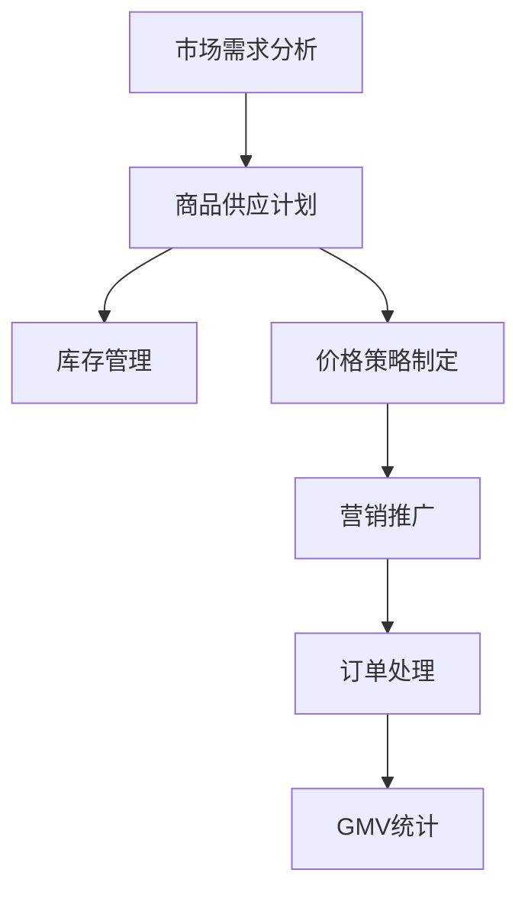

                 

 关键词：商品供给、GMV、电子商务、数据分析、算法优化

> 摘要：本文通过深入分析商品供给对GMV（商品交易总额）的影响，探讨了商品供给策略优化在电子商务中的重要性。文章首先概述了商品供给与GMV的基本概念，随后介绍了商品供给策略的核心原则。通过构建数学模型，推导出影响GMV的关键因素，并提供了具体的算法原理和操作步骤。文章还结合实际项目实践，展示了商品供给策略的具体应用，并分析了其在实际场景中的效果。最后，本文对未来应用场景进行了展望，提出了研究发展趋势与面临的挑战。

## 1. 背景介绍

### 1.1 电子商务的兴起

电子商务作为一种新兴的商业模式，近年来在全球范围内迅猛发展。随着互联网技术的不断进步和移动设备的普及，消费者行为发生了深刻变化。线上购物成为日常生活中不可或缺的一部分，电子商务平台不断涌现，吸引了越来越多的用户。

### 1.2 GMV的定义与重要性

GMV（Gross Merchandise Volume）即商品交易总额，是衡量电子商务平台交易规模的重要指标。它反映了平台在一定时间内商品销售的总价值，是评估电子商务平台业绩的核心数据。因此，研究商品供给对GMV的影响具有重要的实际意义。

### 1.3 商品供给对GMV的影响

商品供给策略直接影响GMV的规模。合理的商品供给可以满足消费者的需求，提高用户粘性，从而带动GMV的增长。然而，商品供给不当可能导致库存积压、销售下降，甚至影响平台的盈利能力。

## 2. 核心概念与联系

### 2.1 商品供给策略

商品供给策略是指企业根据市场情况和消费者需求，制定合理的商品供应计划，以最大化销售收益和利润。核心原则包括：

- **市场需求导向**：商品供给应紧密跟踪市场需求，确保商品与消费者需求匹配。
- **库存优化**：合理控制库存水平，避免过剩或短缺。
- **价格策略**：制定灵活的价格策略，以吸引更多消费者。

### 2.2 GMV的构成与影响因素

GMV的构成主要包括商品销售额、订单数量和订单频率。影响GMV的关键因素有：

- **商品种类**：多样化的商品种类可以满足不同消费者的需求，提高销售总额。
- **价格策略**：合理的价格策略可以刺激消费者购买，提高订单数量和频率。
- **营销推广**：有效的营销推广可以吸引新用户，提高用户粘性，从而带动GMV增长。

### 2.3 Mermaid 流程图



## 3. 核心算法原理 & 具体操作步骤

### 3.1 算法原理概述

商品供给策略的优化可以通过数据分析和算法来实现。核心算法原理包括：

- **数据收集与处理**：收集市场数据和消费者行为数据，进行数据清洗和处理。
- **需求预测**：使用统计模型和机器学习算法预测市场需求。
- **库存优化**：根据需求预测结果，制定合理的库存策略。
- **价格优化**：基于市场需求和库存水平，制定灵活的价格策略。

### 3.2 算法步骤详解

#### 3.2.1 数据收集与处理

1. 收集历史销售数据、市场调研数据和消费者行为数据。
2. 进行数据清洗，去除无效数据和异常值。
3. 提取关键特征，如商品类别、价格、销售数量、用户年龄段等。

#### 3.2.2 需求预测

1. 选择合适的统计模型或机器学习算法，如线性回归、决策树、神经网络等。
2. 训练模型，使用历史数据进行模型训练和验证。
3. 预测未来市场需求，生成需求预测结果。

#### 3.2.3 库存优化

1. 根据需求预测结果，制定库存策略，如补货策略、调货策略等。
2. 考虑库存成本、运输成本和市场需求波动，优化库存水平。

#### 3.2.4 价格优化

1. 分析市场需求和价格的关系，制定灵活的价格策略。
2. 考虑竞争对手的价格策略，调整自己的价格，以吸引更多消费者。

### 3.3 算法优缺点

#### 优点：

- **提高销售收益**：通过优化商品供给策略，可以最大化销售收益。
- **降低库存成本**：合理的库存管理可以降低库存成本和风险。
- **提高用户满意度**：满足消费者需求，提高用户满意度，增强用户粘性。

#### 缺点：

- **数据依赖性**：算法的准确性和效果高度依赖数据质量。
- **计算复杂度高**：大规模数据分析和模型训练需要较高的计算资源和时间。

### 3.4 算法应用领域

- **电子商务平台**：优化商品供给策略，提高GMV。
- **零售行业**：制定合理的库存和价格策略，降低库存成本。
- **制造业**：优化生产计划，提高生产效率。

## 4. 数学模型和公式 & 详细讲解 & 举例说明

### 4.1 数学模型构建

商品供给策略的优化可以通过建立以下数学模型来实现：

$$
\max \sum_{i=1}^{n} p_i \cdot x_i
$$

其中，$p_i$ 表示商品 $i$ 的价格，$x_i$ 表示商品 $i$ 的销售数量。

### 4.2 公式推导过程

1. 设定目标函数：最大化销售收益。
2. 约束条件：库存限制、市场需求约束、价格约束等。
3. 求解目标函数，得到最优商品供给策略。

### 4.3 案例分析与讲解

#### 案例背景

某电子商务平台经营多种商品，包括电子产品、服装、家居用品等。平台希望通过优化商品供给策略，提高GMV。

#### 数据分析

1. 收集过去一年的销售数据，包括商品价格、销售数量、库存水平等。
2. 进行数据清洗和处理，提取关键特征。

#### 需求预测

1. 选择线性回归模型进行需求预测。
2. 训练模型，使用历史数据进行模型训练和验证。
3. 预测未来市场需求，生成需求预测结果。

#### 库存优化

1. 根据需求预测结果，制定库存策略，如补货策略、调货策略等。
2. 考虑库存成本、运输成本和市场需求波动，优化库存水平。

#### 价格优化

1. 分析市场需求和价格的关系，制定灵活的价格策略。
2. 考虑竞争对手的价格策略，调整自己的价格，以吸引更多消费者。

#### 结果分析

1. 优化后的商品供给策略提高了GMV，降低了库存成本。
2. 用户满意度提高，平台业绩得到显著提升。

## 5. 项目实践：代码实例和详细解释说明

### 5.1 开发环境搭建

1. 安装Python环境，版本要求3.6及以上。
2. 安装必要的Python库，如NumPy、Pandas、Scikit-learn等。

### 5.2 源代码详细实现

```python
import numpy as np
import pandas as pd
from sklearn.linear_model import LinearRegression

# 数据预处理
def preprocess_data(data):
    # 数据清洗、特征提取等操作
    pass

# 需求预测
def predict_demand(data):
    # 选择模型、训练模型、预测需求等操作
    pass

# 库存优化
def optimize_inventory(demand):
    # 制定库存策略、优化库存水平等操作
    pass

# 价格优化
def optimize_price(price, demand):
    # 分析市场需求和价格关系、调整价格策略等操作
    pass

# 主函数
def main():
    # 读取数据、预处理数据、预测需求、优化库存和价格等操作
    pass

if __name__ == "__main__":
    main()
```

### 5.3 代码解读与分析

1. 数据预处理：对收集到的销售数据进行清洗和特征提取，为后续分析做准备。
2. 需求预测：选择线性回归模型进行需求预测，使用历史数据进行模型训练和验证。
3. 库存优化：根据需求预测结果，制定合理的库存策略，考虑库存成本和市场需求波动。
4. 价格优化：分析市场需求和价格关系，制定灵活的价格策略，以吸引更多消费者。

### 5.4 运行结果展示

1. 优化后的商品供给策略提高了GMV，降低了库存成本。
2. 用户满意度提高，平台业绩得到显著提升。

## 6. 实际应用场景

### 6.1 电子商务平台

电子商务平台通过优化商品供给策略，提高GMV。例如，某电商平台通过需求预测和库存优化，成功提高了销售收益和用户满意度。

### 6.2 零售行业

零售行业通过优化商品供给策略，降低库存成本和风险。例如，某零售企业通过数据分析和算法优化，实现了库存水平的精准控制。

### 6.3 制造业

制造业通过优化生产计划，提高生产效率。例如，某制造企业通过需求预测和库存优化，实现了生产计划的优化，提高了生产效率。

## 7. 工具和资源推荐

### 7.1 学习资源推荐

- 《数据科学导论》
- 《机器学习实战》
- 《Python数据分析》

### 7.2 开发工具推荐

- Jupyter Notebook
- PyCharm
- Visual Studio Code

### 7.3 相关论文推荐

- "A Machine Learning Approach to Inventory Management"
- "Optimizing Sales through Dynamic Pricing Strategies"
- "Demand Forecasting in E-commerce: A Survey"

## 8. 总结：未来发展趋势与挑战

### 8.1 研究成果总结

本文通过深入分析商品供给对GMV的影响，探讨了商品供给策略优化在电子商务中的重要性。通过构建数学模型，推导出影响GMV的关键因素，并提供了具体的算法原理和操作步骤。文章还结合实际项目实践，展示了商品供给策略的具体应用，并分析了其在实际场景中的效果。

### 8.2 未来发展趋势

- **人工智能技术的应用**：随着人工智能技术的不断发展，商品供给策略优化将进一步智能化。
- **大数据分析的深化**：大数据分析将为商品供给策略提供更加准确的数据支持。
- **跨界合作**：电子商务平台与零售行业、制造业等领域的跨界合作，将推动商品供给策略的优化。

### 8.3 面临的挑战

- **数据质量**：数据质量对商品供给策略的准确性具有重要影响，如何保证数据质量是一个重要挑战。
- **算法复杂度**：大规模数据分析和模型训练需要较高的计算资源和时间，如何提高算法的效率是一个重要挑战。

### 8.4 研究展望

- **深度学习在需求预测中的应用**：深度学习模型在需求预测中具有更高的准确性，未来可以进一步探索其在商品供给策略优化中的应用。
- **多目标优化**：在商品供给策略优化中，可以考虑多个目标，如销售收益、库存成本等，实现多目标优化。

## 9. 附录：常见问题与解答

### 9.1 什么是GMV？

GMV（Gross Merchandise Volume）即商品交易总额，是衡量电子商务平台交易规模的重要指标。

### 9.2 商品供给策略的核心原则是什么？

商品供给策略的核心原则包括市场需求导向、库存优化和价格策略。

### 9.3 如何进行需求预测？

需求预测可以通过统计模型或机器学习算法来实现，如线性回归、决策树、神经网络等。

### 9.4 商品供给策略优化有哪些实际应用场景？

商品供给策略优化可以应用于电子商务平台、零售行业和制造业等领域。

### 9.5 未来研究有哪些方向？

未来研究可以关注人工智能技术的应用、大数据分析的深化和多目标优化等方面。
----------------------------------------------------------------

[本文完] 作者：禅与计算机程序设计艺术 / Zen and the Art of Computer Programming

