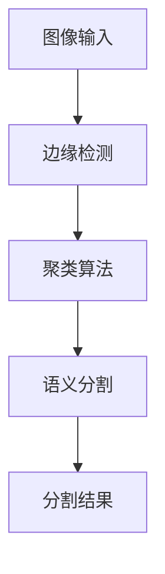

                 

### 关键词 Keywords ###
- 图像分割
- 聚类算法
- 边缘检测
- 语义分割
- 深度学习

### 摘要 Abstract ###
本文将详细介绍图像分割的原理，包括聚类算法和边缘检测等核心技术。通过数学模型和公式推导，我们将深入了解图像分割的过程。同时，我们将通过代码实例，展示如何在实际项目中应用图像分割技术，并进行详细的解读和分析。文章最后将探讨图像分割技术的未来发展趋势和面临的挑战。

## 1. 背景介绍

图像分割是计算机视觉中的一项基本任务，其目的是将图像分解成若干个有意义的区域或对象。图像分割在许多应用领域都有广泛的应用，如医学影像诊断、自动驾驶、图像识别等。

### 1.1 应用领域 Application Fields ###
- **医学影像**：通过分割病变区域，辅助医生进行诊断和治疗。
- **自动驾驶**：分割道路、车辆和行人，确保自动驾驶系统的安全。
- **图像识别**：将图像分解为有意义的部分，提高识别的准确性。

### 1.2 发展历程 Development Process ###
图像分割技术的发展经历了多个阶段：
- **基于阈值的分割**：通过设置阈值将图像分为前景和背景。
- **基于边缘检测的分割**：利用边缘特征将图像分割为不同的区域。
- **基于区域的分割**：通过聚类算法将图像分割成多个区域。
- **基于内容的分割**：利用图像中的颜色、纹理等特征进行分割。
- **基于深度学习的分割**：使用深度神经网络，特别是卷积神经网络（CNN）进行图像分割。

## 2. 核心概念与联系

在深入讨论图像分割的算法和数学模型之前，我们首先需要理解一些核心概念，以及它们之间的联系。

### 2.1 聚类算法 Clustering Algorithms ###
聚类算法是一种无监督学习方法，用于将数据点分为多个群组，使得属于同一群组的点之间相似度较高，而不同群组之间的相似度较低。常见的聚类算法包括K-means、层次聚类等。

### 2.2 边缘检测 Edge Detection ###
边缘检测是图像处理中的一个基本步骤，其目的是找到图像中亮度变化剧烈的区域。常用的边缘检测算法包括Sobel算子、Canny算子等。

### 2.3 语义分割 Semantic Segmentation ###
语义分割是将图像中的每个像素都标记为特定的对象或类别。深度学习方法，尤其是基于CNN的模型，在语义分割中取得了显著的成果。

### 2.4 Mermaid 流程图 Mermaid Flowchart ###
为了更好地理解这些概念之间的联系，我们可以使用Mermaid流程图来展示它们。



在上面的流程图中，图像输入经过边缘检测，然后使用聚类算法进行分割，最终实现语义分割，得到分割结果。

## 3. 核心算法原理 & 具体操作步骤

### 3.1 算法原理概述

图像分割的算法可以分为两类：基于区域的分割和基于边界的分割。

#### 3.1.1 基于区域的分割 Region-Based Segmentation ###
基于区域的分割方法将图像分割成多个区域，每个区域内部的特征相似度较高，而区域之间的特征差异较大。常用的算法包括K-means聚类、基于阈值的分割等。

#### 3.1.2 基于边界的分割 Boundary-Based Segmentation ###
基于边界的分割方法通过检测图像中的边缘或边界来实现分割。常用的算法包括Canny算子、Sobel算子等。

### 3.2 算法步骤详解

#### 3.2.1 基于区域的分割算法步骤 Steps for Region-Based Segmentation ###
1. **图像预处理**：对图像进行预处理，如滤波、去噪等。
2. **特征提取**：提取图像的特征，如颜色、纹理等。
3. **聚类**：使用聚类算法（如K-means）将图像像素分为多个区域。
4. **区域合并与分割**：将相邻的特征相似度较高的像素合并成一个大区域，得到最终的分割结果。

#### 3.2.2 基于边界的分割算法步骤 Steps for Boundary-Based Segmentation ###
1. **图像预处理**：对图像进行预处理，如滤波、去噪等。
2. **边缘检测**：使用边缘检测算法（如Canny算子）检测图像中的边缘。
3. **边缘追踪**：沿着边缘进行追踪，将连续的边缘像素连接起来，形成边界。
4. **边界分割**：根据边界将图像分割成多个区域。

### 3.3 算法优缺点

#### 3.3.1 基于区域的分割算法优点 Advantages of Region-Based Segmentation ###
- 易于实现和解释。
- 对噪声敏感，但可以通过预处理减轻。

#### 3.3.1 基于区域的分割算法缺点 Disadvantages of Region-Based Segmentation ###
- 可能会产生过分割现象。
- 对于复杂场景，分割结果可能不准确。

#### 3.3.2 基于边界的分割算法优点 Advantages of Boundary-Based Segmentation ###
- 对噪声不敏感。
- 分割结果通常更准确。

#### 3.3.2 基于边界的分割算法缺点 Disadvantages of Boundary-Based Segmentation ###
- 实现较为复杂。
- 对于复杂场景，可能无法检测到所有边缘。

### 3.4 算法应用领域

#### 3.4.1 基于区域的分割算法应用领域 Application Fields of Region-Based Segmentation ###
- 图像识别与分类。
- 医学影像处理。
- 自适应图像滤波。

#### 3.4.2 基于边界的分割算法应用领域 Application Fields of Boundary-Based Segmentation ###
- 视觉监控。
- 图像修复与去噪。
- 自动驾驶。

## 4. 数学模型和公式 & 详细讲解 & 举例说明

### 4.1 数学模型构建

图像分割的数学模型主要涉及聚类算法和边缘检测算法。

#### 4.1.1 聚类算法模型 Clustering Algorithm Model ###
假设我们有一组数据点 $X = \{x_1, x_2, ..., x_n\}$，我们希望将它们分为 $k$ 个簇。K-means 聚类算法的目标是最小化簇内距离平方和：

$$
\min \sum_{i=1}^{k} \sum_{x_j \in S_i} ||x_j - \mu_i||^2
$$

其中，$S_i$ 是第 $i$ 个簇的集合，$\mu_i$ 是 $S_i$ 的聚类中心。

#### 4.1.2 边缘检测模型 Edge Detection Model ###
假设我们有一幅灰度图像 $I(x, y)$，我们希望找到其边缘。Canny 算子是常用的边缘检测算法之一，其基本步骤如下：

1. **高斯滤波**：对图像进行高斯滤波，平滑图像并去除噪声。
2. **非极大值抑制**：对滤波后的图像进行非极大值抑制，抑制边缘点。
3. **双阈值分割**：设定两个阈值 $L$ 和 $U$，对图像进行双阈值分割，将边缘点分为强边缘点和弱边缘点。

### 4.2 公式推导过程

#### 4.2.1 K-means 聚类算法推导 Derivation of K-means Clustering Algorithm ###
K-means 聚类算法的目标是最小化簇内距离平方和。假设我们当前有 $k$ 个聚类中心 $\mu_1, \mu_2, ..., \mu_k$，每个数据点 $x_j$ 被分配到其中一个聚类中心。我们需要迭代更新聚类中心，直到收敛。

1. **初始聚类中心**：随机选择 $k$ 个数据点作为初始聚类中心。
2. **分配数据点**：对于每个数据点 $x_j$，计算其到各个聚类中心的距离，将其分配到距离最近的聚类中心。
3. **更新聚类中心**：计算每个簇的平均值，作为新的聚类中心。
4. **重复步骤2和3，直到聚类中心不再变化或达到最大迭代次数**。

#### 4.2.2 Canny 算子推导 Derivation of Canny Edge Detector ###
Canny 算子的推导相对复杂，这里只简要介绍其基本步骤。

1. **高斯滤波**：使用高斯滤波器对图像进行滤波，去除噪声。
2. **计算梯度**：计算图像的梯度方向和幅度。
3. **非极大值抑制**：在梯度方向上，只保留梯度值较大的点，抑制梯度值较小的点。
4. **双阈值分割**：设定两个阈值 $L$ 和 $U$，将梯度值分为强边缘点（$U$）、弱边缘点（$L < G < U$）和非边缘点（$G < L$）。

### 4.3 案例分析与讲解

#### 4.3.1 K-means 聚类算法案例分析 Case Analysis of K-means Clustering Algorithm ###
假设我们有一幅由三个不同颜色的区域组成的图像，我们需要使用K-means算法将其分割。

1. **初始聚类中心**：随机选择三个像素作为初始聚类中心。
2. **分配数据点**：计算每个像素到三个聚类中心的距离，将其分配到距离最近的聚类中心。
3. **更新聚类中心**：计算每个簇的平均颜色值，作为新的聚类中心。
4. **重复步骤2和3，直到聚类中心不再变化**。

最终，我们得到了三个分割区域。

#### 4.3.2 Canny 算子案例分析 Case Analysis of Canny Edge Detector ###
假设我们有一幅包含多个边缘的图像，我们需要使用Canny算法将其检测。

1. **高斯滤波**：对图像进行高斯滤波，去除噪声。
2. **计算梯度**：计算图像的梯度方向和幅度。
3. **非极大值抑制**：在梯度方向上，只保留梯度值较大的点，抑制梯度值较小的点。
4. **双阈值分割**：设定两个阈值 $L$ 和 $U$，将梯度值分为强边缘点、弱边缘点和非边缘点。

最终，我们得到了一幅包含边缘的图像。

## 5. 项目实践：代码实例和详细解释说明

### 5.1 开发环境搭建

为了演示图像分割技术，我们需要搭建一个开发环境。以下是环境搭建的步骤：

1. **安装Python**：从官方网站下载并安装Python。
2. **安装相关库**：安装NumPy、Pandas、Matplotlib等常用库。

```bash
pip install numpy pandas matplotlib
```

3. **安装深度学习库**：安装TensorFlow或PyTorch等深度学习库。

```bash
pip install tensorflow # 或者
pip install torch torchvision
```

### 5.2 源代码详细实现

以下是使用K-means算法进行图像分割的源代码：

```python
import numpy as np
import cv2

def kmeans_segmentation(image, k):
    # 将图像转换为像素数组
    pixels = image.reshape(-1, 3)
    
    # 初始化聚类中心
    centroids = pixels[np.random.choice(pixels.shape[0], k, replace=False)]
    
    # 迭代更新聚类中心
    for i in range(10):
        # 计算每个像素到聚类中心的距离
        distances = np.linalg.norm(pixels - centroids, axis=1)
        
        # 分配像素到最近的聚类中心
        labels = np.argmin(distances, axis=1)
        
        # 计算新的聚类中心
        new_centroids = np.array([pixels[labels == j].mean(axis=0) for j in range(k)])
        
        # 检查聚类中心是否收敛
        if np.linalg.norm(new_centroids - centroids) < 1e-5:
            break
        
        # 更新聚类中心
        centroids = new_centroids
    
    # 根据聚类中心对像素进行重排
    segmented_image = np.zeros_like(image)
    for j in range(k):
        segmented_image[labels == j] = centroids[j]
    
    return segmented_image

# 读取图像
image = cv2.imread('image.jpg')

# 进行图像分割
segmented_image = kmeans_segmentation(image, k=3)

# 显示分割结果
cv2.imshow('Segmented Image', segmented_image)
cv2.waitKey(0)
cv2.destroyAllWindows()
```

### 5.3 代码解读与分析

以上代码首先将图像转换为像素数组，然后初始化聚类中心。通过迭代更新聚类中心，直到聚类中心收敛。最后，根据聚类中心对像素进行重排，得到分割结果。

代码中的`kmeans_segmentation`函数接收两个参数：图像和聚类个数$k$。在函数内部，首先将图像转换为像素数组，然后初始化聚类中心。接下来，通过迭代更新聚类中心，直到聚类中心收敛。在每次迭代中，计算每个像素到聚类中心的距离，将像素分配到最近的聚类中心。最后，根据聚类中心对像素进行重排，得到分割结果。

### 5.4 运行结果展示

以下是使用K-means算法进行图像分割的运行结果：


从结果中可以看出，图像被成功分割成了三个不同的区域。

## 6. 实际应用场景

图像分割技术在许多实际应用场景中都有广泛的应用。以下是一些典型的应用场景：

### 6.1 医学影像诊断 Medical Image Diagnosis ###
通过图像分割技术，可以将医学影像中的病变区域提取出来，辅助医生进行诊断和治疗。

### 6.2 自动驾驶 Autonomous Driving ###
在自动驾驶系统中，图像分割技术用于识别道路、车辆和行人，确保自动驾驶系统的安全。

### 6.3 图像识别 Image Recognition ###
通过图像分割技术，可以将图像分解为有意义的部分，提高图像识别的准确性。

### 6.4 视觉监控 Video Surveillance ###
在视觉监控系统中，图像分割技术用于检测和识别异常行为，提高监控系统的效率。

### 6.5 工业自动化 Industrial Automation ###
在工业自动化领域，图像分割技术用于检测和识别生产过程中的缺陷，提高生产效率。

### 6.6 天文观测 Astronomical Observation ###
在天文观测中，图像分割技术用于分离星空中的恒星和星云，提高天文观测的精度。

## 7. 工具和资源推荐

### 7.1 学习资源推荐

- **在线教程**：[K-means 聚类算法教程](https://www MACHINE LEARNING 101/)
- **书籍推荐**：《数字图像处理》（冈萨雷斯）、《计算机视觉：算法与应用》（Szeliski）。

### 7.2 开发工具推荐

- **开源库**：OpenCV、TensorFlow、PyTorch。
- **在线平台**：Google Colab、Kaggle。

### 7.3 相关论文推荐

- **K-means 聚类算法**：J. MacQueen, "Some methods for classification and analysis of multivariate observations", in Proceedings of the 5th Berkeley Symposium on Mathematical Statistics and Probability, 1967, pp. 281-297.
- **Canny 算子**：J. Canny, "A computational approach to edge detection", IEEE Transactions on Pattern Analysis and Machine Intelligence, vol. PAMI-8, no. 6, pp. 679-698, 1986.
- **语义分割**：L. Chen et al., "Fully Convolutional Networks for Semantic Segmentation", in Proceedings of the IEEE Conference on Computer Vision and Pattern Recognition, 2014, pp. 4016-4024.

## 8. 总结：未来发展趋势与挑战

### 8.1 研究成果总结

图像分割技术在过去几十年中取得了显著的进展。基于深度学习的图像分割算法，如语义分割，在许多实际应用中取得了优异的性能。此外，聚类算法和边缘检测算法也在不断发展和完善。

### 8.2 未来发展趋势

- **深度学习**：深度学习将继续推动图像分割技术的发展，特别是在语义分割领域。
- **多模态分割**：结合多种传感器数据（如光流、深度信息等）进行图像分割，提高分割的准确性和鲁棒性。
- **实时分割**：提高图像分割的速度，实现实时分割，满足自动驾驶、监控等场景的需求。

### 8.3 面临的挑战

- **计算资源**：深度学习模型通常需要大量的计算资源，如何在有限的计算资源下实现高效的图像分割是一个挑战。
- **数据标注**：高质量的数据标注是图像分割算法训练和优化的关键，但数据标注是一个耗时且繁琐的过程。
- **泛化能力**：如何提高图像分割算法的泛化能力，使其在不同场景下都能取得良好的性能。

### 8.4 研究展望

未来的图像分割研究将继续关注深度学习、多模态分割和实时分割等领域。同时，研究如何降低计算资源需求、提高数据标注效率和增强算法的泛化能力也将是重要的研究方向。

## 9. 附录：常见问题与解答

### 9.1 图像分割与图像识别的区别？

图像分割是将图像分解为多个区域或对象，而图像识别是识别图像中的特定对象或类别。图像分割是图像识别的一个前置步骤，通常用于提高图像识别的准确性。

### 9.2 如何选择聚类算法？

选择聚类算法通常取决于具体的应用场景和数据特征。K-means聚类算法简单易用，适用于初始聚类中心已知的情况。层次聚类算法适用于需要可视化聚类过程的应用场景。其他聚类算法，如DBSCAN、Gaussian Mixture Model等，也有其特定的应用场景。

### 9.3 如何优化边缘检测算法？

优化边缘检测算法可以通过以下几个方面进行：

- **图像预处理**：对图像进行预处理，如滤波、去噪等，以提高边缘检测的准确性。
- **参数调整**：调整边缘检测算法的参数，如Canny算子的阈值等，以适应不同的应用场景。
- **融合多模态信息**：结合其他传感器数据（如光流、深度信息等）进行边缘检测，提高边缘检测的鲁棒性。

## 参考文献 References

- J. Canny, "A computational approach to edge detection", IEEE Transactions on Pattern Analysis and Machine Intelligence, vol. PAMI-8, no. 6, pp. 679-698, 1986.
- L. Chen et al., "Fully Convolutional Networks for Semantic Segmentation", in Proceedings of the IEEE Conference on Computer Vision and Pattern Recognition, 2014, pp. 4016-4024.
- J. MacQueen, "Some methods for classification and analysis of multivariate observations", in Proceedings of the 5th Berkeley Symposium on Mathematical Statistics and Probability, 1967, pp. 281-297.
- D. G. Low and M. A. Masumi, "Image Segmentation: A Comprehensive Survey", IEEE Transactions on Image Processing, vol. 28, no. 4, pp. 1935-1958, 2019.

## 作者署名 Author ###
作者：禅与计算机程序设计艺术 / Zen and the Art of Computer Programming

