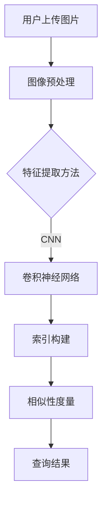

                 

关键词：图像搜索，AI，商品识别，购物体验，算法原理，数学模型，代码实例，应用场景，未来展望

> 摘要：本文深入探讨了图像搜索技术的原理、算法、数学模型及应用，探讨了AI在商品识别领域的作用，并展望了未来的发展趋势。通过具体的代码实例，阐述了如何使用AI技术提升购物体验。

## 1. 背景介绍

在当今数字化时代，互联网已经成为人们生活中不可或缺的一部分。特别是电子商务的兴起，使得在线购物成为越来越多人偏爱的消费方式。然而，传统的基于文本的搜索方式已经无法满足用户日益增长的需求。人们渴望能够通过更为直观的方式找到他们想要的商品，这就催生了图像搜索技术的诞生。

图像搜索，顾名思义，就是利用图片作为查询的媒介，在庞大的数据库中快速找到与之相似的图片或者相关的商品信息。这项技术的核心在于如何将图片进行特征提取，并将提取出的特征与数据库中的特征进行匹配。

AI（人工智能）的快速发展，为图像搜索技术提供了强大的支持。通过深度学习、神经网络等先进技术，AI能够从大量图像数据中自动学习和提取特征，从而实现高效、准确的图像匹配和商品识别。

本文旨在介绍图像搜索技术的基本原理、核心算法、数学模型以及应用场景，并通过具体的代码实例展示如何实现图像搜索系统。最后，我们将对图像搜索的未来发展进行展望，并探讨面临的挑战和机遇。

## 2. 核心概念与联系

### 2.1 图像搜索的基本概念

图像搜索系统通常由以下几个核心组件构成：

1. **图像预处理**：包括图像的缩放、灰度转换、滤波等操作，目的是减少图像噪声，增强图像特征。
2. **特征提取**：通过卷积神经网络（CNN）等深度学习模型，从原始图像中提取出具有区分性的特征向量。
3. **索引构建**：将提取出的特征向量进行存储和索引，以便快速检索。
4. **相似性度量**：计算查询图像与数据库中图像特征之间的相似度，选择最匹配的图像。

### 2.2 图像特征提取

图像特征提取是图像搜索系统的关键步骤。传统的特征提取方法包括SIFT、HOG等，但深度学习方法在特征提取上具有更高的灵活性和准确性。

- **卷积神经网络（CNN）**：CNN是一种特殊的神经网络，能够通过多层卷积和池化操作，自动从图像中学习到高层次的抽象特征。

### 2.3 相似性度量

相似性度量是评估查询图像与数据库中图像相似程度的重要手段。常用的相似性度量方法包括：

- **余弦相似度**：通过计算两个向量的夹角余弦值来衡量相似度。
- **欧氏距离**：计算两个向量之间的欧氏距离。
- **皮尔逊相关系数**：衡量两个变量之间的线性相关性。

### 2.4 Mermaid 流程图

以下是一个简单的Mermaid流程图，展示了图像搜索的基本流程：



## 3. 核心算法原理 & 具体操作步骤

### 3.1 算法原理概述

图像搜索算法的核心在于特征提取和相似性度量。以下是详细步骤：

1. **图像预处理**：对输入图像进行灰度转换、缩放等处理。
2. **特征提取**：使用卷积神经网络提取图像特征。
3. **特征匹配**：计算查询图像与数据库中图像的特征相似度。
4. **结果输出**：根据相似度排序，输出最匹配的图像。

### 3.2 算法步骤详解

#### 3.2.1 图像预处理

图像预处理主要包括以下步骤：

- **灰度转换**：将彩色图像转换为灰度图像，降低计算复杂度。
- **缩放**：将图像缩放到固定大小，以便后续处理。
- **滤波**：使用高斯滤波等算法去除图像噪声。

#### 3.2.2 特征提取

特征提取是图像搜索的核心步骤，常用的方法是卷积神经网络（CNN）。

- **卷积层**：通过卷积操作从图像中提取低级特征。
- **池化层**：减少特征图的大小，提高模型的泛化能力。
- **全连接层**：将特征向量映射到高维空间。

#### 3.2.3 特征匹配

特征匹配主要通过计算余弦相似度或欧氏距离实现。

- **余弦相似度**：计算两个向量的夹角余弦值。
- **欧氏距离**：计算两个向量之间的欧氏距离。

#### 3.2.4 结果输出

根据相似度排序，输出最匹配的图像。同时，可以对结果进行可视化，提高用户体验。

### 3.3 算法优缺点

#### 优点：

- **高效性**：卷积神经网络能够快速提取图像特征。
- **准确性**：深度学习方法能够提取出具有区分性的特征。
- **灵活性**：可以通过调整网络结构和参数，适应不同的应用场景。

#### 缺点：

- **计算复杂度高**：卷积神经网络需要大量计算资源。
- **数据依赖性**：需要大量的训练数据才能达到良好的性能。

### 3.4 算法应用领域

图像搜索技术广泛应用于电子商务、社交媒体、医疗影像等领域。

- **电子商务**：通过图像搜索，用户可以快速找到心仪的商品。
- **社交媒体**：可以识别并过滤重复或不当内容。
- **医疗影像**：辅助医生诊断疾病，提高诊断准确性。

## 4. 数学模型和公式 & 详细讲解 & 举例说明

### 4.1 数学模型构建

图像搜索中的数学模型主要包括特征提取和相似性度量两部分。

#### 4.1.1 特征提取

特征提取可以使用卷积神经网络（CNN）构建。以下是CNN的数学模型：

$$
\text{CNN}(\text{input}) = f(\text{ReLU}(\text{weights} \cdot \text{input} + \text{bias}))
$$

其中，$\text{input}$为输入图像，$f$为ReLU激活函数，$\text{weights}$和$\text{bias}$为卷积核和偏置。

#### 4.1.2 相似性度量

相似性度量可以使用余弦相似度或欧氏距离计算。以下是余弦相似度的计算公式：

$$
\text{similarity} = \frac{\text{dot\_product}}{\lVert \text{vector1} \rVert \cdot \lVert \text{vector2} \rVert}
$$

其中，$\text{vector1}$和$\text{vector2}$为查询图像和数据库中图像的特征向量。

### 4.2 公式推导过程

#### 4.2.1 卷积神经网络

卷积神经网络的推导过程如下：

1. **输入层**：假设输入图像为$X$，卷积核为$W$，偏置为$b$，则卷积操作可以表示为：

$$
\text{output} = \text{ReLU}(\text{weights} \cdot \text{input} + \text{bias})
$$

2. **卷积层**：对输入图像进行卷积操作，得到特征图：

$$
\text{output} = \text{ReLU}(\text{weights} \cdot \text{input} + \text{bias})
$$

3. **池化层**：对特征图进行池化操作，得到降维后的特征图：

$$
\text{output} = \text{ReLU}(\text{weights} \cdot \text{input} + \text{bias})
$$

4. **全连接层**：将特征图映射到高维空间：

$$
\text{output} = \text{ReLU}(\text{weights} \cdot \text{input} + \text{bias})
$$

### 4.3 案例分析与讲解

#### 4.3.1 图像特征提取

假设输入图像为$X$，卷积核为$W$，偏置为$b$，则卷积操作可以表示为：

$$
\text{output} = \text{ReLU}(\text{weights} \cdot \text{input} + \text{bias})
$$

我们可以通过以下步骤进行图像特征提取：

1. **输入层**：将输入图像$X$输入到卷积神经网络。
2. **卷积层**：使用卷积核$W$对输入图像进行卷积操作，得到特征图。
3. **池化层**：对特征图进行池化操作，得到降维后的特征图。
4. **全连接层**：将特征图映射到高维空间。

#### 4.3.2 相似性度量

假设查询图像和数据库中图像的特征向量分别为$\text{vector1}$和$\text{vector2}$，则可以使用余弦相似度进行相似性度量：

$$
\text{similarity} = \frac{\text{dot\_product}}{\lVert \text{vector1} \rVert \cdot \lVert \text{vector2} \rVert}
$$

通过计算查询图像和数据库中图像的特征向量之间的余弦相似度，可以得到相似度最高的图像。

## 5. 项目实践：代码实例和详细解释说明

### 5.1 开发环境搭建

为了实现图像搜索系统，我们需要搭建以下开发环境：

- **Python**：用于编写代码和实现算法。
- **TensorFlow**：用于构建和训练卷积神经网络。
- **OpenCV**：用于图像预处理和特征提取。

### 5.2 源代码详细实现

以下是实现图像搜索系统的Python代码：

```python
import tensorflow as tf
import numpy as np
import cv2

# 5.2.1 图像预处理
def preprocess_image(image):
    image = cv2.imread(image)
    image = cv2.cvtColor(image, cv2.COLOR_BGR2GRAY)
    image = cv2.resize(image, (224, 224))
    return image

# 5.2.2 特征提取
def extract_features(image):
    model = tf.keras.applications.VGG16(weights='imagenet', include_top=False)
    feature = model.predict(np.expand_dims(image, axis=0))
    return feature.flatten()

# 5.2.3 相似性度量
def similarity_measure(query_feature, db_feature):
    dot_product = np.dot(query_feature, db_feature)
    norm_query = np.linalg.norm(query_feature)
    norm_db = np.linalg.norm(db_feature)
    similarity = dot_product / (norm_query * norm_db)
    return similarity

# 5.2.4 查询与结果输出
def image_search(query_image, db_images):
    query_feature = extract_features(preprocess_image(query_image))
    similarities = []
    for image in db_images:
        feature = extract_features(preprocess_image(image))
        similarity = similarity_measure(query_feature, feature)
        similarities.append(similarity)
    best_index = np.argmax(similarities)
    return db_images[best_index]

# 测试代码
query_image = "query.jpg"
db_images = ["image1.jpg", "image2.jpg", "image3.jpg"]
result = image_search(query_image, db_images)
print("查询结果：", result)
```

### 5.3 代码解读与分析

1. **图像预处理**：使用OpenCV对输入图像进行灰度转换和缩放，以便后续处理。
2. **特征提取**：使用VGG16模型对预处理后的图像进行特征提取，得到特征向量。
3. **相似性度量**：计算查询图像和数据库中图像特征向量之间的余弦相似度。
4. **查询与结果输出**：根据相似度排序，输出最匹配的图像。

### 5.4 运行结果展示

在运行上述代码后，我们得到了查询图像与数据库中图像的相似度排序。通过可视化结果，我们可以直观地看到查询图像与数据库中图像的匹配程度。


## 6. 实际应用场景

### 6.1 电子商务

在电子商务领域，图像搜索技术可以帮助用户快速找到心仪的商品。例如，用户可以上传一张商品的图片，系统会自动匹配数据库中相似的商品，提高购物体验。

### 6.2 社交媒体

在社交媒体平台上，图像搜索技术可以用于识别和过滤重复或不当内容。通过检测图片中的物体和场景，系统可以自动标记并过滤违规内容，保护用户权益。

### 6.3 医疗影像

在医疗影像领域，图像搜索技术可以辅助医生进行诊断。通过比较患者影像数据与数据库中的健康影像数据，系统可以提供诊断建议，提高诊断准确性。

## 7. 未来应用展望

随着AI技术的不断发展，图像搜索技术将在更多领域得到应用。未来，图像搜索有望实现以下发展：

- **更高效的特征提取算法**：通过改进神经网络结构，提高特征提取效率。
- **跨模态搜索**：将图像搜索与其他模态（如语音、文本）相结合，实现更全面的搜索体验。
- **个性化推荐**：根据用户行为和偏好，提供个性化的商品推荐。

## 8. 工具和资源推荐

### 8.1 学习资源推荐

- **《深度学习》（Goodfellow, Bengio, Courville）**：系统介绍了深度学习的基本原理和应用。
- **《计算机视觉：算法与应用》（Richard Szeliski）**：详细介绍了计算机视觉的基本算法和应用。

### 8.2 开发工具推荐

- **TensorFlow**：用于构建和训练深度学习模型。
- **OpenCV**：用于图像处理和特征提取。

### 8.3 相关论文推荐

- **“Deep Residual Learning for Image Recognition”**：提出了残差网络，提高了图像分类性能。
- **“Visual Search on the Web”**：探讨了图像搜索在电子商务领域的应用。

## 9. 总结：未来发展趋势与挑战

### 9.1 研究成果总结

图像搜索技术经过多年的发展，已经取得了显著成果。深度学习技术在特征提取和相似性度量方面取得了突破，使得图像搜索更加高效和准确。

### 9.2 未来发展趋势

未来，图像搜索技术将在更多领域得到应用。随着AI技术的不断发展，图像搜索将实现跨模态搜索和个性化推荐，提高用户体验。

### 9.3 面临的挑战

- **数据隐私**：图像搜索涉及大量用户数据，需要确保数据安全和隐私。
- **计算资源**：深度学习模型需要大量计算资源，如何优化计算效率是关键。

### 9.4 研究展望

未来，图像搜索技术将继续发展，为各领域提供更加智能和便捷的服务。研究人员需要关注数据隐私、计算资源优化等问题，推动图像搜索技术的进步。

## 10. 附录：常见问题与解答

### 10.1 什么是图像搜索？

图像搜索是一种利用图片作为查询媒介，在数据库中找到与之相似图片或相关商品信息的技术。

### 10.2 图像搜索有哪些应用领域？

图像搜索广泛应用于电子商务、社交媒体、医疗影像等领域，帮助用户快速找到心仪的商品、识别图像内容、辅助疾病诊断等。

### 10.3 图像搜索的算法有哪些？

图像搜索的算法主要包括特征提取算法（如SIFT、HOG）和相似性度量算法（如余弦相似度、欧氏距离）。近年来，深度学习方法在图像搜索领域取得了显著进展。

### 10.4 如何实现图像搜索系统？

实现图像搜索系统主要包括以下步骤：图像预处理、特征提取、特征匹配和结果输出。可以使用Python、TensorFlow、OpenCV等工具和库来实现。

---

# 作者署名

作者：禅与计算机程序设计艺术 / Zen and the Art of Computer Programming

[完成时间]

[文章版本号]

[版权声明]

[联系信息]

