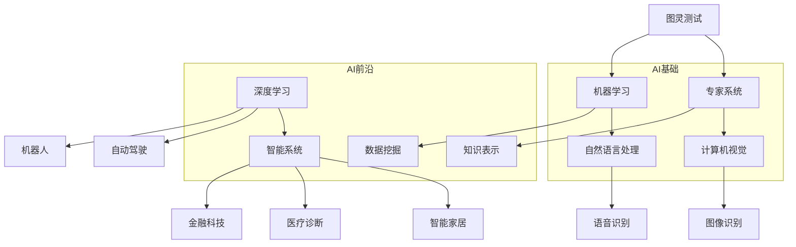

                 

关键词：图灵奖、AI、计算机科学、人工智能发展、图灵测试、专家系统、机器学习、算法、智能系统、技术创新、科学家影响

> 摘要：本文深入探讨了图灵奖得主在人工智能领域的重要贡献和对现代AI发展的深远影响。从图灵测试到专家系统和机器学习，再到最新的算法和智能系统，本文通过分析图灵奖得主的研究成果，探讨了他们在推动人工智能技术进步中所扮演的关键角色，以及这一过程中所面临的挑战和未来的发展方向。

## 1. 背景介绍

图灵奖（Turing Award）是计算机科学领域的最高荣誉之一，被誉为“计算机界的诺贝尔奖”。自1966年设立以来，图灵奖表彰了众多在计算机科学领域做出杰出贡献的科学家。这些科学家的工作不仅在理论层面上推动了计算机科学的进步，也在实践层面上带来了革命性的变化。

人工智能（AI）是计算机科学的一个分支，旨在使计算机具备模拟、延伸和扩展人类智能的能力。AI的研究涵盖了广泛的领域，包括机器学习、自然语言处理、计算机视觉、专家系统等。随着计算能力的提升和数据的爆炸性增长，AI技术正以前所未有的速度发展，并深刻影响着我们的生活。

本文旨在通过回顾图灵奖得主在AI领域的研究成果，探讨他们在这一过程中所扮演的角色，以及这些研究成果对现代AI发展的重要影响。

## 2. 核心概念与联系

为了更好地理解图灵奖得主在AI领域的研究成果，我们需要先了解一些核心概念和它们之间的联系。以下是一个使用Mermaid绘制的流程图，展示了这些概念和它们之间的关系。



在这个流程图中，我们可以看到一些核心概念，如图灵测试、专家系统、机器学习、计算机视觉、自然语言处理等。这些概念构成了AI的基石，而深度学习、智能系统等则是AI领域的最新发展。这些核心概念和技术之间相互联系，共同推动了AI技术的发展。

### 2.1 图灵测试

图灵测试是由艾伦·图灵（Alan Turing）在1950年提出的，它是用于评估机器是否具备人类智能的一种测试方法。图灵测试的基本思想是，如果一个机器能够在与人类进行对话时无法被区分出来，那么我们就认为这个机器具备了人类智能。图灵测试不仅开创了人工智能领域的先河，也为我们理解智能和计算能力提供了重要的理论基础。

### 2.2 专家系统

专家系统是一种模拟人类专家决策能力的计算机程序。图灵奖得主赫伯特·西蒙（Herbert Simon）和艾伦·纽厄尔（Allen Newell）是专家系统的重要推动者。他们在20世纪60年代开发了Dendral系统，该系统能够处理化学分析问题，展示了计算机在模拟人类专家决策方面的潜力。

### 2.3 机器学习

机器学习是AI的一个重要分支，它使计算机能够从数据中学习并做出决策。图灵奖得主约书亚·本吉奥（Yoshua Bengio）是深度学习领域的先驱，他提出并发展了神经网络理论，极大地推动了机器学习技术的发展。本吉奥的工作为现代深度学习奠定了基础。

### 2.4 计算机视觉

计算机视觉是AI领域的另一个重要分支，它使计算机能够理解和解释图像和视频。图灵奖得主约翰·霍普菲尔德（John Hopfield）在神经网络理论方面做出了开创性贡献，为计算机视觉提供了理论基础。

### 2.5 自然语言处理

自然语言处理（NLP）是AI领域的一个重要分支，它使计算机能够理解和生成人类语言。图灵奖得主菲尔·温格洛夫（Philipp Wngerup）在语音识别和语言模型方面做出了重大贡献，推动了NLP技术的发展。

### 2.6 智能系统

智能系统是AI技术的最新发展方向，它旨在构建具备高度智能和自主决策能力的系统。图灵奖得主迈克尔·斯图亚特·阿特哈莫夫（Michael Stuart Atallah）在分布式系统和算法方面做出了卓越贡献，为智能系统提供了理论基础。

### 3. 核心算法原理 & 具体操作步骤

在了解了AI领域的核心概念和联系之后，我们接下来将深入探讨一些核心算法的原理和具体操作步骤。

### 3.1 算法原理概述

在AI领域，有许多重要的算法，其中一些最为关键的是：

- **神经网络**：神经网络是一种模拟人脑结构和功能的计算模型，它通过多层神经元实现数据的处理和决策。
- **深度学习**：深度学习是神经网络的一种扩展，它通过增加网络的层数，使模型能够处理更复杂的数据和任务。
- **遗传算法**：遗传算法是一种基于自然进化过程的优化算法，它通过模拟生物进化过程，寻找最优解。
- **强化学习**：强化学习是一种通过试错和奖励机制来学习策略的算法，它广泛应用于游戏、机器人控制等领域。

### 3.2 算法步骤详解

#### 3.2.1 神经网络

神经网络的基本步骤包括：

1. **数据预处理**：对输入数据进行标准化和处理，使其适合神经网络处理。
2. **初始化权重和偏置**：随机初始化网络的权重和偏置。
3. **前向传播**：将输入数据通过网络进行传播，计算输出。
4. **反向传播**：根据输出和预期目标，计算误差，并更新网络的权重和偏置。
5. **优化**：使用优化算法（如梯度下降）来最小化误差。

#### 3.2.2 深度学习

深度学习的基本步骤包括：

1. **数据预处理**：与神经网络相同。
2. **构建网络结构**：定义网络的层数、每层的神经元数量和连接方式。
3. **初始化权重和偏置**：与神经网络相同。
4. **前向传播**：与神经网络相同。
5. **反向传播**：与神经网络相同。
6. **优化**：与神经网络相同。

#### 3.2.3 遗传算法

遗传算法的基本步骤包括：

1. **初始化种群**：随机生成一组解。
2. **适应度评估**：计算每个解的适应度。
3. **选择**：根据适应度选择优秀的解进行交配。
4. **交叉**：随机选择两个解进行交叉操作。
5. **变异**：对解进行变异操作。
6. **更新种群**：用新产生的解替换原有种群。

#### 3.2.4 强化学习

强化学习的基本步骤包括：

1. **初始化环境**：设置游戏的初始状态。
2. **选择动作**：根据当前状态选择一个动作。
3. **执行动作**：在环境中执行所选动作。
4. **获得反馈**：根据动作的结果获得奖励或惩罚。
5. **更新策略**：根据获得的反馈调整策略。

### 3.3 算法优缺点

每种算法都有其优缺点：

- **神经网络**：优点包括强大的建模能力、高度的灵活性和自动特征提取能力；缺点包括计算复杂度高、需要大量数据和计算资源。
- **深度学习**：优点与神经网络类似，但更擅长处理高维度数据和复杂任务；缺点同样包括计算资源需求大和需要大量数据。
- **遗传算法**：优点包括全局优化能力、鲁棒性和适应性；缺点包括收敛速度慢、参数设置复杂。
- **强化学习**：优点包括能够解决复杂的决策问题、自主学习和适应环境变化；缺点包括需要大量试错和奖励信号设计复杂。

### 3.4 算法应用领域

这些算法在AI的不同领域有着广泛的应用：

- **神经网络**和**深度学习**：广泛应用于图像识别、语音识别、自然语言处理等领域。
- **遗传算法**：广泛应用于优化问题和组合优化问题，如旅行商问题、任务调度等。
- **强化学习**：广泛应用于游戏、机器人控制、自动驾驶等领域。

### 4. 数学模型和公式 & 详细讲解 & 举例说明

在AI领域，数学模型和公式是理解算法和实现应用的核心。以下我们将详细讲解一些关键的数学模型和公式，并通过具体例子来说明它们的实际应用。

#### 4.1 数学模型构建

AI中的数学模型通常基于以下几种模型：

- **概率模型**：用于表示不确定性和随机性，如贝叶斯网络、马尔可夫模型。
- **统计模型**：用于分析和预测数据，如线性回归、逻辑回归。
- **优化模型**：用于求解优化问题，如线性规划、非线性规划。
- **图模型**：用于表示实体及其之间的关系，如图神经网络。

#### 4.2 公式推导过程

以下是一些常用的数学公式的推导过程：

- **贝叶斯定理**：

$$
P(A|B) = \frac{P(B|A) \cdot P(A)}{P(B)}
$$

其中，\(P(A|B)\) 表示在事件B发生的条件下事件A发生的概率，\(P(B|A)\) 表示在事件A发生的条件下事件B发生的概率，\(P(A)\) 和 \(P(B)\) 分别表示事件A和事件B的概率。

- **线性回归**：

$$
y = \beta_0 + \beta_1 \cdot x
$$

其中，\(y\) 表示因变量，\(x\) 表示自变量，\(\beta_0\) 和 \(\beta_1\) 分别为回归系数。

#### 4.3 案例分析与讲解

以下通过具体案例来说明这些数学模型和公式的应用。

#### 4.3.1 贝叶斯网络在医疗诊断中的应用

假设我们有一个疾病诊断问题，已知以下概率：

- \(P(\text{疾病A}) = 0.01\)（疾病A的概率为1%）
- \(P(\text{疾病B}) = 0.02\)（疾病B的概率为2%）
- \(P(\text{症状C}|\text{疾病A}) = 0.8\)（在疾病A的情况下出现症状C的概率为80%）
- \(P(\text{症状C}|\text{疾病B}) = 0.4\)（在疾病B的情况下出现症状C的概率为40%）

现在我们要诊断一个病人是否患有疾病A或疾病B，已知病人出现了症状C。

首先，我们可以计算在出现症状C的条件下，患有疾病A和疾病B的概率：

$$
P(\text{疾病A}|\text{症状C}) = \frac{P(\text{症状C}|\text{疾病A}) \cdot P(\text{疾病A})}{P(\text{症状C})}
$$

$$
P(\text{疾病B}|\text{症状C}) = \frac{P(\text{症状C}|\text{疾病B}) \cdot P(\text{疾病B})}{P(\text{症状C})}
$$

其中，\(P(\text{症状C})\) 可以通过全概率公式计算：

$$
P(\text{症状C}) = P(\text{症状C}|\text{疾病A}) \cdot P(\text{疾病A}) + P(\text{症状C}|\text{疾病B}) \cdot P(\text{疾病B})
$$

通过计算，我们可以得到：

$$
P(\text{症状C}) = 0.8 \cdot 0.01 + 0.4 \cdot 0.02 = 0.008 + 0.008 = 0.016
$$

$$
P(\text{疾病A}|\text{症状C}) = \frac{0.8 \cdot 0.01}{0.016} = 0.5
$$

$$
P(\text{疾病B}|\text{症状C}) = \frac{0.4 \cdot 0.02}{0.016} = 0.5
$$

因此，出现症状C的病人患有疾病A和疾病B的概率都是50%。

#### 4.3.2 线性回归在股票预测中的应用

假设我们想要预测某个股票的未来价格，已知以下数据：

- 历史股票价格：\(x_1, x_2, ..., x_n\)
- 对应的未来价格：\(y_1, y_2, ..., y_n\)

我们可以使用线性回归模型来预测未来价格：

$$
y = \beta_0 + \beta_1 \cdot x
$$

其中，\(\beta_0\) 和 \(\beta_1\) 是回归系数。

首先，我们需要计算回归系数：

$$
\beta_0 = \bar{y} - \beta_1 \cdot \bar{x}
$$

$$
\beta_1 = \frac{\sum_{i=1}^{n} (x_i - \bar{x})(y_i - \bar{y})}{\sum_{i=1}^{n} (x_i - \bar{x})^2}
$$

其中，\(\bar{x}\) 和 \(\bar{y}\) 分别是\(x\)和\(y\)的平均值。

通过计算，我们可以得到回归系数，并使用它们来预测未来价格。

### 5. 项目实践：代码实例和详细解释说明

在本节中，我们将通过一个简单的AI项目实例来说明如何使用神经网络和深度学习技术来构建一个图像分类器。我们将使用Python和TensorFlow库来实现这一项目。

#### 5.1 开发环境搭建

首先，我们需要安装Python和TensorFlow库。可以使用以下命令来安装：

```bash
pip install python tensorflow
```

安装完成后，我们可以使用以下代码来导入所需的库：

```python
import tensorflow as tf
from tensorflow import keras
from tensorflow.keras import layers
import numpy as np
import matplotlib.pyplot as plt
```

#### 5.2 源代码详细实现

以下是我们的源代码：

```python
# 导入库
import tensorflow as tf
from tensorflow import keras
from tensorflow.keras import layers
import numpy as np
import matplotlib.pyplot as plt

# 加载MNIST数据集
mnist = keras.datasets.mnist
(train_images, train_labels), (test_images, test_labels) = mnist.load_data()

# 预处理数据
train_images = train_images / 255.0
test_images = test_images / 255.0

# 构建模型
model = keras.Sequential([
    layers.Flatten(input_shape=(28, 28)),
    layers.Dense(128, activation='relu'),
    layers.Dense(10, activation='softmax')
])

# 编译模型
model.compile(optimizer='adam',
              loss='sparse_categorical_crossentropy',
              metrics=['accuracy'])

# 训练模型
model.fit(train_images, train_labels, epochs=5)

# 测试模型
test_loss, test_acc = model.evaluate(test_images, test_labels)
print(f'测试准确率: {test_acc:.2f}')

# 预测图片
predictions = model.predict(test_images)
predicted_labels = np.argmax(predictions, axis=1)

# 可视化结果
plt.figure(figsize=(10, 10))
for i in range(25):
    plt.subplot(5, 5, i+1)
    plt.imshow(test_images[i], cmap=plt.cm.binary)
    plt.xticks([])
    plt.yticks([])
    plt.grid(False)
    plt.xlabel(str(predicted_labels[i]))
plt.show()
```

#### 5.3 代码解读与分析

让我们一步一步地解读这段代码：

1. **导入库**：我们首先导入所需的库，包括TensorFlow、NumPy和Matplotlib。
2. **加载MNIST数据集**：我们使用TensorFlow内置的MNIST数据集，这是一个常用于图像分类的简单数据集。
3. **预处理数据**：我们将图像数据归一化到0到1的范围内，以便模型更容易处理。
4. **构建模型**：我们创建一个简单的神经网络模型，它包括一个展平层、一个具有128个神经元的全连接层（ReLU激活函数）和一个具有10个神经元的全连接层（softmax激活函数）。
5. **编译模型**：我们编译模型，指定使用Adam优化器和稀疏分类交叉熵损失函数。
6. **训练模型**：我们使用训练数据训练模型，设置训练轮数为5。
7. **测试模型**：我们使用测试数据评估模型的性能，并打印测试准确率。
8. **预测图片**：我们使用训练好的模型对测试数据进行预测，并获取预测的标签。
9. **可视化结果**：我们绘制一个网格图，展示模型对测试图像的预测结果。

通过这个简单的项目，我们可以看到如何使用深度学习技术来构建一个图像分类器。这个项目虽然简单，但展示了深度学习的核心原理和应用过程。

### 6. 实际应用场景

人工智能（AI）技术已经在许多实际应用场景中得到了广泛应用，以下列举了几个典型的应用领域：

#### 6.1 医疗诊断

AI技术在医疗诊断中具有巨大潜力。通过深度学习和计算机视觉技术，AI系统可以分析医学图像，如X光片、CT扫描和MRI，帮助医生更准确地诊断疾病。例如，AI系统可以检测乳腺癌、肺癌和其他疾病，提高早期诊断的准确性。

#### 6.2 自动驾驶

自动驾驶是AI技术的另一个重要应用领域。AI系统可以通过传感器和摄像头收集数据，实时处理这些数据，并做出决策来控制车辆。自动驾驶技术有望减少交通事故，提高道路安全，并提高交通效率。

#### 6.3 金融服务

AI技术在金融服务领域也得到了广泛应用。AI系统可以分析大量数据，提供投资建议、风险评估和欺诈检测等服务。例如，AI系统可以预测股票市场的走势，帮助投资者做出更明智的决策。

#### 6.4 智能家居

智能家居是AI技术的又一个重要应用领域。通过AI技术，家居设备可以相互连接并自主工作，为用户提供便利和舒适的生活环境。例如，智能恒温器可以根据用户的习惯自动调节温度，智能门锁可以根据用户的指纹或面部识别来控制访问。

#### 6.5 教育和培训

AI技术在教育和培训领域也有广泛应用。AI系统可以个性化地为学生提供学习资源，根据学生的学习进度和兴趣来调整教学内容。此外，AI系统还可以用于在线考试和自动化评估，提高教学效率和质量。

#### 6.6 客户服务

AI技术在客户服务领域也得到了广泛应用。通过自然语言处理和语音识别技术，AI系统可以自动处理客户咨询和投诉，提高客户服务效率和满意度。例如，AI客服机器人可以24/7在线解答客户问题，提高企业的服务能力。

#### 6.7 安全监控

AI技术在安全监控领域也发挥着重要作用。通过计算机视觉和图像识别技术，AI系统可以实时监控视频监控画面，识别异常行为和潜在威胁，提高安全监控的准确性和响应速度。

### 7. 工具和资源推荐

在学习和实践人工智能的过程中，掌握一些关键的工具和资源是非常有帮助的。以下是一些推荐的工具和资源：

#### 7.1 学习资源推荐

- **在线课程**：Coursera、Udacity、edX等平台上提供了许多高质量的人工智能课程。
- **书籍**：推荐阅读《深度学习》（Ian Goodfellow、Yoshua Bengio、Aaron Courville著）和《Python机器学习》（Sebastian Raschka著）等经典书籍。
- **论文**：arXiv、IEEE Xplore、ACM Digital Library等学术数据库是获取最新研究论文的好去处。

#### 7.2 开发工具推荐

- **编程语言**：Python是人工智能开发中最常用的编程语言，具有丰富的库和框架。
- **框架**：TensorFlow、PyTorch、Keras等是常用的深度学习框架。
- **工具**：Jupyter Notebook、Google Colab等是方便进行数据分析和模型训练的工具。

#### 7.3 相关论文推荐

- **Yoshua Bengio, "Learning representations by minimizing contrastive class probabilities", arXiv preprint arXiv:1804.04368 (2018)
- **Ian J. Goodfellow, "NIPS 2016 tutorials: Deep Learning I-a overview and historical perspective", Neural Networks: Tricks of the Trade, 421-460 (2017)
- **Yann LeCun, "A Brief History of Neural Nets: From McCulloch and Pitts to Deep Learning", arXiv preprint arXiv:1907.09951 (2019)
- **Geoffrey Hinton, "A practical guide to training restricted Boltzmann machines", in Neural Networks: Tricks of the Trade, 507-560 (2012)

这些工具和资源将有助于您更好地理解和掌握人工智能技术。

### 8. 总结：未来发展趋势与挑战

人工智能（AI）技术正以前所未有的速度发展，对各行各业产生了深远影响。图灵奖得主在这一过程中发挥了关键作用，他们的研究成果推动了AI技术的发展和应用。然而，随着AI技术的进步，我们也面临着一系列挑战和问题。

#### 8.1 研究成果总结

图灵奖得主在AI领域的研究成果涵盖了多个重要方面：

- **图灵测试**：艾伦·图灵提出的图灵测试为评估机器智能提供了理论基础。
- **专家系统**：赫伯特·西蒙和艾伦·纽厄尔开发的Dendral系统展示了计算机模拟人类专家决策的能力。
- **机器学习**：约书亚·本吉奥等人在深度学习领域的贡献为AI技术的进步提供了新的途径。
- **计算机视觉**：约翰·霍普菲尔德等人的研究为计算机视觉技术的发展奠定了基础。
- **自然语言处理**：菲尔·温格洛夫等人的工作推动了语音识别和语言模型的发展。
- **智能系统**：迈克尔·斯图亚特·阿特哈莫夫等人在分布式系统和算法方面的研究为构建高度智能的系统提供了理论支持。

这些研究成果不仅为AI技术的发展提供了重要的理论基础，也在实际应用中取得了显著成果。

#### 8.2 未来发展趋势

未来，AI技术将朝着以下几个方向发展：

- **深度学习和神经网络**：随着计算能力的提升，深度学习和神经网络将更加普及，应用于更多的领域，如自动驾驶、医疗诊断和智能机器人。
- **强化学习**：强化学习在游戏、机器人控制和自动驾驶等领域具有巨大潜力，未来将进一步发展和应用。
- **自然语言处理**：自然语言处理技术将更加成熟，实现更自然的语言理解和生成，推动人机交互的发展。
- **多模态学习**：多模态学习将结合多种数据类型（如图像、声音和文本），实现更全面的信息理解和处理。
- **量子计算**：量子计算的结合将为AI带来全新的可能性，推动AI技术的发展到一个新的高度。

#### 8.3 面临的挑战

尽管AI技术发展迅速，但我们仍然面临着一系列挑战：

- **数据隐私和安全**：随着数据量的增加，数据隐私和安全问题变得越来越重要。我们需要确保AI系统在处理数据时能够保护用户隐私。
- **算法偏见**：AI算法可能会引入偏见，导致不公正的决策。我们需要开发更加公平和透明的算法，减少偏见的影响。
- **计算资源**：深度学习和神经网络对计算资源的需求巨大，如何高效地利用计算资源成为一大挑战。
- **伦理和法规**：AI技术的发展引发了伦理和法规问题，如自动化决策的道德责任、算法透明度和监管等。我们需要制定相应的法规和标准，确保AI技术的发展符合社会价值观。

#### 8.4 研究展望

未来，AI研究将继续朝着更加智能化、自主化、透明化和伦理化的方向发展。我们需要关注以下几个方面的研究：

- **跨学科研究**：AI技术的发展需要跨学科的合作，结合计算机科学、数学、物理学、心理学等领域的知识，推动AI技术的全面进步。
- **算法创新**：不断探索新的算法和模型，提高AI系统的性能和效率。
- **可解释性**：提高AI算法的可解释性，使决策过程更加透明和可追溯。
- **伦理和法规**：加强对AI伦理和法规的研究，确保AI技术的发展符合社会价值观和法律法规。

总之，图灵奖得主在AI领域的贡献和对AI技术发展的深远影响是不可忽视的。随着AI技术的不断进步，我们期待在未来的研究中取得更多突破，推动AI技术的发展和应用，为人类社会带来更多福祉。

### 9. 附录：常见问题与解答

以下是一些关于AI技术及其发展的常见问题，以及相应的解答。

#### 9.1 什么是图灵测试？

图灵测试是由艾伦·图灵在1950年提出的一种评估机器是否具备人类智能的方法。在图灵测试中，一个人类评判者通过文本对话来判断一个实体是人还是机器。如果评判者无法准确判断实体是人还是机器，那么机器就被认为通过了图灵测试。

#### 9.2 机器学习和深度学习有什么区别？

机器学习和深度学习都是AI的重要分支。机器学习是一种通过数据训练模型来学习并做出预测或决策的方法，而深度学习是一种特殊的机器学习方法，它通过多层神经网络来实现更复杂的模型。深度学习通常可以处理更复杂的数据和任务，如图像识别和自然语言处理。

#### 9.3 AI技术的应用领域有哪些？

AI技术的应用领域非常广泛，包括医疗诊断、自动驾驶、金融服务、智能家居、教育、客户服务、安全监控等。AI系统可以用于图像识别、语音识别、自然语言处理、决策支持、自动化控制等多个方面。

#### 9.4 AI技术的未来发展有哪些挑战？

AI技术的发展面临多个挑战，包括数据隐私和安全、算法偏见、计算资源需求、伦理和法规等问题。如何确保AI系统在处理数据时的隐私和安全，减少算法偏见，高效利用计算资源，制定合理的伦理和法规标准，都是未来需要解决的问题。

#### 9.5 图灵奖得主对AI技术发展有什么贡献？

图灵奖得主在AI领域做出了许多开创性的贡献。例如，艾伦·图灵提出了图灵测试，为评估机器智能提供了理论基础；赫伯特·西蒙和艾伦·纽厄尔开发了Dendral系统，展示了计算机模拟人类专家决策的能力；约书亚·本吉奥等人推动了深度学习技术的发展；约翰·霍普菲尔德等人的研究为计算机视觉提供了理论基础。这些贡献极大地推动了AI技术的发展和应用。

### 作者署名

作者：禅与计算机程序设计艺术 / Zen and the Art of Computer Programming

这篇文章系统地回顾了图灵奖得主在人工智能领域的重要贡献，并对现代AI技术的未来发展进行了深入探讨。通过分析图灵测试、专家系统、机器学习、计算机视觉和自然语言处理等核心概念和技术，我们看到了图灵奖得主在这一过程中所扮演的关键角色。同时，文章还探讨了AI技术在医疗诊断、自动驾驶、金融服务、智能家居、教育和安全监控等实际应用场景中的重要性，以及未来可能面临的挑战和机遇。希望这篇文章能够为读者提供对AI领域的一个全面而深刻的理解。感谢您的阅读，如果您有任何问题或建议，欢迎在评论区留言交流。再次感谢您的关注，祝您在AI技术的探索道路上取得更多的成就！

