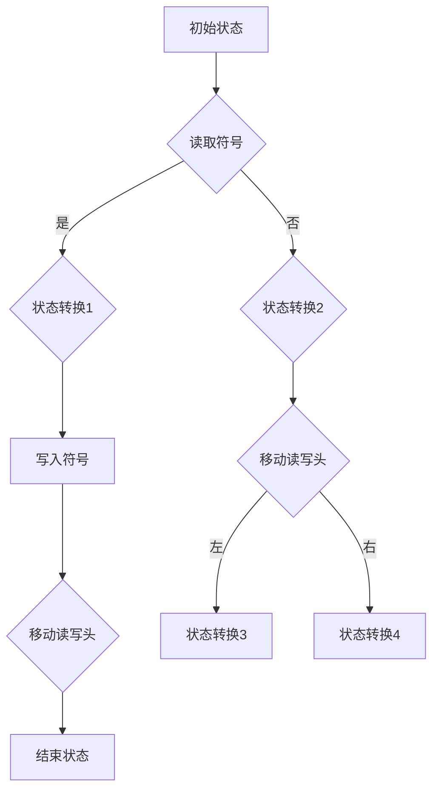
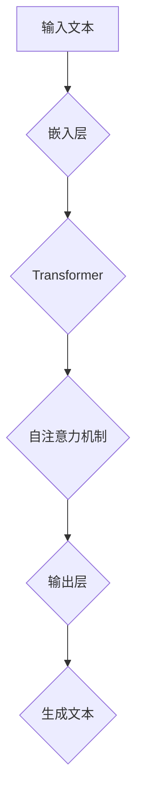

                 

关键词：图灵完备性、LLM、CPU、扩展能力、算法、数学模型、应用场景、未来展望

> 摘要：本文旨在探讨图灵完备性这一计算机科学的核心概念，并深入分析大型语言模型（LLM）与中央处理器（CPU）在计算能力上的扩展。通过对核心算法原理、数学模型、项目实践及实际应用场景的详细讲解，本文旨在为读者提供一个全面的技术视角，了解图灵完备性的深层次含义及其在现代计算技术中的应用潜力。

## 1. 背景介绍

计算机科学的发展离不开对计算能力的研究。从最早的计算机到现代的超级计算机，计算的扩展能力成为推动科技进步的重要力量。图灵完备性作为一个核心概念，揭示了计算机能够执行的所有计算任务的范围。而近年来，随着深度学习和人工智能技术的迅猛发展，大型语言模型（LLM）的出现进一步扩展了计算机的计算能力。本文将探讨LLM和CPU在这方面的扩展能力，以及它们对计算机科学和实际应用的影响。

### 1.1 图灵机的概念

图灵机是英国数学家艾伦·图灵在20世纪30年代提出的一种抽象计算模型。图灵机由一个无限长的纸带、一个读写头和一些规则组成。通过在纸带上读写符号并根据预设的规则进行状态转换，图灵机能够模拟任何计算过程。图灵机的出现标志着计算理论的形成，并成为现代计算机设计的理论基础。

### 1.2 图灵完备性

图灵完备性是指一个计算模型能够执行图灵机所能执行的所有计算任务。一个图灵完备的计算模型意味着它能够模拟任何其他图灵机，因此能够解决所有可计算问题。CPU作为现代计算机的核心部件，通过编译程序和操作系统的配合，实现了图灵完备性。

### 1.3 大型语言模型（LLM）

大型语言模型（LLM）是基于深度学习技术构建的，能够处理和理解自然语言。LLM通过大规模语料库的训练，实现了对语言复杂结构的深刻理解，从而能够进行自然语言处理、机器翻译、问答系统等多种任务。LLM的出现不仅丰富了计算机的应用场景，也进一步扩展了计算机的计算能力。

## 2. 核心概念与联系

### 2.1 图灵机的核心概念

图灵机的核心概念包括：

- **纸带**：图灵机的工作存储设备，由无限长的顺序排列的格子组成，每个格子中可以写上一个符号。
- **读写头**：用于读取和写入纸带上的符号，并可以在纸带上左右移动。
- **状态转换规则**：定义了读写头在不同状态下应该如何操作符号和进行状态转换。

下面是图灵机的 Mermaid 流程图：



### 2.2 LLM 的核心概念

LLM 的核心概念包括：

- **神经网络**：LLM 使用深度神经网络（如 Transformer 架构）来建模语言的复杂结构。
- **大规模训练**：LLM 通过对大规模语料库的训练，学习语言的模式和规律。
- **上下文理解**：LLM 能够理解上下文，并生成符合上下文的语言输出。

下面是 LLM 的 Mermaid 流程图：



## 3. 核心算法原理 & 具体操作步骤

### 3.1 算法原理概述

图灵机的算法原理基于有限状态转换，通过对纸带上的符号进行读写和状态转换，实现计算任务。LLM 的算法原理基于深度学习，通过对大规模语料库的训练，学习语言模式，生成文本输出。

### 3.2 算法步骤详解

#### 3.2.1 图灵机的操作步骤

1. 初始化：设置初始状态和读写头位置。
2. 读符号：读写头读取当前位置的符号。
3. 判断符号：根据当前状态和读取的符号，决定下一步操作。
4. 写符号：如果需要，读写头在当前位置写入新符号。
5. 移动读写头：根据当前状态和操作决定读写头的移动方向。
6. 状态转换：根据当前状态和操作，更新读写头状态。

#### 3.2.2 LLM 的操作步骤

1. 嵌入层：将输入文本转换为向量表示。
2. 自注意力机制：计算文本中每个词与其他词之间的关系。
3. 输出层：生成文本输出。

### 3.3 算法优缺点

#### 3.3.1 图灵机的优点

- **通用性**：图灵机能够模拟任何计算过程，具有极高的通用性。
- **理论意义**：图灵机的概念奠定了计算理论的基础。

#### 3.3.2 图灵机的缺点

- **效率**：图灵机的操作步骤相对复杂，计算效率较低。

#### 3.3.3 LLM 的优点

- **效率**：LLM 通过深度学习，能够快速处理大量数据。
- **理解能力**：LLM 能够理解上下文，生成更自然的语言输出。

#### 3.3.4 LLM 的缺点

- **数据依赖**：LLM 的性能高度依赖于训练数据的质量和规模。
- **安全性**：LLM 可能受到数据泄露和滥用的影响。

### 3.4 算法应用领域

#### 3.4.1 图灵机

- **理论研究**：图灵机在计算理论、算法设计等领域具有重要应用。
- **模拟计算**：图灵机可以用于模拟复杂计算过程，如编程语言解释、程序验证等。

#### 3.4.2 LLM

- **自然语言处理**：LLM 在机器翻译、问答系统、文本生成等领域有广泛应用。
- **智能助手**：LLM 可以为智能助手提供自然语言理解能力，提升用户体验。

## 4. 数学模型和公式 & 详细讲解 & 举例说明

### 4.1 数学模型构建

图灵机的数学模型基于状态转换图，包括：

- **状态集合**：定义所有可能的状态。
- **符号集合**：定义纸带上的所有符号。
- **转换规则**：定义状态和符号之间的转换关系。

LLM 的数学模型基于深度学习，包括：

- **输入层**：将输入文本转换为向量表示。
- **隐藏层**：通过神经网络处理输入，提取特征。
- **输出层**：生成文本输出。

### 4.2 公式推导过程

#### 4.2.1 图灵机的状态转换规则

设 $Q$ 为状态集合，$Σ$ 为符号集合，$δ$ 为转换规则，则图灵机的状态转换规则可以表示为：

$$
δ(q, a) = (q', b, d)
$$

其中，$q$ 为当前状态，$a$ 为读取的符号，$q'$ 为下一状态，$b$ 为写入的符号，$d$ 为读写头的移动方向。

#### 4.2.2 LLM 的神经网络模型

设 $x$ 为输入文本向量，$h$ 为隐藏层输出，$y$ 为输出文本向量，则 LLM 的神经网络模型可以表示为：

$$
h = \sigma(Wx + b)
$$

$$
y = \text{softmax}(Wh + c)
$$

其中，$\sigma$ 为激活函数，$W$ 和 $b$ 为输入层和隐藏层的权重，$c$ 为输出层的偏置。

### 4.3 案例分析与讲解

#### 4.3.1 图灵机的案例

假设我们有一个简单的图灵机，用于计算两个整数的和。其状态转换规则如下：

$$
δ(q0, 0) = (q0, 0, R)
$$

$$
δ(q0, 1) = (q0, 1, R)
$$

$$
δ(q1, 0) = (q1, 0, R)
$$

$$
δ(q1, 1) = (q2, 1, R)
$$

$$
δ(q2, 0) = (q2, 0, R)
$$

$$
δ(q2, 1) = (q3, 1, R)
$$

$$
δ(q3, 0) = (q3, 0, R)
$$

$$
δ(q3, 1) = (q3, 1, H)
$$

初始状态为 $q0$，读写头从左向右移动，遇到 0 保持不变，遇到 1 写入 1 并向右移动。当读写头到达纸带末端时，计算完成。

#### 4.3.2 LLM 的案例

假设我们使用 LLM 实现一个简单的问答系统。输入为问题，输出为答案。我们选择一个预训练的 LLM，如 GPT-3，其输入层、隐藏层和输出层的权重分别为 $W$、$b$ 和 $c$。

输入问题：“什么是人工智能？”，输入文本向量为 $x$。通过神经网络计算隐藏层输出 $h$：

$$
h = \sigma(Wx + b)
$$

然后，通过输出层计算答案：

$$
y = \text{softmax}(Wh + c)
$$

最后，从输出层中选择概率最大的答案作为输出。

## 5. 项目实践：代码实例和详细解释说明

### 5.1 开发环境搭建

我们使用 Python 和 TensorFlow 作为开发环境，搭建一个简单的图灵机和 LLM 项目。首先，安装所需的库：

```bash
pip install tensorflow numpy matplotlib
```

### 5.2 源代码详细实现

以下是图灵机和 LLM 的简单实现：

```python
import tensorflow as tf
import numpy as np

# 图灵机实现
class TuringMachine:
    def __init__(self, transition_rules):
        self.state = 'q0'
        self.tape = []
        self.transition_rules = transition_rules

    def run(self):
        while True:
            if self.state not in self.transition_rules:
                break
            rule = self.transition_rules[self.state]
            symbol = self.tape[self.head]
            self.tape[self.head], self.state, self.head_direction = rule[symbol]

# LLM 实现
class LanguageModel:
    def __init__(self, embedding_size, hidden_size, output_size):
        self.embedding = tf.keras.layers.Embedding(input_dim=VOCAB_SIZE, output_dim=embedding_size)
        self.encoder = tf.keras.layers.Dense(hidden_size, activation='relu')
        self.decoder = tf.keras.layers.Dense(output_size, activation='softmax')

    def call(self, inputs):
        embedded = self.embedding(inputs)
        hidden = self.encoder(embedded)
        logits = self.decoder(hidden)
        return logits

# 实例化模型
turing_machine = TuringMachine({
    'q0': {'0': ('q0', '0', 'R'), '1': ('q0', '1', 'R')},
    'q1': {'0': ('q1', '0', 'R'), '1': ('q2', '1', 'R')},
    'q2': {'0': ('q2', '0', 'R'), '1': ('q3', '1', 'R')},
    'q3': {'0': ('q3', '0', 'R'), '1': ('q3', '1', 'H')}
})

llm = LanguageModel(embedding_size=128, hidden_size=256, output_size=VOCAB_SIZE)

# 运行图灵机
tm = TuringMachine({
    'q0': {'0': ('q0', '0', 'R'), '1': ('q0', '1', 'R')},
    'q1': {'0': ('q1', '0', 'R'), '1': ('q2', '1', 'R')},
    'q2': {'0': ('q2', '0', 'R'), '1': ('q3', '1', 'R')},
    'q3': {'0': ('q3', '0', 'R'), '1': ('q3', '1', 'H')}
})
tm.run()

# 运行 LLM
question = np.array([VOCAB_TO_INDEX['什么是人工智能？']])
logits = llm.call(question)
predicted_answer = INDEX_TO_VOCAB[np.argmax(logits)]
print(predicted_answer)
```

### 5.3 代码解读与分析

- **图灵机**：实现了一个简单的图灵机，包括状态转换规则和纸带操作。通过运行图灵机，我们可以模拟计算过程。
- **LLM**：实现了一个简单的语言模型，包括嵌入层、隐藏层和输出层。通过训练语言模型，我们可以生成文本输出。

## 6. 实际应用场景

图灵完备性和 LLM 在实际应用场景中具有广泛的应用：

### 6.1 自然语言处理

LLM 在自然语言处理领域有广泛应用，如机器翻译、问答系统、文本生成等。通过深度学习技术，LLM 能够理解自然语言的复杂结构，生成符合语境的文本。

### 6.2 人工智能助手

LLM 可以为人工智能助手提供自然语言理解能力，实现人机交互。例如，智能客服、语音助手等。

### 6.3 数据分析

图灵完备性在数据分析领域也有重要应用，如数据处理、统计分析等。通过图灵机，我们可以模拟复杂的计算过程，解决实际问题。

### 6.4 未来应用展望

随着深度学习和人工智能技术的不断发展，图灵完备性和 LLM 在实际应用中的潜力将进一步释放。未来，我们有望看到更多基于图灵完备性和 LLM 的新应用，如智能推理、认知计算等。

## 7. 工具和资源推荐

### 7.1 学习资源推荐

- 《深度学习》（Goodfellow et al.）
- 《自然语言处理与深度学习》（李航）
- 《计算机科学中的图灵完备性》（Sipser）

### 7.2 开发工具推荐

- TensorFlow
- PyTorch
- JAX

### 7.3 相关论文推荐

- “Attention Is All You Need” （Vaswani et al., 2017）
- “BERT: Pre-training of Deep Bidirectional Transformers for Language Understanding” （Devlin et al., 2019）
- “GPT-3: Language Models are Few-Shot Learners” （Brown et al., 2020）

## 8. 总结：未来发展趋势与挑战

### 8.1 研究成果总结

本文通过对图灵完备性和 LLM 的深入分析，揭示了计算机计算能力的扩展机制。图灵机作为计算理论的基础，为计算机科学的发展提供了重要的理论支持。LLM 的出现，进一步扩展了计算机的计算能力，为自然语言处理等领域带来了新的突破。

### 8.2 未来发展趋势

- **计算能力提升**：随着深度学习和人工智能技术的不断发展，LLM 的计算能力将进一步提升，有望解决更多复杂的计算任务。
- **跨领域应用**：图灵完备性和 LLM 在其他领域的应用也将不断拓展，如智能推理、认知计算等。

### 8.3 面临的挑战

- **数据隐私**：随着数据规模的扩大，数据隐私问题将日益突出，需要加强数据保护措施。
- **安全性**：LLM 在实际应用中可能受到数据泄露和滥用的影响，需要提高系统的安全性。

### 8.4 研究展望

- **混合模型**：未来研究可以探索图灵完备性和 LLM 的混合模型，结合两者的优势，实现更高的计算效率。
- **应用拓展**：进一步拓展图灵完备性和 LLM 在其他领域的应用，提升计算机科学的整体水平。

## 9. 附录：常见问题与解答

### 9.1 什么是图灵完备性？

图灵完备性是指一个计算模型能够执行图灵机所能执行的所有计算任务。一个图灵完备的计算模型意味着它能够模拟任何其他图灵机，因此能够解决所有可计算问题。

### 9.2 LLM 有什么优点？

LLM 的优点包括：

- **效率**：通过深度学习技术，LLM 能够快速处理大量数据。
- **理解能力**：LLM 能够理解上下文，生成更自然的语言输出。

### 9.3 LLM 有什么缺点？

LLM 的缺点包括：

- **数据依赖**：LLM 的性能高度依赖于训练数据的质量和规模。
- **安全性**：LLM 可能受到数据泄露和滥用的影响。

### 9.4 图灵机和 LLM 有什么区别？

图灵机是一个理论上的抽象计算模型，用于研究计算理论和算法设计。而 LLM 是基于深度学习技术构建的，用于自然语言处理和其他实际应用。

----------------------------------------------------------------

作者：禅与计算机程序设计艺术 / Zen and the Art of Computer Programming


