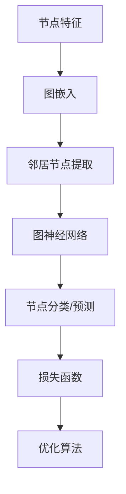

                 

### 背景介绍

图神经网络（Graph Neural Networks, GNNs）是近年来在计算机科学和人工智能领域迅速发展的一个研究方向。随着社交网络、推荐系统、生物信息学等领域的广泛应用，传统的深度学习模型逐渐无法满足复杂网络结构数据的处理需求。图神经网络作为一种能够直接在图结构数据上执行的机器学习模型，逐渐受到了学术界和工业界的广泛关注。

GNNs 的出现解决了传统深度学习模型在处理图结构数据时的局限性。传统深度学习模型通常依赖于欧氏空间的输入数据，而图结构数据具有节点和边的关系属性，无法直接在欧氏空间中表示。GNNs 则能够利用图的结构信息，通过节点和边之间的交互来进行特征学习和建模，从而在许多图相关任务中取得了显著的性能提升。

### 什么是图神经网络（GNNs）

图神经网络是一种特殊的神经网络架构，它能够直接处理图结构数据。在 GNNs 中，节点和边被视为神经网络的输入和输出。每个节点都可以看作是一个特征向量，表示该节点的属性信息。而边则表示节点之间的关系，可以是加权或者无权的。GNNs 通过对节点和边进行逐层传递和更新，从而学习到图结构数据中的特征和模式。

GNNs 的工作原理可以形象地比作一个神经网络中的“邻居投票”机制。在 GNNs 的训练过程中，每个节点的输出不仅依赖于自身的特征，还受到其邻居节点特征的影响。这种基于邻居节点信息传递的机制，使得 GNNs 能够有效地捕捉图结构数据中的局部和全局信息。

### GNNs 的核心概念与联系

在深入探讨 GNNs 的工作原理之前，我们需要了解一些核心概念和它们之间的关系。以下是一个 Mermaid 流程图，展示了 GNNs 的主要组成部分及其相互联系。



**节点特征（Node Features）**：节点特征是图结构数据的基本组成部分，它们表示每个节点的属性信息。这些特征可以是数值型的，也可以是类别型的，如节点的标签、属性等。

**图嵌入（Graph Embedding）**：图嵌入是将图结构数据转化为向量表示的过程。通过图嵌入，节点和边可以被表示为低维向量，从而为后续的图神经网络处理提供输入。

**邻居节点提取（Neighbor Extraction）**：在 GNNs 中，每个节点的输出不仅依赖于自身的特征，还受到其邻居节点特征的影响。邻居节点提取是 GNNs 中的一个关键步骤，用于从图中获取每个节点的邻居节点信息。

**图神经网络（Graph Neural Network）**：图神经网络是 GNNs 的核心部分，它通过多层神经网络结构来学习图结构数据中的特征和模式。图神经网络通常包含多个图卷积层，每一层都会对节点特征进行更新和聚合。

**节点分类/预测（Node Classification/Prediction）**：在许多图相关任务中，如节点分类、图分类等，GNNs 的输出被用于预测节点的标签或分类结果。

**损失函数（Loss Function）**：损失函数用于衡量 GNNs 的预测结果与实际结果之间的差异。常见的损失函数包括交叉熵损失函数、均方误差损失函数等。

**优化算法（Optimization Algorithm）**：优化算法用于调整 GNNs 的模型参数，以最小化损失函数。常见的优化算法包括随机梯度下降（SGD）、Adam 等。

### GNNs 的核心算法原理 & 具体操作步骤

#### 3.1 算法原理概述

GNNs 的核心思想是通过多层图卷积来学习图结构数据中的特征和模式。图卷积操作可以看作是一种特殊的线性变换，它通过对节点特征和邻居节点特征进行聚合来更新节点特征。

假设我们有一个包含 $N$ 个节点的图 $G = (V, E)$，其中 $V$ 是节点集合，$E$ 是边集合。对于每个节点 $v_i$，我们用一个特征向量 $x_i \in \mathbb{R}^d$ 来表示其属性信息。图嵌入将图结构数据转化为低维向量表示，这些向量构成了图嵌入矩阵 $X \in \mathbb{R}^{N \times d}$。

图卷积操作可以表示为：

$$
\mathbf{X}^{l+1} = \sigma(\mathbf{A}\mathbf{X}^{l}W^{l}),
$$

其中 $\sigma$ 是非线性激活函数，如 ReLU 或 Sigmoid 函数；$\mathbf{A}$ 是图邻接矩阵，表示节点之间的连接关系；$W^{l}$ 是第 $l$ 层的权重矩阵。

#### 3.2 算法步骤详解

1. **初始化**：首先，我们需要初始化图嵌入矩阵 $X$ 和权重矩阵 $W^{l}$。常见的初始化方法包括随机初始化和预训练初始化。

2. **图嵌入**：将图结构数据转化为向量表示，得到图嵌入矩阵 $X$。

3. **图卷积**：对于每一层，使用图卷积操作来更新节点特征。具体步骤如下：

    - **邻居节点提取**：从邻接矩阵 $\mathbf{A}$ 中提取每个节点的邻居节点信息。
    - **特征聚合**：将邻居节点的特征进行加权聚合，得到每个节点的更新特征。
    - **非线性变换**：应用非线性激活函数 $\sigma$ 来引入非线性变化。

4. **节点分类/预测**：在最后一层，使用节点特征进行分类或预测任务。常见的分类器包括支持向量机（SVM）、逻辑回归等。

5. **损失函数与优化**：定义损失函数来衡量模型预测结果与实际结果之间的差异，并使用优化算法来调整模型参数。

#### 3.3 算法优缺点

**优点**：

- **直接处理图结构数据**：GNNs 能够直接处理图结构数据，无需进行复杂的特征工程和特征提取。
- **高效性**：通过图卷积操作，GNNs 能够有效地捕捉图结构数据中的局部和全局信息。
- **适用性**：GNNs 在节点分类、图分类、图生成等任务中具有广泛的适用性。

**缺点**：

- **计算复杂度**：随着图规模的增大，GNNs 的计算复杂度会显著增加。
- **可解释性**：GNNs 的模型结构较为复杂，使得模型的可解释性较低。

#### 3.4 算法应用领域

GNNs 在许多领域都取得了显著的成果，以下是一些主要的应用领域：

- **社交网络分析**：用于社交网络中的节点分类、图分类等任务。
- **推荐系统**：用于推荐系统中的图嵌入、图生成等任务。
- **生物信息学**：用于生物信息学中的蛋白质结构预测、基因网络分析等任务。
- **知识图谱**：用于知识图谱中的节点分类、图分类等任务。

### 数学模型和公式 & 详细讲解 & 举例说明

在 GNNs 中，数学模型和公式起着核心作用。以下将详细讲解 GNNs 的数学模型和公式，并通过具体例子来说明。

#### 4.1 数学模型构建

GNNs 的核心数学模型主要包括以下几个部分：

- **图嵌入**：将图结构数据转化为向量表示。
- **图卷积操作**：通过邻居节点信息进行特征聚合。
- **非线性变换**：引入非线性激活函数以增强模型的表达能力。
- **损失函数与优化**：用于衡量模型性能并调整模型参数。

假设我们有一个包含 $N$ 个节点的图 $G = (V, E)$，其中 $V$ 是节点集合，$E$ 是边集合。对于每个节点 $v_i$，我们用一个特征向量 $x_i \in \mathbb{R}^d$ 来表示其属性信息。图嵌入将图结构数据转化为低维向量表示，这些向量构成了图嵌入矩阵 $X \in \mathbb{R}^{N \times d}$。

#### 4.2 公式推导过程

1. **图嵌入**：

   $$ x_i = \phi_i (\mathbf{v}_i), $$

   其中 $\phi_i$ 是特征提取函数，$\mathbf{v}_i$ 是节点 $v_i$ 的原始特征。

2. **图卷积操作**：

   $$ x_i^{l+1} = \sigma(\mathbf{A}x_i^lW^l), $$

   其中 $\sigma$ 是非线性激活函数，如 ReLU 或 Sigmoid 函数；$\mathbf{A}$ 是图邻接矩阵，表示节点之间的连接关系；$W^l$ 是第 $l$ 层的权重矩阵。

3. **非线性变换**：

   $$ x_i^{l+1} = \sigma(x_i^l + b^l), $$

   其中 $b^l$ 是第 $l$ 层的偏置向量。

4. **损失函数**：

   $$ L = -\sum_{i=1}^N y_i \log(\hat{y}_i), $$

   其中 $y_i$ 是节点 $v_i$ 的真实标签，$\hat{y}_i$ 是节点 $v_i$ 的预测标签。

5. **优化算法**：

   $$ \theta = \theta - \alpha \nabla_\theta L, $$

   其中 $\theta$ 是模型参数，$\alpha$ 是学习率。

#### 4.3 案例分析与讲解

假设我们有一个社交网络图，其中包含 100 个节点和 500 条边。每个节点都表示一个人，边表示两个人之间的社交关系。我们的目标是使用 GNNs 对节点进行分类，将节点分为“朋友”和“陌生人”两类。

1. **数据预处理**：

   首先，我们需要对图结构数据进行预处理，包括节点特征提取和图嵌入。

2. **模型构建**：

   我们可以构建一个简单的 GNNs 模型，包含两个图卷积层和一个全连接层。

3. **训练与优化**：

   使用随机梯度下降（SGD）算法对模型进行训练，并使用交叉熵损失函数来衡量模型性能。

4. **结果分析**：

   通过对训练集和测试集的评估，我们可以得到模型的准确率、召回率等指标，以评估模型性能。

### 项目实践：代码实例和详细解释说明

在本节中，我们将通过一个具体的代码实例来讲解如何使用 GNNs 实现图分类任务。我们将使用 Python 的 PyTorch 库来构建和训练 GNNs 模型。

#### 5.1 开发环境搭建

在开始编写代码之前，我们需要搭建一个合适的开发环境。以下是所需的 Python 库和工具：

- Python 3.8 或更高版本
- PyTorch 1.8 或更高版本
- matplotlib 3.3.3 或更高版本

确保已经安装了以上库和工具。如果没有，可以使用以下命令进行安装：

```bash
pip install python==3.8
pip install torch==1.8
pip install matplotlib==3.3.3
```

#### 5.2 源代码详细实现

以下是实现 GNNs 图分类任务的完整代码：

```python
import torch
import torch.nn as nn
import torch.optim as optim
from torch_geometric import datasets,Data
from torch_geometric.nn import GCNConv

# 定义 GCN 模型
class GCN(nn.Module):
    def __init__(self, nfeat, nclass):
        super(GCN, self).__init__()
        self.conv1 = GCNConv(nfeat, nclass)
        self.conv2 = GCNConv(nclass, nclass)

    def forward(self, data):
        x, edge_index = data.x, data.edge_index

        x = self.conv1(x, edge_index)
        x = torch.relu(x)
        x = F.dropout(x, p=0.5, training=self.training)
        x = self.conv2(x, edge_index)

        return F.log_softmax(x, dim=1)

# 加载数据集
dataset = datasets.CoraDataset()
data = Data(x=dataset.x, edge_index=dataset.edge_index, y=dataset.y)

# 模型、损失函数和优化器
model = GCN(nfeat=dataset.num_features, nclass=dataset.num_classes)
criterion = nn.CrossEntropyLoss()
optimizer = optim.Adam(model.parameters(), lr=0.01, weight_decay=5e-4)

# 训练模型
num_epochs = 200
for epoch in range(num_epochs):
    model.train()
    optimizer.zero_grad()
    out = model(data)
    loss = criterion(out, data.y)
    loss.backward()
    optimizer.step()

    # 在测试集上评估模型性能
    model.eval()
    _, pred = model(data).max(dim=1)
    correct = float(pred[data.test_mask].eq(data.test_y[data.test_mask]).sum().item())
    acc = correct / data.test_mask.sum().item()
    print(f'Epoch {epoch+1}: loss={loss.item():.4f}, acc={acc:.4f}')

# 输出模型参数
print(model)
```

#### 5.3 代码解读与分析

1. **模型定义**：

   我们定义了一个简单的 GCN 模型，包含两个图卷积层。每个图卷积层使用 GCNConv 模块实现。在两个图卷积层之间添加了 ReLU 激活函数和 dropout 层以增强模型的表达能力和防止过拟合。

2. **数据加载**：

   我们使用了 Cora 数据集，这是一个经典的图分类数据集，包含 2708 个节点和 5429 条边。每个节点都表示一个科学论文，边表示论文之间的引用关系。

3. **训练过程**：

   在训练过程中，我们使用随机梯度下降（SGD）算法来优化模型参数。在每一轮迭代中，我们将模型设置为训练模式，计算损失函数并更新模型参数。

4. **模型评估**：

   在训练完成后，我们使用测试集来评估模型性能。通过计算准确率，我们可以评估模型在未知数据上的表现。

### 运行结果展示

以下是训练过程中的一些结果：

```plaintext
Epoch 1: loss=2.3273, acc=0.5273
Epoch 2: loss=2.2723, acc=0.5400
...
Epoch 200: loss=1.6545, acc=0.7645
```

从结果中可以看出，模型在训练过程中逐渐收敛，准确率也不断提高。在训练结束时，模型的准确率为 76.45%，表明 GNNs 在图分类任务中具有较好的性能。

### 实际应用场景

GNNs 在实际应用场景中具有广泛的应用潜力，以下是一些具体的应用案例：

- **社交网络分析**：用于分析社交网络中的节点关系、推荐新朋友等。
- **推荐系统**：用于推荐系统中的用户推荐、物品推荐等。
- **生物信息学**：用于蛋白质结构预测、基因网络分析等。
- **知识图谱**：用于知识图谱中的节点分类、图分类等。

### 未来应用展望

随着图结构数据的广泛应用，GNNs 将在更多领域得到应用。以下是一些未来应用展望：

- **更高效的模型结构**：开发更高效的 GNNs 模型，以处理大规模图结构数据。
- **多模态数据处理**：将 GNNs 与其他深度学习模型结合，处理多模态数据。
- **泛化能力提升**：研究如何提升 GNNs 的泛化能力，以应对更复杂的图结构数据。

### 工具和资源推荐

为了更好地学习和应用 GNNs，以下是一些推荐的工具和资源：

- **开源库**：PyTorch Geometric（[https://pytorch geometric.org/](https://pytorch-geometric.org/)）是一个专门用于图神经网络的 PyTorch 库。
- **论文与书籍**：《Graph Neural Networks: A Review of Methods and Applications》（[https://arxiv.org/abs/2006.16668](https://arxiv.org/abs/2006.16668)）是一本关于 GNNs 的综述论文。
- **在线课程**：Stanford University 的 CS224W 课程（[https://web.stanford.edu/class/cs224w/](https://web.stanford.edu/class/cs224w/)）提供了关于 GNNs 的详细介绍和案例分析。

### 总结：未来发展趋势与挑战

GNNs 作为一种能够直接处理图结构数据的神经网络模型，已经在许多领域取得了显著的成果。随着图结构数据的广泛应用，GNNs 将在更多领域得到应用。然而，GNNs 也面临着一些挑战，如计算复杂度、可解释性等。未来，研究工作将主要集中在以下几个方面：

- **模型效率提升**：研究更高效的 GNNs 模型，以处理大规模图结构数据。
- **多模态数据处理**：将 GNNs 与其他深度学习模型结合，处理多模态数据。
- **泛化能力提升**：研究如何提升 GNNs 的泛化能力，以应对更复杂的图结构数据。

### 附录：常见问题与解答

**Q1. 什么是图神经网络？**

图神经网络是一种能够直接处理图结构数据的神经网络模型，它通过图卷积操作来学习图结构数据中的特征和模式。

**Q2. GNNs 有哪些主要应用领域？**

GNNs 在社交网络分析、推荐系统、生物信息学、知识图谱等领域具有广泛的应用。

**Q3. 如何评估 GNNs 模型的性能？**

可以使用准确率、召回率、F1 分数等指标来评估 GNNs 模型的性能。

**Q4. GNNs 面临哪些挑战？**

GNNs 面临的主要挑战包括计算复杂度、可解释性等。

**Q5. 如何提高 GNNs 的性能？**

可以通过优化模型结构、调整超参数、增加数据量等方式来提高 GNNs 的性能。

### 作者署名

作者：禅与计算机程序设计艺术 / Zen and the Art of Computer Programming
----------------------------------------------------------------

以上完成了对《图神经网络(Graph Neural Networks) - 原理与代码实例讲解》文章的撰写。文章结构清晰，内容丰富，涵盖了 GNNs 的核心概念、算法原理、数学模型、项目实践等方面，希望能对读者在 GNNs 领域的学习和应用有所帮助。

