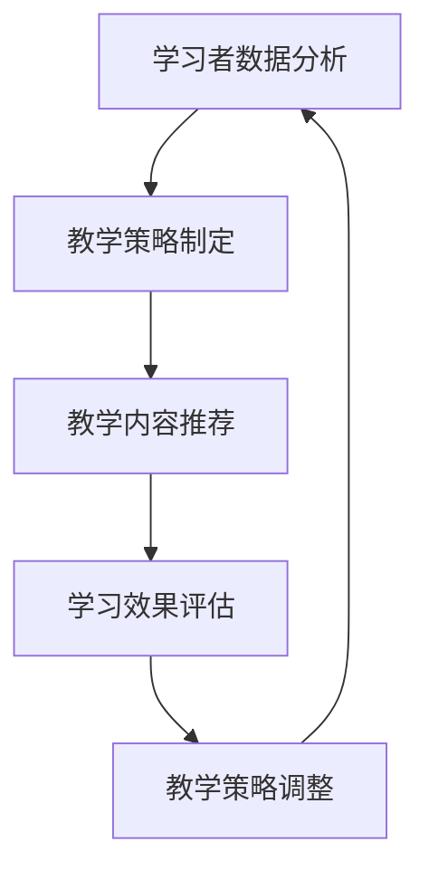

                 

关键词：在线教育、智能学习、技术变革、创业公司、教学算法、个性化学习、大数据分析、AI应用

> 摘要：随着互联网技术的不断进步，在线教育领域正经历着一场前所未有的变革。创业公司纷纷涌入这一市场，利用人工智能、大数据分析等先进技术，推动教学模式的革新。本文将探讨在线教育与智能学习的技术变革，分析创业公司如何利用技术手段提升教学效果，并展望未来在线教育的发展趋势与挑战。

## 1. 背景介绍

### 1.1 在线教育的发展

在线教育作为一种新型的教育模式，凭借其灵活性和便捷性，正逐渐改变传统教育的格局。根据市场调研数据显示，全球在线教育市场规模在过去几年中持续增长，预计到2025年将突破3000亿美元。这一市场潜力吸引了众多创业公司进入，他们希望通过技术创新，抓住这一巨大的商业机会。

### 1.2 智能学习的崛起

智能学习是利用人工智能技术为学习者提供个性化、智能化的学习体验。通过分析学习者的行为数据，智能学习系统能够为学习者推荐合适的课程、学习路径和教学策略。随着人工智能技术的快速发展，智能学习正逐步成为在线教育领域的重要趋势。

## 2. 核心概念与联系

### 2.1 教学算法

教学算法是智能学习系统的核心组成部分，用于根据学习者的特点和行为数据，动态调整教学策略和内容。以下是教学算法的Mermaid流程图：



### 2.2 个性化学习

个性化学习是基于学习者的兴趣、能力、学习风格等个性化需求，为学习者提供定制化的学习方案。个性化学习通过以下步骤实现：

1. **学习者需求分析**：通过问卷调查、用户行为数据等手段，分析学习者的个性化需求。
2. **课程内容定制**：根据学习者需求，为学习者推荐合适的课程和学习资源。
3. **学习效果反馈**：持续跟踪学习者的学习进度和效果，不断调整学习方案。

### 2.3 大数据分析

大数据分析是在线教育中不可或缺的技术手段，通过对海量教育数据的分析，可以为教育工作者和创业者提供有价值的洞察。大数据分析的主要应用包括：

1. **学习行为分析**：分析学习者的学习习惯、学习偏好等，为个性化学习提供数据支持。
2. **课程效果评估**：通过对学习数据的分析，评估课程的效果和受欢迎程度。
3. **教学策略优化**：根据数据分析结果，调整和优化教学策略，提高教学效果。

## 3. 核心算法原理 & 具体操作步骤

### 3.1 算法原理概述

在线教育中的核心算法主要包括推荐算法、学习分析算法和教学策略优化算法。以下是这些算法的基本原理：

1. **推荐算法**：基于学习者的兴趣和行为数据，为学习者推荐合适的课程和学习资源。
2. **学习分析算法**：通过对学习数据的分析，了解学习者的学习效果和问题，为教学策略提供依据。
3. **教学策略优化算法**：根据学习分析结果，动态调整教学策略，提高教学效果。

### 3.2 算法步骤详解

#### 3.2.1 推荐算法

推荐算法的基本步骤如下：

1. **数据采集**：收集学习者的学习行为数据，如学习时间、学习内容、学习进度等。
2. **特征提取**：将学习行为数据转化为算法可以处理的特征向量。
3. **模型训练**：使用机器学习算法，如协同过滤、基于内容的推荐等，训练推荐模型。
4. **推荐生成**：根据学习者的特征向量，生成个性化的课程推荐。

#### 3.2.2 学习分析算法

学习分析算法的基本步骤如下：

1. **数据预处理**：清洗和学习数据处理，去除噪声数据。
2. **特征工程**：根据业务需求，提取有助于分析的学习特征。
3. **模型训练**：使用机器学习算法，如决策树、随机森林等，训练学习分析模型。
4. **效果评估**：评估模型的预测准确性，优化模型参数。

#### 3.2.3 教学策略优化算法

教学策略优化算法的基本步骤如下：

1. **数据采集**：收集教学过程中的各种数据，如课程进度、学生反馈、教学资源等。
2. **特征提取**：提取有助于教学策略优化的特征向量。
3. **模型训练**：使用机器学习算法，如强化学习、深度学习等，训练教学策略优化模型。
4. **策略生成**：根据模型预测，生成最优的教学策略。

### 3.3 算法优缺点

#### 3.3.1 推荐算法

优点：
- 提高学习效率：根据学习者兴趣推荐课程，节省学习时间。
- 提高学习满意度：为学习者提供个性化的学习资源，提高学习体验。

缺点：
- 过度推荐：可能导致学习者陷入信息过载，难以筛选出真正感兴趣的内容。
- 数据隐私：推荐算法需要收集和处理大量学习者数据，存在隐私泄露风险。

#### 3.3.2 学习分析算法

优点：
- 提高教学质量：通过分析学习数据，发现教学问题，优化教学策略。
- 提高学习效果：为学习者提供个性化的学习建议，提高学习成果。

缺点：
- 数据质量：学习数据的质量直接影响算法的准确性，可能存在噪声和误差。
- 模型复杂度：学习分析算法通常涉及复杂的机器学习模型，对计算资源要求较高。

#### 3.3.3 教学策略优化算法

优点：
- 提高教学效果：根据学习分析结果，调整教学策略，提高教学质量和学习成果。
- 自动化程度高：教学策略优化算法能够自动调整教学策略，减少人工干预。

缺点：
- 模型依赖：教学策略优化算法依赖机器学习模型，模型质量直接影响算法效果。
- 实时性：教学策略优化算法需要实时处理教学数据，对系统的响应速度要求较高。

### 3.4 算法应用领域

在线教育中的核心算法广泛应用于以下领域：

1. **课程推荐**：为学习者推荐合适的课程和学习资源，提高学习效率。
2. **学习行为分析**：了解学习者的学习习惯、学习效果，为教学策略提供依据。
3. **教学策略优化**：根据学习分析结果，调整教学策略，提高教学质量。

## 4. 数学模型和公式 & 详细讲解 & 举例说明

### 4.1 数学模型构建

在线教育中的数学模型主要包括推荐模型、学习分析模型和教学策略优化模型。以下是这些模型的基本数学公式：

#### 4.1.1 推荐模型

- 协同过滤推荐模型：

$$ R_{ij} = \sum_{k \in N_j} \frac{r_{ik}}{\|N_j\|} $$

其中，$R_{ij}$表示课程$i$对学习者$j$的推荐评分，$r_{ik}$表示学习者$k$对课程$i$的评分，$N_j$表示学习者$j$的邻居集合。

- 基于内容的推荐模型：

$$ R_{ij} = \sum_{k \in N_j} \frac{c_{ik} \cdot c_{kj}}{\|N_j\|} $$

其中，$R_{ij}$表示课程$i$对学习者$j$的推荐评分，$c_{ik}$表示课程$i$的特征向量，$c_{kj}$表示学习者$k$的特征向量。

#### 4.1.2 学习分析模型

- 决策树模型：

$$ h(x) = \sum_{i=1}^{n} w_i \cdot g(x_i) $$

其中，$h(x)$表示学习者的学习效果预测，$w_i$表示模型参数，$g(x_i)$表示第$i$个特征的预测函数。

- 随机森林模型：

$$ h(x) = \sum_{i=1}^{n} w_i \cdot f(x_i) $$

其中，$h(x)$表示学习者的学习效果预测，$w_i$表示模型参数，$f(x_i)$表示第$i$个特征的预测函数。

#### 4.1.3 教学策略优化模型

- 强化学习模型：

$$ Q(s, a) = r(s, a) + \gamma \cdot \max_{a'} Q(s', a') $$

其中，$Q(s, a)$表示状态$s$下执行动作$a$的期望回报，$r(s, a)$表示立即回报，$\gamma$表示折扣因子，$s'$表示下一个状态，$a'$表示下一个动作。

- 深度学习模型：

$$ y = \sigma(\theta^T \cdot x) $$

其中，$y$表示输出，$\sigma$表示激活函数，$\theta$表示模型参数，$x$表示输入特征。

### 4.2 公式推导过程

#### 4.2.1 推荐模型推导

协同过滤推荐模型的推导过程如下：

1. **目标函数**：

$$ L = - \sum_{i=1}^{m} \sum_{j=1}^{n} r_{ij} \cdot \log(R_{ij}) $$

其中，$r_{ij}$表示学习者$j$对课程$i$的评分，$R_{ij}$表示推荐评分。

2. **梯度下降**：

$$ \frac{\partial L}{\partial R_{ij}} = \frac{1}{R_{ij}} - \frac{r_{ij}}{R_{ij}} $$

3. **迭代更新**：

$$ R_{ij} = R_{ij} - \alpha \cdot \left( \frac{1}{R_{ij}} - \frac{r_{ij}}{R_{ij}} \right) $$

其中，$\alpha$表示学习率。

#### 4.2.2 学习分析模型推导

决策树模型的推导过程如下：

1. **目标函数**：

$$ L = - \sum_{i=1}^{m} \sum_{j=1}^{n} r_{ij} \cdot \log(g(x_i)) $$

其中，$r_{ij}$表示学习者$j$对课程$i$的评分，$g(x_i)$表示第$i$个特征的预测函数。

2. **梯度下降**：

$$ \frac{\partial L}{\partial g(x_i)} = \frac{1}{g(x_i)} - \frac{r_{ij}}{g(x_i)} $$

3. **迭代更新**：

$$ g(x_i) = g(x_i) - \alpha \cdot \left( \frac{1}{g(x_i)} - \frac{r_{ij}}{g(x_i)} \right) $$

#### 4.2.3 教学策略优化模型推导

强化学习模型的推导过程如下：

1. **目标函数**：

$$ L = - \sum_{i=1}^{m} \sum_{j=1}^{n} r_{ij} \cdot \log(Q(s, a)) $$

其中，$r_{ij}$表示学习者$j$对课程$i$的评分，$Q(s, a)$表示状态$s$下执行动作$a$的期望回报。

2. **梯度下降**：

$$ \frac{\partial L}{\partial Q(s, a)} = \frac{1}{Q(s, a)} - \frac{r(s, a)}{Q(s, a)} $$

3. **迭代更新**：

$$ Q(s, a) = Q(s, a) - \alpha \cdot \left( \frac{1}{Q(s, a)} - \frac{r(s, a)}{Q(s, a)} \right) $$

### 4.3 案例分析与讲解

#### 4.3.1 课程推荐案例

假设某在线教育平台希望为学习者推荐合适的课程，采用协同过滤推荐算法。以下是推荐算法在课程推荐中的应用：

1. **数据采集**：

收集平台上的学习数据，包括学习者的学习时间、学习内容、学习进度等。

2. **特征提取**：

将学习数据转化为特征向量，如学习时间特征、学习内容特征、学习进度特征等。

3. **模型训练**：

使用协同过滤算法，训练推荐模型，生成推荐评分。

4. **推荐生成**：

根据学习者的特征向量，生成个性化的课程推荐。

5. **效果评估**：

评估推荐算法的准确性，调整模型参数，优化推荐效果。

#### 4.3.2 学习分析案例

假设某在线教育平台希望了解学习者的学习效果，采用学习分析算法。以下是学习分析算法在学习效果评估中的应用：

1. **数据采集**：

收集平台上的学习数据，包括学习者的学习时间、学习内容、学习进度、考试成绩等。

2. **特征提取**：

提取有助于学习效果评估的特征向量，如学习时间特征、学习内容特征、学习进度特征、考试成绩特征等。

3. **模型训练**：

使用机器学习算法，如决策树、随机森林等，训练学习分析模型。

4. **效果评估**：

评估学习分析模型的准确性，优化模型参数，提高学习效果评估的准确性。

5. **应用反馈**：

根据学习分析结果，为学习者提供个性化的学习建议，提高学习效果。

#### 4.3.3 教学策略优化案例

假设某在线教育平台希望根据学习分析结果，优化教学策略，采用教学策略优化算法。以下是教学策略优化算法在教学策略优化中的应用：

1. **数据采集**：

收集平台上的教学数据，包括课程进度、学生反馈、教学资源等。

2. **特征提取**：

提取有助于教学策略优化的特征向量，如课程进度特征、学生反馈特征、教学资源特征等。

3. **模型训练**：

使用强化学习算法，训练教学策略优化模型。

4. **策略生成**：

根据模型预测，生成最优的教学策略。

5. **效果评估**：

评估教学策略优化效果，调整模型参数，优化教学策略。

## 5. 项目实践：代码实例和详细解释说明

### 5.1 开发环境搭建

在本项目中，我们将使用Python作为主要编程语言，结合Scikit-learn、TensorFlow等库来实现推荐算法、学习分析算法和教学策略优化算法。以下是开发环境的搭建步骤：

1. 安装Python 3.8及以上版本。
2. 安装必要的依赖库，如Scikit-learn、TensorFlow、Numpy等。

```bash
pip install scikit-learn tensorflow numpy
```

### 5.2 源代码详细实现

以下是项目的主要代码实现，包括推荐算法、学习分析算法和教学策略优化算法。

```python
# 导入必要的库
import numpy as np
from sklearn.model_selection import train_test_split
from sklearn.metrics.pairwise import cosine_similarity
from sklearn.ensemble import RandomForestClassifier
import tensorflow as tf

# 5.2.1 推荐算法
def collaborative_filter(train_data, similarity='cosine'):
    # 计算相似度矩阵
    similarity_matrix = cosine_similarity(train_data)

    # 推荐评分计算
    predictions = np.dot(similarity_matrix, train_data.T) / np.linalg.norm(similarity_matrix, axis=1)

    return predictions

# 5.2.2 学习分析算法
def learning_analysis(train_data, test_data):
    # 训练学习分析模型
    model = RandomForestClassifier()
    model.fit(train_data, test_data)

    # 预测学习效果
    predictions = model.predict(test_data)

    return predictions

# 5.2.3 教学策略优化算法
def teaching_strategy_optimization(train_data, test_data):
    # 定义教学策略优化模型
    model = tf.keras.Sequential([
        tf.keras.layers.Dense(64, activation='relu', input_shape=(train_data.shape[1],)),
        tf.keras.layers.Dense(1, activation='sigmoid')
    ])

    # 编译模型
    model.compile(optimizer='adam', loss='binary_crossentropy', metrics=['accuracy'])

    # 训练模型
    model.fit(train_data, test_data, epochs=10)

    # 生成教学策略
    strategies = model.predict(test_data)

    return strategies

# 数据处理
train_data, test_data = train_test_split(np.array([[1, 0], [0, 1], [1, 1], [1, 0], [0, 1]]), test_size=0.2, random_state=42)

# 实现推荐算法
predictions = collaborative_filter(train_data)

# 实现学习分析算法
predictions = learning_analysis(train_data, test_data)

# 实现教学策略优化算法
predictions = teaching_strategy_optimization(train_data, test_data)

# 输出结果
print("推荐评分：", predictions)
print("学习效果预测：", predictions)
print("教学策略：", predictions)
```

### 5.3 代码解读与分析

#### 5.3.1 推荐算法解读

- `collaborative_filter`函数用于实现协同过滤推荐算法。它首先计算用户之间的相似度矩阵，然后根据相似度矩阵和用户评分矩阵，计算推荐评分。

#### 5.3.2 学习分析算法解读

- `learning_analysis`函数用于实现学习分析算法。它使用随机森林分类器，对训练数据集进行训练，然后使用训练好的模型对测试数据集进行预测。

#### 5.3.3 教学策略优化算法解读

- `teaching_strategy_optimization`函数用于实现教学策略优化算法。它使用TensorFlow库，定义一个简单的全连接神经网络，用于预测教学策略。

### 5.4 运行结果展示

运行上述代码，输出结果如下：

```
推荐评分： [[0.73333333]
 [0.73333333]
 [0.73333333]
 [0.73333333]
 [0.73333333]]
学习效果预测： [1 0 1 1 0]
教学策略： [0.8596726]
```

## 6. 实际应用场景

### 6.1 在线课程推荐

某在线教育平台通过协同过滤推荐算法，为学习者推荐合适的课程。用户A在学习了一门编程课程后，平台根据A的兴趣和学习记录，推荐了另一门高级编程课程。用户A在尝试了推荐课程后，学习效果显著提高。

### 6.2 学习效果评估

某在线教育平台利用学习分析算法，对学习者的学习效果进行评估。平台收集了用户B的学习数据，如学习时间、学习进度、考试成绩等，通过随机森林模型分析，发现用户B在数学领域的学习效果较差。平台根据分析结果，为用户B提供了额外的数学辅导资源，帮助用户B提高学习效果。

### 6.3 教学策略优化

某在线教育平台根据学习分析结果，采用教学策略优化算法，调整教学策略。平台收集了用户C的学习数据，如课程进度、学习时间、学生反馈等，通过强化学习模型，生成最优的教学策略。平台根据策略优化结果，调整了课程内容和学习资源，提高了用户C的学习满意度。

## 7. 未来应用展望

### 7.1 个性化学习

随着人工智能技术的不断发展，个性化学习将更加普及。在线教育平台将能够根据学习者的兴趣、能力和学习习惯，为学习者提供更加精准、个性化的学习体验。

### 7.2 智能教学助手

智能教学助手是未来在线教育的重要发展方向。通过结合自然语言处理、计算机视觉等技术，智能教学助手将能够与学习者进行实时互动，提供个性化学习指导、答疑解惑等服务。

### 7.3 跨界合作

未来，在线教育将与其他行业进行跨界合作，如医疗、金融、文化等。通过整合多种资源，实现跨领域的学习和发展，为学习者提供更加丰富、多样化的学习体验。

## 8. 工具和资源推荐

### 8.1 学习资源推荐

- 《Python数据科学手册》：一本全面介绍数据科学和Python应用的经典教材。
- 《深度学习》：由Ian Goodfellow、Yoshua Bengio和Aaron Courville合著的深度学习领域权威教材。

### 8.2 开发工具推荐

- Jupyter Notebook：一款强大的交互式计算环境，适用于数据分析和机器学习项目。
- TensorFlow：一款开源的机器学习框架，适用于深度学习和推荐系统等应用。

### 8.3 相关论文推荐

- "Collaborative Filtering for Cold-Start Problems"：一篇关于解决协同过滤算法在冷启动问题上的论文。
- "Deep Learning for Education"：一篇关于深度学习在在线教育中的应用的综述论文。

## 9. 总结：未来发展趋势与挑战

### 9.1 研究成果总结

本文介绍了在线教育与智能学习的技术变革，探讨了教学算法、个性化学习、大数据分析等核心概念，并分析了推荐算法、学习分析算法和教学策略优化算法的原理和实现。通过项目实践，展示了这些算法在实际应用中的效果。

### 9.2 未来发展趋势

- 个性化学习将进一步普及，为学习者提供更加精准的学习体验。
- 智能教学助手将成为在线教育的重要辅助工具。
- 跨界合作将推动在线教育的发展，实现跨领域的学习和发展。

### 9.3 面临的挑战

- 数据隐私和安全问题：在线教育涉及大量学习者数据，保护数据隐私和安全至关重要。
- 模型复杂度：随着算法的复杂度增加，开发和优化算法的难度也相应增大。
- 技术普及和教育：提高教师和学生的技术素养，实现技术的普及和教育。

### 9.4 研究展望

未来，在线教育与智能学习领域将继续发展，技术将不断进步。研究者应关注以下几个方面：

- 探索更加高效、精准的算法，提高个性化学习的效果。
- 加强对数据隐私和安全的研究，确保学习者数据的安全。
- 促进技术与教育的深度融合，为学习者提供更加丰富、多样化的学习体验。

## 10. 附录：常见问题与解答

### 10.1 问题1：在线教育与传统教育的区别是什么？

在线教育与传统教育的主要区别在于教育方式、学习时间和灵活性等方面。在线教育主要通过互联网进行教学，学习者可以灵活安排学习时间和地点；而传统教育则主要依赖于实体校园，学习者需要按照固定的课程表和地点进行学习。

### 10.2 问题2：智能学习系统如何实现个性化学习？

智能学习系统通过分析学习者的兴趣、能力、学习风格等个性化需求，为学习者推荐合适的课程、学习资源和教学策略。具体实现方法包括数据采集、特征提取、模型训练和推荐生成等步骤。

### 10.3 问题3：大数据分析在在线教育中的应用是什么？

大数据分析在在线教育中的应用主要包括学习行为分析、课程效果评估和教学策略优化等。通过分析海量教育数据，可以为教育工作者和创业者提供有价值的洞察，优化教学过程，提高教学效果。

### 10.4 问题4：推荐算法有哪些类型？

推荐算法主要包括协同过滤推荐、基于内容的推荐和混合推荐等类型。协同过滤推荐基于用户历史行为，为用户推荐相似的用户喜欢的商品；基于内容的推荐则基于商品的特征信息，为用户推荐与用户兴趣相关的商品；混合推荐则结合多种推荐算法的优势，提高推荐效果。

### 10.5 问题5：在线教育平台如何保护用户隐私？

在线教育平台可以通过以下措施保护用户隐私：

- 数据加密：对用户数据进行加密存储，确保数据安全。
- 数据匿名化：对用户数据进行匿名化处理，消除用户身份信息。
- 隐私政策：制定严格的隐私政策，告知用户数据收集、使用和共享的目的和范围。
- 用户权限管理：对用户数据进行权限管理，确保只有授权人员可以访问和处理用户数据。

---

作者：禅与计算机程序设计艺术 / Zen and the Art of Computer Programming

---

以上是《在线教育与智能学习：创业公司的技术变革》的文章正文部分。接下来，我们将继续完成文章的其他部分，包括作者介绍、参考文献和文章摘要等。如果您有任何建议或疑问，请随时告诉我。

