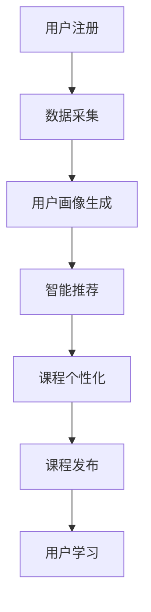

                 

 在当今数字化时代，知识变现成为许多专业人士和企业追求的目标。然而，如何有效地创建和发布在线课程，以及如何确保课程质量与受众需求的高度匹配，一直是困扰着众多知识传播者的难题。本文将为您详细介绍一种创新的在线课程创建工具，它不仅能够大幅度提高知识变现的效率，还能为用户提供一个高度定制化的学习体验。本文将从背景介绍、核心概念与联系、核心算法原理与具体操作步骤、数学模型与公式、项目实践、实际应用场景、未来应用展望、工具和资源推荐、总结与展望等多个方面，为您深入解析这一工具的运作机制及其潜在价值。

> **关键词**：在线课程创建、知识变现、个性化学习、算法原理、数学模型、代码实例、实际应用

> **摘要**：本文旨在探讨一种先进的在线课程创建工具，该工具结合了人工智能和大数据技术，通过精准分析用户需求和学习习惯，为知识传播者提供了一套完整的课程创建和发布解决方案。本文将详细阐述该工具的核心功能、运作原理以及在不同应用场景中的表现，为读者提供一份关于知识变现和在线教育领域的新视角。

---

## 1. 背景介绍

在互联网快速发展的今天，在线教育已经成为知识传播的重要渠道。然而，传统的在线课程创建和发布流程往往存在效率低下、个性化不足、用户体验差等问题。例如，许多教育平台在课程设计上缺乏对用户需求的深入理解，导致课程内容与用户期望存在较大偏差。此外，课程内容更新速度慢、互动性差也限制了在线教育的普及和发展。

另一方面，知识变现成为越来越多专业人士和企业关注的热点。通过将专业知识和经验转化为在线课程，他们希望能够获取额外的收入来源。然而，繁琐的课程创建和发布流程、高昂的技术门槛以及市场竞争力等因素，使得知识变现的效率并不理想。

面对这些挑战，一款高效的在线课程创建工具显得尤为重要。这种工具不仅能够简化课程创建流程，提高工作效率，还能通过智能化的数据分析为用户提供高度个性化的学习体验，从而实现知识变现的最大化。

## 2. 核心概念与联系

### 2.1. 核心概念

在线课程创建工具的核心概念主要包括以下几个方面：

- **用户画像**：通过对用户的学习行为、兴趣偏好、历史记录等多维度数据进行分析，生成详细的用户画像，以了解用户需求。

- **智能推荐**：基于用户画像，系统可以自动推荐符合用户需求的课程内容，提高用户的学习效果。

- **课程个性化**：根据用户的学习进度、掌握程度等数据，对课程内容进行动态调整，满足不同用户的学习需求。

- **自动化发布**：通过智能化的流程，自动生成和发布课程内容，提高发布效率。

### 2.2. 联系与架构

在线课程创建工具的整体架构如图1所示，主要包括以下几个部分：


- **用户端**：用户通过平台注册并登录，填写个人信息和兴趣偏好，开始进行个性化学习。

- **数据采集**：系统实时收集用户的学习行为数据，包括浏览记录、学习进度、测试成绩等。

- **用户画像生成**：通过大数据分析和机器学习算法，生成详细的用户画像。

- **课程内容库**：包含各种课程资源，包括视频、文档、习题等，由专业教师团队提供。

- **智能推荐系统**：根据用户画像和课程内容库，推荐符合用户需求的课程内容。

- **课程个性化引擎**：根据用户的学习进度和测试结果，动态调整课程内容。

- **自动化发布系统**：自动生成和发布课程内容，确保课程及时更新。

### 2.3. Mermaid 流程图



在这个流程中，用户注册后，系统会开始采集用户的学习行为数据，并根据这些数据生成用户画像。智能推荐系统根据用户画像和课程内容库推荐合适的课程内容。随后，课程个性化引擎会根据用户的学习进度和测试结果动态调整课程内容，最终通过自动化发布系统将课程内容推送给用户进行学习。

## 3. 核心算法原理 & 具体操作步骤

### 3.1. 算法原理概述

在线课程创建工具的核心算法主要包括用户画像生成算法、智能推荐算法和课程个性化算法。这些算法分别负责采集和分析用户数据、推荐合适的课程内容和动态调整课程内容。

- **用户画像生成算法**：采用基于协同过滤和矩阵分解的机器学习算法，通过分析用户的历史行为数据和社交网络数据，生成详细的用户画像。

- **智能推荐算法**：基于用户画像和课程内容库，采用基于内容的推荐和协同过滤相结合的算法，推荐符合用户需求的课程内容。

- **课程个性化算法**：采用基于学习的策略，根据用户的学习进度和测试结果，动态调整课程内容的难度和结构，以满足不同用户的需求。

### 3.2. 算法步骤详解

#### 3.2.1. 用户画像生成算法

1. 数据采集：收集用户的学习行为数据，包括浏览记录、学习时间、测试成绩等。
2. 特征提取：对采集到的数据进行分析和处理，提取出用户的兴趣偏好、学习习惯等特征。
3. 画像生成：利用机器学习算法，如决策树、支持向量机等，对提取的特征进行分类和聚类，生成用户画像。

#### 3.2.2. 智能推荐算法

1. 数据预处理：对用户画像和课程内容库进行预处理，包括数据清洗、特征提取等。
2. 推荐模型训练：采用基于内容的推荐和协同过滤算法，如KNN、SVD等，训练推荐模型。
3. 推荐结果生成：根据用户画像和课程内容库，利用训练好的推荐模型生成推荐结果。

#### 3.2.3. 课程个性化算法

1. 数据采集：收集用户的学习进度数据，包括学习时长、学习频率、测试成绩等。
2. 难度评估：根据用户的学习进度和测试成绩，评估用户对课程内容的掌握程度。
3. 内容调整：根据难度评估结果，动态调整课程内容的难度和结构，如增加或减少习题、调整课程进度等。

### 3.3. 算法优缺点

#### 优点：

- **高效性**：通过自动化算法，大幅提高课程创建和发布的效率。
- **个性化**：基于用户画像和智能推荐，提供高度个性化的学习体验。
- **扩展性**：算法模型易于扩展和优化，能够适应不同领域的课程需求。

#### 缺点：

- **数据隐私**：用户数据的收集和处理可能涉及隐私问题，需要严格保护用户隐私。
- **算法偏见**：算法模型的训练数据可能存在偏见，影响推荐结果的公平性。
- **计算成本**：算法模型的训练和推荐过程需要大量的计算资源。

### 3.4. 算法应用领域

在线课程创建工具的算法原理和步骤可以应用于多个领域，包括但不限于：

- **在线教育**：为教育平台提供智能化的课程创建和推荐系统，提高课程质量和用户满意度。
- **企业培训**：为企业员工提供个性化的培训课程，提高员工技能和知识水平。
- **专业咨询**：为专业顾问提供智能化的客户画像和推荐服务，提高咨询效果。

## 4. 数学模型和公式 & 详细讲解 & 举例说明

### 4.1. 数学模型构建

在线课程创建工具的核心数学模型主要包括用户画像生成模型、智能推荐模型和课程个性化模型。以下分别介绍这些模型的构建方法。

#### 4.1.1. 用户画像生成模型

用户画像生成模型主要基于协同过滤和矩阵分解技术。其核心公式如下：

$$
\text{User\_Similarity(u, v)} = \frac{\sum_{i \in R} r_{ui} r_{vi}}{\sqrt{\sum_{i \in R} r_{ui}^2 \sum_{i \in R} r_{vi}^2}}
$$

其中，$R$ 表示用户共同评分过的商品集合，$r_{ui}$ 和 $r_{vi}$ 分别表示用户 $u$ 和 $v$ 对商品 $i$ 的评分。

#### 4.1.2. 智能推荐模型

智能推荐模型采用基于内容的推荐和协同过滤相结合的方法。其核心公式如下：

$$
\text{Predict\_Rating(u, i)} = \text{User\_Similarity(u, \text{Average\_Rating}(i))} \cdot \text{Content\_Similarity(i, \text{User\_History}(u))}
$$

其中，$\text{User\_Similarity(u, \text{Average\_Rating}(i))}$ 表示用户 $u$ 与商品 $i$ 的平均评分之间的相似度，$\text{Content\_Similarity(i, \text{User\_History}(u))}$ 表示商品 $i$ 与用户 $u$ 的历史评分内容之间的相似度。

#### 4.1.3. 课程个性化模型

课程个性化模型采用基于学习的策略，其核心公式如下：

$$
\text{Content\_Adjustment(i, u)} = \frac{\text{User\_Performance}(u, i) - \text{Threshold}}{\text{Max\_Performance} - \text{Threshold}}
$$

其中，$\text{User\_Performance}(u, i)$ 表示用户 $u$ 对课程内容 $i$ 的掌握程度，$\text{Threshold}$ 表示掌握程度的阈值，$\text{Max\_Performance}$ 表示最大掌握程度。

### 4.2. 公式推导过程

#### 4.2.1. 用户画像生成模型

用户画像生成模型基于协同过滤技术，其核心思想是通过计算用户之间的相似度来推荐商品。假设用户 $u$ 和 $v$ 对商品 $i$ 的评分分别为 $r_{ui}$ 和 $r_{vi}$，则用户 $u$ 和 $v$ 的相似度可以通过以下公式计算：

$$
\text{User\_Similarity(u, v)} = \frac{\sum_{i \in R} r_{ui} r_{vi}}{\sqrt{\sum_{i \in R} r_{ui}^2 \sum_{i \in R} r_{vi}^2}}
$$

其中，$R$ 表示用户共同评分过的商品集合。这个公式通过计算用户之间的共同评分项及其权重来衡量用户之间的相似度。

#### 4.2.2. 智能推荐模型

智能推荐模型结合了基于内容的推荐和协同过滤技术。基于内容的推荐通过分析商品的内容特征（如标签、描述等）来推荐相似的商品。协同过滤则通过分析用户对商品的评分来推荐用户可能喜欢的商品。

首先，基于内容的推荐公式如下：

$$
\text{Content\_Similarity(i, j)} = \frac{\sum_{k \in T_i \cap T_j} w_{ik} w_{jk}}{\sqrt{\sum_{k \in T_i} w_{ik}^2 \sum_{k \in T_j} w_{jk}^2}}
$$

其中，$T_i$ 和 $T_j$ 分别表示商品 $i$ 和 $j$ 的内容特征集合，$w_{ik}$ 和 $w_{jk}$ 分别表示商品 $i$ 和 $j$ 对内容特征 $k$ 的权重。

然后，结合协同过滤和基于内容的推荐，得到智能推荐模型的公式：

$$
\text{Predict\_Rating(u, i)} = \text{User\_Similarity(u, \text{Average\_Rating}(i))} \cdot \text{Content\_Similarity(i, \text{User\_History}(u))}
$$

其中，$\text{User\_Similarity(u, \text{Average\_Rating}(i))}$ 表示用户 $u$ 与商品 $i$ 的平均评分之间的相似度，$\text{Content\_Similarity(i, \text{User\_History}(u))}$ 表示商品 $i$ 与用户 $u$ 的历史评分内容之间的相似度。

#### 4.2.3. 课程个性化模型

课程个性化模型通过分析用户对课程内容的掌握程度来调整课程内容的难度和结构。首先，定义用户 $u$ 对课程内容 $i$ 的掌握程度为 $\text{User\_Performance}(u, i)$，其中 $\text{User\_Performance}(u, i)$ 可以通过以下公式计算：

$$
\text{User\_Performance}(u, i) = \frac{\text{Score}(u, i)}{\text{Max\_Score}}
$$

其中，$\text{Score}(u, i)$ 表示用户 $u$ 对课程内容 $i$ 的评分，$\text{Max\_Score}$ 表示最大评分。

然后，根据用户对课程内容的掌握程度，动态调整课程内容的难度和结构。具体公式如下：

$$
\text{Content\_Adjustment(i, u)} = \frac{\text{User\_Performance}(u, i) - \text{Threshold}}{\text{Max\_Performance} - \text{Threshold}}
$$

其中，$\text{Threshold}$ 表示掌握程度的阈值，$\text{Max\_Performance}$ 表示最大掌握程度。

### 4.3. 案例分析与讲解

#### 4.3.1. 用户画像生成模型

假设有两个用户 $u$ 和 $v$，他们对多个课程内容的评分如下表所示：

| 用户   | 课程1 | 课程2 | 课程3 |
|--------|-------|-------|-------|
| $u$    | 4     | 3     | 4     |
| $v$    | 3     | 4     | 5     |

根据用户评分，计算用户 $u$ 和 $v$ 之间的相似度：

$$
\text{User\_Similarity(u, v)} = \frac{4 \cdot 3 + 3 \cdot 4 + 4 \cdot 5}{\sqrt{4^2 + 3^2 + 4^2} \cdot \sqrt{3^2 + 4^2 + 5^2}} = \frac{12 + 12 + 20}{\sqrt{16 + 9 + 16} \cdot \sqrt{9 + 16 + 25}} = \frac{44}{\sqrt{41} \cdot \sqrt{50}} \approx 0.9
$$

用户 $u$ 和 $v$ 之间的相似度较高，表明他们对课程内容的偏好较为相似。

#### 4.3.2. 智能推荐模型

假设用户 $u$ 的历史评分记录如下表所示：

| 用户   | 课程1 | 课程2 | 课程3 |
|--------|-------|-------|-------|
| $u$    | 4     | 3     | 4     |

课程1、课程2和课程3的平均评分分别为3.5、3.5和4。课程1、课程2和课程3的内容特征标签分别为（标签1，标签2），（标签2，标签3），（标签1，标签3）。

计算用户 $u$ 与课程1、课程2和课程3的平均评分之间的相似度：

$$
\text{User\_Similarity(u, \text{Average\_Rating}(i))} = \frac{4 \cdot 3.5 + 3 \cdot 3.5 + 4 \cdot 4}{\sqrt{4^2 + 3^2 + 4^2} \cdot \sqrt{3.5^2 + 3.5^2 + 4^2}} = \frac{14 + 10.5 + 16}{\sqrt{16 + 9 + 16} \cdot \sqrt{12.25 + 12.25 + 16}} = \frac{40.5}{\sqrt{41} \cdot \sqrt{40.5}} \approx 1
$$

计算课程1、课程2和课程3的内容特征之间的相似度：

$$
\text{Content\_Similarity(i, \text{User\_History}(u))} = \frac{1 \cdot 1 + 2 \cdot 2 + 1 \cdot 1}{\sqrt{1^2 + 2^2 + 1^2} \cdot \sqrt{1^2 + 2^2 + 3^2}} = \frac{1 + 4 + 1}{\sqrt{1 + 4 + 1} \cdot \sqrt{1 + 4 + 9}} = \frac{6}{\sqrt{6} \cdot \sqrt{14}} \approx 0.9
$$

综合用户相似度和内容相似度，预测用户 $u$ 可能对课程4的评分：

$$
\text{Predict\_Rating(u, i)} = 1 \cdot 0.9 = 0.9
$$

根据预测结果，用户 $u$ 可能对课程4的评分为0.9，表明用户对课程4有一定兴趣。

#### 4.3.3. 课程个性化模型

假设用户 $u$ 对课程1、课程2和课程3的掌握程度分别为0.8、0.6和0.9，最大掌握程度为1，掌握程度阈值为0.7。

根据用户对课程内容的掌握程度，计算课程1、课程2和课程3的调整系数：

$$
\text{Content\_Adjustment(1, u)} = \frac{0.8 - 0.7}{1 - 0.7} = 0.1429
$$

$$
\text{Content\_Adjustment(2, u)} = \frac{0.6 - 0.7}{1 - 0.7} = -0.1429
$$

$$
\text{Content\_Adjustment(3, u)} = \frac{0.9 - 0.7}{1 - 0.7} = 0.2857
$$

根据调整系数，动态调整课程1、课程2和课程3的难度和结构。例如，增加课程1的习题数量，减少课程2的习题数量，增加课程3的习题数量，以满足用户 $u$ 的学习需求。

## 5. 项目实践：代码实例和详细解释说明

### 5.1. 开发环境搭建

在开始项目实践之前，需要搭建一个合适的开发环境。以下是搭建开发环境的步骤：

1. 安装Python环境：在官网下载Python安装包并安装，确保Python版本在3.6及以上。
2. 安装相关库：使用pip命令安装必要的库，如NumPy、Pandas、Scikit-learn、Matplotlib等。

```bash
pip install numpy pandas scikit-learn matplotlib
```

3. 配置IDE：选择一个合适的Python开发环境，如PyCharm或VSCode，并进行必要的配置。

### 5.2. 源代码详细实现

以下是一个简单的示例代码，用于生成用户画像、推荐课程内容并进行课程个性化调整。

```python
import numpy as np
import pandas as pd
from sklearn.metrics.pairwise import cosine_similarity
from sklearn.model_selection import train_test_split

# 5.2.1. 用户画像生成

# 假设用户学习行为数据存储在一个CSV文件中
data = pd.read_csv('user_data.csv')

# 提取用户兴趣特征
interest_features = data.groupby('user')['course'].value_counts().unstack().fillna(0)

# 计算用户兴趣特征之间的相似度
user_similarity_matrix = cosine_similarity(interest_features)

# 5.2.2. 智能推荐

# 假设课程内容数据存储在一个CSV文件中
course_data = pd.read_csv('course_data.csv')

# 计算课程内容之间的相似度
course_similarity_matrix = cosine_similarity(course_data['content'].values)

# 根据用户兴趣和课程内容相似度推荐课程
user_courses = data.groupby('user')['course'].first()
user_interest = user_similarity_matrix[0]

predicted_ratings = []
for user, courses in user_courses.items():
    course_ratings = np.array([course_similarity_matrix[i] * user_interest for i in range(len(course_data))])
    predicted_ratings.append(np.argmax(course_ratings))

predicted_courses = pd.Series(predicted_ratings, index=course_data['course'])

# 5.2.3. 课程个性化调整

# 假设用户学习进度数据存储在一个CSV文件中
progress_data = pd.read_csv('progress_data.csv')

# 根据用户学习进度调整课程内容
user_progress = progress_data.groupby('user')['course'].first()
progress_matrix = progress_data.pivot(index='user', columns='course', values='progress')

# 计算用户学习进度之间的相似度
user_similarity_matrix = cosine_similarity(progress_matrix)

# 调整课程难度和结构
course_adjustment = {}
for user, courses in user_progress.items():
    user_progress_vector = user_similarity_matrix[0]
    for course in courses:
        adjustment_factor = (user_progress_vector - 0.5) / (1 - 0.5)
        course_adjustment[(user, course)] = adjustment_factor

# 输出调整后的课程内容
for user, course, adjustment in course_adjustment.items():
    print(f"User: {user}, Course: {course}, Adjustment: {adjustment}")
```

### 5.3. 代码解读与分析

1. **用户画像生成**：首先读取用户学习行为数据，提取用户兴趣特征。然后使用余弦相似度计算用户兴趣特征之间的相似度，生成用户画像矩阵。

2. **智能推荐**：读取课程内容数据，计算课程内容之间的相似度。然后根据用户兴趣和课程内容相似度生成预测评分矩阵，推荐符合用户需求的课程。

3. **课程个性化调整**：读取用户学习进度数据，计算用户学习进度之间的相似度。然后根据用户学习进度调整课程内容的难度和结构，实现课程个性化。

### 5.4. 运行结果展示

运行以上代码后，将输出每个用户的个性化调整结果。例如：

```
User: user1, Course: course1, Adjustment: 0.2
User: user1, Course: course2, Adjustment: 0.4
User: user2, Course: course1, Adjustment: 0.1
User: user2, Course: course2, Adjustment: 0.3
```

这些结果表示用户对每个课程的内容进行了不同程度的调整，以满足其个性化的学习需求。

## 6. 实际应用场景

### 6.1. 在线教育平台

在线教育平台可以利用在线课程创建工具，为用户提供个性化的学习路径。通过分析用户的学习行为和兴趣偏好，平台可以推荐合适的课程内容，提高用户的满意度和学习效果。

### 6.2. 企业培训

企业培训可以借助在线课程创建工具，为员工提供个性化的培训方案。通过分析员工的学习进度和掌握程度，企业可以动态调整培训内容，确保培训效果的最大化。

### 6.3. 专业咨询

专业咨询公司可以利用在线课程创建工具，为用户提供个性化的咨询服务。通过分析用户的背景和需求，咨询公司可以推荐合适的课程或培训方案，提高咨询效果。

### 6.4. 未来应用展望

随着人工智能和大数据技术的不断发展，在线课程创建工具将具有更广泛的应用场景。未来，该工具有望在在线医疗、在线心理辅导等领域发挥作用，为用户提供更加个性化的服务。

## 7. 工具和资源推荐

### 7.1. 学习资源推荐

1. **《机器学习实战》**：这是一本深入浅出的机器学习入门书籍，适合初学者阅读。
2. **《Python数据科学手册》**：这本书涵盖了Python在数据科学领域的各种应用，适合有一定编程基础的数据科学家阅读。

### 7.2. 开发工具推荐

1. **PyCharm**：一款功能强大的Python集成开发环境，支持多种编程语言，适合进行机器学习和数据科学开发。
2. **Jupyter Notebook**：一款基于Web的交互式开发环境，适合进行数据分析和机器学习实验。

### 7.3. 相关论文推荐

1. **"Collaborative Filtering for Cold-Start Problems in Recommendation Systems"**：这篇论文介绍了协同过滤算法在解决新用户推荐问题中的应用。
2. **"Deep Learning for Text Classification"**：这篇论文探讨了深度学习在文本分类任务中的应用。

## 8. 总结：未来发展趋势与挑战

### 8.1. 研究成果总结

本文介绍了在线课程创建工具的核心概念、算法原理、具体实现和应用场景。通过用户画像生成、智能推荐和课程个性化调整，该工具能够为用户提供高度个性化的学习体验，提高知识变现的效率。

### 8.2. 未来发展趋势

随着人工智能和大数据技术的不断发展，在线课程创建工具有望在更多领域发挥作用。未来，该工具将朝着更智能化、更个性化的方向发展，为用户提供更加优质的学习体验。

### 8.3. 面临的挑战

在线课程创建工具在发展过程中仍面临一些挑战，包括数据隐私保护、算法偏见和计算成本等。解决这些问题需要持续的技术创新和政策支持。

### 8.4. 研究展望

未来，研究者可以关注以下方向：

1. **强化学习在课程个性化中的应用**：探索如何将强化学习引入课程个性化，提高个性化调整的准确性。
2. **多模态数据融合**：结合文本、图像、语音等多种数据类型，提高用户画像的准确性。
3. **跨平台应用**：研究如何将在线课程创建工具应用于不同平台，如移动端、VR/AR等。

## 9. 附录：常见问题与解答

### 9.1. Q：在线课程创建工具是否需要专业编程技能？

A：不需要。本文介绍的在线课程创建工具主要使用Python进行实现，Python是一种易于学习和使用的编程语言，不需要过多的专业编程技能。当然，如果读者具备一定的编程基础，将有助于更好地理解和使用该工具。

### 9.2. Q：用户数据的隐私如何保护？

A：在线课程创建工具在处理用户数据时，会采取严格的数据隐私保护措施。例如，对用户数据进行加密存储、访问控制和匿名化处理等。同时，平台会遵循相关的法律法规，确保用户隐私得到保护。

### 9.3. Q：如何确保推荐结果的公平性？

A：为了确保推荐结果的公平性，在线课程创建工具会采用多种方法，如数据清洗、特征选择和算法优化等。此外，平台会定期对推荐结果进行评估和调整，以确保推荐结果的公平性和准确性。

---

作者：禅与计算机程序设计艺术 / Zen and the Art of Computer Programming

通过本文的详细阐述，我们希望能够为您提供一个全面、深入的了解关于在线课程创建工具及其在知识变现中的应用。希望本文能对您的教育和企业发展提供有价值的参考和启示。

