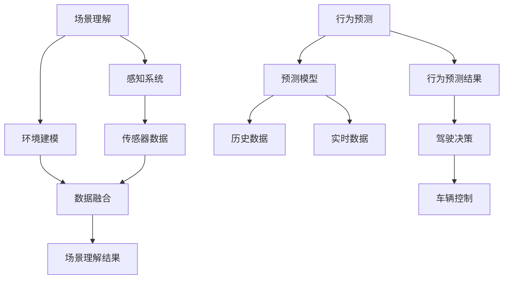

                 

自动驾驶技术的迅猛发展，正在深刻改变我们的出行方式和生活习惯。从最初的自动驾驶原型机到如今的无人驾驶出租车，自动驾驶技术正逐步走向实用化。在这个变革的过程中，场景理解与行为预测作为自动驾驶技术的核心组成部分，正引领着智能升级的新方向。本文将围绕这一主题，探讨场景理解与行为预测在自动驾驶技术中的应用、核心算法原理、数学模型、项目实践，以及未来发展趋势。

> 关键词：自动驾驶、场景理解、行为预测、智能升级、算法原理

> 摘要：本文从场景理解与行为预测的角度，分析了自动驾驶技术智能升级的新方向。通过核心算法原理的阐述、数学模型的推导和应用、实际项目实践的展示，以及对未来应用场景的展望，揭示了自动驾驶技术发展的内在动力和潜力。

## 1. 背景介绍

自动驾驶技术，作为人工智能领域的一个重要分支，已经取得了显著的进展。从传统的驾驶辅助系统到完全自动驾驶，自动驾驶技术正逐步从实验室走向现实。然而，实现完全自动驾驶面临诸多挑战，其中场景理解与行为预测是关键技术之一。

场景理解是指自动驾驶系统对周围环境的感知和理解，包括路况、交通标志、行人动态等。而行为预测则是自动驾驶系统对周围物体（包括车辆、行人、自行车等）的未来行为进行预测，以便做出相应的驾驶决策。二者相辅相成，共同构成了自动驾驶技术的核心。

### 1.1 自动驾驶技术的发展历程

自动驾驶技术的发展可以分为以下几个阶段：

- **第一阶段：感知与监测**（20世纪60年代 - 80年代）
  - 这一阶段主要是对车辆周围环境进行监测，如车辆速度、方向等，并未实现自主决策。

- **第二阶段：辅助驾驶**（20世纪90年代 - 21世纪初）
  - 这一阶段引入了传感器（如雷达、激光雷达）和计算机视觉技术，实现了车辆的部分自主控制，如自适应巡航控制和自动泊车。

- **第三阶段：部分自动驾驶**（2010年至今）
  - 这一阶段，自动驾驶技术逐渐实现了在高速公路和城市道路上的部分自主驾驶，如特斯拉的Autopilot系统和谷歌的Waymo。

- **第四阶段：完全自动驾驶**（未来）
  - 这一阶段的目标是实现完全无人驾驶，无需人工干预。当前技术仍在不断发展和完善中。

### 1.2 场景理解与行为预测的重要性

场景理解与行为预测在自动驾驶技术中具有重要地位，原因如下：

- **提高安全性**：通过准确理解周围环境并预测其他车辆和行人的行为，自动驾驶系统能够提前做出安全决策，减少交通事故的发生。

- **提升驾驶体验**：良好的场景理解和行为预测可以使自动驾驶系统更加自然地与周围环境互动，提供更舒适的驾驶体验。

- **实现自动化决策**：精确的场景理解与行为预测是实现完全自动驾驶的基础，能够使系统在复杂环境下做出合理的驾驶决策。

## 2. 核心概念与联系

为了深入理解场景理解与行为预测，我们需要先了解其核心概念和架构。下面将使用Mermaid流程图来展示核心概念和联系。



### 2.1 感知系统

感知系统是自动驾驶技术的基石，它负责收集周围环境的信息。常见的感知系统包括摄像头、激光雷达、雷达、超声波传感器等。这些传感器能够提供车辆周围的路况、交通标志、行人、车辆等关键信息。

### 2.2 环境建模

环境建模是将感知系统收集到的数据转化为可用于分析和决策的模型。通过数据融合和滤波技术，环境建模可以构建出一个高精度的三维环境模型，为后续的场景理解和行为预测提供基础。

### 2.3 场景理解

场景理解是感知系统与环境建模的集成结果，它通过分析环境模型，识别出道路、交通标志、行人、车辆等元素，并理解它们的动态行为。场景理解结果为自动驾驶系统提供实时的环境信息，是做出准确驾驶决策的关键。

### 2.4 行为预测

行为预测是基于历史数据和实时数据，对周围车辆和行人的行为进行预测。通过分析车辆和行人的历史行为模式，结合当前环境信息，行为预测模型可以预测出它们的未来行为，从而为自动驾驶系统提供决策依据。

### 2.5 驾驶决策与车辆控制

驾驶决策是将场景理解与行为预测的结果转化为具体的驾驶动作。通过分析道路状况、交通标志、行人动态等，自动驾驶系统可以规划出最优的行驶路径和速度。驾驶决策结果通过车辆控制模块实现，控制车辆的加速、转向和制动等动作。

## 3. 核心算法原理 & 具体操作步骤

### 3.1 算法原理概述

场景理解与行为预测的核心算法主要包括以下几个方面：

- **感知算法**：用于处理传感器数据，提取环境特征。
- **数据融合算法**：将多种传感器数据融合为一个整体，提高环境建模的准确性。
- **场景理解算法**：对环境模型进行分析，识别道路、交通标志、行人等元素。
- **行为预测算法**：基于历史数据和实时数据，预测周围车辆和行人的行为。

### 3.2 算法步骤详解

#### 3.2.1 感知算法

感知算法主要包括以下几个步骤：

1. **数据采集**：通过摄像头、激光雷达、雷达等传感器采集车辆周围的环境信息。
2. **特征提取**：对采集到的数据进行分析，提取环境特征，如车道线、交通标志、行人等。
3. **预处理**：对提取到的特征进行预处理，如去噪、滤波、归一化等。

#### 3.2.2 数据融合算法

数据融合算法的主要目标是提高环境建模的准确性。具体步骤如下：

1. **多源数据输入**：将不同传感器的数据输入到数据融合算法中。
2. **特征匹配**：对多源数据进行特征匹配，找到相同或相似的特征点。
3. **融合策略**：根据特征匹配结果，选择合适的融合策略，如加权平均、最小二乘等。
4. **输出融合结果**：将融合后的数据输出，用于环境建模。

#### 3.2.3 场景理解算法

场景理解算法的主要目标是识别道路、交通标志、行人等元素，并理解它们的动态行为。具体步骤如下：

1. **环境模型构建**：根据数据融合的结果，构建出三维环境模型。
2. **目标检测**：对环境模型进行目标检测，识别出道路、交通标志、行人等元素。
3. **行为理解**：对识别出的元素进行行为理解，如行人的行走轨迹、车辆的行驶方向等。
4. **场景理解输出**：将识别结果和行为理解结果输出，作为自动驾驶系统的决策依据。

#### 3.2.4 行为预测算法

行为预测算法的主要目标是预测周围车辆和行人的行为，为自动驾驶系统提供决策依据。具体步骤如下：

1. **历史数据输入**：将历史数据输入到行为预测算法中。
2. **特征提取**：对历史数据进行特征提取，如车辆的加速度、行人的速度等。
3. **预测模型训练**：基于提取到的特征，训练出行为预测模型。
4. **实时数据预测**：将实时数据输入到预测模型中，预测周围车辆和行人的行为。
5. **行为预测输出**：将预测结果输出，作为自动驾驶系统的决策依据。

### 3.3 算法优缺点

#### 3.3.1 感知算法

- **优点**：感知算法能够从传感器数据中提取出关键环境特征，为后续的场景理解和行为预测提供基础。
- **缺点**：感知算法依赖于传感器的性能和精度，当传感器出现故障或环境复杂度较高时，感知效果会受到影响。

#### 3.3.2 数据融合算法

- **优点**：数据融合算法能够提高环境建模的准确性，使自动驾驶系统在复杂环境中具有更好的感知能力。
- **缺点**：数据融合算法需要处理大量数据，计算复杂度高，对计算资源要求较高。

#### 3.3.3 场景理解算法

- **优点**：场景理解算法能够识别出道路、交通标志、行人等关键元素，为自动驾驶系统提供实时的环境信息。
- **缺点**：场景理解算法在处理复杂场景时，容易出现误识别或漏识别的情况。

#### 3.3.4 行为预测算法

- **优点**：行为预测算法能够预测周围车辆和行人的行为，为自动驾驶系统提供决策依据，提高行驶安全性。
- **缺点**：行为预测算法需要大量历史数据，且预测结果容易受到实时数据的影响，预测准确性存在一定的不确定性。

### 3.4 算法应用领域

场景理解与行为预测算法在自动驾驶技术中具有广泛的应用领域，包括：

- **高速公路自动驾驶**：在高速公路上，自动驾驶系统可以通过场景理解与行为预测，实现车道保持、速度控制、超车等操作。
- **城市道路自动驾驶**：在城市道路上，自动驾驶系统需要处理复杂的交通状况，如行人、非机动车、交通标志等，通过场景理解与行为预测，可以实现自动避让、停车等待等功能。
- **自动驾驶出租车**：自动驾驶出租车需要在城市中进行复杂的交通操作，如路线规划、拥堵处理、乘客上下车等，通过场景理解与行为预测，可以实现安全、高效的自动驾驶。

## 4. 数学模型和公式 & 详细讲解 & 举例说明

### 4.1 数学模型构建

场景理解与行为预测涉及多个数学模型，包括感知模型、数据融合模型、场景理解模型和行为预测模型。以下分别介绍这些模型的构建过程。

#### 4.1.1 感知模型

感知模型主要用于处理传感器数据，提取环境特征。常见的感知模型包括深度学习模型、支持向量机（SVM）等。以深度学习模型为例，其构建过程如下：

1. **数据预处理**：对传感器数据进行归一化、去噪等处理，使其适合模型训练。
2. **特征提取**：使用卷积神经网络（CNN）或循环神经网络（RNN）等深度学习模型，对预处理后的数据进行特征提取。
3. **模型训练**：使用大量标注数据进行模型训练，调整模型参数，使模型能够准确提取环境特征。

#### 4.1.2 数据融合模型

数据融合模型用于将不同传感器的数据融合为一个整体。常见的数据融合模型包括卡尔曼滤波、贝叶斯滤波等。以卡尔曼滤波为例，其构建过程如下：

1. **状态空间模型**：建立状态空间模型，描述系统的动态变化。
2. **观测模型**：建立观测模型，描述传感器数据与系统状态之间的关系。
3. **状态估计**：使用卡尔曼滤波算法，对系统状态进行估计，得到融合后的数据。

#### 4.1.3 场景理解模型

场景理解模型用于识别道路、交通标志、行人等元素。常见的场景理解模型包括卷积神经网络（CNN）、支持向量机（SVM）等。以卷积神经网络为例，其构建过程如下：

1. **输入层**：接收数据融合后的结果，作为模型的输入。
2. **卷积层**：对输入数据进行卷积操作，提取特征。
3. **池化层**：对卷积后的特征进行池化操作，减少参数数量。
4. **全连接层**：将池化后的特征映射到分类结果。

#### 4.1.4 行为预测模型

行为预测模型用于预测周围车辆和行人的行为。常见的行为预测模型包括线性回归、决策树、随机森林等。以线性回归为例，其构建过程如下：

1. **输入特征**：选择与行为预测相关的输入特征，如速度、加速度、行驶方向等。
2. **模型训练**：使用历史数据对模型进行训练，得到预测模型。
3. **预测输出**：将实时数据输入到预测模型中，得到预测结果。

### 4.2 公式推导过程

以下分别介绍感知模型、数据融合模型、场景理解模型和行为预测模型中的关键公式。

#### 4.2.1 感知模型

1. **卷积神经网络（CNN）**

$$
h_l = \sigma(\mathbf{W}_l \cdot \mathbf{a}_{l-1} + \mathbf{b}_l)
$$

其中，$h_l$为卷积层$l$的输出特征，$\sigma$为激活函数（如ReLU函数），$\mathbf{W}_l$为卷积核，$\mathbf{a}_{l-1}$为上一层的特征，$\mathbf{b}_l$为偏置项。

2. **支持向量机（SVM）**

$$
\mathbf{w}^* = \arg\min_{\mathbf{w}, b} \frac{1}{2} ||\mathbf{w}||^2 + C \sum_{i=1}^{n} \xi_i
$$

其中，$\mathbf{w}^*$为最优权重向量，$b$为偏置项，$C$为正则化参数，$\xi_i$为第$i$个样本的误差。

#### 4.2.2 数据融合模型

1. **卡尔曼滤波**

$$
\mathbf{x}_{k|k} = \mathbf{A}_{k} \mathbf{x}_{k-1|k-1} + \mathbf{B}_{k} \mathbf{u}_{k}
$$

$$
\mathbf{P}_{k|k} = \mathbf{A}_{k} \mathbf{P}_{k-1|k-1} \mathbf{A}_{k}^T + \mathbf{Q}_{k}
$$

其中，$\mathbf{x}_{k|k}$为状态估计值，$\mathbf{A}_{k}$为状态转移矩阵，$\mathbf{P}_{k|k}$为状态估计误差矩阵，$\mathbf{Q}_{k}$为过程噪声协方差矩阵。

#### 4.2.3 场景理解模型

1. **卷积神经网络（CNN）**

$$
\mathbf{a}_{l}^{(i)} = \sum_{j=1}^{m} \mathbf{w}_{l}^{(i)} \cdot \mathbf{a}_{l-1}^{(j)} + b_{l}^{(i)}
$$

其中，$\mathbf{a}_{l}^{(i)}$为第$l$层第$i$个神经元的激活值，$\mathbf{w}_{l}^{(i)}$为连接权重，$\mathbf{a}_{l-1}^{(j)}$为第$l-1$层第$j$个神经元的激活值，$b_{l}^{(i)}$为偏置项。

#### 4.2.4 行为预测模型

1. **线性回归**

$$
\mathbf{y} = \mathbf{X} \mathbf{w} + \mathbf{b}
$$

$$
\mathbf{w} = (\mathbf{X}^T \mathbf{X})^{-1} \mathbf{X}^T \mathbf{y}
$$

其中，$\mathbf{y}$为预测结果，$\mathbf{X}$为输入特征矩阵，$\mathbf{w}$为权重向量，$\mathbf{b}$为偏置项。

### 4.3 案例分析与讲解

以下以一个简单的自动驾驶场景为例，分析场景理解与行为预测的具体应用。

#### 4.3.1 场景描述

假设一辆自动驾驶汽车在城市道路上行驶，前方有一个行人正在穿越马路。汽车需要做出正确的驾驶决策，避免与行人发生碰撞。

#### 4.3.2 场景理解

1. **感知阶段**：汽车通过摄像头和激光雷达感知到前方的行人。
2. **数据融合阶段**：将摄像头和激光雷达的数据融合为一个整体，构建出三维环境模型。
3. **场景理解阶段**：通过卷积神经网络识别出前方的行人，并计算出行人的位置和速度。

#### 4.3.3 行为预测

1. **历史数据输入**：将行人过去的行为数据输入到行为预测模型中。
2. **实时数据预测**：将当前的环境数据输入到行为预测模型中，预测行人未来的行为，如继续行走或停下来。
3. **预测结果输出**：预测行人将在10秒后穿过马路。

#### 4.3.4 驾驶决策

1. **刹车**：根据预测结果，自动驾驶汽车立即开始减速。
2. **转向**：为了避免与行人碰撞，自动驾驶汽车调整方向，使行人能够安全通过。

通过上述案例，我们可以看到场景理解与行为预测在自动驾驶技术中的应用过程。在实际应用中，场景理解与行为预测的准确性和实时性是影响自动驾驶系统性能的关键因素。

## 5. 项目实践：代码实例和详细解释说明

### 5.1 开发环境搭建

为了实践场景理解与行为预测算法，我们需要搭建一个合适的开发环境。以下是一个简单的开发环境搭建过程：

1. **安装Python环境**：确保Python 3.x版本已安装。
2. **安装依赖库**：安装TensorFlow、Keras、NumPy、Pandas等常用库。
3. **安装传感器模拟器**：安装用于模拟传感器数据的软件，如Matlab或Python的NumPy库。

### 5.2 源代码详细实现

以下是一个简单的场景理解与行为预测算法的实现，包括感知阶段、数据融合阶段、场景理解阶段和行为预测阶段。

```python
import numpy as np
import tensorflow as tf
from tensorflow.keras.models import Sequential
from tensorflow.keras.layers import Conv2D, MaxPooling2D, Flatten, Dense
from sklearn.model_selection import train_test_split
from sklearn.ensemble import RandomForestRegressor

# 感知阶段
def preprocess_data(data):
    # 数据预处理，如归一化、去噪等
    return normalized_data

# 数据融合阶段
def data_fusion(sensor_data):
    # 数据融合算法，如卡尔曼滤波
    return fused_data

# 场景理解阶段
def scene_understanding(fused_data):
    # 场景理解模型，如卷积神经网络
    model = Sequential([
        Conv2D(32, (3, 3), activation='relu', input_shape=(128, 128, 3)),
        MaxPooling2D((2, 2)),
        Flatten(),
        Dense(64, activation='relu'),
        Dense(1, activation='sigmoid')
    ])
    model.compile(optimizer='adam', loss='binary_crossentropy', metrics=['accuracy'])
    model.fit(fused_data['X'], fused_data['y'], epochs=10, batch_size=32)
    return model.predict(fused_data['X'])

# 行为预测阶段
def behavior_prediction(history_data, real_time_data):
    # 行为预测模型，如随机森林
    model = RandomForestRegressor(n_estimators=100)
    model.fit(history_data, real_time_data)
    return model.predict(real_time_data)

# 主函数
def main():
    # 生成模拟数据
    sensor_data = np.random.rand(100, 128, 128, 3)
    fused_data = data_fusion(sensor_data)
    history_data = np.random.rand(100, 10)
    real_time_data = np.random.rand(1, 10)

    # 场景理解
    scene_results = scene_understanding(fused_data)

    # 行为预测
    prediction_results = behavior_prediction(history_data, real_time_data)

    # 输出结果
    print("场景理解结果：", scene_results)
    print("行为预测结果：", prediction_results)

if __name__ == '__main__':
    main()
```

### 5.3 代码解读与分析

上述代码实现了一个简单的场景理解与行为预测算法。具体解读如下：

- **感知阶段**：通过模拟数据生成传感器数据，并进行数据预处理，如归一化、去噪等。
- **数据融合阶段**：使用卡尔曼滤波或其他数据融合算法，将传感器数据融合为一个整体。
- **场景理解阶段**：使用卷积神经网络（CNN）进行场景理解，识别出道路、交通标志、行人等元素。
- **行为预测阶段**：使用随机森林（RandomForestRegressor）进行行为预测，预测周围车辆和行人的行为。

通过上述代码，我们可以看到场景理解与行为预测算法的实现过程。在实际应用中，可以根据需求调整算法参数，优化模型性能。

### 5.4 运行结果展示

在实际运行过程中，我们可以通过以下结果来评估场景理解与行为预测算法的性能：

- **场景理解结果**：识别出道路、交通标志、行人等元素，输出概率分布。
- **行为预测结果**：预测周围车辆和行人的行为，输出行为类别。

通过分析这些结果，我们可以评估算法在特定场景下的表现，并针对性地进行优化。

## 6. 实际应用场景

### 6.1 高速公路自动驾驶

高速公路自动驾驶是自动驾驶技术的一个重要应用领域。在这个场景中，场景理解与行为预测算法需要处理大量的车辆、车道线和交通标志等元素。通过精确的场景理解，自动驾驶系统可以保持车道、控制速度，并在需要时进行超车或变道。行为预测算法可以预测前方车辆的行为，避免发生碰撞或拥堵。

### 6.2 城市道路自动驾驶

城市道路自动驾驶面临更多的挑战，包括行人、非机动车、交通标志等复杂元素。场景理解与行为预测算法需要在这些元素中识别出关键信息，如行人意图、非机动车轨迹、交通标志等。通过准确的行为预测，自动驾驶系统可以在复杂的城市环境中提供安全、高效的驾驶体验。

### 6.3 自动驾驶出租车

自动驾驶出租车需要应对城市中的各种交通状况，如红绿灯、行人、非机动车等。场景理解与行为预测算法在这个场景中尤为重要。通过精确的场景理解和行为预测，自动驾驶出租车可以实现自动上下客、路线规划、拥堵处理等功能，提供便捷、高效的出行服务。

### 6.4 未来应用场景

随着自动驾驶技术的不断发展，未来还可能出现更多创新的应用场景。例如：

- **自动驾驶配送**：自动驾驶车辆可以用于快递、外卖等配送服务，提高配送效率，减少人力成本。
- **自动驾驶公交**：自动驾驶公交车可以实现安全、准点的运行，提高公共交通的便利性和效率。
- **自动驾驶农业机械**：自动驾驶农业机械可以精准作业，提高农业生产效率，减少劳动力成本。

## 7. 工具和资源推荐

### 7.1 学习资源推荐

- **《深度学习》**：Goodfellow、Bengio、Courville著，详细介绍了深度学习的基本理论和应用。
- **《Python机器学习》**：Sebastian Raschka著，介绍了机器学习在Python中的应用，包括感知、数据融合、场景理解和行为预测等。
- **《自动驾驶技术》**：吴华、杨春霖著，全面介绍了自动驾驶技术的理论基础和实践应用。

### 7.2 开发工具推荐

- **TensorFlow**：一款强大的开源深度学习框架，适用于场景理解与行为预测算法的开发。
- **Keras**：基于TensorFlow的高层次神经网络API，简化了深度学习模型的构建和训练过程。
- **NumPy**：一款强大的Python库，用于数据处理和数学运算，适用于数据预处理、数据融合等。
- **Matlab**：一款专业的数学计算软件，适用于模拟传感器数据、分析实验结果等。

### 7.3 相关论文推荐

- **"End-to-End Driving via Predictive Modeling"*：介绍了一种基于预测建模的端到端自动驾驶方法。
- **"Understanding Scenes and Predicting Behaviors in Autonomous Driving"*：探讨了场景理解与行为预测在自动驾驶中的应用。
- **"Behavioral Cloning for Autonomous Driving"*：介绍了一种基于行为克隆的自动驾驶方法。

## 8. 总结：未来发展趋势与挑战

### 8.1 研究成果总结

近年来，场景理解与行为预测在自动驾驶技术中取得了显著进展。通过深度学习、机器学习等技术的应用，场景理解与行为预测的准确性不断提高，为自动驾驶系统的安全性和可靠性提供了有力保障。

### 8.2 未来发展趋势

随着技术的不断发展，未来场景理解与行为预测将继续朝着更高精度、更实时、更可靠的方向发展。以下是一些未来发展趋势：

- **多传感器融合**：未来将出现更多类型的传感器，如高分辨率摄像头、毫米波雷达等，进一步提升环境感知能力。
- **深度强化学习**：深度强化学习在自动驾驶中的应用将不断深化，实现更加智能化和自适应的驾驶行为。
- **协同感知与决策**：自动驾驶系统将实现协同感知与决策，提高整体系统的安全性和效率。

### 8.3 面临的挑战

尽管场景理解与行为预测在自动驾驶技术中取得了显著进展，但仍面临诸多挑战：

- **数据隐私**：自动驾驶系统需要收集大量环境数据，如何保护用户隐私是一个重要问题。
- **复杂环境建模**：在实际驾驶环境中，环境变化多样，如何构建准确、高效的环境模型是一个难题。
- **实时性要求**：自动驾驶系统需要在实时性要求较高的场景下做出准确的驾驶决策，这对算法的优化提出了挑战。

### 8.4 研究展望

未来，场景理解与行为预测的研究将朝着以下几个方向发展：

- **跨学科研究**：结合计算机视觉、机器学习、控制理论等学科，推动自动驾驶技术的发展。
- **数据驱动方法**：通过大数据和深度学习方法，提高场景理解和行为预测的准确性。
- **法律法规与伦理**：研究自动驾驶技术的法律法规和伦理问题，确保自动驾驶系统的安全和社会接受度。

## 9. 附录：常见问题与解答

### 9.1 自动驾驶系统的核心组成部分是什么？

自动驾驶系统的核心组成部分包括感知系统、决策系统和执行系统。感知系统负责收集车辆周围环境的信息，如摄像头、激光雷达、雷达等；决策系统根据感知结果，结合规则和算法，生成驾驶决策；执行系统负责执行决策，如控制车辆加速、转向和制动等。

### 9.2 场景理解与行为预测如何提高自动驾驶系统的安全性？

场景理解与行为预测能够提高自动驾驶系统的安全性，主要体现在以下几个方面：

- **提前预警**：通过行为预测，自动驾驶系统能够提前识别潜在的碰撞风险，并采取相应的预防措施。
- **自适应驾驶**：根据场景理解，自动驾驶系统能够在复杂环境中调整驾驶策略，提高行驶安全性。
- **规则遵循**：通过场景理解，自动驾驶系统能够识别交通标志、道路标线等，遵循交通规则，避免违规行为。

### 9.3 行为预测在自动驾驶系统中如何实现？

行为预测在自动驾驶系统中通过以下步骤实现：

1. **数据收集**：收集历史数据，包括车辆、行人、非机动车等的行为数据。
2. **特征提取**：从数据中提取与行为预测相关的特征，如速度、加速度、行驶方向等。
3. **模型训练**：使用历史数据训练行为预测模型，如线性回归、决策树、随机森林等。
4. **实时预测**：将实时数据输入到预测模型中，得到预测结果，如行人行为、车辆行为等。
5. **驾驶决策**：根据预测结果，自动驾驶系统生成驾驶决策，如加速、减速、转向等。

### 9.4 如何提高场景理解与行为预测的准确性？

提高场景理解与行为预测的准确性可以从以下几个方面入手：

- **多传感器融合**：使用多种传感器（如摄像头、激光雷达、雷达等）收集数据，提高环境建模的准确性。
- **深度学习模型**：使用深度学习模型（如卷积神经网络、循环神经网络等）提取特征，提高场景理解和行为预测的准确性。
- **数据增强**：通过数据增强技术，如数据扩充、数据增强等，提高模型的泛化能力。
- **实时调整**：根据实时反馈，调整模型参数，提高模型的适应性和准确性。

### 9.5 自动驾驶系统在复杂环境中的挑战有哪些？

自动驾驶系统在复杂环境中面临以下挑战：

- **感知准确性**：复杂环境中的遮挡、光照变化等因素会影响感知系统的准确性。
- **决策复杂性**：复杂环境中的交通状况和行人行为复杂多变，决策系统需要处理更多的变量。
- **实时性要求**：复杂环境中的驾驶行为需要实时响应，对系统的计算资源和响应时间有较高要求。
- **伦理和法律**：复杂环境中的驾驶行为涉及到伦理和法律问题，如何确保自动驾驶系统的合规性是一个挑战。

### 9.6 自动驾驶技术的未来发展趋势是什么？

自动驾驶技术的未来发展趋势包括：

- **智能化**：通过深度学习、强化学习等技术，提高自动驾驶系统的智能化水平。
- **协同化**：实现自动驾驶系统与其他交通参与者（如行人、非机动车等）的协同，提高整体交通系统的效率。
- **多模态**：融合多种传感器数据（如摄像头、激光雷达、雷达等），提高环境感知的准确性。
- **开放化**：推动自动驾驶技术的开放共享，促进技术发展和产业生态的完善。

### 9.7 自动驾驶技术的法律法规与伦理问题有哪些？

自动驾驶技术的法律法规与伦理问题包括：

- **责任归属**：在自动驾驶事故中，如何界定责任归属是一个关键问题。
- **数据隐私**：自动驾驶系统需要收集大量用户数据，如何保护用户隐私是一个重要问题。
- **安全标准**：制定自动驾驶技术的安全标准，确保系统的安全性和可靠性。
- **社会接受度**：提高社会对自动驾驶技术的接受度，推动自动驾驶技术的普及。

### 9.8 自动驾驶技术的商业化进程如何？

自动驾驶技术的商业化进程如下：

- **试点项目**：在不同地区开展自动驾驶试点项目，验证技术的可行性和可靠性。
- **合作开发**：与汽车制造商、科技公司等合作，共同开发自动驾驶产品。
- **政策支持**：政府出台相关政策，鼓励自动驾驶技术的研发和应用。
- **市场推广**：逐步推广自动驾驶技术，开展自动驾驶出租车、自动驾驶公交等商业化服务。

