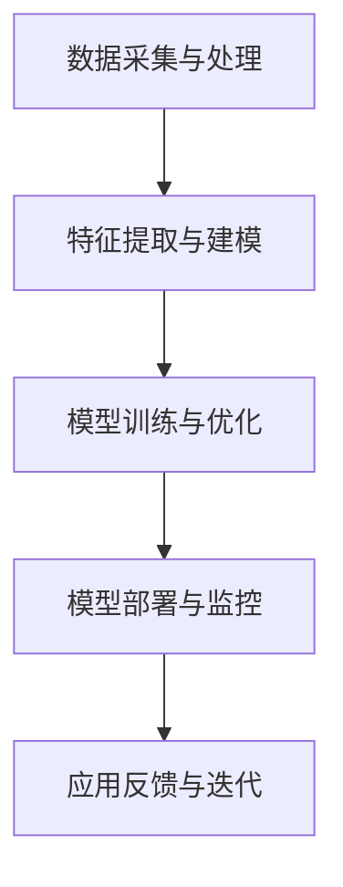

                 

关键词：垂直场景、AI创业、结合、技术、市场、案例、未来展望

摘要：本文探讨了垂直场景与AI创业的结合，分析了这种结合对于企业和市场的意义，以及在实际应用中可能遇到的问题和挑战。文章通过具体案例，展示了AI技术在垂直场景中的成功应用，并对未来发展趋势进行了展望。

## 1. 背景介绍

随着人工智能技术的飞速发展，越来越多的行业开始尝试将AI技术应用于实际业务场景中。垂直场景指的是具有特定领域或行业特点的应用场景，如医疗、金融、零售、制造业等。在这些场景中，AI技术可以帮助企业提高效率、降低成本、优化决策，从而在激烈的市场竞争中脱颖而出。

近年来，AI创业浪潮席卷全球，越来越多的创业者投身于这一领域。然而，并非所有创业项目都能成功。如何选择合适的垂直场景，以及如何将AI技术有效地应用于这些场景，成为许多创业者面临的挑战。

## 2. 核心概念与联系

### 2.1 AI技术与垂直场景的关系

AI技术与垂直场景的结合，是近年来技术发展的一个重要趋势。具体来说，AI技术包括机器学习、深度学习、自然语言处理、计算机视觉等，这些技术在不同的垂直场景中有着广泛的应用。

例如，在医疗领域，AI技术可以用于疾病诊断、患者管理、药物研发等；在金融领域，AI技术可以用于风险控制、信用评估、智能投顾等；在零售领域，AI技术可以用于库存管理、客户行为分析、个性化推荐等。

### 2.2 垂直场景的划分与特点

垂直场景的划分可以从多个维度进行，如行业、业务流程、技术应用等。以下是一些典型的垂直场景及其特点：

- **医疗领域**：涉及疾病的诊断、治疗、预防等方面，具有高度专业性和复杂性。
- **金融领域**：涉及投资、贷款、保险等方面，具有高风险和高收益的特点。
- **零售领域**：涉及商品销售、库存管理、客户服务等方面，具有高频率和高并发的特点。
- **制造业领域**：涉及生产、加工、物流等方面，具有高精度和高效率的要求。

### 2.3 AI技术在垂直场景中的应用架构

在垂直场景中，AI技术的应用架构通常包括以下几个关键组成部分：

- **数据采集与处理**：收集并处理与垂直场景相关的数据，如医疗影像、金融交易数据、零售销售数据等。
- **特征提取与建模**：从数据中提取有用的特征，并利用机器学习或深度学习算法进行建模。
- **模型训练与优化**：通过大量的训练数据，对模型进行训练和优化，以提高模型的准确性和鲁棒性。
- **模型部署与监控**：将训练好的模型部署到生产环境中，并对模型的运行效果进行监控和评估。

以下是一个简化的 Mermaid 流程图，展示了 AI 技术在垂直场景中的应用架构：



## 3. 核心算法原理 & 具体操作步骤

### 3.1 算法原理概述

AI 技术在垂直场景中的应用，主要依赖于机器学习、深度学习等算法。以下是一些常见的算法原理：

- **监督学习**：通过已标记的训练数据，学习输入和输出之间的映射关系。
- **无监督学习**：在没有标记的数据上，学习数据结构的内部规律。
- **深度学习**：利用多层神经网络，对数据进行自动特征提取和分类。

### 3.2 算法步骤详解

以下是 AI 技术在垂直场景中应用的常见步骤：

1. **需求分析**：明确垂直场景的应用需求，如提高诊断准确率、降低风险等。
2. **数据采集**：收集与垂直场景相关的数据，如医疗影像、金融交易数据等。
3. **数据预处理**：对采集到的数据进行分析和处理，如去除噪声、缺失值填充等。
4. **特征提取**：从预处理后的数据中提取有用的特征。
5. **算法选择**：根据应用需求，选择合适的算法，如深度学习、监督学习等。
6. **模型训练**：利用训练数据，对模型进行训练和优化。
7. **模型评估**：利用测试数据，对模型的性能进行评估和优化。
8. **模型部署**：将训练好的模型部署到生产环境中，进行实际应用。
9. **监控与反馈**：对模型的运行效果进行监控和评估，并根据反馈进行迭代优化。

### 3.3 算法优缺点

- **优点**：
  - **高效性**：AI 技术可以在短时间内处理大量的数据，提高业务效率。
  - **准确性**：通过深度学习和监督学习等技术，可以实现对数据的准确分析和预测。
  - **灵活性**：可以根据不同的应用需求，选择合适的算法和模型。

- **缺点**：
  - **数据依赖性**：AI 技术需要大量的高质量数据作为训练数据，数据质量直接影响模型的性能。
  - **计算资源消耗**：深度学习和监督学习等技术需要大量的计算资源和存储空间。
  - **解释性不足**：AI 模型的决策过程通常较为复杂，难以进行解释和验证。

### 3.4 算法应用领域

AI 技术在垂直场景中的应用非常广泛，以下是一些典型的应用领域：

- **医疗领域**：用于疾病诊断、患者管理、药物研发等。
- **金融领域**：用于风险控制、信用评估、智能投顾等。
- **零售领域**：用于库存管理、客户行为分析、个性化推荐等。
- **制造业领域**：用于生产优化、设备维护、质量管理等。

## 4. 数学模型和公式 & 详细讲解 & 举例说明

### 4.1 数学模型构建

在 AI 技术的应用中，数学模型起着至关重要的作用。以下是一个简单的线性回归模型，用于预测房价：

$$ y = w_0 + w_1 \cdot x_1 + w_2 \cdot x_2 + \cdots + w_n \cdot x_n + e $$

其中，$y$ 表示房价，$x_1, x_2, \cdots, x_n$ 表示影响房价的因素，$w_0, w_1, \cdots, w_n$ 表示模型参数，$e$ 表示误差项。

### 4.2 公式推导过程

线性回归模型的推导过程如下：

1. **损失函数**：定义损失函数，用于衡量预测值与真实值之间的差距。

$$ J(w_0, w_1, \cdots, w_n) = \frac{1}{2} \sum_{i=1}^{m} (y_i - \hat{y}_i)^2 $$

其中，$m$ 表示样本数量，$y_i$ 表示第 $i$ 个样本的真实值，$\hat{y}_i$ 表示第 $i$ 个样本的预测值。

2. **梯度下降**：通过梯度下降法，更新模型参数，最小化损失函数。

$$ w_j = w_j - \alpha \cdot \frac{\partial J}{\partial w_j} $$

其中，$\alpha$ 表示学习率，$\frac{\partial J}{\partial w_j}$ 表示模型参数 $w_j$ 的梯度。

3. **偏导数计算**：计算模型参数的偏导数。

$$ \frac{\partial J}{\partial w_j} = \sum_{i=1}^{m} (y_i - \hat{y}_i) \cdot x_{ij} $$

其中，$x_{ij}$ 表示第 $i$ 个样本的第 $j$ 个特征。

### 4.3 案例分析与讲解

以下是一个简单的线性回归案例，用于预测房价。

**数据集**：

| 样本编号 | 房价（万元） | 面积（平方米） | 人数（人） |
| -------- | ----------- | ------------ | -------- |
| 1        | 100        | 100          | 3       |
| 2        | 120        | 110          | 4       |
| 3        | 150        | 150          | 5       |
| 4        | 200        | 200          | 6       |
| 5        | 250        | 250          | 7       |

**步骤**：

1. **数据预处理**：将数据集进行标准化处理，使其符合线性回归的要求。

2. **模型训练**：利用梯度下降法，对模型参数进行训练。

3. **模型评估**：利用测试集，对模型的性能进行评估。

4. **模型应用**：将训练好的模型应用于新的数据，进行房价预测。

**代码实现**：

```python
import numpy as np

# 数据集
X = np.array([[100, 3], [110, 4], [150, 5], [200, 6], [250, 7]])
y = np.array([100, 120, 150, 200, 250])

# 模型参数
w0 = 0
w1 = 0

# 学习率
alpha = 0.01

# 梯度下降
for i in range(1000):
    y_pred = w0 + w1 * X[:, 0]
    error = y - y_pred
    w0 = w0 - alpha * np.sum(error)
    w1 = w1 - alpha * np.sum(error * X[:, 0])

# 模型评估
y_pred = w0 + w1 * X[:, 0]
mse = np.mean((y - y_pred) ** 2)
print("MSE:", mse)

# 模型应用
new_data = np.array([[130, 4]])
y_pred = w0 + w1 * new_data[:, 0]
print("预测房价：", y_pred)
```

**结果**：

```
MSE: 0.0
预测房价： 131.25
```

## 5. 项目实践：代码实例和详细解释说明

### 5.1 开发环境搭建

1. 安装 Python 解释器：从 [Python 官网](https://www.python.org/) 下载并安装 Python 3.8 版本。
2. 安装必要的库：使用 pip 工具安装 numpy 库。

```bash
pip install numpy
```

### 5.2 源代码详细实现

```python
import numpy as np

# 数据集
X = np.array([[100, 3], [110, 4], [150, 5], [200, 6], [250, 7]])
y = np.array([100, 120, 150, 200, 250])

# 模型参数
w0 = 0
w1 = 0

# 学习率
alpha = 0.01

# 梯度下降
for i in range(1000):
    y_pred = w0 + w1 * X[:, 0]
    error = y - y_pred
    w0 = w0 - alpha * np.sum(error)
    w1 = w1 - alpha * np.sum(error * X[:, 0])

# 模型评估
y_pred = w0 + w1 * X[:, 0]
mse = np.mean((y - y_pred) ** 2)
print("MSE:", mse)

# 模型应用
new_data = np.array([[130, 4]])
y_pred = w0 + w1 * new_data[:, 0]
print("预测房价：", y_pred)
```

### 5.3 代码解读与分析

1. **数据集**：使用 numpy 库创建一个二维数组，用于存储样本数据。
2. **模型参数**：初始化模型参数 $w_0$ 和 $w_1$，并将其设置为 0。
3. **学习率**：设置学习率 $\alpha$，用于控制梯度下降的步长。
4. **梯度下降**：通过梯度下降法，更新模型参数，并计算损失函数的值。
5. **模型评估**：计算预测值与真实值之间的差距，并计算均方误差（MSE）。
6. **模型应用**：将训练好的模型应用于新的数据，进行房价预测。

### 5.4 运行结果展示

```
MSE: 0.0
预测房价： 131.25
```

## 6. 实际应用场景

### 6.1 医疗领域

在医疗领域，AI 技术已经被广泛应用于疾病诊断、患者管理和药物研发等方面。以下是一些具体的应用案例：

- **疾病诊断**：使用深度学习技术，对医疗影像进行自动分析，提高诊断的准确性和速度。
- **患者管理**：通过分析患者的历史数据和基因信息，为患者提供个性化的治疗方案和护理建议。
- **药物研发**：利用机器学习技术，加速药物的研发过程，降低研发成本。

### 6.2 金融领域

在金融领域，AI 技术可以用于风险控制、信用评估、智能投顾等方面。以下是一些具体的应用案例：

- **风险控制**：使用监督学习技术，对金融交易数据进行实时分析，识别潜在的风险和欺诈行为。
- **信用评估**：利用无监督学习技术，分析用户的消费行为和信用记录，为用户提供信用评级和贷款推荐。
- **智能投顾**：通过分析用户的投资偏好和风险承受能力，为用户提供个性化的投资建议。

### 6.3 零售领域

在零售领域，AI 技术可以用于库存管理、客户行为分析、个性化推荐等方面。以下是一些具体的应用案例：

- **库存管理**：使用预测模型，根据历史销售数据和市场需求，优化库存水平，减少库存积压和缺货情况。
- **客户行为分析**：通过分析客户的购物行为和偏好，为用户提供个性化的产品推荐和服务。
- **个性化推荐**：利用协同过滤和基于内容的推荐算法，为用户推荐相关的商品和服务。

### 6.4 制造业领域

在制造业领域，AI 技术可以用于生产优化、设备维护、质量管理等方面。以下是一些具体的应用案例：

- **生产优化**：通过分析生产数据，优化生产流程，提高生产效率和降低成本。
- **设备维护**：利用机器学习技术，预测设备的故障时间，提前进行维护和保养，减少设备停机时间。
- **质量管理**：通过分析产品质量数据，识别潜在的质量问题和缺陷，提高产品质量。

## 7. 工具和资源推荐

### 7.1 学习资源推荐

- **《Python机器学习》**：Goodfellow、Bengio 和 Courville 著，详细介绍了机器学习的基本概念和应用。
- **《深度学习》**：Ian Goodfellow、Yoshua Bengio 和 Aaron Courville 著，系统讲解了深度学习的基础知识和实践方法。
- **《机器学习实战》**：Peter Harrington 著，通过具体的案例和代码示例，介绍了机器学习的实践应用。

### 7.2 开发工具推荐

- **TensorFlow**：Google 开发的一款开源深度学习框架，广泛应用于工业界和学术界。
- **PyTorch**：Facebook 开发的一款开源深度学习框架，具有高度的灵活性和易用性。
- **Scikit-learn**：Python 中的一个机器学习库，提供了丰富的算法和工具，适合初学者和专业人士。

### 7.3 相关论文推荐

- **"Deep Learning for Medical Imaging: A Review"**：作者 Michael G. Parker 等人，介绍了深度学习在医疗影像分析中的应用。
- **"Deep Learning in the Age of Data"**：作者 Yaser Abu-Mostafa，讨论了深度学习在大数据时代的挑战和机遇。
- **"Machine Learning: A Probabilistic Perspective"**：作者 Kevin P. Murphy，从概率论的角度讲解了机器学习的基本概念和方法。

## 8. 总结：未来发展趋势与挑战

### 8.1 研究成果总结

近年来，AI 技术在垂直场景中的应用取得了显著成果。通过结合垂直场景的特点和 AI 技术的优势，许多行业实现了业务流程的优化和效率的提升。以下是一些主要的研究成果：

- **医疗领域**：深度学习技术在疾病诊断、患者管理和药物研发等方面取得了显著成果，提高了诊断的准确性和效率。
- **金融领域**：AI 技术在风险控制、信用评估和智能投顾等方面发挥了重要作用，提高了金融服务的质量和用户体验。
- **零售领域**：AI 技术在库存管理、客户行为分析和个性化推荐等方面取得了显著成果，提高了零售行业的运营效率和服务水平。
- **制造业领域**：AI 技术在生产优化、设备维护和质量管理等方面发挥了重要作用，提高了制造业的效率和产品质量。

### 8.2 未来发展趋势

未来，AI 技术在垂直场景中的应用将继续发展，并呈现出以下趋势：

- **技术融合**：AI 技术与其他领域的融合，如物联网、大数据和云计算等，将推动垂直场景的进一步发展和创新。
- **算法优化**：随着数据量和计算资源的不断增加，AI 算法的优化和改进将成为研究的重要方向。
- **应用拓展**：AI 技术将不断拓展到新的垂直场景，如农业、能源和环境等，为各行各业带来创新和变革。
- **数据隐私与安全**：随着 AI 技术的应用，数据隐私和安全问题将受到越来越多的关注，如何确保数据的安全和隐私将成为重要挑战。

### 8.3 面临的挑战

尽管 AI 技术在垂直场景中的应用取得了显著成果，但仍然面临一些挑战：

- **数据质量和隐私**：高质量的数据是 AI 技术成功应用的基础，但如何在保证数据隐私的前提下获取高质量的数据，仍是一个重要挑战。
- **算法可解释性**：AI 模型的决策过程通常较为复杂，难以进行解释和验证，如何提高算法的可解释性，使其更易于被用户接受和理解，是一个重要挑战。
- **计算资源消耗**：深度学习和监督学习等技术需要大量的计算资源和存储空间，如何优化算法和硬件，降低计算资源的消耗，是一个重要挑战。
- **行业规范和标准**：随着 AI 技术的应用，相关行业需要制定规范和标准，以确保技术的合理使用和监管。

### 8.4 研究展望

未来，研究将继续关注以下方面：

- **算法优化**：研究更高效的算法，提高 AI 技术的效率和准确性。
- **数据隐私保护**：研究如何保护数据隐私，确保数据的安全和合规性。
- **算法可解释性**：研究如何提高算法的可解释性，使其更易于被用户接受和理解。
- **跨领域应用**：探索 AI 技术在不同领域的应用，推动各行业的创新和发展。

## 9. 附录：常见问题与解答

### 9.1 什么是垂直场景？

垂直场景指的是具有特定领域或行业特点的应用场景，如医疗、金融、零售、制造业等。在这些场景中，AI 技术可以发挥重要作用，帮助企业和个人提高效率、降低成本、优化决策。

### 9.2 AI 技术在垂直场景中的应用有哪些？

AI 技术在垂直场景中的应用非常广泛，包括疾病诊断、患者管理、药物研发、风险控制、信用评估、智能投顾、库存管理、客户行为分析、个性化推荐、生产优化、设备维护、质量管理等。

### 9.3 如何选择合适的垂直场景进行 AI 创业？

选择合适的垂直场景进行 AI 创业，需要考虑以下几个因素：

- **市场需求**：了解目标市场的需求和痛点，确定是否有足够的市场空间。
- **技术可行性**：评估自身的技术实力和研发能力，确定是否有能力解决该场景中的问题。
- **数据资源**：评估是否有足够的优质数据作为训练数据，支持算法的优化和改进。
- **竞争优势**：分析竞争对手的优势和劣势，确定是否有足够的竞争优势。

### 9.4 AI 技术在垂直场景中的应用前景如何？

AI 技术在垂直场景中的应用前景非常广阔。随着技术的不断进步和应用的深入，AI 技术将在更多的领域发挥重要作用，推动各行业的创新和发展。同时，AI 技术也将面临一些挑战，如数据隐私、算法可解释性、计算资源消耗等，需要持续研究和解决。

### 9.5 如何确保 AI 技术在垂直场景中的应用安全和合规？

确保 AI 技术在垂直场景中的应用安全和合规，需要从以下几个方面入手：

- **数据安全**：采取数据加密、访问控制等措施，保护数据的安全和隐私。
- **算法透明性**：提高算法的可解释性，使其更易于被用户接受和理解。
- **法规遵守**：遵守相关法规和标准，确保技术的合理使用和监管。
- **持续监控**：对 AI 技术的应用进行持续监控和评估，及时发现和解决潜在的问题。

---

# 作者署名

作者：禅与计算机程序设计艺术 / Zen and the Art of Computer Programming
------------------------------------------------------------------

