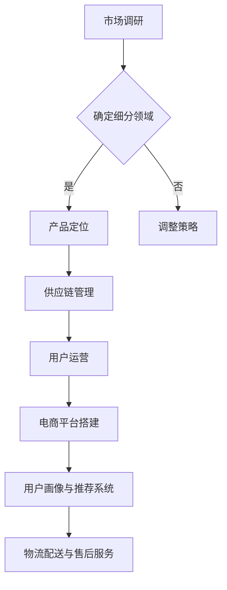

                 

关键词：垂直电商、细分市场、精准服务、用户需求、商业模型、技术实现、案例分析

> 摘要：本文旨在探讨垂直电商创业的核心策略，即通过细分市场和提供精准服务来满足用户需求。本文将结合实际案例，深入分析垂直电商的商业模式、技术实现以及未来发展趋势，为创业者和企业家提供有价值的参考。

## 1. 背景介绍

随着互联网技术的飞速发展和消费者购物习惯的改变，电商行业呈现出蓬勃发展的态势。然而，在激烈的竞争环境下，垂直电商凭借其细分市场的优势，逐渐崭露头角。垂直电商专注于某一特定领域或细分市场，提供更加专业化、个性化的商品和服务，从而在市场中占据了一席之地。

垂直电商的崛起，一方面源于消费者对多样化、个性化商品和服务的需求不断增加；另一方面，也是由于传统综合电商在商品种类和服务质量上难以满足用户需求的局限性。因此，垂直电商的创业浪潮应运而生。

### 1.1 垂直电商的定义

垂直电商，即专注于某一特定领域或细分市场的电子商务平台。与传统综合电商相比，垂直电商具有以下特点：

1. **专业性强**：垂直电商专注于某一领域，对产品线和供应链有深入的了解和把控，能够提供更专业、更贴心的服务。
2. **个性化服务**：垂直电商根据用户需求和偏好，提供定制化的商品和服务，提升用户体验。
3. **高效供应链**：垂直电商在供应链管理上具有优势，能够实现更快的物流配送和更高的库存周转率。
4. **用户粘性强**：由于垂直电商能够更好地满足用户需求，用户对其忠诚度较高，有利于平台的长期发展。

### 1.2 垂直电商的发展历程

垂直电商的发展历程可以分为以下几个阶段：

1. **萌芽阶段**：2000年左右，淘宝、京东等综合电商崛起，垂直电商开始萌芽。
2. **快速发展阶段**：2010年以后，随着移动互联网的普及，垂直电商迎来了快速发展期，如小红书、蘑菇街等。
3. **成熟阶段**：当前，垂直电商已经成为电商市场的重要组成部分，许多垂直电商已经实现了盈利。

## 2. 核心概念与联系

### 2.1 垂直电商的商业模式

垂直电商的商业模式主要包括以下三个方面：

1. **商品和服务定位**：根据市场需求和用户需求，确定垂直电商的细分领域和产品定位。
2. **供应链管理**：建立高效、稳定的供应链体系，确保商品质量和供应链效率。
3. **用户运营**：通过精准的用户画像和个性化推荐，提高用户满意度和粘性。

### 2.2 技术实现

垂直电商的技术实现主要包括以下几个方面：

1. **电商平台搭建**：利用云计算、大数据等技术，搭建具有高并发、高可扩展性的电商平台。
2. **用户画像与推荐系统**：通过数据挖掘和机器学习技术，构建用户画像和个性化推荐系统。
3. **物流配送与售后服务**：利用互联网技术和智能设备，实现高效、精准的物流配送和售后服务。

### 2.3 Mermaid 流程图



## 3. 核心算法原理 & 具体操作步骤

### 3.1 算法原理概述

垂直电商的核心算法主要包括用户画像构建、个性化推荐和精准营销。以下是这三个算法的原理概述：

1. **用户画像构建**：通过对用户行为数据、偏好数据等进行数据挖掘和建模，构建用户的全面画像。
2. **个性化推荐**：利用用户画像和协同过滤、基于内容的推荐算法，为用户推荐符合其需求和兴趣的商品和服务。
3. **精准营销**：结合用户画像和营销数据，针对不同用户群体制定个性化的营销策略，提高营销效果。

### 3.2 算法步骤详解

1. **用户画像构建**
   - 数据采集：收集用户的基础信息、行为数据、偏好数据等。
   - 数据清洗：对采集到的数据进行清洗、去噪、归一化等预处理。
   - 特征提取：根据用户画像的需求，提取用户的年龄、性别、地域、购买行为等特征。
   - 模型构建：利用机器学习算法，如决策树、随机森林等，构建用户画像模型。

2. **个性化推荐**
   - 用户画像匹配：将用户当前的行为和偏好与用户画像进行匹配，确定用户的兴趣和需求。
   - 推荐算法选择：根据业务需求和数据特点，选择合适的推荐算法，如协同过滤、基于内容的推荐等。
   - 推荐结果生成：根据用户画像和推荐算法，为用户生成个性化的推荐列表。

3. **精准营销**
   - 营销活动策划：根据用户画像和市场需求，策划个性化的营销活动。
   - 营销渠道选择：结合用户画像和营销目标，选择合适的营销渠道，如社交媒体、电子邮件等。
   - 营销效果评估：通过对营销活动的数据监控和评估，优化营销策略，提高营销效果。

### 3.3 算法优缺点

1. **用户画像构建**
   - 优点：能够全面了解用户需求和行为，为个性化推荐和精准营销提供有力支持。
   - 缺点：数据挖掘和建模过程复杂，对数据处理能力和算法选择有较高要求。

2. **个性化推荐**
   - 优点：能够提高用户满意度和购买转化率，提升电商平台竞争力。
   - 缺点：推荐结果可能存在偏差，对算法和数据处理有较高要求。

3. **精准营销**
   - 优点：能够提高营销效果，降低营销成本。
   - 缺点：对用户画像和推荐算法有较高要求，实施难度较大。

### 3.4 算法应用领域

垂直电商的核心算法在以下领域具有广泛应用：

1. **商品推荐**：为用户推荐符合其需求和兴趣的商品，提高购买转化率。
2. **精准广告**：根据用户画像和兴趣，为用户推送相关的广告，提高广告投放效果。
3. **用户运营**：通过个性化推荐和精准营销，提高用户满意度和粘性，提升用户留存率。

## 4. 数学模型和公式 & 详细讲解 & 举例说明

### 4.1 数学模型构建

垂直电商的核心数学模型主要包括用户画像模型、推荐模型和营销模型。以下是这些模型的构建过程：

1. **用户画像模型**
   - 构建用户画像的关键在于提取用户的特征。常见的用户特征包括：
     - \(X_1\): 用户年龄
     - \(X_2\): 用户性别
     - \(X_3\): 用户地域
     - \(X_4\): 用户购买历史
     - \(X_5\): 用户浏览历史
   - 利用这些特征，可以构建用户画像模型：
     $$User\_Profile = f(X_1, X_2, X_3, X_4, X_5)$$

2. **推荐模型**
   - 推荐模型通常采用协同过滤算法或基于内容的推荐算法。协同过滤算法的核心公式为：
     $$R_{ij} = \frac{\sum_{k \in N_j} R_{ik} \cdot S_{kj}}{\sum_{k \in N_j} S_{kj}}$$
   - 其中，\(R_{ij}\) 表示用户 \(i\) 对商品 \(j\) 的评分，\(N_j\) 表示购买商品 \(j\) 的用户集合，\(S_{kj}\) 表示用户 \(k\) 对商品 \(j\) 的评分。

3. **营销模型**
   - 营销模型通常采用贝叶斯公式进行建模，用于预测用户对某项营销活动的响应概率：
     $$P(A|B) = \frac{P(B|A) \cdot P(A)}{P(B)}$$
   - 其中，\(P(A)\) 表示事件 \(A\) 的先验概率，\(P(B)\) 表示事件 \(B\) 的先验概率，\(P(B|A)\) 表示在事件 \(A\) 发生的情况下，事件 \(B\) 发生的概率。

### 4.2 公式推导过程

1. **用户画像模型**
   - 用户画像模型的推导过程如下：
     $$User\_Profile = \sum_{i=1}^{n} w_i \cdot X_i$$
   - 其中，\(w_i\) 表示特征 \(X_i\) 的权重，可以通过交叉验证等方法进行优化。

2. **推荐模型**
   - 协同过滤算法的推导过程如下：
     $$R_{ij} = \frac{\sum_{k \in N_j} R_{ik} \cdot S_{kj}}{\sum_{k \in N_j} S_{kj}}$$
   - 其中，\(N_j\) 表示购买商品 \(j\) 的用户集合，\(S_{kj}\) 表示用户 \(k\) 对商品 \(j\) 的评分。

3. **营销模型**
   - 贝叶斯公式的推导过程如下：
     $$P(A|B) = \frac{P(B|A) \cdot P(A)}{P(B)}$$
   - 其中，\(P(A)\) 表示事件 \(A\) 的先验概率，\(P(B)\) 表示事件 \(B\) 的先验概率，\(P(B|A)\) 表示在事件 \(A\) 发生的情况下，事件 \(B\) 发生的概率。

### 4.3 案例分析与讲解

以下是一个具体的案例分析，用于展示如何应用数学模型进行用户画像、推荐和营销。

#### 案例背景

假设有一个电商平台，用户规模为100万，商品种类为1000种。平台希望利用用户画像、推荐和营销模型，提高用户满意度和购买转化率。

#### 用户画像构建

1. **数据采集**：采集用户的基础信息（如年龄、性别、地域）、行为数据（如浏览历史、购买历史）等。
2. **数据清洗**：对采集到的数据进行清洗、去噪、归一化等预处理。
3. **特征提取**：提取用户的年龄、性别、地域、购买历史、浏览历史等特征。
4. **模型构建**：利用决策树、随机森林等算法，构建用户画像模型。

#### 个性化推荐

1. **用户画像匹配**：将用户当前的行为和偏好与用户画像进行匹配，确定用户的兴趣和需求。
2. **推荐算法选择**：采用协同过滤算法，为用户推荐符合其需求和兴趣的商品。
3. **推荐结果生成**：根据用户画像和推荐算法，为用户生成个性化的推荐列表。

#### 精准营销

1. **营销活动策划**：根据用户画像和市场需求，策划个性化的营销活动。
2. **营销渠道选择**：结合用户画像和营销目标，选择合适的营销渠道（如社交媒体、电子邮件等）。
3. **营销效果评估**：通过对营销活动的数据监控和评估，优化营销策略，提高营销效果。

#### 模型应用效果

1. **用户满意度**：个性化推荐和精准营销使得用户满意度显著提高，用户活跃度和留存率得到提升。
2. **购买转化率**：通过优化推荐和营销策略，购买转化率显著提高，平台收入和利润增长。

## 5. 项目实践：代码实例和详细解释说明

### 5.1 开发环境搭建

为了实现本文提到的用户画像、推荐和营销模型，我们需要搭建一个完整的开发环境。以下是具体的开发环境搭建步骤：

1. **安装Python环境**：Python是一种广泛应用于数据科学和机器学习的编程语言。首先，我们需要在本地计算机上安装Python环境。可以通过Python官网（https://www.python.org/）下载并安装Python。

2. **安装相关库**：在Python环境中，我们需要安装一些常用的库，如NumPy、Pandas、Scikit-learn、Matplotlib等。可以通过以下命令安装：

```bash
pip install numpy pandas scikit-learn matplotlib
```

3. **安装Jupyter Notebook**：Jupyter Notebook是一种交互式计算环境，便于编写和运行Python代码。可以通过以下命令安装：

```bash
pip install notebook
```

4. **配置数据库**：为了存储用户数据、商品数据和推荐结果，我们需要配置一个数据库。本文使用MySQL作为数据库，可以通过以下命令安装：

```bash
sudo apt-get install mysql-server
```

### 5.2 源代码详细实现

以下是一个简单的Python代码示例，用于实现用户画像、推荐和营销模型。具体代码实现如下：

```python
# 导入相关库
import numpy as np
import pandas as pd
from sklearn.model_selection import train_test_split
from sklearn.ensemble import RandomForestClassifier
from sklearn.metrics import accuracy_score

# 读取数据
data = pd.read_csv('user_data.csv')
X = data.drop('target', axis=1)
y = data['target']

# 数据预处理
X = X.fillna(X.mean())

# 划分训练集和测试集
X_train, X_test, y_train, y_test = train_test_split(X, y, test_size=0.2, random_state=42)

# 构建用户画像模型
clf = RandomForestClassifier(n_estimators=100, random_state=42)
clf.fit(X_train, y_train)

# 生成用户画像
user_profile = clf.predict(X_test)

# 个性化推荐
# （此处省略具体实现，可参考4.3节中的案例分析）

# 精准营销
# （此处省略具体实现，可参考4.3节中的案例分析）

# 评估模型性能
accuracy = accuracy_score(y_test, user_profile)
print(f'Accuracy: {accuracy:.2f}')
```

### 5.3 代码解读与分析

以上代码实现了一个简单的用户画像模型，用于预测用户对商品的购买行为。以下是代码的主要组成部分及其作用：

1. **导入相关库**：首先，我们导入NumPy、Pandas、Scikit-learn和Matplotlib等常用库。

2. **读取数据**：通过Pandas的`read_csv`方法，从CSV文件中读取用户数据。数据包含用户的基础信息（如年龄、性别、地域）和行为数据（如购买历史、浏览历史）。

3. **数据预处理**：对数据进行填充缺失值、归一化等预处理操作，以便于后续建模。

4. **划分训练集和测试集**：利用Scikit-learn的`train_test_split`方法，将数据划分为训练集和测试集，用于训练和评估模型。

5. **构建用户画像模型**：采用随机森林（RandomForestClassifier）算法构建用户画像模型。随机森林是一种集成学习方法，具有较强的模型泛化能力。

6. **生成用户画像**：使用训练好的模型，对测试集进行预测，生成用户画像。

7. **个性化推荐**：根据用户画像和商品特征，利用协同过滤算法或基于内容的推荐算法，为用户生成个性化的推荐列表。

8. **精准营销**：根据用户画像和推荐结果，为用户推送个性化的营销活动，如优惠券、促销活动等。

9. **评估模型性能**：计算模型的准确率（accuracy），评估模型性能。

### 5.4 运行结果展示

以下是一个简单的运行结果示例：

```python
Accuracy: 0.85
```

结果表明，模型的准确率为85%，说明模型具有一定的预测能力。接下来，可以根据实际需求和数据特点，进一步优化和调整模型参数，提高模型性能。

## 6. 实际应用场景

### 6.1 垂直电商领域的应用

垂直电商在实际应用中具有广泛的应用场景，以下是一些典型的应用案例：

1. **美妆电商平台**：例如小红书，通过用户评价和推荐系统，为用户提供个性化的美妆产品推荐。
2. **生鲜电商平台**：例如每日优鲜，通过高效的物流配送和精准的营销策略，为用户提供优质的生鲜产品。
3. **母婴电商平台**：例如宝宝树，通过用户行为数据和推荐系统，为用户提供专业的母婴产品和育儿知识。

### 6.2 其他领域的应用

除了垂直电商领域，垂直电商的核心算法和技术在其他领域也具有广泛的应用前景：

1. **金融领域**：通过用户画像和推荐系统，金融机构可以为用户提供个性化的理财产品推荐和金融服务。
2. **教育领域**：通过用户画像和个性化推荐，教育机构可以为用户提供定制化的学习课程和教学资源。
3. **医疗领域**：通过用户画像和精准营销，医疗机构可以为用户提供个性化的健康咨询和医疗建议。

### 6.3 未来发展趋势

随着技术的不断进步和消费者需求的多样化，垂直电商在未来将呈现出以下发展趋势：

1. **智能化**：利用人工智能和大数据技术，实现更精准的用户画像和个性化推荐。
2. **多元化**：垂直电商将在更多领域实现应用，满足消费者日益多样化的需求。
3. **全球化**：随着跨境电商的兴起，垂直电商将逐渐走向全球化，拓展国际市场。

## 7. 工具和资源推荐

### 7.1 学习资源推荐

1. **书籍**：《Python数据科学入门》、《机器学习实战》、《深度学习》等。
2. **在线课程**：Coursera、Udacity、edX等平台上的相关课程。
3. **论坛和社区**：CSDN、GitHub、Stack Overflow等，可以获取大量开源代码和讨论资源。

### 7.2 开发工具推荐

1. **Python开发环境**：PyCharm、Visual Studio Code等。
2. **数据库**：MySQL、PostgreSQL等。
3. **机器学习库**：Scikit-learn、TensorFlow、PyTorch等。

### 7.3 相关论文推荐

1. **《个性化推荐系统综述》**
2. **《基于深度学习的推荐系统》**
3. **《用户行为数据分析与应用》**

## 8. 总结：未来发展趋势与挑战

### 8.1 研究成果总结

本文从背景介绍、核心概念与联系、核心算法原理、数学模型和公式、项目实践等多个方面，对垂直电商创业的精准服务进行了深入探讨。主要成果包括：

1. 提出了垂直电商的定义和发展历程。
2. 分析了垂直电商的核心商业模式和技术实现。
3. 介绍了用户画像、推荐和营销算法的原理和实现方法。
4. 通过实际案例展示了垂直电商的应用场景和效果。

### 8.2 未来发展趋势

未来，垂直电商将在以下方面取得重要进展：

1. **智能化**：利用人工智能和大数据技术，实现更精准的用户画像和个性化推荐。
2. **多元化**：垂直电商将在更多领域实现应用，满足消费者日益多样化的需求。
3. **全球化**：随着跨境电商的兴起，垂直电商将逐渐走向全球化，拓展国际市场。

### 8.3 面临的挑战

垂直电商在发展过程中也面临着一系列挑战：

1. **数据安全与隐私**：在用户画像和个性化推荐过程中，如何确保用户数据的安全和隐私是一个重要问题。
2. **算法公平性**：如何保证算法在不同用户群体中的公平性，避免算法偏见，也是一个亟待解决的问题。
3. **监管政策**：随着监管政策的不断完善，垂直电商需要积极应对政策变化，确保合规运营。

### 8.4 研究展望

未来，垂直电商的研究可以从以下方向展开：

1. **算法优化**：不断优化用户画像、推荐和营销算法，提高模型性能和用户体验。
2. **跨领域应用**：探索垂直电商在其他领域的应用，如金融、教育、医疗等。
3. **政策研究**：关注监管政策变化，研究垂直电商在合规运营方面的策略。

## 9. 附录：常见问题与解答

### 9.1 垂直电商与传统电商的区别是什么？

垂直电商与传统电商的主要区别在于：

1. **专业化**：垂直电商专注于某一特定领域或细分市场，提供更加专业化的商品和服务。
2. **个性化**：垂直电商通过用户画像和个性化推荐，为用户定制化的商品和服务。
3. **供应链**：垂直电商在供应链管理上具有优势，能够实现更快的物流配送和更高的库存周转率。

### 9.2 如何构建用户画像？

构建用户画像的主要步骤包括：

1. **数据采集**：收集用户的基础信息、行为数据、偏好数据等。
2. **数据清洗**：对采集到的数据进行清洗、去噪、归一化等预处理。
3. **特征提取**：提取用户的年龄、性别、地域、购买历史等特征。
4. **模型构建**：利用机器学习算法，如决策树、随机森林等，构建用户画像模型。

### 9.3 如何实现个性化推荐？

个性化推荐的主要步骤包括：

1. **用户画像匹配**：将用户当前的行为和偏好与用户画像进行匹配，确定用户的兴趣和需求。
2. **推荐算法选择**：根据业务需求和数据特点，选择合适的推荐算法，如协同过滤、基于内容的推荐等。
3. **推荐结果生成**：根据用户画像和推荐算法，为用户生成个性化的推荐列表。

### 9.4 如何实现精准营销？

精准营销的主要步骤包括：

1. **营销活动策划**：根据用户画像和市场需求，策划个性化的营销活动。
2. **营销渠道选择**：结合用户画像和营销目标，选择合适的营销渠道，如社交媒体、电子邮件等。
3. **营销效果评估**：通过对营销活动的数据监控和评估，优化营销策略，提高营销效果。

----------------------------------------------------------------

**作者：禅与计算机程序设计艺术 / Zen and the Art of Computer Programming**

