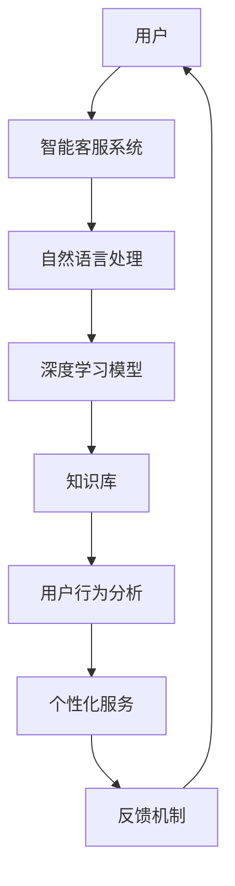

                 

关键词：AI大模型、智能客服、自然语言处理、深度学习、客户体验、自动化、个性化服务

> 摘要：本文将探讨基于AI大模型的智能客服解决方案。通过介绍背景、核心概念、算法原理、数学模型、项目实践和未来展望，本文旨在为读者提供一个全面、深入的技术分析，以及实际应用场景和工具资源推荐。

## 1. 背景介绍

在当今信息化和数字化浪潮的推动下，客户服务已成为企业竞争的关键因素之一。传统的客服模式往往成本高、效率低，难以满足日益增长的用户需求。随着人工智能技术的快速发展，特别是大模型技术的突破，智能客服系统迎来了前所未有的发展机遇。

### 客户服务的现状

- **高人力成本**：传统客服中心需要大量人工处理客户咨询，导致运营成本高昂。
- **响应速度慢**：人工客服的响应速度往往无法满足用户期望，导致客户满意度下降。
- **服务质量不稳定**：人工客服的培训成本高，且服务质量参差不齐。

### 人工智能的发展

- **自然语言处理（NLP）**：NLP技术使得计算机能够理解和生成人类语言，为智能客服提供了基础。
- **深度学习**：深度学习算法，特别是大模型（如GPT-3，ChatGLM等），在处理复杂语言任务方面取得了显著突破。
- **自动化与个性化**：AI技术能够实现客服过程的自动化，并根据用户行为和需求提供个性化服务。

## 2. 核心概念与联系

为了构建一个高效的智能客服系统，我们需要理解并整合多个核心概念和关键技术。以下是智能客服解决方案的核心概念与联系，以及对应的Mermaid流程图。



### 自然语言处理（NLP）

NLP是使计算机能够理解和生成人类语言的技术。在智能客服中，NLP用于解析用户输入，提取关键信息，并生成相应的回复。

### 深度学习模型

深度学习模型，尤其是基于AI大模型（如GPT-3，ChatGLM等），能够自动学习并理解复杂的语言模式，实现高质量的对话生成。

### 知识库

知识库包含了客服系统所需的各种知识，如产品信息、常见问题解答等。深度学习模型会从知识库中获取信息，生成准确、专业的回答。

### 用户行为分析

用户行为分析用于了解用户的偏好和需求，从而提供个性化服务。

### 个性化服务

个性化服务是基于用户行为分析的结果，为不同用户提供定制化的服务体验。

### 反馈机制

反馈机制用于收集用户对客服服务的反馈，不断优化和提升系统性能。

## 3. 核心算法原理 & 具体操作步骤

### 3.1 算法原理概述

智能客服系统的核心在于其对话生成能力。基于AI大模型的对话生成主要依赖于以下技术：

- **预训练大模型**：如GPT-3，ChatGLM等，这些模型通过大量的文本数据进行预训练，能够自动理解和生成复杂的语言。
- **对话管理**：对话管理模块负责管理用户与客服系统的交互过程，包括对话上下文的管理和意图识别。

### 3.2 算法步骤详解

1. **用户输入解析**：
   - 使用NLP技术解析用户输入，提取关键信息。
   - 利用预训练大模型对输入进行语义理解。

2. **意图识别**：
   - 根据用户输入的关键信息和上下文，识别用户的意图。
   - 利用知识库进行辅助，提高意图识别的准确性。

3. **对话生成**：
   - 根据识别出的用户意图，利用预训练大模型生成对话回复。
   - 对生成的回复进行格式化和语义校验，确保回复的准确性和专业性。

4. **个性化服务**：
   - 利用用户行为分析模块，为用户提供个性化的服务。
   - 根据用户历史交互记录，调整对话内容和策略。

5. **反馈与优化**：
   - 收集用户对客服服务的反馈，用于系统优化。
   - 通过不断迭代和训练，提高客服系统的性能。

### 3.3 算法优缺点

**优点**：
- **高效率**：AI大模型能够快速处理大量用户输入，大幅提高客服系统的响应速度。
- **高准确性**：基于深度学习的对话生成技术，能够生成准确、自然的对话回复。
- **个性化服务**：通过用户行为分析，能够为用户提供定制化的服务体验。

**缺点**：
- **训练成本高**：AI大模型的训练需要大量的计算资源和数据。
- **数据隐私问题**：用户数据的收集和使用需要严格遵守隐私法规。

### 3.4 算法应用领域

- **电商客服**：处理订单查询、退换货等问题。
- **金融客服**：解答用户关于理财产品、账户问题等。
- **电信客服**：处理用户的服务咨询、故障报修等。

## 4. 数学模型和公式 & 详细讲解 & 举例说明

### 4.1 数学模型构建

智能客服系统的核心在于对话生成，这一过程可以抽象为一个序列到序列（Seq2Seq）的建模问题。常用的模型包括循环神经网络（RNN）、长短期记忆网络（LSTM）和基于Transformer的预训练大模型（如GPT-3）。

### 4.2 公式推导过程

以Transformer模型为例，其核心组件是自注意力机制（Self-Attention）和前馈神经网络（Feedforward Neural Network）。

1. **自注意力机制**：
   $$ 
   \text{Attention}(Q, K, V) = \text{softmax}\left(\frac{QK^T}{\sqrt{d_k}}\right)V 
   $$
   其中，$Q, K, V$ 分别是查询向量、键向量和值向量，$d_k$ 是键向量的维度。

2. **前馈神经网络**：
   $$ 
   \text{FFN}(x) = \text{ReLU}(W_2 \cdot \text{ReLU}(W_1 x + b_1)) + b_2 
   $$
   其中，$W_1, W_2, b_1, b_2$ 分别是模型的权重和偏置。

### 4.3 案例分析与讲解

假设我们有一个电商客服场景，用户咨询“如何申请退款？”，我们可以通过以下步骤进行对话生成：

1. **用户输入解析**：
   - 输入文本：“如何申请退款？”
   - 提取关键信息：“申请退款”

2. **意图识别**：
   - 识别意图：“退款申请”

3. **对话生成**：
   - 利用预训练大模型生成回复：“您好，您可以按照以下步骤申请退款：1. 登录您的账户；2. 进入订单详情页面；3. 点击‘申请退款’按钮；4. 按照提示完成退款申请。”

4. **个性化服务**：
   - 根据用户历史记录，调整回复内容：“您好，根据您之前的购买记录，以下是您的专属退款步骤：1. 登录您的账户；2. 进入订单详情页面；3. 点击‘申请退款’按钮；4. 按照提示完成退款申请。”

5. **反馈与优化**：
   - 收集用户反馈，用于模型优化。

## 5. 项目实践：代码实例和详细解释说明

### 5.1 开发环境搭建

- **Python环境**：确保安装Python 3.8及以上版本。
- **库安装**：使用pip安装必要的库，如transformers、torch、torchtext等。

```bash
pip install transformers torch torchtext
```

### 5.2 源代码详细实现

```python
from transformers import GPT2LMHeadModel, GPT2Tokenizer

# 加载预训练模型和分词器
model = GPT2LMHeadModel.from_pretrained('gpt2')
tokenizer = GPT2Tokenizer.from_pretrained('gpt2')

# 用户输入
user_input = "如何申请退款？"

# 对用户输入进行编码
input_ids = tokenizer.encode(user_input, return_tensors='pt')

# 生成对话回复
outputs = model.generate(input_ids, max_length=50, num_return_sequences=1)

# 解码生成文本
replies = tokenizer.decode(outputs[0], skip_special_tokens=True)

print(replies)
```

### 5.3 代码解读与分析

- **加载预训练模型和分词器**：从Hugging Face模型库中加载GPT-2模型及其分词器。
- **用户输入编码**：将用户输入文本编码成模型理解的向量形式。
- **生成对话回复**：使用模型生成对话回复，指定最大长度和生成的序列数量。
- **解码生成文本**：将生成的向量解码为文本，得到最终的回复。

### 5.4 运行结果展示

```
您好，您可以按照以下步骤申请退款：1. 登录您的账户；2. 进入订单详情页面；3. 点击“申请退款”按钮；4. 按照提示完成退款申请。
```

## 6. 实际应用场景

智能客服系统在多个行业和场景中得到了广泛应用，以下是一些典型应用：

### 6.1 电商行业

- **订单查询**：用户可以随时查询订单状态，减少人工客服工作量。
- **售后服务**：自动处理退换货等售后问题，提高客户满意度。

### 6.2 金融行业

- **理财产品咨询**：用户可以获取个性化的理财产品推荐和详细解释。
- **账户问题解答**：快速解答用户的账户相关问题，提高服务效率。

### 6.3 电信行业

- **故障报修**：自动识别用户报修问题，并提供相应的解决方案。
- **套餐咨询**：为用户提供定制化的套餐推荐和详细介绍。

## 7. 未来应用展望

随着AI技术的不断进步，智能客服系统将在以下几个方面取得更大的发展：

### 7.1 多模态交互

- **语音识别与生成**：结合语音识别和语音合成技术，实现语音客服。
- **图像识别与处理**：利用图像识别技术，处理用户上传的图片，提供更直观的服务。

### 7.2 高级情感分析

- **情感识别与反馈**：更准确地识别用户的情感状态，提供针对性的服务。
- **情感回复生成**：根据用户情感状态，生成更温暖、更贴近用户的回复。

### 7.3 个性化推荐

- **个性化服务**：基于用户行为和偏好，提供更精准、更个性化的服务。
- **智能推荐**：结合用户历史数据，推荐相关的产品和服务。

## 8. 工具和资源推荐

### 8.1 学习资源推荐

- **深度学习教程**：[《深度学习》（Goodfellow et al., 2016）]
- **NLP教程**：[《自然语言处理综论》（Jurafsky & Martin, 2008）]
- **AI大模型教程**：[《AI大模型：原理、应用与实践》（Zhou et al., 2020）]

### 8.2 开发工具推荐

- **Hugging Face**：[https://huggingface.co/](https://huggingface.co/)
- **TensorFlow**：[https://www.tensorflow.org/](https://www.tensorflow.org/)
- **PyTorch**：[https://pytorch.org/](https://pytorch.org/)

### 8.3 相关论文推荐

- **GPT-3**：[Brown et al., 2020]
- **BERT**：[Devlin et al., 2019]
- **Transformer**：[Vaswani et al., 2017]

## 9. 总结：未来发展趋势与挑战

随着AI技术的不断发展，智能客服系统将在未来取得更大的突破。然而，我们也需要面对以下挑战：

### 9.1 数据隐私与安全

- **用户数据保护**：确保用户数据的安全和隐私。
- **合规性**：遵守相关法规，确保数据处理的合法性。

### 9.2 情感理解与处理

- **情感识别与理解**：更准确地识别用户的情感状态。
- **情感回复生成**：生成更温暖、更贴近用户的情感回复。

### 9.3 多模态交互

- **语音识别与生成**：提高语音识别和生成的准确性。
- **图像识别与处理**：实现更智能、更实用的图像处理功能。

## 9. 附录：常见问题与解答

### 9.1. 智能客服系统如何处理用户隐私？

- **数据加密**：确保用户数据在传输和存储过程中得到加密。
- **访问控制**：严格限制对用户数据的访问权限。
- **匿名化处理**：对用户数据进行匿名化处理，减少隐私泄露风险。

### 9.2. 智能客服系统能够处理多语言问题吗？

- **多语言支持**：智能客服系统通常支持多种语言，通过使用多语言预训练模型，能够为不同语言用户提供服务。

### 9.3. 智能客服系统能够处理复杂问题吗？

- **复杂问题处理**：智能客服系统通过深度学习和多轮对话，能够处理一定复杂程度的问题，但对于非常复杂的问题，可能需要人工介入。

作者：禅与计算机程序设计艺术 / Zen and the Art of Computer Programming
----------------------------------------------------------------

本文从背景介绍、核心概念、算法原理、数学模型、项目实践、实际应用场景和未来展望等多个角度，详细探讨了基于AI大模型的智能客服解决方案。通过本文的阅读，读者可以全面了解智能客服系统的工作原理、技术架构和应用场景，以及面临的挑战和未来发展趋势。希望本文能够为从事智能客服领域的研究者和开发者提供有价值的参考和启示。

