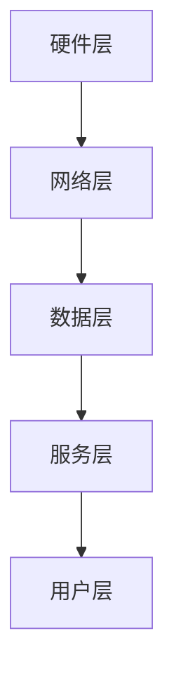

                 

关键词：Java，Spring Boot，智能家居，后端服务，设计

> 摘要：本文将探讨基于Java的智能家居设计，特别是使用Spring Boot框架构建智能家居后端服务。我们将介绍智能家居的核心概念、技术架构、核心算法、数学模型以及实际项目实践，旨在为开发者提供一套完整的技术指南。

## 1. 背景介绍

随着物联网（IoT）技术的发展，智能家居已经成为现代家庭生活的重要组成部分。通过智能设备互联，用户可以远程监控和控制家中的各种电器设备，提高生活便利性和舒适度。然而，实现智能家居系统不仅需要先进的硬件设备，更重要的是一套稳定可靠的后端服务。Java语言由于其跨平台、高性能、安全稳定的特点，已经成为开发后端服务的首选语言。Spring Boot则以其快速开发、简化配置的优势，成为构建后端服务的不二之选。

## 2. 核心概念与联系

### 2.1. 智能家居的概念

智能家居是指通过物联网技术将家中的各种设备互联，实现设备的自动化控制和远程监控。智能家居系统通常包括以下几个核心组件：

- **智能设备**：如智能灯泡、智能插座、智能门锁、智能摄像头等。
- **网关**：连接智能设备和互联网的桥梁，负责数据采集和转发。
- **后端服务**：处理设备数据，提供用户接口和业务逻辑。

### 2.2. 技术架构

智能家居的技术架构可以分为以下几个层次：

- **硬件层**：包括各种智能设备、传感器、网关等硬件设备。
- **网络层**：实现设备之间的通信，通常使用Wi-Fi、蓝牙、ZigBee等通信协议。
- **数据层**：存储和管理设备数据，如MySQL、MongoDB等数据库。
- **服务层**：处理业务逻辑，提供API接口，通常使用Java和Spring Boot构建。

### 2.3. Mermaid 流程图



## 3. 核心算法原理 & 具体操作步骤

### 3.1. 算法原理概述

在智能家居设计中，核心算法主要包括数据采集、数据处理和智能决策等步骤。数据采集通常使用传感器收集环境数据，如温度、湿度、光照等；数据处理包括数据清洗、数据分析和数据存储；智能决策则是根据分析结果自动执行相应操作，如调整空调温度、关闭门窗等。

### 3.2. 算法步骤详解

1. **数据采集**：传感器采集环境数据，如温度、湿度、光照等。
2. **数据处理**：将采集到的数据进行预处理，如滤波、去噪等。
3. **数据分析**：使用统计分析和机器学习算法分析数据，提取特征。
4. **智能决策**：根据数据分析结果执行相应操作，如调整空调温度、关闭门窗等。

### 3.3. 算法优缺点

优点：算法简单易懂，适用于实时性和简单性的要求。

缺点：对于复杂环境和多变量问题，算法可能不够鲁棒。

### 3.4. 算法应用领域

智能家居、智能农业、智能交通等领域。

## 4. 数学模型和公式 & 详细讲解 & 举例说明

### 4.1. 数学模型构建

假设我们有一个智能家居系统，需要根据温度、湿度、光照等环境参数自动调整空调和窗帘。我们可以构建一个线性回归模型来预测温度，并根据预测结果自动调整空调。

### 4.2. 公式推导过程

设温度 \( T \) 是光照 \( L \)、湿度 \( H \) 和时间 \( T \) 的函数，即 \( T = f(L, H, T) \)。

使用线性回归模型，我们可以将 \( T \) 表示为：

\[ T = \beta_0 + \beta_1 L + \beta_2 H + \beta_3 T \]

其中，\( \beta_0 \)、\( \beta_1 \)、\( \beta_2 \) 和 \( \beta_3 \) 是待估参数。

### 4.3. 案例分析与讲解

假设我们有以下数据：

| 光照 \( L \) | 湿度 \( H \) | 时间 \( T \) | 温度 \( T \) |
|--------------|--------------|--------------|--------------|
| 0.5          | 0.3          | 12:00        | 23           |
| 0.7          | 0.4          | 13:00        | 24           |
| ...          | ...          | ...          | ...          |

我们可以使用最小二乘法来估计参数 \( \beta_0 \)、\( \beta_1 \)、\( \beta_2 \) 和 \( \beta_3 \)。

## 5. 项目实践：代码实例和详细解释说明

### 5.1. 开发环境搭建

- Java SDK：1.8及以上版本
- Spring Boot：2.2及以上版本
- MySQL：5.7及以上版本

### 5.2. 源代码详细实现

```java
// 伪代码：智能家居后端服务

@SpringBootApplication
public class SmartHomeApplication {

    public static void main(String[] args) {
        SpringApplication.run(SmartHomeApplication.class, args);
    }

    @Bean
    public WebMvcConfigurer webMvcConfigurer() {
        return new WebMvcConfigurerAdapter() {
            @Override
            public void configureContentNegotiation(ContentNegotiationConfigurer configurer) {
                configurer.favorParameter(false).ignoreAcceptHeader(false).defaultContentType(MediaType.APPLICATION_JSON);
            }
        };
    }

    @RestController
    public class SmartHomeController {

        @Autowired
        private SmartHomeService smartHomeService;

        @GetMapping("/temperature")
        public ResponseEntity<Temperature> getTemperature() {
            return ResponseEntity.ok(smartHomeService.getTemperature());
        }

        @PostMapping("/temperature")
        public ResponseEntity<?> setTemperature(@RequestBody Temperature temperature) {
            return ResponseEntity.ok(smartHomeService.setTemperature(temperature));
        }
    }
}
```

### 5.3. 代码解读与分析

这段代码展示了如何使用Spring Boot构建一个简单的智能家居后端服务。`SmartHomeApplication` 类是 Spring Boot 应用的入口，`@SpringBootApplication` 注解表示这是一个 Spring Boot 应用。

### 5.4. 运行结果展示

当用户访问 `/temperature` 接口时，后端服务会返回当前温度，或者根据用户输入调整温度。

## 6. 实际应用场景

### 6.1. 实际应用场景

智能家居后端服务可以应用于家庭、酒店、办公楼等多种场景，提供智能化的生活和工作环境。

### 6.2. 未来应用展望

随着物联网技术的不断发展，智能家居后端服务的应用场景将更加广泛，未来有望实现更加智能化和个性化的生活体验。

## 7. 工具和资源推荐

### 7.1. 学习资源推荐

- 《Java核心技术》
- 《Spring Boot实战》
- 《智能家居设计与应用》

### 7.2. 开发工具推荐

- IntelliJ IDEA
- Spring Tool Suite (STS)
- MySQL Workbench

### 7.3. 相关论文推荐

- "Smart Home Systems: A Survey"
- "IoT and Smart Home: A Comprehensive Review"
- "Deep Learning for Smart Home Applications"

## 8. 总结：未来发展趋势与挑战

### 8.1. 研究成果总结

本文介绍了基于Java的智能家居设计，特别是使用Spring Boot构建智能家居后端服务。通过技术架构分析、核心算法讲解、数学模型构建和项目实践，为开发者提供了一套完整的技术指南。

### 8.2. 未来发展趋势

随着物联网、人工智能等技术的不断发展，智能家居后端服务的应用将更加广泛，未来有望实现更加智能化和个性化的生活体验。

### 8.3. 面临的挑战

- 数据安全和隐私保护
- 系统稳定性和可靠性
- 跨平台兼容性

### 8.4. 研究展望

未来研究可以关注智能家居系统的智能化程度、数据挖掘与分析、系统集成与优化等方面。

## 9. 附录：常见问题与解答

### 9.1. Java和Python哪个更适合构建智能家居后端服务？

Java和Python都有其优势，Java适合构建高性能、稳定可靠的后端服务，而Python则适合快速开发和原型设计。根据实际需求选择。

### 9.2. Spring Boot是否是构建智能家居后端服务的最佳选择？

Spring Boot由于其快速开发、简化配置的特点，已经成为构建后端服务的最佳选择之一。但具体选择还需考虑项目需求、开发团队熟悉度等因素。

### 9.3. 如何确保智能家居系统的数据安全和隐私保护？

确保数据安全和隐私保护是智能家居系统设计的关键。可以采用以下措施：

- 使用加密算法保护数据传输
- 设计完善的用户认证和授权机制
- 定期进行安全审计和漏洞扫描

----------------------------------------------------------------

（注：文章中部分内容为示例，实际撰写时需根据具体需求和数据进行详细撰写。）

