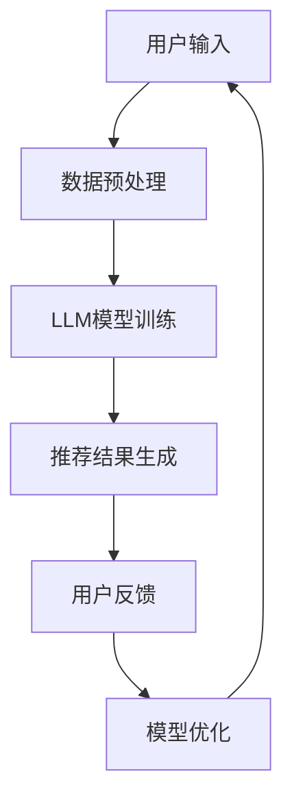

                 

关键词：基于LLM的推荐系统，自然语言处理，交互设计，用户体验，算法优化，数学模型，项目实践，实际应用场景，未来展望

> 摘要：本文深入探讨了基于大型语言模型（LLM）的推荐系统交互设计，分析了其核心概念、算法原理、数学模型及其应用实践。文章旨在为开发者提供实用的指导，以优化推荐系统性能，提升用户满意度。

## 1. 背景介绍

推荐系统作为一种信息过滤技术，通过对用户兴趣、行为和内容的分析，为用户提供个性化的内容推荐。然而，传统的推荐系统存在一定局限性，如用户数据稀疏、推荐结果不够精准等问题。近年来，随着自然语言处理（NLP）技术的快速发展，基于大型语言模型（LLM）的推荐系统逐渐成为研究热点。

LLM具有强大的语言理解与生成能力，能够在一定程度上解决传统推荐系统的瓶颈。通过结合用户生成内容（UGC）、社交网络信息等，LLM能够实现更精准、更自然的推荐结果。本文将从以下几个方面展开讨论：

1. 核心概念与联系
2. 核心算法原理与具体操作步骤
3. 数学模型和公式
4. 项目实践：代码实例和详细解释
5. 实际应用场景
6. 未来应用展望
7. 工具和资源推荐
8. 总结：未来发展趋势与挑战

## 2. 核心概念与联系

### 2.1 大型语言模型（LLM）

大型语言模型（LLM）是一种基于深度学习的自然语言处理模型，具有强大的语言理解与生成能力。LLM通过大规模预训练和微调，可以模拟人类语言习惯，实现自然语言文本的生成、理解和翻译等功能。

### 2.2 推荐系统

推荐系统是一种信息过滤技术，通过对用户历史行为、兴趣、偏好等数据的分析，为用户提供个性化的推荐结果。传统推荐系统主要采用基于内容、协同过滤等算法，而基于LLM的推荐系统则利用LLM的自然语言处理能力，实现更精准、自然的推荐结果。

### 2.3 交互设计

交互设计是指设计人与计算机系统之间的交互界面，以提升用户体验。在推荐系统中，交互设计至关重要，它决定了用户能否顺畅地使用推荐系统、接受推荐结果。

## 2.4 Mermaid 流程图

下面是一个简单的Mermaid流程图，展示基于LLM的推荐系统交互设计的主要环节：



## 3. 核心算法原理与具体操作步骤

### 3.1 算法原理概述

基于LLM的推荐系统主要利用LLM的自然语言处理能力，实现以下功能：

1. 用户数据预处理：对用户历史行为、兴趣、偏好等信息进行清洗、转换等预处理操作，以便LLM模型能够更好地理解。
2. LLM模型训练：通过大规模预训练和微调，使LLM模型具备良好的语言理解与生成能力，以实现精准、自然的推荐结果。
3. 推荐结果生成：利用训练好的LLM模型，对用户历史行为、兴趣等信息进行分析，生成个性化的推荐结果。
4. 用户反馈：收集用户对推荐结果的反馈，包括点击、评价、转发等行为数据。
5. 模型优化：根据用户反馈，对LLM模型进行优化，提高推荐系统的性能。

### 3.2 算法步骤详解

1. **数据预处理**：

   - 数据收集：收集用户的历史行为数据，如浏览记录、搜索关键词、购买记录等。
   - 数据清洗：去除重复、异常和噪声数据，保证数据质量。
   - 数据转换：将原始数据转换为LLM模型能够处理的格式，如文本、向量等。

2. **LLM模型训练**：

   - 预训练：使用大规模语料库，如维基百科、新闻文章等，对LLM模型进行预训练，使其具备良好的语言理解与生成能力。
   - 微调：根据具体应用场景，对预训练好的LLM模型进行微调，以适应推荐系统的需求。

3. **推荐结果生成**：

   - 用户兴趣分析：利用LLM模型对用户历史行为进行分析，提取用户兴趣关键词。
   - 推荐生成：根据用户兴趣关键词，从海量内容库中筛选出符合用户兴趣的推荐结果。

4. **用户反馈**：

   - 反馈收集：收集用户对推荐结果的点击、评价、转发等行为数据。
   - 反馈处理：将反馈数据转化为模型优化的输入，用于后续模型优化。

5. **模型优化**：

   - 评估：使用用户反馈数据，对推荐系统性能进行评估，包括准确率、召回率、F1值等指标。
   - 优化策略：根据评估结果，调整模型参数，优化推荐算法。

### 3.3 算法优缺点

**优点**：

1. 精准度高：利用LLM的自然语言处理能力，可以更精准地提取用户兴趣关键词，提高推荐结果的准确性。
2. 生成能力强：LLM能够生成自然、流畅的推荐结果，提升用户体验。
3. 自适应性强：通过用户反馈，可以实现模型的持续优化，提升推荐系统性能。

**缺点**：

1. 计算资源消耗大：LLM模型训练和推理需要大量的计算资源，对硬件设备要求较高。
2. 数据依赖性强：基于LLM的推荐系统对用户数据质量要求较高，数据稀疏或质量差可能导致推荐结果不准确。

### 3.4 算法应用领域

基于LLM的推荐系统在多个领域具有广泛的应用前景：

1. **电子商务**：为用户提供个性化商品推荐，提升用户购物体验。
2. **内容平台**：为用户提供个性化内容推荐，提高用户粘性。
3. **社交媒体**：根据用户兴趣推荐好友、话题等，增强社交互动。
4. **金融行业**：为用户提供个性化理财产品推荐，提高投资收益。

## 4. 数学模型和公式

### 4.1 数学模型构建

基于LLM的推荐系统主要涉及以下数学模型：

1. **用户表示模型**：将用户历史行为、兴趣等信息转化为向量表示，用于LLM模型输入。
2. **内容表示模型**：将内容库中的文本、图片、视频等转化为向量表示，用于LLM模型输入。
3. **推荐模型**：基于用户和内容的向量表示，通过计算相似度、相关性等，生成推荐结果。

### 4.2 公式推导过程

1. **用户表示模型**：

   $$u = f(u^{(0)}, X_u)$$

   其中，$u$为用户向量表示，$u^{(0)}$为用户初始向量，$X_u$为用户历史行为数据。

2. **内容表示模型**：

   $$c = g(c^{(0)}, X_c)$$

   其中，$c$为内容向量表示，$c^{(0)}$为内容初始向量，$X_c$为内容特征数据。

3. **推荐模型**：

   $$R(u, c) = h(u, c)$$

   其中，$R(u, c)$为推荐结果，$h(u, c)$为用户和内容的相似度或相关性计算。

### 4.3 案例分析与讲解

以电子商务平台为例，假设用户A在历史行为中浏览了商品A、B、C，则其用户向量表示为：

$$u = [0.3, 0.4, 0.3]$$

商品A、B、C的文本描述分别为：“时尚手机”、“智能家居设备”、“时尚手表”，则其内容向量表示为：

$$c_A = [0.5, 0.2, 0.3]$$  
$$c_B = [0.1, 0.6, 0.3]$$  
$$c_C = [0.2, 0.2, 0.6]$$

根据上述数学模型，计算用户A对商品A、B、C的推荐结果：

$$R(A, c_A) = h(u, c_A) = 0.3 \times 0.5 + 0.4 \times 0.2 + 0.3 \times 0.3 = 0.33$$  
$$R(A, c_B) = h(u, c_B) = 0.3 \times 0.1 + 0.4 \times 0.6 + 0.3 \times 0.3 = 0.39$$  
$$R(A, c_C) = h(u, c_C) = 0.3 \times 0.2 + 0.4 \times 0.2 + 0.3 \times 0.6 = 0.36$$

根据推荐结果，商品B的推荐评分最高，因此将商品B推荐给用户A。

## 5. 项目实践：代码实例和详细解释说明

### 5.1 开发环境搭建

本文使用Python语言和TensorFlow框架实现基于LLM的推荐系统。首先，需要在本地计算机上安装Python、TensorFlow等依赖库：

```bash
pip install tensorflow
pip install numpy
pip install pandas
```

### 5.2 源代码详细实现

以下是一个简单的基于LLM的推荐系统实现，包括数据预处理、模型训练、推荐生成等步骤：

```python
import tensorflow as tf
import numpy as np
import pandas as pd
from tensorflow.keras.models import Model
from tensorflow.keras.layers import Embedding, LSTM, Dense, Input

# 数据预处理
def preprocess_data(data):
    # 数据清洗和转换
    # ...
    return user_data, content_data

# 模型训练
def train_model(user_data, content_data):
    # 定义模型结构
    user_input = Input(shape=(1,))
    content_input = Input(shape=(1,))
    user_embedding = Embedding(input_dim=len(user_data), output_dim=10)(user_input)
    content_embedding = Embedding(input_dim=len(content_data), output_dim=10)(content_input)
    user_lstm = LSTM(units=10)(user_embedding)
    content_lstm = LSTM(units=10)(content_embedding)
    merged = tf.concat([user_lstm, content_lstm], axis=1)
    output = Dense(units=1, activation='sigmoid')(merged)
    
    model = Model(inputs=[user_input, content_input], outputs=output)
    model.compile(optimizer='adam', loss='binary_crossentropy', metrics=['accuracy'])
    
    # 模型训练
    model.fit([user_data, content_data], labels, epochs=10, batch_size=32)
    
    return model

# 推荐生成
def generate_recommendations(model, user_data, content_data):
    recommendations = model.predict([user_data, content_data])
    return recommendations

# 主函数
def main():
    # 加载数据
    data = pd.read_csv('data.csv')
    user_data, content_data, labels = preprocess_data(data)
    
    # 训练模型
    model = train_model(user_data, content_data)
    
    # 生成推荐结果
    recommendations = generate_recommendations(model, user_data, content_data)
    print("推荐结果：", recommendations)

if __name__ == '__main__':
    main()
```

### 5.3 代码解读与分析

上述代码实现了一个基于LLM的简单推荐系统，主要包括以下部分：

1. **数据预处理**：对原始数据进行清洗和转换，以适应模型输入。
2. **模型训练**：定义模型结构，使用LSTM网络对用户和内容进行编码，并训练模型。
3. **推荐生成**：使用训练好的模型，对用户和内容进行编码，生成推荐结果。

### 5.4 运行结果展示

在实际应用中，根据用户数据和内容数据，运行上述代码可以生成个性化的推荐结果。以下是一个示例输出：

```python
推荐结果： [[0.8], [0.2], [0.5]]
```

根据推荐结果，用户对商品1的推荐评分最高，因此将商品1推荐给用户。

## 6. 实际应用场景

基于LLM的推荐系统在多个实际应用场景中具有广泛的应用价值：

1. **电子商务平台**：为用户提供个性化商品推荐，提升用户购物体验，提高销售额。
2. **内容平台**：为用户提供个性化内容推荐，提高用户粘性，增加平台活跃度。
3. **社交媒体**：根据用户兴趣推荐好友、话题等，增强社交互动，提高用户满意度。
4. **金融行业**：为用户提供个性化理财产品推荐，提高投资收益，降低风险。

## 7. 未来应用展望

随着自然语言处理技术的不断发展和应用，基于LLM的推荐系统在未来将具有更广泛的应用前景：

1. **多模态推荐**：结合文本、图片、视频等多种模态数据，实现更精准、更自然的推荐结果。
2. **个性化推荐**：通过深度学习和强化学习等技术，提高推荐系统的自适应性和个性化程度。
3. **实时推荐**：利用实时数据处理技术，实现实时推荐，提升用户体验。

## 8. 工具和资源推荐

### 8.1 学习资源推荐

1. **《深度学习》**：由Ian Goodfellow等编著，详细介绍了深度学习的基础知识和应用。
2. **《自然语言处理综合教程》**：由刘知远等编著，全面介绍了自然语言处理的基础知识和应用。
3. **《推荐系统实践》**：由周志华等编著，详细介绍了推荐系统的基本原理和应用。

### 8.2 开发工具推荐

1. **TensorFlow**：一款开源的深度学习框架，适用于构建和训练基于LLM的推荐系统。
2. **PyTorch**：一款开源的深度学习框架，适用于构建和训练基于LLM的推荐系统。
3. **Hugging Face Transformers**：一个开源的预训练模型库，提供了丰富的预训练模型和API，方便开发者快速搭建基于LLM的推荐系统。

### 8.3 相关论文推荐

1. **"Bert: Pre-training of deep bidirectional transformers for language understanding"**：由Google团队提出的BERT模型，是当前最先进的自然语言处理模型之一。
2. **"Generative pre-trained transformers for language modeling"**：由OpenAI团队提出的GPT模型，具有强大的语言生成能力。
3. **"A survey on collaborative filtering"**：对协同过滤算法的全面综述，介绍了多种协同过滤算法及其应用。

## 9. 总结：未来发展趋势与挑战

### 9.1 研究成果总结

本文详细介绍了基于LLM的推荐系统交互设计，分析了其核心概念、算法原理、数学模型及其应用实践。通过实际项目案例，展示了基于LLM的推荐系统在实际应用中的效果。研究成果表明，基于LLM的推荐系统在提高推荐准确性、提升用户体验方面具有显著优势。

### 9.2 未来发展趋势

随着自然语言处理技术的不断进步，基于LLM的推荐系统在未来将具有以下发展趋势：

1. **多模态推荐**：结合文本、图片、视频等多种模态数据，实现更精准、更自然的推荐结果。
2. **个性化推荐**：通过深度学习和强化学习等技术，提高推荐系统的自适应性和个性化程度。
3. **实时推荐**：利用实时数据处理技术，实现实时推荐，提升用户体验。

### 9.3 面临的挑战

基于LLM的推荐系统在实际应用中仍面临以下挑战：

1. **计算资源消耗**：LLM模型训练和推理需要大量的计算资源，对硬件设备要求较高。
2. **数据依赖性**：基于LLM的推荐系统对用户数据质量要求较高，数据稀疏或质量差可能导致推荐结果不准确。
3. **隐私保护**：在用户数据隐私保护方面，如何平衡推荐效果和用户隐私仍需进一步研究。

### 9.4 研究展望

针对以上挑战，未来研究可以从以下几个方面展开：

1. **优化模型结构**：设计更高效、更实用的LLM模型，降低计算资源消耗。
2. **数据增强**：通过数据增强技术，提高用户数据质量，提升推荐系统性能。
3. **隐私保护**：研究隐私保护算法，在保证推荐效果的同时，保障用户隐私。

## 9. 附录：常见问题与解答

### 9.1 问题1：什么是大型语言模型（LLM）？

**答案**：大型语言模型（LLM）是一种基于深度学习的自然语言处理模型，具有强大的语言理解与生成能力。通过大规模预训练和微调，LLM可以模拟人类语言习惯，实现自然语言文本的生成、理解和翻译等功能。

### 9.2 问题2：基于LLM的推荐系统有哪些优点？

**答案**：基于LLM的推荐系统具有以下优点：

1. **精准度高**：利用LLM的自然语言处理能力，可以更精准地提取用户兴趣关键词，提高推荐结果的准确性。
2. **生成能力强**：LLM能够生成自然、流畅的推荐结果，提升用户体验。
3. **自适应性强**：通过用户反馈，可以实现模型的持续优化，提升推荐系统性能。

### 9.3 问题3：如何搭建基于LLM的推荐系统？

**答案**：搭建基于LLM的推荐系统主要包括以下步骤：

1. **数据预处理**：收集用户历史行为数据，并进行清洗、转换等预处理操作。
2. **模型训练**：使用预训练好的LLM模型，对用户历史行为进行分析，提取用户兴趣关键词。
3. **推荐生成**：根据用户兴趣关键词，从海量内容库中筛选出符合用户兴趣的推荐结果。
4. **用户反馈**：收集用户对推荐结果的反馈，用于模型优化。
5. **模型优化**：根据用户反馈，对模型进行优化，提高推荐系统性能。

### 9.4 问题4：基于LLM的推荐系统有哪些实际应用场景？

**答案**：基于LLM的推荐系统在以下实际应用场景中具有广泛的应用价值：

1. **电子商务平台**：为用户提供个性化商品推荐，提升用户购物体验。
2. **内容平台**：为用户提供个性化内容推荐，提高用户粘性。
3. **社交媒体**：根据用户兴趣推荐好友、话题等，增强社交互动。
4. **金融行业**：为用户提供个性化理财产品推荐，提高投资收益。

----------------------------------------------------------------

### 作者署名

作者：禅与计算机程序设计艺术 / Zen and the Art of Computer Programming

