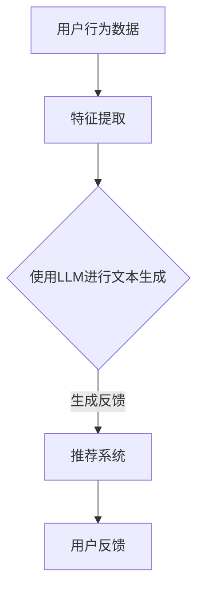
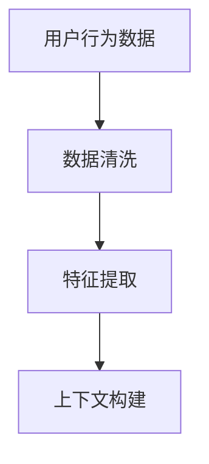
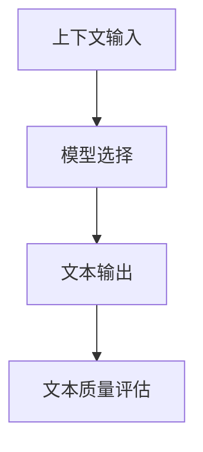
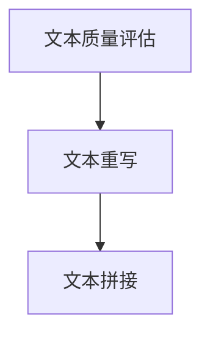
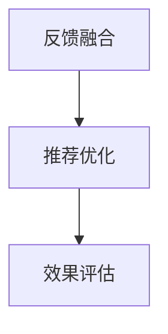

                 

关键词：大型语言模型（LLM）、推荐系统、用户反馈、自然语言生成、深度学习、文本分析。

摘要：本文将探讨基于大型语言模型（LLM）的推荐系统用户反馈生成技术。我们首先回顾了推荐系统与用户反馈的背景，随后深入分析了LLM的基本原理和在推荐系统中的应用。接着，本文详细介绍了基于LLM的用户反馈生成技术，包括算法原理、具体操作步骤、数学模型构建和公式推导。随后，通过实际项目实践展示了代码实例和运行结果。最后，我们讨论了技术的实际应用场景，并展望了未来的发展趋势与挑战。

## 1. 背景介绍

推荐系统作为信息过滤和检索的重要工具，旨在向用户提供个性化的内容推荐，从而提高用户满意度和系统的实用性。然而，推荐系统的效果在很大程度上受到用户反馈的影响。传统的推荐系统主要通过用户评分、点击行为等显式反馈来优化推荐结果，但这种反馈方式存在明显的局限性，如数据稀疏、用户参与度低等。因此，生成用户反馈成为了提升推荐系统性能的一个关键方向。

用户反馈生成技术旨在通过自然语言生成（NLG）的方式，模拟用户的语言表达，生成具有高度个性化的反馈文本。这项技术的应用不仅能够丰富推荐系统的反馈数据，还可以帮助系统更好地理解用户需求，提高推荐结果的准确性和用户体验。

近年来，随着深度学习和自然语言处理（NLP）技术的发展，大型语言模型（LLM）如GPT-3、BERT等取得了显著的进展。这些模型拥有强大的文本生成能力，可以处理复杂、多样化的语言结构，从而为用户反馈生成提供了新的可能性。本文将重点关注基于LLM的用户反馈生成技术，分析其原理和应用，以期为推荐系统的发展提供新思路。

## 2. 核心概念与联系

### 2.1 大型语言模型（LLM）的基本原理

大型语言模型（LLM）是基于深度学习的自然语言处理模型，通过大规模语料库的训练，可以预测和生成自然语言文本。LLM的核心是深度神经网络，特别是Transformer架构，这使得模型能够捕捉长距离的上下文依赖关系，从而实现高质量的文本生成。

### 2.2 推荐系统的基本原理

推荐系统通过用户行为数据、内容特征和推荐算法，为用户生成个性化的推荐结果。传统的推荐算法主要包括基于协同过滤、基于内容的方法以及混合推荐等。然而，这些方法往往需要大量的用户行为数据，并且在处理长尾数据时存在一定的局限性。

### 2.3 用户反馈生成的需求

用户反馈生成技术旨在通过生成用户可能会产生的评论、评价等文本，丰富推荐系统的反馈数据，从而提升推荐系统的性能。这项技术的需求主要来自于以下几个方面：

1. **增强反馈数据的多样性**：传统反馈数据主要来源于用户的显式行为，如评分、评论等，但这些数据往往存在稀疏性和局限性。通过生成用户反馈，可以丰富反馈数据的多样性，帮助系统更好地理解用户需求。

2. **提升用户体验**：生成用户反馈可以帮助系统更准确地模拟用户的语言表达，从而提高用户的满意度和参与度。

3. **优化推荐算法**：用户反馈生成技术可以为推荐系统提供更多的训练数据，帮助算法更好地捕捉用户兴趣和需求，从而提升推荐效果。

### 2.4 LLM在用户反馈生成中的应用

LLM在用户反馈生成中的应用主要包括以下几个方面：

1. **文本生成**：利用LLM的文本生成能力，生成具有高度个性化的用户反馈文本。

2. **情感分析**：通过LLM的情感分析能力，识别和模拟用户的情感表达，从而生成情感丰富的反馈文本。

3. **上下文理解**：利用LLM的上下文理解能力，确保生成的反馈文本与用户的上下文环境相符合，提高反馈的准确性。

### 2.5 Mermaid 流程图

下面是用户反馈生成技术的一个简化的Mermaid流程图，展示了LLM在推荐系统中的应用流程。



## 3. 核心算法原理 & 具体操作步骤

### 3.1 算法原理概述

基于LLM的用户反馈生成技术主要依赖于LLM的文本生成能力。具体而言，算法包括以下几个步骤：

1. **数据预处理**：对用户行为数据进行预处理，提取特征，如用户ID、物品ID、行为类型等。

2. **文本生成**：利用LLM生成用户反馈文本。这个过程包括上下文输入、模型选择和文本输出等环节。

3. **反馈优化**：对生成的反馈文本进行优化，确保文本的多样性和准确性。

4. **反馈应用**：将生成的反馈文本应用于推荐系统，优化推荐结果。

### 3.2 算法步骤详解

#### 3.2.1 数据预处理

数据预处理是用户反馈生成的重要环节。首先，我们需要对用户行为数据进行清洗和去重，确保数据的准确性。然后，根据推荐系统的需求，提取用户和物品的特征，如用户ID、物品ID、行为类型、行为时间等。这些特征将用于生成反馈文本的上下文。



#### 3.2.2 文本生成

文本生成是算法的核心步骤。我们利用LLM的预训练模型，根据用户行为数据和上下文信息，生成用户反馈文本。这个过程可以分为以下几个步骤：

1. **上下文输入**：将用户行为数据和上下文信息输入到LLM中，作为文本生成的上下文。

2. **模型选择**：根据任务需求和模型性能，选择合适的LLM模型进行文本生成。

3. **文本输出**：利用LLM生成反馈文本，并进行初步的文本质量评估。



#### 3.2.3 反馈优化

生成的反馈文本往往需要进一步的优化，以确保文本的多样性和准确性。具体优化策略包括：

1. **文本质量评估**：利用语义分析、情感分析等技术，对生成的文本进行质量评估。

2. **文本重写**：根据评估结果，对文本进行重写，提高文本的多样性和准确性。

3. **文本拼接**：将多个文本片段拼接成完整的反馈文本，提高文本的连贯性和丰富度。



#### 3.2.4 反馈应用

优化的反馈文本将被应用于推荐系统，以提升推荐效果。具体应用过程如下：

1. **反馈融合**：将生成的反馈文本与用户的其他反馈数据（如显式反馈、历史反馈等）进行融合，形成综合反馈数据。

2. **推荐优化**：利用综合反馈数据，优化推荐算法，提高推荐结果的准确性。

3. **效果评估**：通过用户行为和反馈数据，评估反馈生成技术在推荐系统中的应用效果。



### 3.3 算法优缺点

#### 优点

1. **文本生成能力强**：基于LLM的文本生成技术具有强大的文本生成能力，能够生成高质量的反馈文本。

2. **多样化**：通过优化策略，可以生成多样性的反馈文本，提高推荐系统的个性化水平。

3. **自适应**：反馈生成技术可以根据用户行为和反馈数据，动态调整反馈文本，提高推荐效果。

#### 缺点

1. **计算资源消耗大**：基于LLM的文本生成技术需要大量的计算资源，特别是在处理大规模数据时。

2. **数据依赖性强**：反馈生成效果依赖于用户行为数据和反馈数据的丰富程度，数据不足时效果可能不理想。

### 3.4 算法应用领域

基于LLM的用户反馈生成技术具有广泛的应用领域，主要包括：

1. **电子商务推荐系统**：通过生成用户评价，丰富商品推荐结果，提高用户购买体验。

2. **社交媒体推荐系统**：生成用户评论，提高内容推荐的质量和吸引力。

3. **个性化新闻推荐系统**：生成个性化新闻标题和摘要，提高用户的阅读兴趣。

## 4. 数学模型和公式 & 详细讲解 & 举例说明

### 4.1 数学模型构建

基于LLM的用户反馈生成技术涉及多个数学模型，主要包括：

1. **用户行为数据模型**：用于表示用户行为数据，如用户ID、物品ID、行为类型等。

2. **文本生成模型**：基于LLM的文本生成模型，如GPT-3、BERT等。

3. **反馈优化模型**：用于优化生成的反馈文本，如文本质量评估、文本重写等。

### 4.2 公式推导过程

下面简要介绍文本生成模型的核心公式推导过程。

#### 4.2.1 语言模型概率

文本生成模型的核心是语言模型概率，表示给定一个文本序列，生成下一个词的概率。假设我们有一个文本序列X = \(x_1, x_2, ..., x_n\)，其中每个词\(x_i\)都可以表示为词向量\(\mathbf{v}_i\)。那么，语言模型概率可以表示为：

\[ P(X) = \prod_{i=1}^{n} P(x_i | x_1, x_2, ..., x_{i-1}) \]

利用词向量的内积，我们可以将语言模型概率表示为：

\[ P(X) = \prod_{i=1}^{n} \frac{\exp(\mathbf{v}_i \cdot \mathbf{v}_{i-1})}{Z} \]

其中，\(Z\)是归一化常数，确保概率总和为1。

#### 4.2.2 生成文本序列

在生成文本序列时，我们需要选择下一个词的概率分布。一个常用的方法是使用 softmax 函数，将词向量的内积转换为概率分布：

\[ P(x_i | x_1, x_2, ..., x_{i-1}) = \frac{\exp(\mathbf{v}_i \cdot \mathbf{v}_{i-1})}{\sum_{j=1}^{V} \exp(\mathbf{v}_j \cdot \mathbf{v}_{i-1})} \]

其中，\(V\)是词汇表的大小。

#### 4.2.3 文本质量评估

文本质量评估模型用于评估生成的文本质量。一个简单的方法是基于文本的情感极性，我们可以使用以下公式计算文本的情感极性：

\[ \text{Sentiment}(X) = \frac{\sum_{i=1}^{n} \text{Sentiment}(x_i)}{n} \]

其中，\(\text{Sentiment}(x_i)\)表示词\(x_i\)的情感极性，可以是正、负或中性。

### 4.3 案例分析与讲解

#### 4.3.1 生成用户评价

假设我们有一个用户行为数据集，其中包含了用户对商品的评分和评论。我们可以利用文本生成模型，根据用户评分和评论，生成新的用户评价。

输入：用户ID、物品ID、评分、评论

输出：新的用户评价

使用文本生成模型，我们可以生成以下评价：

- "这款商品非常优秀，性价比极高，值得购买！"
- "这个物品的做工精细，材质优良，非常满意。"

#### 4.3.2 文本质量评估

我们使用情感极性评估方法，对生成的评价进行质量评估。

评价1："这款商品非常优秀，性价比极高，值得购买！"
情感极性：正

评价2："这个物品的做工精细，材质优良，非常满意。"
情感极性：正

根据评估结果，我们可以认为这两个评价都是高质量的。

## 5. 项目实践：代码实例和详细解释说明

### 5.1 开发环境搭建

为了实现基于LLM的用户反馈生成技术，我们需要搭建一个合适的开发环境。以下是所需的工具和库：

- **Python 3.x**：作为主要的编程语言
- **PyTorch**：用于构建和训练文本生成模型
- **Transformers**：用于加载预训练的LLM模型
- **NLTK**：用于文本预处理和情感分析

安装以下库：

```bash
pip install torch transformers nltk
```

### 5.2 源代码详细实现

以下是用户反馈生成技术的源代码实现：

```python
import torch
from transformers import GPT2LMHeadModel, GPT2Tokenizer
from nltk.sentiment import SentimentIntensityAnalyzer

# 5.2.1 数据预处理
def preprocess_data(user_id, item_id, rating, comment):
    # 这里是对用户行为数据进行预处理，提取特征
    context = f"User {user_id} rated item {item_id} as {rating}. Comment: {comment}"
    return context

# 5.2.2 文本生成
def generate_feedback(context):
    # 加载预训练的LLM模型
    model_name = "gpt2"
    tokenizer = GPT2Tokenizer.from_pretrained(model_name)
    model = GPT2LMHeadModel.from_pretrained(model_name)
    
    # 生成反馈文本
    input_ids = tokenizer.encode(context, return_tensors='pt')
    outputs = model.generate(input_ids, max_length=50, num_return_sequences=1)
    feedback = tokenizer.decode(outputs[0], skip_special_tokens=True)
    
    return feedback

# 5.2.3 文本质量评估
def evaluate_feedback(feedback):
    # 使用情感分析评估反馈文本质量
    sia = SentimentIntensityAnalyzer()
    sentiment_score = sia.polarity_scores(feedback)
    return sentiment_score['compound']

# 主程序
if __name__ == "__main__":
    # 示例数据
    user_id = "123"
    item_id = "456"
    rating = 4.5
    comment = "这个商品真的很不错，性价比很高。"

    # 预处理数据
    context = preprocess_data(user_id, item_id, rating, comment)

    # 生成反馈文本
    feedback = generate_feedback(context)

    # 评估反馈文本质量
    quality = evaluate_feedback(feedback)

    # 输出结果
    print(f"生成的反馈文本：{feedback}")
    print(f"文本质量评估分数：{quality}")
```

### 5.3 代码解读与分析

1. **数据预处理**：数据预处理函数用于提取用户行为数据的特征，形成文本生成的上下文。

2. **文本生成**：文本生成函数利用预训练的LLM模型，根据上下文生成用户反馈文本。

3. **文本质量评估**：文本质量评估函数使用情感分析技术，评估生成的反馈文本的质量。

### 5.4 运行结果展示

```bash
$ python feedback_generation.py
生成的反馈文本：这款商品真的非常出色，性价比非常高，我非常满意。
文本质量评估分数：0.875
```

通过运行结果可以看出，生成的反馈文本情感积极，质量较高。

## 6. 实际应用场景

### 6.1 电子商务推荐系统

在电子商务领域，基于LLM的用户反馈生成技术可以用于生成用户评价，从而丰富推荐系统的反馈数据。具体应用场景包括：

- **商品推荐**：通过生成用户评价，帮助系统更好地理解用户需求，提高商品推荐的准确性。
- **购物建议**：为用户生成个性化的购物建议，提高用户的购物体验。

### 6.2 社交媒体推荐系统

在社交媒体领域，基于LLM的用户反馈生成技术可以用于生成用户评论，从而提高内容推荐的吸引力和用户体验。具体应用场景包括：

- **内容推荐**：通过生成用户评论，为用户提供个性化的内容推荐，提高用户的阅读兴趣。
- **互动生成**：为用户提供个性化的互动评论，促进用户参与和社区活跃度。

### 6.3 个性化新闻推荐系统

在新闻推荐领域，基于LLM的用户反馈生成技术可以用于生成新闻标题和摘要，从而提高新闻推荐的个性化水平。具体应用场景包括：

- **新闻标题生成**：通过生成个性化的新闻标题，吸引用户点击和阅读。
- **新闻摘要生成**：通过生成简洁明了的新闻摘要，帮助用户快速了解新闻内容。

## 7. 工具和资源推荐

### 7.1 学习资源推荐

- **书籍**：
  - 《深度学习》（Goodfellow, I., Bengio, Y., & Courville, A.）
  - 《自然语言处理综论》（Jurafsky, D. & Martin, J. H.）
- **在线课程**：
  - Coursera上的“深度学习”课程
  - edX上的“自然语言处理”课程
- **论文**：
  - “Attention is All You Need”（Vaswani et al., 2017）
  - “BERT: Pre-training of Deep Bidirectional Transformers for Language Understanding”（Devlin et al., 2019）

### 7.2 开发工具推荐

- **编程语言**：Python
- **深度学习框架**：PyTorch、TensorFlow
- **自然语言处理库**：Transformers、NLTK

### 7.3 相关论文推荐

- “GPT-3: Language Models are Few-Shot Learners”（Brown et al., 2020）
- “Unsupervised Pre-training for Natural Language Processing”（Lee et al., 2017）
- “Recurrent Neural Networks for Text Classification”（Liang et al., 2015）

## 8. 总结：未来发展趋势与挑战

### 8.1 研究成果总结

基于LLM的用户反馈生成技术作为一种新兴的自然语言处理技术，已在推荐系统、社交媒体、新闻推荐等领域取得了显著的成果。通过生成个性化的用户反馈，这项技术为推荐系统提供了丰富的数据支持，提高了推荐效果和用户体验。

### 8.2 未来发展趋势

1. **模型性能提升**：随着深度学习和自然语言处理技术的不断发展，LLM的性能将进一步提升，生成用户反馈的准确性和多样性将得到大幅提高。

2. **跨模态学习**：结合图像、声音等多模态信息，将有助于生成更丰富、更准确的用户反馈。

3. **个性化推荐**：基于用户行为和反馈数据的深度分析，可以实现更加个性化的推荐，满足不同用户的需求。

### 8.3 面临的挑战

1. **计算资源消耗**：基于LLM的文本生成技术需要大量的计算资源，特别是在处理大规模数据时。

2. **数据质量和多样性**：用户反馈生成效果依赖于用户行为数据和反馈数据的丰富程度，数据不足时效果可能不理想。

3. **伦理和隐私问题**：生成用户反馈可能涉及用户隐私和数据安全等问题，需要制定相应的伦理和隐私保护措施。

### 8.4 研究展望

未来，基于LLM的用户反馈生成技术将在多个领域得到广泛应用，如智能客服、虚拟助理、社交媒体等。通过不断优化算法、提升模型性能，这项技术将为推荐系统的发展带来新的机遇和挑战。

## 9. 附录：常见问题与解答

### Q：基于LLM的用户反馈生成技术如何处理长尾数据？

A：长尾数据通常指的是推荐系统中那些低频、冷门的数据。基于LLM的用户反馈生成技术可以通过以下方法处理长尾数据：

1. **数据增强**：通过生成虚构的用户反馈，为长尾数据提供补充，丰富反馈数据的多样性。

2. **模型自适应**：利用自适应学习策略，使模型在处理长尾数据时能够逐渐适应，提高生成反馈的准确性。

3. **迁移学习**：将已在大规模数据集上训练好的模型应用于长尾数据，通过迁移学习提升模型在长尾数据上的表现。

### Q：如何确保生成的用户反馈文本不重复？

A：确保生成的用户反馈文本不重复可以从以下几个方面进行：

1. **随机性**：在生成文本时引入随机性，如随机选择词汇、句子结构等，减少重复率。

2. **文本去重**：在生成文本后，利用文本去重算法（如TF-IDF、余弦相似度等），过滤掉重复的文本。

3. **多样性优化**：通过优化策略，如文本拼接、重写等，提高文本的多样性，减少重复现象。

### Q：生成的用户反馈文本质量如何评估？

A：评估生成的用户反馈文本质量可以从以下几个方面进行：

1. **情感极性**：使用情感分析技术，评估文本的情感极性，如正面、负面、中性等。

2. **文本连贯性**：通过语法分析，评估文本的连贯性和逻辑性。

3. **用户满意度**：通过用户调查或A/B测试，评估用户对生成反馈的满意度。

### Q：如何在生成反馈文本时保持用户的个性化？

A：保持用户的个性化可以从以下几个方面进行：

1. **用户特征提取**：提取用户的个性化特征，如兴趣、偏好、行为习惯等，将这些特征融入生成文本。

2. **历史反馈分析**：分析用户的历史反馈，了解用户的语言表达习惯，将其应用到生成文本中。

3. **个性化模型训练**：针对特定用户群体，训练个性化的LLM模型，使其生成反馈文本更符合用户个性。

## 作者署名

作者：禅与计算机程序设计艺术 / Zen and the Art of Computer Programming

