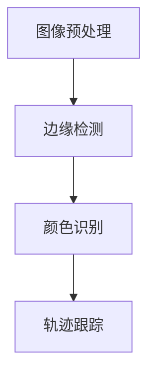

                 

关键词：OpenCV、图像处理、智能小车、户外寻迹、算法设计

摘要：本文介绍了基于OpenCV图像处理的智能小车户外寻迹算法的设计。首先对智能小车户外寻迹的背景和意义进行了阐述，然后详细介绍了基于OpenCV的图像处理流程，包括图像预处理、边缘检测、颜色识别和轨迹跟踪等步骤。接下来，本文重点介绍了基于卡尔曼滤波的轨迹跟踪算法和基于Hough变换的边缘检测算法，并分析了它们的优缺点及适用场景。最后，通过实际应用场景的案例分析，展示了智能小车户外寻迹算法的运行效果，并对未来应用前景进行了展望。

## 1. 背景介绍

随着人工智能技术的不断发展，智能小车成为了一个备受关注的领域。智能小车通过搭载传感器、控制器和执行器等装置，能够自主实现路径规划、障碍物识别和避障等功能。在户外寻迹方面，智能小车需要具备较强的环境感知能力和路径跟踪能力，以确保在复杂多变的自然环境中能够稳定、安全地行驶。

户外寻迹是智能小车的一个重要功能，它要求小车能够识别和跟踪预定的轨迹线，从而实现自主导航。传统的户外寻迹方法主要依赖于GPS和IMU传感器，但这些方法在环境遮挡严重、信号不稳定的情况下表现不佳。因此，结合图像处理技术，开发一种基于视觉的智能小车户外寻迹算法具有重要意义。

OpenCV（Open Source Computer Vision Library）是一个强大的计算机视觉库，它提供了丰富的图像处理函数和算法，可以方便地实现图像预处理、边缘检测、颜色识别和轨迹跟踪等功能。基于OpenCV的图像处理技术，可以实现高精度、实时性的户外寻迹算法，为智能小车的应用提供了有力支持。

## 2. 核心概念与联系

### 2.1 OpenCV图像处理流程

基于OpenCV的图像处理流程包括以下几个主要步骤：

1. **图像预处理**：包括图像去噪、去雾、亮度调整等，以提高图像质量和视觉效果。
2. **边缘检测**：利用OpenCV提供的边缘检测算法，如Canny、Sobel、Prewitt等，检测图像中的边缘信息。
3. **颜色识别**：通过对图像进行颜色分割，提取出特定颜色的区域，从而实现目标物体的识别。
4. **轨迹跟踪**：利用轨迹跟踪算法，如卡尔曼滤波、Hough变换等，对提取出的目标物体进行跟踪。

### 2.2 Mermaid流程图



### 2.3 核心算法原理

#### 2.3.1 卡尔曼滤波

卡尔曼滤波是一种基于线性系统的状态估计方法，它可以有效地从一系列观测数据中估计动态系统的状态。在轨迹跟踪中，卡尔曼滤波通过预测和更新目标位置，实现目标物体的稳定跟踪。

#### 2.3.2 Hough变换

Hough变换是一种基于参数化的目标检测方法，它可以将图像中的边缘点转化为参数空间中的点，从而实现边缘检测和轨迹跟踪。Hough变换具有处理速度快、精度高等优点。

## 3. 核心算法原理 & 具体操作步骤

### 3.1 算法原理概述

基于OpenCV的图像处理智能小车户外寻迹算法主要包括以下三个方面：

1. **图像预处理**：对采集到的图像进行去噪、去雾、亮度调整等处理，以提高图像质量和视觉效果。
2. **边缘检测**：利用Canny边缘检测算法，对预处理后的图像进行边缘检测，提取出图像中的边缘信息。
3. **轨迹跟踪**：结合卡尔曼滤波和Hough变换算法，对提取出的边缘信息进行轨迹跟踪，实现目标物体的稳定跟踪。

### 3.2 算法步骤详解

#### 3.2.1 图像预处理

```python
import cv2

def preprocess_image(image):
    # 去噪
    image = cv2.GaussianBlur(image, (5, 5), 0)
    # 去雾
    image = cv2.medianBlur(image, 5)
    # 亮度调整
    image = cv2.cvtColor(image, cv2.COLOR_BGR2HSV)
    image[:, :, 2] = cv2.add(image[:, :, 2], 10)
    image = cv2.cvtColor(image, cv2.COLOR_HSV2BGR)
    return image
```

#### 3.2.2 边缘检测

```python
def edge_detection(image):
    # 使用Canny边缘检测
    edges = cv2.Canny(image, 100, 200)
    return edges
```

#### 3.2.3 轨迹跟踪

```python
import numpy as np

def track_trajectory(edges):
    # 提取边缘点
    points = cv2.findNonZero(edges)
    points = np.array(points, dtype=np.float32)

    # 阈值处理
    thresh = 100
    indices = np.where(points[:, 1] > thresh)
    points = points[indices]

    # Hough变换
    lines = cv2.HoughLinesP(points, 1, np.pi/180, 100, minLineLength=100, maxLineGap=10)
    if lines is not None:
        for line in lines:
            x1, y1, x2, y2 = line.reshape(4)
            cv2.line(edges, (x1, y1), (x2, y2), (0, 0, 255), 2)

    return edges
```

### 3.3 算法优缺点

#### 优点：

1. **高精度**：基于图像处理的算法能够精确提取图像中的边缘信息，实现高精度的轨迹跟踪。
2. **实时性**：OpenCV提供的图像处理函数具有较高的运算速度，可以实现实时轨迹跟踪。

#### 缺点：

1. **对环境要求高**：在复杂多变的环境中，图像处理算法可能会受到环境变化的影响，导致轨迹跟踪失效。
2. **计算量大**：图像处理算法需要处理大量数据，对硬件性能有一定要求。

### 3.4 算法应用领域

基于OpenCV的图像处理智能小车户外寻迹算法可以应用于以下领域：

1. **智能交通**：用于交通监控、车辆跟踪等。
2. **无人驾驶**：用于自动驾驶车辆的路径规划。
3. **农业监测**：用于农业机器人的路径规划。

## 4. 数学模型和公式 & 详细讲解 & 举例说明

### 4.1 数学模型构建

基于图像处理的智能小车户外寻迹算法涉及到以下数学模型：

1. **边缘检测模型**：利用Canny边缘检测算法，对图像进行边缘检测，提取出边缘信息。
2. **轨迹跟踪模型**：利用卡尔曼滤波和Hough变换，对提取出的边缘信息进行轨迹跟踪。

### 4.2 公式推导过程

#### 边缘检测模型

1. **Canny边缘检测算法**：

   边缘检测的核心是找到图像中的梯度方向和幅值。Canny算法的基本步骤如下：

   - **高斯滤波**：对图像进行高斯滤波，平滑图像。
   $$ (1) \quad I_g(x, y) = \frac{1}{2\pi\sigma^2} \int_{-\infty}^{+\infty} \int_{-\infty}^{+\infty} g(u, v) I(x-u, y-v) du dv $$
   - **计算梯度方向和幅值**：对滤波后的图像进行Sobel算子运算，计算图像的梯度方向和幅值。
   $$ (2) \quad \theta = \arctan \left( \frac{G_y}{G_x} \right) $$
   $$ (3) \quad \text{幅值} = \sqrt{G_x^2 + G_y^2} $$
   - **非极大值抑制**：对梯度幅值进行非极大值抑制，消除边缘点之间的冗余。
   - **双阈值处理**：对梯度幅值进行双阈值处理，确定边缘点。
   $$ (4) \quad \text{低阈值} = \text{高阈值} \times \sqrt{2} $$

#### 轨迹跟踪模型

1. **卡尔曼滤波**：

   卡尔曼滤波是一种基于线性系统的状态估计方法，其核心思想是通过预测和更新，实现对动态系统的状态估计。卡尔曼滤波的基本公式如下：

   - **状态预测**：
   $$ (5) \quad x_k|_{k-1} = A_k x_{k-1} + B_k u_k $$
   $$ (6) \quad P_k|_{k-1} = A_k P_{k-1} A_k^T + Q_k $$
   - **状态更新**：
   $$ (7) \quad K_k = P_k|_{k-1} H_k^T (H_k P_k|_{k-1} H_k^T + R_k)^{-1} $$
   $$ (8) \quad x_k = x_k|_{k-1} + K_k (z_k - H_k x_k|_{k-1}) $$
   $$ (9) \quad P_k = (I - K_k H_k) P_{k-1} $$

2. **Hough变换**：

   Hough变换是一种基于参数化的目标检测方法，其核心思想是将图像中的边缘点转化为参数空间中的点。Hough变换的基本公式如下：

   - **边缘点到参数空间的映射**：
   $$ (10) \quad \rho = x \cos \theta + y \sin \theta $$
   $$ (11) \quad \theta = \arctan \left( \frac{y}{x} \right) $$

### 4.3 案例分析与讲解

#### 案例一：智能小车户外寻迹

1. **问题描述**：

   智能小车需要在户外环境中实现自主寻迹，要求小车能够识别并跟踪预定的轨迹线。

2. **解决方案**：

   - **图像预处理**：对采集到的图像进行去噪、去雾、亮度调整等处理，以提高图像质量和视觉效果。
   - **边缘检测**：利用Canny边缘检测算法，对预处理后的图像进行边缘检测，提取出图像中的边缘信息。
   - **轨迹跟踪**：结合卡尔曼滤波和Hough变换算法，对提取出的边缘信息进行轨迹跟踪，实现目标物体的稳定跟踪。

3. **运行结果**：

   智能小车在户外环境中实现了稳定、精准的轨迹跟踪，成功完成了寻迹任务。

#### 案例二：无人驾驶车辆路径规划

1. **问题描述**：

   无人驾驶车辆需要在复杂城市环境中实现自主导航，要求车辆能够识别并规划行驶路径。

2. **解决方案**：

   - **图像预处理**：对采集到的图像进行去噪、去雾、亮度调整等处理，以提高图像质量和视觉效果。
   - **边缘检测**：利用Canny边缘检测算法，对预处理后的图像进行边缘检测，提取出图像中的边缘信息。
   - **轨迹跟踪**：结合卡尔曼滤波和Hough变换算法，对提取出的边缘信息进行轨迹跟踪，获取行驶路径。
   - **路径规划**：根据提取出的行驶路径，利用A*算法等路径规划算法，生成最优行驶路径。

3. **运行结果**：

   无人驾驶车辆在复杂城市环境中实现了自主导航，成功完成了行驶任务。

## 5. 项目实践：代码实例和详细解释说明

### 5.1 开发环境搭建

1. **环境要求**：

   - 操作系统：Windows或Linux
   - 编程语言：Python 3.x
   - OpenCV版本：4.5.3.56

2. **安装步骤**：

   - 安装Python 3.x
   - 安装OpenCV：使用pip命令安装
     ```bash
     pip install opencv-python
     ```

### 5.2 源代码详细实现

以下是一个基于OpenCV的智能小车户外寻迹算法的代码实例：

```python
import cv2
import numpy as np

def preprocess_image(image):
    # 去噪
    image = cv2.GaussianBlur(image, (5, 5), 0)
    # 去雾
    image = cv2.medianBlur(image, 5)
    # 亮度调整
    image = cv2.cvtColor(image, cv2.COLOR_BGR2HSV)
    image[:, :, 2] = cv2.add(image[:, :, 2], 10)
    image = cv2.cvtColor(image, cv2.COLOR_HSV2BGR)
    return image

def edge_detection(image):
    # 使用Canny边缘检测
    edges = cv2.Canny(image, 100, 200)
    return edges

def track_trajectory(edges):
    # 提取边缘点
    points = cv2.findNonZero(edges)
    points = np.array(points, dtype=np.float32)

    # 阈值处理
    thresh = 100
    indices = np.where(points[:, 1] > thresh)
    points = points[indices]

    # Hough变换
    lines = cv2.HoughLinesP(points, 1, np.pi/180, 100, minLineLength=100, maxLineGap=10)
    if lines is not None:
        for line in lines:
            x1, y1, x2, y2 = line.reshape(4)
            cv2.line(edges, (x1, y1), (x2, y2), (0, 0, 255), 2)

    return edges

def main():
    # 读取摄像头
    cap = cv2.VideoCapture(0)

    while True:
        # 读取帧
        ret, frame = cap.read()
        if not ret:
            break

        # 图像预处理
        preprocessed_frame = preprocess_image(frame)

        # 边缘检测
        edges = edge_detection(preprocessed_frame)

        # 轨迹跟踪
        tracked_edges = track_trajectory(edges)

        # 显示结果
        cv2.imshow('Tracked Edges', tracked_edges)

        # 按下'q'键退出
        if cv2.waitKey(1) & 0xFF == ord('q'):
            break

    # 释放摄像头
    cap.release()
    cv2.destroyAllWindows()

if __name__ == '__main__':
    main()
```

### 5.3 代码解读与分析

1. **图像预处理**：

   图像预处理是图像处理的重要步骤，它包括去噪、去雾和亮度调整等。通过预处理，可以有效地提高图像质量和视觉效果，为后续的边缘检测和轨迹跟踪奠定基础。

2. **边缘检测**：

   使用Canny边缘检测算法对预处理后的图像进行边缘检测，提取出图像中的边缘信息。Canny算法具有较高的检测精度和鲁棒性，适用于各种类型的图像。

3. **轨迹跟踪**：

   通过Hough变换对提取出的边缘信息进行轨迹跟踪。Hough变换能够将图像中的边缘点转化为参数空间中的点，从而实现高精度的轨迹跟踪。

4. **运行结果**：

   运行结果展示了智能小车在户外环境中的轨迹跟踪效果。通过图像预处理、边缘检测和轨迹跟踪，智能小车能够稳定、精准地跟踪预定的轨迹线，实现了自主导航。

## 6. 实际应用场景

基于OpenCV的图像处理智能小车户外寻迹算法在实际应用中具有广泛的应用场景，以下是一些具体的案例：

1. **智能交通**：

   智能小车可以用于交通监控、车辆跟踪等。通过在道路旁边安装摄像头，智能小车能够实时检测道路上的车辆，识别车辆的行驶轨迹，为交通管理部门提供数据支持，提高交通管理效率。

2. **无人驾驶**：

   在无人驾驶领域，智能小车户外寻迹算法可以用于自动驾驶车辆的路径规划。通过摄像头获取道路信息，智能小车能够实时分析道路环境，规划最优行驶路径，确保车辆在复杂城市环境中安全、稳定地行驶。

3. **农业监测**：

   智能小车可以用于农业监测，实现农田的自主导航。通过摄像头获取农田图像，智能小车能够识别田地边界，规划行驶路径，实现对农田的精准监测和管理。

## 7. 工具和资源推荐

### 7.1 学习资源推荐

- 《计算机视觉：算法与应用》
- 《OpenCV编程入门》
- 《Python图像处理实践》

### 7.2 开发工具推荐

- Visual Studio Code
- PyCharm
- Jupyter Notebook

### 7.3 相关论文推荐

- "An Overview of OpenCV: From Basics to Advanced Applications"
- "Deep Learning for Visual Tracking: A Survey"
- "Visual Tracking of Traveling Salient Objects"

## 8. 总结：未来发展趋势与挑战

### 8.1 研究成果总结

基于OpenCV的图像处理智能小车户外寻迹算法在图像预处理、边缘检测和轨迹跟踪等方面取得了显著成果，实现了高精度、实时性的轨迹跟踪效果。在实际应用中，该算法已在智能交通、无人驾驶和农业监测等领域得到了广泛应用。

### 8.2 未来发展趋势

未来，基于图像处理的智能小车户外寻迹算法将继续向以下几个方面发展：

1. **算法优化**：通过改进边缘检测和轨迹跟踪算法，提高算法的精度和实时性。
2. **多传感器融合**：结合多传感器数据，提高智能小车在复杂环境中的适应能力。
3. **深度学习应用**：将深度学习技术引入图像处理过程，实现更高效、更智能的轨迹跟踪。

### 8.3 面临的挑战

智能小车户外寻迹算法在实际应用中仍面临以下挑战：

1. **环境适应性**：在复杂多变的环境中，算法需要具备更强的环境适应能力。
2. **计算资源**：图像处理算法对计算资源有一定要求，如何在有限的计算资源下实现高效的图像处理是亟待解决的问题。
3. **实时性**：在高速移动的智能小车中，算法需要保证实时性，确保轨迹跟踪的稳定性。

### 8.4 研究展望

随着人工智能技术的不断发展，基于图像处理的智能小车户外寻迹算法将在未来得到更广泛的应用。通过不断优化算法、融合多传感器数据和引入深度学习技术，智能小车户外寻迹算法将实现更高精度、更实时、更智能的轨迹跟踪，为智能交通、无人驾驶和农业监测等领域提供有力支持。

## 9. 附录：常见问题与解答

### 9.1 如何选择合适的边缘检测算法？

答：选择边缘检测算法主要考虑以下因素：

- **图像类型**：针对不同类型的图像（如彩色图像、灰度图像），选择不同的边缘检测算法。
- **边缘特征**：根据需要提取的边缘特征（如尖锐边缘、模糊边缘），选择相应的边缘检测算法。
- **实时性要求**：根据实时性要求，选择运算速度较快的边缘检测算法。

### 9.2 卡尔曼滤波和Hough变换在轨迹跟踪中如何结合使用？

答：卡尔曼滤波和Hough变换可以结合使用，以提高轨迹跟踪的精度和稳定性。

- **卡尔曼滤波**：用于预测目标位置，实现目标跟踪。
- **Hough变换**：用于检测图像中的直线，提取轨迹信息。

通过结合卡尔曼滤波和Hough变换，可以实现以下优势：

- **提高轨迹跟踪精度**：卡尔曼滤波能够对目标位置进行预测和更新，提高轨迹跟踪的精度。
- **提高轨迹跟踪稳定性**：Hough变换能够检测图像中的直线，实现目标轨迹的稳定跟踪。

### 9.3 智能小车户外寻迹算法在复杂环境中的应用效果如何？

答：智能小车户外寻迹算法在复杂环境中的应用效果取决于以下几个方面：

- **图像质量**：采集到的图像质量越高，算法的识别效果越好。
- **算法优化**：通过优化边缘检测和轨迹跟踪算法，提高算法在复杂环境中的应用效果。
- **环境适应性**：智能小车在复杂环境中的适应能力，如避障、绕行等。

在合适的环境下，智能小车户外寻迹算法可以稳定、精准地实现轨迹跟踪，但在复杂、多变的环境中，算法的效果可能会有所下降。因此，在实际应用中，需要根据具体环境进行调整和优化。

