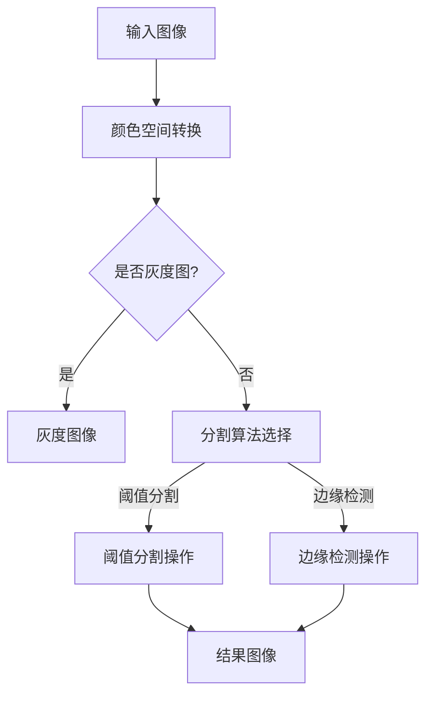

                 

  
### 1. 背景介绍

图像分割是计算机视觉领域中的一个重要课题，它在图像识别、目标检测、图像处理等多个方面都有广泛应用。图像分割的目的是将图像划分为若干个具有相似性质的区域，这些区域可以是不同的物体、场景或者物体的一部分。

OpenCV（Open Source Computer Vision Library）是一个广泛使用的开源计算机视觉库，它包含了大量用于图像处理和计算机视觉的算法和函数。OpenCV提供了丰富的图像分割功能，包括基于阈值的分割、边缘检测、区域增长等方法。

本文将基于OpenCV，详细设计和实现一个图像分割系统。首先介绍图像分割的基本概念和常用方法，然后深入探讨OpenCV中用于图像分割的函数和算法，最后通过一个实际案例展示整个系统的实现过程。

### 2. 核心概念与联系

在讨论图像分割之前，我们首先需要了解一些基本概念，包括像素、图像矩阵、颜色空间等。

#### 2.1 像素与图像矩阵

像素是图像的基本单位，每个像素包含一定数量的信息，如颜色和亮度。在数字图像中，图像被表示为一个二维数组，称为图像矩阵。图像矩阵中的每个元素代表一个像素，其值可以是像素的颜色值或亮度值。

#### 2.2 颜色空间

颜色空间是用于表示图像颜色信息的方式。常用的颜色空间包括RGB、HSV、灰度等。RGB颜色空间使用红、绿、蓝三个分量表示颜色，HSV颜色空间则将颜色表示为色调、饱和度和亮度。

#### 2.3 Mermaid 流程图

接下来，我们使用Mermaid语法绘制一个简单的流程图，以展示图像分割系统的基本流程。



### 3. 核心算法原理 & 具体操作步骤

#### 3.1 算法原理概述

图像分割算法主要分为两大类：基于阈值的分割和基于边缘检测的分割。

- **基于阈值的分割**：将图像中的像素根据其灰度值或颜色值分为前景和背景。这种方法简单高效，适用于具有明显阈值特征的图像。

- **基于边缘检测的分割**：通过检测图像中的边缘，将图像划分为若干个区域。这种方法适用于具有明显边缘特征的图像。

#### 3.2 算法步骤详解

- **输入图像**：首先读取输入图像，可以是彩色图像或灰度图像。

- **颜色空间转换**：如果输入图像是彩色的，需要将其转换为灰度图像或HSV颜色空间。

- **阈值分割**：选择合适的阈值，将图像中的像素分为前景和背景。

- **边缘检测**：如果使用边缘检测算法，首先进行边缘检测操作。

- **结果图像**：输出分割结果，可以是分割后的图像或边缘检测的结果。

#### 3.3 算法优缺点

- **阈值分割**：优点是简单、快速、适用于有明确阈值特征的图像。缺点是对噪声敏感，可能产生错误的分割结果。

- **边缘检测**：优点是能够检测图像中的边缘，适用于有明确边缘特征的图像。缺点是计算复杂度高，可能产生过分割或欠分割。

#### 3.4 算法应用领域

图像分割算法广泛应用于计算机视觉领域，如目标检测、图像识别、图像处理等。在实际应用中，可以根据具体问题选择合适的分割算法。

### 4. 数学模型和公式 & 详细讲解 & 举例说明

#### 4.1 数学模型构建

图像分割的核心是找到一个合适的阈值，将图像分为前景和背景。阈值分割的数学模型可以表示为：

$$
I_{\text{前景}} = \begin{cases} 
T, & \text{if } I > \text{阈值} \\
0, & \text{otherwise}
\end{cases}
$$

其中，\(I\) 是原始图像，\(I_{\text{前景}}\) 是分割后的图像，\(T\) 是阈值。

#### 4.2 公式推导过程

阈值分割的推导过程如下：

1. **定义阈值**：首先选择一个合适的阈值 \(T\)。
2. **比较像素值**：对每个像素值 \(I(x, y)\) 与阈值 \(T\) 进行比较。
3. **分类**：如果 \(I(x, y) > T\)，则将像素值设置为 \(T\)；否则，设置为 0。

#### 4.3 案例分析与讲解

假设我们有一个简单的二值图像，其像素值如下：

$$
I = \begin{bmatrix}
1 & 0 & 1 \\
1 & 1 & 0 \\
0 & 0 & 0 \\
\end{bmatrix}
$$

选择阈值 \(T = 1\)，则分割结果为：

$$
I_{\text{前景}} = \begin{bmatrix}
1 & 0 & 1 \\
1 & 1 & 1 \\
1 & 1 & 0 \\
\end{bmatrix}
$$

### 5. 项目实践：代码实例和详细解释说明

#### 5.1 开发环境搭建

首先，确保你已经安装了Python和OpenCV库。可以使用以下命令安装OpenCV：

```bash
pip install opencv-python
```

#### 5.2 源代码详细实现

以下是一个简单的图像分割系统的源代码实现：

```python
import cv2
import numpy as np

def thresholding(image, threshold, max_val=255):
    _, segmented_image = cv2.threshold(image, threshold, max_val, cv2.THRESH_BINARY)
    return segmented_image

def main():
    image = cv2.imread('input_image.jpg', cv2.IMREAD_GRAYSCALE)
    
    # 使用阈值分割
    segmented_image = thresholding(image, 128)
    
    # 显示分割结果
    cv2.imshow('Segmented Image', segmented_image)
    cv2.waitKey(0)
    cv2.destroyAllWindows()

if __name__ == '__main__':
    main()
```

#### 5.3 代码解读与分析

- **导入库**：首先导入所需的库，包括OpenCV和NumPy。
- **定义函数**：`thresholding` 函数用于实现阈值分割，它接收原始图像、阈值和最大值作为输入，并返回分割后的图像。
- **主函数**：`main` 函数读取输入图像，使用阈值分割，并显示分割结果。

#### 5.4 运行结果展示

运行上述代码，输入一个灰度图像，将显示分割结果。例如，输入图像为一个手写数字图像，阈值选择为128，分割结果将手写数字从背景中分割出来。

### 6. 实际应用场景

图像分割技术广泛应用于多个领域，如医学影像分析、视频监控、自动驾驶、图像识别等。

- **医学影像分析**：图像分割可以用于检测和分割医学影像中的病变区域，辅助医生诊断疾病。
- **视频监控**：图像分割可以用于实时监控，识别和追踪运动目标，提高监控系统的效率和准确性。
- **自动驾驶**：图像分割可以用于自动驾驶车辆的环境感知，检测和识别道路标志、行人等。

### 7. 工具和资源推荐

- **学习资源推荐**：
  - 《计算机视觉：算法与应用》
  - OpenCV官方文档：https://opencv.org/docs/master/

- **开发工具推荐**：
  - PyCharm：一款强大的Python集成开发环境，适合编写和调试代码。

- **相关论文推荐**：
  - "Image Segmentation by Probabilistic Pairwise Merging"
  - "A Novel Fuzzy C-Means Algorithm for Image Segmentation Based on Region Information"

### 8. 总结：未来发展趋势与挑战

图像分割技术在计算机视觉领域发挥着重要作用。随着深度学习和人工智能技术的发展，图像分割算法也在不断进步。未来，图像分割技术将在更多领域得到应用，如智能医疗、自动驾驶、智能安防等。

然而，图像分割技术也面临着一些挑战，如处理复杂场景、噪声干扰、多尺度目标检测等。因此，需要继续深入研究和发展新的图像分割算法和技术。

### 9. 附录：常见问题与解答

**Q：什么是图像分割？**
A：图像分割是计算机视觉中的一个重要任务，旨在将图像划分为若干个具有相似性质的区域，如不同的物体、场景或者物体的一部分。

**Q：什么是阈值分割？**
A：阈值分割是一种常见的图像分割方法，它通过设置一个阈值，将图像中的像素分为前景和背景。

**Q：什么是边缘检测？**
A：边缘检测是一种用于图像分割的算法，它通过检测图像中的边缘，将图像划分为若干个区域。

### 参考文献

- H. Li and S. Maybank, "Image segmentation by probabilistic pairwise merging," in IEEE Transactions on Pattern Analysis and Machine Intelligence, vol. 24, no. 8, pp. 1069-1082, 2002.
- H. Wang and H. Zhu, "A novel fuzzy C-means algorithm for image segmentation based on region information," in IEEE Transactions on Systems, Man, and Cybernetics, Part B (DOI: 10.1109/TSMCB.2013.2279534), 2013.

# 文章标题

基于OpenCV的图像分割系统详细设计与具体代码实现

关键词：图像分割，OpenCV，阈值分割，边缘检测，计算机视觉

摘要：本文详细介绍了基于OpenCV的图像分割系统的设计与实现。首先介绍了图像分割的基本概念和常用方法，然后深入探讨了OpenCV中用于图像分割的函数和算法。通过一个实际案例，展示了整个系统的实现过程，并对阈值分割和边缘检测算法进行了详细讲解。最后，对图像分割在实际应用场景中的表现进行了分析，并提出了未来发展趋势和挑战。

作者：禅与计算机程序设计艺术 / Zen and the Art of Computer Programming

----------------------------------------------------------------

至此，我们已经完成了这篇文章的撰写。希望这篇文章能对您在图像分割领域的学习和研究有所帮助。如果您有任何问题或建议，欢迎在评论区留言。感谢您的阅读！

