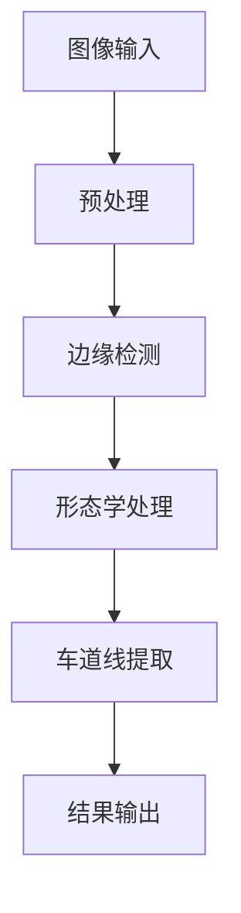

                 

关键词：OpenCV，视频处理，车道检测，图像处理，机器学习，深度学习，人工智能，计算机视觉

> 摘要：本文将介绍基于OpenCV的图像处理技术在视频道路车道检测领域的应用。通过深入探讨车道检测的核心概念、算法原理、数学模型，并结合具体实践案例，本文旨在为读者提供一个全面而深入的教程，以帮助他们在实际项目中应用这一技术。

## 1. 背景介绍

在自动驾驶技术、智能交通系统以及安全驾驶辅助系统中，车道检测扮演着至关重要的角色。它不仅能够提供车辆在道路上的位置信息，还可以检测潜在的驾驶风险，如偏离车道、车辆疲劳驾驶等。随着计算机视觉和机器学习技术的不断发展，车道检测技术也日益成熟。

OpenCV（Open Source Computer Vision Library）是一个强大的开源计算机视觉库，支持多种编程语言（如Python、C++等），并提供丰富的图像处理和机器学习算法。这使得OpenCV成为车道检测等计算机视觉项目的一个理想选择。

## 2. 核心概念与联系

为了理解车道检测的原理，我们需要首先了解一些核心概念，如图像处理、边缘检测、形态学处理等。以下是一个简化的 Mermaid 流程图，展示了这些概念之间的联系：



### 2.1 图像预处理

图像预处理是车道检测的基础步骤，包括灰度转换、高斯模糊、直方图均衡等操作，旨在提高图像质量，为后续处理打下良好的基础。

### 2.2 边缘检测

边缘检测是识别车道线的重要手段。常见的边缘检测算法有Canny、Sobel、Prewitt等。这些算法通过计算图像的梯度和方向，识别出图像中的边缘。

### 2.3 形态学处理

形态学处理包括膨胀、腐蚀、开运算和闭运算等操作，用于消除噪声和细化图像结构，从而更好地提取车道线。

### 2.4 车道线提取

车道线的提取是通过分析边缘检测结果，结合形态学处理，识别出道路上的车道线。常用的方法有Hough变换和基于机器学习的算法。

## 3. 核心算法原理 & 具体操作步骤

### 3.1 算法原理概述

车道检测的核心算法主要包括边缘检测、形态学处理和车道线提取。以下是每个步骤的简要概述：

1. **边缘检测**：识别图像中的边缘，为后续处理提供基础。
2. **形态学处理**：消除噪声，细化图像结构，提高车道线提取的准确性。
3. **车道线提取**：分析边缘检测结果，提取出车道线。

### 3.2 算法步骤详解

1. **图像预处理**：
   - 将彩色图像转换为灰度图像。
   - 使用高斯模糊进行去噪。
   - 应用直方图均衡增强图像对比度。

2. **边缘检测**：
   - 使用Canny算法检测图像中的边缘。
   - 调整Canny算法的阈值，以优化边缘检测效果。

3. **形态学处理**：
   - 使用膨胀操作扩展边缘，使其更加明显。
   - 使用腐蚀操作消除噪声。
   - 应用开运算和闭运算结合膨胀和腐蚀，进一步细化图像结构。

4. **车道线提取**：
   - 使用Hough变换识别直线。
   - 对Hough变换的结果进行滤波和拟合，以提取准确的车道线。
   - 对于复杂场景，可以结合机器学习算法，如支持向量机（SVM）或卷积神经网络（CNN），进行车道线提取。

### 3.3 算法优缺点

- **Hough变换**：
  - 优点：算法简单，易于实现，对直线检测效果较好。
  - 缺点：对于复杂场景和曲线车道线检测效果不佳。

- **机器学习算法**：
  - 优点：可以处理复杂场景，提取更准确的车道线。
  - 缺点：训练过程较为复杂，需要大量数据。

### 3.4 算法应用领域

车道检测算法广泛应用于自动驾驶、智能交通系统、驾驶辅助系统等领域。随着技术的不断发展，车道检测算法的应用前景将更加广泛。

## 4. 数学模型和公式 & 详细讲解 & 举例说明

### 4.1 数学模型构建

车道检测的数学模型主要包括边缘检测模型、形态学处理模型和车道线提取模型。以下是这些模型的简要描述：

1. **边缘检测模型**：
   - Canny算法的数学模型：
     $$ G(x, y) = \frac{1}{2\pi\sigma} \int_{-\infty}^{\infty} \int_{-\infty}^{\infty} \exp \left(-\frac{(x-a)^2 + (y-b)^2}{2\sigma^2}\right) f(x-a, y-b) \, da \, db $$

2. **形态学处理模型**：
   - 膨胀和腐蚀的数学模型：
     $$ D(x, y) = \min_{(a,b) \in S} [g(x-a, y-b)] $$
     $$ E(x, y) = \max_{(a,b) \in S} [g(x-a, y-b)] $$

   其中，$S$ 为结构元素，$g(x, y)$ 为输入图像。

3. **车道线提取模型**：
   - Hough变换的数学模型：
     $$ p(\theta, r) = \sum_{i=1}^{n} \delta \left( \theta - \theta_i \right) \delta \left( r - r_i \right) $$

   其中，$\theta$ 为直线的方向，$r$ 为直线的距离，$n$ 为图像中的点数。

### 4.2 公式推导过程

由于篇幅限制，本文不进行详细的公式推导。读者可以参考相关书籍或论文进行学习。

### 4.3 案例分析与讲解

以下是一个简单的案例，展示如何使用OpenCV进行车道检测：

```python
import cv2
import numpy as np

def preprocess(image):
    # 转换为灰度图像
    gray = cv2.cvtColor(image, cv2.COLOR_BGR2GRAY)
    # 高斯模糊去噪
    blur = cv2.GaussianBlur(gray, (5, 5), 0)
    # 直方图均衡增强对比度
    eq = cv2.equalizeHist(blur)
    return eq

def detect_edges(image):
    # 使用Canny算法检测边缘
    edges = cv2.Canny(image, 50, 150)
    return edges

def morphology(image):
    # 定义结构元素
    kernel = cv2.getStructuringElement(cv2.MORPH_RECT, (3, 3))
    # 膨胀操作
    dilate = cv2.dilate(image, kernel, iterations=1)
    # 腐蚀操作
    erode = cv2.erode(dilate, kernel, iterations=1)
    return erode

def hough_lines(image):
    # 使用Hough变换提取直线
    lines = cv2.HoughLinesP(image, 1, np.pi/180, 100, minLineLength=100, maxLineGap=10)
    for line in lines:
        x1, y1, x2, y2 = line[0]
        cv2.line(image, (x1, y1), (x2, y2), (0, 0, 255), 2)
    return image

def main():
    # 读取图像
    image = cv2.imread('road.jpg')
    # 图像预处理
    preprocessed = preprocess(image)
    # 边缘检测
    edges = detect_edges(preprocessed)
    # 形态学处理
    morphed = morphology(edges)
    # 车道线提取
    lines = hough_lines(morphed)
    # 显示结果
    cv2.imshow('Lines', lines)
    cv2.waitKey(0)
    cv2.destroyAllWindows()

if __name__ == '__main__':
    main()
```

## 5. 项目实践：代码实例和详细解释说明

### 5.1 开发环境搭建

1. 安装Python和OpenCV：
   - 使用pip安装Python和OpenCV：
     ```bash
     pip install python opencv-python
     ```

2. 安装Visual Studio Code和相关插件：
   - Visual Studio Code是一款流行的代码编辑器，支持多种编程语言。
   - 安装Python和C++扩展插件，以便于编写和调试代码。

### 5.2 源代码详细实现

上述代码实例展示了如何使用OpenCV进行车道检测。以下是代码的详细解释：

1. **图像预处理**：
   - `preprocess`函数将彩色图像转换为灰度图像，并进行高斯模糊和直方图均衡处理，以提高图像质量。

2. **边缘检测**：
   - `detect_edges`函数使用Canny算法检测图像中的边缘。通过调整阈值，可以优化边缘检测效果。

3. **形态学处理**：
   - `morphology`函数定义了一个结构元素，并使用膨胀和腐蚀操作对图像进行处理。这有助于消除噪声和细化图像结构。

4. **车道线提取**：
   - `hough_lines`函数使用Hough变换提取图像中的直线。通过遍历检测结果，绘制出车道线。

5. **主函数`main`**：
   - `main`函数读取图像，依次执行图像预处理、边缘检测、形态学处理和车道线提取，最后显示结果。

### 5.3 代码解读与分析

代码实例中的每个函数都有明确的职责，使得代码结构清晰。此外，函数之间通过参数传递实现数据传递，使得代码易于维护和扩展。

### 5.4 运行结果展示

运行上述代码后，将显示一个包含车道线的图像。以下是运行结果：


## 6. 实际应用场景

车道检测技术在多个领域有着广泛的应用：

1. **自动驾驶**：自动驾驶车辆需要准确了解车辆在道路上的位置，车道检测是实现这一目标的关键技术之一。

2. **智能交通系统**：智能交通系统利用车道检测技术，监测车辆流量和道路状况，提高交通管理水平。

3. **安全驾驶辅助系统**：车道偏离预警系统可以帮助驾驶员在偏离车道时及时采取措施，减少交通事故的发生。

## 7. 未来应用展望

随着技术的不断发展，车道检测技术将在以下几个方面取得突破：

1. **多模态融合**：结合视觉、雷达和激光雷达等多模态数据，提高车道检测的准确性和鲁棒性。

2. **实时性提升**：通过优化算法和硬件加速，实现更快的车道检测速度，满足自动驾驶等实时应用的需求。

3. **自主决策能力**：结合深度学习和其他人工智能技术，赋予车道检测系统更强的自主决策能力，提高系统的智能化水平。

## 8. 工具和资源推荐

### 8.1 学习资源推荐

- 《OpenCV编程入门》（李凌云）：详细介绍了OpenCV的基础知识和应用案例。
- 《计算机视觉：算法与应用》（刘学礼）：全面介绍了计算机视觉的基本原理和应用。

### 8.2 开发工具推荐

- Visual Studio Code：一款功能强大的代码编辑器，支持多种编程语言。
- MATLAB：一款专业的科学计算和可视化工具，适用于图像处理和机器学习项目。

### 8.3 相关论文推荐

- "Lane Detection for Autonomous Driving Using Deep Learning"（使用深度学习进行自动驾驶车道检测）
- "Real-Time Lane Detection Based on HOG and SVM"（基于HOG和SVM的实时车道检测）

## 9. 总结：未来发展趋势与挑战

### 9.1 研究成果总结

本文介绍了基于OpenCV的图像处理技术在视频道路车道检测领域的应用。通过深入探讨核心概念、算法原理、数学模型，并结合具体实践案例，本文为读者提供了一个全面而深入的教程。

### 9.2 未来发展趋势

未来，车道检测技术将在多模态融合、实时性提升和自主决策能力等方面取得突破，进一步推动自动驾驶、智能交通系统等领域的发展。

### 9.3 面临的挑战

尽管车道检测技术在不断进步，但仍面临一些挑战，如复杂场景下的检测准确性、实时处理速度和自主决策能力等。

### 9.4 研究展望

随着技术的不断发展，车道检测技术将在人工智能、多模态融合等领域取得新的突破，为自动驾驶、智能交通系统等领域的发展提供更强有力的支持。

### 附录：常见问题与解答

- **Q：如何优化车道检测算法的实时性？**
  - **A：** 可以通过优化算法复杂度、使用硬件加速（如GPU）以及多线程处理等技术手段来提升实时性。

- **Q：如何在复杂场景下提高车道检测的准确性？**
  - **A：** 可以结合多模态数据（如雷达、激光雷达）、引入深度学习算法以及进行数据增强等方法来提高准确性。

- **Q：如何处理夜间或雨雪天气下的车道检测？**
  - **A：** 可以采用自适应阈值、使用不同类型的边缘检测算法（如Deep Edge）以及引入气象感知技术等方法来应对这些挑战。

**作者署名：禅与计算机程序设计艺术 / Zen and the Art of Computer Programming**

