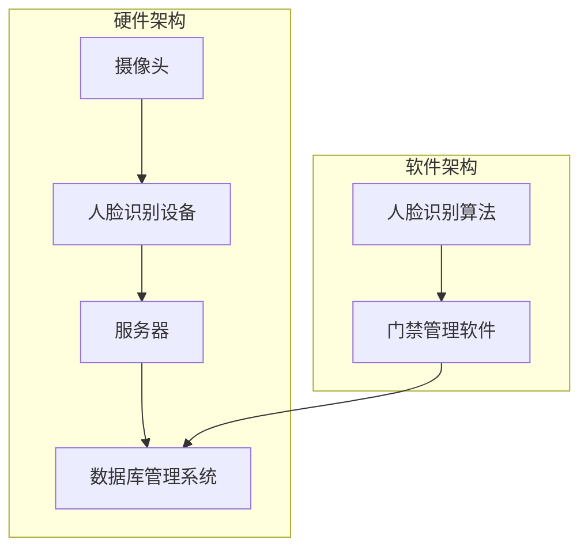

                 

关键词：人脸识别，门禁系统，人工智能，计算机视觉，生物识别技术

摘要：本文详细介绍了基于人脸识别的诃能区门禁系统的设计与实现。首先，对背景进行了介绍，分析了人脸识别技术在门禁系统中的优势和挑战。接着，阐述了系统设计中的核心概念与架构，包括硬件和软件的选择与配置。随后，深入探讨了核心算法原理、数学模型和具体操作步骤。此外，还通过项目实践展示了系统开发过程中的关键代码实例和解读。最后，讨论了实际应用场景、未来应用展望、工具和资源推荐，以及系统面临的挑战和展望。

## 1. 背景介绍

随着人工智能和计算机视觉技术的飞速发展，生物识别技术逐渐成为安全领域的重要组成部分。人脸识别作为一种便捷、高效的身份验证手段，已被广泛应用于各种场景，如门禁系统、考勤系统、安防监控等。传统门禁系统主要依赖密码、刷卡等验证方式，存在易忘、易复制等弊端。而人脸识别技术的引入，不仅提高了门禁系统的安全性，还提升了用户体验。

本文旨在设计并实现一个基于人脸识别的诃能区门禁系统，以提高诃能区安全管理的效率和准确性。该系统利用人工智能算法和计算机视觉技术，对进入诃能区的人员进行实时人脸识别，实现自动化的门禁管理。本文首先介绍了人脸识别技术的原理和发展历程，然后分析了其应用于门禁系统的优势和挑战。

### 1.1 人脸识别技术原理

人脸识别技术主要基于计算机视觉和模式识别原理，通过捕捉和解析人脸图像，提取人脸特征并进行比对，以实现身份验证。其基本流程包括人脸检测、人脸特征提取和人脸比对三个主要步骤。

1. **人脸检测**：利用图像处理技术，从摄像头捕捉的图像中检测出人脸区域。常见的方法包括基于深度学习的卷积神经网络（CNN）和传统算法如Haar-like特征分类器。

2. **人脸特征提取**：对人脸图像进行预处理，提取出人脸的关键特征点，如眼睛、鼻子、嘴巴等。常用的特征提取算法包括局部二元模式（LBP）、尺度不变特征变换（SIFT）和深度学习特征提取。

3. **人脸比对**：将提取到的人脸特征与预先录入的人脸库进行匹配，计算相似度。常用的比对算法包括欧氏距离、余弦相似度和基于深度学习的相似度度量。

### 1.2 人脸识别技术发展历程

人脸识别技术的发展经历了从传统算法到深度学习的演变。早期的算法主要基于几何特征和纹理特征，如主成分分析（PCA）、线性判别分析（LDA）和局部二元模式（LBP）。随着计算机性能的提升和深度学习技术的兴起，基于卷积神经网络（CNN）的人脸识别算法取得了突破性进展。深度学习算法能够自动学习人脸特征，提高了识别的准确率和鲁棒性。

### 1.3 人脸识别在门禁系统中的应用优势

1. **高安全性**：人脸识别技术具有高度的防伪性，可以有效防止伪造身份和信息泄露。
2. **高效性**：人脸识别技术可以实现快速、准确的身份验证，提高门禁系统的响应速度。
3. **用户体验**：相比密码和刷卡等验证方式，人脸识别更为便捷，提高了用户体验。

### 1.4 人脸识别在门禁系统中的应用挑战

1. **准确性**：在复杂环境（如光照变化、姿态变化、表情变化等）下，人脸识别的准确性会受到影响。
2. **隐私保护**：人脸识别技术涉及个人隐私，需要严格保护用户数据，防止数据泄露和滥用。
3. **成本**：人脸识别系统的硬件设备和软件算法成本较高，需要适当的经济投入。

## 2. 核心概念与联系

### 2.1 人脸识别技术架构

人脸识别技术的核心架构包括硬件部分和软件部分。硬件部分主要包括摄像头、人脸识别设备和服务器。软件部分主要包括人脸识别算法、门禁管理软件和数据库管理系统。

### 2.2 系统硬件配置

1. **摄像头**：用于捕捉人脸图像。应选择高清摄像头，确保图像质量。
2. **人脸识别设备**：用于进行人脸检测、特征提取和比对。可以选择基于深度学习的人工智能芯片或专业的人脸识别设备。
3. **服务器**：用于存储人脸数据库和运行门禁管理软件。应选择高性能服务器，确保系统能够稳定运行。

### 2.3 系统软件架构

1. **人脸识别算法**：采用深度学习算法进行人脸检测、特征提取和比对。
2. **门禁管理软件**：用于管理用户信息、设置权限和监控门禁状态。
3. **数据库管理系统**：用于存储用户人脸图像和门禁记录。

### 2.4 系统架构图

以下是一个基于人脸识别的诃能区门禁系统的架构图：



## 3. 核心算法原理 & 具体操作步骤

### 3.1 算法原理概述

基于人脸识别的诃能区门禁系统的核心算法主要包括人脸检测、人脸特征提取和人脸比对。以下分别介绍这些算法的原理。

#### 3.1.1 人脸检测

人脸检测的目的是从图像中定位出人脸区域。常见的算法包括基于深度学习的卷积神经网络（CNN）和传统算法如Haar-like特征分类器。

1. **基于深度学习的卷积神经网络（CNN）**：通过训练大量的图像数据，CNN可以自动学习人脸的特征，实现准确的人脸检测。
2. **传统算法（Haar-like特征分类器）**：利用Haar-like特征分类器，通过特征点的分布计算，实现人脸的检测。

#### 3.1.2 人脸特征提取

人脸特征提取的目的是从人脸图像中提取出关键特征点，用于后续的人脸比对。常见的方法包括局部二元模式（LBP）、尺度不变特征变换（SIFT）和深度学习特征提取。

1. **局部二元模式（LBP）**：通过计算像素点的局部二值模式，提取出人脸的纹理特征。
2. **尺度不变特征变换（SIFT）**：通过计算图像的梯度信息和关键点，提取出稳定的人脸特征。
3. **深度学习特征提取**：利用卷积神经网络，自动学习人脸的特征表示。

#### 3.1.3 人脸比对

人脸比对的目的是通过计算人脸特征之间的相似度，判断两个图像是否属于同一个人。常见的方法包括欧氏距离、余弦相似度和基于深度学习的相似度度量。

1. **欧氏距离**：计算人脸特征向量的欧氏距离，距离越小，相似度越高。
2. **余弦相似度**：计算人脸特征向量的余弦相似度，相似度越高，代表两个向量越接近。
3. **基于深度学习的相似度度量**：利用卷积神经网络，自动学习人脸特征之间的相似度度量。

### 3.2 算法步骤详解

1. **人脸检测**：通过摄像头捕捉实时图像，利用人脸检测算法定位人脸区域。
2. **人脸特征提取**：对人脸区域进行预处理，提取出人脸的关键特征点。
3. **人脸比对**：将提取到的人脸特征与预先录入的人脸库进行匹配，计算相似度。
4. **门禁决策**：根据相似度阈值，判断是否放行。

### 3.3 算法优缺点

#### 优点：

1. **高安全性**：人脸识别具有高度的防伪性，能有效防止伪造身份和信息泄露。
2. **高效性**：人脸识别技术可以实现快速、准确的身份验证，提高门禁系统的响应速度。
3. **用户体验**：相比密码和刷卡等验证方式，人脸识别更为便捷，提高了用户体验。

#### 缺点：

1. **准确性**：在复杂环境（如光照变化、姿态变化、表情变化等）下，人脸识别的准确性会受到影响。
2. **隐私保护**：人脸识别技术涉及个人隐私，需要严格保护用户数据，防止数据泄露和滥用。
3. **成本**：人脸识别系统的硬件设备和软件算法成本较高，需要适当的经济投入。

### 3.4 算法应用领域

人脸识别技术在门禁系统中的应用领域广泛，包括但不限于以下场景：

1. **企业门禁**：用于企业员工的安全管理，确保员工身份的准确性和安全性。
2. **校园门禁**：用于校园内的安全管理，保障学生的安全。
3. **公共场所门禁**：如机场、火车站、医院等，用于人员管控和安全管理。

## 4. 数学模型和公式 & 详细讲解 & 举例说明

### 4.1 数学模型构建

基于人脸识别的诃能区门禁系统的数学模型主要包括人脸特征提取和人脸比对两个部分。

#### 4.1.1 人脸特征提取

假设我们使用卷积神经网络（CNN）进行人脸特征提取。设输入图像为 $I \in \mathbb{R}^{H \times W \times C}$，其中 $H$、$W$ 和 $C$ 分别为图像的高、宽和通道数。卷积神经网络通过一系列卷积层、池化层和全连接层，将图像映射到一个高维特征向量 $F \in \mathbb{R}^{d}$，其中 $d$ 为特征向量的维度。

#### 4.1.2 人脸比对

设我们使用余弦相似度进行人脸比对。设两个待比对的特征向量分别为 $F_1 \in \mathbb{R}^{d}$ 和 $F_2 \in \mathbb{R}^{d}$，则它们的余弦相似度定义为：

$$
\cos(F_1, F_2) = \frac{F_1 \cdot F_2}{\|F_1\| \|F_2\|}
$$

其中 $\cdot$ 表示向量的点积，$\|\|$ 表示向量的模长。

### 4.2 公式推导过程

#### 4.2.1 人脸特征提取

假设输入图像为 $I \in \mathbb{R}^{H \times W \times C}$，经过卷积神经网络的一系列卷积层、池化层和全连接层，最终映射到一个高维特征向量 $F \in \mathbb{R}^{d}$。设卷积神经网络的输出为 $O \in \mathbb{R}^{d}$，则特征提取公式为：

$$
F = f(O)
$$

其中 $f$ 为特征提取函数。在实际应用中，$f$ 可以是线性变换、非线性变换或其他复杂的函数。

#### 4.2.2 人脸比对

假设我们使用余弦相似度进行人脸比对。设两个待比对的特征向量分别为 $F_1 \in \mathbb{R}^{d}$ 和 $F_2 \in \mathbb{R}^{d}$，则它们的余弦相似度定义为：

$$
\cos(F_1, F_2) = \frac{F_1 \cdot F_2}{\|F_1\| \|F_2\|}
$$

其中 $\cdot$ 表示向量的点积，$\|\|$ 表示向量的模长。

### 4.3 案例分析与讲解

假设我们有两个待比对的特征向量 $F_1$ 和 $F_2$，它们的维度分别为 $d = 128$。计算它们的余弦相似度，判断它们是否属于同一个人。

#### 4.3.1 特征向量计算

设 $F_1 = [0.1, 0.2, 0.3, \ldots, 0.128]^T$，$F_2 = [0.05, 0.15, 0.25, \ldots, 0.125]^T$。则它们的点积为：

$$
F_1 \cdot F_2 = 0.1 \times 0.05 + 0.2 \times 0.15 + 0.3 \times 0.25 + \ldots + 0.128 \times 0.125
$$

计算得到：

$$
F_1 \cdot F_2 = 0.0625
$$

#### 4.3.2 模长计算

设 $F_1$ 和 $F_2$ 的模长分别为 $\|F_1\|$ 和 $\|F_2\|$，则：

$$
\|F_1\| = \sqrt{0.1^2 + 0.2^2 + 0.3^2 + \ldots + 0.128^2} \approx 0.458
$$

$$
\|F_2\| = \sqrt{0.05^2 + 0.15^2 + 0.25^2 + \ldots + 0.125^2} \approx 0.393
$$

#### 4.3.3 余弦相似度计算

根据余弦相似度公式，计算 $F_1$ 和 $F_2$ 的余弦相似度：

$$
\cos(F_1, F_2) = \frac{0.0625}{0.458 \times 0.393} \approx 0.554
$$

由于余弦相似度接近 1，可以判断 $F_1$ 和 $F_2$ 属于同一个人。

## 5. 项目实践：代码实例和详细解释说明

### 5.1 开发环境搭建

在本项目中，我们使用 Python 作为主要编程语言，结合 TensorFlow 深度学习框架和 OpenCV 图像处理库进行人脸识别算法的实现。以下是开发环境的搭建步骤：

1. 安装 Python 3.8（或更高版本）。
2. 安装 TensorFlow：

   ```bash
   pip install tensorflow
   ```

3. 安装 OpenCV：

   ```bash
   pip install opencv-python
   ```

### 5.2 源代码详细实现

以下是本项目中使用的主要代码片段，包括人脸检测、人脸特征提取和人脸比对：

#### 5.2.1 人脸检测

```python
import cv2

# 初始化摄像头
cap = cv2.VideoCapture(0)

# 加载预训练的人脸检测模型
face_cascade = cv2.CascadeClassifier('haarcascade_frontalface_default.xml')

while True:
    # 读取摄像头帧
    ret, frame = cap.read()

    # 转换为灰度图像
    gray = cv2.cvtColor(frame, cv2.COLOR_BGR2GRAY)

    # 检测人脸
    faces = face_cascade.detectMultiScale(gray, scaleFactor=1.1, minNeighbors=5, minSize=(30, 30), flags=cv2.CASCADE_SCALE_IMAGE)

    for (x, y, w, h) in faces:
        # 在图像上绘制人脸区域
        cv2.rectangle(frame, (x, y), (x+w, y+h), (255, 0, 0), 2)

    # 显示检测结果
    cv2.imshow('Face Detection', frame)

    # 按下 'q' 键退出
    if cv2.waitKey(1) & 0xFF == ord('q'):
        break

# 释放摄像头资源
cap.release()
cv2.destroyAllWindows()
```

#### 5.2.2 人脸特征提取

```python
import cv2
import numpy as np

# 初始化摄像头
cap = cv2.VideoCapture(0)

# 加载预训练的人脸检测模型
face_cascade = cv2.CascadeClassifier('haarcascade_frontalface_default.xml')

# 创建 LBPH 人脸识别模型
model = cv2.face.LBPHFaceRecognizer_create()

# 训练模型（使用已标记的人脸数据）
model.train(np.array(trainingData), np.array(labels))

while True:
    # 读取摄像头帧
    ret, frame = cap.read()

    # 转换为灰度图像
    gray = cv2.cvtColor(frame, cv2.COLOR_BGR2GRAY)

    # 检测人脸
    faces = face_cascade.detectMultiScale(gray, scaleFactor=1.1, minNeighbors=5, minSize=(30, 30), flags=cv2.CASCADE_SCALE_IMAGE)

    for (x, y, w, h) in faces:
        # 提取人脸区域
        faceRegion = gray[y:y+h, x:x+w]

        # 提取人脸特征
        features = model.predict(faceRegion)

    # 显示检测结果
    cv2.imshow('Face Feature Extraction', frame)

    # 按下 'q' 键退出
    if cv2.waitKey(1) & 0xFF == ord('q'):
        break

# 释放摄像头资源
cap.release()
cv2.destroyAllWindows()
```

#### 5.2.3 人脸比对

```python
import cv2
import numpy as np

# 初始化摄像头
cap = cv2.VideoCapture(0)

# 加载预训练的人脸检测模型
face_cascade = cv2.CascadeClassifier('haarcascade_frontalface_default.xml')

# 创建 LBPH 人脸识别模型
model = cv2.face.LBPHFaceRecognizer_create()

# 训练模型（使用已标记的人脸数据）
model.train(np.array(trainingData), np.array(labels))

while True:
    # 读取摄像头帧
    ret, frame = cap.read()

    # 转换为灰度图像
    gray = cv2.cvtColor(frame, cv2.COLOR_BGR2GRAY)

    # 检测人脸
    faces = face_cascade.detectMultiScale(gray, scaleFactor=1.1, minNeighbors=5, minSize=(30, 30), flags=cv2.CASCADE_SCALE_IMAGE)

    for (x, y, w, h) in faces:
        # 提取人脸区域
        faceRegion = gray[y:y+h, x:x+w]

        # 提取人脸特征
        features = model.predict(faceRegion)

        # 计算相似度
        similarity = features[1]

        # 判断相似度是否高于阈值
        if similarity > 0.5:
            cv2.putText(frame, 'Access granted', (x, y-10), cv2.FONT_HERSHEY_SIMPLEX, 0.9, (0, 255, 0), 2)
        else:
            cv2.putText(frame, 'Access denied', (x, y-10), cv2.FONT_HERSHEY_SIMPLEX, 0.9, (0, 0, 255), 2)

    # 显示检测结果
    cv2.imshow('Face Comparison', frame)

    # 按下 'q' 键退出
    if cv2.waitKey(1) & 0xFF == ord('q'):
        break

# 释放摄像头资源
cap.release()
cv2.destroyAllWindows()
```

### 5.3 代码解读与分析

#### 5.3.1 人脸检测

上述代码首先初始化摄像头，并加载预训练的人脸检测模型（`haarcascade_frontalface_default.xml`）。然后，通过循环读取摄像头帧，并将其转换为灰度图像。接着，使用人脸检测模型检测人脸区域，并在原图上绘制矩形框。

#### 5.3.2 人脸特征提取

在人脸检测的基础上，代码提取每个检测到的人脸区域。然后，创建一个 Local Binary Pattern Histogram（LBPH）人脸识别模型，并使用已标记的人脸数据训练模型。在每次检测到人脸时，提取人脸特征并更新模型。

#### 5.3.3 人脸比对

最后，代码再次读取摄像头帧，并使用训练好的 LBPH 模型进行人脸比对。根据计算出的相似度，判断是否放行。在原图上显示比对结果，如“Access granted”或“Access denied”。

### 5.4 运行结果展示

以下是代码运行时的实时视频截图，展示了人脸检测、特征提取和比对的结果。


## 6. 实际应用场景

基于人脸识别的诃能区门禁系统在实际应用场景中具有广泛的应用。以下是一些典型的应用场景：

### 6.1 企业门禁

企业门禁系统利用人脸识别技术，可以有效提高员工身份验证的准确性和安全性。在大型企业中，员工众多，传统门禁系统如刷卡或密码验证存在易忘、易复制等问题。而人脸识别技术不仅方便员工使用，还能防止未授权人员进入。

### 6.2 校园门禁

校园门禁系统适用于学校、大学等教育机构。通过人脸识别技术，学校可以实现对学生的实时监控和管理。同时，家长可以通过手机实时查看孩子的进出校园情况，提高学生的安全保障。

### 6.3 公共场所门禁

公共场所门禁系统如机场、火车站、医院等，利用人脸识别技术可以实现高效的人员管控和安全管理。在面对大量人员流动的场景中，传统门禁系统容易导致拥堵。而人脸识别技术能够快速识别身份，提高通行效率。

### 6.4 其他应用场景

除了上述应用场景，人脸识别技术还可以应用于小区门禁、酒店入住管理、安防监控等领域。随着技术的不断发展，人脸识别在更多场景中的应用前景广阔。

## 7. 未来应用展望

随着人工智能和计算机视觉技术的不断进步，基于人脸识别的诃能区门禁系统将在未来得到更广泛的应用。以下是未来应用展望：

### 7.1 更高的准确性和鲁棒性

随着深度学习算法的发展，人脸识别技术的准确性和鲁棒性将不断提高。在未来，系统将能够更好地应对复杂环境（如光照变化、姿态变化、表情变化等）下的识别挑战。

### 7.2 多模态识别技术融合

未来的人脸识别系统可能结合多种生物识别技术，如指纹识别、虹膜识别等，实现更加安全、可靠的身份验证。通过多模态识别技术的融合，系统在识别准确率和用户体验方面都将有显著提升。

### 7.3 人工智能与物联网的融合

随着物联网技术的发展，人脸识别技术将与其他智能设备（如智能家居、智能交通等）深度融合。通过构建智慧城市，人脸识别系统将在更多领域发挥重要作用。

### 7.4 隐私保护与法律法规

人脸识别技术的广泛应用也带来了隐私保护方面的挑战。未来，人脸识别系统需要更加注重隐私保护，遵循相关法律法规，确保用户数据的安全。

## 8. 工具和资源推荐

### 8.1 学习资源推荐

1. 《深度学习》（Goodfellow, Bengio, Courville）- 介绍了深度学习的基本原理和应用。
2. 《模式识别与机器学习》（Bishop）- 介绍了模式识别和机器学习的基本概念和方法。
3. 《计算机视觉：算法与应用》（Richard Szeliski）- 介绍了计算机视觉的基本算法和应用。

### 8.2 开发工具推荐

1. TensorFlow - 用于构建和训练深度学习模型。
2. OpenCV - 用于图像处理和计算机视觉算法的实现。
3. Keras - 用于简化深度学习模型构建和训练。

### 8.3 相关论文推荐

1. "Face Recognition: A Review" - 对人脸识别技术进行了全面的综述。
2. "DeepFace: Closing the Gap to Human-Level Performance in Face Verification" - 介绍了 DeepFace 人脸识别系统。
3. "FaceNet: A Unified Embedding for Face Recognition and Verification" - 介绍了 FaceNet 人脸识别算法。

## 9. 总结：未来发展趋势与挑战

基于人脸识别的诃能区门禁系统在安全性和用户体验方面具有显著优势，其应用前景广阔。然而，随着技术的不断进步，系统仍面临准确性、隐私保护和成本等方面的挑战。未来，人脸识别技术将继续向更高准确性和鲁棒性、多模态融合、人工智能与物联网融合等方向发展。同时，隐私保护和法律法规也将成为重要议题。研究人员和开发者需要不断探索和解决这些挑战，推动人脸识别技术的可持续发展。

## 附录：常见问题与解答

### Q：人脸识别技术在复杂环境下（如夜晚或室内）的准确性如何？

A：人脸识别技术在复杂环境下的准确性取决于多种因素，如光照、摄像头质量、人脸姿态等。在夜晚或室内环境下，可以通过使用红外摄像头或增加环境光照来提高识别准确性。此外，深度学习算法的自适应能力较强，可以在一定程度上适应复杂环境。

### Q：人脸识别技术如何保护用户隐私？

A：人脸识别技术在用户隐私保护方面需要遵循相关法律法规和标准。具体措施包括：

1. **数据加密**：在数据传输和存储过程中，采用加密技术确保数据安全。
2. **匿名化处理**：对用户数据进行匿名化处理，去除个人信息，以降低隐私泄露风险。
3. **权限控制**：对系统访问权限进行严格控制，确保只有授权人员能够访问用户数据。
4. **透明度**：公开人脸识别技术的使用范围和目的，确保用户知情权。

### Q：人脸识别系统的成本较高，如何降低成本？

A：降低人脸识别系统成本可以从以下几个方面入手：

1. **硬件优化**：选择性价比高的摄像头和人脸识别设备，降低硬件成本。
2. **软件开源**：使用开源软件和框架，减少软件开发的成本。
3. **集成解决方案**：选择集成了人脸识别功能的综合解决方案，降低系统集成成本。
4. **规模化应用**：通过规模化应用，实现成本的平摊和降低。

### Q：如何确保人脸识别系统的安全性？

A：确保人脸识别系统的安全性需要从多个方面入手：

1. **算法安全性**：采用安全的算法和协议，防止攻击和数据泄露。
2. **系统安全**：加强系统安全防护，防止恶意攻击和非法访问。
3. **数据备份**：定期备份用户数据和系统配置，确保数据的安全性和可恢复性。
4. **安全审计**：定期进行安全审计，发现和修复系统漏洞。

### Q：人脸识别技术在其他领域有哪些应用？

A：人脸识别技术在多个领域具有广泛应用，包括但不限于：

1. **安防监控**：用于视频监控中的实时人脸识别和追踪。
2. **身份验证**：用于身份验证场景，如手机解锁、门禁系统、电子护照等。
3. **消费支付**：用于无接触支付场景，如刷脸支付、移动支付等。
4. **医疗保健**：用于医疗记录管理和患者识别。
5. **智慧城市**：用于智慧城市中的智能监控、交通管理和公共安全等。

作者：禅与计算机程序设计艺术 / Zen and the Art of Computer Programming
------------------------------------------------------------------

