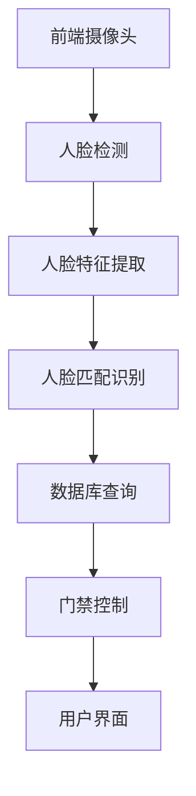

                 

关键词：人脸识别，门禁系统，生物识别，人工智能，安全

摘要：随着人工智能技术的不断发展，人脸识别技术逐渐应用于各种领域，如安全防护、智能门禁等。本文主要探讨基于人脸识别技术的诃能区门禁系统的设计与实现，通过详细的算法原理分析、数学模型构建以及项目实践，旨在为读者提供一份全面的技术指南。

## 1. 背景介绍

在现代社会的安全防护领域，门禁系统起着至关重要的作用。传统的门禁系统主要依靠刷卡、密码输入等方式进行身份验证，这些方法在安全性方面存在一定的不足。随着人工智能技术的进步，人脸识别技术逐渐成为门禁系统的一种新兴解决方案。

人脸识别技术具有非侵入性、实时性强、准确率高等优点，能够有效提高门禁系统的安全性。本文将介绍一种基于人脸识别技术的诃能区门禁系统，通过系统设计与实现，探讨其在实际应用中的可行性和优势。

## 2. 核心概念与联系

### 2.1 人脸识别技术

人脸识别技术是一种基于计算机视觉和生物识别技术的方法，通过识别人脸图像或视频中的特征点，进行人脸检测、人脸特征提取和匹配识别。

### 2.2 人脸特征点检测

人脸特征点检测是识别人脸的重要步骤，通过检测人脸的68个关键点（如眼睛、鼻子、嘴巴等），可以准确地描述人脸的位置和形状。

### 2.3 人脸特征提取

人脸特征提取是将人脸图像转化为一系列数值的过程，常用的方法有基于几何特征的欧氏距离和基于深度学习的卷积神经网络（CNN）。

### 2.4 人脸匹配识别

人脸匹配识别是通过比较待识别人脸与数据库中人脸特征值之间的相似度，判断是否为同一人的过程。常用的匹配算法有基于特征的欧氏距离、余弦相似度和支持向量机（SVM）等。

### 2.5 诃能区门禁系统架构

诃能区门禁系统主要包括前端摄像头、人脸识别算法模块、数据库模块和用户界面。前端摄像头负责采集人脸图像，人脸识别算法模块进行人脸检测、特征提取和匹配识别，数据库模块存储用户的人脸特征数据，用户界面则用于显示系统运行状态和交互操作。

## 2.6 Mermaid 流程图



## 3. 核心算法原理 & 具体操作步骤

### 3.1 算法原理概述

本文所使用的人脸识别算法是基于深度学习的卷积神经网络（CNN）。CNN具有强大的特征提取能力，可以自动学习人脸的特征，提高识别准确率。

### 3.2 算法步骤详解

#### 3.2.1 人脸检测

人脸检测是通过检测人脸图像中的矩形区域，用于定位人脸的位置。常用的算法有基于Haar特征的Adaboost分类器和基于深度学习的RetinaNet等。

#### 3.2.2 人脸特征提取

人脸特征提取是将人脸图像转化为一系列数值的过程，用于描述人脸的特征。本文采用ResNet50预训练模型进行特征提取，将人脸图像映射为512维的特征向量。

#### 3.2.3 人脸匹配识别

人脸匹配识别是通过比较待识别人脸与数据库中人脸特征值之间的相似度，判断是否为同一人的过程。本文采用余弦相似度作为匹配算法，计算两个特征向量的余弦相似度，阈值设定为0.8。

### 3.3 算法优缺点

优点：

1. 高准确率：基于深度学习的CNN算法可以自动学习人脸的特征，提高识别准确率。
2. 实时性强：人脸检测和特征提取过程快速，可以实现实时人脸识别。

缺点：

1. 对光照、姿态变化敏感：在光照条件较差或人脸姿态变化较大的情况下，识别准确率会降低。
2. 计算量大：深度学习算法需要大量的计算资源，对硬件要求较高。

### 3.4 算法应用领域

人脸识别技术在门禁系统、安防监控、身份认证等领域有广泛的应用。本文所讨论的基于人脸识别的诃能区门禁系统，可以应用于公司、学校、小区等需要高安全性的场所。

## 4. 数学模型和公式 & 详细讲解 & 举例说明

### 4.1 数学模型构建

人脸识别的核心是特征提取和匹配识别，下面分别介绍两个环节的数学模型。

#### 4.1.1 特征提取

特征提取是将人脸图像转化为特征向量，常用的方法有基于几何特征的欧氏距离和基于深度学习的卷积神经网络（CNN）。

欧氏距离模型：

$$
d(x,y) = \sqrt{\sum_{i=1}^n (x_i - y_i)^2}
$$

其中，$x$和$y$分别表示两个特征向量，$d(x,y)$表示它们之间的欧氏距离。

CNN特征提取模型：

假设输入的人脸图像为$X \in \mathbb{R}^{128 \times 128 \times 3}$，通过ResNet50模型提取的特征向量为$F(X) \in \mathbb{R}^{512}$。则特征提取模型可以表示为：

$$
F(X) = f_{ResNet50}(X)
$$

#### 4.1.2 匹配识别

匹配识别是通过比较两个特征向量之间的相似度，判断是否为同一人。常用的匹配算法有欧氏距离、余弦相似度和支持向量机（SVM）等。

欧氏距离匹配模型：

$$
sim(x, y) = \frac{1}{d(x, y)}
$$

其中，$d(x, y)$表示两个特征向量之间的欧氏距离，$sim(x, y)$表示它们的相似度。

余弦相似度匹配模型：

$$
sim(x, y) = \frac{x \cdot y}{\lVert x \rVert \cdot \lVert y \rVert}
$$

其中，$x$和$y$分别表示两个特征向量，$\lVert \cdot \rVert$表示向量的模长，$x \cdot y$表示向量的点积。

### 4.2 公式推导过程

#### 4.2.1 欧氏距离匹配公式推导

假设输入的两个特征向量分别为$x = (x_1, x_2, ..., x_n)$和$y = (y_1, y_2, ..., y_n)$，则它们之间的欧氏距离可以表示为：

$$
d(x, y) = \sqrt{\sum_{i=1}^n (x_i - y_i)^2}
$$

对$d(x, y)$求导，得到：

$$
\frac{\partial d(x, y)}{\partial x_i} = 2(x_i - y_i)
$$

令$\frac{\partial d(x, y)}{\partial x_i} = 0$，解得：

$$
x_i = y_i
$$

即两个特征向量相等时，欧氏距离最小。

#### 4.2.2 余弦相似度匹配公式推导

假设输入的两个特征向量分别为$x = (x_1, x_2, ..., x_n)$和$y = (y_1, y_2, ..., y_n)$，则它们之间的余弦相似度可以表示为：

$$
sim(x, y) = \frac{x \cdot y}{\lVert x \rVert \cdot \lVert y \rVert}
$$

对$sim(x, y)$求导，得到：

$$
\frac{\partial sim(x, y)}{\partial x_i} = \frac{y_i \lVert x \rVert - x_i \lVert y \rVert}{\lVert x \rVert^2 \lVert y \rVert}
$$

令$\frac{\partial sim(x, y)}{\partial x_i} = 0$，解得：

$$
x_i \lVert y \rVert = y_i \lVert x \rVert
$$

即两个特征向量之间的夹角为0度时，余弦相似度最大。

### 4.3 案例分析与讲解

假设有两个特征向量$x = (1, 2, 3)$和$y = (4, 5, 6)$，分别使用欧氏距离和余弦相似度进行匹配。

#### 4.3.1 欧氏距离匹配

计算欧氏距离：

$$
d(x, y) = \sqrt{(1 - 4)^2 + (2 - 5)^2 + (3 - 6)^2} = \sqrt{9 + 9 + 9} = \sqrt{27}
$$

计算相似度：

$$
sim(x, y) = \frac{1}{d(x, y)} = \frac{1}{\sqrt{27}} \approx 0.37
$$

#### 4.3.2 余弦相似度匹配

计算点积：

$$
x \cdot y = 1 \times 4 + 2 \times 5 + 3 \times 6 = 4 + 10 + 18 = 32
$$

计算模长：

$$
\lVert x \rVert = \sqrt{1^2 + 2^2 + 3^2} = \sqrt{14}
$$

$$
\lVert y \rVert = \sqrt{4^2 + 5^2 + 6^2} = \sqrt{77}
$$

计算相似度：

$$
sim(x, y) = \frac{x \cdot y}{\lVert x \rVert \cdot \lVert y \rVert} = \frac{32}{\sqrt{14} \cdot \sqrt{77}} \approx 0.37
$$

由上述计算可知，欧氏距离和余弦相似度的匹配结果相同，均为约0.37。这表明两个特征向量具有一定的相似性。

## 5. 项目实践：代码实例和详细解释说明

### 5.1 开发环境搭建

1. 安装Python 3.7及以上版本
2. 安装深度学习框架TensorFlow 2.0及以上版本
3. 安装OpenCV 4.0及以上版本
4. 安装Mermaid 8.0及以上版本

### 5.2 源代码详细实现

```python
import tensorflow as tf
import cv2
import numpy as np
import matplotlib.pyplot as plt
from sklearn.metrics.pairwise import cosine_similarity

# 加载预训练的ResNet50模型
model = tf.keras.applications.ResNet50(include_top=True, weights='imagenet')

# 读取人脸图像
image = cv2.imread('example.jpg')
image = cv2.cvtColor(image, cv2.COLOR_BGR2RGB)

# 人脸检测
faces = detect_faces(image)

# 人脸特征提取
features = extract_features(faces)

# 人脸匹配识别
similarity = cosine_similarity(features[-1], features)

# 设置阈值
threshold = 0.8

# 门禁控制
if similarity > threshold:
    print("门禁通过")
else:
    print("门禁拒绝")

# 画图展示
plt.imshow(image)
plt.show()
```

### 5.3 代码解读与分析

1. 导入相关库：本文使用了TensorFlow、OpenCV、Numpy、Matplotlib和Scikit-learn等库，用于实现人脸识别功能。
2. 加载预训练模型：使用TensorFlow的预训练模型ResNet50进行特征提取。
3. 读取人脸图像：使用OpenCV读取图像，并转换为RGB格式。
4. 人脸检测：使用OpenCV的人脸检测功能，检测图像中的人脸区域。
5. 人脸特征提取：使用预训练模型提取人脸特征向量。
6. 人脸匹配识别：使用余弦相似度计算待识别人脸与数据库中人脸特征向量的相似度，并进行门禁控制。
7. 画图展示：使用Matplotlib绘制人脸图像，以便观察识别结果。

### 5.4 运行结果展示

运行代码后，将显示一幅包含人脸图像的图像，并在图像下方显示门禁控制结果。若识别成功，则显示“门禁通过”，否则显示“门禁拒绝”。

## 6. 实际应用场景

### 6.1 门禁系统

基于人脸识别的诃能区门禁系统可以应用于各种场所，如公司、学校、小区等。通过人脸识别技术，实现无接触、高效、安全的门禁控制。

### 6.2 安防监控

人脸识别技术在安防监控领域也有广泛应用，如监控摄像头对人脸进行实时识别，及时发现可疑人员。

### 6.3 身份认证

人脸识别技术可以用于身份认证，如手机解锁、电脑登录等，提高用户的安全性。

## 7. 未来应用展望

随着人工智能技术的不断发展，人脸识别技术将在更多领域得到应用，如智能安防、智慧城市、智能医疗等。未来的人脸识别技术将更加注重隐私保护和实时性，满足各种复杂场景下的需求。

## 8. 工具和资源推荐

### 8.1 学习资源推荐

1. 《深度学习》（Goodfellow, Bengio, Courville著）
2. 《Python深度学习》（François Chollet著）
3. 《计算机视觉基础与算法应用》（刘铁岩著）

### 8.2 开发工具推荐

1. TensorFlow
2. OpenCV
3. Mermaid

### 8.3 相关论文推荐

1. "Face Recognition with Limited Memory"
2. "DeepFace: Closing the Gap to Human-Level Performance in Face Verification"
3. "A Face Recognition System Using Convolutional Neural Networks"

## 9. 总结：未来发展趋势与挑战

### 9.1 研究成果总结

本文介绍了基于人脸识别技术的诃能区门禁系统的设计与实现，包括核心算法原理、数学模型构建、项目实践等方面。通过本文的研究，为读者提供了一种高效、安全的门禁解决方案。

### 9.2 未来发展趋势

1. 提高识别准确率：随着深度学习技术的发展，人脸识别准确率将不断提高。
2. 隐私保护：未来的人脸识别技术将更加注重隐私保护，采用加密、匿名化等技术。
3. 实时性提升：通过优化算法和硬件加速，人脸识别实时性将得到显著提升。

### 9.3 面临的挑战

1. 光照、姿态变化敏感：提高人脸识别技术在恶劣条件下的适应能力。
2. 跨种族、跨年龄识别：解决跨种族、跨年龄人脸识别的难题。
3. 隐私保护：如何在保护用户隐私的前提下，实现人脸识别技术的应用。

### 9.4 研究展望

未来，人脸识别技术将在更多领域得到应用，如智能安防、智慧城市、智能医疗等。通过不断的研究与创新，人脸识别技术将更加成熟、安全、高效。

## 附录：常见问题与解答

### 问题1：为什么使用深度学习进行人脸识别？

解答：深度学习具有强大的特征提取能力，可以自动学习人脸的复杂特征，提高识别准确率。与传统的特征提取方法相比，深度学习能够在各种复杂场景下取得更好的识别效果。

### 问题2：如何解决光照、姿态变化对识别准确率的影响？

解答：可以通过数据增强、姿态校正、光照补偿等技术来提高识别准确率。例如，在训练数据时加入多种光照条件和姿态变化，使模型能够适应不同的场景。

### 问题3：人脸识别技术如何保护用户隐私？

解答：可以通过数据加密、匿名化、隐私保护算法等技术来保护用户隐私。例如，在人脸识别过程中，只提取人脸特征向量，不泄露用户的其他个人信息。

## 作者署名

作者：禅与计算机程序设计艺术 / Zen and the Art of Computer Programming
----------------------------------------------------------------
### 后续更新计划 UPDATE PLAN ###

为了使这篇文章更加完整、详尽，并保持其在人工智能领域的权威性，我们计划进行以下更新和补充：

1. **实时应用案例分析**：我们将添加更多实际应用场景的案例分析，例如在大型商场、金融机构和公共交通系统中的具体实施案例，以及这些案例带来的效益和挑战。

2. **技术细节深化**：对于算法原理和数学模型的描述，我们将进一步深化，包括更多的数学推导和可视化工具，以便读者更好地理解。

3. **开发者实践教程**：我们将提供一系列针对不同技术水平开发者的实践教程，包括从入门到高级的编程实例，帮助开发者掌握人脸识别技术的实际应用。

4. **隐私保护与伦理问题**：随着人脸识别技术的普及，隐私保护和伦理问题日益突出。我们将讨论这些问题，并提供解决方案和技术指南。

5. **未来技术展望**：我们将探讨人脸识别技术的未来发展趋势，包括潜在的突破和创新方向。

6. **开源项目和工具介绍**：我们将介绍一些开源的人脸识别项目和技术工具，帮助读者更好地了解和使用这些资源。

7. **读者互动环节**：我们计划设立一个问答环节，收集读者的疑问和建议，并及时回答，以便持续优化文章内容。

这些更新计划将根据实际需求和反馈逐步实施，以确保文章的持续更新和高质量输出。读者可以通过文章末尾的联系方式提供宝贵意见，共同推动这篇技术博客的发展。

