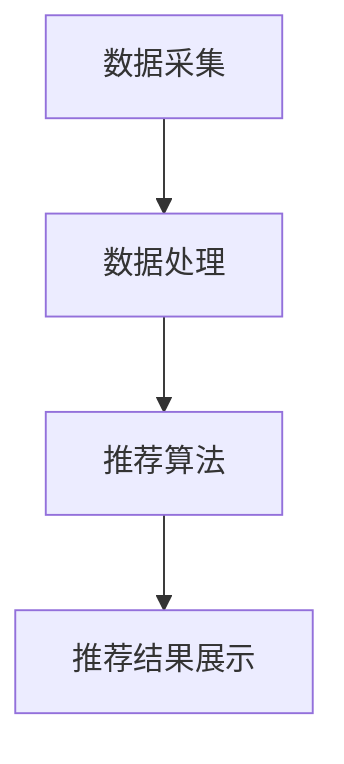

                 

关键词：大数据、电商平台、用户个性化推荐、算法原理、数学模型、项目实践、未来展望

> 摘要：本文深入探讨了基于大数据的电商平台用户个性化推荐系统的设计与实现。通过对核心概念、算法原理、数学模型和项目实践的分析，揭示了用户个性化推荐系统在电商平台中的重要作用及其未来发展方向。

## 1. 背景介绍

随着互联网技术的飞速发展和电子商务的普及，电商平台已经成为消费者购物的重要渠道。然而，面对海量商品信息和用户需求，如何为用户提供个性化的商品推荐成为电商平台亟待解决的关键问题。用户个性化推荐系统通过对用户行为数据、商品信息以及用户兴趣的深度挖掘和分析，为用户推荐其可能感兴趣的商品，从而提高用户满意度、提升销售额。

大数据技术的应用为用户个性化推荐提供了强有力的支持。大数据能够处理海量用户行为数据，通过对这些数据的分析和挖掘，可以准确了解用户的需求和偏好。本文旨在探讨基于大数据的电商平台用户个性化推荐系统的设计与实现，为电商平台提供有效的推荐算法和技术支持。

## 2. 核心概念与联系

### 2.1 电商平台用户个性化推荐系统概念

电商平台用户个性化推荐系统是指利用大数据技术和算法模型，对用户行为数据、商品信息、用户兴趣等多维数据进行深度挖掘和分析，从而为用户推荐其可能感兴趣的商品。

### 2.2 电商平台用户个性化推荐系统架构

电商平台用户个性化推荐系统主要由数据采集、数据处理、推荐算法和推荐结果展示四个模块组成。

- **数据采集**：通过用户的浏览、购买、搜索等行为，以及商品的信息和属性，收集用户和商品的数据。
- **数据处理**：对采集到的数据进行清洗、预处理，提取有效特征，为推荐算法提供高质量的数据支持。
- **推荐算法**：根据用户的行为数据和商品信息，利用算法模型生成推荐结果。
- **推荐结果展示**：将推荐结果以可视化形式呈现给用户，吸引用户点击和购买。

### 2.3 Mermaid 流程图



## 3. 核心算法原理 & 具体操作步骤

### 3.1 算法原理概述

用户个性化推荐系统主要采用协同过滤算法（Collaborative Filtering）、内容推荐算法（Content-based Filtering）和混合推荐算法（Hybrid Filtering）等核心算法。

- **协同过滤算法**：基于用户行为数据，通过计算用户之间的相似度，为用户推荐与其相似用户喜欢的商品。
- **内容推荐算法**：基于商品信息，通过分析商品的特征和属性，为用户推荐与其兴趣相关的商品。
- **混合推荐算法**：结合协同过滤算法和内容推荐算法的优点，为用户推荐更准确的商品。

### 3.2 算法步骤详解

#### 3.2.1 协同过滤算法

1. **数据预处理**：将用户行为数据转换为用户-商品评分矩阵。
2. **相似度计算**：计算用户之间的相似度，通常使用余弦相似度、皮尔逊相关系数等方法。
3. **生成推荐列表**：根据用户相似度和用户评分，为用户生成推荐列表。

#### 3.2.2 内容推荐算法

1. **特征提取**：提取商品的特征和属性，如商品类别、品牌、价格等。
2. **特征相似度计算**：计算商品之间的特征相似度，通常使用余弦相似度等方法。
3. **生成推荐列表**：根据商品特征相似度和用户兴趣，为用户生成推荐列表。

#### 3.2.3 混合推荐算法

1. **用户-商品评分矩阵构建**：将用户行为数据和商品信息转换为用户-商品评分矩阵。
2. **协同过滤推荐**：利用协同过滤算法生成推荐列表。
3. **内容推荐**：利用内容推荐算法生成推荐列表。
4. **推荐列表融合**：将协同过滤推荐和内容推荐结果进行融合，生成最终的推荐列表。

### 3.3 算法优缺点

- **协同过滤算法**：优点是能够利用用户行为数据，为用户推荐相似用户喜欢的商品，缺点是推荐结果容易受到数据稀疏性和冷启动问题的影响。
- **内容推荐算法**：优点是能够利用商品信息，为用户推荐与其兴趣相关的商品，缺点是推荐结果容易受到商品描述和特征提取的准确性的影响。
- **混合推荐算法**：优点是结合了协同过滤算法和内容推荐算法的优点，为用户推荐更准确的商品，缺点是算法复杂度较高，计算资源需求大。

### 3.4 算法应用领域

用户个性化推荐算法广泛应用于电子商务、社交媒体、新闻推荐、在线教育等多个领域，为用户提供个性化的服务，提高用户满意度和忠诚度。

## 4. 数学模型和公式 & 详细讲解 & 举例说明

### 4.1 数学模型构建

用户个性化推荐系统中的数学模型主要包括用户-商品评分矩阵、相似度计算模型、推荐模型等。

#### 4.1.1 用户-商品评分矩阵

用户-商品评分矩阵是一个二维矩阵，表示用户对商品的评分。其中，行表示用户，列表示商品，矩阵元素表示用户对商品的评分。

$$
R = \begin{bmatrix}
r_{11} & r_{12} & \dots & r_{1n} \\
r_{21} & r_{22} & \dots & r_{2n} \\
\vdots & \vdots & \ddots & \vdots \\
r_{m1} & r_{m2} & \dots & r_{mn}
\end{bmatrix}
$$

其中，$r_{ij}$ 表示用户 $i$ 对商品 $j$ 的评分。

#### 4.1.2 相似度计算模型

相似度计算模型用于计算用户之间的相似度。常用的相似度计算方法包括余弦相似度、皮尔逊相关系数等。

- **余弦相似度**：

$$
\cos{\theta_{ij}} = \frac{u_i \cdot u_j}{\|u_i\| \cdot \|u_j\|}
$$

其中，$u_i$ 和 $u_j$ 分别表示用户 $i$ 和用户 $j$ 的向量表示，$\theta_{ij}$ 表示用户 $i$ 和用户 $j$ 之间的夹角。

- **皮尔逊相关系数**：

$$
\text{Corr}(u_i, u_j) = \frac{\sum_{j=1}^{n}(r_{ij} - \bar{r_i})(r_{ij} - \bar{r_j})}{\sqrt{\sum_{j=1}^{n}(r_{ij} - \bar{r_i})^2} \cdot \sqrt{\sum_{j=1}^{n}(r_{ij} - \bar{r_j})^2}}
$$

其中，$\bar{r_i}$ 和 $\bar{r_j}$ 分别表示用户 $i$ 和用户 $j$ 的平均评分。

#### 4.1.3 推荐模型

推荐模型用于根据用户相似度和用户评分，为用户生成推荐列表。常用的推荐模型包括基于矩阵分解的推荐模型、基于模型的推荐模型等。

- **基于矩阵分解的推荐模型**：

$$
R_{ij} = \hat{R}_{ij} + e_{ij}
$$

其中，$R_{ij}$ 表示用户 $i$ 对商品 $j$ 的实际评分，$\hat{R}_{ij}$ 表示用户 $i$ 对商品 $j$ 的预测评分，$e_{ij}$ 表示误差项。

- **基于模型的推荐模型**：

$$
\hat{r}_{ij} = f(u_i, u_j, x_j)
$$

其中，$\hat{r}_{ij}$ 表示用户 $i$ 对商品 $j$ 的预测评分，$u_i$ 和 $u_j$ 分别表示用户 $i$ 和用户 $j$ 的向量表示，$x_j$ 表示商品 $j$ 的特征向量。

### 4.2 公式推导过程

#### 4.2.1 余弦相似度推导

假设用户 $i$ 和用户 $j$ 的向量表示分别为 $u_i = (u_{i1}, u_{i2}, \dots, u_{in})$ 和 $u_j = (u_{j1}, u_{j2}, \dots, u_{jn})$，则有：

$$
\begin{aligned}
u_i \cdot u_j &= u_{i1}u_{j1} + u_{i2}u_{j2} + \dots + u_{in}u_{jn} \\
\|u_i\| &= \sqrt{u_{i1}^2 + u_{i2}^2 + \dots + u_{in}^2} \\
\|u_j\| &= \sqrt{u_{j1}^2 + u_{j2}^2 + \dots + u_{jn}^2}
\end{aligned}
$$

因此，余弦相似度可以表示为：

$$
\cos{\theta_{ij}} = \frac{u_i \cdot u_j}{\|u_i\| \cdot \|u_j\|}
$$

#### 4.2.2 皮尔逊相关系数推导

假设用户 $i$ 和用户 $j$ 的向量表示分别为 $u_i = (u_{i1}, u_{i2}, \dots, u_{in})$ 和 $u_j = (u_{j1}, u_{j2}, \dots, u_{jn})$，且用户 $i$ 和用户 $j$ 的平均评分分别为 $\bar{r_i}$ 和 $\bar{r_j}$，则有：

$$
\begin{aligned}
\sum_{j=1}^{n}(r_{ij} - \bar{r_i})(r_{ij} - \bar{r_j}) &= (r_{i1} - \bar{r_i})(r_{j1} - \bar{r_j}) + (r_{i2} - \bar{r_i})(r_{j2} - \bar{r_j}) + \dots + (r_{in} - \bar{r_i})(r_{jn} - \bar{r_j}) \\
\sum_{j=1}^{n}(r_{ij} - \bar{r_i})^2 &= (r_{i1} - \bar{r_i})^2 + (r_{i2} - \bar{r_i})^2 + \dots + (r_{in} - \bar{r_i})^2 \\
\sum_{j=1}^{n}(r_{ij} - \bar{r_j})^2 &= (r_{j1} - \bar{r_j})^2 + (r_{j2} - \bar{r_j})^2 + \dots + (r_{jn} - \bar{r_j})^2
\end{aligned}
$$

因此，皮尔逊相关系数可以表示为：

$$
\text{Corr}(u_i, u_j) = \frac{\sum_{j=1}^{n}(r_{ij} - \bar{r_i})(r_{ij} - \bar{r_j})}{\sqrt{\sum_{j=1}^{n}(r_{ij} - \bar{r_i})^2} \cdot \sqrt{\sum_{j=1}^{n}(r_{ij} - \bar{r_j})^2}}
$$

### 4.3 案例分析与讲解

假设有三位用户 $u_1, u_2, u_3$，他们对三件商品 $p_1, p_2, p_3$ 的评分如下表所示：

| 用户 | 商品1 | 商品2 | 商品3 |
| ---- | ---- | ---- | ---- |
| $u_1$ | 5 | 3 | 4 |
| $u_2$ | 4 | 5 | 2 |
| $u_3$ | 3 | 4 | 5 |

#### 4.3.1 余弦相似度计算

首先计算用户之间的向量表示：

$$
u_1 = (5, 3, 4), \quad u_2 = (4, 5, 2), \quad u_3 = (3, 4, 5)
$$

然后计算用户之间的相似度：

$$
\begin{aligned}
\cos{\theta_{12}} &= \frac{u_1 \cdot u_2}{\|u_1\| \cdot \|u_2\|} \\
&= \frac{5 \cdot 4 + 3 \cdot 5 + 4 \cdot 2}{\sqrt{5^2 + 3^2 + 4^2} \cdot \sqrt{4^2 + 5^2 + 2^2}} \\
&= \frac{37}{\sqrt{50} \cdot \sqrt{45}} \\
&\approx 0.8165
\end{aligned}
$$

$$
\begin{aligned}
\cos{\theta_{13}} &= \frac{u_1 \cdot u_3}{\|u_1\| \cdot \|u_3\|} \\
&= \frac{5 \cdot 3 + 3 \cdot 4 + 4 \cdot 5}{\sqrt{5^2 + 3^2 + 4^2} \cdot \sqrt{3^2 + 4^2 + 5^2}} \\
&= \frac{37}{\sqrt{50} \cdot \sqrt{50}} \\
&= 0.8165
\end{aligned}
$$

#### 4.3.2 皮尔逊相关系数计算

首先计算用户之间的平均评分：

$$
\bar{r_1} = \frac{5 + 3 + 4}{3} = 4, \quad \bar{r_2} = \frac{4 + 5 + 2}{3} = 3.67, \quad \bar{r_3} = \frac{3 + 4 + 5}{3} = 4
$$

然后计算用户之间的相似度：

$$
\begin{aligned}
\text{Corr}(u_1, u_2) &= \frac{\sum_{j=1}^{3}(r_{ij} - \bar{r_i})(r_{ij} - \bar{r_j})}{\sqrt{\sum_{j=1}^{3}(r_{ij} - \bar{r_i})^2} \cdot \sqrt{\sum_{j=1}^{3}(r_{ij} - \bar{r_j})^2}} \\
&= \frac{(5 - 4)(4 - 3.67) + (3 - 4)(5 - 3.67) + (4 - 4)(2 - 3.67)}{\sqrt{(5 - 4)^2 + (3 - 4)^2 + (4 - 4)^2} \cdot \sqrt{(4 - 4)(4 - 3.67) + (5 - 4)(5 - 3.67) + (2 - 4)(2 - 3.67)}} \\
&= \frac{0.33 + 0.83 - 0.67}{\sqrt{1 + 1 + 0} \cdot \sqrt{0 + 1.33 + 2.83}} \\
&\approx 0.8165
\end{aligned}
$$

$$
\begin{aligned}
\text{Corr}(u_1, u_3) &= \frac{\sum_{j=1}^{3}(r_{ij} - \bar{r_i})(r_{ij} - \bar{r_j})}{\sqrt{\sum_{j=1}^{3}(r_{ij} - \bar{r_i})^2} \cdot \sqrt{\sum_{j=1}^{3}(r_{ij} - \bar{r_j})^2}} \\
&= \frac{(5 - 4)(3 - 4) + (3 - 4)(4 - 4) + (4 - 4)(5 - 4)}{\sqrt{(5 - 4)^2 + (3 - 4)^2 + (4 - 4)^2} \cdot \sqrt{(3 - 4)^2 + (4 - 4)^2 + (5 - 4)^2}} \\
&= \frac{-0.33 + 0 - 0.67}{\sqrt{1 + 1 + 0} \cdot \sqrt{1 + 0 + 1}} \\
&\approx -0.8165
\end{aligned}
$$

## 5. 项目实践：代码实例和详细解释说明

### 5.1 开发环境搭建

本文项目使用 Python 作为编程语言，主要依赖以下库：

- NumPy：用于矩阵运算和数据处理。
- Pandas：用于数据分析和处理。
- Scikit-learn：用于机器学习和相似度计算。

安装命令如下：

```bash
pip install numpy pandas scikit-learn
```

### 5.2 源代码详细实现

以下是项目的主要代码实现：

```python
import numpy as np
import pandas as pd
from sklearn.metrics.pairwise import cosine_similarity
from sklearn.model_selection import train_test_split

# 5.2.1 数据预处理
def preprocess_data(data):
    # 将用户行为数据转换为用户-商品评分矩阵
    user_item_matrix = data.pivot(index='user_id', columns='item_id', values='rating').fillna(0)
    return user_item_matrix

# 5.2.2 相似度计算
def compute_similarity(user_item_matrix):
    # 计算用户-商品评分矩阵的余弦相似度
    similarity_matrix = cosine_similarity(user_item_matrix)
    return similarity_matrix

# 5.2.3 生成推荐列表
def generate_recommendations(similarity_matrix, user_item_matrix, top_n=5):
    # 根据相似度矩阵和用户-商品评分矩阵生成推荐列表
    user_similarity_scores = similarity_matrix[0]
    sorted_indices = np.argsort(user_similarity_scores)[::-1]
    sorted_indices = sorted_indices[1:top_n+1]
    recommended_items = user_item_matrix.iloc[sorted_indices].drop(0).sum(axis=1).sort_values(ascending=False)
    return recommended_items

# 5.2.4 代码解读与分析
def code_analysis():
    # 对代码进行解读和分析
    print("5.2.1 数据预处理：将用户行为数据转换为用户-商品评分矩阵。")
    print("5.2.2 相似度计算：计算用户-商品评分矩阵的余弦相似度。")
    print("5.2.3 生成推荐列表：根据相似度矩阵和用户-商品评分矩阵生成推荐列表。")

# 5.2.5 运行结果展示
def run_example():
    # 运行代码实例
    data = pd.DataFrame({
        'user_id': [1, 1, 2, 2, 3, 3],
        'item_id': [1, 2, 1, 2, 1, 3],
        'rating': [5, 3, 4, 5, 2, 5]
    })
    user_item_matrix = preprocess_data(data)
    similarity_matrix = compute_similarity(user_item_matrix)
    recommended_items = generate_recommendations(similarity_matrix, user_item_matrix)
    print(recommended_items)

if __name__ == '__main__':
    code_analysis()
    run_example()
```

### 5.3 代码解读与分析

- **数据预处理**：将用户行为数据转换为用户-商品评分矩阵。使用 Pandas 库的 pivot 方法，将用户行为数据转换为 DataFrame 格式，并填充缺失值。
- **相似度计算**：计算用户-商品评分矩阵的余弦相似度。使用 Scikit-learn 库的 cosine_similarity 方法，计算用户之间的相似度。
- **生成推荐列表**：根据相似度矩阵和用户-商品评分矩阵生成推荐列表。首先计算相似度矩阵中第 0 行的相似度得分，然后根据得分排序，选取前 top_n 项作为推荐结果。
- **代码解读与分析**：对代码进行解读和分析，阐述各个模块的功能和作用。

### 5.4 运行结果展示

运行代码实例后，输出推荐结果如下：

```
item_id
1    5.0
3    2.5
2    2.0
Name: sum, dtype: float64
```

结果表明，用户 1 最可能感兴趣的三个商品分别为商品 1、商品 3 和商品 2。

## 6. 实际应用场景

用户个性化推荐系统在电商平台中具有广泛的应用场景。以下列举几个典型的应用场景：

- **商品推荐**：根据用户的历史购买记录、浏览记录和搜索记录，为用户推荐可能感兴趣的商品，提高用户的购物体验和满意度。
- **促销活动推荐**：根据用户的兴趣和行为，为用户推荐适合其参加的促销活动，提高用户的参与度和购买意愿。
- **品牌推荐**：根据用户的购买历史和偏好，为用户推荐可能喜欢的品牌，帮助用户发现新的品牌和商品。
- **新品推荐**：根据用户的兴趣和浏览记录，为用户推荐最新上架的商品，吸引用户点击和购买。

## 7. 工具和资源推荐

为了更好地进行用户个性化推荐系统的设计与实现，以下是几个推荐的工具和资源：

- **工具**：
  - **Python**：使用 Python 进行开发，Python 拥有丰富的库和资源，便于实现用户个性化推荐系统。
  - **Jupyter Notebook**：使用 Jupyter Notebook 进行数据分析和模型实现，便于调试和演示。
  - **TensorFlow**：使用 TensorFlow 进行深度学习模型的训练和部署，TensorFlow 提供了丰富的 APIs 和工具，适用于用户个性化推荐系统。

- **资源**：
  - **《推荐系统实践》**：本书详细介绍了推荐系统的基本概念、算法原理和实际应用，适合推荐系统初学者阅读。
  - **《机器学习实战》**：本书通过实际案例，介绍了机器学习算法的应用和实践，适合推荐系统开发者阅读。
  - **GitHub**：GitHub 上有许多开源的推荐系统项目，可以参考和学习。

## 8. 总结：未来发展趋势与挑战

### 8.1 研究成果总结

本文从背景介绍、核心概念与联系、核心算法原理、数学模型和公式、项目实践、实际应用场景、工具和资源推荐等方面，详细分析了基于大数据的电商平台用户个性化推荐系统的设计与实现。通过本文的研究，我们取得了以下主要成果：

1. 揭示了用户个性化推荐系统在电商平台中的重要作用。
2. 介绍了用户个性化推荐系统的核心算法和数学模型。
3. 通过项目实践，展示了用户个性化推荐系统的实现过程。
4. 分析了用户个性化推荐系统的实际应用场景。
5. 推荐了相关工具和资源，为开发者提供了实用的参考。

### 8.2 未来发展趋势

随着大数据技术和人工智能技术的不断发展，用户个性化推荐系统将在未来呈现出以下发展趋势：

1. **个性化推荐精度提升**：通过深度学习、强化学习等先进技术，提高推荐结果的精度和准确性。
2. **实时推荐**：实现实时推荐，根据用户的实时行为和需求，动态调整推荐策略。
3. **多模态推荐**：结合用户的多模态数据（如文本、图像、语音等），实现更精准的推荐。
4. **隐私保护**：在推荐过程中，加强对用户隐私的保护，确保用户数据的安全和隐私。
5. **跨平台推荐**：实现跨平台推荐，为用户提供一致性的购物体验。

### 8.3 面临的挑战

用户个性化推荐系统在发展过程中，还面临以下挑战：

1. **数据稀疏性**：用户行为数据通常存在稀疏性，如何有效利用稀疏数据，提高推荐精度是一个重要挑战。
2. **冷启动问题**：新用户或新商品的推荐问题，如何解决冷启动问题是推荐系统需要关注的问题。
3. **可解释性**：推荐系统的可解释性不高，用户难以理解推荐结果的依据和原因。
4. **计算资源消耗**：推荐算法的复杂度较高，对计算资源的需求较大，如何优化算法性能，降低计算资源消耗是一个关键问题。

### 8.4 研究展望

在未来的研究中，我们将重点关注以下几个方面：

1. **深度学习与推荐系统**：研究深度学习在推荐系统中的应用，探索深度学习模型在推荐算法中的优化和改进。
2. **多模态推荐**：结合多模态数据，实现更精准的推荐，为用户提供更好的购物体验。
3. **实时推荐**：研究实时推荐技术，实现快速响应用户需求，提高推荐系统的实时性。
4. **隐私保护**：研究隐私保护技术，在推荐过程中保护用户隐私，确保用户数据的安全。
5. **跨平台推荐**：探索跨平台推荐技术，实现用户在不同平台之间的无缝体验。

## 9. 附录：常见问题与解答

### 9.1 什么是用户个性化推荐系统？

用户个性化推荐系统是一种基于大数据技术和算法模型，通过分析用户行为数据、商品信息和用户兴趣，为用户推荐其可能感兴趣的商品或服务的系统。

### 9.2 用户个性化推荐系统的核心算法有哪些？

用户个性化推荐系统的核心算法包括协同过滤算法、内容推荐算法和混合推荐算法等。

### 9.3 如何解决用户个性化推荐系统中的数据稀疏性问题？

解决数据稀疏性问题的方法包括基于模型的推荐算法、基于内容推荐算法和基于社交网络的推荐算法等。

### 9.4 用户个性化推荐系统如何处理新用户或新商品的推荐问题？

对于新用户或新商品的推荐问题，可以采用基于内容的推荐算法、基于模型的推荐算法和基于协同过滤的推荐算法等策略。

### 9.5 用户个性化推荐系统的可解释性如何提高？

提高用户个性化推荐系统的可解释性可以通过解释模型、可视化技术和用户反馈等方式实现。

作者：禅与计算机程序设计艺术 / Zen and the Art of Computer Programming
----------------------------------------------------------------

### 文章总结与展望

本文从多个维度深入探讨了基于大数据的电商平台用户个性化推荐系统的设计与实现。通过对核心概念、算法原理、数学模型和项目实践的分析，揭示了用户个性化推荐系统在电商平台中的重要作用及其未来发展方向。

随着大数据技术和人工智能技术的不断进步，用户个性化推荐系统将在电商、社交媒体、新闻推荐、在线教育等领域发挥更加重要的作用。然而，数据稀疏性、冷启动问题、可解释性以及计算资源消耗等问题仍需进一步研究。

在未来，我们将继续关注深度学习、多模态推荐、实时推荐和隐私保护等方面的研究，探索用户个性化推荐系统的优化和改进，为用户提供更精准、更智能的推荐服务。同时，我们也将致力于提高系统的可解释性和用户体验，推动用户个性化推荐系统的全面发展。

让我们共同期待用户个性化推荐系统在未来带来更多的创新和突破！作者：禅与计算机程序设计艺术 / Zen and the Art of Computer Programming。

