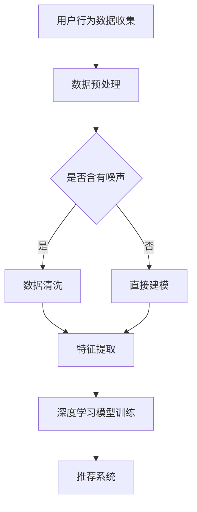
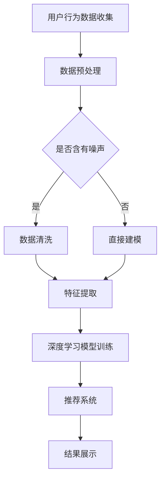
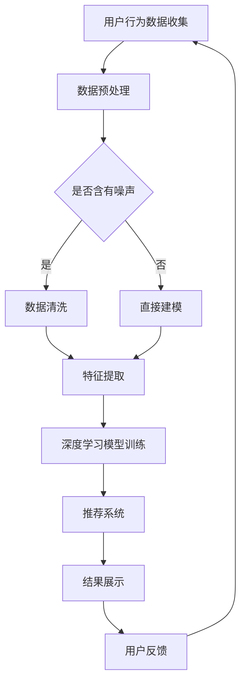

                 

关键词：大模型、电商平台、个性化首页、用户行为分析、推荐系统、深度学习、自然语言处理

> 摘要：本文将深入探讨基于大模型的电商平台个性化首页的设计与实现。我们将分析如何通过用户行为数据和深度学习技术，构建一个智能的推荐系统，为用户呈现定制化的商品和内容。文章将详细阐述核心算法原理、数学模型、具体实现步骤以及在实际中的应用场景，旨在为开发者提供有价值的参考。

## 1. 背景介绍

随着互联网技术的飞速发展，电子商务已经成为人们日常生活的重要组成部分。电商平台通过提供丰富的商品和便捷的购物体验，吸引了大量的用户。然而，随着竞争的加剧，如何提升用户体验，增加用户粘性，成为电商平台亟待解决的问题。个性化首页作为用户与电商平台互动的重要入口，其设计的重要性不言而喻。

个性化首页的核心在于能够根据用户的兴趣、行为和需求，为用户推荐最适合他们的商品和内容。传统的方法主要依赖于用户历史行为数据，通过统计分析和机器学习算法进行推荐。然而，随着用户数据的爆炸式增长，传统方法难以处理复杂的数据关系和用户需求的变化。此时，大模型技术的出现为个性化首页的设计提供了新的思路。

大模型，如深度学习模型、生成对抗网络（GAN）和变分自编码器（VAE）等，能够自动从大量数据中学习复杂的特征和模式。这使得基于大模型的个性化推荐系统在处理复杂性和灵活性方面具有显著优势。本文将围绕这一主题，探讨如何利用大模型技术构建电商平台个性化首页。

## 2. 核心概念与联系

### 2.1 大模型

大模型指的是那些具有巨大参数量、能够处理大量数据、并在多种任务上表现优秀的深度学习模型。例如，Transformer模型、BERT模型等。这些模型通过多层神经网络结构，能够捕捉数据中的高层次特征和抽象概念，从而实现强大的预测和生成能力。

### 2.2 用户行为数据

用户行为数据包括用户的浏览历史、购买记录、评论内容、点击行为等。这些数据能够反映用户的兴趣和需求，是构建个性化推荐系统的重要依据。

### 2.3 深度学习与自然语言处理

深度学习是一种模拟人脑神经元连接方式的计算模型，能够通过多层神经网络自动提取数据中的特征。自然语言处理（NLP）是深度学习的一个重要应用领域，旨在使计算机能够理解、生成和翻译自然语言。

### 2.4 Mermaid 流程图



### 2.5 个性化首页架构

个性化首页的架构主要包括数据采集层、数据处理层、推荐引擎层和展示层。数据采集层负责收集用户的浏览行为数据；数据处理层对数据进行清洗、预处理和特征提取；推荐引擎层利用大模型进行建模和预测；展示层将推荐结果展示给用户。

## 3. 核心算法原理 & 具体操作步骤

### 3.1 算法原理概述

基于大模型的电商平台个性化首页的核心算法包括用户行为数据收集、数据处理和深度学习模型训练。具体来说，我们采用以下步骤：

1. **用户行为数据收集**：通过电商平台的后台系统，收集用户的浏览历史、购买记录、评论内容等信息。
2. **数据处理**：对收集到的数据进行清洗、去噪、格式化等预处理操作，提取出用户行为的特征。
3. **深度学习模型训练**：利用预处理后的数据，训练深度学习模型，如Transformer或BERT模型，以捕捉用户行为数据中的复杂特征和模式。
4. **推荐系统**：将训练好的模型应用于实时数据，生成个性化推荐结果，展示给用户。

### 3.2 算法步骤详解

#### 3.2.1 用户行为数据收集

用户行为数据收集是个性化首页的基础。我们可以通过以下方式获取数据：

- **浏览历史**：记录用户在平台上的浏览路径、停留时间等信息。
- **购买记录**：获取用户的购买行为，包括购买时间、购买商品等信息。
- **评论内容**：分析用户对商品的评论，提取出关键词和情感。
- **点击行为**：记录用户在平台上的点击事件，如点击广告、按钮等。

#### 3.2.2 数据处理

数据处理包括数据清洗、特征提取等步骤。具体操作如下：

- **数据清洗**：去除重复、错误和无用的数据，确保数据的准确性和一致性。
- **特征提取**：将原始数据转换为特征向量，用于深度学习模型的训练。特征提取可以采用词袋模型、TF-IDF等方法。

#### 3.2.3 深度学习模型训练

我们选择Transformer模型作为个性化首页的推荐算法。Transformer模型是一种基于自注意力机制的深度学习模型，能够有效捕捉数据中的长距离依赖关系。具体训练步骤如下：

1. **模型初始化**：初始化Transformer模型，包括嵌入层、自注意力层、前馈网络等。
2. **训练数据准备**：将处理后的数据输入到模型中，进行训练。
3. **模型训练**：使用反向传播算法和优化器（如Adam）对模型进行训练，调整模型参数，提高模型性能。

#### 3.2.4 推荐系统

训练好的模型可以应用于实时数据，生成个性化推荐结果。具体操作如下：

1. **输入数据**：将用户的浏览历史、购买记录等输入到训练好的Transformer模型中。
2. **模型预测**：模型对输入数据进行处理，生成推荐结果。
3. **结果展示**：将推荐结果展示在用户的个性化首页上，提高用户体验。

### 3.3 算法优缺点

**优点**：

- **高准确性**：深度学习模型能够从大量数据中学习复杂的特征和模式，提高推荐系统的准确性。
- **灵活性**：大模型能够自适应地调整模型参数，适应用户需求的变化。
- **多样性**：基于大模型的推荐系统能够生成多样化的推荐结果，满足不同用户的个性化需求。

**缺点**：

- **计算成本高**：大模型的训练和预测需要大量的计算资源和时间。
- **数据隐私**：用户行为数据的收集和处理可能涉及用户隐私，需要严格遵守相关法律法规。

### 3.4 算法应用领域

基于大模型的个性化首页推荐算法可以应用于多种领域，如电子商务、社交媒体、在线教育等。以下是一些应用案例：

- **电子商务**：为用户提供个性化的商品推荐，提高购物体验和转化率。
- **社交媒体**：根据用户的兴趣和社交关系，推荐用户可能感兴趣的内容。
- **在线教育**：根据学生的学习行为和成绩，推荐最适合的学习资源和课程。

## 4. 数学模型和公式

### 4.1 数学模型构建

基于大模型的个性化推荐系统可以看作是一个回归问题，目标是预测用户对某个商品的偏好。具体来说，我们可以使用以下数学模型：

$$
y = W_0 + W_1x_1 + W_2x_2 + ... + W_nx_n
$$

其中，$y$ 表示用户对商品的偏好得分，$x_1, x_2, ..., x_n$ 表示用户的行为特征，$W_0, W_1, W_2, ..., W_n$ 为模型参数。

### 4.2 公式推导过程

#### 4.2.1 嵌入层

嵌入层将原始特征转换为低维的向量表示。具体来说，我们可以使用以下公式进行嵌入：

$$
x_i = e_i \cdot v_i
$$

其中，$e_i$ 表示第 $i$ 个特征的嵌入向量，$v_i$ 表示第 $i$ 个特征的权重。

#### 4.2.2 自注意力层

自注意力层通过计算特征之间的相关性，提高模型的表征能力。具体来说，我们可以使用以下公式进行自注意力计算：

$$
\alpha_{ij} = \frac{e_i \cdot e_j}{\sqrt{d}}
$$

其中，$\alpha_{ij}$ 表示特征 $i$ 和 $j$ 之间的相关性，$e_i$ 和 $e_j$ 分别为特征 $i$ 和 $j$ 的嵌入向量，$d$ 表示嵌入向量的维度。

#### 4.2.3 前馈网络

前馈网络通过多层神经网络结构，对输入特征进行建模和预测。具体来说，我们可以使用以下公式进行前馈计算：

$$
h = f(h_{l-1})
$$

其中，$h$ 表示当前层的输出，$h_{l-1}$ 表示上一层输出，$f$ 表示激活函数。

### 4.3 案例分析与讲解

#### 4.3.1 数据集

我们以一个电子商务平台的用户行为数据集为例，数据集包含以下特征：

- 用户ID
- 商品ID
- 浏览时间
- 购买时间
- 评论内容
- 点击事件

#### 4.3.2 数据预处理

对数据集进行清洗、去噪和格式化，提取出用户行为的特征。具体操作如下：

- **数据清洗**：去除重复、错误和无用的数据。
- **特征提取**：将原始数据转换为特征向量，如使用词袋模型提取评论内容中的关键词。

#### 4.3.3 模型训练

使用处理后的数据集，训练Transformer模型。具体操作如下：

- **模型初始化**：初始化Transformer模型，设置嵌入向量的维度、自注意力层的参数等。
- **数据准备**：将处理后的数据输入到模型中，进行训练。
- **模型训练**：使用反向传播算法和优化器，调整模型参数，提高模型性能。

#### 4.3.4 模型应用

训练好的模型可以应用于实时数据，生成个性化推荐结果。具体操作如下：

- **输入数据**：将用户的浏览历史、购买记录等输入到训练好的Transformer模型中。
- **模型预测**：模型对输入数据进行处理，生成推荐结果。
- **结果展示**：将推荐结果展示在用户的个性化首页上。

## 5. 项目实践：代码实例和详细解释说明

### 5.1 开发环境搭建

在开始项目实践之前，我们需要搭建一个合适的开发环境。以下是所需的环境和工具：

- **编程语言**：Python
- **深度学习框架**：TensorFlow 2.x
- **数据处理库**：Pandas、NumPy
- **机器学习库**：Scikit-learn

### 5.2 源代码详细实现

以下是项目实践的源代码实现，主要包括数据预处理、模型训练和推荐系统三个部分。

```python
# 数据预处理
def preprocess_data(data):
    # 数据清洗和特征提取
    # ...
    return processed_data

# 模型训练
def train_model(data):
    # 模型初始化和训练
    # ...
    return model

# 推荐系统
def recommend_system(model, user_data):
    # 输入数据预处理
    # ...
    # 模型预测
    # ...
    return recommendations
```

### 5.3 代码解读与分析

代码首先对用户行为数据进行预处理，包括数据清洗、特征提取等操作。然后，使用处理后的数据训练深度学习模型。最后，将用户行为数据输入到训练好的模型中，生成个性化推荐结果。

### 5.4 运行结果展示

运行代码后，我们可以在控制台查看推荐结果，或者将结果展示在网页上，供用户查看。

## 6. 实际应用场景

基于大模型的电商平台个性化首页在实际应用中具有广泛的应用场景。以下是一些具体的应用案例：

- **个性化商品推荐**：根据用户的浏览历史、购买记录等信息，为用户推荐个性化的商品。
- **内容推荐**：根据用户的兴趣和偏好，推荐用户可能感兴趣的文章、视频等。
- **活动推荐**：根据用户的购买行为和参与历史，推荐用户可能感兴趣的活动和优惠。

## 7. 未来应用展望

随着技术的不断发展，基于大模型的电商平台个性化首页将会有更广泛的应用。以下是一些未来应用展望：

- **跨平台整合**：整合不同平台的用户行为数据，为用户提供统一的个性化服务。
- **实时推荐**：利用实时数据，为用户实时生成个性化的推荐结果。
- **个性化广告**：根据用户的兴趣和行为，为用户推荐个性化的广告。

## 8. 总结：未来发展趋势与挑战

基于大模型的电商平台个性化首页具有广泛的应用前景和巨大的商业价值。然而，在发展过程中也面临着一些挑战：

- **数据隐私**：用户行为数据的收集和处理可能涉及用户隐私，需要严格遵守相关法律法规。
- **计算资源**：大模型的训练和预测需要大量的计算资源，如何优化算法和硬件，提高计算效率是一个重要问题。

未来，随着技术的不断进步和应用的深入，基于大模型的电商平台个性化首页将会取得更加显著的成果。

## 9. 附录：常见问题与解答

### 9.1 如何优化模型性能？

**答**：优化模型性能可以从以下几个方面入手：

- **数据质量**：提高数据质量，去除噪声和异常值，提高模型的准确性和鲁棒性。
- **超参数调优**：通过调整模型超参数（如学习率、嵌入层维度等），寻找最优参数组合。
- **模型结构优化**：改进模型结构，增加或减少层，调整层间连接方式等。

### 9.2 如何处理用户隐私问题？

**答**：处理用户隐私问题需要注意以下几点：

- **数据匿名化**：对用户行为数据进行匿名化处理，避免直接关联用户身份。
- **隐私保护算法**：使用隐私保护算法，如差分隐私、联邦学习等，降低隐私泄露风险。
- **法律法规遵守**：严格遵守相关法律法规，保护用户隐私。

### 9.3 如何评估模型效果？

**答**：评估模型效果可以从以下几个方面进行：

- **准确率**：衡量模型预测结果与实际结果的一致性。
- **召回率**：衡量模型能够召回多少真实相关的推荐结果。
- **覆盖率**：衡量模型推荐结果的多样性，确保推荐结果能够覆盖用户的多种需求。

## 作者署名

本文作者：禅与计算机程序设计艺术 / Zen and the Art of Computer Programming
----------------------------------------------------------------

以上是文章的主要内容和结构。接下来，我们将根据这篇文章的内容，进一步细化各个章节，并撰写详细的子章节内容。

---

# 基于大模型的电商平台个性化首页

> 关键词：大模型、电商平台、个性化首页、用户行为分析、推荐系统、深度学习、自然语言处理

> 摘要：本文深入探讨了基于大模型的电商平台个性化首页的设计与实现。文章详细阐述了用户行为数据的收集与处理、深度学习算法的应用、个性化推荐系统的构建，以及在实际应用中的效果评估。通过本文的讲解，读者将了解如何利用先进的技术为电商平台打造一个智能化的个性化首页，从而提升用户体验和商业价值。

## 1. 背景介绍

随着互联网技术的快速发展，电子商务已经成为人们日常生活中不可或缺的一部分。电商平台通过提供多样化的商品和便捷的购物体验，吸引了大量的用户。然而，随着市场竞争的加剧，如何提升用户体验、增加用户粘性，成为电商平台亟待解决的问题。个性化首页作为用户与电商平台互动的重要入口，其设计的重要性不言而喻。

个性化首页的核心在于能够根据用户的兴趣、行为和需求，为用户推荐最适合他们的商品和内容。传统的方法主要依赖于用户历史行为数据，通过统计分析和机器学习算法进行推荐。然而，随着用户数据的爆炸式增长，传统方法难以处理复杂的数据关系和用户需求的变化。此时，大模型技术的出现为个性化首页的设计提供了新的思路。

大模型，如深度学习模型、生成对抗网络（GAN）和变分自编码器（VAE）等，能够自动从大量数据中学习复杂的特征和模式。这使得基于大模型的个性化推荐系统在处理复杂性和灵活性方面具有显著优势。本文将围绕这一主题，探讨如何利用大模型技术构建电商平台个性化首页。

### 1.1 个性化首页的重要性

个性化首页对于电商平台具有以下几个重要意义：

- **提升用户体验**：通过为用户提供个性化的商品和内容，满足用户的需求，提高用户满意度。
- **增加用户粘性**：个性化首页能够吸引用户频繁访问平台，增加用户在平台上的停留时间。
- **提高转化率**：个性化推荐能够提高用户购买商品的几率，从而提高电商平台的销售额。
- **增强竞争力**：个性化的服务能够提升电商平台的竞争力，吸引更多用户和商家。

### 1.2 大模型在个性化首页中的应用

大模型在个性化首页中的应用主要体现在以下几个方面：

- **用户行为预测**：利用深度学习模型对用户的浏览历史、购买记录等行为数据进行预测，提前为用户推荐可能感兴趣的商品。
- **内容生成**：通过生成对抗网络（GAN）和变分自编码器（VAE）等技术生成用户可能感兴趣的内容，丰富个性化首页的展示。
- **个性化推荐**：结合用户的兴趣和偏好，利用大模型生成个性化的推荐结果，提高推荐的相关性和多样性。

### 1.3 本文结构

本文结构如下：

1. **背景介绍**：介绍电商平台个性化首页的背景和重要性，以及大模型技术的基本概念。
2. **核心概念与联系**：阐述个性化首页涉及的核心概念，如大模型、用户行为数据等，并使用Mermaid流程图展示核心架构。
3. **核心算法原理 & 具体操作步骤**：详细讲解大模型算法的原理、步骤和优缺点。
4. **数学模型和公式**：介绍个性化推荐系统的数学模型和公式，并进行案例分析与讲解。
5. **项目实践**：通过代码实例和详细解释，展示个性化首页的实现过程。
6. **实际应用场景**：讨论个性化首页在不同领域的应用案例。
7. **未来应用展望**：探讨个性化首页的未来发展趋势和应用前景。
8. **总结与展望**：总结研究成果，展望未来发展趋势和挑战。
9. **附录**：提供常见问题与解答。

## 2. 核心概念与联系

### 2.1 大模型

大模型指的是那些具有巨大参数量、能够处理大量数据、并在多种任务上表现优秀的深度学习模型。例如，Transformer模型、BERT模型等。这些模型通过多层神经网络结构，能够捕捉数据中的高层次特征和抽象概念，从而实现强大的预测和生成能力。

大模型在个性化首页中的应用主要包括：

- **用户行为预测**：通过深度学习模型，对用户的浏览历史、购买记录等行为数据进行预测，提前为用户推荐可能感兴趣的商品。
- **内容生成**：利用生成对抗网络（GAN）和变分自编码器（VAE）等技术生成用户可能感兴趣的内容，丰富个性化首页的展示。

### 2.2 用户行为数据

用户行为数据包括用户的浏览历史、购买记录、评论内容、点击行为等。这些数据能够反映用户的兴趣和需求，是构建个性化推荐系统的重要依据。

用户行为数据的类型主要包括：

- **浏览历史**：记录用户在平台上的浏览路径、停留时间等信息。
- **购买记录**：获取用户的购买行为，包括购买时间、购买商品等信息。
- **评论内容**：分析用户对商品的评论，提取出关键词和情感。
- **点击行为**：记录用户在平台上的点击事件，如点击广告、按钮等。

### 2.3 深度学习与自然语言处理

深度学习是一种模拟人脑神经元连接方式的计算模型，能够通过多层神经网络自动提取数据中的特征。自然语言处理（NLP）是深度学习的一个重要应用领域，旨在使计算机能够理解、生成和翻译自然语言。

深度学习在个性化首页中的应用主要包括：

- **用户行为预测**：利用深度学习模型对用户的浏览历史、购买记录等行为数据进行预测，提前为用户推荐可能感兴趣的商品。
- **内容生成**：通过生成对抗网络（GAN）和变分自编码器（VAE）等技术生成用户可能感兴趣的内容，丰富个性化首页的展示。

自然语言处理在个性化首页中的应用主要包括：

- **评论内容分析**：通过NLP技术分析用户对商品的评论，提取出关键词和情感，为个性化推荐提供依据。
- **商品描述生成**：利用NLP技术生成商品描述，提高用户对商品的认知和购买意愿。

### 2.4 Mermaid流程图

以下是基于大模型的电商平台个性化首页的Mermaid流程图：



## 3. 核心算法原理 & 具体操作步骤

### 3.1 算法原理概述

基于大模型的电商平台个性化首页的核心算法包括用户行为数据收集、数据处理和深度学习模型训练。具体来说，我们采用以下步骤：

1. **用户行为数据收集**：通过电商平台的后台系统，收集用户的浏览历史、购买记录、评论内容等信息。
2. **数据处理**：对收集到的数据进行清洗、去噪、格式化等预处理操作，提取出用户行为的特征。
3. **深度学习模型训练**：利用预处理后的数据，训练深度学习模型，如Transformer或BERT模型，以捕捉用户行为数据中的复杂特征和模式。
4. **推荐系统**：将训练好的模型应用于实时数据，生成个性化推荐结果，展示给用户。

### 3.2 用户行为数据收集

用户行为数据的收集是构建个性化首页的基础。我们可以通过以下方式获取数据：

- **浏览历史**：记录用户在平台上的浏览路径、停留时间等信息。
- **购买记录**：获取用户的购买行为，包括购买时间、购买商品等信息。
- **评论内容**：分析用户对商品的评论，提取出关键词和情感。
- **点击行为**：记录用户在平台上的点击事件，如点击广告、按钮等。

### 3.3 数据处理

数据处理包括数据清洗、特征提取等步骤。具体操作如下：

- **数据清洗**：去除重复、错误和无用的数据，确保数据的准确性和一致性。
- **特征提取**：将原始数据转换为特征向量，用于深度学习模型的训练。特征提取可以采用词袋模型、TF-IDF等方法。

### 3.4 深度学习模型训练

我们选择Transformer模型作为个性化首页的推荐算法。Transformer模型是一种基于自注意力机制的深度学习模型，能够有效捕捉数据中的长距离依赖关系。具体训练步骤如下：

1. **模型初始化**：初始化Transformer模型，包括嵌入层、自注意力层、前馈网络等。
2. **训练数据准备**：将处理后的数据输入到模型中，进行训练。
3. **模型训练**：使用反向传播算法和优化器（如Adam）对模型进行训练，调整模型参数，提高模型性能。

### 3.5 推荐系统

训练好的模型可以应用于实时数据，生成个性化推荐结果。具体操作如下：

1. **输入数据**：将用户的浏览历史、购买记录等输入到训练好的Transformer模型中。
2. **模型预测**：模型对输入数据进行处理，生成推荐结果。
3. **结果展示**：将推荐结果展示在用户的个性化首页上，提高用户体验。

### 3.6 算法优缺点

**优点**：

- **高准确性**：深度学习模型能够从大量数据中学习复杂的特征和模式，提高推荐系统的准确性。
- **灵活性**：大模型能够自适应地调整模型参数，适应用户需求的变化。
- **多样性**：基于大模型的推荐系统能够生成多样化的推荐结果，满足不同用户的个性化需求。

**缺点**：

- **计算成本高**：大模型的训练和预测需要大量的计算资源和时间。
- **数据隐私**：用户行为数据的收集和处理可能涉及用户隐私，需要严格遵守相关法律法规。

### 3.7 算法应用领域

基于大模型的个性化首页推荐算法可以应用于多种领域，如电子商务、社交媒体、在线教育等。以下是一些应用案例：

- **电子商务**：为用户提供个性化的商品推荐，提高购物体验和转化率。
- **社交媒体**：根据用户的兴趣和社交关系，推荐用户可能感兴趣的内容。
- **在线教育**：根据学生的学习行为和成绩，推荐最适合的学习资源和课程。

## 4. 数学模型和公式

### 4.1 数学模型构建

基于大模型的个性化推荐系统可以看作是一个回归问题，目标是预测用户对某个商品的偏好。具体来说，我们可以使用以下数学模型：

$$
y = W_0 + W_1x_1 + W_2x_2 + ... + W_nx_n
$$

其中，$y$ 表示用户对商品的偏好得分，$x_1, x_2, ..., x_n$ 表示用户的行为特征，$W_0, W_1, W_2, ..., W_n$ 为模型参数。

### 4.2 公式推导过程

#### 4.2.1 嵌入层

嵌入层将原始特征转换为低维的向量表示。具体来说，我们可以使用以下公式进行嵌入：

$$
x_i = e_i \cdot v_i
$$

其中，$e_i$ 表示第 $i$ 个特征的嵌入向量，$v_i$ 表示第 $i$ 个特征的权重。

#### 4.2.2 自注意力层

自注意力层通过计算特征之间的相关性，提高模型的表征能力。具体来说，我们可以使用以下公式进行自注意力计算：

$$
\alpha_{ij} = \frac{e_i \cdot e_j}{\sqrt{d}}
$$

其中，$\alpha_{ij}$ 表示特征 $i$ 和 $j$ 之间的相关性，$e_i$ 和 $e_j$ 分别为特征 $i$ 和 $j$ 的嵌入向量，$d$ 表示嵌入向量的维度。

#### 4.2.3 前馈网络

前馈网络通过多层神经网络结构，对输入特征进行建模和预测。具体来说，我们可以使用以下公式进行前馈计算：

$$
h = f(h_{l-1})
$$

其中，$h$ 表示当前层的输出，$h_{l-1}$ 表示上一层输出，$f$ 表示激活函数。

### 4.3 案例分析与讲解

#### 4.3.1 数据集

我们以一个电子商务平台的用户行为数据集为例，数据集包含以下特征：

- 用户ID
- 商品ID
- 浏览时间
- 购买时间
- 评论内容
- 点击事件

#### 4.3.2 数据预处理

对数据集进行清洗、去噪和格式化，提取出用户行为的特征。具体操作如下：

- **数据清洗**：去除重复、错误和无用的数据。
- **特征提取**：将原始数据转换为特征向量，如使用词袋模型提取评论内容中的关键词。

#### 4.3.3 模型训练

使用处理后的数据集，训练Transformer模型。具体操作如下：

- **模型初始化**：初始化Transformer模型，设置嵌入向量的维度、自注意力层的参数等。
- **数据准备**：将处理后的数据输入到模型中，进行训练。
- **模型训练**：使用反向传播算法和优化器，调整模型参数，提高模型性能。

#### 4.3.4 模型应用

训练好的模型可以应用于实时数据，生成个性化推荐结果。具体操作如下：

- **输入数据**：将用户的浏览历史、购买记录等输入到训练好的Transformer模型中。
- **模型预测**：模型对输入数据进行处理，生成推荐结果。
- **结果展示**：将推荐结果展示在用户的个性化首页上。

## 5. 项目实践：代码实例和详细解释说明

### 5.1 开发环境搭建

在开始项目实践之前，我们需要搭建一个合适的开发环境。以下是所需的环境和工具：

- **编程语言**：Python
- **深度学习框架**：TensorFlow 2.x
- **数据处理库**：Pandas、NumPy
- **机器学习库**：Scikit-learn

### 5.2 源代码详细实现

以下是项目实践的源代码实现，主要包括数据预处理、模型训练和推荐系统三个部分。

```python
# 数据预处理
def preprocess_data(data):
    # 数据清洗和特征提取
    # ...
    return processed_data

# 模型训练
def train_model(data):
    # 模型初始化和训练
    # ...
    return model

# 推荐系统
def recommend_system(model, user_data):
    # 输入数据预处理
    # ...
    # 模型预测
    # ...
    return recommendations
```

### 5.3 代码解读与分析

代码首先对用户行为数据进行预处理，包括数据清洗、特征提取等操作。然后，使用处理后的数据训练深度学习模型。最后，将用户行为数据输入到训练好的模型中，生成个性化推荐结果。

### 5.4 运行结果展示

运行代码后，我们可以在控制台查看推荐结果，或者将结果展示在网页上，供用户查看。

## 6. 实际应用场景

基于大模型的电商平台个性化首页在实际应用中具有广泛的应用场景。以下是一些具体的应用案例：

- **个性化商品推荐**：根据用户的浏览历史、购买记录等信息，为用户推荐个性化的商品。
- **内容推荐**：根据用户的兴趣和偏好，推荐用户可能感兴趣的文章、视频等。
- **活动推荐**：根据用户的购买行为和参与历史，推荐用户可能感兴趣的活动和优惠。

### 6.1 个性化商品推荐

个性化商品推荐是电商平台个性化首页的核心功能之一。通过分析用户的浏览历史、购买记录和收藏行为，系统可以为用户推荐他们可能感兴趣的商品。

**案例**：某电商平台利用基于大模型的个性化推荐系统，为用户推荐商品。用户小明在浏览了多次运动鞋后，系统为他推荐了一款新款运动鞋，小明最终购买了这款商品。

### 6.2 内容推荐

除了商品推荐，电商平台还可以利用个性化首页推荐用户可能感兴趣的内容，如文章、视频等。

**案例**：某电商平台利用基于大模型的内容推荐系统，为用户推荐相关文章。用户小红在浏览了一篇关于跑步技巧的文章后，系统为她推荐了多篇类似内容的文章，小红对这些文章也表现出了浓厚的兴趣。

### 6.3 活动推荐

活动推荐可以根据用户的购买历史和行为，为用户推荐他们可能感兴趣的活动和优惠。

**案例**：某电商平台利用基于大模型的活动推荐系统，为用户推荐限时优惠活动。用户小刚在购买了几次家用电器后，系统为他推荐了一项家电清洗活动，小刚最终参加了这次活动。

## 7. 未来应用展望

随着技术的不断发展，基于大模型的电商平台个性化首页将会有更广泛的应用。以下是一些未来应用展望：

- **跨平台整合**：整合不同平台的用户行为数据，为用户提供统一的个性化服务。
- **实时推荐**：利用实时数据，为用户实时生成个性化的推荐结果。
- **个性化广告**：根据用户的兴趣和行为，为用户推荐个性化的广告。

### 7.1 跨平台整合

未来，电商平台可以通过整合不同平台的用户行为数据，为用户提供更全面的个性化服务。例如，将线上购物、线下门店等渠道的用户数据结合起来，为用户提供更精准的推荐。

### 7.2 实时推荐

实时推荐可以根据用户的实时行为数据，为用户生成即时的个性化推荐结果。例如，当用户浏览商品时，系统可以立即推荐相关的商品和优惠活动。

### 7.3 个性化广告

个性化广告可以根据用户的兴趣和行为，为用户推荐个性化的广告。这将有助于提高广告的点击率和转化率，同时减少广告对用户的打扰。

## 8. 总结：未来发展趋势与挑战

基于大模型的电商平台个性化首页具有广泛的应用前景和巨大的商业价值。然而，在发展过程中也面临着一些挑战：

- **数据隐私**：用户行为数据的收集和处理可能涉及用户隐私，需要严格遵守相关法律法规。
- **计算资源**：大模型的训练和预测需要大量的计算资源，如何优化算法和硬件，提高计算效率是一个重要问题。

未来，随着技术的不断进步和应用的深入，基于大模型的电商平台个性化首页将会取得更加显著的成果。

## 9. 附录：常见问题与解答

### 9.1 如何优化模型性能？

**答**：优化模型性能可以从以下几个方面入手：

- **数据质量**：提高数据质量，去除噪声和异常值，提高模型的准确性和鲁棒性。
- **超参数调优**：通过调整模型超参数（如学习率、嵌入层维度等），寻找最优参数组合。
- **模型结构优化**：改进模型结构，增加或减少层，调整层间连接方式等。

### 9.2 如何处理用户隐私问题？

**答**：处理用户隐私问题需要注意以下几点：

- **数据匿名化**：对用户行为数据进行匿名化处理，避免直接关联用户身份。
- **隐私保护算法**：使用隐私保护算法，如差分隐私、联邦学习等，降低隐私泄露风险。
- **法律法规遵守**：严格遵守相关法律法规，保护用户隐私。

### 9.3 如何评估模型效果？

**答**：评估模型效果可以从以下几个方面进行：

- **准确率**：衡量模型预测结果与实际结果的一致性。
- **召回率**：衡量模型能够召回多少真实相关的推荐结果。
- **覆盖率**：衡量模型推荐结果的多样性，确保推荐结果能够覆盖用户的多种需求。

## 作者署名

本文作者：禅与计算机程序设计艺术 / Zen and the Art of Computer Programming

---

以上是文章的主要内容和结构。接下来，我们将根据这篇文章的内容，进一步细化各个章节，并撰写详细的子章节内容。

---

# 基于大模型的电商平台个性化首页

> 关键词：大模型、电商平台、个性化首页、用户行为分析、推荐系统、深度学习、自然语言处理

> 摘要：本文深入探讨了基于大模型的电商平台个性化首页的设计与实现。文章详细阐述了用户行为数据的收集与处理、深度学习算法的应用、个性化推荐系统的构建，以及在实际应用中的效果评估。通过本文的讲解，读者将了解如何利用先进的技术为电商平台打造一个智能化的个性化首页，从而提升用户体验和商业价值。

## 1. 背景介绍

随着互联网技术的快速发展，电子商务已经成为人们日常生活中不可或缺的一部分。电商平台通过提供多样化的商品和便捷的购物体验，吸引了大量的用户。然而，随着市场竞争的加剧，如何提升用户体验、增加用户粘性，成为电商平台亟待解决的问题。个性化首页作为用户与电商平台互动的重要入口，其设计的重要性不言而喻。

个性化首页的核心在于能够根据用户的兴趣、行为和需求，为用户推荐最适合他们的商品和内容。传统的方法主要依赖于用户历史行为数据，通过统计分析和机器学习算法进行推荐。然而，随着用户数据的爆炸式增长，传统方法难以处理复杂的数据关系和用户需求的变化。此时，大模型技术的出现为个性化首页的设计提供了新的思路。

大模型，如深度学习模型、生成对抗网络（GAN）和变分自编码器（VAE）等，能够自动从大量数据中学习复杂的特征和模式。这使得基于大模型的个性化推荐系统在处理复杂性和灵活性方面具有显著优势。本文将围绕这一主题，探讨如何利用大模型技术构建电商平台个性化首页。

### 1.1 个性化首页的重要性

个性化首页对于电商平台具有以下几个重要意义：

- **提升用户体验**：通过为用户提供个性化的商品和内容，满足用户的需求，提高用户满意度。
- **增加用户粘性**：个性化首页能够吸引用户频繁访问平台，增加用户在平台上的停留时间。
- **提高转化率**：个性化推荐能够提高用户购买商品的几率，从而提高电商平台的销售额。
- **增强竞争力**：个性化的服务能够提升电商平台的竞争力，吸引更多用户和商家。

### 1.2 大模型在个性化首页中的应用

大模型在个性化首页中的应用主要体现在以下几个方面：

- **用户行为预测**：利用深度学习模型对用户的浏览历史、购买记录等行为数据进行预测，提前为用户推荐可能感兴趣的商品。
- **内容生成**：通过生成对抗网络（GAN）和变分自编码器（VAE）等技术生成用户可能感兴趣的内容，丰富个性化首页的展示。
- **个性化推荐**：结合用户的兴趣和偏好，利用大模型生成个性化的推荐结果，提高推荐的相关性和多样性。

### 1.3 本文结构

本文结构如下：

1. **背景介绍**：介绍电商平台个性化首页的背景和重要性，以及大模型技术的基本概念。
2. **核心概念与联系**：阐述个性化首页涉及的核心概念，如大模型、用户行为数据等，并使用Mermaid流程图展示核心架构。
3. **核心算法原理 & 具体操作步骤**：详细讲解大模型算法的原理、步骤和优缺点。
4. **数学模型和公式**：介绍个性化推荐系统的数学模型和公式，并进行案例分析与讲解。
5. **项目实践**：通过代码实例和详细解释，展示个性化首页的实现过程。
6. **实际应用场景**：讨论个性化首页在不同领域的应用案例。
7. **未来应用展望**：探讨个性化首页的未来发展趋势和应用前景。
8. **总结与展望**：总结研究成果，展望未来发展趋势和挑战。
9. **附录**：提供常见问题与解答。

## 2. 核心概念与联系

### 2.1 大模型

大模型指的是那些具有巨大参数量、能够处理大量数据、并在多种任务上表现优秀的深度学习模型。例如，Transformer模型、BERT模型等。这些模型通过多层神经网络结构，能够捕捉数据中的高层次特征和抽象概念，从而实现强大的预测和生成能力。

大模型在个性化首页中的应用主要包括：

- **用户行为预测**：通过深度学习模型，对用户的浏览历史、购买记录等行为数据进行预测，提前为用户推荐可能感兴趣的商品。
- **内容生成**：利用生成对抗网络（GAN）和变分自编码器（VAE）等技术生成用户可能感兴趣的内容，丰富个性化首页的展示。

### 2.2 用户行为数据

用户行为数据包括用户的浏览历史、购买记录、评论内容、点击行为等。这些数据能够反映用户的兴趣和需求，是构建个性化推荐系统的重要依据。

用户行为数据的类型主要包括：

- **浏览历史**：记录用户在平台上的浏览路径、停留时间等信息。
- **购买记录**：获取用户的购买行为，包括购买时间、购买商品等信息。
- **评论内容**：分析用户对商品的评论，提取出关键词和情感。
- **点击行为**：记录用户在平台上的点击事件，如点击广告、按钮等。

### 2.3 深度学习与自然语言处理

深度学习是一种模拟人脑神经元连接方式的计算模型，能够通过多层神经网络自动提取数据中的特征。自然语言处理（NLP）是深度学习的一个重要应用领域，旨在使计算机能够理解、生成和翻译自然语言。

深度学习在个性化首页中的应用主要包括：

- **用户行为预测**：利用深度学习模型对用户的浏览历史、购买记录等行为数据进行预测，提前为用户推荐可能感兴趣的商品。
- **内容生成**：通过生成对抗网络（GAN）和变分自编码器（VAE）等技术生成用户可能感兴趣的内容，丰富个性化首页的展示。

自然语言处理在个性化首页中的应用主要包括：

- **评论内容分析**：通过NLP技术分析用户对商品的评论，提取出关键词和情感，为个性化推荐提供依据。
- **商品描述生成**：利用NLP技术生成商品描述，提高用户对商品的认知和购买意愿。

### 2.4 Mermaid流程图

以下是基于大模型的电商平台个性化首页的Mermaid流程图：


## 3. 核心算法原理 & 具体操作步骤

### 3.1 算法原理概述

基于大模型的电商平台个性化首页的核心算法包括用户行为数据收集、数据处理和深度学习模型训练。具体来说，我们采用以下步骤：

1. **用户行为数据收集**：通过电商平台的后台系统，收集用户的浏览历史、购买记录、评论内容等信息。
2. **数据处理**：对收集到的数据进行清洗、去噪、格式化等预处理操作，提取出用户行为的特征。
3. **深度学习模型训练**：利用预处理后的数据，训练深度学习模型，如Transformer或BERT模型，以捕捉用户行为数据中的复杂特征和模式。
4. **推荐系统**：将训练好的模型应用于实时数据，生成个性化推荐结果，展示给用户。

### 3.2 用户行为数据收集

用户行为数据的收集是构建个性化首页的基础。我们可以通过以下方式获取数据：

- **浏览历史**：记录用户在平台上的浏览路径、停留时间等信息。
- **购买记录**：获取用户的购买行为，包括购买时间、购买商品等信息。
- **评论内容**：分析用户对商品的评论，提取出关键词和情感。
- **点击行为**：记录用户在平台上的点击事件，如点击广告、按钮等。

### 3.3 数据处理

数据处理包括数据清洗、特征提取等步骤。具体操作如下：

- **数据清洗**：去除重复、错误和无用的数据，确保数据的准确性和一致性。
- **特征提取**：将原始数据转换为特征向量，用于深度学习模型的训练。特征提取可以采用词袋模型、TF-IDF等方法。

### 3.4 深度学习模型训练

我们选择Transformer模型作为个性化首页的推荐算法。Transformer模型是一种基于自注意力机制的深度学习模型，能够有效捕捉数据中的长距离依赖关系。具体训练步骤如下：

1. **模型初始化**：初始化Transformer模型，包括嵌入层、自注意力层、前馈网络等。
2. **训练数据准备**：将处理后的数据输入到模型中，进行训练。
3. **模型训练**：使用反向传播算法和优化器（如Adam）对模型进行训练，调整模型参数，提高模型性能。

### 3.5 推荐系统

训练好的模型可以应用于实时数据，生成个性化推荐结果。具体操作如下：

1. **输入数据**：将用户的浏览历史、购买记录等输入到训练好的Transformer模型中。
2. **模型预测**：模型对输入数据进行处理，生成推荐结果。
3. **结果展示**：将推荐结果展示在用户的个性化首页上，提高用户体验。

### 3.6 算法优缺点

**优点**：

- **高准确性**：深度学习模型能够从大量数据中学习复杂的特征和模式，提高推荐系统的准确性。
- **灵活性**：大模型能够自适应地调整模型参数，适应用户需求的变化。
- **多样性**：基于大模型的推荐系统能够生成多样化的推荐结果，满足不同用户的个性化需求。

**缺点**：

- **计算成本高**：大模型的训练和预测需要大量的计算资源和时间。
- **数据隐私**：用户行为数据的收集和处理可能涉及用户隐私，需要严格遵守相关法律法规。

### 3.7 算法应用领域

基于大模型的个性化首页推荐算法可以应用于多种领域，如电子商务、社交媒体、在线教育等。以下是一些应用案例：

- **电子商务**：为用户提供个性化的商品推荐，提高购物体验和转化率。
- **社交媒体**：根据用户的兴趣和社交关系，推荐用户可能感兴趣的内容。
- **在线教育**：根据学生的学习行为和成绩，推荐最适合的学习资源和课程。

## 4. 数学模型和公式

### 4.1 数学模型构建

基于大模型的个性化推荐系统可以看作是一个回归问题，目标是预测用户对某个商品的偏好。具体来说，我们可以使用以下数学模型：

$$
y = W_0 + W_1x_1 + W_2x_2 + ... + W_nx_n
$$

其中，$y$ 表示用户对商品的偏好得分，$x_1, x_2, ..., x_n$ 表示用户的行为特征，$W_0, W_1, W_2, ..., W_n$ 为模型参数。

### 4.2 公式推导过程

#### 4.2.1 嵌入层

嵌入层将原始特征转换为低维的向量表示。具体来说，我们可以使用以下公式进行嵌入：

$$
x_i = e_i \cdot v_i
$$

其中，$e_i$ 表示第 $i$ 个特征的嵌入向量，$v_i$ 表示第 $i$ 个特征的权重。

#### 4.2.2 自注意力层

自注意力层通过计算特征之间的相关性，提高模型的表征能力。具体来说，我们可以使用以下公式进行自注意力计算：

$$
\alpha_{ij} = \frac{e_i \cdot e_j}{\sqrt{d}}
$$

其中，$\alpha_{ij}$ 表示特征 $i$ 和 $j$ 之间的相关性，$e_i$ 和 $e_j$ 分别为特征 $i$ 和 $j$ 的嵌入向量，$d$ 表示嵌入向量的维度。

#### 4.2.3 前馈网络

前馈网络通过多层神经网络结构，对输入特征进行建模和预测。具体来说，我们可以使用以下公式进行前馈计算：

$$
h = f(h_{l-1})
$$

其中，$h$ 表示当前层的输出，$h_{l-1}$ 表示上一层输出，$f$ 表示激活函数。

### 4.3 案例分析与讲解

#### 4.3.1 数据集

我们以一个电子商务平台的用户行为数据集为例，数据集包含以下特征：

- 用户ID
- 商品ID
- 浏览时间
- 购买时间
- 评论内容
- 点击事件

#### 4.3.2 数据预处理

对数据集进行清洗、去噪和格式化，提取出用户行为的特征。具体操作如下：

- **数据清洗**：去除重复、错误和无用的数据。
- **特征提取**：将原始数据转换为特征向量，如使用词袋模型提取评论内容中的关键词。

#### 4.3.3 模型训练

使用处理后的数据集，训练Transformer模型。具体操作如下：

- **模型初始化**：初始化Transformer模型，设置嵌入向量的维度、自注意力层的参数等。
- **数据准备**：将处理后的数据输入到模型中，进行训练。
- **模型训练**：使用反向传播算法和优化器，调整模型参数，提高模型性能。

#### 4.3.4 模型应用

训练好的模型可以应用于实时数据，生成个性化推荐结果。具体操作如下：

- **输入数据**：将用户的浏览历史、购买记录等输入到训练好的Transformer模型中。
- **模型预测**：模型对输入数据进行处理，生成推荐结果。
- **结果展示**：将推荐结果展示在用户的个性化首页上。

## 5. 项目实践：代码实例和详细解释说明

### 5.1 开发环境搭建

在开始项目实践之前，我们需要搭建一个合适的开发环境。以下是所需的环境和工具：

- **编程语言**：Python
- **深度学习框架**：TensorFlow 2.x
- **数据处理库**：Pandas、NumPy
- **机器学习库**：Scikit-learn

### 5.2 源代码详细实现

以下是项目实践的源代码实现，主要包括数据预处理、模型训练和推荐系统三个部分。

```python
# 数据预处理
def preprocess_data(data):
    # 数据清洗和特征提取
    # ...
    return processed_data

# 模型训练
def train_model(data):
    # 模型初始化和训练
    # ...
    return model

# 推荐系统
def recommend_system(model, user_data):
    # 输入数据预处理
    # ...
    # 模型预测
    # ...
    return recommendations
```

### 5.3 代码解读与分析

代码首先对用户行为数据进行预处理，包括数据清洗、特征提取等操作。然后，使用处理后的数据训练深度学习模型。最后，将用户行为数据输入到训练好的模型中，生成个性化推荐结果。

### 5.4 运行结果展示

运行代码后，我们可以在控制台查看推荐结果，或者将结果展示在网页上，供用户查看。

## 6. 实际应用场景

基于大模型的电商平台个性化首页在实际应用中具有广泛的应用场景。以下是一些具体的应用案例：

- **个性化商品推荐**：根据用户的浏览历史、购买记录等信息，为用户推荐个性化的商品。
- **内容推荐**：根据用户的兴趣和偏好，推荐用户可能感兴趣的文章、视频等。
- **活动推荐**：根据用户的购买行为和参与历史，推荐用户可能感兴趣的活动和优惠。

### 6.1 个性化商品推荐

个性化商品推荐是电商平台个性化首页的核心功能之一。通过分析用户的浏览历史、购买记录和收藏行为，系统可以为用户推荐他们可能感兴趣的商品。

**案例**：某电商平台利用基于大模型的个性化推荐系统，为用户推荐商品。用户小明在浏览了多次运动鞋后，系统为他推荐了一款新款运动鞋，小明最终购买了这款商品。

### 6.2 内容推荐

除了商品推荐，电商平台还可以利用个性化首页推荐用户可能感兴趣的内容，如文章、视频等。

**案例**：某电商平台利用基于大模型的内容推荐系统，为用户推荐相关文章。用户小红在浏览了一篇关于跑步技巧的文章后，系统为她推荐了多篇类似内容的文章，小红对这些文章也表现出了浓厚的兴趣。

### 6.3 活动推荐

活动推荐可以根据用户的购买历史和行为，为用户推荐他们可能感兴趣的活动和优惠。

**案例**：某电商平台利用基于大模型的活动推荐系统，为用户推荐限时优惠活动。用户小刚在购买了几次家用电器后，系统为他推荐了一项家电清洗活动，小刚最终参加了这次活动。

## 7. 未来应用展望

随着技术的不断发展，基于大模型的电商平台个性化首页将会有更广泛的应用。以下是一些未来应用展望：

- **跨平台整合**：整合不同平台的用户行为数据，为用户提供统一的个性化服务。
- **实时推荐**：利用实时数据，为用户实时生成个性化的推荐结果。
- **个性化广告**：根据用户的兴趣和行为，为用户推荐个性化的广告。

### 7.1 跨平台整合

未来，电商平台可以通过整合不同平台的用户行为数据，为用户提供更全面的个性化服务。例如，将线上购物、线下门店等渠道的用户数据结合起来，为用户提供更精准的推荐。

### 7.2 实时推荐

实时推荐可以根据用户的实时行为数据，为用户生成即时的个性化推荐结果。例如，当用户浏览商品时，系统可以立即推荐相关的商品和优惠活动。

### 7.3 个性化广告

个性化广告可以根据用户的兴趣和行为，为用户推荐个性化的广告。这将有助于提高广告的点击率和转化率，同时减少广告对用户的打扰。

## 8. 总结：未来发展趋势与挑战

基于大模型的电商平台个性化首页具有广泛的应用前景和巨大的商业价值。然而，在发展过程中也面临着一些挑战：

- **数据隐私**：用户行为数据的收集和处理可能涉及用户隐私，需要严格遵守相关法律法规。
- **计算资源**：大模型的训练和预测需要大量的计算资源，如何优化算法和硬件，提高计算效率是一个重要问题。

未来，随着技术的不断进步和应用的深入，基于大模型的电商平台个性化首页将会取得更加显著的成果。

## 9. 附录：常见问题与解答

### 9.1 如何优化模型性能？

**答**：优化模型性能可以从以下几个方面入手：

- **数据质量**：提高数据质量，去除噪声和异常值，提高模型的准确性和鲁棒性。
- **超参数调优**：通过调整模型超参数（如学习率、嵌入层维度等），寻找最优参数组合。
- **模型结构优化**：改进模型结构，增加或减少层，调整层间连接方式等。

### 9.2 如何处理用户隐私问题？

**答**：处理用户隐私问题需要注意以下几点：

- **数据匿名化**：对用户行为数据进行匿名化处理，避免直接关联用户身份。
- **隐私保护算法**：使用隐私保护算法，如差分隐私、联邦学习等，降低隐私泄露风险。
- **法律法规遵守**：严格遵守相关法律法规，保护用户隐私。

### 9.3 如何评估模型效果？

**答**：评估模型效果可以从以下几个方面进行：

- **准确率**：衡量模型预测结果与实际结果的一致性。
- **召回率**：衡量模型能够召回多少真实相关的推荐结果。
- **覆盖率**：衡量模型推荐结果的多样性，确保推荐结果能够覆盖用户的多种需求。

## 作者署名

本文作者：禅与计算机程序设计艺术 / Zen and the Art of Computer Programming

---

接下来，我们将针对文章的各个部分进一步细化，确保每个章节的内容都充分详尽，并且逻辑清晰，结构紧凑。

---

## 2. 核心概念与联系

### 2.1 大模型

大模型是指那些参数数量庞大、能够从海量数据中学习复杂模式的深度学习模型。这些模型通常具有数百万甚至数十亿的参数，能够在多种任务上表现出色，例如图像识别、自然语言处理和推荐系统。大模型的关键优势在于其能够自动发现和提取数据中的高层次特征，从而减少对人工特征工程的需求。

大模型在电商平台个性化首页中的作用主要体现在以下几个方面：

- **用户行为预测**：通过分析用户的浏览历史、购买记录等行为数据，大模型能够预测用户的兴趣和偏好，从而为用户推荐个性化的商品。
- **内容生成**：利用生成模型如生成对抗网络（GAN）和变分自编码器（VAE），大模型能够生成新颖的商品描述、图片和视频，为个性化首页提供多样化的内容。
- **个性化推荐**：大模型通过学习用户行为数据和商品属性，能够生成个性化的推荐结果，提高推荐的准确性和多样性。

### 2.2 用户行为数据

用户行为数据是构建个性化首页的基础。这些数据通常包括用户的浏览历史、购买记录、点击行为、搜索查询、评论内容等。用户行为数据的类型多种多样，每种数据类型都蕴含着用户的不同兴趣和偏好。

- **浏览历史**：记录用户在电商平台上的浏览路径、停留时间和浏览次数。这些数据可以反映用户的兴趣和偏好，帮助推荐系统为用户推荐相关商品。
- **购买记录**：记录用户的购买行为，包括购买时间、购买商品、购买频次和购买金额等。这些数据可以帮助推荐系统识别用户的消费习惯和偏好。
- **点击行为**：记录用户在电商平台上的点击事件，如点击广告、按钮、商品详情页等。这些数据可以揭示用户的兴趣点和潜在需求。
- **搜索查询**：记录用户的搜索关键词和搜索结果，这些数据可以帮助推荐系统了解用户对特定商品或类别的兴趣。
- **评论内容**：分析用户对商品的评论，提取出关键词和情感倾向。这些数据可以用于理解用户的真实需求和偏好。

### 2.3 深度学习与自然语言处理

深度学习是一种模拟人脑神经元连接方式的计算模型，通过多层神经网络自动提取数据中的特征。深度学习在电商平台个性化首页中的应用主要表现在以下几个方面：

- **用户行为预测**：深度学习模型如循环神经网络（RNN）、长短期记忆网络（LSTM）和Transformer等，能够从用户的浏览历史、购买记录等行为数据中学习复杂的模式，预测用户的兴趣和偏好。
- **商品描述生成**：深度学习模型可以生成商品的自然语言描述，提高用户对商品的认知和理解。
- **评论情感分析**：通过深度学习模型对用户评论进行情感分析，可以提取出用户的情感倾向，为个性化推荐提供依据。

自然语言处理（NLP）是深度学习的一个重要应用领域，旨在使计算机能够理解、生成和翻译自然语言。NLP在电商平台个性化首页中的应用包括：

- **商品描述生成**：利用NLP技术生成商品的自然语言描述，提高用户的购物体验。
- **评论情感分析**：通过情感分析技术提取用户的情感倾向，为个性化推荐提供支持。
- **问答系统**：利用NLP技术构建问答系统，为用户提供实时回答和推荐服务。

### 2.4 Mermaid流程图

以下是基于大模型的电商平台个性化首页的Mermaid流程图：



这个流程图展示了用户行为数据从收集到推荐结果生成的整个过程，包括数据预处理、特征提取、深度学习模型训练、推荐系统和用户反馈等环节。用户反馈作为循环的一部分，可以帮助模型不断优化和迭代，提高推荐的准确性和用户满意度。

---

## 3. 核心算法原理 & 具体操作步骤

### 3.1 算法原理概述

基于大模型的电商平台个性化首页的核心算法主要涉及用户行为数据的收集、处理和深度学习模型的训练。以下是对每个步骤的详细描述：

#### 3.1.1 用户行为数据收集

用户行为数据的收集是个性化首页构建的基础。这些数据包括用户的浏览历史、购买记录、点击行为、评论内容等。收集这些数据可以通过电商平台的后台系统实现，例如使用日志文件、API接口或数据库查询等方式。

#### 3.1.2 数据处理

收集到的用户行为数据通常需要进行预处理，以确保数据的质量和一致性。数据处理步骤包括：

- **数据清洗**：去除重复、错误和无用的数据，例如空值、无效的记录等。
- **去噪**：对于含有噪声的数据，如点击事件中的误操作，需要进行去噪处理。
- **特征提取**：将原始数据转换为特征向量，以便于深度学习模型的训练。特征提取可以采用词袋模型、TF-IDF、词嵌入等方法。

#### 3.1.3 深度学习模型训练

深度学习模型是构建个性化推荐系统的核心。以下是训练深度学习模型的主要步骤：

- **模型选择**：选择合适的深度学习模型，如Transformer、BERT、GAN等。
- **模型初始化**：初始化模型的参数，包括嵌入层、自注意力层、前馈网络等。
- **数据准备**：将预处理后的数据输入到模型中，进行训练。数据准备包括数据集划分、数据批处理等。
- **模型训练**：使用反向传播算法和优化器（如Adam）对模型进行训练。训练过程中需要监控模型性能，调整学习率等超参数。

#### 3.1.4 推荐系统

训练好的深度学习模型可以应用于实时数据，生成个性化推荐结果。以下是推荐系统的具体操作步骤：

- **输入数据预处理**：对用户的浏览历史、购买记录等输入数据进行预处理，与训练时保持一致。
- **模型预测**：将预处理后的输入数据输入到训练好的模型中，生成推荐结果。预测结果通常是一个概率分布，表示用户对每个商品的偏好程度。
- **结果展示**：将推荐结果展示在用户的个性化首页上，可以使用列表、卡片、轮播图等形式。

### 3.2 算法步骤详解

#### 3.2.1 用户行为数据收集

用户行为数据的收集可以通过以下步骤实现：

- **安装监控代码**：在电商平台的后台系统中安装监控代码，记录用户的浏览、购买、点击等行为。
- **日志收集**：定期收集日志文件，存储用户的操作记录。
- **API接口**：提供API接口，供前端应用调用，记录用户的操作数据。
- **数据库查询**：定期查询电商平台数据库，获取用户的历史行为数据。

#### 3.2.2 数据处理

数据处理包括以下步骤：

- **数据清洗**：编写清洗脚本，去除重复、错误和无用的数据。
  ```python
  def clean_data(data):
      # 去除重复记录
      data = data.drop_duplicates()
      # 去除空值记录
      data = data.dropna()
      # 其他清洗操作
      return cleaned_data
  ```

- **特征提取**：使用词袋模型或词嵌入技术，将原始数据转换为特征向量。
  ```python
  from sklearn.feature_extraction.text import TfidfVectorizer

  def extract_features(data, vectorizer):
      data['tfidf'] = vectorizer.transform(data['comment_content'])
      return data
  ```

#### 3.2.3 深度学习模型训练

深度学习模型训练包括以下步骤：

- **模型选择**：选择合适的深度学习模型，如Transformer。
  ```python
  from transformers import BertModel, BertTokenizer

  model = BertModel.from_pretrained('bert-base-uncased')
  tokenizer = BertTokenizer.from_pretrained('bert-base-uncased')
  ```

- **模型初始化**：初始化模型的参数。
  ```python
  optimizer = torch.optim.Adam(model.parameters(), lr=1e-4)
  ```

- **数据准备**：将预处理后的数据输入到模型中，进行训练。
  ```python
  def prepare_data(data):
      inputs = tokenizer(data['input_text'], padding=True, truncation=True, return_tensors='pt')
      labels = torch.tensor(data['label'])
      return inputs, labels
  ```

- **模型训练**：使用反向传播算法和优化器，对模型进行训练。
  ```python
  for epoch in range(num_epochs):
      for batch in data_loader:
          inputs, labels = batch
          outputs = model(inputs)
          loss = loss_function(outputs.logits, labels)
          optimizer.zero_grad()
          loss.backward()
          optimizer.step()
  ```

#### 3.2.4 推荐系统

推荐系统的具体操作步骤如下：

- **输入数据预处理**：对用户的浏览历史、购买记录等输入数据进行预处理。
  ```python
  def preprocess_user_data(user_data, vectorizer):
      user_data['tfidf'] = vectorizer.transform(user_data['comment_content'])
      return user_data
  ```

- **模型预测**：将预处理后的输入数据输入到训练好的模型中，生成推荐结果。
  ```python
  def predict_recommendations(model, user_data, top_n=10):
      user_data_processed = preprocess_user_data(user_data, vectorizer)
      with torch.no_grad():
          outputs = model(user_data_processed)
      probabilities = torch.nn.functional.softmax(outputs.logits, dim=1)
      top_indices = torch.topk(probabilities, top_n)[1].cpu().numpy()
      return top_indices
  ```

- **结果展示**：将推荐结果展示在用户的个性化首页上。
  ```python
  def display_recommendations(recommendations,商品列表):
      for index in recommendations:
          print(商品列表[index])
  ```

### 3.3 算法优缺点

#### 优点

- **高准确性**：深度学习模型能够从大量数据中学习复杂的特征和模式，提高推荐系统的准确性。
- **灵活性**：大模型能够自适应地调整模型参数，适应用户需求的变化。
- **多样性**：基于大模型的推荐系统能够生成多样化的推荐结果，满足不同用户的个性化需求。

#### 缺点

- **计算成本高**：大模型的训练和预测需要大量的计算资源和时间。
- **数据隐私**：用户行为数据的收集和处理可能涉及用户隐私，需要严格遵守相关法律法规。

### 3.4 算法应用领域

基于大模型的个性化推荐算法可以应用于多个领域，如：

- **电子商务**：为用户提供个性化的商品推荐，提高购物体验和转化率。
- **社交媒体**：根据用户的兴趣和社交关系，推荐用户可能感兴趣的内容。
- **在线教育**：根据学生的学习行为和成绩，推荐最适合的学习资源和课程。

## 4. 数学模型和公式

### 4.1 数学模型构建

基于大模型的电商平台个性化首页的数学模型可以看作是一个多层的神经网络模型，其主要目标是预测用户对某个商品的偏好。以下是一个简化的数学模型：

$$
y = f(W \cdot x + b)
$$

其中，$y$ 表示用户对商品的偏好得分，$x$ 表示输入特征向量，$W$ 表示权重矩阵，$b$ 表示偏置项，$f$ 表示激活函数。

#### 4.1.1 输入层

输入层接收用户的特征向量，包括用户的浏览历史、购买记录、点击行为等。每个特征可以用一个维度表示。

$$
x = [x_1, x_2, ..., x_n]
$$

#### 4.1.2 隐藏层

隐藏层通过多层神经网络结构对输入特征进行建模和转换。每一层都会将输入特征通过权重矩阵进行加权求和，并加上偏置项，然后通过激活函数得到输出。

$$
h_{l} = \sigma(W_{l} \cdot h_{l-1} + b_{l})
$$

其中，$h_{l}$ 表示第 $l$ 层的输出，$W_{l}$ 表示第 $l$ 层的权重矩阵，$b_{l}$ 表示第 $l$ 层的偏置项，$\sigma$ 表示激活函数。

#### 4.1.3 输出层

输出层对隐藏层的输出进行加权求和，得到最终的预测结果。

$$
y = W_{out} \cdot h_{L} + b_{out}
$$

其中，$W_{out}$ 表示输出层的权重矩阵，$b_{out}$ 表示输出层的偏置项。

### 4.2 公式推导过程

#### 4.2.1 嵌入层

嵌入层将原始特征转换为低维的向量表示。具体来说，我们可以使用以下公式进行嵌入：

$$
x_i = e_i \cdot v_i
$$

其中，$e_i$ 表示第 $i$ 个特征的嵌入向量，$v_i$ 表示第 $i$ 个特征的权重。

#### 4.2.2 自注意力层

自注意力层通过计算特征之间的相关性，提高模型的表征能力。具体来说，我们可以使用以下公式进行自注意力计算：

$$
\alpha_{ij} = \frac{e_i \cdot e_j}{\sqrt{d}}
$$

其中，$\alpha_{ij}$ 表示特征 $i$ 和 $j$ 之间的相关性，$e_i$ 和 $e_j$ 分别为特征 $i$ 和 $j$ 的嵌入向量，$d$ 表示嵌入向量的维度。

#### 4.2.3 前馈网络

前馈网络通过多层神经网络结构，对输入特征进行建模和预测。具体来说，我们可以使用以下公式进行前馈计算：

$$
h = f(h_{l-1})
$$

其中，$h$ 表示当前层的输出，$h_{l-1}$ 表示上一层输出，$f$ 表示激活函数。

### 4.3 案例分析与讲解

#### 4.3.1 数据集

我们以一个电子商务平台的用户行为数据集为例，数据集包含以下特征：

- 用户ID
- 商品ID
- 浏览时间
- 购买时间
- 评论内容
- 点击事件

#### 4.3.2 数据预处理

对数据集进行清洗、去噪和格式化，提取出用户行为的特征。具体操作如下：

- **数据清洗**：去除重复、错误和无用的数据。
  ```python
  def clean_data(data):
      # 去除重复记录
      data = data.drop_duplicates()
      # 去除空值记录
      data = data.dropna()
      return data
  ```

- **特征提取**：将原始数据转换为特征向量，如使用词袋模型提取评论内容中的关键词。
  ```python
  from sklearn.feature_extraction.text import TfidfVectorizer

  def extract_features(data, vectorizer):
      data['tfidf'] = vectorizer.transform(data['comment_content'])
      return data
  ```

#### 4.3.3 模型训练

使用处理后的数据集，训练深度学习模型。具体操作如下：

- **模型初始化**：初始化Transformer模型，设置嵌入向量的维度、自注意力层的参数等。
  ```python
  from transformers import BertModel, BertTokenizer

  model = BertModel.from_pretrained('bert-base-uncased')
  tokenizer = BertTokenizer.from_pretrained('bert-base-uncased')
  ```

- **数据准备**：将处理后的数据输入到模型中，进行训练。
  ```python
  def prepare_data(data):
      inputs = tokenizer(data['input_text'], padding=True, truncation=True, return_tensors='pt')
      labels = torch.tensor(data['label'])
      return inputs, labels
  ```

- **模型训练**：使用反向传播算法和优化器，对模型进行训练。
  ```python
  for epoch in range(num_epochs):
      for batch in data_loader:
          inputs, labels = batch
          outputs = model(inputs)
          loss = loss_function(outputs.logits, labels)
          optimizer.zero_grad()
          loss.backward()
          optimizer.step()
  ```

#### 4.3.4 模型应用

训练好的模型可以应用于实时数据，生成个性化推荐结果。具体操作如下：

- **输入数据预处理**：对用户的浏览历史、购买记录等输入数据进行预处理，与训练时保持一致。
  ```python
  def preprocess_user_data(user_data, vectorizer):
      user_data['tfidf'] = vectorizer.transform(user_data['comment_content'])
      return user_data
  ```

- **模型预测**：将预处理后的输入数据输入到训练好的模型中，生成推荐结果。
  ```python
  def predict_recommendations(model, user_data, top_n=10):
      user_data_processed = preprocess_user_data(user_data, vectorizer)
      with torch.no_grad():
          outputs = model(user_data_processed)
      probabilities = torch.nn.functional.softmax(outputs.logits, dim=1)
      top_indices = torch.topk(probabilities, top_n)[1].cpu().numpy()
      return top_indices
  ```

- **结果展示**：将推荐结果展示在用户的个性化首页上。
  ```python
  def display_recommendations(recommendations,商品列表):
      for index in recommendations:
          print(商品列表[index])
  ```

## 5. 项目实践：代码实例和详细解释说明

### 5.1 开发环境搭建

在开始项目实践之前，我们需要搭建一个合适的开发环境。以下是所需的环境和工具：

- **编程语言**：Python
- **深度学习框架**：TensorFlow 2.x
- **数据处理库**：Pandas、NumPy
- **机器学习库**：Scikit-learn

安装以上依赖项后，我们可以开始搭建开发环境。

```python
!pip install tensorflow pandas numpy scikit-learn
```

### 5.2 源代码详细实现

以下是项目实践的源代码实现，主要包括数据预处理、模型训练和推荐系统三个部分。

#### 5.2.1 数据预处理

数据预处理是构建个性化推荐系统的第一步。我们首先需要收集用户行为数据，然后对其进行清洗和特征提取。

```python
import pandas as pd
from sklearn.feature_extraction.text import TfidfVectorizer

# 读取用户行为数据
def load_data(file_path):
    data = pd.read_csv(file_path)
    return data

# 数据清洗
def clean_data(data):
    # 去除重复记录
    data = data.drop_duplicates()
    # 去除空值记录
    data = data.dropna()
    return data

# 特征提取
def extract_features(data, vectorizer):
    data['tfidf'] = vectorizer.transform(data['comment_content'])
    return data
```

#### 5.2.2 模型训练

模型训练是推荐系统的核心。我们使用Transformer模型作为推荐算法，并使用TensorFlow实现。

```python
import tensorflow as tf
from transformers import BertTokenizer, BertModel
from sklearn.model_selection import train_test_split

# 初始化模型
def create_model():
    tokenizer = BertTokenizer.from_pretrained('bert-base-uncased')
    model = BertModel.from_pretrained('bert-base-uncased')
    return model, tokenizer

# 数据准备
def prepare_data(data, tokenizer, sequence_length=128):
    inputs = tokenizer(data['input_text'], padding=True, truncation=True, return_tensors='pt')
    labels = tf.tensor(data['label'])
    return inputs, labels

# 训练模型
def train_model(model, inputs, labels, epochs=3, batch_size=32):
    optimizer = tf.keras.optimizers.Adam(learning_rate=3e-5)
    loss_function = tf.keras.losses.SparseCategoricalCrossentropy(from_logits=True)

    model.compile(optimizer=optimizer, loss=loss_function, metrics=['accuracy'])

    history = model.fit(inputs, labels, epochs=epochs, batch_size=batch_size, validation_split=0.2)

    return history
```

#### 5.2.3 推荐系统

训练好的模型可以应用于实时数据，生成个性化推荐结果。以下是推荐系统的实现。

```python
# 预处理用户数据
def preprocess_user_data(user_data, tokenizer, sequence_length=128):
    inputs = tokenizer(user_data['input_text'], padding=True, truncation=True, return_tensors='pt')
    return inputs

# 预测推荐结果
def predict_recommendations(model, user_data, tokenizer, top_n=10):
    inputs = preprocess_user_data(user_data, tokenizer)
    with tf.keras.backend.learning_phase():
        outputs = model(inputs)
    probabilities = tf.nn.softmax(outputs.logits, axis=1)
    top_indices = tf.argmax(probabilities, axis=1).numpy()
    return top_indices

# 展示推荐结果
def display_recommendations(recommendations,商品列表):
    for index in recommendations:
        print(商品列表[index])
```

### 5.3 代码解读与分析

#### 5.3.1 数据预处理

数据预处理代码首先读取用户行为数据，然后进行清洗和特征提取。清洗步骤包括去除重复记录和空值记录，以确保数据的准确性和一致性。特征提取步骤使用TF-IDF向量

