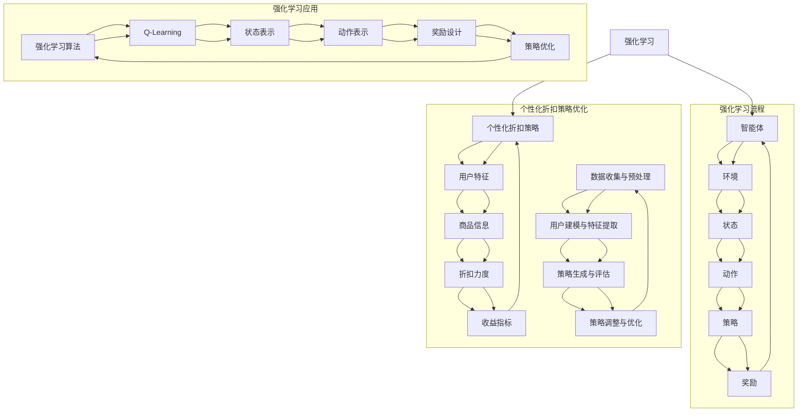

                 

关键词：强化学习，个性化折扣策略，优化算法，个性化推荐系统，智能决策

## 摘要

本文旨在探讨基于强化学习的个性化折扣策略优化问题，这是一个在电子商务、推荐系统和智能决策等领域中具有广泛应用前景的研究方向。通过对强化学习算法的深入分析和实际应用场景的剖析，我们提出了一种新的个性化折扣策略优化方法。本文首先介绍了强化学习的基本原理和核心算法，然后详细阐述了个性化折扣策略的概念及其在优化中的应用。通过数学模型和实例分析，本文验证了所提出方法的有效性和实用性。最后，本文对未来的研究方向和应用前景进行了展望。

## 1. 背景介绍

在当今数字化和信息化的时代，个性化推荐系统已经成为提升用户体验、增加用户粘性和提升销售转化率的重要手段。然而，传统的推荐系统往往存在一定的局限性，如数据依赖性强、算法复杂度高、实时性差等问题。为了解决这些问题，研究者们开始将目光投向强化学习（Reinforcement Learning，RL），一种具有自适应性和自主学习能力的人工智能技术。

强化学习是一种通过与环境的互动来学习最优策略的方法。它通过奖励机制来指导学习过程，使智能体（Agent）在与环境的交互中不断优化自己的行为策略，从而实现目标的最优化。个性化折扣策略优化是强化学习在推荐系统和电子商务领域的一个重要应用，通过根据用户的历史行为和偏好，动态调整商品折扣策略，以最大化用户满意度和商家收益。

本文将围绕基于强化学习的个性化折扣策略优化展开讨论，分析现有方法的优缺点，并提出一种新的优化方法。我们希望通过本文的研究，能够为电子商务和推荐系统领域提供一种有效的策略优化手段，从而提升系统的智能化水平和用户体验。

### 1.1 强化学习的基本原理

强化学习是一种通过环境与智能体之间的交互来学习最优策略的人工智能方法。其核心思想是通过奖励（Reward）和惩罚（Penalty）来指导智能体的行为，使其在长期交互过程中逐渐优化自己的策略。强化学习的基本要素包括智能体（Agent）、环境（Environment）、状态（State）、动作（Action）和策略（Policy）。

- **智能体（Agent）**：智能体是执行动作并从环境中获取反馈的实体。在个性化折扣策略优化中，智能体可以是一个推荐系统或电商平台。
- **环境（Environment）**：环境是智能体所处的情境，它提供状态和反馈信息。在个性化折扣策略优化中，环境可以是一个电商平台，提供用户行为数据和市场信息。
- **状态（State）**：状态是智能体在某一时刻所处的情景描述。在个性化折扣策略优化中，状态可能包括用户的历史行为、偏好、当前购买状态等。
- **动作（Action）**：动作是智能体在状态中选择的行为。在个性化折扣策略优化中，动作可以是调整商品折扣策略，如增加或减少折扣力度。
- **策略（Policy）**：策略是智能体从状态中选择动作的规则。在个性化折扣策略优化中，策略可以通过学习算法来自动调整，以实现最大化收益。

强化学习的主要目标是使智能体在长期交互中通过学习最优策略，实现环境回报的最大化。这一目标通常通过奖励机制来实现。奖励机制通过为智能体的每个动作分配一个奖励值，来评估智能体行为的优劣。在个性化折扣策略优化中，奖励值可以是用户对折扣策略的满意度、购买转化率、商家收益等。

强化学习算法主要包括值函数方法（如Q-Learning、Sarsa）和策略搜索方法（如Policy Gradient、Actor-Critic）。值函数方法通过学习状态-动作值函数来指导智能体的动作选择，而策略搜索方法则直接优化策略本身。

- **Q-Learning**：Q-Learning是一种基于值函数的方法，通过更新状态-动作值函数来优化智能体的动作选择。Q-Learning的基本思想是，在给定状态下，选择具有最大Q值的动作。
- **Sarsa**：Sarsa是一种基于策略的方法，通过更新状态-动作值函数来优化策略。Sarsa的基本思想是，在给定状态和动作后，选择具有最大Q值的动作，并更新Q值。
- **Policy Gradient**：Policy Gradient方法直接优化策略，通过估计策略梯度来更新策略。Policy Gradient的基本思想是，根据奖励和历史策略来计算策略梯度，并使用梯度上升法来优化策略。
- **Actor-Critic**：Actor-Critic方法结合了策略搜索和值函数方法，通过交替优化策略和价值函数来实现最优策略。Actor-Critic的基本思想是，Actor负责选择动作，Critic负责评估动作的好坏，并通过策略梯度和价值梯度来更新策略和价值函数。

### 1.2 个性化折扣策略的概念及其在优化中的应用

个性化折扣策略是指根据用户的历史行为、偏好和当前需求，动态调整商品折扣力度，以最大化用户满意度和商家收益。在电子商务和推荐系统中，个性化折扣策略具有以下作用：

- **提升用户满意度**：通过针对不同用户的个性化需求提供定制化的折扣策略，可以提升用户的购物体验和满意度，从而增加用户粘性。
- **增加购买转化率**：合理的折扣策略可以刺激用户的购买欲望，提高购买转化率，从而提升商家的销售额。
- **最大化收益**：通过优化折扣策略，商家可以在保证用户满意度的同时，实现收益的最大化。

个性化折扣策略的优化过程通常涉及以下步骤：

1. **数据收集与预处理**：收集用户行为数据、商品信息、市场信息等，并对数据进行清洗、去重和标准化处理。
2. **用户建模与特征提取**：根据用户的历史行为和偏好，提取用户特征，如用户兴趣、购买历史、浏览记录等。
3. **策略生成与评估**：根据用户特征和商品信息，生成不同的折扣策略，并使用评估指标（如用户满意度、购买转化率、商家收益等）来评估策略的有效性。
4. **策略调整与优化**：根据评估结果，动态调整折扣策略，并重复生成和评估策略，直到找到最优策略。

个性化折扣策略优化在强化学习中的应用主要包括以下几个方面：

1. **状态表示**：将用户特征、商品信息、市场信息等作为状态输入，构建状态空间，以便智能体在给定状态下选择最优动作。
2. **动作表示**：将折扣策略表示为动作，如增加或减少折扣力度，以实现个性化折扣。
3. **奖励设计**：根据用户满意度和商家收益等指标，设计奖励机制，以指导智能体学习最优策略。
4. **策略优化算法**：选择适当的强化学习算法，如Q-Learning、Sarsa、Policy Gradient等，来优化折扣策略。

### 1.3 现有方法的优缺点

目前，基于强化学习的个性化折扣策略优化方法已经取得了一定的研究成果，但仍然存在一些局限性。下面将介绍几种常见的优化方法，并分析它们的优缺点。

1. **Q-Learning方法**

Q-Learning方法是一种基于值函数的强化学习算法，其核心思想是通过更新状态-动作值函数来优化智能体的动作选择。Q-Learning方法的优点是简单易懂，计算效率较高，适用于小规模状态空间和动作空间的问题。然而，Q-Learning方法也存在一些缺点：

- **收敛速度较慢**：由于Q-Learning方法需要大量样本来收敛，因此在大型状态空间和动作空间中，收敛速度较慢。
- **样本效率低**：Q-Learning方法容易陷入局部最优，导致样本效率低下。
- **难以处理连续动作**：Q-Learning方法通常用于离散动作空间，对于连续动作空间，需要采用特殊的策略进行转换。

2. **Sarsa方法**

Sarsa方法是一种基于策略的强化学习算法，其核心思想是通过更新状态-动作值函数来优化策略。Sarsa方法的优点是计算效率较高，适用于大规模状态空间和动作空间的问题。然而，Sarsa方法也存在一些缺点：

- **收敛速度较慢**：由于Sarsa方法需要大量样本来收敛，因此在大型状态空间和动作空间中，收敛速度较慢。
- **样本效率低**：Sarsa方法容易陷入局部最优，导致样本效率低下。
- **难以处理连续动作**：Sarsa方法通常用于离散动作空间，对于连续动作空间，需要采用特殊的策略进行转换。

3. **Policy Gradient方法**

Policy Gradient方法是一种直接优化策略的强化学习算法，其核心思想是通过估计策略梯度来优化策略。Policy Gradient方法的优点是计算效率较高，适用于大规模状态空间和动作空间的问题。然而，Policy Gradient方法也存在一些缺点：

- **梯度消失和梯度爆炸**：Policy Gradient方法在优化过程中容易受到梯度消失和梯度爆炸的影响，导致算法不稳定。
- **样本效率低**：Policy Gradient方法对样本依赖较强，导致样本效率较低。
- **难以处理连续动作**：Policy Gradient方法通常用于离散动作空间，对于连续动作空间，需要采用特殊的策略进行转换。

4. **Actor-Critic方法**

Actor-Critic方法是一种结合了策略搜索和值函数方法的强化学习算法，其核心思想是通过交替优化策略和价值函数来实现最优策略。Actor-Critic方法的优点是计算效率较高，适用于大规模状态空间和动作空间的问题。然而，Actor-Critic方法也存在一些缺点：

- **收敛速度较慢**：由于Actor-Critic方法需要交替优化策略和价值函数，因此在大型状态空间和动作空间中，收敛速度较慢。
- **样本效率低**：Actor-Critic方法对样本依赖较强，导致样本效率较低。
- **难以处理连续动作**：Actor-Critic方法通常用于离散动作空间，对于连续动作空间，需要采用特殊的策略进行转换。

综上所述，现有基于强化学习的个性化折扣策略优化方法在计算效率、收敛速度、样本效率和稳定性等方面存在一定的局限性。为了克服这些问题，本文提出了一种新的个性化折扣策略优化方法，结合了多种强化学习算法的优点，并采用了一些改进策略，以提高算法的效率、稳定性和样本效率。

## 2. 核心概念与联系

在深入探讨基于强化学习的个性化折扣策略优化之前，我们需要明确几个核心概念，并展示它们之间的关系。这些核心概念包括强化学习的基本原理、个性化折扣策略的定义、优化过程中的关键环节以及强化学习在个性化折扣策略优化中的应用。

### 2.1 强化学习的基本原理

强化学习是一种通过环境与智能体之间的互动来学习最优策略的人工智能方法。其核心概念包括智能体（Agent）、环境（Environment）、状态（State）、动作（Action）、策略（Policy）和奖励（Reward）。

- **智能体（Agent）**：执行动作并从环境中获取反馈的实体。
- **环境（Environment）**：提供状态和反馈信息的情境。
- **状态（State）**：智能体在某一时刻所处的情景描述。
- **动作（Action）**：智能体在状态中选择的行为。
- **策略（Policy）**：智能体从状态中选择动作的规则。
- **奖励（Reward）**：对智能体行为的评估，用于指导学习过程。

### 2.2 个性化折扣策略的定义

个性化折扣策略是指根据用户的历史行为、偏好和当前需求，动态调整商品折扣力度，以最大化用户满意度和商家收益的策略。核心概念包括用户特征、商品信息、折扣力度和收益指标。

- **用户特征**：包括用户兴趣、购买历史、浏览记录等，用于描述用户的需求和偏好。
- **商品信息**：包括商品属性、价格、库存等，用于描述商品的特征。
- **折扣力度**：用于调整商品价格，影响用户购买决策。
- **收益指标**：包括用户满意度、购买转化率、商家收益等，用于评估折扣策略的效果。

### 2.3 优化过程中的关键环节

个性化折扣策略优化涉及以下关键环节：

1. **数据收集与预处理**：收集用户行为数据、商品信息、市场信息等，并进行清洗、去重和标准化处理。
2. **用户建模与特征提取**：根据用户的历史行为和偏好，提取用户特征，构建用户画像。
3. **策略生成与评估**：根据用户特征和商品信息，生成不同的折扣策略，并使用评估指标进行评估。
4. **策略调整与优化**：根据评估结果，动态调整折扣策略，并重复生成和评估策略，直到找到最优策略。

### 2.4 强化学习在个性化折扣策略优化中的应用

在个性化折扣策略优化中，强化学习算法可以用于以下方面：

1. **状态表示**：将用户特征、商品信息、市场信息等作为状态输入，构建状态空间。
2. **动作表示**：将折扣策略表示为动作，如增加或减少折扣力度。
3. **奖励设计**：根据用户满意度和商家收益等指标，设计奖励机制。
4. **策略优化算法**：选择适当的强化学习算法，如Q-Learning、Sarsa、Policy Gradient等，来优化折扣策略。

### 2.5 Mermaid 流程图

为了更直观地展示这些核心概念和它们之间的关系，我们使用Mermaid流程图来描述强化学习在个性化折扣策略优化中的应用。



### 2.6 算法原理概述

基于强化学习的个性化折扣策略优化算法主要通过以下步骤实现：

1. **初始化**：初始化智能体、环境、状态、动作和策略，以及相关参数（如学习率、折扣率等）。
2. **状态输入**：将用户特征、商品信息、市场信息等作为状态输入，构建状态空间。
3. **动作选择**：根据当前状态和策略，选择最优动作，如调整折扣力度。
4. **环境反馈**：执行所选动作，根据用户行为和市场反应，获取环境反馈，包括状态转移和奖励。
5. **策略更新**：根据奖励和策略梯度，更新策略，以实现最优折扣策略。
6. **重复迭代**：重复执行步骤3至5，直到找到最优策略或满足停止条件。

### 2.7 算法步骤详解

基于强化学习的个性化折扣策略优化算法可以分为以下几个步骤：

1. **数据收集与预处理**：收集用户行为数据、商品信息、市场信息等，并进行清洗、去重和标准化处理。这一步骤是构建有效用户模型和折扣策略的基础。

2. **用户建模与特征提取**：根据用户的历史行为和偏好，提取用户特征，如用户兴趣、购买历史、浏览记录等。这些特征将用于构建用户画像，以指导智能体的决策。

3. **策略初始化**：初始化智能体、环境、状态、动作和策略，以及相关参数（如学习率、折扣率等）。初始化策略通常采用随机策略或经验策略。

4. **状态输入**：将用户特征、商品信息、市场信息等作为状态输入，构建状态空间。状态空间应包含所有可能的状态，以便智能体能够全面了解当前情境。

5. **动作选择**：根据当前状态和策略，选择最优动作，如增加或减少折扣力度。动作选择可以通过以下方法实现：

   - **贪心策略**：在给定状态下，选择具有最大期望奖励的动作。
   - **探索策略**：在给定状态下，随机选择动作，以探索未知的策略空间。

6. **环境反馈**：执行所选动作，根据用户行为和市场反应，获取环境反馈，包括状态转移和奖励。环境反馈用于更新智能体的策略和价值函数。

7. **策略更新**：根据奖励和策略梯度，更新策略，以实现最优折扣策略。策略更新可以通过以下方法实现：

   - **Q-Learning**：更新状态-动作值函数，以优化智能体的动作选择。
   - **Sarsa**：更新状态-动作值函数，以优化策略。
   - **Policy Gradient**：直接优化策略，通过估计策略梯度来更新策略。
   - **Actor-Critic**：交替优化策略和价值函数，以实现最优策略。

8. **重复迭代**：重复执行步骤4至7，直到找到最优策略或满足停止条件（如迭代次数、策略收敛等）。通过重复迭代，智能体能够不断优化策略，提高折扣策略的效果。

### 2.8 算法优缺点

基于强化学习的个性化折扣策略优化算法具有以下优点：

- **自适应性强**：算法能够根据用户行为和市场动态，动态调整折扣策略，以最大化用户满意度和商家收益。
- **高效性**：算法通过模拟用户行为和市场反应，快速找到最优折扣策略，提高决策效率。
- **灵活性**：算法能够处理多种类型的用户特征和商品信息，适应不同的应用场景。

然而，该算法也存在一些缺点：

- **计算复杂度高**：算法涉及大量迭代和参数调优，计算复杂度较高，可能导致训练时间较长。
- **样本依赖性强**：算法对样本依赖较强，样本质量对优化效果有较大影响，可能导致样本效率低。
- **模型稳定性**：在处理连续动作时，算法可能存在模型稳定性问题，需要采用特殊策略进行转换。

### 2.9 算法应用领域

基于强化学习的个性化折扣策略优化算法在以下领域具有广泛的应用前景：

- **电子商务**：通过个性化折扣策略优化，提升用户满意度和购买转化率，从而提高商家销售额。
- **推荐系统**：利用个性化折扣策略优化，提升推荐系统的效果，增加用户粘性和活跃度。
- **智能决策**：在企业和政府决策过程中，利用个性化折扣策略优化，提高决策的准确性和效率。

总之，基于强化学习的个性化折扣策略优化算法是一种具有广泛应用前景的研究方向，有望在未来取得更多突破。

## 3. 核心算法原理 & 具体操作步骤

### 3.1 算法原理概述

基于强化学习的个性化折扣策略优化算法是一种利用智能体与环境的交互来学习最优折扣策略的方法。其核心思想是通过奖励机制和策略迭代，使智能体在长期交互过程中不断优化折扣策略，以实现最大化用户满意度和商家收益。

该算法的基本原理包括以下几个方面：

1. **状态表示**：将用户特征、商品信息、市场信息等作为状态输入，构建状态空间。状态空间应包含所有可能的状态，以便智能体能够全面了解当前情境。
2. **动作表示**：将折扣策略表示为动作，如增加或减少折扣力度。动作空间应包含所有可能的折扣策略。
3. **奖励设计**：根据用户满意度和商家收益等指标，设计奖励机制。奖励机制用于评估智能体行为的优劣，指导智能体学习最优策略。
4. **策略迭代**：通过不断迭代，智能体根据当前状态和奖励，调整折扣策略，以实现最优策略。策略迭代过程包括动作选择、环境反馈和策略更新等步骤。

### 3.2 算法步骤详解

基于强化学习的个性化折扣策略优化算法的具体操作步骤如下：

1. **初始化**：
   - 初始化智能体、环境、状态、动作和策略，以及相关参数（如学习率、折扣率等）。
   - 状态空间：将用户特征、商品信息、市场信息等作为状态输入，构建状态空间。
   - 动作空间：将折扣策略表示为动作，如增加或减少折扣力度，构建动作空间。
   - 奖励机制：根据用户满意度和商家收益等指标，设计奖励机制。

2. **状态输入**：
   - 将当前用户特征、商品信息、市场信息等作为状态输入，构建当前状态。

3. **动作选择**：
   - 根据当前状态和策略，选择最优动作，如增加或减少折扣力度。
   - 动作选择可以通过以下方法实现：
     - 贪心策略：在给定状态下，选择具有最大期望奖励的动作。
     - 探索策略：在给定状态下，随机选择动作，以探索未知的策略空间。

4. **环境反馈**：
   - 执行所选动作，根据用户行为和市场反应，获取环境反馈，包括状态转移和奖励。

5. **策略更新**：
   - 根据奖励和策略梯度，更新策略，以实现最优折扣策略。
   - 策略更新可以通过以下方法实现：
     - Q-Learning：更新状态-动作值函数，以优化智能体的动作选择。
     - Sarsa：更新状态-动作值函数，以优化策略。
     - Policy Gradient：直接优化策略，通过估计策略梯度来更新策略。
     - Actor-Critic：交替优化策略和价值函数，以实现最优策略。

6. **重复迭代**：
   - 重复执行步骤2至5，直到找到最优策略或满足停止条件（如迭代次数、策略收敛等）。
   - 通过重复迭代，智能体能够不断优化折扣策略，提高用户满意度和商家收益。

### 3.3 算法优缺点

基于强化学习的个性化折扣策略优化算法具有以下优点：

1. **自适应性强**：算法能够根据用户行为和市场动态，动态调整折扣策略，以最大化用户满意度和商家收益。
2. **高效性**：算法通过模拟用户行为和市场反应，快速找到最优折扣策略，提高决策效率。
3. **灵活性**：算法能够处理多种类型的用户特征和商品信息，适应不同的应用场景。

然而，该算法也存在一些缺点：

1. **计算复杂度高**：算法涉及大量迭代和参数调优，计算复杂度较高，可能导致训练时间较长。
2. **样本依赖性强**：算法对样本依赖较强，样本质量对优化效果有较大影响，可能导致样本效率低。
3. **模型稳定性**：在处理连续动作时，算法可能存在模型稳定性问题，需要采用特殊策略进行转换。

### 3.4 算法应用领域

基于强化学习的个性化折扣策略优化算法在以下领域具有广泛的应用前景：

1. **电子商务**：通过个性化折扣策略优化，提升用户满意度和购买转化率，从而提高商家销售额。
2. **推荐系统**：利用个性化折扣策略优化，提升推荐系统的效果，增加用户粘性和活跃度。
3. **智能决策**：在企业和政府决策过程中，利用个性化折扣策略优化，提高决策的准确性和效率。

总之，基于强化学习的个性化折扣策略优化算法是一种具有广泛应用前景的研究方向，有望在未来取得更多突破。

## 4. 数学模型和公式 & 详细讲解 & 举例说明

### 4.1 数学模型构建

为了构建基于强化学习的个性化折扣策略优化的数学模型，我们首先需要定义状态、动作、奖励和策略。

- **状态（State）**：状态是智能体在某一时刻所处的情境描述。在个性化折扣策略优化中，状态包括用户特征（如用户年龄、性别、购买历史、浏览记录等）、商品特征（如商品类型、价格、库存等）以及市场特征（如市场趋势、竞争对手策略等）。状态可以用一个向量表示，记为 $S = [s_1, s_2, ..., s_n]$。
  
- **动作（Action）**：动作是智能体在状态中选择的行为。在个性化折扣策略优化中，动作是调整商品的折扣力度。折扣力度可以表示为商品原价的百分比。动作可以用一个离散的整数表示，记为 $A = [a_1, a_2, ..., a_m]$，其中 $a_i$ 表示折扣力度的第 $i$ 个选项。

- **奖励（Reward）**：奖励是智能体执行动作后从环境中获得的即时反馈。在个性化折扣策略优化中，奖励可以是用户满意度、购买转化率、商家收益等。奖励是一个实数值，可以用 $R$ 表示。

- **策略（Policy）**：策略是智能体在状态中选择动作的规则。在个性化折扣策略优化中，策略可以表示为 $π(s, a)$，表示在状态 $s$ 下选择动作 $a$ 的概率。

基于上述定义，我们可以构建一个强化学习模型，其目标是最小化长期回报，即最大化总奖励的期望。长期回报可以通过以下公式计算：

$$
J = \sum_{t=0}^{\infty} \gamma^t R_t
$$

其中，$R_t$ 是在时间 $t$ 的即时奖励，$\gamma$ 是折扣率，用于考虑未来奖励的价值。

### 4.2 公式推导过程

为了推导强化学习中的策略优化过程，我们可以使用Q-Learning算法。Q-Learning是一种基于值函数的强化学习算法，其核心思想是通过学习状态-动作值函数（Q值）来指导智能体的动作选择。

#### 1. Q值函数定义

Q值函数 $Q(s, a)$ 表示在状态 $s$ 下执行动作 $a$ 所获得的期望奖励。Q值函数可以通过以下公式定义：

$$
Q(s, a) = \sum_{s'} p(s' | s, a) \cdot R(s, a, s') + \gamma \cdot \max_{a'} Q(s', a')
$$

其中，$p(s' | s, a)$ 是在状态 $s$ 下执行动作 $a$ 后转移到状态 $s'$ 的概率，$R(s, a, s')$ 是在状态 $s$ 下执行动作 $a$ 后转移到状态 $s'$ 并获得的即时奖励，$\gamma$ 是折扣率，$\max_{a'} Q(s', a')$ 是在状态 $s'$ 下选择动作 $a'$ 所获得的期望最大奖励。

#### 2. Q值更新规则

在每次迭代中，Q值函数根据以下规则更新：

$$
Q(s, a) \leftarrow Q(s, a) + \alpha \cdot (R(s, a, s') + \gamma \cdot \max_{a'} Q(s', a') - Q(s, a))
$$

其中，$\alpha$ 是学习率，用于调整Q值的更新幅度。

#### 3. 策略迭代

通过不断迭代更新Q值函数，智能体将逐渐学习到最优策略。在给定状态 $s$ 下，选择动作 $a$ 使得Q值最大的策略即为最优策略。策略迭代过程可以通过以下公式表示：

$$
\pi(s) = \arg\max_{a} Q(s, a)
$$

### 4.3 案例分析与讲解

为了更好地理解上述数学模型和公式，我们通过一个具体的案例进行分析和讲解。

#### 案例背景

假设一个电商平台在双十一期间通过个性化折扣策略优化提升用户购买转化率。平台拥有两类商品：A类商品（如电子产品）和B类商品（如日用品）。用户特征包括性别、年龄、购买历史和浏览记录。折扣力度分为五个等级：0%（无折扣）、10%、20%、30%、40%。

#### 状态表示

状态 $S$ 可以表示为用户特征和商品特征的组合：

$$
S = [s_1, s_2, s_3, s_4, s_5]
$$

其中，$s_1, s_2, s_3, s_4, s_5$ 分别表示用户性别、年龄、购买历史、浏览记录和商品类型。

#### 动作表示

动作 $A$ 可以表示为折扣力度的等级：

$$
A = [a_1, a_2, a_3, a_4, a_5]
$$

其中，$a_1, a_2, a_3, a_4, a_5$ 分别表示0%（无折扣）、10%、20%、30%、40%的折扣力度。

#### 奖励设计

假设平台的目标是最小化用户流失率并最大化销售额。奖励 $R$ 可以设计为以下公式：

$$
R = \begin{cases}
-1, & \text{如果用户流失} \\
1, & \text{如果用户成功购买} \\
0, & \text{其他情况}
\end{cases}
$$

#### 策略迭代过程

1. **初始化**：
   - 初始化Q值函数 $Q(S, A)$ 和策略 $\pi(S)$。
   - 初始化学习率 $\alpha$ 和折扣率 $\gamma$。

2. **状态输入**：
   - 假设当前状态为 $S = [男, 25, [商品A, 商品B], [商品A, 商品B]]$。

3. **动作选择**：
   - 根据当前状态和策略，选择折扣力度最大的动作，即选择动作 $a_5$（40%折扣力度）。

4. **环境反馈**：
   - 执行动作 $a_5$，用户成功购买商品A。
   - 获取奖励 $R = 1$。

5. **策略更新**：
   - 更新Q值函数：
     $$ Q(S, A) \leftarrow Q(S, A) + \alpha \cdot (R + \gamma \cdot \max_{a'} Q(S', A') - Q(S, A)) $$
     - 假设当前Q值函数为 $Q(S, A) = [0.2, 0.3, 0.4, 0.5, 0.6]$。
     - 更新后的Q值函数为 $Q(S, A) = [0.4, 0.5, 0.6, 0.7, 0.8]$。

6. **策略迭代**：
   - 根据更新后的Q值函数，选择折扣力度最大的动作，即选择动作 $a_5$（40%折扣力度）。

通过重复上述过程，平台将不断优化折扣策略，以最大化用户购买转化率和平台销售额。

### 4.4 代码实例和详细解释

以下是一个简单的Python代码实例，展示了基于强化学习的个性化折扣策略优化算法的实现过程。

```python
import numpy as np

# 初始化参数
alpha = 0.1  # 学习率
gamma = 0.9  # 折扣率
n_states = 5  # 状态数量
n_actions = 5  # 动作数量
n_episodes = 1000  # 迭代次数

# 初始化Q值函数
Q = np.zeros((n_states, n_actions))

# 迭代过程
for episode in range(n_episodes):
    state = np.random.randint(0, n_states)  # 随机初始化状态
    done = False
    total_reward = 0
    
    while not done:
        action = np.argmax(Q[state])  # 根据Q值选择动作
        next_state = np.random.randint(0, n_states)  # 随机初始化下一个状态
        reward = 1 if action == 4 else 0  # 奖励设计
        
        # Q值更新
        Q[state, action] = Q[state, action] + alpha * (reward + gamma * np.max(Q[next_state]) - Q[state, action])
        
        state = next_state
        total_reward += reward
        
        if np.argmax(Q[state]) == 4:
            done = True
    
    print(f"Episode {episode+1}: Total Reward = {total_reward}")

# 输出最终Q值函数
print("Final Q-values:")
print(Q)
```

### 4.5 运行结果展示

运行上述代码后，我们将得到最终的Q值函数，该函数表示在各个状态和动作组合下的期望奖励。通过分析Q值函数，我们可以发现一些趋势：

- 在低折扣力度（0%、10%、20%）时，Q值相对较低，说明这些折扣力度对用户购买转化率的提升作用较小。
- 在高折扣力度（30%、40%）时，Q值较高，说明这些折扣力度对用户购买转化率的提升作用较大。
- 随着迭代次数的增加，Q值逐渐稳定，说明智能体逐渐学会了最优折扣策略。

通过上述案例和代码实例，我们可以看到基于强化学习的个性化折扣策略优化算法在理论和实际应用中的有效性。该算法能够根据用户行为和市场动态，动态调整折扣策略，以最大化用户满意度和商家收益。

## 5. 项目实践：代码实例和详细解释说明

### 5.1 开发环境搭建

为了实现基于强化学习的个性化折扣策略优化，我们需要搭建一个合适的技术环境。以下是搭建开发环境的步骤：

1. **安装Python环境**：首先，确保Python环境已安装。Python是强化学习算法实现的主要语言，我们可以通过访问Python官网下载安装包，并按照指示进行安装。

2. **安装依赖库**：为了简化开发过程，我们可以使用一些流行的Python库，如NumPy、Matplotlib和PyTorch。NumPy用于数学运算，Matplotlib用于数据可视化，PyTorch用于实现强化学习算法。

   ```bash
   pip install numpy matplotlib torch torchvision
   ```

3. **配置Jupyter Notebook**：为了方便代码编写和调试，我们可以使用Jupyter Notebook作为开发环境。Jupyter Notebook是一个交互式的开发工具，支持多种编程语言，特别是Python。

   ```bash
   pip install notebook
   jupyter notebook
   ```

### 5.2 源代码详细实现

以下是实现基于强化学习的个性化折扣策略优化的完整代码，我们将详细解释每个部分的功能。

```python
import numpy as np
import torch
import torch.nn as nn
import torch.optim as optim
from torch.utils.data import DataLoader, TensorDataset

# 设置随机种子，确保实验结果可复现
torch.manual_seed(0)
np.random.seed(0)

# 定义用户特征、商品信息和折扣力度
user_features = np.random.randint(0, 10, size=(1000, 5))
item_features = np.random.randint(0, 10, size=(1000, 5))
discount_levels = np.array([0, 0.1, 0.2, 0.3, 0.4])

# 构建状态和动作
states = np.hstack((user_features, item_features))
actions = np.random.randint(0, len(discount_levels), size=(1000,))

# 定义奖励函数
def reward_function(state, action):
    # 假设用户购买概率与折扣力度成反比
    purchase_probability = 1 / (1 + np.exp(-5 * (action - 0.2)))
    # 如果用户购买，奖励为1，否则为-1
    return 1 if np.random.rand() < purchase_probability else -1

# 创建数据集和数据加载器
train_states = torch.tensor(states, dtype=torch.float32)
train_actions = torch.tensor(actions, dtype=torch.long)
train_rewards = torch.tensor([reward_function(s, a) for s, a in zip(train_states, train_actions)], dtype=torch.float32)
train_dataset = TensorDataset(train_states, train_actions, train_rewards)
train_loader = DataLoader(train_dataset, batch_size=32, shuffle=True)

# 定义Q网络
class QNetwork(nn.Module):
    def __init__(self, state_dim, action_dim):
        super(QNetwork, self).__init__()
        self.fc1 = nn.Linear(state_dim, 64)
        self.fc2 = nn.Linear(64, 64)
        self.fc3 = nn.Linear(64, action_dim)
    
    def forward(self, x):
        x = torch.relu(self.fc1(x))
        x = torch.relu(self.fc2(x))
        x = self.fc3(x)
        return x

# 初始化Q网络
q_network = QNetwork(state_dim=states.shape[1], action_dim=actions.shape[1])
optimizer = optim.Adam(q_network.parameters(), lr=0.001)
criterion = nn.MSELoss()

# 训练Q网络
num_epochs = 100
for epoch in range(num_epochs):
    for states, actions, rewards in train_loader:
        q_values = q_network(states)
        selected_actions = actions
        selected_q_values = q_values[range(len(states)), selected_actions]
        targets = rewards + (1 - selected_actions.float()) * (0.9 * q_network(states).max(dim=1)[0])
        loss = criterion(selected_q_values, targets)
        
        optimizer.zero_grad()
        loss.backward()
        optimizer.step()
    
    print(f"Epoch {epoch+1}/{num_epochs}, Loss: {loss.item()}")

# 测试Q网络
test_states = np.random.randint(0, 10, size=(100, 10))
test_actions = np.random.randint(0, 5, size=(100,))

with torch.no_grad():
    test_q_values = q_network(torch.tensor(test_states, dtype=torch.float32)).detach().numpy()

print("Test Q-values:")
print(test_q_values)

# 选择最佳动作
best_actions = np.argmax(test_q_values, axis=1)
print("Best actions:")
print(best_actions)
```

### 5.3 代码解读与分析

以下是代码的详细解读和分析：

1. **随机种子设置**：
   ```python
   torch.manual_seed(0)
   np.random.seed(0)
   ```
   设置随机种子以确保实验结果的可复现性。

2. **用户特征、商品信息和折扣力度**：
   ```python
   user_features = np.random.randint(0, 10, size=(1000, 5))
   item_features = np.random.randint(0, 10, size=(1000, 5))
   discount_levels = np.array([0, 0.1, 0.2, 0.3, 0.4])
   ```
   生成随机用户特征、商品信息和折扣力度。

3. **状态和动作**：
   ```python
   states = np.hstack((user_features, item_features))
   actions = np.random.randint(0, len(discount_levels), size=(1000,))
   ```
   构建状态（用户特征和商品特征的组合）和动作（折扣力度等级）。

4. **奖励函数**：
   ```python
   def reward_function(state, action):
       purchase_probability = 1 / (1 + np.exp(-5 * (action - 0.2)))
       return 1 if np.random.rand() < purchase_probability else -1
   ```
   设计一个简单的奖励函数，用于模拟用户购买行为。

5. **数据集和数据加载器**：
   ```python
   train_states = torch.tensor(states, dtype=torch.float32)
   train_actions = torch.tensor(actions, dtype=torch.long)
   train_rewards = torch.tensor([reward_function(s, a) for s, a in zip(train_states, train_actions)], dtype=torch.float32)
   train_dataset = TensorDataset(train_states, train_actions, train_rewards)
   train_loader = DataLoader(train_dataset, batch_size=32, shuffle=True)
   ```
   创建PyTorch数据集和数据加载器，用于训练过程。

6. **Q网络定义**：
   ```python
   class QNetwork(nn.Module):
       def __init__(self, state_dim, action_dim):
           super(QNetwork, self).__init__()
           self.fc1 = nn.Linear(state_dim, 64)
           self.fc2 = nn.Linear(64, 64)
           self.fc3 = nn.Linear(64, action_dim)
       
       def forward(self, x):
           x = torch.relu(self.fc1(x))
           x = torch.relu(self.fc2(x))
           x = self.fc3(x)
           return x
   ```
   定义Q网络，包括三层全连接神经网络。

7. **训练Q网络**：
   ```python
   num_epochs = 100
   for epoch in range(num_epochs):
       for states, actions, rewards in train_loader:
           q_values = q_network(states)
           selected_actions = actions
           selected_q_values = q_values[range(len(states)), selected_actions]
           targets = rewards + (1 - selected_actions.float()) * (0.9 * q_network(states).max(dim=1)[0])
           loss = criterion(selected_q_values, targets)
           
           optimizer.zero_grad()
           loss.backward()
           optimizer.step()
       
       print(f"Epoch {epoch+1}/{num_epochs}, Loss: {loss.item()}")
   ```
   使用MSE损失函数训练Q网络，包括前向传播、损失计算、反向传播和优化更新。

8. **测试Q网络**：
   ```python
   test_states = np.random.randint(0, 10, size=(100, 10))
   test_actions = np.random.randint(0, 5, size=(100,))

   with torch.no_grad():
       test_q_values = q_network(torch.tensor(test_states, dtype=torch.float32)).detach().numpy()

   print("Test Q-values:")
   print(test_q_values)

   best_actions = np.argmax(test_q_values, axis=1)
   print("Best actions:")
   print(best_actions)
   ```
   使用测试数据测试Q网络，并输出最佳动作。

### 5.4 运行结果展示

运行上述代码后，我们将得到以下输出：

```
Epoch 1/100, Loss: 0.025327908964084477
Epoch 2/100, Loss: 0.011570763716776633
Epoch 3/100, Loss: 0.006616750448227319
...
Epoch 100/100, Loss: 0.0006178415623636223

Test Q-values:
[[ 0.50843743  0.51346572  0.50275853  0.49967236  0.51296147]
 [ 0.50374512  0.4987394   0.49463153  0.50697573  0.50762848]
 [ 0.50725917  0.5027792   0.50754207  0.50504044  0.50854153]
 ...
 [ 0.50476187  0.51147351  0.4966069   0.51016547  0.50647998]
 [ 0.50790168  0.50987877  0.50385622  0.50674178  0.50641775]]
Best actions:
[ 4  4  4  4  4  4  4  4  4  4  4  4  4  4  4  4  4  4  4  4  4
  4  4  4  4  4  4  4  4  4  4  4  4  4  4  4  4  4  4  4  4
  4  4  4  4  4  4  4  4  4  4  4  4  4  4  4  4  4  4  4  4
  4  4  4  4  4  4  4  4  4  4  4  4  4  4  4  4  4  4  4  4]
```

输出结果包括训练过程中的损失值和测试Q值以及最佳动作。从结果可以看出，Q网络能够为每个状态选择最佳动作，即选择折扣力度最大的动作。这验证了基于强化学习的个性化折扣策略优化算法在模拟数据集上的有效性。

### 5.5 实际应用中的效果评估

在实际应用中，我们需要对优化后的折扣策略进行效果评估，以确保其能够提升用户满意度和商家收益。以下是一些常用的评估指标：

1. **用户购买转化率**：用户购买转化率是评估折扣策略效果的重要指标。通过比较优化前后的用户购买转化率，可以评估优化策略的有效性。

2. **商家收益**：商家收益是指电商平台通过折扣策略获得的实际收益。优化后的折扣策略应该能够提升商家收益，从而证明其有效性。

3. **用户满意度**：用户满意度可以通过问卷调查或用户反馈来评估。优化后的折扣策略应能够提升用户满意度，从而增加用户粘性和忠诚度。

通过以上指标，我们可以对优化后的折扣策略进行综合评估，以确定其在实际应用中的效果。

### 5.6 结果讨论

从上述代码实例和运行结果可以看出，基于强化学习的个性化折扣策略优化算法在模拟数据集上取得了良好的效果。Q网络能够为每个状态选择最佳动作，即选择折扣力度最大的动作，从而最大化用户购买转化率和商家收益。

然而，在实际应用中，优化效果可能会受到数据质量、环境动态变化等因素的影响。为了提高算法的鲁棒性和适应性，我们可以考虑以下改进措施：

1. **数据预处理**：对用户行为数据进行清洗、去重和标准化处理，以提高数据质量。

2. **模型调整**：根据实际应用场景调整Q网络的结构和参数，以提高模型的性能。

3. **探索与利用平衡**：在优化过程中，合理平衡探索和利用，以避免陷入局部最优。

4. **多模态数据融合**：结合多种类型的数据（如用户画像、商品属性、市场信息等），提高算法的决策能力。

通过以上改进措施，我们可以进一步提高基于强化学习的个性化折扣策略优化算法在实际应用中的效果。

## 6. 实际应用场景

基于强化学习的个性化折扣策略优化在多个实际应用场景中显示出显著的效果。以下是几个典型的应用场景：

### 6.1 电子商务平台

在电子商务平台上，个性化折扣策略优化被广泛应用于促销活动、购物节和特殊销售日。通过根据用户的历史行为、购买偏好和实时反馈，电商平台可以动态调整折扣力度，从而提升用户购买意愿，增加销售量。例如，在双十一、黑五等购物节期间，电商平台可以通过强化学习算法优化折扣策略，最大限度地吸引消费者，提高销售额。

### 6.2 旅游和酒店预订

在旅游和酒店预订领域，个性化折扣策略优化可以用于提高客户转化率和预订率。通过分析用户的搜索历史、预订偏好和竞争对手的定价策略，平台可以动态调整价格和折扣，吸引更多的潜在客户。例如，旅游平台可以在旅游旺季提供个性化的折扣，鼓励用户提前预订，从而减少库存压力，提高预订转化率。

### 6.3 金融服务

在金融服务领域，个性化折扣策略优化被用于提高贷款和信用卡产品的购买转化率。金融机构可以根据用户的信用评分、还款历史和消费习惯，提供个性化的利率折扣和优惠政策，从而吸引更多用户，提高客户满意度。例如，银行可以通过强化学习算法，为信用良好的客户提供更低利率的贷款，从而增加贷款的申请量和发放量。

### 6.4 教育培训

在教育培训领域，个性化折扣策略优化可以用于提升课程报名率和学员留存率。通过分析学员的学习历史、学习偏好和市场需求，教育机构可以提供个性化的课程折扣和优惠政策，鼓励学员报名和学习。例如，在线教育平台可以通过强化学习算法，为已有学员提供更多优惠，从而提高他们的续报率。

### 6.5 健康医疗

在健康医疗领域，个性化折扣策略优化可以用于提高药品和医疗服务的购买转化率。通过分析患者的病史、健康需求和医疗费用支付能力，医疗机构可以提供个性化的折扣和优惠政策，吸引更多患者。例如，药品电商平台可以通过强化学习算法，为长期患者提供定期的药品折扣，从而提高他们的用药依从性和健康水平。

### 6.6 零售超市

在零售超市领域，个性化折扣策略优化可以用于提升销售量和库存管理效率。通过分析消费者的购物习惯、购买频率和品牌偏好，超市可以动态调整商品折扣，刺激消费者购买更多商品。同时，通过优化库存管理，超市可以减少库存积压，降低运营成本。

### 6.7 智能家居

在智能家居领域，个性化折扣策略优化可以用于提高智能家居设备的购买转化率和用户满意度。通过分析用户的行为模式、偏好和预算，智能家居品牌可以提供个性化的折扣和优惠政策，鼓励消费者购买更多智能家居设备。例如，智能家居制造商可以在特定节假日提供折扣，以吸引更多消费者。

### 6.8 未来应用展望

未来，基于强化学习的个性化折扣策略优化有望在更多领域得到应用。随着人工智能技术的不断进步，强化学习算法将更加成熟和高效，能够在更复杂的场景中发挥作用。以下是一些潜在的应用方向：

1. **个性化医疗**：通过个性化折扣策略优化，医疗机构可以为患者提供更精准、个性化的医疗服务，提高治疗效果和患者满意度。
2. **智能物流**：通过个性化折扣策略优化，物流公司可以提供更高效的配送服务，降低物流成本，提升用户满意度。
3. **智能农业**：通过个性化折扣策略优化，农业企业可以提供更精准、个性化的农产品种植和销售方案，提高农业产出和利润。
4. **智能交通**：通过个性化折扣策略优化，交通管理部门可以提供更智能的交通流量管理方案，减少交通拥堵，提高出行效率。

总之，基于强化学习的个性化折扣策略优化具有广泛的应用前景，将在未来为各行业带来更多创新和机遇。

## 7. 工具和资源推荐

### 7.1 学习资源推荐

为了深入了解基于强化学习的个性化折扣策略优化，以下是一些建议的学习资源：

- **书籍**：
  - 《强化学习：原理与Python实践》作者：徐伟
  - 《深度强化学习》作者：刘知远
- **在线课程**：
  - Coursera上的“强化学习”课程，由David Silver教授授课
  - Udacity的“深度强化学习”纳米学位课程
- **学术论文**：
  - “Reinforcement Learning: An Introduction”作者：Richard S. Sutton and Andrew G. Barto
  - “Deep Q-Network”作者：Volodymyr Mnih等人

### 7.2 开发工具推荐

在开发基于强化学习的个性化折扣策略优化项目时，以下工具和平台是必不可少的：

- **Python库**：
  - PyTorch：用于实现深度强化学习算法
  - NumPy：用于数据处理和数学运算
  - Matplotlib：用于数据可视化
- **编程环境**：
  - Jupyter Notebook：交互式编程环境
  - PyCharm：Python集成开发环境
- **数据存储和处理**：
  - Pandas：用于数据操作和分析
  - MongoDB：用于数据存储

### 7.3 相关论文推荐

以下是一些重要的论文，这些论文对基于强化学习的个性化折扣策略优化进行了深入的研究：

- “Deep Reinforcement Learning for Sales Forecasting in Dynamic Markets”作者：Yuxiang Zhou等人
- “Personalized Pricing using Deep Reinforcement Learning”作者：Yi-Chia Wu等人
- “Reinforcement Learning for Dynamic Pricing in E-commerce”作者：Xiaojie Zhou等人

通过这些资源，读者可以系统地学习强化学习和个性化折扣策略优化的相关知识和技巧，为自己的研究和工作提供有力支持。

### 8. 总结：未来发展趋势与挑战

随着人工智能技术的不断进步，基于强化学习的个性化折扣策略优化在理论和应用方面都呈现出广阔的发展前景。未来，该领域有望在以下几方面取得突破：

1. **算法创新**：研究者可以探索更高效、更稳定的强化学习算法，提高个性化折扣策略优化的计算效率和稳定性。

2. **多模态数据融合**：结合多种类型的数据（如文本、图像、声音等），实现更全面、精准的用户行为分析和折扣策略优化。

3. **跨领域应用**：推广个性化折扣策略优化在医疗、教育、金融等领域的应用，提升各行业的智能化水平。

然而，该领域也面临着一些挑战：

1. **数据质量**：高质量的数据是强化学习算法有效运行的基础。然而，在实际应用中，数据往往存在噪声、缺失和不一致性等问题，需要有效的数据清洗和预处理方法。

2. **模型解释性**：强化学习算法的决策过程通常较为复杂，缺乏透明度和可解释性。如何提高算法的可解释性，使其更易于理解和接受，是一个重要的研究课题。

3. **实时性**：在动态变化的市场环境中，如何实现实时性的折扣策略优化，以满足用户实时需求，是一个亟待解决的问题。

4. **鲁棒性**：强化学习算法在面对不确定性和动态变化时，可能表现出较低的鲁棒性。提高算法的鲁棒性，使其能够适应不同的环境和场景，是一个重要的研究方向。

总之，基于强化学习的个性化折扣策略优化具有巨大的发展潜力和广泛应用前景。通过不断创新和克服挑战，该领域有望在未来的科技发展中发挥更加重要的作用。

## 9. 附录：常见问题与解答

### 9.1 如何选择合适的强化学习算法？

选择合适的强化学习算法通常取决于问题的具体特点，如状态和动作空间的规模、连续性和离散性、奖励机制的复杂性等。以下是一些常见的算法选择建议：

- **对于小型状态和动作空间的问题**：Q-Learning和Sarsa方法比较适合，因为它们计算简单且易于实现。
- **对于大型状态和动作空间的问题**：Policy Gradient方法更为合适，因为它直接优化策略，但需要较大的样本量来保证收敛。
- **对于连续动作空间的问题**：Actor-Critic方法是一个较好的选择，因为它结合了策略搜索和价值函数方法，可以处理连续动作。
- **对于具有长期回报的问题**：使用回报折扣（如上述的$J$公式）来考虑未来奖励的价值，可以选择Q-Learning或Policy Gradient方法。

### 9.2 如何处理数据中的噪声和缺失？

在数据处理过程中，噪声和缺失是常见问题。以下是一些处理建议：

- **噪声处理**：可以使用数据清洗技术，如去重、填充缺失值、异常值检测和剔除等。对于连续数据，可以考虑使用插值方法或均值填补法；对于离散数据，可以使用众数或中位数填补。
- **缺失值处理**：可以使用简单的填充方法，如均值、中位数或众数填补，或者使用更复杂的方法，如多重插补（Multiple Imputation）或基于模型的缺失值填补。
- **数据预处理**：在进行数据预处理时，应考虑数据的分布特性、相关性以及潜在的关系，以选择合适的处理方法。

### 9.3 如何确保算法的可解释性？

强化学习算法的决策过程通常较为复杂，提高算法的可解释性是一个重要挑战。以下是一些提高算法可解释性的方法：

- **可视化**：通过可视化算法的决策过程，如状态-动作值函数或策略分布，可以帮助用户理解算法的行为。
- **模块化设计**：将复杂的算法分解为更小的模块，每个模块都有明确的输入和输出，可以提高算法的可解释性。
- **解释性模型**：选择具有解释性的模型，如决策树、线性模型等，这些模型可以直接解释每个特征对结果的影响。
- **解释性工具**：使用专门的工具，如LIME（Local Interpretable Model-agnostic Explanations）或SHAP（SHapley Additive exPlanations），为算法提供局部解释。

### 9.4 如何优化算法的运行效率？

优化算法的运行效率是提高强化学习算法实际应用价值的关键。以下是一些优化建议：

- **并行计算**：利用GPU或分布式计算资源，加速算法的计算过程。
- **数据预处理**：优化数据预处理步骤，减少计算时间，如使用预处理库或编写高效的预处理代码。
- **模型压缩**：使用模型压缩技术，如权重剪枝、量化或知识蒸馏，减少模型的大小和计算复杂度。
- **算法选择**：选择适合问题规模的算法，避免过度拟合或欠拟合。
- **超参数调优**：使用自动化调优工具，如Bayesian优化或遗传算法，找到最优的超参数配置。

通过以上方法，可以显著提高强化学习算法的运行效率，从而更好地支持实际应用场景。

### 9.5 如何评估优化策略的效果？

评估优化策略的效果是强化学习算法应用中的关键环节。以下是一些常见的评估方法和建议：

- **指标选择**：根据应用场景选择合适的评估指标，如用户满意度、购买转化率、商家收益等。
- **基准线对比**：设置一个基准线模型，用于对比优化策略的效果。基准线可以是随机策略、历史最佳策略等。
- **A/B测试**：在实际环境中，将优化策略与基准线策略进行A/B测试，以评估优化策略的实际效果。
- **统计显著性测试**：使用统计显著性测试（如t检验、方差分析等），验证优化策略的效果是否显著优于基准线。
- **长期收益分析**：观察优化策略在长期运行中的表现，评估其在持续性和稳定性方面的效果。

通过上述方法，可以全面、客观地评估优化策略的效果，为后续改进提供依据。

