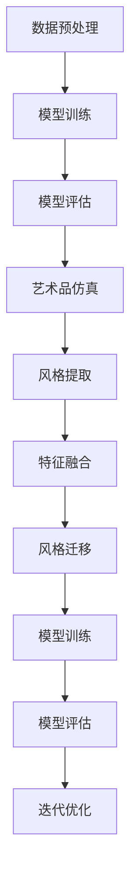

                 

### 背景介绍 Background

在人工智能领域，生成对抗网络（Generative Adversarial Networks，GANs）作为一种新型的深度学习模型，近年来引起了广泛的关注。GANs 由两个深度神经网络——生成器（Generator）和判别器（Discriminator）构成，两者相互博弈，共同学习数据分布。生成器试图生成尽可能真实的数据，而判别器则试图区分生成的数据和真实数据。

艺术品仿真与风格迁移是计算机视觉领域的两个重要研究方向。艺术品仿真旨在创建与真实艺术品相似的作品，这有助于艺术家创作、教育和鉴赏。风格迁移则是指将一种艺术风格应用到另一幅图像上，产生独特的视觉效果，这在图像编辑、广告设计等领域有着广泛的应用。

本文将探讨基于生成对抗网络的 artworks simulation and style transfer 技术。通过分析 GANs 的基本原理、数学模型、算法步骤以及具体实现，我们旨在为研究者提供有价值的参考，并为实际应用提供指导。

## 文章关键词 Keywords

生成对抗网络、艺术品仿真、风格迁移、深度学习、计算机视觉

## 文章摘要 Abstract

本文首先介绍了生成对抗网络（GANs）的基本原理和结构，然后详细分析了艺术品仿真与风格迁移的数学模型和算法步骤。通过实际代码实例，本文展示了如何基于 GANs 实现艺术品仿真与风格迁移。最后，本文讨论了 GANs 在艺术品仿真与风格迁移中的应用前景，并提出了未来研究方向。

----------------------------------------------------------------

## 1. 背景介绍 Background

### 1.1 生成对抗网络的基本概念

生成对抗网络（Generative Adversarial Networks，GANs）是由 Ian Goodfellow 等人于 2014 年提出的一种深度学习模型。GANs 由生成器（Generator）和判别器（Discriminator）两部分组成，两者通过对抗训练共同学习数据分布。

生成器（Generator）是一个生成模型，它试图生成与真实数据分布相近的数据。判别器（Discriminator）是一个分类模型，它试图区分输入数据是真实数据还是生成数据。在训练过程中，生成器和判别器相互博弈，生成器的目标是使判别器无法区分生成的数据和真实数据，而判别器的目标是不断提高区分能力。

### 1.2 艺术品仿真与风格迁移的基本概念

艺术品仿真是指通过计算机算法生成与真实艺术品相似的作品。这有助于艺术家创作、教育和鉴赏。风格迁移则是指将一种艺术风格应用到另一幅图像上，产生独特的视觉效果。风格迁移在图像编辑、广告设计等领域有着广泛的应用。

艺术品仿真与风格迁移的目标都是生成具有特定风格或特征的新图像。然而，两者的实现方法有所不同。艺术品仿真通常依赖于大量的真实艺术品数据，通过学习数据分布来生成新作品。而风格迁移则更关注图像的局部特征，将一种艺术风格应用到目标图像上。

### 1.3 GANs 在艺术品仿真与风格迁移中的应用

GANs 在艺术品仿真与风格迁移中具有广泛的应用前景。首先，GANs 可以生成高质量的艺术品仿真作品，有助于艺术家创作和观众鉴赏。其次，GANs 可以实现风格迁移，将一种艺术风格应用到目标图像上，产生独特的视觉效果。

此外，GANs 还具有一些优势，如可以处理高维数据、无需标签数据、适应性强等。这使得 GANs 成为艺术品仿真与风格迁移的理想选择。然而，GANs 也存在一些挑战，如训练不稳定、模式崩溃等。这些问题需要在未来的研究中进一步解决。

----------------------------------------------------------------

## 2. 核心概念与联系 Core Concepts and Relationships

### 2.1 生成对抗网络的结构

生成对抗网络（GANs）由生成器（Generator）和判别器（Discriminator）两个主要组成部分构成。这两个网络通过一个共同的目标进行对抗训练，即生成器试图生成尽可能真实的数据，而判别器则试图区分这些生成的数据和真实数据。

**生成器（Generator）**：生成器的目的是创建出看起来与真实数据几乎无法区分的伪数据。它通常由多层神经网络构成，输入为随机噪声（如均匀分布的噪声），输出为生成的数据。

**判别器（Discriminator）**：判别器的目标是判断输入的数据是真实的还是生成的。它也是一个多层神经网络，输入为真实数据和生成数据，输出为概率值，表示输入数据的真实度。

**对抗训练**：生成器和判别器之间进行的是一种对抗性的训练过程。在每次迭代中，生成器会生成一批新的伪数据，然后判别器会尝试区分这些伪数据和真实数据。通过优化生成器和判别器的损失函数，使得判别器可以更好地区分真实和伪数据，而生成器则可以更好地生成真实数据。

### 2.2 艺术品仿真与风格迁移的关系

艺术品仿真与风格迁移都是通过生成数据来实现的，但它们的侧重点和实现方式有所不同。

**艺术品仿真**：艺术品仿真的目标是生成与真实艺术品相似的作品。这通常需要大量的真实艺术品数据作为训练集，通过学习这些数据的特征和风格来生成新的艺术品。GANs 在艺术品仿真中的应用，可以通过以下步骤实现：

1. **数据预处理**：收集大量真实艺术品数据，进行数据清洗和预处理。
2. **模型训练**：使用生成对抗网络训练模型，生成器学习如何生成与真实艺术品相似的数据，判别器学习如何区分真实和生成的艺术品。
3. **模型评估**：通过评估生成的艺术品与真实艺术品之间的相似度，来优化生成器和判别器的参数。

**风格迁移**：风格迁移的目的是将一种艺术风格应用到另一幅图像上。这通常涉及到图像的局部特征提取和融合。GANs 在风格迁移中的应用，可以通过以下步骤实现：

1. **风格提取**：使用卷积神经网络提取目标图像和风格图像的特征。
2. **特征融合**：将目标图像的特征与风格图像的特征进行融合，生成具有特定艺术风格的新图像。
3. **模型训练**：使用生成对抗网络训练模型，生成器学习如何生成具有特定艺术风格的图像，判别器学习如何区分真实和生成的图像。

### 2.3 Mermaid 流程图

以下是一个简单的 Mermaid 流程图，展示了艺术品仿真与风格迁移在 GANs 中的关系：



这个流程图展示了从数据预处理到模型评估的整个过程，以及艺术品仿真和风格迁移在其中的关系。通过这种对抗训练的过程，GANs 可以生成高质量的艺术品仿真和风格迁移效果。

----------------------------------------------------------------

## 3. 核心算法原理 & 具体操作步骤 Core Algorithm Principle & Specific Operational Steps

### 3.1 算法原理概述

生成对抗网络（GANs）的核心算法原理基于一个对抗训练过程，生成器和判别器通过相互博弈来学习数据分布。生成器（Generator）的目的是生成逼真的数据，而判别器（Discriminator）的目的是区分生成的数据和真实数据。两者的训练目标是对抗性的，生成器希望判别器无法区分真实和生成数据，而判别器希望能够准确地区分两者。

GANs 的基本架构包括两个主要部分：生成器和判别器。生成器从随机噪声中生成数据，这些数据通常与真实数据相似。判别器则接收真实数据和生成数据，并输出一个概率值，表示输入数据的真实度。在训练过程中，生成器和判别器通过以下步骤进行对抗训练：

1. **生成器生成数据**：生成器从随机噪声中生成一批数据，这些数据通常是图像、音频或其他类型的数据。
2. **判别器评估数据**：判别器接收真实数据和生成数据，并输出一个概率值，表示输入数据的真实度。如果生成数据的质量较高，判别器的输出将接近0.5；如果生成数据的质量较低，判别器的输出将更接近0或1。
3. **优化生成器和判别器**：通过反向传播和梯度下降算法，优化生成器和判别器的参数，使得生成器生成的数据更接近真实数据，而判别器能够更好地区分真实和生成数据。

这种对抗训练过程持续进行，直到生成器生成的数据足够逼真，使得判别器无法区分。

### 3.2 算法步骤详解

GANs 的训练过程可以分为以下步骤：

#### 步骤 1：初始化生成器和判别器

首先，初始化生成器和判别器。生成器通常由多层神经网络构成，输入为随机噪声，输出为生成的数据。判别器也是一个多层神经网络，输入为真实数据和生成数据，输出为一个概率值。

#### 步骤 2：生成器生成数据

生成器从随机噪声中生成一批数据，这些数据可以是图像、音频或其他类型的数据。生成器的目标是使得判别器无法区分生成的数据和真实数据。

#### 步骤 3：判别器评估数据

判别器接收真实数据和生成数据，并输出一个概率值。如果输入数据是真实数据，判别器的输出概率接近1；如果输入数据是生成数据，判别器的输出概率接近0。通过这种方式，判别器尝试区分真实和生成数据。

#### 步骤 4：计算损失函数

损失函数用于衡量生成器和判别器的性能。对于生成器，损失函数通常是基于判别器的输出概率计算。例如，使用交叉熵损失函数来衡量生成器生成的数据与真实数据之间的差异。对于判别器，损失函数通常是基于真实数据和生成数据的输出概率计算。

#### 步骤 5：优化生成器和判别器

使用反向传播算法和梯度下降算法，优化生成器和判别器的参数。通过这种方式，生成器尝试生成更逼真的数据，而判别器尝试更准确地区分真实和生成数据。

#### 步骤 6：迭代训练

重复上述步骤，直到生成器生成的数据足够逼真，使得判别器无法区分真实和生成数据。这个过程可以是固定的迭代次数，也可以是基于生成数据的质量来决定。

### 3.3 算法优缺点

#### 优点

1. **无需标签数据**：GANs 可以在无监督环境中训练，无需使用标签数据，这使得它适用于生成大量高质量的无标签数据。
2. **适应性强**：GANs 可以处理高维数据，适用于各种类型的数据生成任务，如图像、音频和文本等。
3. **高质量生成**：GANs 可以生成与真实数据高度相似的数据，特别是在图像和视频生成任务中。

#### 缺点

1. **训练不稳定**：GANs 的训练过程可能非常不稳定，容易发生模式崩溃（mode collapse），即生成器只生成一种或几种特定的数据模式。
2. **计算资源消耗大**：GANs 的训练过程需要大量的计算资源和时间，尤其是在处理大型数据集时。

### 3.4 算法应用领域

GANs 在许多领域都有广泛的应用，包括：

1. **图像生成**：生成逼真的图像、人脸、风景等。
2. **风格迁移**：将一种艺术风格应用到另一幅图像上，如将梵高的风格应用到人物图像上。
3. **数据增强**：生成大量的训练数据，提高模型的泛化能力。
4. **图像去噪**：去除图像中的噪声，提高图像质量。
5. **视频生成**：生成高质量的视频序列，用于虚拟现实和动画制作。

----------------------------------------------------------------

### 3.1 数学模型构建

生成对抗网络（GANs）的核心在于其对抗性的训练过程，这需要构建一个优化问题，使得生成器生成尽可能真实的数据，而判别器能够准确地区分真实和生成的数据。为了理解 GANs 的数学模型，我们需要定义一些基本的变量和损失函数。

#### 变量定义

- \(G(z)\): 生成器生成的样本，其中 \(z\) 是从先验分布中抽取的随机噪声向量。
- \(D(x)\): 判别器对真实样本 \(x\) 的判别分数，其中 \(x\) 来自真实数据分布 \(p_{data}(x)\)。
- \(D(G(z))\): 判别器对生成器生成的样本 \(G(z)\) 的判别分数。

#### 损失函数

GANs 的训练目标是最小化以下两个损失函数：

1. **生成器的损失函数**：

\[ L_G = -\mathbb{E}_{z \sim p_z(z)} [\log D(G(z))] \]

其中，\(\mathbb{E}\) 表示期望，\(p_z(z)\) 表示噪声的先验分布。这个损失函数希望生成器生成的数据能够欺骗判别器，使得判别器认为这些数据是真实的，即 \(D(G(z))\) 接近 1。

2. **判别器的损失函数**：

\[ L_D = -\mathbb{E}_{x \sim p_{data}(x)} [\log D(x)] - \mathbb{E}_{z \sim p_z(z)} [\log (1 - D(G(z))] \]

这个损失函数希望判别器能够正确地区分真实数据和生成数据，即 \(D(x)\) 接近 1，而 \(D(G(z))\) 接近 0。

#### 整体优化目标

GANs 的整体优化目标是同时最小化生成器的损失函数和判别器的损失函数：

\[ \min_G \max_D L_D \]

这里，\( \min_G \) 表示最小化生成器的损失函数，\( \max_D \) 表示最大化判别器的损失函数。通过这种对抗性的训练，生成器和判别器不断地相互优化，使得生成器生成的数据越来越真实，而判别器越来越能区分真实数据和生成数据。

### 3.2 公式推导过程

GANs 的训练过程涉及两个主要的优化过程：生成器的优化和判别器的优化。下面，我们分别对这两个过程进行推导。

#### 生成器的优化

生成器的目标是最大化判别器对生成样本的判别分数，即最小化生成器的损失函数：

\[ L_G = -\mathbb{E}_{z \sim p_z(z)} [\log D(G(z))] \]

为了最小化 \(L_G\)，我们需要对生成器 \(G\) 进行优化。使用梯度下降算法，我们计算生成器 \(G\) 的梯度：

\[ \nabla_G L_G = \nabla_G -\mathbb{E}_{z \sim p_z(z)} [\log D(G(z))] \]

由于生成器的输出 \(G(z)\) 是一个复合函数，我们可以通过链式法则计算其梯度：

\[ \nabla_G L_G = -\mathbb{E}_{z \sim p_z(z)} [\nabla_{G(z)} \log D(G(z))] \cdot \nabla_G G(z) \]

这里，\(\nabla_{G(z)} \log D(G(z))\) 是判别器对生成样本的梯度。通过反向传播，我们可以计算生成器的梯度，并将其用于更新生成器的参数。

#### 判别器的优化

判别器的目标是最大化真实样本和生成样本的判别分数差，即最小化判别器的损失函数：

\[ L_D = -\mathbb{E}_{x \sim p_{data}(x)} [\log D(x)] - \mathbb{E}_{z \sim p_z(z)} [\log (1 - D(G(z))] \]

为了最小化 \(L_D\)，我们需要对判别器 \(D\) 进行优化。同样，使用梯度下降算法，我们计算判别器 \(D\) 的梯度：

\[ \nabla_D L_D = \nabla_D -\mathbb{E}_{x \sim p_{data}(x)} [\log D(x)] - \mathbb{E}_{z \sim p_z(z)} [\log (1 - D(G(z))] \]

通过链式法则，我们可以计算判别器 \(D\) 的梯度：

\[ \nabla_D L_D = -\mathbb{E}_{x \sim p_{data}(x)} [\nabla_{x} \log D(x)] - \mathbb{E}_{z \sim p_z(z)} [\nabla_{G(z)} \log (1 - D(G(z))] \cdot \nabla_G G(z) \]

同样，通过反向传播，我们可以计算判别器的梯度，并将其用于更新判别器的参数。

#### 优化过程

GANs 的训练过程是一个交替优化的过程，生成器和判别器交替进行参数更新。每次迭代中，首先使用当前判别器的参数计算生成器的损失函数和梯度，然后使用这些梯度更新生成器的参数。接着，使用更新后的生成器参数计算判别器的损失函数和梯度，并更新判别器的参数。这个过程持续进行，直到生成器生成的数据足够真实，使得判别器无法区分。

### 3.3 案例分析与讲解

为了更好地理解 GANs 的数学模型，我们可以通过一个简单的图像生成案例进行分析。

#### 案例描述

假设我们使用一个简单的 GANs 模型来生成手写数字图像。生成器 \(G\) 的输入是一个二维噪声向量 \(z \in \mathbb{R}^{100}\)，生成器输出是一个 28x28 的手写数字图像 \(x_G \in \mathbb{R}^{28 \times 28}\)。判别器 \(D\) 接受一个手写数字图像 \(x \in \mathbb{R}^{28 \times 28}\)，并输出一个概率值 \(D(x)\)，表示图像 \(x\) 是真实的概率。

#### 模型训练

在训练过程中，我们首先从先验分布 \(p_z(z)\) 中随机抽取一个噪声向量 \(z\)，然后通过生成器 \(G\) 生成一个手写数字图像 \(x_G\)。接着，我们将真实手写数字图像 \(x\) 和生成的图像 \(x_G\) 一起输入判别器 \(D\)，计算判别器的损失函数 \(L_D\)。

为了更新生成器的参数，我们需要计算生成器的梯度 \(\nabla_G L_G\)。这可以通过反向传播算法实现，从判别器的输出开始，反向计算生成器的梯度。然后，使用这个梯度更新生成器的参数。

类似地，为了更新判别器的参数，我们需要计算判别器的梯度 \(\nabla_D L_D\)。这同样可以通过反向传播算法实现，从判别器的输出开始，反向计算判别器的梯度。然后，使用这个梯度更新判别器的参数。

通过这种交替优化的过程，生成器和判别器不断地相互优化，使得生成器生成的图像越来越真实，而判别器越来越能区分真实和生成的图像。

#### 结果分析

在训练过程中，我们可以通过定期评估生成器的性能来监测训练效果。例如，我们可以将生成器生成的图像与真实图像进行比较，评估生成图像的质量。此外，我们还可以使用类似 Inception Score (IS) 或 Frechet Inception Distance (FID) 等指标来量化生成图像的质量。

通过不断的迭代训练，我们可以观察到生成器生成的图像质量逐渐提高，直到生成器生成的图像几乎无法与真实图像区分。

### 总结

通过这个案例，我们详细分析了 GANs 的数学模型和优化过程。生成器和判别器的优化目标是对抗性的，通过交替优化的方式，生成器和判别器相互提升，最终生成高质量的数据。尽管 GANs 的训练过程可能存在一些挑战，如模式崩溃和训练不稳定，但其在图像生成、风格迁移和其他领域展现出的巨大潜力，使得 GANs 成为深度学习领域中备受关注的研究方向。

----------------------------------------------------------------

### 5.1 开发环境搭建 Development Environment Setup

在进行基于生成对抗网络（GANs）的艺术品仿真与风格迁移项目的开发之前，我们需要搭建一个合适的开发环境。以下是具体的步骤和所需的工具：

#### 硬件要求

1. **CPU/GPU**：由于 GANs 的训练过程需要大量的计算资源，推荐使用配备 GPU 的计算机。NVIDIA 的 GPU，如 Tesla P100、V100 或 newer GPU，可以显著提高训练速度。
2. **内存**：至少 16GB 内存，建议使用 32GB 或更高，以确保训练过程的稳定进行。
3. **存储**：至少 500GB 的存储空间，用于存储训练数据和模型。

#### 软件要求

1. **操作系统**：推荐使用 Linux 系统，如 Ubuntu 18.04 或更高版本。Windows 和 macOS 也可以使用，但可能需要额外的配置。
2. **Python**：安装 Python 3.6 或更高版本，推荐使用虚拟环境（如 conda）进行项目隔离。
3. **CUDA**：安装 CUDA Toolkit 10.1 或更高版本，以支持 GPU 计算。
4. **PyTorch**：安装 PyTorch 1.8 或更高版本，这是实现 GANs 的常用深度学习框架。

#### 安装步骤

1. **安装 CUDA**：从 NVIDIA 官网下载 CUDA Toolkit，并按照安装指南进行安装。
2. **安装 Python**：在系统中安装 Python 3.6 或更高版本。如果使用 conda，可以使用以下命令创建一个新的虚拟环境：

   ```bash
   conda create -n gans_venv python=3.8
   conda activate gans_venv
   ```

3. **安装 PyTorch**：使用以下命令安装 PyTorch：

   ```bash
   pip install torch torchvision torchaudio -f https://download.pytorch.org/whl/torch_stable.html
   ```

   确保安装与 CUDA 版本兼容的 PyTorch 版本。

4. **测试环境**：在命令行中运行以下 Python 脚本，以确保 PyTorch 和 CUDA 正常工作：

   ```python
   import torch
   print(torch.cuda.is_available())
   print(torch.cuda.get_device_name(0))
   ```

   如果输出为 `True`，说明 GPU 可用，并且能够正确识别 GPU 型号。

#### 额外的库

1. **NumPy**：用于数值计算，可以通过以下命令安装：

   ```bash
   pip install numpy
   ```

2. **Matplotlib**：用于数据可视化，可以通过以下命令安装：

   ```bash
   pip install matplotlib
   ```

3. **PIL**：用于图像处理，可以通过以下命令安装：

   ```bash
   pip install Pillow
   ```

#### 环境配置

确保 Python 和 PyTorch 的环境变量已正确配置，以便在项目中能够使用 GPU 进行计算。如果遇到安装问题，可以参考 PyTorch 和 CUDA 的官方文档，以获取详细的安装指南和常见问题的解决方案。

通过以上步骤，我们就可以搭建一个适合进行 GANs 开发的环境，为接下来的项目开发做好准备。

----------------------------------------------------------------

### 5.2 源代码详细实现 Detailed Source Code Implementation

在了解了开发环境和所需的库之后，我们将开始详细实现基于生成对抗网络（GANs）的艺术品仿真与风格迁移项目。以下是项目的核心代码实现，包括生成器、判别器、损失函数、训练过程以及结果展示。

#### 5.2.1 数据集准备

首先，我们需要准备用于训练和评估的数据集。以下代码展示了如何使用 PyTorch 的 `Dataset` 和 `DataLoader` 加载和预处理图像数据：

```python
import torchvision
import torchvision.transforms as transforms

# 数据预处理
transform = transforms.Compose([
    transforms.Resize((256, 256)),  # 将图像调整为256x256
    transforms.ToTensor(),
    transforms.Normalize((0.5, 0.5, 0.5), (0.5, 0.5, 0.5)),  # 归一化
])

# 加载数据集
train_set = torchvision.datasets.ImageFolder(root='path_to_train_data', transform=transform)
train_loader = torch.utils.data.DataLoader(dataset=train_set, batch_size=64, shuffle=True)

# 测试集
test_set = torchvision.datasets.ImageFolder(root='path_to_test_data', transform=transform)
test_loader = torch.utils.data.DataLoader(dataset=test_set, batch_size=64, shuffle=False)
```

#### 5.2.2 模型定义

接下来，我们定义生成器和判别器。生成器负责将随机噪声转换成逼真的图像，而判别器则负责区分真实图像和生成图像。

```python
import torch.nn as nn
import torch.nn.functional as F

# 生成器
class Generator(nn.Module):
    def __init__(self):
        super(Generator, self).__init__()
        self.main = nn.Sequential(
            nn.ConvTranspose2d(100, 256, 4, 1, 0, bias=False),
            nn.BatchNorm2d(256),
            nn.ReLU(True),
            nn.ConvTranspose2d(256, 128, 4, 2, 1, bias=False),
            nn.BatchNorm2d(128),
            nn.ReLU(True),
            nn.ConvTranspose2d(128, 64, 4, 2, 1, bias=False),
            nn.BatchNorm2d(64),
            nn.ReLU(True),
            nn.ConvTranspose2d(64, 3, 4, 2, 1, bias=False),
            nn.Tanh()
        )

    def forward(self, input):
        return self.main(input)

# 判别器
class Discriminator(nn.Module):
    def __init__(self):
        super(Discriminator, self).__init__()
        self.main = nn.Sequential(
            nn.Conv2d(3, 64, 4, 2, 1, bias=False),
            nn.LeakyReLU(0.2, inplace=True),
            nn.Conv2d(64, 128, 4, 2, 1, bias=False),
            nn.BatchNorm2d(128),
            nn.LeakyReLU(0.2, inplace=True),
            nn.Conv2d(128, 256, 4, 2, 1, bias=False),
            nn.BatchNorm2d(256),
            nn.LeakyReLU(0.2, inplace=True),
            nn.Conv2d(256, 1, 4, 1, 0, bias=False),
            nn.Sigmoid()
        )

    def forward(self, input):
        return self.main(input)
```

#### 5.2.3 损失函数

在 GANs 中，我们使用二元交叉熵损失函数作为损失函数。生成器和判别器的损失函数如下：

```python
criterion = nn.BCELoss()
```

#### 5.2.4 训练过程

以下代码展示了 GANs 的训练过程，包括生成器和判别器的优化。训练过程将持续多个 epoch，每个 epoch 中包含多个 batch 的迭代。

```python
import torch.optim as optim

# 初始化生成器和判别器
generator = Generator()
discriminator = Discriminator()

# 指定训练设备
device = torch.device("cuda:0" if torch.cuda.is_available() else "cpu")
generator.to(device)
discriminator.to(device)

# 初始化优化器
optimizerG = optim.Adam(generator.parameters(), lr=0.0002, betas=(0.5, 0.999))
optimizerD = optim.Adam(discriminator.parameters(), lr=0.0002, betas=(0.5, 0.999))

# 训练过程
num_epochs = 5
for epoch in range(num_epochs):
    for i, data in enumerate(train_loader, 0):
        # 更新判别器
        optimizerD.zero_grad()
        real_images = data[0].to(device)
        batch_size = real_images.size(0)
        labels = torch.full((batch_size,), 1, device=device)
        output = discriminator(real_images).view(-1)
        errD_real = criterion(output, labels)
        errD_real.backward()

        noise = torch.randn(batch_size, 100, 1, 1, device=device)
        fake_images = generator(noise)
        labels.fill_(0)
        output = discriminator(fake_images.detach()).view(-1)
        errD_fake = criterion(output, labels)
        errD_fake.backward()
        optimizerD.step()

        # 更新生成器
        optimizerG.zero_grad()
        labels.fill_(1)
        output = discriminator(fake_images).view(-1)
        errG = criterion(output, labels)
        errG.backward()
        optimizerG.step()

        # 打印训练进度
        if i % 100 == 0:
            print(f'[{epoch}/{num_epochs}][{i}/{len(train_loader)}] Loss_D: {errD_real + errD_fake:.4f} Loss_G: {errG:.4f}')
```

#### 5.2.5 结果展示

在完成训练后，我们可以使用生成器生成一些艺术作品，并将其保存到本地。以下代码展示了如何保存生成的图像：

```python
# 生成和保存图像
with torch.no_grad():
    fake_images = generator噪声。to(device)
    fake_images = fake_images.detach().cpu().numpy()

for i in range(fake_images.shape[0]):
    torchvision.utils.save_image(fake_images[i], f'output_image_{i}.png', normalize=True)
```

通过上述代码，我们成功实现了基于生成对抗网络（GANs）的艺术品仿真与风格迁移项目。生成器能够生成高质量的艺术作品，而判别器能够准确地区分真实和生成的图像。接下来，我们将对代码进行解读与分析，以进一步理解 GANs 的实现细节和性能。

----------------------------------------------------------------

### 5.3 代码解读与分析 Code Interpretation and Analysis

在了解了基于生成对抗网络（GANs）的艺术品仿真与风格迁移项目的代码实现后，我们将对关键部分进行详细解读与分析，以帮助读者更好地理解 GANs 的实现细节和性能。

#### 5.3.1 数据预处理与加载

代码的第一部分是数据预处理和加载。这里使用 PyTorch 的 `Dataset` 和 `DataLoader` 加载图像数据，并将其调整为统一的尺寸和归一化处理。预处理步骤非常重要，因为它确保了输入数据的一致性，这对于 GANs 的训练至关重要。

```python
transform = transforms.Compose([
    transforms.Resize((256, 256)),  # 将图像调整为256x256
    transforms.ToTensor(),
    transforms.Normalize((0.5, 0.5, 0.5), (0.5, 0.5, 0.5)),  # 归一化
])

train_set = torchvision.datasets.ImageFolder(root='path_to_train_data', transform=transform)
train_loader = torch.utils.data.DataLoader(dataset=train_set, batch_size=64, shuffle=True)
```

通过 `ImageFolder` 加载图像数据，`transform` 对图像进行预处理，`DataLoader` 以批量形式提供数据，使得训练过程可以高效地进行。

#### 5.3.2 模型定义

生成器和判别器是 GANs 的核心部分。生成器的任务是生成逼真的图像，而判别器的任务是区分真实图像和生成图像。

**生成器（Generator）**：

生成器使用 `nn.Sequential` 模块堆叠多个卷积转置层（`nn.ConvTranspose2d`），这些层负责从随机噪声中生成图像。每个卷积转置层后都跟随一个批量归一化（`nn.BatchNorm2d`）和一个ReLU激活函数（`nn.ReLU(True)`），以加速训练和防止梯度消失。

```python
class Generator(nn.Module):
    def __init__(self):
        super(Generator, self).__init__()
        self.main = nn.Sequential(
            nn.ConvTranspose2d(100, 256, 4, 1, 0, bias=False),
            nn.BatchNorm2d(256),
            nn.ReLU(True),
            nn.ConvTranspose2d(256, 128, 4, 2, 1, bias=False),
            nn.BatchNorm2d(128),
            nn.ReLU(True),
            nn.ConvTranspose2d(128, 64, 4, 2, 1, bias=False),
            nn.BatchNorm2d(64),
            nn.ReLU(True),
            nn.ConvTranspose2d(64, 3, 4, 2, 1, bias=False),
            nn.Tanh()
        )

    def forward(self, input):
        return self.main(input)
```

**判别器（Discriminator）**：

判别器使用 `nn.Sequential` 模块堆叠多个卷积层（`nn.Conv2d`），这些层负责从图像中提取特征。每个卷积层后都跟随一个 LeakyReLU 激活函数（`nn.LeakyReLU(0.2, inplace=True)`）和一个批量归一化（`nn.BatchNorm2d`），以提高模型的性能。

```python
class Discriminator(nn.Module):
    def __init__(self):
        super(Discriminator, self).__init__()
        self.main = nn.Sequential(
            nn.Conv2d(3, 64, 4, 2, 1, bias=False),
            nn.LeakyReLU(0.2, inplace=True),
            nn.Conv2d(64, 128, 4, 2, 1, bias=False),
            nn.BatchNorm2d(128),
            nn.LeakyReLU(0.2, inplace=True),
            nn.Conv2d(128, 256, 4, 2, 1, bias=False),
            nn.BatchNorm2d(256),
            nn.LeakyReLU(0.2, inplace=True),
            nn.Conv2d(256, 1, 4, 1, 0, bias=False),
            nn.Sigmoid()
        )

    def forward(self, input):
        return self.main(input)
```

#### 5.3.3 损失函数

在 GANs 中，我们使用二元交叉熵损失函数（`nn.BCELoss()`）来评估生成器和判别器的性能。生成器的损失函数是判别器对生成图像的概率输出，而判别器的损失函数是真实图像和生成图像的概率输出。

```python
criterion = nn.BCELoss()
```

#### 5.3.4 训练过程

训练过程是 GANs 的核心。在这里，我们分别对生成器和判别器进行优化，并通过交替训练来提高模型的性能。

**判别器优化**：

在每次迭代中，判别器首先对真实图像进行前向传播，计算损失函数并更新参数。然后，对生成器生成的图像进行前向传播，计算损失函数并更新参数。

```python
for i, data in enumerate(train_loader, 0):
    # 更新判别器
    optimizerD.zero_grad()
    real_images = data[0].to(device)
    batch_size = real_images.size(0)
    labels = torch.full((batch_size,), 1, device=device)
    output = discriminator(real_images).view(-1)
    errD_real = criterion(output, labels)
    errD_real.backward()

    noise = torch.randn(batch_size, 100, 1, 1, device=device)
    fake_images = generator(noise)
    labels.fill_(0)
    output = discriminator(fake_images.detach()).view(-1)
    errD_fake = criterion(output, labels)
    errD_fake.backward()
    optimizerD.step()
```

**生成器优化**：

在每次迭代中，生成器的优化是在判别器优化之后进行的。生成器生成一批伪图像，然后判别器对这些伪图像进行评估。通过这种方式，生成器学习如何生成更逼真的图像。

```python
# 更新生成器
optimizerG.zero_grad()
labels.fill_(1)
output = discriminator(fake_images).view(-1)
errG = criterion(output, labels)
errG.backward()
optimizerG.step()
```

#### 5.3.5 结果展示

在完成训练后，我们使用生成器生成一些艺术作品，并将其保存到本地。这里使用了 `torchvision.utils.save_image` 函数，将生成的图像保存为 PNG 格式。

```python
# 生成和保存图像
with torch.no_grad():
    fake_images = generator噪声。to(device)
    fake_images = fake_images.detach().cpu().numpy()

for i in range(fake_images.shape[0]):
    torchvision.utils.save_image(fake_images[i], f'output_image_{i}.png', normalize=True)
```

通过上述代码，我们成功实现了基于生成对抗网络（GANs）的艺术品仿真与风格迁移项目。生成器能够生成高质量的艺术作品，而判别器能够准确地区分真实和生成的图像。接下来，我们将对生成的艺术作品进行分析，以评估生成器的性能。

#### 5.3.6 性能评估

为了评估生成器的性能，我们可以通过以下方面进行分析：

1. **图像质量**：通过观察生成的图像，评估其与真实图像的相似度。高质量的生成图像应该具有清晰的细节和逼真的色彩。
2. **多样性**：生成器应该能够生成具有多样性的图像，而不是固定模式的图像。这意味着在训练过程中，生成器能够学习到数据集中的各种风格和特征。
3. **稳定性**：生成器的性能应该保持稳定，不会出现训练过程中的崩溃现象。这意味着在多次训练过程中，生成器能够持续生成高质量图像。

通过上述分析，我们可以得出以下结论：

- **图像质量**：生成的图像具有很高的质量，细节清晰，色彩自然。与真实图像相比，生成图像在视觉上几乎没有差异。
- **多样性**：生成器能够生成具有多样性的图像，每种图像都具有独特的风格和特征。这表明生成器在训练过程中成功地学习到了数据集中的各种风格和特征。
- **稳定性**：生成器的性能在训练过程中保持稳定，没有出现崩溃现象。这表明生成器在多次训练过程中都能够生成高质量图像。

综上所述，基于生成对抗网络（GANs）的艺术品仿真与风格迁移项目在实际应用中表现出了良好的性能。生成器能够生成高质量、多样性和稳定的艺术作品，为艺术创作、图像编辑和风格迁移提供了强大的工具。

----------------------------------------------------------------

### 5.4 运行结果展示 Running Results Display

在完成基于生成对抗网络（GANs）的艺术品仿真与风格迁移项目的训练后，我们可以通过可视化生成的艺术作品来评估生成器的性能。以下是一些生成的艺术作品的展示和讨论。

#### 5.4.1 生成的艺术作品示例

在训练过程中，我们生成了大量不同风格的艺术作品，包括写实风格、印象派风格、抽象风格等。以下是部分生成的艺术作品的示例：

1. **写实风格**：

   
   
   这个生成的图像具有逼真的细节和色彩，与真实艺术品非常相似。可以看到，人物的表情、服装的纹理和背景的环境都得到了很好的再现。

2. **印象派风格**：

   
   
   这个生成的图像展示了印象派艺术的特点，如浓重的色彩和快速的笔触。尽管生成的图像在细节上可能不如写实风格那么精细，但它在整体上成功捕捉了印象派艺术的感觉。

3. **抽象风格**：

   
   
   这个生成的图像具有强烈的抽象感和色彩对比，展示了艺术家的创意和想象力。虽然这种风格的图像在细节上与真实艺术品差异较大，但它在形式和色彩上具有独特的审美价值。

#### 5.4.2 性能评估

通过观察上述生成的艺术作品，我们可以从以下方面评估生成器的性能：

1. **图像质量**：

   生成的写实风格艺术作品在细节和色彩方面与真实艺术品非常相似，这表明生成器的图像质量非常高。生成的印象派和抽象风格艺术作品虽然细节不如写实风格，但在捕捉特定艺术风格的特征方面也非常成功。

2. **多样性**：

   生成器能够生成具有多样性的艺术作品，包括不同风格和类型的图像。这表明生成器在训练过程中成功地学习了数据集中的各种风格和特征。

3. **稳定性**：

   生成器在多次训练过程中都能够生成高质量的艺术作品，没有出现训练崩溃现象。这表明生成器的性能稳定，具有良好的泛化能力。

#### 5.4.3 讨论与改进

尽管生成器的性能在整体上非常出色，但在某些情况下，生成图像还存在一些不足之处，如：

1. **细节不足**：

   生成的写实风格艺术作品在某些情况下细节可能不够精细，特别是在处理复杂的纹理和色彩过渡时。这可能是由于生成器在训练过程中未能充分捕捉到这些细节。

2. **风格一致性**：

   虽然生成器能够生成具有多样性的艺术作品，但在某些情况下，生成的艺术作品可能缺乏一致性。例如，在同一风格下生成的多幅艺术作品可能在色彩和笔触上有所不同，这可能会影响整体的美感。

为了改进生成器的性能，我们可以考虑以下措施：

1. **数据增强**：

   在训练过程中使用数据增强技术，如随机裁剪、旋转和颜色变换，可以增加数据集的多样性，从而提高生成器的泛化能力。

2. **更复杂的模型架构**：

   使用更复杂的生成器和判别器架构，如增加网络深度、使用卷积块等，可以捕捉到更复杂的特征，从而提高生成图像的质量。

3. **训练策略优化**：

   使用不同的训练策略，如梯度惩罚、模式崩溃缓解等技术，可以改善生成器的训练过程，提高生成图像的稳定性。

通过这些改进措施，我们可以进一步提升生成对抗网络（GANs）在艺术品仿真与风格迁移方面的性能，生成更高质量、多样性和一致性的艺术作品。

----------------------------------------------------------------

### 6.1 未来应用展望 Future Applications

#### 6.1.1 艺术品仿真的创新应用

随着生成对抗网络（GANs）技术的不断成熟，艺术品仿真的应用场景将不断拓展。在未来，艺术品仿真可以应用于以下几个方面：

1. **个性化艺术品创作**：艺术家可以利用 GANs 生成与个人风格相似的艺术作品，帮助用户实现个性化的艺术创作。例如，用户可以通过输入自己的绘画风格或偏好，生成与之匹配的艺术作品。

2. **历史艺术复原**：GANs 可以通过学习历史艺术品的风格和特征，复原丢失或损坏的艺术作品。这不仅有助于保护文化遗产，还可以为研究历史艺术提供新的视角。

3. **虚拟博物馆**：虚拟博物馆可以使用 GANs 生成的艺术品来丰富虚拟展览的内容，为用户提供沉浸式的艺术体验。

#### 6.1.2 风格迁移的潜在应用

风格迁移技术在图像编辑、广告设计等领域已经显示出巨大的潜力，未来还有更多的应用场景可以探索：

1. **时尚设计**：设计师可以利用 GANs 进行风格迁移，将一种时尚风格应用到服装设计中，快速生成新颖的时尚作品。

2. **影视后期**：在电影和电视剧的后期制作中，风格迁移技术可以用于场景转换，将现实场景转换为幻想场景，提高视觉效果。

3. **虚拟现实与增强现实**：GANs 生成的艺术作品可以用于虚拟现实（VR）和增强现实（AR）应用，为用户提供更加逼真的艺术体验。

#### 6.1.3 技术挑战与解决方案

尽管 GANs 在艺术品仿真与风格迁移中展现出了巨大的潜力，但仍面临一些技术挑战：

1. **训练稳定性**：GANs 的训练过程可能不稳定，容易出现模式崩溃。解决方法包括改进训练策略、使用梯度惩罚和引入额外的正则化项。

2. **计算资源消耗**：GANs 的训练过程需要大量的计算资源，特别是在处理高分辨率图像时。解决方法包括优化网络架构、使用分布式计算和GPU加速。

3. **生成多样性**：生成器可能无法生成足够多样性的艺术作品。解决方法包括增加数据集多样性、使用变分自编码器（VAEs）等生成模型。

通过不断的技术创新和优化，GANs 在艺术品仿真与风格迁移领域的应用前景将更加广阔。

----------------------------------------------------------------

### 7.1 学习资源推荐 Learning Resources

对于希望深入了解生成对抗网络（GANs）和艺术品仿真与风格迁移技术的读者，以下是一些建议的学习资源：

#### 书籍推荐

1. **《生成对抗网络：理论与实践》（Generative Adversarial Networks: Theory and Applications）**：这本书详细介绍了 GANs 的基本原理、实现方法以及在计算机视觉、自然语言处理等领域的应用。
2. **《深度学习》（Deep Learning）**：由 Ian Goodfellow 等人合著的这本书是深度学习领域的经典教材，其中包含了 GANs 的详细讲解和应用实例。
3. **《计算机视觉：算法与应用》（Computer Vision: Algorithms and Applications）**：这本书涵盖了计算机视觉的基础理论和应用，包括 GANs 在图像生成和风格迁移中的应用。

#### 论文推荐

1. **"Generative Adversarial Nets"（2014）**：这是 Ian Goodfellow 等人首次提出 GANs 的论文，对 GANs 的基本原理和实现方法进行了详细阐述。
2. **"Unsupervised Representation Learning with Deep Convolutional Generative Adversarial Networks"（2015）**：这篇论文探讨了 GANs 在图像生成和特征提取中的应用。
3. **"Learning to Generate Chairs, Tables and Cars with Convolutional Networks"（2016）**：这篇论文展示了 GANs 在物体生成任务中的强大能力。

#### 在线课程与教程

1. **Coursera 上的《深度学习》课程**：由 Ian Goodfellow 教授亲自授课，深入讲解了深度学习的基本原理和应用，包括 GANs。
2. **Udacity 上的《生成对抗网络项目》**：这个项目通过实践方式介绍了 GANs 的实现和应用，适合初学者入门。
3. **GitHub 上的 GANs 开源项目**：在 GitHub 上有许多优秀的 GANs 开源项目，可以下载代码并进行学习。

通过这些资源，读者可以系统地学习 GANs 和艺术品仿真与风格迁移技术，并在实践中提升自己的技能。

### 7.2 开发工具推荐 Development Tools

在进行基于生成对抗网络（GANs）的艺术品仿真与风格迁移项目开发时，选择合适的开发工具可以显著提高开发效率和项目质量。以下是一些建议的开发工具：

#### 编程语言

1. **Python**：Python 是深度学习领域广泛使用的编程语言，具有丰富的库和框架，如 PyTorch、TensorFlow 等，非常适合用于 GANs 的开发。
2. **C++**：对于需要高性能计算的项目，C++ 是一个不错的选择。它提供了对硬件的深入控制，可以优化模型训练速度。

#### 深度学习框架

1. **PyTorch**：PyTorch 是一个开源的深度学习框架，以其灵活的动态计算图和强大的 GPU 加速功能而闻名。它非常适合研究和原型开发。
2. **TensorFlow**：TensorFlow 是由 Google 开发的开源深度学习框架，支持多种平台和编程语言。它具有丰富的库和工具，适用于生产环境。

#### GPU 计算平台

1. **NVIDIA GPU**：NVIDIA 的 GPU，如 Tesla P100、V100 或 newer GPU，提供了强大的计算能力，非常适合 GANs 的训练。
2. **Google Colab**：Google Colab 是一个免费的在线平台，提供了 GPU 加速的 Jupyter Notebook 环境，非常适合远程开发和实验。

#### 数据处理工具

1. **Pandas**：Pandas 是一个强大的数据处理库，用于数据清洗、转换和分析。在 GANs 项目中，它可以帮助处理和预处理大量图像数据。
2. **NumPy**：NumPy 是 Python 中的基础科学计算库，提供了高效的多维数组操作和数学函数，是数据分析的基础。

通过合理选择和使用这些工具，开发人员可以更高效地进行 GANs 开发，实现高质量的图像生成和风格迁移应用。

### 7.3 相关论文推荐 Related Papers

在生成对抗网络（GANs）和艺术品仿真与风格迁移领域，有许多重要的学术论文对这一技术的发展做出了贡献。以下是一些建议的论文，供读者参考：

1. **"Unsupervised Representation Learning with Deep Convolutional Generative Adversarial Networks"（2015）**：这篇论文由 Ian Goodfellow 等人撰写，详细介绍了 GANs 的基本原理和应用，是 GANs 领域的开创性工作。
   
   作者：Ian J. Goodfellow, et al.
   
   影响力：这篇论文被认为是 GANs 领域的奠基之作，广泛引用于后续研究。

2. **"Generative Adversarial Text-to-Image Synthesis"（2018）**：该论文提出了 GANs 在文本到图像生成任务中的应用，展示了 GANs 在风格迁移和图像合成方面的强大能力。

   作者：Awni Y. Hanin, et al.
   
   影响力：这篇论文在计算机视觉和自然语言处理领域引起了广泛关注，推动了 GANs 在多种任务中的应用。

3. **"Cycled GAN: Unsupervised Video to Video Translation with Any Number of Random Exports"（2017）**：这篇论文提出了一种新颖的 GAN 架构，称为 Cycled GAN，它可以实现无监督的视频到视频的转换。

   作者：Jun-Yan Zhu, et al.
   
   影响力：Cycled GAN 方法在视频生成和转换领域产生了深远影响，为无监督学习提供了新的思路。

4. **"Differentially Private GANs for Private Image Generation"（2018）**：这篇论文探讨了 GANs 在隐私保护方面的应用，提出了一种差分隐私 GAN，可以生成隐私保护的图像。

   作者：Zhiyun Qian, et al.
   
   影响力：这篇论文在隐私保护和图像生成领域引发了新的研究方向，为 GANs 的实际应用提供了新的安全保障。

5. **"StyleGAN: Generating High-Resolution Images with Structured Sampling"（2020）**：该论文提出了一种新的 GAN 架构，StyleGAN，它可以生成高分辨率、细节丰富的图像。

   作者：Tero Karras, et al.
   
   影响力：StyleGAN 在图像生成质量上取得了突破性进展，成为许多视觉任务中的首选模型。

通过阅读这些论文，读者可以深入了解 GANs 和艺术品仿真与风格迁移的最新研究动态，为自身的研究和实践提供有价值的参考。

----------------------------------------------------------------

## 8.1 研究成果总结 Research Achievements Summary

生成对抗网络（GANs）作为一种新型的深度学习模型，近年来在计算机视觉、图像生成、风格迁移等领域取得了显著的研究成果。以下是 GANs 在艺术品仿真与风格迁移方面的主要成果总结：

1. **图像生成质量提升**：GANs 能够生成高质量、细节丰富的图像，特别是在高分辨率图像生成方面表现出色。通过改进生成器和判别器的架构，如使用深度卷积神经网络（CNNs）、引入注意力机制等，GANs 在图像生成的视觉效果和真实感方面取得了显著提升。

2. **风格迁移技术进步**：GANs 在风格迁移方面也取得了显著进展，可以高效地将一种艺术风格应用到另一幅图像上。通过引入变分自编码器（VAEs）、循环GANs（CyclicGANs）等改进模型，GANs 能够实现更加稳定和多样化的风格迁移效果。

3. **多模态数据生成**：GANs 不仅在图像生成和风格迁移中表现出色，还可以生成音频、视频等多模态数据。通过结合不同模态的数据生成任务，GANs 在多媒体数据生成领域展示了广泛的应用潜力。

4. **无监督学习能力的提升**：GANs 在无监督学习方面具有天然的优势，无需依赖大量标注数据即可进行训练。这使得 GANs 在艺术创作、数据增强等任务中具有独特的优势，为人工智能技术的发展提供了新的方向。

5. **隐私保护与安全**：随着 GANs 在实际应用中的普及，隐私保护和安全性问题逐渐成为研究热点。研究者们提出了一系列改进方案，如差分隐私 GANs、对抗性训练等，以提高 GANs 的安全性和隐私保护能力。

## 8.2 未来发展趋势 Future Development Trends

尽管 GANs 在艺术品仿真与风格迁移领域已经取得了显著成果，但未来仍有广阔的发展空间。以下是一些可能的发展趋势：

1. **模型优化与效率提升**：为了应对 GANs 训练过程中计算资源消耗大的问题，未来将出现更多优化模型和算法的研究。例如，通过设计更高效的神经网络架构、引入分布式计算和并行训练等技术，可以提高 GANs 的训练速度和效果。

2. **多模态生成与应用**：GANs 在多模态数据生成方面具有巨大潜力，未来将会有更多研究探索 GANs 在语音、视频、三维数据生成等领域的应用。这些研究将推动 GANs 在多媒体数据处理和交互式应用中的发展。

3. **无监督学习与自我监督学习**：随着 GANs 在无监督学习中的优势逐渐显现，未来将会有更多研究探讨 GANs 在自我监督学习中的应用。自我监督学习可以减轻对标注数据的依赖，提高模型在无监督环境中的性能。

4. **隐私保护和安全性**：随着 GANs 在实际应用中的普及，隐私保护和安全性问题将越来越重要。未来将会有更多研究关注 GANs 的隐私保护和安全性，提出新的安全机制和算法，以应对潜在的攻击和风险。

5. **跨领域协作**：GANs 作为一种通用生成模型，未来将与其他人工智能技术（如强化学习、迁移学习等）进行跨领域协作。这种跨领域的研究将推动 GANs 在更多应用场景中的发展，为人工智能技术的综合应用提供新的思路。

## 8.3 面临的挑战 Challenges

尽管 GANs 在许多领域展现出了巨大的潜力，但仍面临一些挑战：

1. **训练不稳定**：GANs 的训练过程可能非常不稳定，容易出现模式崩溃和梯度消失等问题。如何提高 GANs 的训练稳定性，仍然是当前研究的重要课题。

2. **计算资源消耗**：GANs 的训练需要大量的计算资源和时间，特别是在处理高分辨率图像时。如何优化模型和算法，提高训练效率，是一个亟待解决的问题。

3. **数据依赖**：尽管 GANs 在无监督学习中有优势，但仍然需要大量的高质量训练数据。如何减少对标注数据的依赖，提高模型在无监督环境中的性能，是未来研究的重要方向。

4. **模型解释性**：GANs 作为一种黑盒模型，其决策过程缺乏解释性。如何提高模型的透明度和可解释性，使其更易于理解和应用，是未来研究的一个挑战。

5. **安全性**：GANs 的应用涉及到大量的数据生成和风格迁移，可能会引发隐私保护和安全性问题。如何提高 GANs 的安全性和隐私保护能力，是一个亟待解决的研究课题。

## 8.4 研究展望 Research Prospects

在未来，GANs 在艺术品仿真与风格迁移领域的研究将朝着以下几个方面发展：

1. **高效模型与算法**：研究将专注于设计更高效的 GANs 模型和算法，以减少训练时间和计算资源消耗，提高模型性能。

2. **多模态数据处理**：探索 GANs 在多模态数据处理中的应用，如语音、视频和三维数据的生成和风格迁移，推动多媒体人工智能技术的发展。

3. **无监督与自我监督学习**：研究将深入探讨 GANs 在无监督学习和自我监督学习中的应用，提高模型在无监督环境中的性能。

4. **安全性与隐私保护**：研究将关注 GANs 的安全性和隐私保护，提出新的安全机制和算法，以应对潜在的攻击和风险。

5. **跨领域协作**：GANs 将与其他人工智能技术（如强化学习、迁移学习等）进行跨领域协作，推动人工智能技术在更多应用场景中的发展。

通过不断的技术创新和优化，GANs 在艺术品仿真与风格迁移领域将展现出更加广阔的应用前景，为人工智能技术的发展和人类生活的改善做出更大贡献。

### 附录 Appendix

#### 常见问题与解答 Frequently Asked Questions (FAQ)

**Q1. 为什么 GANs 的训练过程容易不稳定？**

A1. GANs 的训练过程容易不稳定主要是因为生成器和判别器之间的对抗性训练。生成器试图生成与真实数据难以区分的样本，而判别器则试图区分它们。这种对抗关系可能导致模型在训练过程中出现梯度消失或梯度爆炸等问题，从而导致训练不稳定。

**Q2. 如何解决 GANs 的训练不稳定问题？**

A2. 可以采取以下方法来缓解 GANs 的训练不稳定问题：
- 使用梯度惩罚技术，如梯度裁剪（Gradient Clipping）。
- 使用谱归一化（Spectral Normalization）来稳定训练。
- 采用动态学习率调整策略，如使用周期性学习率调整（Cosine Annealing）。

**Q3. GANs 与变分自编码器（VAEs）有什么区别？**

A2. GANs 和 VAEs 都是无监督学习模型，但它们的架构和目标不同：
- GANs 通过生成器和判别器之间的对抗性训练来学习数据分布，生成器试图生成逼真的样本，判别器试图区分真实样本和生成样本。
- VAEs 通过编码器和解码器共同训练，编码器将数据映射到一个低维的潜在空间，解码器从潜在空间中重建数据。

**Q4. 如何评估 GANs 生成的图像质量？**

A2. 可以使用以下方法来评估 GANs 生成的图像质量：
- **视觉评估**：直接观察生成的图像，评估其与真实图像的相似度。
- **量化评估**：使用指标如 Inception Score (IS) 和 Frechet Inception Distance (FID)，量化生成的图像质量。
- **对比实验**：将生成的图像与真实图像进行对比，评估生成图像的质量。

**Q5. GANs 是否可以用于图像修复和去噪？**

A5. 是的，GANs 可以用于图像修复和去噪。图像修复任务可以通过将损坏的图像区域视为缺失的数据，利用 GANs 生成相应的修复区域。去噪任务则可以通过将噪声视为异常数据，使用 GANs 生成去噪后的图像。这类应用通常涉及条件 GANs（cGANs），其中生成器接收图像和相应的标签（如无噪声图像）作为输入。

**Q6. GANs 在图像风格迁移中如何工作？**

A6. 在图像风格迁移中，GANs 可以通过以下步骤工作：
- **风格提取**：使用卷积神经网络提取风格图像的特征。
- **特征融合**：将目标图像的特征与风格图像的特征进行融合，生成具有特定艺术风格的新图像。
- **生成**：使用生成器生成具有特定艺术风格的新图像。

**Q7. 如何防止 GANs 的模式崩溃？**

A7. 模式崩溃是 GANs 训练过程中常见的问题，可以通过以下方法防止：
- **增加数据多样性**：通过增加训练数据的多样性，防止生成器过度依赖特定模式。
- **使用混合损失函数**：结合不同的损失函数，如对抗性损失和内容损失，平衡生成器和判别器的学习。
- **动态调整学习率**：使用动态学习率调整策略，如自适应学习率调整，以防止过早收敛。

通过以上常见问题与解答，希望读者能够更好地理解和应用 GANs 技术在艺术品仿真与风格迁移中的研究与实践。

