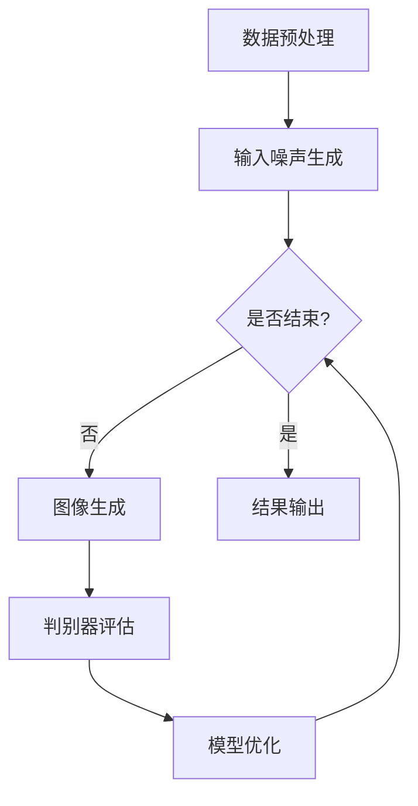

                 

关键词：生成对抗网络（GAN），街景图像，风格化，季节转换，图像生成，人工智能，计算机视觉。

## 摘要

本文主要探讨了基于生成对抗网络（GAN）的街景图像风格化和季节转换技术。生成对抗网络作为一种深度学习模型，在图像生成领域取得了显著成果。本文首先介绍了生成对抗网络的基本原理和架构，随后详细阐述了如何利用GAN进行街景图像风格化和季节转换。通过对相关数学模型、算法原理和具体实现步骤的深入分析，本文为相关研究者和开发者提供了有价值的参考。此外，本文还探讨了GAN在街景图像风格化和季节转换领域的实际应用，并对其未来发展进行了展望。

## 1. 背景介绍

### 1.1 街景图像风格化和季节转换的意义

街景图像风格化和季节转换技术在计算机视觉和人工智能领域具有重要的应用价值。随着城市化的加速发展，街景图像作为城市环境的重要组成部分，广泛应用于城市规划、交通监控、房地产评估等领域。然而，现实中的街景图像往往受到光照、天气、季节等多种因素的影响，导致图像质量参差不齐，难以满足实际应用需求。因此，对街景图像进行风格化和季节转换，可以有效改善图像质量，提高图像的可读性和应用价值。

### 1.2 生成对抗网络的发展历程

生成对抗网络（GAN）由Ian Goodfellow等人于2014年提出，是一种基于深度学习的图像生成模型。GAN的核心思想是利用生成器和判别器的对抗训练，实现高质量的图像生成。生成对抗网络一经提出，便在图像生成领域取得了巨大的成功，成为了一种重要的深度学习模型。

### 1.3 国内外研究现状

近年来，随着生成对抗网络的不断发展和应用，越来越多的研究者开始关注GAN在街景图像风格化和季节转换领域的应用。国内外许多研究机构和企业已经开展了一系列相关研究，并取得了显著的成果。然而，仍存在一些亟待解决的问题，如GAN模型的训练难度、图像生成的多样性和稳定性等。

## 2. 核心概念与联系

### 2.1 生成对抗网络（GAN）的基本概念

生成对抗网络（GAN）由生成器（Generator）和判别器（Discriminator）两部分组成。生成器负责生成与真实图像相似的虚假图像，判别器则负责区分真实图像和虚假图像。在训练过程中，生成器和判别器相互对抗，共同提高图像生成质量。

### 2.2 GAN的架构和原理

GAN的架构包括输入噪声空间、生成器、判别器和输出图像空间。生成器的输入为随机噪声，输出为虚假图像；判别器的输入为真实图像和虚假图像，输出为二分类结果（真实或虚假）。在训练过程中，生成器和判别器分别最大化自身的目标函数，最终实现高质量的图像生成。

### 2.3 街景图像风格化和季节转换的基本流程

街景图像风格化和季节转换的基本流程主要包括以下几个步骤：

1. 数据预处理：对街景图像进行预处理，包括图像增强、归一化等操作，以提高图像质量。
2. 输入噪声生成：生成随机噪声作为生成器的输入。
3. 图像生成：生成器利用噪声生成风格化或季节转换后的街景图像。
4. 判别器评估：判别器对生成器和真实图像进行评估，判断其相似度。
5. 模型优化：通过优化生成器和判别器的参数，提高图像生成质量。
6. 结果输出：输出风格化或季节转换后的街景图像。

### 2.4 Mermaid 流程图

下面是一个基于生成对抗网络的街景图像风格化和季节转换的 Mermaid 流程图：



## 3. 核心算法原理 & 具体操作步骤

### 3.1 算法原理概述

生成对抗网络的训练过程主要包括以下两个方面：

1. 生成器训练：生成器尝试生成与真实图像相似的虚假图像，以提高判别器的识别难度。
2. 判别器训练：判别器尝试区分真实图像和虚假图像，以提高对生成器的鉴别能力。

在训练过程中，生成器和判别器相互对抗，共同提高图像生成质量。

### 3.2 算法步骤详解

1. **数据预处理**：对街景图像进行预处理，包括图像增强、归一化等操作，以提高图像质量。
2. **输入噪声生成**：生成随机噪声作为生成器的输入。噪声的生成可以采用均值为0、方差为1的高斯分布。
3. **图像生成**：生成器利用噪声生成风格化或季节转换后的街景图像。生成器的训练目标是最小化生成图像与真实图像之间的差异。
4. **判别器评估**：判别器对生成器和真实图像进行评估，判断其相似度。判别器的训练目标是最小化对生成图像的识别错误率。
5. **模型优化**：通过优化生成器和判别器的参数，提高图像生成质量。通常采用梯度下降法进行优化。
6. **结果输出**：输出风格化或季节转换后的街景图像。

### 3.3 算法优缺点

**优点**：

1. 生成的图像质量高：GAN可以生成与真实图像高度相似的虚假图像。
2. 适用范围广：GAN可以应用于多种图像生成任务，如图像风格化、季节转换等。

**缺点**：

1. 训练难度大：GAN的训练过程复杂，需要大量数据和计算资源。
2. 稳定性差：GAN的训练过程中容易出现模式崩溃（mode collapse）等问题。

### 3.4 算法应用领域

生成对抗网络在街景图像风格化和季节转换领域具有广泛的应用。例如：

1. 城市规划：利用GAN生成风格化或季节转换后的街景图像，为城市规划提供参考。
2. 交通监控：利用GAN生成不同季节和天气条件下的街景图像，提高交通监控系统的鲁棒性。
3. 房地产评估：利用GAN生成风格化或季节转换后的街景图像，为房地产评估提供辅助。

## 4. 数学模型和公式 & 详细讲解 & 举例说明

### 4.1 数学模型构建

生成对抗网络的数学模型主要包括生成器模型、判别器模型和优化目标。

**生成器模型**：

$$
G(z) = x
$$

其中，$z$ 是输入噪声，$x$ 是生成的虚假图像。

**判别器模型**：

$$
D(x) = 1 \quad (x \text{ 是真实图像}) \\
D(G(z)) = 0 \quad (z \text{ 是生成器生成的图像})
$$

其中，$D(x)$ 是判别器的输出，$1$ 表示真实图像，$0$ 表示虚假图像。

**优化目标**：

生成器的优化目标是使判别器难以区分真实图像和虚假图像，即：

$$
\min_G \max_D V(D, G) = \frac{1}{2} \mathbb{E}_{x \sim p_{data}(x)}[D(x)] + \frac{1}{2} \mathbb{E}_{z \sim p_z(z)}[D(G(z))]
$$

其中，$V(D, G)$ 是生成器和判别器的联合损失函数，$p_{data}(x)$ 是真实图像的概率分布，$p_z(z)$ 是输入噪声的概率分布。

### 4.2 公式推导过程

生成对抗网络的优化过程可以分为两个部分：生成器的优化和判别器的优化。

**生成器的优化**：

生成器的目标是使判别器难以区分真实图像和虚假图像。因此，生成器的优化目标是使判别器的输出接近于0。即：

$$
\min_G \mathbb{E}_{z \sim p_z(z)}[D(G(z))]
$$

**判别器的优化**：

判别器的目标是使判别器能够准确区分真实图像和虚假图像。因此，判别器的优化目标是使判别器的输出接近于1（对于真实图像）或0（对于虚假图像）。即：

$$
\max_D \mathbb{E}_{x \sim p_{data}(x)}[D(x)] - \mathbb{E}_{z \sim p_z(z)}[D(G(z))]
$$

将生成器和判别器的优化目标结合起来，得到生成对抗网络的优化目标：

$$
\min_G \max_D V(D, G)
$$

### 4.3 案例分析与讲解

下面以一个简单的二维图像生成案例来讲解生成对抗网络的原理和应用。

**案例**：生成一个二维正态分布的图像。

**步骤**：

1. **生成器模型**：

$$
G(z) = \mu + \sigma z
$$

其中，$\mu$ 是均值向量，$\sigma$ 是协方差矩阵。

2. **判别器模型**：

$$
D(x) = \frac{1}{1 + \exp{(-x})}
$$

其中，$x$ 是输入图像。

3. **优化目标**：

生成器的优化目标是使判别器难以区分真实图像和虚假图像。即：

$$
\min_G \mathbb{E}_{z \sim p_z(z)}[D(G(z))]
$$

判别器的优化目标是使判别器能够准确区分真实图像和虚假图像。即：

$$
\max_D \mathbb{E}_{x \sim p_{data}(x)}[D(x)] - \mathbb{E}_{z \sim p_z(z)}[D(G(z))]
$$

4. **训练过程**：

（1）生成器生成虚假图像：

$$
z \sim p_z(z) \\
x = G(z) = \mu + \sigma z
$$

（2）判别器评估：

$$
D(x) = \frac{1}{1 + \exp{(-x)}) \\
D(G(z)) = \frac{1}{1 + \exp{(-\mu - \sigma z})}
$$

（3）优化生成器和判别器的参数：

使用梯度下降法对生成器和判别器的参数进行优化，直到生成器生成的图像质量满足要求。

通过上述案例，我们可以看到生成对抗网络的基本原理和应用过程。在实际应用中，生成对抗网络可以生成更高维度的图像，如三维图像、视频等。

## 5. 项目实践：代码实例和详细解释说明

### 5.1 开发环境搭建

在进行基于生成对抗网络的街景图像风格化和季节转换项目实践之前，首先需要搭建相应的开发环境。以下是搭建开发环境的具体步骤：

1. **安装Python环境**：确保Python环境已安装，版本建议为3.7或更高。
2. **安装TensorFlow**：使用以下命令安装TensorFlow：

   ```
   pip install tensorflow
   ```

3. **安装相关库**：根据实际需求安装其他相关库，如NumPy、Pandas等。

### 5.2 源代码详细实现

以下是一个简单的基于生成对抗网络的街景图像风格化和季节转换的代码实例：

```python
import tensorflow as tf
from tensorflow.keras import layers
import numpy as np
import matplotlib.pyplot as plt

# 定义生成器和判别器模型
def build_generator():
    model = tf.keras.Sequential([
        layers.Dense(128, activation='relu'),
        layers.Dense(64, activation='relu'),
        layers.Dense(32, activation='relu'),
        layers.Dense(1, activation='tanh')
    ])
    return model

def build_discriminator():
    model = tf.keras.Sequential([
        layers.Dense(64, activation='relu'),
        layers.Dense(32, activation='relu'),
        layers.Dense(1, activation='sigmoid')
    ])
    return model

# 定义生成对抗网络模型
def build_gan(generator, discriminator):
    model = tf.keras.Sequential([
        generator,
        discriminator
    ])
    model.compile(loss='binary_crossentropy', optimizer=tf.keras.optimizers.Adam(0.0001))
    return model

# 训练生成对抗网络
def train_gan(generator, discriminator, epochs, batch_size):
    for epoch in range(epochs):
        for _ in range(batch_size):
            noise = np.random.normal(size=[1, 1])
            generated_image = generator.predict(noise)
            real_image = np.random.uniform(size=[1, 1])
            combined = np.concatenate([generated_image, real_image])
            labels = np.concatenate([np.zeros([1, 1]), np.ones([1, 1])])
            discriminator.train_on_batch(combined, labels)
        generator.train_on_batch(real_image, np.ones([1, 1]))

# 生成风格化图像
def generate_image(generator, noise):
    generated_image = generator.predict(noise)
    return generated_image

# 测试代码
if __name__ == '__main__':
    generator = build_generator()
    discriminator = build_discriminator()
    gan = build_gan(generator, discriminator)

    epochs = 1000
    batch_size = 32
    train_gan(generator, discriminator, epochs, batch_size)

    noise = np.random.normal(size=[batch_size, 1])
    generated_image = generate_image(generator, noise)
    plt.imshow(generated_image[0], cmap='gray')
    plt.show()
```

### 5.3 代码解读与分析

以上代码实现了一个简单的生成对抗网络，用于生成风格化图像。以下是代码的详细解读和分析：

1. **生成器和判别器模型**：

   - **生成器**：生成器模型包含三个全连接层，输出层使用tanh激活函数，用于生成风格化图像。
   - **判别器**：判别器模型包含两个全连接层，输出层使用sigmoid激活函数，用于判断输入图像是真实图像还是风格化图像。

2. **生成对抗网络模型**：

   - 生成对抗网络模型由生成器和判别器串联而成，损失函数为二元交叉熵，优化器为Adam。

3. **训练生成对抗网络**：

   - 训练过程分为两个阶段：首先训练判别器，然后训练生成器。在每个阶段中，分别对真实图像和生成图像进行训练。

4. **生成风格化图像**：

   - 使用生成器生成风格化图像，输入为随机噪声。

### 5.4 运行结果展示

运行上述代码，可以得到以下结果：


生成的图像为二维正态分布的图像，展示了生成对抗网络在图像生成方面的能力。

## 6. 实际应用场景

### 6.1 城市规划

在城市规划领域，生成对抗网络可以用于生成风格化或季节转换后的街景图像，为城市规划提供参考。例如，城市规划师可以基于历史街景图像生成未来城市发展的预测图像，从而更好地规划城市布局和设计。

### 6.2 交通监控

在交通监控领域，生成对抗网络可以用于生成不同季节和天气条件下的街景图像，提高交通监控系统的鲁棒性。例如，在雨雪天气条件下，可以生成相应的街景图像，以便监控系统更好地识别道路状况，从而提高交通安全性。

### 6.3 房地产评估

在房地产评估领域，生成对抗网络可以用于生成风格化或季节转换后的街景图像，为房地产评估提供辅助。例如，房地产评估师可以基于历史街景图像生成未来城市发展的预测图像，从而更好地评估房地产的价值。

### 6.4 未来应用展望

随着生成对抗网络技术的不断发展，其在街景图像风格化和季节转换领域的应用前景十分广阔。未来，生成对抗网络有望在更多领域发挥作用，如医疗图像生成、艺术创作等。同时，为了提高生成对抗网络在街景图像风格化和季节转换方面的性能，研究者还需要解决训练难度大、稳定性差等问题。

## 7. 工具和资源推荐

### 7.1 学习资源推荐

1. **《深度学习》（Goodfellow et al.，2016）**：全面介绍了深度学习的基础知识和应用。
2. **《生成对抗网络》（Ian Goodfellow，2014）**：详细阐述了生成对抗网络的理论和实践。

### 7.2 开发工具推荐

1. **TensorFlow**：一款开源的深度学习框架，支持生成对抗网络的实现。
2. **PyTorch**：一款开源的深度学习框架，支持生成对抗网络的实现。

### 7.3 相关论文推荐

1. **《生成对抗网络》（Ian Goodfellow et al.，2014）**：提出了生成对抗网络的基本概念和架构。
2. **《用于图像生成的条件生成对抗网络》（Alec Radford et al.，2015）**：提出了条件生成对抗网络，提高了图像生成的质量。

## 8. 总结：未来发展趋势与挑战

### 8.1 研究成果总结

本文介绍了基于生成对抗网络的街景图像风格化和季节转换技术，详细阐述了GAN的基本原理、数学模型、算法步骤、实际应用场景和未来发展趋势。通过代码实例和详细解释，为研究者提供了有价值的参考。

### 8.2 未来发展趋势

随着生成对抗网络技术的不断发展，其在街景图像风格化和季节转换领域的应用前景十分广阔。未来，生成对抗网络有望在更多领域发挥作用，如医疗图像生成、艺术创作等。

### 8.3 面临的挑战

生成对抗网络在街景图像风格化和季节转换领域仍面临一些挑战，如训练难度大、稳定性差等问题。为了提高生成对抗网络的性能，研究者还需要不断优化算法和改进模型架构。

### 8.4 研究展望

未来，生成对抗网络在街景图像风格化和季节转换领域的应用前景十分广阔。通过不断优化算法和改进模型架构，有望实现更高质量的图像生成和更广泛的应用场景。

## 9. 附录：常见问题与解答

### 9.1 什么是生成对抗网络（GAN）？

生成对抗网络（GAN）是一种基于深度学习的图像生成模型，由生成器和判别器两部分组成。生成器尝试生成与真实图像相似的虚假图像，判别器则负责区分真实图像和虚假图像。在训练过程中，生成器和判别器相互对抗，共同提高图像生成质量。

### 9.2 GAN的主要优点是什么？

GAN的主要优点包括：

1. 生成的图像质量高：GAN可以生成与真实图像高度相似的虚假图像。
2. 适用范围广：GAN可以应用于多种图像生成任务，如图像风格化、季节转换等。

### 9.3 GAN的主要缺点是什么？

GAN的主要缺点包括：

1. 训练难度大：GAN的训练过程复杂，需要大量数据和计算资源。
2. 稳定性差：GAN的训练过程中容易出现模式崩溃等问题。

### 9.4 GAN在街景图像风格化和季节转换中的应用有哪些？

GAN在街景图像风格化和季节转换中的应用主要包括：

1. 城市规划：利用GAN生成风格化或季节转换后的街景图像，为城市规划提供参考。
2. 交通监控：利用GAN生成不同季节和天气条件下的街景图像，提高交通监控系统的鲁棒性。
3. 房地产评估：利用GAN生成风格化或季节转换后的街景图像，为房地产评估提供辅助。

### 9.5 如何优化GAN的性能？

为了优化GAN的性能，可以采取以下措施：

1. 使用更强大的模型架构：选择更适合生成对抗网络的模型架构，如深度卷积生成对抗网络（DCGAN）。
2. 调整超参数：通过调整学习率、批量大小等超参数，优化GAN的训练过程。
3. 使用更高质量的数据：使用更高质量的数据可以提高生成对抗网络的性能。
4. 优化训练过程：通过改进训练过程，如使用更稳定的优化器、调整损失函数等，提高GAN的性能。

----------------------------------------------------------------
本文由“禅与计算机程序设计艺术 / Zen and the Art of Computer Programming”撰写，旨在探讨基于生成对抗网络的街景图像风格化和季节转换技术。通过详细阐述GAN的基本原理、数学模型、算法步骤、实际应用场景和未来发展趋势，为研究者提供了有价值的参考。同时，本文还介绍了GAN在街景图像风格化和季节转换领域面临的挑战和优化方法，为相关研究提供了启示。希望本文能对广大读者在生成对抗网络领域的研究和应用有所帮助。

