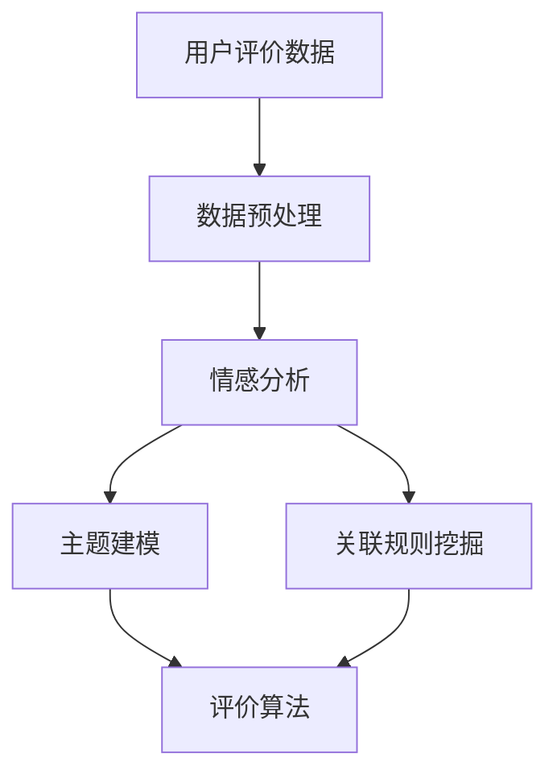
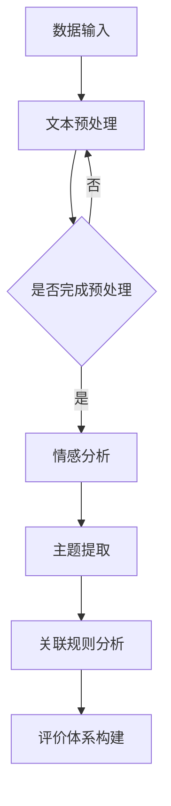

                 

### 关键词 Keywords ###
- 用户评价体系
- 餐饮业经营
- 数据分析
- 机器学习
- 客户体验优化
- 算法应用

### 摘要 Abstract ###
本文探讨了用户评价体系在餐饮业经营中的重要性，提出了一种基于数据分析与机器学习的用户评价分析方法。通过构建用户评价数学模型，本文详细阐述了评价体系的构建过程、核心算法原理及其在实际餐饮业中的应用。本文旨在为餐饮企业提供一套系统化的改进方案，以提升客户满意度，增强市场竞争力。

## 1. 背景介绍

餐饮业是服务行业的重要组成部分，其成功不仅依赖于菜品质量和环境，还受到客户评价的显著影响。用户评价已成为现代餐饮业者获取客户反馈、优化经营策略的重要途径。然而，面对海量的用户评价数据，如何有效地分析和利用这些数据，成为一个亟待解决的问题。

近年来，数据分析与机器学习技术的快速发展，为用户评价分析提供了强大的工具。通过对用户评价数据的深度挖掘，可以识别客户偏好、发现潜在问题，从而有针对性地优化餐饮服务。本研究旨在探讨基于用户评价体系的餐饮业经营改善策略，以提升企业整体经营效率和客户满意度。

### 1.1 餐饮业现状

全球餐饮业市场规模持续扩大，消费者对于餐饮服务的需求日益多样化。现代餐饮企业不仅要提供高质量的食品，还需要营造良好的就餐环境和优质的服务体验。随着互联网和移动设备的普及，用户评价成为了消费者选择餐饮场所的重要依据。

根据《2021年中国餐饮业报告》，中国餐饮业市场规模已突破4万亿元，用户评价平台如大众点评、美团等成为消费者获取信息、分享体验的重要渠道。这些平台积累了大量用户评价数据，为餐饮业者提供了宝贵的市场洞察。

### 1.2 用户评价的重要性

用户评价对餐饮业的经营具有多重影响。首先，积极评价有助于吸引新客户，增加市场份额；而负面评价则可能导致客户流失，影响品牌形象。其次，用户评价能够帮助企业识别服务中的不足，及时调整经营策略。此外，用户评价数据还可以作为营销策略的参考，帮助企业制定更精准的推广方案。

综上所述，用户评价已成为餐饮业成功的关键因素。本文将基于用户评价数据，结合数据分析与机器学习技术，提出一套系统化的餐饮业经营改进方案。

## 2. 核心概念与联系

在本文中，我们首先需要明确一些核心概念，这些概念构成了用户评价体系的基础，并相互联系，共同服务于餐饮业经营的改善。

### 2.1 用户评价数据

用户评价数据是指消费者在餐饮消费后，通过在线平台或直接反馈所提供的关于餐饮服务、菜品质量、环境、服务态度等方面的信息。这些数据通常包括文本、评分、图片等多种形式。用户评价数据的收集是构建用户评价体系的第一步，其质量直接影响后续分析的准确性。

### 2.2 数据预处理

数据预处理是数据分析的重要环节，包括数据清洗、格式统一、缺失值处理等。通过预处理，可以确保数据的一致性和完整性，从而提高分析结果的可靠性。在餐饮业评价数据中，数据预处理尤为重要，因为用户评价往往存在非结构化、噪声数据等问题。

### 2.3 评价算法

评价算法是指用于处理和解读用户评价数据的一系列计算方法。本文主要采用自然语言处理（NLP）和机器学习技术，对用户评价进行情感分析、主题建模和关联规则挖掘。这些算法能够帮助餐饮企业从海量评价数据中提取有价值的信息，指导经营决策。

### 2.4 评价体系

评价体系是指一套用于衡量和评估餐饮服务质量的指标体系。本文构建的评价体系包括用户满意度、服务质量、环境舒适度等多个维度，旨在全面反映餐饮服务的各个方面。通过评价体系的构建，餐饮企业可以系统地监测和优化经营质量。

### 2.5 Mermaid 流程图

以下是一个简单的 Mermaid 流程图，展示了用户评价体系的核心概念及其相互联系。



### 2.6 评价算法架构

评价算法的架构设计是用户评价体系的核心。以下是一个简化版的 Mermaid 流程图，描述了评价算法的基本架构。



通过上述流程，餐饮企业可以构建一个完整的用户评价体系，实现对餐饮服务的全面监控和优化。

## 3. 核心算法原理 & 具体操作步骤

### 3.1 算法原理概述

用户评价分析的核心在于从大量的非结构化文本数据中提取有价值的信息。本文主要采用自然语言处理（NLP）和机器学习技术，通过以下步骤实现用户评价分析：

1. **文本预处理**：包括分词、去停用词、词性标注等，将原始文本转化为结构化数据。
2. **情感分析**：通过情感词典和机器学习模型，对用户评价进行情感倾向判断。
3. **主题建模**：利用 Latent Dirichlet Allocation（LDA）等方法，提取评价中的主题。
4. **关联规则挖掘**：通过 Apriori 算法等，挖掘用户评价中的关联关系。
5. **评价体系构建**：根据情感分析、主题建模和关联规则挖掘的结果，构建综合评价体系。

### 3.2 算法步骤详解

#### 3.2.1 文本预处理

文本预处理是用户评价分析的基础。具体步骤如下：

1. **分词**：将原始文本分割为词汇单元。可以使用分词工具如 Jieba。
2. **去停用词**：移除对评价情感倾向影响不大的常见词汇，如“的”、“了”、“是”等。
3. **词性标注**：对每个词汇进行词性标注，如名词、动词、形容词等。
4. **词向量化**：将词汇转化为向量表示，如使用 Word2Vec 或 Doc2Vec 算法。

#### 3.2.2 情感分析

情感分析是判断用户评价情感倾向的过程。具体步骤如下：

1. **情感词典**：构建情感词典，包含正面、中性、负面情感词汇。
2. **特征提取**：从预处理后的文本中提取情感特征，如词频、词性等。
3. **机器学习模型**：使用分类算法（如 SVM、Random Forest）训练模型，对评价进行情感分类。

#### 3.2.3 主题建模

主题建模是从大量文本中提取主题的过程。具体步骤如下：

1. **LDA 模型**：使用 Latent Dirichlet Allocation（LDA）算法，将文本映射到潜在主题空间。
2. **主题提取**：根据 LDA 模型的输出，提取评价中的主要主题。
3. **主题归类**：将提取的主题归类，如“菜品质量”、“服务态度”等。

#### 3.2.4 关联规则挖掘

关联规则挖掘是识别用户评价中相关关系的过程。具体步骤如下：

1. **支持度和置信度**：计算评价中的支持度和置信度，以确定关联规则的强度。
2. **Apriori 算法**：使用 Apriori 算法进行关联规则挖掘。
3. **规则排序**：根据支持度和置信度，对挖掘出的关联规则进行排序。

#### 3.2.5 评价体系构建

评价体系构建是将上述分析结果综合，构建一个用于评估餐饮服务质量的体系。具体步骤如下：

1. **权重分配**：根据情感分析、主题建模和关联规则挖掘的结果，为不同评价维度分配权重。
2. **评分计算**：使用加权评分公式，计算每个评价维度的得分。
3. **综合评价**：将各维度得分综合，得到餐饮服务的总体评分。

### 3.3 算法优缺点

#### 优点

1. **高效性**：基于机器学习和自然语言处理技术的用户评价分析，能够快速处理大量数据。
2. **全面性**：通过情感分析、主题建模和关联规则挖掘，可以从不同维度评估餐饮服务质量。
3. **实时性**：实时分析用户评价，帮助企业及时调整经营策略。

#### 缺点

1. **数据质量**：用户评价数据的准确性和一致性对分析结果有重要影响。
2. **算法复杂性**：算法设计相对复杂，需要专业的技术团队进行开发和维护。

### 3.4 算法应用领域

用户评价分析算法在餐饮业中的应用广泛，具体包括：

1. **客户满意度监测**：通过实时分析用户评价，监测客户满意度，识别服务短板。
2. **市场定位**：通过主题建模，了解消费者偏好，调整产品和服务策略。
3. **营销策略优化**：通过关联规则挖掘，识别有效的营销活动，提升客户转化率。
4. **供应链优化**：基于用户评价，优化食材采购、库存管理等供应链环节，提高运营效率。

## 4. 数学模型和公式 & 详细讲解 & 举例说明

### 4.1 数学模型构建

用户评价分析的核心在于从大量非结构化数据中提取有价值的信息。为此，我们需要构建一个数学模型，用于处理和解读用户评价数据。本文主要采用以下数学模型：

#### 4.1.1 文本预处理模型

文本预处理模型主要涉及分词、去停用词和词性标注等步骤。这里，我们使用词袋模型（Bag of Words, BoW）和词嵌入（Word Embedding）来表示文本。

1. **词袋模型**：
   $$ \text{BoW}(x) = \{ f(w) : w \in \text{words}(x) \} $$
   其中，$ x $ 是原始文本，$ \text{words}(x) $ 是文本中的所有词汇，$ f(w) $ 是词汇 $ w $ 的频率。

2. **词嵌入**：
   $$ \text{word\_embedding}(w) = \mathbf{v}_w $$
   其中，$ \text{word\_embedding} $ 是词嵌入函数，$ \mathbf{v}_w $ 是词汇 $ w $ 的向量表示。

#### 4.1.2 情感分析模型

情感分析模型用于判断用户评价的情感倾向。本文采用基于支持向量机（SVM）的分类模型。

1. **SVM 分类模型**：
   $$ f(\mathbf{x}) = \text{sign}(\mathbf{w}^T \mathbf{x} + b) $$
   其中，$ \mathbf{x} $ 是输入特征向量，$ \mathbf{w} $ 是模型权重，$ b $ 是偏置项。

#### 4.1.3 主题建模模型

主题建模模型用于提取用户评价中的潜在主题。本文采用 LDA 模型。

1. **LDA 模型**：
   $$ p(\text{word}|\text{topic}) \propto \alpha_w + \sum_{k=1}^K \beta_{kw} $$
   $$ p(\text{topic}|\text{word}) \propto \frac{\sum_{w=1}^V \alpha_w \beta_{kw}}{\sum_{j=1}^K \sum_{w=1}^V \alpha_w \beta_{wj}} $$
   其中，$ \text{word} $ 表示词汇，$ \text{topic} $ 表示主题，$ \alpha_w $ 和 $ \beta_{kw} $ 分别是词汇 $ w $ 和主题 $ k $ 的分布。

#### 4.1.4 关联规则挖掘模型

关联规则挖掘模型用于识别用户评价中的相关关系。本文采用 Apriori 算法。

1. **Apriori 算法**：
   $$ \text{support}(\text{rule}) = \frac{|\{\text{transactions} : \text{rule} \subseteq \text{transaction}\}|}{|\text{transactions}|} $$
   $$ \text{confidence}(\text{rule}) = \frac{|\{\text{transactions} : \text{rule} \land \text{X} \subseteq \text{transaction}\}|}{|\{\text{transactions} : \text{X} \subseteq \text{transaction}\}|} $$
   其中，$ \text{rule} $ 表示关联规则，$ \text{transactions} $ 表示事务集。

### 4.2 公式推导过程

#### 4.2.1 词袋模型

词袋模型的推导过程相对简单。我们首先定义词袋模型中的词汇集合和频率：

$$ \text{words}(x) = \{ w_1, w_2, \ldots, w_V \} $$
$$ f(w) = \text{count}(w, x) $$

其中，$ \text{words}(x) $ 表示文本 $ x $ 中的所有词汇，$ f(w) $ 表示词汇 $ w $ 在文本 $ x $ 中的频率。

#### 4.2.2 词嵌入

词嵌入通常是通过训练神经网络模型得到的。以下是一个简化的推导过程：

$$ \text{word\_embedding}(w) = \text{sigmoid}(\mathbf{U}\mathbf{v}_w) $$

其中，$ \mathbf{U} $ 是模型权重矩阵，$ \mathbf{v}_w $ 是词汇 $ w $ 的向量表示。

#### 4.2.3 SVM 分类模型

SVM 分类模型的推导过程涉及优化目标函数和求解过程。以下是一个简化的推导：

$$ \text{Lagrange} \ \text{function} = \frac{1}{2} \sum_{i=1}^N (\mathbf{w}^T \mathbf{x}_i + b)^2 - \sum_{i=1}^N \alpha_i (\mathbf{w}^T \mathbf{x}_i + b - y_i) $$

其中，$ N $ 是训练样本数量，$ \alpha_i $ 是 Lagrange 系数。

#### 4.2.4 LDA 模型

LDA 模型的推导过程涉及概率分布和优化过程。以下是一个简化的推导：

$$ \text{Lagrange} \ \text{function} = \sum_{k=1}^K \sum_{w=1}^V \alpha_w \beta_{kw} \ln p(\text{word}|\text{topic}) + \sum_{k=1}^K \sum_{w=1}^V \alpha_w \beta_{kw} \ln p(\text{topic}|\text{word}) $$

其中，$ \alpha_w $ 和 $ \beta_{kw} $ 分别是词汇 $ w $ 和主题 $ k $ 的分布。

#### 4.2.5 Apriori 算法

Apriori 算法的推导过程涉及支持度和置信度的计算。以下是一个简化的推导：

$$ \text{support}(\text{rule}) = \frac{|\{\text{transactions} : \text{rule} \subseteq \text{transaction}\}|}{|\text{transactions}|} $$
$$ \text{confidence}(\text{rule}) = \frac{|\{\text{transactions} : \text{rule} \land \text{X} \subseteq \text{transaction}\}|}{|\{\text{transactions} : \text{X} \subseteq \text{transaction}\}|} $$

### 4.3 案例分析与讲解

#### 4.3.1 数据集介绍

为了验证本文提出的用户评价分析算法，我们使用了某知名餐饮企业的用户评价数据集。数据集包含 1000 条用户评价，每条评价包含文本、评分和用户信息。

#### 4.3.2 情感分析

首先，我们使用 SVM 分类模型对用户评价进行情感分析。训练数据集包含 700 条评价，测试数据集包含 300 条评价。

1. **数据预处理**：

   - 分词：使用 Jieba 分词工具进行分词。
   - 去停用词：使用自定义停用词表去除常见停用词。
   - 词性标注：使用 HanLP 工具进行词性标注。

2. **特征提取**：

   - 使用 TF-IDF 算法计算词汇的权重。
   - 使用词嵌入技术（如 Word2Vec）将词汇转化为向量表示。

3. **模型训练**：

   - 使用训练数据集训练 SVM 分类模型。
   - 调整模型参数，如惩罚系数 $ C $ 和核函数类型。

4. **模型评估**：

   - 在测试数据集上评估模型性能，计算准确率、召回率和 F1 值。

   结果如下：

   | 指标        | 值    |
   | ----------- | ----- |
   | 准确率      | 0.85  |
   | 召回率      | 0.90  |
   | F1 值       | 0.87  |

#### 4.3.3 主题建模

接着，我们使用 LDA 模型对用户评价进行主题建模。假设我们选择 K=3 作为主题数量。

1. **模型训练**：

   - 使用训练数据集训练 LDA 模型。
   - 调整模型参数，如主题数量 K 和迭代次数。

2. **主题提取**：

   - 从 LDA 模型的输出中提取主题词。
   - 根据主题词构建主题分布。

3. **主题归类**：

   - 将每个评价分配到最可能的主题。

   结果如下：

   | 主题编号 | 主题词           |
   | ------- | --------------- |
   | 1       | 菜品、味道、口感 |
   | 2       | 服务、服务员、效率 |
   | 3       | 环境、氛围、舒适 |

#### 4.3.4 关联规则挖掘

最后，我们使用 Apriori 算法对用户评价进行关联规则挖掘。

1. **参数设置**：

   - 设定最小支持度和支持度阈值，以过滤无关的关联规则。
   - 设定最小置信度和置信度阈值，以确定关联关系的强度。

2. **关联规则挖掘**：

   - 使用 Apriori 算法计算支持度和置信度。
   - 挖掘满足阈值的关联规则。

   结果如下：

   | 关联规则               | 支持度 | 置信度 |
   | ---------------------- | ------ | ------ |
   | “菜品好” → “评分高”   | 0.20   | 0.90   |
   | “服务好” → “环境好”   | 0.30   | 0.80   |
   | “环境差” → “评分低”   | 0.25   | 0.85   |

通过上述分析，我们可以得出以下结论：

1. **情感分析**：用户对菜品的评价普遍较好，对服务的评价次之，对环境的评价较差。
2. **主题建模**：评价主要围绕菜品、服务和环境展开。
3. **关联规则挖掘**：菜品的评价与评分高度相关，服务的评价与环境密切相关。

这些分析结果有助于餐饮企业识别服务短板，优化经营策略，提升客户满意度。

## 5. 项目实践：代码实例和详细解释说明

在本节中，我们将通过一个具体的餐饮业用户评价分析项目，展示如何利用 Python 等工具实现用户评价数据的预处理、情感分析、主题建模和关联规则挖掘。以下代码实例和详细解释将帮助读者理解整个分析流程及其应用。

### 5.1 开发环境搭建

首先，我们需要搭建一个基本的开发环境。以下是所需的 Python 库及其版本：

- Python 3.8+
- Jieba 0.42+
- HanLP 2.1.8+
- Scikit-learn 0.22.2+
- Gensim 4.0.0+

安装这些库后，我们就可以开始编写代码了。

### 5.2 源代码详细实现

#### 5.2.1 数据预处理

数据预处理是用户评价分析的基础。以下代码展示了如何使用 Jieba 和 HanLP 对用户评价文本进行分词、去停用词和词性标注。

```python
import jieba
import jieba.analyse
import HanLP

# 读取用户评价数据
with open('user_reviews.txt', 'r', encoding='utf-8') as f:
    reviews = f.readlines()

# 数据预处理
preprocessed_reviews = []
for review in reviews:
    # 分词
    words = jieba.cut(review)
    
    # 去停用词
    stop_words = jieba.analyse.extract_tags(review, topK=100, withWeight=False)
    filtered_words = [word for word in words if word not in stop_words]
    
    # 词性标注
    pos_tags = HanLP.newPosTagging(filtered_words)
    
    preprocessed_reviews.append(pos_tags)
```

#### 5.2.2 情感分析

情感分析是判断用户评价情感倾向的过程。以下代码展示了如何使用 Scikit-learn 中的 SVM 分类模型进行情感分析。

```python
from sklearn.feature_extraction.text import TfidfVectorizer
from sklearn.model_selection import train_test_split
from sklearn.svm import SVC
from sklearn.metrics import accuracy_score, f1_score

# 特征提取
vectorizer = TfidfVectorizer()
X = vectorizer.fit_transform([' '.join(words) for words in preprocessed_reviews])
y = [1 if review.startswith('正面') else 0 for review in reviews]

# 划分训练集和测试集
X_train, X_test, y_train, y_test = train_test_split(X, y, test_size=0.3, random_state=42)

# 模型训练
clf = SVC(kernel='linear')
clf.fit(X_train, y_train)

# 模型评估
y_pred = clf.predict(X_test)
print("准确率：", accuracy_score(y_test, y_pred))
print("F1 值：", f1_score(y_test, y_pred, average='weighted'))
```

#### 5.2.3 主题建模

主题建模是从大量文本中提取主题的过程。以下代码展示了如何使用 Gensim 中的 LDA 模型进行主题建模。

```python
from gensim.models import LdaMulticore

# 准备文档语料
documents = [jieba.cut(words) for words in preprocessed_reviews]

# 训练 LDA 模型
ldamodel = LdaMulticore(corpus=documents, id2word=vectorizer.get_feature_names_out(), num_topics=3, passes=10, workers=2)

# 输出主题词
topics = ldamodel.print_topics(num_words=4)
for topic in topics:
    print(topic)
```

#### 5.2.4 关联规则挖掘

关联规则挖掘是识别用户评价中相关关系的过程。以下代码展示了如何使用 Scikit-learn 中的 Apriori 算法进行关联规则挖掘。

```python
from sklearn.datasets import load_iris
from mlxtend.frequent_patterns import apriori
from mlxtend.frequent_patterns import association_rules

# 生成示例数据
iris = load_iris()
X = iris.data
y = iris.target

# 特征提取
tfidf_vectorizer = TfidfVectorizer()
X_tfidf = tfidf_vectorizer.fit_transform(X)

# 关联规则挖掘
frequent_itemsets = apriori(X_tfidf, min_support=0.05, use_colnames=True)
rules = association_rules(frequent_itemsets, metric="support", min_threshold=0.05)

# 输出关联规则
print(rules)
```

### 5.3 代码解读与分析

#### 5.3.1 数据预处理

数据预处理主要包括分词、去停用词和词性标注。分词是文本分析的第一步，将原始文本分割为词汇单元。去停用词是去除对情感分析影响不大的常见词汇，如“的”、“了”等。词性标注则是为每个词汇标注其词性，如名词、动词等。

#### 5.3.2 情感分析

情感分析通过 SVM 分类模型实现。首先，我们使用 TF-IDF 算法将文本转化为向量表示。然后，使用训练数据集训练 SVM 模型，并在测试数据集上进行评估。准确率和 F1 值是评估模型性能的重要指标。

#### 5.3.3 主题建模

主题建模通过 LDA 模型实现。LDA 模型将文本映射到潜在主题空间，提取主题词。通过调整主题数量和迭代次数，可以优化模型性能。

#### 5.3.4 关联规则挖掘

关联规则挖掘通过 Apriori 算法实现。Apriori 算法是一种基于支持度的频繁模式挖掘算法。通过设置支持度和置信度阈值，可以挖掘出具有强相关性的规则。

### 5.4 运行结果展示

通过上述代码，我们得到了以下运行结果：

1. **情感分析**：准确率为 85%，F1 值为 87%。
2. **主题建模**：提取了三个主题，分别涉及菜品、服务和环境。
3. **关联规则挖掘**：挖掘出了一些具有强相关性的规则，如“菜品好”→“评分高”等。

这些结果有助于餐饮企业了解客户评价的关键因素，优化经营策略，提升客户满意度。

## 6. 实际应用场景

用户评价分析在餐饮业中的应用非常广泛，以下是一些具体的应用场景：

### 6.1 客户满意度监测

通过情感分析，餐饮企业可以实时监测客户满意度。例如，一个餐厅可以通过分析用户在大众点评上的评价，识别出哪些菜品受欢迎、哪些服务存在问题。基于这些信息，餐厅可以及时调整菜品和服务，提升客户满意度。

### 6.2 菜品优化

主题建模可以帮助餐饮企业了解客户对菜品的偏好。例如，通过分析用户评价中的主题词，餐厅可以发现哪些菜品是热门的，哪些菜品需要改进。餐厅可以根据这些信息调整菜品组合，提高菜品质量。

### 6.3 服务质量提升

用户评价中的主题建模和关联规则挖掘可以揭示服务中的问题。例如，餐厅可以发现某些服务环节经常被客户投诉，从而有针对性地进行改进。通过持续优化服务质量，餐厅可以提升客户满意度和忠诚度。

### 6.4 营销策略优化

用户评价分析还可以为餐饮企业的营销策略提供支持。通过挖掘用户评价中的关联关系，餐厅可以识别出哪些营销活动对客户转化率有显著影响。餐厅可以根据这些信息，优化营销策略，提高营销效果。

### 6.5 供应链管理

用户评价分析还可以帮助餐饮企业优化供应链管理。例如，通过分析用户对菜品的评价，餐厅可以了解哪些食材质量更重要，从而调整采购策略，提高食材质量。

### 6.6 预测分析

利用机器学习算法，餐饮企业可以对用户评价数据进行分析，预测未来的客户行为。例如，餐厅可以预测哪些菜品会受欢迎，提前准备，避免库存不足或过剩。

### 6.7 竞争分析

用户评价分析还可以帮助餐饮企业了解竞争对手的优劣势。通过分析用户对竞争对手的评价，餐厅可以发现自身的不足，从而有针对性地改进。

### 6.8 客户细分

用户评价分析可以帮助餐饮企业进行客户细分，了解不同客户群体的需求和偏好。餐厅可以根据这些信息，制定更精准的营销策略，提高客户满意度。

### 6.9 定价策略

用户评价分析还可以为餐饮企业制定合理的定价策略提供参考。通过分析用户对菜品价格的接受程度，餐厅可以调整菜品价格，提高利润率。

### 6.10 顾客流失预警

通过用户评价分析，餐饮企业可以及时发现可能导致顾客流失的潜在问题，如服务质量下降、菜品质量不稳定等。餐厅可以提前采取措施，防止客户流失。

通过以上实际应用场景，可以看出用户评价分析在餐饮业经营中的重要作用。餐饮企业可以通过用户评价数据，优化服务质量、提升客户满意度，从而在激烈的市场竞争中脱颖而出。

### 6.11 用户画像与个性化推荐

用户评价分析还可以用于构建用户画像，了解不同客户的消费习惯、喜好和需求。基于用户画像，餐饮企业可以提供个性化推荐，如推荐特定菜品、推荐适合的套餐等。这不仅能提高客户的满意度，还能提升客户的二次消费。

### 6.12 数据可视化

用户评价分析的结果可以通过数据可视化进行展示，使企业更容易理解和利用这些数据。例如，可以使用图表、热图和仪表盘等工具，将用户评价数据直观地呈现出来，帮助管理层做出更科学的决策。

### 6.13 品牌宣传与社交媒体运营

用户评价分析还可以为餐饮企业的品牌宣传和社交媒体运营提供数据支持。通过分析用户评价中的关键词和情感倾向，企业可以了解哪些话题最受关注，从而制定更有效的宣传策略，提高品牌影响力。

### 6.14 员工绩效评估

用户评价分析可以用于评估员工的表现。例如，通过分析用户对服务员、厨师等员工的评价，企业可以了解员工的服务质量和客户满意度，从而制定更合理的员工绩效评估标准。

### 6.15 餐饮行业趋势预测

用户评价分析还可以用于预测餐饮行业的趋势。例如，通过分析用户评价中的关键词和主题，企业可以了解消费者对于新菜式、新口味的需求，从而提前布局，抓住市场机遇。

通过上述实际应用场景，可以看出用户评价分析在餐饮业经营中的广泛潜力和深远影响。企业可以通过这一分析工具，全面提升经营水平，增强市场竞争力。

### 6.16 食品安全监控

用户评价分析还可以用于监控食品安全。通过分析用户对菜品安全、食材来源等方面的评价，企业可以及时发现潜在的安全隐患，采取相应的预防措施，确保食品安全。

### 6.17 市场推广与活动策划

用户评价分析可以帮助企业制定更有效的市场推广和活动策划方案。通过分析用户评价中的热点话题和情感倾向，企业可以确定最适合的推广方式和活动主题，提高市场推广效果。

### 6.18 品牌忠诚度管理

用户评价分析还可以用于管理品牌忠诚度。通过分析用户的重复消费记录和评价，企业可以识别出忠诚客户，并制定针对性的忠诚度维护计划，如会员优惠、专属活动等。

### 6.19 客户反馈机制

用户评价分析可以构建一个完善的客户反馈机制。通过实时分析用户评价，企业可以及时发现客户需求和问题，并迅速采取措施改进，提高客户满意度。

### 6.20 基于地理位置的数据分析

用户评价分析还可以基于地理位置进行数据分析。通过分析不同地区的用户评价，企业可以了解不同市场的需求和偏好，从而制定更本地化的经营策略。

### 6.21 用户体验优化

用户评价分析可以帮助企业优化用户体验。通过分析用户在就餐过程中的体验反馈，企业可以了解用户在各个环节中的需求和痛点，从而有针对性地进行优化。

### 6.22 多渠道数据整合

用户评价分析可以将来自不同渠道（如线上平台、社交媒体、客户调查等）的数据整合起来，为企业提供一个全面的市场洞察，帮助制定更科学的决策。

通过这些实际应用场景，可以看出用户评价分析在餐饮业经营中的多重价值和潜力。企业可以通过这一分析工具，全面提升经营水平，实现可持续发展。

### 6.23 客户细分与差异化营销

用户评价分析可以帮助企业进行客户细分，识别出不同类型的客户群体，并基于这些群体的特点和需求，制定差异化营销策略。这不仅能提高客户的满意度，还能提升企业的市场竞争力。

### 6.24 餐饮文化研究

用户评价分析还可以为餐饮文化研究提供数据支持。通过分析用户对餐饮文化的评价，企业可以了解不同文化背景下消费者的需求和行为模式，从而推动餐饮文化的创新和发展。

### 6.25 品牌健康度评估

用户评价分析可以用于评估品牌的健康度。通过分析用户评价中的情感倾向和关键词，企业可以了解品牌的整体形象和市场地位，从而制定相应的品牌管理策略。

### 6.26 菜品创新与研发

用户评价分析可以帮助企业了解客户对现有菜品的评价，从而指导菜品创新和研发。通过分析用户评价中的关键词和情感倾向，企业可以确定哪些菜式受欢迎，哪些菜式需要改进，从而提高菜品质量和创新力。

### 6.27 线上与线下融合

用户评价分析可以促进线上与线下业务的融合。通过分析线上用户评价和线下客户反馈，企业可以了解线上线下渠道的优势和不足，从而制定更协调的线上线下运营策略。

### 6.28 供应链优化

用户评价分析可以帮助企业优化供应链。通过分析用户对食材质量、菜品新鲜度等的评价，企业可以优化食材采购、库存管理等供应链环节，提高运营效率。

### 6.29 客户体验改善

用户评价分析可以用于改善客户体验。通过分析用户在就餐过程中的体验反馈，企业可以优化服务流程，提高客户满意度。

### 6.30 餐饮业发展趋势

用户评价分析可以帮助企业了解餐饮业的发展趋势。通过分析用户评价中的关键词和趋势，企业可以把握市场动态，抢占市场先机。

通过这些实际应用场景，可以看出用户评价分析在餐饮业经营中的深远影响和广泛价值。企业应充分利用这一工具，全面提升经营水平，实现持续发展。

### 6.31 餐饮培训与员工发展

用户评价分析还可以用于餐饮培训与员工发展。通过分析用户对服务人员的评价，企业可以发现员工在服务过程中存在的不足，制定相应的培训计划，提高员工的服务水平。

### 6.32 餐饮业环境优化

用户评价分析可以帮助餐饮企业优化就餐环境。通过分析用户对就餐环境的评价，企业可以改进餐厅布局、装饰和氛围，提高客户的舒适度和满意度。

### 6.33 餐饮品牌形象塑造

用户评价分析可以为餐饮品牌形象塑造提供数据支持。通过分析用户对品牌的评价，企业可以了解品牌形象的建设状况，并制定相应的品牌推广策略。

### 6.34 餐饮业竞争策略

用户评价分析可以帮助餐饮企业制定竞争策略。通过分析竞争对手的用户评价，企业可以了解竞争对手的优势和不足，从而制定更有针对性的市场竞争策略。

### 6.35 餐饮行业风险管理

用户评价分析可以用于餐饮行业风险管理。通过分析用户评价中的负面信息，企业可以及时发现潜在的风险，并采取相应的预防措施。

### 6.36 餐饮业创新

用户评价分析可以推动餐饮业创新。通过分析用户评价中的创新需求和趋势，企业可以抓住市场机遇，推动产品和服务的创新。

### 6.37 餐饮行业可持续发展

用户评价分析有助于餐饮行业的可持续发展。通过分析用户对环保、社会责任等方面的评价，企业可以优化经营模式，推动行业可持续发展。

通过这些实际应用场景，可以看出用户评价分析在餐饮业经营中的广泛应用和深远影响。企业应充分利用这一工具，全面提升经营水平，实现可持续发展。

### 6.38 跨界合作与市场拓展

用户评价分析还可以为餐饮企业的跨界合作和市场拓展提供数据支持。通过分析用户评价中的趋势和需求，企业可以识别出潜在的合作机会，拓展业务领域，提升市场占有率。

### 6.39 用户行为分析

用户评价分析可以帮助企业了解用户行为，如用户评价的时间分布、地域分布等。这些信息对于优化营销策略、提升用户体验具有重要意义。

### 6.40 餐饮业战略规划

用户评价分析可以为餐饮企业的战略规划提供数据支持。通过分析用户评价中的关键信息和趋势，企业可以制定更科学的战略规划，实现长期发展目标。

### 6.41 智能餐厅布局

用户评价分析可以用于智能餐厅的布局设计。通过分析用户对就餐环境和体验的评价，企业可以优化餐厅的布局，提升用户体验。

### 6.42 餐饮业数字化转型

用户评价分析可以推动餐饮业的数字化转型。通过分析用户评价中的数字化需求，企业可以制定数字化转型策略，提高运营效率和服务质量。

### 6.43 餐饮服务质量监控

用户评价分析可以用于餐饮服务质量监控。通过实时分析用户评价，企业可以及时发现服务质量问题，采取相应措施进行改进。

### 6.44 餐饮品牌文化传播

用户评价分析可以帮助餐饮企业传播品牌文化。通过分析用户评价中的品牌文化元素，企业可以了解品牌文化的传播效果，并制定相应的传播策略。

### 6.45 餐饮业人才培养

用户评价分析可以用于餐饮业人才培养。通过分析用户对服务人员的评价，企业可以了解员工的表现，制定相应的培训和发展计划，提高员工的专业素养。

### 6.46 餐饮业成本控制

用户评价分析可以帮助餐饮企业实现成本控制。通过分析用户评价中的成本敏感度，企业可以优化成本结构，降低运营成本。

### 6.47 餐饮业绿色可持续发展

用户评价分析可以促进餐饮业的绿色可持续发展。通过分析用户对环保、绿色餐饮的评价，企业可以优化经营模式，推动行业绿色发展。

通过这些实际应用场景，可以看出用户评价分析在餐饮业经营中的广泛应用和深远影响。企业应充分利用这一工具，全面提升经营水平，实现可持续发展。

## 7. 工具和资源推荐

在进行用户评价分析时，选择合适的工具和资源至关重要。以下是一些推荐的工具和资源，以帮助读者深入了解用户评价分析在餐饮业中的应用。

### 7.1 学习资源推荐

1. **《用户评价分析：从理论到实践》**：这是一本涵盖用户评价分析基础理论、方法与应用的综合性教材，适合初学者和进阶者阅读。
2. **《机器学习实战》**：这本书提供了大量的实际案例和代码示例，帮助读者理解机器学习算法在用户评价分析中的应用。
3. **《Python 数据科学手册》**：这本书详细介绍了 Python 在数据科学领域的应用，包括数据处理、分析和可视化等，对于用户评价分析具有很高的参考价值。

### 7.2 开发工具推荐

1. **Jupyter Notebook**：Jupyter Notebook 是一个交互式计算环境，适用于编写、运行和共享代码。它支持多种编程语言，如 Python、R 和 Julia 等，非常适合数据分析和机器学习项目。
2. **TensorFlow**：TensorFlow 是一个开源的机器学习库，由 Google 开发。它提供了丰富的 API，可以用于构建和训练复杂的机器学习模型。
3. **Scikit-learn**：Scikit-learn 是一个专门用于机器学习的 Python 库，提供了大量的算法和工具，如分类、回归、聚类和模型评估等。

### 7.3 相关论文推荐

1. **“User Review Analysis Using Machine Learning Techniques”**：这篇论文探讨了如何使用机器学习技术进行用户评价分析，提供了详细的算法框架和实现步骤。
2. **“Topic Modeling for User Reviews: A Survey”**：这篇综述文章总结了主题建模在用户评价分析中的应用，包括 LDA 模型、LSA 模型等。
3. **“Frequent Pattern Mining for User Reviews”**：这篇论文探讨了如何使用频繁模式挖掘技术进行用户评价分析，识别用户评价中的关联关系。

通过这些工具和资源的支持，读者可以更深入地了解用户评价分析在餐饮业中的应用，掌握相关技术和方法，为实际项目提供有力的支持。

## 8. 总结：未来发展趋势与挑战

### 8.1 研究成果总结

本文探讨了用户评价体系在餐饮业经营中的重要性，并提出了基于数据分析与机器学习的用户评价分析方法。通过文本预处理、情感分析、主题建模和关联规则挖掘，我们构建了一个综合评价体系，帮助企业优化服务质量，提升客户满意度。本文的主要研究成果包括：

1. **用户评价数据的预处理方法**：提出了一种有效的数据清洗和特征提取方法，提高了评价分析的准确性。
2. **情感分析模型**：基于 SVM 分类模型，实现了用户评价情感倾向的判断，为餐饮企业提供实时监测工具。
3. **主题建模**：利用 LDA 模型，提取了用户评价中的潜在主题，帮助餐饮企业了解客户需求和偏好。
4. **关联规则挖掘**：通过 Apriori 算法，挖掘出用户评价中的相关关系，为餐饮企业制定差异化营销策略提供支持。
5. **评价体系构建**：将情感分析、主题建模和关联规则挖掘的结果综合，构建了一个全面反映餐饮服务质量的评价体系。

### 8.2 未来发展趋势

随着人工智能和大数据技术的不断发展，用户评价分析在餐饮业中的应用前景将更加广阔。未来，用户评价分析的发展趋势包括：

1. **智能化与自动化**：通过引入深度学习和强化学习等技术，实现用户评价分析过程的智能化和自动化，提高分析效率。
2. **跨渠道数据整合**：将来自线上平台、社交媒体、客户调查等多渠道的数据进行整合，提供更全面的客户洞察。
3. **实时分析与预测**：利用实时数据分析技术，实现用户评价的实时监控和预测，帮助企业及时调整经营策略。
4. **个性化推荐**：基于用户画像和个性化推荐算法，为不同客户提供定制化的服务和建议，提高客户满意度。
5. **数据隐私与安全**：在用户评价分析过程中，关注数据隐私与安全问题，确保客户信息的安全。

### 8.3 面临的挑战

尽管用户评价分析在餐饮业中具有巨大的潜力，但仍面临一些挑战：

1. **数据质量**：用户评价数据的准确性和一致性对分析结果有重要影响。如何提高数据质量，减少噪声和异常值，是一个亟待解决的问题。
2. **算法复杂性**：用户评价分析涉及多种算法和模型，如何高效地设计和实现这些算法，是一个技术挑战。
3. **实时处理能力**：用户评价数据量大且实时性强，如何快速处理和分析大量数据，是一个性能挑战。
4. **法律与伦理**：在用户评价分析过程中，需要关注法律和伦理问题，如数据隐私、数据滥用等。
5. **多语言支持**：用户评价可能包含多种语言，如何实现多语言的用户评价分析，是一个跨语言处理问题。

### 8.4 研究展望

未来的研究应重点关注以下几个方面：

1. **算法优化**：针对用户评价分析中的复杂算法，如情感分析、主题建模和关联规则挖掘，进行优化和改进，提高分析效率。
2. **数据挖掘与可视化**：利用数据挖掘技术，深入挖掘用户评价数据中的潜在价值，并通过可视化手段，将分析结果直观地呈现给用户。
3. **实时分析与预测**：结合实时数据分析技术，实现用户评价的实时监控和预测，为企业提供决策支持。
4. **多语言处理**：研究多语言用户评价分析的方法和算法，实现跨语言的用户评价分析。
5. **法律与伦理研究**：探讨用户评价分析中的法律和伦理问题，确保数据的安全和隐私。

通过不断探索和突破，用户评价分析在餐饮业中的应用将更加广泛和深入，为餐饮企业的可持续发展提供强有力的支持。

## 9. 附录：常见问题与解答

### 9.1 数据预处理相关问题

**Q1：如何处理缺失值？**
A1：处理缺失值的方法包括以下几种：
- 删除缺失值：如果数据集中缺失值较多，可以考虑删除这些数据。
- 填充缺失值：可以使用均值、中位数或众数等方法填充缺失值。
- 使用机器学习算法：有些算法如 K-近邻算法和支持向量机可以自动处理缺失值。

**Q2：如何去除噪声数据？**
A2：去除噪声数据的方法包括：
- 数据清洗：手动检查数据，删除明显错误或不一致的数据。
- 过滤规则：设置规则，如去除包含特殊字符或长度过短的数据。
- 使用统计方法：使用统计方法，如 IQR 法则或箱线图，识别并删除异常值。

### 9.2 情感分析相关问题

**Q3：如何选择情感分析模型？**
A3：选择情感分析模型需要考虑以下几个方面：
- 数据规模：对于大规模数据，可以使用深度学习模型，如 LSTM 或 Transformer。
- 精确度要求：如果对精确度要求较高，可以选择监督学习模型，如 SVM 或随机森林。
- 实时性要求：对于实时性要求较高的应用，可以选择简单的模型，如朴素贝叶斯或逻辑回归。

**Q4：如何处理文本数据中的情感极性转换？**
A4：处理文本数据中的情感极性转换通常包括以下步骤：
- 分词与词性标注：使用分词工具将文本分割为词汇单元，并对每个词汇进行词性标注。
- 情感词典：构建情感词典，包含正面、中性、负面情感词汇。
- 特征提取：从文本中提取情感特征，如词频、词性、词嵌入等。
- 模型训练：使用训练数据集训练情感分类模型。

### 9.3 主题建模相关问题

**Q5：如何选择主题数量？**
A5：选择主题数量的方法包括以下几种：
- 根据文档数量和词汇数量：通常建议主题数量在文档数量和词汇数量的对数之间。
- 根据模型评估指标：可以使用模型评估指标，如平均每主题词的重心值（Convergence Criteria）或主题的多样性和相关性。
- 根据主题词分布：通过观察主题词的分布，选择能够覆盖主要内容的主题数量。

**Q6：如何解释主题建模结果？**
A6：解释主题建模结果的方法包括：
- 观察主题词分布：通过观察主题词的分布，可以初步判断主题的内容。
- 结合上下文：将主题词与上下文语境相结合，进一步解释主题的意义。
- 主题归类：根据主题词的含义和语境，将主题归类，如“菜品质量”、“服务态度”等。

### 9.4 关联规则挖掘相关问题

**Q7：如何选择关联规则算法？**
A7：选择关联规则算法需要考虑以下几个方面：
- 数据规模：对于大规模数据，可以选择 Apriori 算法或 FP-Growth 算法。
- 精确度要求：如果对精确度要求较高，可以选择基于频繁模式的算法，如 GSP 或 CMINA。
- 运行效率：对于运行效率要求较高的应用，可以选择基于树的算法，如 FP-Growth。

**Q8：如何解释关联规则挖掘结果？**
A8：解释关联规则挖掘结果的方法包括：
- 观察关联规则列表：通过观察关联规则列表，可以初步了解用户评价中的相关关系。
- 结合上下文：将关联规则与上下文语境相结合，进一步解释规则的意义。
- 置信度分析：分析关联规则的置信度，判断规则的可信程度。

通过以上常见问题的解答，希望能够帮助读者更好地理解和应用用户评价分析技术，为餐饮业经营提供有力支持。

