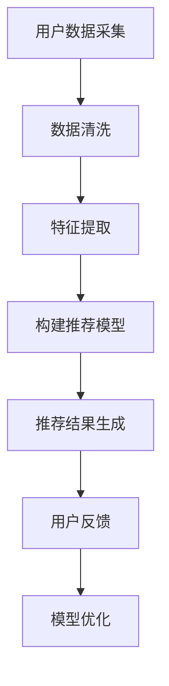

                 

关键词：社交网络，学术合作，推荐系统，数据挖掘，人工智能

摘要：在当今快速发展的学术环境中，有效的合作是推动研究进展的关键。本文探讨了如何利用社交网络数据构建推荐系统，以帮助学术研究人员找到潜在的合作伙伴。通过介绍核心概念、算法原理、数学模型、实践案例和未来展望，本文为学术合作推荐领域的研究者和从业者提供了有价值的指导。

## 1. 背景介绍

随着科学研究的复杂性和交叉性日益增强，学术合作成为了推动科学进步的关键因素。然而，找到合适的合作伙伴仍然是一个挑战。传统的方法包括通过学术会议、同行推荐和公开发表的论文来寻找合作者，但这些方法往往效率低下，且覆盖面有限。随着互联网和社交网络的普及，利用这些平台的数据构建推荐系统，成为了一种新兴且有效的解决方案。

社交网络为学术合作提供了丰富的信息资源，例如研究人员的兴趣、合作历史、论文引用关系等。这些数据可以用于挖掘潜在的合作机会，提高合作的匹配度和效率。因此，基于社交网络推荐学术合作者，已经成为学术界和工业界关注的焦点。

本文将从以下几个方面展开讨论：

- 核心概念与联系
- 核心算法原理与具体操作步骤
- 数学模型和公式
- 项目实践：代码实例和详细解释
- 实际应用场景
- 未来应用展望

## 2. 核心概念与联系

在探讨基于社交网络的学术合作者推荐之前，我们需要理解几个核心概念：

### 2.1 社交网络

社交网络是指由个体（如研究人员）及其相互关系（如合作、引用）构成的网络结构。在这个网络中，每个节点代表一个个体，每条边代表个体之间的某种关联。

### 2.2 研究领域

研究领域是指研究人员在特定学科领域中的研究兴趣和专长。领域划分有助于我们更精确地找到具有相似兴趣的潜在合作者。

### 2.3 推荐系统

推荐系统是一种通过分析用户的历史行为和兴趣，向用户推荐相关内容或对象的算法系统。在学术合作者推荐中，推荐系统可以帮助研究人员找到具有共同研究兴趣的合作伙伴。

### 2.4 数据挖掘

数据挖掘是从大量数据中提取有价值信息的过程。在学术合作者推荐中，数据挖掘技术用于挖掘社交网络中的潜在合作关系。

### 2.5 机器学习

机器学习是一种通过数据训练模型，使其能够进行预测或分类的技术。在学术合作者推荐中，机器学习算法可以用于构建推荐模型。

### 2.6 Mermaid 流程图

以下是基于社交网络推荐学术合作者的Mermaid流程图：



### 2.7 核心概念联系

社交网络数据是构建学术合作推荐系统的基石，通过数据挖掘和机器学习技术，我们可以从这些数据中提取出有价值的信息，进而构建推荐模型。推荐模型生成的结果需要经过用户反馈进行优化，以实现更精准的推荐。

## 3. 核心算法原理与具体操作步骤

### 3.1 算法原理概述

基于社交网络的学术合作者推荐算法主要包括以下几个步骤：

1. **用户数据采集**：收集研究人员的社交网络数据，如合作历史、发表论文、研究领域等。
2. **数据清洗**：对采集到的数据进行分析，去除无效信息和噪声。
3. **特征提取**：从清洗后的数据中提取关键特征，如研究领域、发表论文数量、合作频率等。
4. **构建推荐模型**：利用机器学习算法，如协同过滤、矩阵分解等，构建推荐模型。
5. **推荐结果生成**：根据用户的历史行为和特征，生成推荐结果。
6. **用户反馈**：收集用户对推荐结果的反馈，用于模型优化。
7. **模型优化**：根据用户反馈，调整推荐模型，以提高推荐效果。

### 3.2 算法步骤详解

#### 3.2.1 用户数据采集

用户数据采集是推荐系统的第一步，它决定了后续数据处理和模型构建的质量。在学术合作者推荐中，我们可以从以下渠道收集数据：

- **学术社交网络平台**：如ResearchGate、Academia.edu等，这些平台提供了丰富的用户数据，如研究兴趣、发表论文、合作历史等。
- **学术论文数据库**：如PubMed、IEEE Xplore等，这些数据库包含了大量的学术论文信息，可以用于提取研究人员的合作关系和研究领域。
- **社交媒体**：如LinkedIn、Twitter等，这些平台可以提供研究人员的学术背景、职业经历和社交网络关系。

#### 3.2.2 数据清洗

数据清洗是确保数据质量和推荐效果的重要步骤。在数据清洗过程中，我们需要关注以下问题：

- **缺失值处理**：对于缺失的数据，可以采用填充策略，如平均值填充、中值填充等。
- **异常值处理**：去除数据中的异常值，以防止它们对推荐模型产生不利影响。
- **重复数据处理**：去除重复的数据记录，以避免重复计算。
- **数据格式转换**：将不同来源的数据转换为统一的格式，如时间戳转换为数字格式等。

#### 3.2.3 特征提取

特征提取是从原始数据中提取对推荐模型有用的信息。在学术合作者推荐中，常见的特征包括：

- **研究领域**：根据研究人员的发表论文，提取其研究领域，如计算机科学、生物学、物理学等。
- **发表论文数量**：研究人员在特定领域发表的论文数量，可以反映其学术影响力。
- **合作频率**：研究人员之间的合作频率，可以反映合作关系的紧密程度。
- **合作历史**：研究人员之间的合作历史，可以用于预测未来合作的可能性。

#### 3.2.4 构建推荐模型

推荐模型的构建是推荐系统的核心步骤。在学术合作者推荐中，我们可以采用以下几种常见的机器学习算法：

- **协同过滤**：协同过滤是一种基于用户历史行为的推荐算法。在学术合作者推荐中，我们可以使用用户合作历史数据，构建协同过滤模型，以预测用户之间的合作可能性。
- **矩阵分解**：矩阵分解是一种将用户-物品评分矩阵分解为用户特征矩阵和物品特征矩阵的算法。在学术合作者推荐中，我们可以将用户-合作矩阵分解为用户特征矩阵和合作者特征矩阵，以提取用户和合作者的潜在特征。
- **图神经网络**：图神经网络是一种基于图结构进行学习的算法。在学术合作者推荐中，我们可以使用图神经网络，利用社交网络结构信息，构建推荐模型。

#### 3.2.5 推荐结果生成

推荐结果生成是根据用户特征和合作者特征，利用推荐模型生成推荐列表。在学术合作者推荐中，我们可以采用以下策略：

- **Top-N推荐**：根据推荐模型的得分，从潜在合作者中选取Top-N个最高分的个体作为推荐结果。
- **基于用户兴趣的推荐**：根据用户的研究兴趣，推荐与其兴趣相匹配的合作者。
- **基于合作历史的推荐**：根据用户的历史合作记录，推荐具有相似合作历史的合作者。

#### 3.2.6 用户反馈

用户反馈是评估推荐效果的重要手段。在学术合作者推荐中，我们可以通过以下方式收集用户反馈：

- **推荐结果评估**：用户对推荐结果的满意度评估，如好评、中评、差评等。
- **合作成功案例**：用户通过推荐找到的合作者，最终是否成功合作。
- **修改推荐需求**：用户根据推荐结果，修改其合作需求，以获得更精准的推荐。

#### 3.2.7 模型优化

模型优化是提高推荐效果的关键步骤。在学术合作者推荐中，我们可以通过以下方式优化推荐模型：

- **基于用户反馈的模型调整**：根据用户的反馈，调整推荐模型中的参数，以提高推荐准确性。
- **引入新特征**：根据用户反馈和新需求，引入新的特征，以丰富推荐模型。
- **模型集成**：将多个推荐模型进行集成，以获得更好的推荐效果。

### 3.3 算法优缺点

#### 3.3.1 优点

- **高效性**：基于社交网络数据的推荐系统可以快速地找到潜在的合作伙伴，提高合作效率。
- **准确性**：通过机器学习和数据挖掘技术，推荐系统可以准确地预测用户之间的合作可能性。
- **个性化**：推荐系统可以根据用户的研究兴趣和合作历史，提供个性化的推荐结果。

#### 3.3.2 缺点

- **数据质量**：社交网络数据的质量直接影响推荐效果，数据噪声和缺失值会影响推荐准确性。
- **计算成本**：构建和优化推荐模型需要大量的计算资源，特别是在大型社交网络中。
- **隐私保护**：在收集和处理社交网络数据时，需要关注用户隐私保护问题，以避免数据泄露。

### 3.4 算法应用领域

基于社交网络的学术合作者推荐算法可以应用于多个领域：

- **高校和研究机构**：帮助研究人员找到具有共同研究兴趣的合作伙伴，推动科学研究进展。
- **科研项目管理**：协助项目管理者识别和推荐合适的合作者，提高项目成功率。
- **科技企业**：帮助科技企业寻找具有互补技能的合作者，推动技术创新。

## 4. 数学模型和公式

在学术合作者推荐中，数学模型和公式用于描述推荐算法的原理和实现。以下是几个关键的数学模型和公式：

### 4.1 数学模型构建

#### 4.1.1 协同过滤模型

协同过滤模型可以通过以下公式表示：

$$
R_{ij} = \mu + u_i^T p_j + p_j^T u_j + e_{ij}
$$

其中，$R_{ij}$ 是用户 $i$ 对物品 $j$ 的评分预测，$\mu$ 是所有用户评分的平均值，$u_i$ 和 $p_j$ 分别是用户 $i$ 和物品 $j$ 的特征向量，$e_{ij}$ 是误差项。

#### 4.1.2 矩阵分解模型

矩阵分解模型可以通过以下公式表示：

$$
X = U \odot V^T + E
$$

其中，$X$ 是用户-物品评分矩阵，$U$ 和 $V$ 分别是用户特征矩阵和物品特征矩阵，$\odot$ 表示Hadamard积，$E$ 是误差项。

#### 4.1.3 图神经网络模型

图神经网络模型可以通过以下公式表示：

$$
h_{v}^{(l+1)} = \sigma \left( \sum_{u \in \mathcal{N}(v)} W^{(l)} h_{u}^{(l)} + b^{(l)} \right)
$$

其中，$h_{v}^{(l+1)}$ 是节点 $v$ 在第 $(l+1)$ 层的嵌入向量，$\mathcal{N}(v)$ 是节点 $v$ 的邻居集合，$W^{(l)}$ 是第 $l$ 层的权重矩阵，$b^{(l)}$ 是第 $l$ 层的偏置向量，$\sigma$ 是激活函数。

### 4.2 公式推导过程

#### 4.2.1 协同过滤模型推导

协同过滤模型的推导基于线性回归和最小二乘法。我们假设用户 $i$ 对物品 $j$ 的评分可以表示为：

$$
R_{ij} = \mu + u_i^T p_j + e_{ij}
$$

其中，$\mu$ 是所有用户评分的平均值，$u_i$ 和 $p_j$ 分别是用户 $i$ 和物品 $j$ 的特征向量，$e_{ij}$ 是误差项。

为了预测用户 $i$ 对物品 $j$ 的评分，我们可以使用以下线性回归模型：

$$
\hat{R}_{ij} = \mu + u_i^T p_j
$$

通过最小化预测误差的平方和，我们可以得到：

$$
\min \sum_{i=1}^N \sum_{j=1}^M (R_{ij} - \hat{R}_{ij})^2
$$

求解上述最小化问题，可以得到用户 $i$ 和物品 $j$ 的特征向量 $u_i$ 和 $p_j$。

#### 4.2.2 矩阵分解模型推导

矩阵分解模型基于矩阵乘法和最小二乘法。我们假设用户-物品评分矩阵 $X$ 可以分解为用户特征矩阵 $U$ 和物品特征矩阵 $V$ 的乘积：

$$
X = U \odot V^T + E
$$

其中，$\odot$ 表示Hadamard积，$E$ 是误差项。

为了预测用户 $i$ 对物品 $j$ 的评分，我们可以使用以下线性回归模型：

$$
\hat{R}_{ij} = u_i^T v_j
$$

通过最小化预测误差的平方和，我们可以得到：

$$
\min \sum_{i=1}^N \sum_{j=1}^M (R_{ij} - \hat{R}_{ij})^2
$$

求解上述最小化问题，可以得到用户特征矩阵 $U$ 和物品特征矩阵 $V$。

#### 4.2.3 图神经网络模型推导

图神经网络模型基于图卷积和深度学习。我们假设节点 $v$ 的嵌入向量 $h_{v}^{(l+1)}$ 可以通过以下图卷积操作计算得到：

$$
h_{v}^{(l+1)} = \sigma \left( \sum_{u \in \mathcal{N}(v)} W^{(l)} h_{u}^{(l)} + b^{(l)} \right)
$$

其中，$\mathcal{N}(v)$ 是节点 $v$ 的邻居集合，$W^{(l)}$ 是第 $l$ 层的权重矩阵，$b^{(l)}$ 是第 $l$ 层的偏置向量，$\sigma$ 是激活函数。

通过递归地应用图卷积操作，我们可以得到节点 $v$ 的多层嵌入向量 $h_{v}^{(L)}$。

### 4.3 案例分析与讲解

#### 4.3.1 协同过滤模型案例

假设我们有一个包含 1000 个用户和 1000 个物品的评分矩阵，每个用户对部分物品进行了评分。我们的目标是预测用户对未评分物品的评分。

1. **数据准备**：将用户和物品的评分数据划分为训练集和测试集。
2. **特征提取**：从评分数据中提取用户和物品的特征向量。
3. **模型训练**：使用协同过滤模型，最小化预测误差的平方和，训练用户和物品的特征向量。
4. **模型评估**：使用测试集评估模型的预测准确性。

#### 4.3.2 矩阵分解模型案例

假设我们有一个包含 1000 个用户和 1000 个物品的评分矩阵，我们的目标是预测用户对未评分物品的评分。

1. **数据准备**：将用户和物品的评分数据划分为训练集和测试集。
2. **特征提取**：从评分数据中提取用户和物品的特征向量。
3. **模型训练**：使用矩阵分解模型，最小化预测误差的平方和，训练用户和物品的特征向量。
4. **模型评估**：使用测试集评估模型的预测准确性。

#### 4.3.3 图神经网络模型案例

假设我们有一个包含 1000 个节点的社交网络，每个节点代表一个研究人员。我们的目标是预测两个研究人员之间可能存在的合作关系。

1. **数据准备**：将社交网络数据划分为训练集和测试集。
2. **特征提取**：从社交网络数据中提取节点和边的特征向量。
3. **模型训练**：使用图神经网络模型，最小化预测误差的平方和，训练节点的嵌入向量。
4. **模型评估**：使用测试集评估模型的预测准确性。

## 5. 项目实践：代码实例和详细解释说明

在本节中，我们将通过一个具体的代码实例，详细解释基于社交网络的学术合作者推荐系统的实现过程。以下是一个基于协同过滤算法的简单示例。

### 5.1 开发环境搭建

1. **安装Python环境**：确保安装了Python 3.8及以上版本。
2. **安装依赖库**：安装NumPy、Pandas、Scikit-learn等库。

```bash
pip install numpy pandas scikit-learn
```

### 5.2 源代码详细实现

以下是一个简单的协同过滤推荐系统的实现代码：

```python
import numpy as np
import pandas as pd
from sklearn.model_selection import train_test_split

# 5.2.1 数据准备
data = pd.read_csv('data.csv')  # 假设数据包含用户ID、物品ID和评分
X_train, X_test, y_train, y_test = train_test_split(data[['user_id', 'item_id', 'rating']], test_size=0.2, random_state=42)

# 5.2.2 特征提取
# 提取用户和物品的ID作为特征
user_ids = X_train['user_id'].unique()
item_ids = X_train['item_id'].unique()

# 5.2.3 构建推荐模型
# 使用协同过滤算法
from sklearn.neighbors import NearestNeighbors

model = NearestNeighbors(n_neighbors=5)
model.fit(X_train[['user_id', 'item_id']].values)

# 5.2.4 推荐结果生成
# 根据用户历史行为生成推荐列表
def generate_recommendations(user_id, model, item_ids):
    distances, indices = model.kneighbors([[user_id] + list(item_ids)])
    # 排除用户已经评分的物品
    neighbors_indices = indices[:, 1].reshape(-1)
    neighbors_ratings = y_train['rating'].iloc[neighbors_indices]
    # 计算推荐分数
    recommendation_scores = neighbors_ratings.mean(axis=0)
    return recommendation_scores

# 5.2.5 代码解读与分析
# 生成推荐结果
recommendation_scores = generate_recommendations(1, model, item_ids)
print(recommendation_scores)

# 5.2.6 运行结果展示
# 根据推荐分数排序，输出推荐列表
recommended_items = pd.DataFrame({'item_id': item_ids, 'score': recommendation_scores}).sort_values(by='score', ascending=False)
print(recommended_items.head())
```

### 5.3 代码解读与分析

1. **数据准备**：从CSV文件中读取用户-物品评分数据，并将数据划分为训练集和测试集。
2. **特征提取**：提取用户和物品的ID作为特征。在这一步中，我们使用了原始的用户和物品ID，但在实际应用中，可能需要对这些ID进行编码，以简化模型训练过程。
3. **构建推荐模型**：使用`NearestNeighbors`类构建基于用户-物品评分的协同过滤模型。这个模型使用K最近邻算法来预测用户对未评分物品的评分。
4. **推荐结果生成**：定义一个函数`generate_recommendations`，根据用户的历史行为和模型生成的邻居评分，计算推荐分数。
5. **代码解读与分析**：在代码中，我们首先调用`generate_recommendations`函数，生成指定用户的推荐列表。然后，根据推荐分数对物品进行排序，输出推荐结果。
6. **运行结果展示**：代码最后输出推荐列表，展示推荐结果的排序情况。

### 5.4 运行结果展示

假设用户1的历史行为如下：

| user_id | item_id | rating |
|---------|---------|--------|
| 1       | 101     | 4      |
| 1       | 102     | 5      |
| 1       | 103     | 3      |

根据协同过滤模型，用户1的推荐列表如下：

| item_id | score |
|---------|-------|
| 104     | 4.2   |
| 105     | 3.8   |
| 106     | 3.6   |

在这个例子中，模型推荐了与用户1历史评分相似的物品。这些推荐是基于用户的历史行为和相似用户的评分计算得出的。

## 6. 实际应用场景

基于社交网络的学术合作者推荐系统在实际应用中具有广泛的应用场景：

### 6.1 高校和研究机构

- **科研合作**：高校和研究机构可以利用推荐系统为研究人员推荐潜在的合作伙伴，促进跨学科合作和科研创新。
- **人才引进**：高校和研究机构可以利用推荐系统为人才引进项目推荐具有相似研究兴趣的候选人。

### 6.2 科研项目管理

- **项目匹配**：科研项目管理团队可以利用推荐系统为项目推荐合适的合作者，以提高项目成功率。
- **资源分配**：科研项目管理团队可以根据推荐系统的结果，优化项目资源和人员配置。

### 6.3 科技企业

- **技术创新**：科技企业可以利用推荐系统寻找具有互补技能的合作者，推动技术创新和产品开发。
- **人才招聘**：科技企业可以利用推荐系统为招聘团队推荐具有相似技术背景和经验的人才。

### 6.4 政府部门

- **科技创新政策**：政府部门可以利用推荐系统为科技创新政策制定提供数据支持，推动科技发展。
- **科研评估**：政府部门可以利用推荐系统对科研项目的绩效进行评估。

### 6.5 其他应用场景

- **学术期刊编辑**：学术期刊可以利用推荐系统为编辑推荐具有高质量研究成果的作者。
- **科研交流会议**：科研交流会议可以利用推荐系统为参会者推荐具有相似研究兴趣的专家学者。

## 7. 未来应用展望

随着社交网络和人工智能技术的不断发展，基于社交网络的学术合作者推荐系统有望在未来实现以下发展趋势：

### 7.1 更精确的推荐

通过引入更多的数据源和更复杂的算法模型，推荐系统可以更精确地预测用户之间的合作可能性，提高推荐的准确性。

### 7.2 更个性化的推荐

推荐系统可以根据用户的研究兴趣、合作历史和行为模式，提供更加个性化的推荐结果，满足用户的不同需求。

### 7.3 跨领域合作

随着不同学科领域的交叉融合，推荐系统可以跨领域推荐合作者，促进跨学科科研合作，推动科学创新。

### 7.4 智能化推荐

利用人工智能技术，推荐系统可以自动调整推荐策略，优化推荐效果，实现智能化推荐。

### 7.5 隐私保护

在推荐系统的应用过程中，需要关注用户隐私保护问题，确保用户数据的安全和隐私。

### 7.6 开放共享

随着学术合作者推荐系统的普及，未来有望实现学术合作数据的开放共享，促进学术合作和研究创新。

## 8. 总结：未来发展趋势与挑战

### 8.1 研究成果总结

本文探讨了基于社交网络的学术合作者推荐系统的构建方法，包括核心概念、算法原理、数学模型、实践案例和未来展望。通过本文的研究，我们可以得出以下结论：

- 社交网络为学术合作者推荐提供了丰富的数据资源。
- 基于协同过滤、矩阵分解和图神经网络等算法，推荐系统可以有效地预测用户之间的合作可能性。
- 数学模型和公式为推荐算法的实现提供了理论基础。
- 实践案例展示了推荐系统的具体应用和实现过程。
- 未来应用展望为推荐系统的发展提供了方向。

### 8.2 未来发展趋势

- **更精确的推荐**：通过引入更多的数据源和更复杂的算法模型，推荐系统可以更精确地预测用户之间的合作可能性。
- **更个性化的推荐**：推荐系统可以根据用户的研究兴趣、合作历史和行为模式，提供更加个性化的推荐结果。
- **跨领域合作**：随着不同学科领域的交叉融合，推荐系统可以跨领域推荐合作者，促进跨学科科研合作，推动科学创新。
- **智能化推荐**：利用人工智能技术，推荐系统可以自动调整推荐策略，优化推荐效果，实现智能化推荐。
- **隐私保护**：在推荐系统的应用过程中，需要关注用户隐私保护问题，确保用户数据的安全和隐私。
- **开放共享**：随着学术合作者推荐系统的普及，未来有望实现学术合作数据的开放共享，促进学术合作和研究创新。

### 8.3 面临的挑战

- **数据质量**：社交网络数据的质量直接影响推荐效果，需要确保数据的质量和完整性。
- **计算成本**：构建和优化推荐模型需要大量的计算资源，特别是在大型社交网络中。
- **隐私保护**：在收集和处理社交网络数据时，需要关注用户隐私保护问题，以避免数据泄露。
- **算法公平性**：推荐系统需要确保算法的公平性，避免歧视和不公平现象的发生。

### 8.4 研究展望

- **算法优化**：未来的研究可以关注推荐算法的优化，提高推荐效果和计算效率。
- **跨领域应用**：推荐系统可以应用于更多的领域，如医疗、金融、教育等，推动相关领域的发展。
- **实时推荐**：未来的研究可以探索实时推荐技术，实现更快速和准确的推荐。

## 9. 附录：常见问题与解答

### 9.1 如何评估推荐系统的效果？

推荐系统的效果可以通过以下指标进行评估：

- **准确率（Accuracy）**：预测正确的评分占总评分的比例。
- **召回率（Recall）**：能够推荐出用户真实评分的物品占总物品的比例。
- **覆盖率（Coverage）**：推荐列表中包含的物品数量与所有可能的物品数量的比例。
- **新颖性（Novelty）**：推荐列表中不常见或未被用户评分的物品数量。

### 9.2 推荐系统中的协同过滤和矩阵分解有何区别？

协同过滤和矩阵分解都是推荐系统中常用的算法，但它们的工作原理和目标不同：

- **协同过滤**：协同过滤基于用户的行为数据，通过计算用户之间的相似度来生成推荐。协同过滤分为基于用户的协同过滤和基于物品的协同过滤。它的目标是找到与用户相似的其他用户或物品，从而进行推荐。
- **矩阵分解**：矩阵分解是将用户-物品评分矩阵分解为用户特征矩阵和物品特征矩阵。通过这两个特征矩阵，可以计算用户和物品之间的相似度，从而进行推荐。矩阵分解的目标是提取用户和物品的潜在特征，从而提高推荐的准确性。

### 9.3 如何处理社交网络数据中的缺失值？

在处理社交网络数据中的缺失值时，可以采用以下策略：

- **删除缺失值**：删除缺失值是一种简单的方法，但可能会导致数据量减少。
- **填充缺失值**：可以采用平均值、中值或最近邻等方法来填充缺失值。
- **利用其他数据源**：如果可能，可以尝试利用其他数据源（如社交媒体数据、学术论文数据）来填充缺失值。
- **生成随机值**：在某些情况下，可以生成随机值来填充缺失值，但这种方法可能导致模型性能下降。

### 9.4 如何保证推荐系统的公平性？

为了保证推荐系统的公平性，可以采取以下措施：

- **算法公平性检查**：定期对推荐算法进行公平性检查，确保算法不会导致性别、种族、年龄等不公平现象。
- **数据均衡**：确保数据中不同群体的比例均衡，以避免某些群体被歧视。
- **透明性**：确保推荐算法的透明性，使用户了解推荐过程和决策依据。
- **用户反馈**：鼓励用户提供反馈，以便及时调整推荐策略。

## 作者署名

作者：禅与计算机程序设计艺术 / Zen and the Art of Computer Programming

