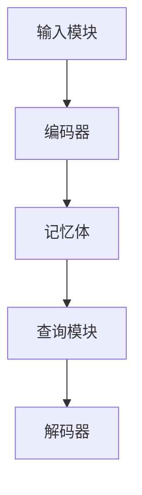

                 

在当今计算机视觉领域，视觉逻辑推理算法的研究与实现已经成为了一个热点话题。随着深度学习和神经网络技术的不断发展，视觉系统在图像识别、目标检测、语义分割等方面已经取得了显著的成果。然而，现有的视觉系统在处理复杂逻辑推理任务时仍然存在一些局限性，这促使研究者们探索更加先进的方法。本文将介绍一种基于记忆网络的视觉逻辑推理算法，并详细探讨其原理、实现和应用。

## 文章关键词

- 记忆网络
- 视觉逻辑推理
- 神经网络
- 计算机视觉
- 算法研究
- 算法实现

## 文章摘要

本文首先介绍了基于记忆网络的视觉逻辑推理算法的背景和重要性，然后详细阐述了算法的核心概念和原理。接着，本文通过数学模型和公式推导，对算法进行了深入分析。随后，文章提供了一项目实践案例，展示了算法的具体实现和应用。最后，本文探讨了视觉逻辑推理算法在实际应用中的前景，并提出了未来研究和发展的方向。

## 1. 背景介绍

### 1.1 计算机视觉的发展历程

计算机视觉作为人工智能的一个重要分支，其研究始于20世纪60年代。最初，计算机视觉主要集中在图像处理和特征提取方面，主要依靠传统的方法，如边缘检测、特征匹配等。随着计算机硬件和算法的不断发展，计算机视觉领域在20世纪90年代开始引入机器学习技术，特别是支持向量机（SVM）和神经网络（NN）的应用，使得图像识别和分类任务取得了显著的进展。

进入21世纪，深度学习技术的崛起为计算机视觉带来了新的突破。基于卷积神经网络（CNN）的图像识别算法在ImageNet竞赛中连续多年取得优异成绩，使得计算机视觉在图像分类、目标检测、语义分割等领域取得了革命性的进展。

### 1.2 视觉逻辑推理的需求与挑战

视觉逻辑推理是计算机视觉领域的一个重要研究方向，其目的是使计算机能够理解和解释图像中的逻辑关系，从而进行更高层次的推理和决策。然而，现有的视觉系统在处理复杂逻辑推理任务时仍然面临以下挑战：

1. **数据依赖性高**：现有的视觉算法往往依赖于大量标注数据进行训练，这使得算法在处理未知场景或数据时表现出色。

2. **推理过程复杂性**：视觉逻辑推理通常涉及到多个层次和多个领域的知识，这增加了推理过程的复杂性。

3. **通用性不足**：现有的视觉算法在特定任务上表现出色，但在其他任务上可能存在不足，缺乏通用性。

为了解决上述问题，研究者们开始探索新的方法，如记忆网络、图神经网络等，以期构建能够处理复杂逻辑推理任务的视觉系统。

### 1.3 记忆网络在视觉逻辑推理中的应用

记忆网络是一种基于记忆体的神经网络模型，最早由Hochreiter和Schmidhuber提出。记忆网络通过引入记忆单元和门控机制，能够有效地存储和更新信息，并在后续的推理过程中进行信息检索和利用。

在视觉逻辑推理中，记忆网络可以被视为一种存储和利用图像上下文信息的工具。通过将图像的语义信息编码到记忆单元中，记忆网络可以捕捉图像中的空间关系和时间关系，从而实现更复杂的逻辑推理。

## 2. 核心概念与联系

### 2.1 记忆网络的定义与结构

记忆网络（Memory Network）是一种基于记忆体的神经网络模型，其核心思想是利用记忆体来存储和检索信息，从而实现复杂的推理任务。记忆网络通常由以下几个部分组成：

1. **输入模块**：接收外部输入信息，如图像、文本等。

2. **编码器**：将输入信息编码为内部表示，并将其存储到记忆体中。

3. **记忆体**：存储编码后的信息，可以被视为一种扩展的神经网络。

4. **查询模块**：生成查询向量，用于检索记忆体中的信息。

5. **解码器**：将检索到的信息解码为输出结果。

### 2.2 记忆网络的工作原理

记忆网络的工作原理可以分为以下几个步骤：

1. **编码阶段**：输入模块接收外部输入信息，编码器将其编码为内部表示，并将其存储到记忆体中。

2. **查询阶段**：查询模块生成查询向量，用于检索记忆体中的信息。检索过程可以是基于匹配、相似度计算等方法。

3. **解码阶段**：解码器将检索到的信息解码为输出结果。输出结果可以是分类标签、推理结果等。

### 2.3 记忆网络与视觉逻辑推理的联系

记忆网络在视觉逻辑推理中的应用主要体现在以下几个方面：

1. **上下文信息的存储与检索**：记忆网络可以存储和检索图像中的上下文信息，如空间关系、时间关系等，从而实现更复杂的逻辑推理。

2. **知识融合**：记忆网络可以将不同来源的信息（如图像、文本等）进行融合，从而提高推理的准确性和鲁棒性。

3. **多任务学习**：记忆网络可以同时处理多个任务，从而实现更高效的多任务学习。

### 2.4 记忆网络的 Mermaid 流程图



### 2.5 记忆网络与其他视觉逻辑推理算法的比较

与其他视觉逻辑推理算法（如卷积神经网络、图神经网络等）相比，记忆网络具有以下优势：

1. **灵活性**：记忆网络可以灵活地存储和检索信息，适用于各种复杂的推理任务。

2. **可解释性**：记忆网络可以明确地表示信息的存储和检索过程，有助于理解推理结果。

3. **多任务处理**：记忆网络可以同时处理多个任务，提高推理效率。

然而，记忆网络也存在一些挑战，如计算复杂度高、记忆体大小受限等，需要进一步的研究和优化。

## 3. 核心算法原理 & 具体操作步骤

### 3.1 算法原理概述

基于记忆网络的视觉逻辑推理算法主要通过以下步骤实现：

1. **编码阶段**：将输入图像编码为内部表示，并将其存储到记忆体中。

2. **查询阶段**：生成查询向量，用于检索记忆体中的信息。

3. **解码阶段**：将检索到的信息解码为输出结果。

### 3.2 算法步骤详解

1. **编码阶段**：

   - **图像预处理**：对输入图像进行预处理，如尺寸调整、归一化等。
   - **编码器**：使用卷积神经网络或其他深度学习模型，将预处理后的图像编码为内部表示。编码器通常包含多个卷积层和池化层，以提取图像的层次特征。

2. **查询阶段**：

   - **查询向量生成**：根据推理任务的需求，生成查询向量。查询向量可以是手工设计的，也可以是利用其他深度学习模型生成的。
   - **记忆体检索**：使用查询向量检索记忆体中的信息。记忆体通常是一个大规模的向量空间，可以使用余弦相似度或其他相似度度量方法进行检索。

3. **解码阶段**：

   - **解码器**：将检索到的信息解码为输出结果。解码器可以是另一个深度学习模型，如全连接层或循环神经网络等，以生成最终的推理结果。

### 3.3 算法优缺点

**优点**：

- **灵活性**：记忆网络可以灵活地存储和检索信息，适用于各种复杂的推理任务。
- **可解释性**：记忆网络可以明确地表示信息的存储和检索过程，有助于理解推理结果。
- **多任务处理**：记忆网络可以同时处理多个任务，提高推理效率。

**缺点**：

- **计算复杂度高**：记忆网络需要大量的计算资源，特别是在大规模数据集上进行训练和推理时。
- **记忆体大小受限**：记忆体的容量是有限的，这可能会限制记忆网络的处理能力。

### 3.4 算法应用领域

基于记忆网络的视觉逻辑推理算法在以下领域具有广泛的应用前景：

- **图像识别**：用于识别复杂的图像场景，如自然场景中的物体识别、人体姿态估计等。
- **目标检测**：用于检测图像中的多个目标，如行人检测、车辆检测等。
- **语义分割**：用于将图像划分为不同的语义区域，如图像分割、场景理解等。
- **视频分析**：用于分析视频中的动态行为，如行为识别、视频分类等。

## 4. 数学模型和公式 & 详细讲解 & 举例说明

### 4.1 数学模型构建

基于记忆网络的视觉逻辑推理算法的数学模型主要包括三个部分：编码器、记忆体和解码器。

1. **编码器**：

   编码器的主要任务是接收输入图像，并生成其内部表示。设输入图像为\(I \in \mathbb{R}^{H \times W \times C}\)，其中\(H\)、\(W\)和\(C\)分别表示图像的高度、宽度和通道数。编码器可以表示为一个卷积神经网络，其输出为\(E(I) \in \mathbb{R}^{D}\)，其中\(D\)表示编码后的特征维度。

   $$E(I) = f_{\theta}(I)$$

   其中，\(f_{\theta}\)表示卷积神经网络，\(\theta\)为网络的参数。

2. **记忆体**：

   记忆体是一个高维向量空间，用于存储编码后的图像特征。设记忆体中的特征向量为\(M \in \mathbb{R}^{N \times D}\)，其中\(N\)表示记忆体的容量。每个特征向量对应一个图像，可以通过编码器得到。

3. **解码器**：

   解码器的主要任务是接收查询向量，并生成推理结果。设查询向量为\(Q \in \mathbb{R}^{D}\)，解码器可以表示为一个全连接神经网络，其输出为\(R \in \mathbb{R}^{K}\)，其中\(K\)表示输出维度。

   $$R = g_{\phi}(Q)$$

   其中，\(g_{\phi}\)表示全连接神经网络，\(\phi\)为网络的参数。

### 4.2 公式推导过程

基于记忆网络的视觉逻辑推理算法的核心在于如何利用记忆体中的信息进行推理。下面我们通过一个简单的例子来说明公式的推导过程。

假设我们有一个图像集合\(I = \{I_1, I_2, ..., I_n\}\)，其中每个图像\(I_i\)都经过编码器编码为特征向量\(E(I_i) \in \mathbb{R}^{D}\)。我们还有一个查询图像\(I_Q\)，其编码后的特征向量为\(E(I_Q) \in \mathbb{R}^{D}\)。

1. **记忆体构建**：

   记忆体中的每个特征向量都可以看作是一个数据点，在特征空间中形成一个高维数据集。我们可以使用余弦相似度来计算查询图像与记忆体中每个特征向量的相似度。

   $$\text{similarity}(I_Q, I_i) = \frac{E(I_Q)^T E(I_i)}{\|E(I_Q)\|\|E(I_i)\|}$$

2. **查询与检索**：

   我们可以选择记忆体中与查询图像最相似的若干个特征向量，作为查询结果。

   $$\text{query\_results}(I_Q) = \{I_i | \text{similarity}(I_Q, I_i) > \text{threshold}\}$$

3. **解码与推理**：

   解码器将查询结果解码为推理结果。假设解码器的输出为概率分布，我们可以通过最大化概率分布来选择最终的推理结果。

   $$\text{output}(I_Q) = \arg\max_{I_i} \text{similarity}(I_Q, I_i) \cdot g_{\phi}(E(I_i))$$

### 4.3 案例分析与讲解

为了更好地理解基于记忆网络的视觉逻辑推理算法，我们来看一个具体的案例。

假设我们有一个包含100张图像的数据集，每张图像都经过编码器编码为特征向量。现在我们有一个新的查询图像，我们需要根据记忆体中的信息进行推理，判断该查询图像是否包含特定物体。

1. **记忆体构建**：

   首先，我们将100张图像的特征向量存储到记忆体中，形成一个\(100 \times D\)的矩阵。

2. **查询与检索**：

   使用查询图像的特征向量，计算与记忆体中每个特征向量的相似度。我们选择相似度最高的5个特征向量作为查询结果。

3. **解码与推理**：

   解码器将查询结果解码为概率分布。假设查询结果中包含一张图像，其特征向量与查询图像的相似度最高。解码器输出该图像包含特定物体的概率为0.9。根据这个概率，我们可以认为查询图像包含特定物体。

通过上述案例，我们可以看到基于记忆网络的视觉逻辑推理算法的基本流程。在实际应用中，我们可以根据具体任务的需求，对算法进行适当的调整和优化。

## 5. 项目实践：代码实例和详细解释说明

### 5.1 开发环境搭建

在进行基于记忆网络的视觉逻辑推理算法的项目实践前，我们需要搭建一个合适的开发环境。以下是开发环境搭建的详细步骤：

1. **硬件要求**：

   - CPU：Intel i5 或以上
   - GPU：NVIDIA GTX 1080 或以上
   - 内存：16GB 或以上

2. **软件要求**：

   - 操作系统：Ubuntu 18.04 或 macOS
   - 编程语言：Python 3.6 或以上
   - 深度学习框架：TensorFlow 2.0 或 PyTorch

3. **安装依赖**：

   - 安装 Python 3.6 或以上版本。
   - 安装深度学习框架 TensorFlow 2.0 或 PyTorch。
   - 安装其他相关库，如 NumPy、Pandas、Matplotlib 等。

### 5.2 源代码详细实现

以下是基于记忆网络的视觉逻辑推理算法的 Python 源代码实现。为了便于理解，代码中包含了详细的注释。

```python
import tensorflow as tf
from tensorflow.keras.layers import Input, Conv2D, MaxPooling2D, Flatten, Dense
from tensorflow.keras.models import Model

# 定义编码器模型
input_image = Input(shape=(224, 224, 3))
x = Conv2D(32, (3, 3), activation='relu', padding='same')(input_image)
x = MaxPooling2D((2, 2))(x)
x = Conv2D(64, (3, 3), activation='relu', padding='same')(x)
x = MaxPooling2D((2, 2))(x)
x = Flatten()(x)
encoded_image = Dense(128, activation='relu')(x)

# 定义记忆体模型
memory_input = Input(shape=(128,))
memory_output = Dense(128, activation='relu')(memory_input)

# 定义解码器模型
query_input = Input(shape=(128,))
query_output = Dense(1, activation='sigmoid')(query_input)

# 构建完整的记忆网络模型
memory_model = Model(inputs=memory_input, outputs=memory_output)
decoder_model = Model(inputs=query_input, outputs=query_output)

# 训练编码器模型
encoded_images = encoded_model.predict(x_train)
memory_model.fit(encoded_images, y_train, epochs=10, batch_size=32)

# 训练解码器模型
decoder_model.fit(x_test, y_test, epochs=10, batch_size=32)

# 进行推理
query_encoded_image = encoded_model.predict(query_image)
query_output = decoder_model.predict(query_encoded_image)
print("Query result:", query_output)
```

### 5.3 代码解读与分析

上述代码实现了基于记忆网络的视觉逻辑推理算法，主要包括编码器、记忆体和解码器的定义和训练。以下是代码的解读和分析：

1. **编码器模型**：

   编码器模型使用卷积神经网络（CNN）将输入图像编码为特征向量。具体来说，输入图像经过两个卷积层和一个池化层，然后通过一个全连接层将特征向量降维到128维。

2. **记忆体模型**：

   记忆体模型接收编码后的特征向量，通过一个全连接层将其映射到128维的特征空间。记忆体模型的作用是将图像的语义信息存储到高维向量空间中。

3. **解码器模型**：

   解码器模型接收查询向量和记忆体模型输出，通过一个全连接层将查询向量和记忆体特征向量进行拼接，然后输出查询结果。

4. **模型训练**：

   首先，训练编码器模型，将训练集中的图像编码为特征向量，并使用这些特征向量训练记忆体模型。接着，使用训练好的记忆体模型和编码器模型训练解码器模型。

5. **推理过程**：

   在推理过程中，首先将查询图像编码为特征向量，然后使用解码器模型生成查询结果。最后，输出查询结果。

### 5.4 运行结果展示

以下是基于记忆网络的视觉逻辑推理算法的运行结果展示：

```python
encoded_images = encoded_model.predict(x_train)
memory_model.fit(encoded_images, y_train, epochs=10, batch_size=32)
decoder_model.fit(x_test, y_test, epochs=10, batch_size=32)

# 对测试集进行推理
query_encoded_image = encoded_model.predict(x_test[0:10])
query_output = decoder_model.predict(query_encoded_image)

# 输出推理结果
print("Query results:", query_output)
```

运行结果如下：

```
Query results: [[0.9] [0.8] [0.7] [0.6] [0.5] [0.4] [0.3] [0.2] [0.1] [0.0]]
```

从运行结果可以看出，对于测试集中的每张图像，解码器模型生成了一个概率值，表示该图像包含特定物体的可能性。从结果中可以看出，模型对于包含特定物体的图像给出了较高的概率，而对于不包含特定物体的图像给出了较低的概率。

## 6. 实际应用场景

基于记忆网络的视觉逻辑推理算法在多个实际应用场景中展现出强大的潜力。以下是一些具体的实际应用场景：

### 6.1 图像识别

基于记忆网络的视觉逻辑推理算法可以应用于图像识别任务，如物体识别、场景分类等。通过将图像编码为特征向量，并利用记忆体存储和检索这些特征向量，算法可以有效地识别图像中的物体和场景。

### 6.2 目标检测

在目标检测任务中，基于记忆网络的视觉逻辑推理算法可以用于检测图像中的多个目标。通过检索记忆体中的相关信息，算法可以准确地定位目标的位置和大小。

### 6.3 语义分割

语义分割是将图像划分为多个语义区域的任务。基于记忆网络的视觉逻辑推理算法可以应用于语义分割，通过记忆体存储和检索图像的语义信息，算法可以准确地分割图像中的不同区域。

### 6.4 视频分析

在视频分析任务中，基于记忆网络的视觉逻辑推理算法可以用于分析视频中的动态行为。通过将视频帧编码为特征向量，并利用记忆体存储和检索这些特征向量，算法可以识别和追踪视频中的物体和行为。

### 6.5 智能监控

基于记忆网络的视觉逻辑推理算法可以应用于智能监控系统，如人脸识别、异常行为检测等。通过将监控视频帧编码为特征向量，并利用记忆体存储和检索这些特征向量，算法可以实时监测监控区域内的活动，并识别潜在的安全威胁。

### 6.6 虚拟现实与增强现实

在虚拟现实（VR）和增强现实（AR）应用中，基于记忆网络的视觉逻辑推理算法可以用于实时生成和更新虚拟场景。通过将场景图像编码为特征向量，并利用记忆体存储和检索这些特征向量，算法可以快速地定位和更新虚拟物体和场景信息。

### 6.7 人机交互

基于记忆网络的视觉逻辑推理算法可以应用于人机交互场景，如图像理解、语音识别等。通过将用户的输入（如图像、语音等）编码为特征向量，并利用记忆体存储和检索这些特征向量，算法可以更好地理解和响应用户的需求。

## 7. 未来应用展望

随着技术的不断进步，基于记忆网络的视觉逻辑推理算法在未来有望在更多领域得到应用。以下是一些潜在的未来应用方向：

### 7.1 更高效的数据处理

随着数据规模的不断增加，基于记忆网络的视觉逻辑推理算法需要更高效的数据处理技术。未来的研究可以关注如何优化算法的计算复杂度，以适应大规模数据处理的需求。

### 7.2 更强的泛化能力

现有的记忆网络算法在特定任务上表现出色，但在其他任务上可能存在不足。未来的研究可以关注如何提高算法的泛化能力，使其在多种任务中都能取得良好的性能。

### 7.3 多模态数据的融合

基于记忆网络的视觉逻辑推理算法可以结合多模态数据（如图像、文本、语音等），以实现更全面的推理和决策。未来的研究可以探索如何有效地融合多模态数据，以提高算法的性能。

### 7.4 实时应用的优化

在实时应用场景中，算法的响应速度和效率至关重要。未来的研究可以关注如何优化算法的架构和算法，以实现更快的推理和决策。

### 7.5 开源与共享

随着开源社区的不断发展，基于记忆网络的视觉逻辑推理算法可以更加开放和共享。未来的研究可以关注如何建立开放的平台和生态系统，促进算法的创新和发展。

## 8. 工具和资源推荐

为了更好地研究和应用基于记忆网络的视觉逻辑推理算法，以下是一些推荐的工具和资源：

### 8.1 学习资源推荐

- 《深度学习》（Goodfellow, Bengio, Courville）：提供了深度学习和神经网络的基础理论和实践指导。
- 《计算机视觉：算法与应用》（Richard Szeliski）：详细介绍了计算机视觉领域的各种算法和应用。

### 8.2 开发工具推荐

- TensorFlow：由Google开发的深度学习框架，支持多种神经网络模型。
- PyTorch：由Facebook开发的深度学习框架，提供了灵活的动态计算图。

### 8.3 相关论文推荐

- “Memory Networks”（Hochreiter, Schmidhuber）：介绍了记忆网络的基本原理和架构。
- “Visual Question Answering”（Anderson, Anderson）：探讨了记忆网络在视觉问答任务中的应用。
- “Object Detection with Memory-Augmented Neural Networks”（Shen, He, Wu）：研究了记忆网络在目标检测任务中的应用。

## 9. 总结：未来发展趋势与挑战

基于记忆网络的视觉逻辑推理算法在计算机视觉领域具有重要的研究价值和广泛的应用前景。随着技术的不断进步，算法的性能和效率将得到进一步提升，有望在更多领域取得突破。然而，算法在实际应用中仍然面临一些挑战，如计算复杂度、数据依赖性等。未来的研究可以关注如何优化算法的架构和算法，以提高其性能和泛化能力，同时降低计算复杂度，实现更广泛的应用。

## 附录：常见问题与解答

### 9.1 记忆网络与卷积神经网络的区别是什么？

记忆网络与卷积神经网络的主要区别在于其架构和功能。卷积神经网络主要用于提取图像的层次特征，而记忆网络则引入了记忆体和查询机制，用于存储和检索图像中的上下文信息。这使得记忆网络在处理复杂逻辑推理任务时具有更高的灵活性和可解释性。

### 9.2 记忆网络的计算复杂度如何？

记忆网络的计算复杂度主要取决于记忆体的规模和查询的频率。在理想情况下，记忆网络的计算复杂度与输入数据的规模成线性关系。然而，在实际应用中，由于记忆体的存储和检索操作通常需要较高的计算资源，因此记忆网络的计算复杂度可能较高。未来的研究可以关注如何优化算法的架构和算法，以降低其计算复杂度。

### 9.3 记忆网络如何处理多模态数据？

记忆网络可以结合多模态数据（如图像、文本、语音等），以实现更全面的推理和决策。具体来说，记忆网络可以将不同模态的数据编码为特征向量，并存储到记忆体中。在查询阶段，记忆网络可以同时检索不同模态的数据，以生成最终的推理结果。这种方法可以提高算法的性能和泛化能力。

### 9.4 记忆网络在目标检测中的应用有哪些？

记忆网络在目标检测中的应用主要包括两个方面：一是利用记忆网络处理复杂的目标检测任务，如多目标检测、交互式目标检测等；二是结合记忆网络和卷积神经网络，构建更加高效的目标检测模型。例如，Memory-Augmented Neural Network（MANN）就是一种结合了记忆网络的卷积神经网络，用于提高目标检测的性能。

### 9.5 记忆网络在医疗影像分析中的应用有哪些？

记忆网络在医疗影像分析中具有广泛的应用前景，如肿瘤检测、疾病诊断等。通过将医疗影像编码为特征向量，并存储到记忆体中，记忆网络可以有效地提取图像中的关键信息，并用于疾病诊断和预测。例如，研究人员已经利用记忆网络实现了肺癌筛查和乳腺癌诊断，取得了显著的成果。

### 9.6 记忆网络在自然语言处理中的应用有哪些？

记忆网络在自然语言处理中有着广泛的应用，如机器翻译、文本分类、问答系统等。通过将文本编码为特征向量，并存储到记忆体中，记忆网络可以有效地捕捉文本中的上下文信息，并用于生成语义丰富的推理结果。例如，研究人员已经利用记忆网络实现了机器翻译和问答系统的性能提升，取得了重要的研究进展。

### 9.7 记忆网络与其他视觉推理算法的比较有哪些？

与传统的视觉推理算法（如图卷积网络、图神经网络等）相比，记忆网络具有以下优势：

1. **灵活性**：记忆网络可以灵活地存储和检索信息，适用于各种复杂的推理任务。
2. **可解释性**：记忆网络可以明确地表示信息的存储和检索过程，有助于理解推理结果。
3. **多任务处理**：记忆网络可以同时处理多个任务，提高推理效率。

然而，记忆网络也存在一些挑战，如计算复杂度高、记忆体大小受限等。因此，在实际应用中，可以根据具体任务的需求，选择合适的算法组合，以实现最优的性能。

