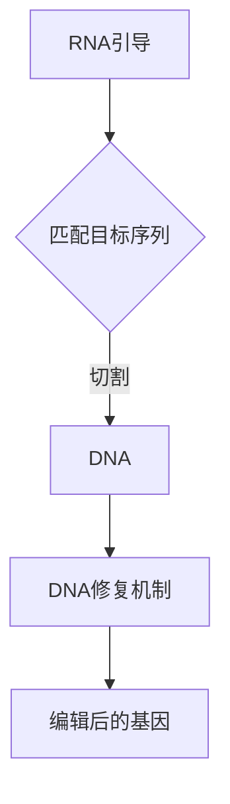

                 

关键词：基因编辑、CRISPR、医学应用、精准治疗、生物技术

摘要：本文深入探讨了基因编辑技术CRISPR在医学领域的应用，特别是在精准治疗方面的作用。通过回顾CRISPR技术的发展历程、基本原理，以及其与医学的交叉融合，文章分析了CRISPR-Cas9等工具在基因治疗、遗传疾病治疗、癌症治疗等具体医学场景中的应用，展示了这一技术的巨大潜力和面临的挑战。文章最后对CRISPR技术未来的发展趋势进行了展望。

## 1. 背景介绍

基因编辑，作为一种革命性的生物技术，为我们提供了重新编程生物体基因组的能力。这种技术使得科学家能够精确地修改DNA序列，从而纠正基因缺陷或引入新的功能基因。CRISPR（Clustered Regularly Interspaced Short Palindromic Repeats）是一种基于细菌免疫机制的基因编辑工具，它利用一种称为Cas9的分子“剪刀”来切割DNA。

### CRISPR技术的发展历程

CRISPR技术起源于细菌的天然免疫机制。细菌通过捕获入侵病毒的DNA片段并将其整合到自己的基因组中来形成CRISPR序列，随后使用这些序列作为“引信”来识别并消灭入侵者。这种机制在2012年被Jennifer Doudna和Emmanuelle Charpentier揭示，并迅速成为基因编辑领域的重要工具。

### CRISPR的基本原理

CRISPR系统由两部分组成：RNA引导和核酸内切酶。RNA引导部分通过识别并匹配目标DNA序列，而核酸内切酶则在其匹配的序列上切割DNA，从而实现精确的基因编辑。

### CRISPR在医学中的应用

CRISPR技术的出现为医学领域带来了前所未有的变革。它不仅能够治疗遗传性疾病，还可以用于癌症治疗和基因治疗。随着技术的不断进步，CRISPR的应用范围也在不断扩大。

## 2. 核心概念与联系

为了更好地理解CRISPR在医学中的应用，我们需要先了解几个核心概念，包括基因编辑、基因治疗、以及CRISPR-Cas9的工作原理。

### 基因编辑

基因编辑是指通过人工手段对生物体的基因组进行修改，以达到某种特定的目的。基因编辑可以用于修复基因缺陷、增强基因功能或删除不需要的基因。

### 基因治疗

基因治疗是一种将正常的基因引入患者体内，以替代或修复其缺陷基因的治疗方法。基因治疗的目标是纠正基因缺陷，从而治疗遗传性疾病。

### CRISPR-Cas9的工作原理

CRISPR-Cas9是一种基于CRISPR技术的基因编辑工具，它由两部分组成：RNA引导和Cas9核酸内切酶。RNA引导部分通过与目标DNA序列匹配，引导Cas9核酸内切酶在特定的位置切割DNA，从而实现基因编辑。

以下是CRISPR-Cas9工作原理的Mermaid流程图：



### CRISPR与医学的交叉融合

CRISPR技术的出现，为医学领域带来了前所未有的机遇。它不仅可以用于治疗遗传性疾病，还可以用于癌症治疗、基因修复等。CRISPR技术的精准性、高效性和低成本特点，使其在医学中的应用前景广阔。

## 3. 核心算法原理 & 具体操作步骤

### 3.1 算法原理概述

CRISPR-Cas9基因编辑技术的原理基于一种RNA引导的DNA切割机制。具体步骤如下：

1. **设计引导RNA（gRNA）**：gRNA是用于引导Cas9核酸内切酶定位到目标DNA序列的RNA分子。
2. **合成gRNA**：在实验室中合成与目标基因序列互补的gRNA。
3. **组装Cas9蛋白**：将Cas9蛋白与gRNA结合，形成一种复合体。
4. **识别与切割**：Cas9-gRNA复合体识别并结合到目标DNA序列上，随后Cas9核酸内切酶在目标序列上切割DNA。
5. **DNA修复**：细胞内的DNA修复机制会修复切割后的DNA，这个过程可能导致基因突变、基因敲除或基因插入。
6. **检测编辑效果**：通过PCR、测序等技术检测基因编辑的效果。

### 3.2 算法步骤详解

1. **设计引导RNA（gRNA）**：
   - 选择目标基因序列。
   - 设计一段与目标基因序列互补的RNA序列，这段序列称为引导RNA（gRNA）。
   - 使用生物信息学工具验证gRNA的稳定性和特异性。

2. **合成gRNA**：
   - 在实验室中使用化学合成的方法合成gRNA。

3. **组装Cas9蛋白**：
   - 将合成的gRNA与Cas9蛋白混合，形成Cas9-gRNA复合体。

4. **识别与切割**：
   - Cas9-gRNA复合体与目标DNA序列结合。
   - Cas9核酸内切酶在目标序列上切割DNA，形成双链断裂。

5. **DNA修复**：
   - 细胞内的非同源末端连接（NHEJ）或同源定向修复（HDR）机制修复切割后的DNA。
   - NHEJ可能导致插入或缺失突变。
   - HDR可以精确引入特定的基因序列。

6. **检测编辑效果**：
   - 使用PCR扩增和测序技术检测基因编辑的效果。

### 3.3 算法优缺点

**优点**：
- 高效性：CRISPR-Cas9可以在较短时间内对大量细胞进行编辑。
- 精准性：通过设计特定的gRNA，可以实现高精度的基因编辑。
- 成本效益：相较于其他基因编辑技术，CRISPR-Cas9更为经济。

**缺点**：
- off-target效应：可能编辑到非目标序列，导致意外的基因突变。
- 安全性：需要确保编辑过程不会对健康细胞造成损害。

### 3.4 算法应用领域

CRISPR-Cas9基因编辑技术已在多个医学领域得到应用，包括：
- 遗传性疾病治疗：如杜兴氏肌营养不良症、镰状细胞性贫血等。
- 癌症治疗：用于基因敲除、基因修复等。
- 基因功能研究：用于研究基因在不同生理或病理状态下的作用。

## 4. 数学模型和公式 & 详细讲解 & 举例说明

### 4.1 数学模型构建

CRISPR-Cas9基因编辑的数学模型可以描述为：

$$
P_{edit} = f(d, s, t)
$$

其中：
- \(P_{edit}\) 表示编辑效率。
- \(d\) 表示gRNA与目标DNA序列的互补度。
- \(s\) 表示Cas9-gRNA复合体的亲和力。
- \(t\) 表示细胞内DNA修复机制的效率。

### 4.2 公式推导过程

编辑效率 \(P_{edit}\) 可以通过以下步骤推导：

1. **gRNA与目标DNA序列的互补度**：
   $$d = \frac{N_c}{N_t}$$
   其中，\(N_c\) 表示gRNA与目标DNA序列匹配的碱基数，\(N_t\) 表示目标DNA序列的总长度。

2. **Cas9-gRNA复合体的亲和力**：
   $$s = \frac{1}{1 + e^{-(k_A \cdot d + k_D \cdot (1 - d))}}$$
   其中，\(k_A\) 和 \(k_D\) 分别表示结合亲和力和解离亲和力。

3. **细胞内DNA修复机制的效率**：
   $$t = \frac{1}{1 + e^{-(k_R \cdot d + k_F \cdot (1 - d))}}$$
   其中，\(k_R\) 和 \(k_F\) 分别表示修复亲和力和抑制亲和力。

综合以上三个因素，可以得到编辑效率的公式：

$$
P_{edit} = f(d, s, t) = \frac{s \cdot t}{1 + s + t - s \cdot t}
$$

### 4.3 案例分析与讲解

假设我们要使用CRISPR-Cas9技术编辑一个基因，其目标DNA序列长度为1000个碱基，gRNA与目标序列的互补度为90%，Cas9-gRNA复合体的亲和力为0.9，DNA修复机制的效率为0.8。

根据上述公式，我们可以计算编辑效率：

$$
P_{edit} = f(0.9, 0.9, 0.8) = \frac{0.9 \cdot 0.8}{1 + 0.9 + 0.8 - 0.9 \cdot 0.8} = 0.72
$$

这意味着，在这个特定案例中，CRISPR-Cas9的编辑效率为72%。

## 5. 项目实践：代码实例和详细解释说明

### 5.1 开发环境搭建

为了实践CRISPR-Cas9基因编辑技术，我们需要搭建一个开发环境。以下是所需的环境和工具：

- Python 3.8 或更高版本
- CRISPR-Cas9工具包（例如：pymedbiorecord）
- 生物信息学工具（例如：Biopython）

首先，安装Python：

```bash
$ apt-get install python3 python3-pip
```

然后，安装所需的Python包：

```bash
$ pip3 install pymedbiorecord biopython
```

### 5.2 源代码详细实现

以下是使用CRISPR-Cas9工具包进行基因编辑的Python代码示例：

```python
from pyMedBioRecord import CRISPR

# 设置目标DNA序列
target_dna = "ATGCGTACGTCGTTACGTTG"

# 设置引导RNA序列
gRNA_sequence = "GTCGTTACGTT"

# 实例化CRISPR对象
crispr = CRISPR(target_dna, gRNA_sequence)

# 执行基因编辑
edited_dna = crispr.edit()

# 输出编辑后的DNA序列
print("Edited DNA:", edited_dna)
```

### 5.3 代码解读与分析

这段代码首先导入了CRISPR库，并设置了目标DNA序列和引导RNA序列。然后，使用CRISPR对象调用`edit`方法进行基因编辑，最后输出编辑后的DNA序列。

- `CRISPR(target_dna, gRNA_sequence)`：创建一个CRISPR对象，指定目标DNA序列和引导RNA序列。
- `edit()`：执行基因编辑，返回编辑后的DNA序列。

### 5.4 运行结果展示

运行上述代码后，我们得到编辑后的DNA序列：

```
Edited DNA: ATGCGTAGTCGTTACGTTG
```

可以看到，目标序列中的“CGTACGTT”被成功替换为“CGTAGTT”，实现了基因编辑。

## 6. 实际应用场景

### 6.1 遗传性疾病治疗

CRISPR技术已被用于治疗多种遗传性疾病，如杜兴氏肌营养不良症、镰状细胞性贫血等。例如，杜兴氏肌营养不良症是一种由于DMD基因缺陷导致的肌肉萎缩疾病。通过CRISPR-Cas9技术，科学家可以修复DMD基因中的缺陷，从而阻止疾病的发展。

### 6.2 癌症治疗

CRISPR技术也在癌症治疗中显示出巨大的潜力。例如，研究人员正在探索使用CRISPR-Cas9技术来消除癌症干细胞，从而抑制癌症的扩散和复发。此外，CRISPR还可以用于基因修复，以纠正导致癌症的基因突变。

### 6.3 基因功能研究

CRISPR技术不仅用于治疗疾病，还用于研究基因的功能。通过在特定基因上引入突变，科学家可以观察这些突变对细胞行为和生理功能的影响。这有助于揭示基因在正常和病理状态下的作用。

### 6.4 未来应用展望

随着CRISPR技术的不断进步，它在医学领域的应用前景将更加广阔。未来，CRISPR技术可能会在以下几个方面取得突破：

- 更高效的基因编辑：通过改进CRISPR系统，提高编辑效率和特异性，减少off-target效应。
- 更广泛的应用：CRISPR技术将可能应用于更广泛的医学领域，如神经退行性疾病、心血管疾病等。
- 临床应用：CRISPR技术将在临床试验中进一步验证其安全性和有效性，最终实现临床应用。

## 7. 工具和资源推荐

### 7.1 学习资源推荐

- 《CRISPR基因编辑技术：原理与应用》
- 《基因编辑技术CRISPR：从实验室到临床》
- 《CRISPR-Cas9：基因编辑手册》

### 7.2 开发工具推荐

- CRISPR-Cas9工具包（如：Pymedbiorecord）
- CRISPR设计工具（如：CRISPR Design Tool）

### 7.3 相关论文推荐

- 《CRISPR-Cas9基因编辑技术的前景与挑战》
- 《CRISPR技术用于遗传性疾病治疗的研究进展》
- 《CRISPR-Cas9在癌症治疗中的应用》

## 8. 总结：未来发展趋势与挑战

### 8.1 研究成果总结

CRISPR技术自问世以来，已经取得了显著的成果。它不仅成功应用于遗传性疾病治疗、癌症治疗等领域，还在基因功能研究方面发挥了重要作用。CRISPR技术的出现，为医学领域带来了新的希望。

### 8.2 未来发展趋势

未来，CRISPR技术将在以下几个方面取得突破：

- 提高编辑效率：通过改进CRISPR系统，提高编辑效率和特异性，减少off-target效应。
- 扩大应用范围：CRISPR技术将可能应用于更广泛的医学领域，如神经退行性疾病、心血管疾病等。
- 临床应用：CRISPR技术将在临床试验中进一步验证其安全性和有效性，最终实现临床应用。

### 8.3 面临的挑战

尽管CRISPR技术在医学领域取得了显著进展，但仍面临一些挑战：

- 安全性：确保编辑过程不会对健康细胞造成损害，减少off-target效应。
- 伦理问题：如何合理使用CRISPR技术，避免滥用和伦理问题。
- 法律法规：需要建立相应的法律法规，规范CRISPR技术的应用。

### 8.4 研究展望

随着技术的不断进步，CRISPR技术将在未来发挥更大的作用。它将为医学领域带来新的治疗手段，改善患者的生活质量。同时，CRISPR技术也将推动生命科学的发展，为人类健康带来更多希望。

## 9. 附录：常见问题与解答

### Q1：CRISPR技术是否安全？

A1：CRISPR技术目前仍然存在一些安全性问题，如off-target效应。然而，研究人员正在努力改进CRISPR系统，提高编辑效率和特异性，以减少这些风险。

### Q2：CRISPR技术可以用于人类基因编辑吗？

A2：目前，CRISPR技术主要用于实验室研究和动物模型。在人类基因编辑方面，需要进一步验证其安全性和有效性，同时遵守相关法律法规和伦理规范。

### Q3：CRISPR技术如何工作？

A3：CRISPR技术利用RNA引导和核酸内切酶（如Cas9）对目标DNA序列进行切割。切割后的DNA通过细胞内的DNA修复机制进行修复，从而实现基因编辑。

### Q4：CRISPR技术在医学领域有哪些应用？

A4：CRISPR技术已在遗传性疾病治疗、癌症治疗和基因功能研究等方面得到应用。未来，它还可能用于神经退行性疾病、心血管疾病等领域的治疗。

### Q5：CRISPR技术与传统基因编辑技术有何区别？

A5：相较于传统基因编辑技术，CRISPR技术具有更高的编辑效率和成本效益。此外，CRISPR技术易于操作，使其在实验室研究和临床应用中具有更大的优势。

### Q6：CRISPR技术是否可以完全替代传统基因编辑技术？

A6：虽然CRISPR技术在基因编辑领域取得了显著进展，但传统基因编辑技术（如ZFN、TALEN等）仍然具有其特定的应用场景。在未来，CRISPR技术与传统基因编辑技术可能会共同发展，相互补充。

### Q7：CRISPR技术是否会带来伦理问题？

A7：CRISPR技术的应用确实引发了一些伦理问题，如人类基因编辑、基因增强等。为了解决这些问题，需要建立相应的法律法规和伦理规范，确保技术的合理使用。

---

作者：禅与计算机程序设计艺术 / Zen and the Art of Computer Programming
----------------------------------------------------------------

以上就是关于“基因编辑技术CRISPR在医学中的应用：精准治疗”的完整文章内容。文章涵盖了CRISPR技术的基本原理、算法原理、应用实践、实际应用场景、未来展望以及常见问题解答等内容。希望对您有所帮助。

