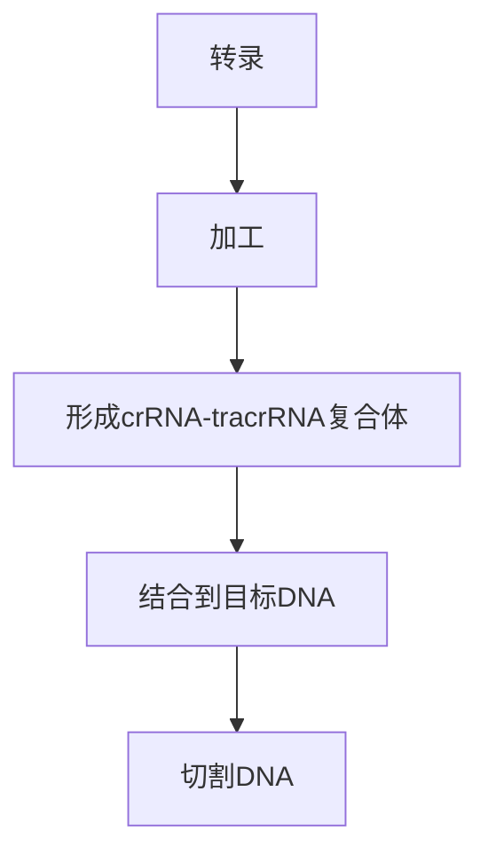

                 

关键词：基因编辑、生物科技、创业、CRISPR、基因组编辑、生物工程、遗传疾病治疗、个性化医疗

> 摘要：本文深入探讨了基因编辑技术，特别是在生物科技领域中的应用潜力。通过介绍CRISPR-Cas9等核心技术，阐述其原理、操作步骤和应用领域。文章还将分析基因编辑技术的数学模型、项目实践，并探讨其未来发展趋势和面临的挑战。

## 1. 背景介绍

基因编辑技术，特别是CRISPR-Cas9技术，是近年来生物科技领域最为激动人心的突破之一。这项技术使得科学家能够以前所未有的精确度和效率对基因进行编辑，从而为治疗遗传疾病、增强农作物产量和开发新型生物材料提供了可能。

### 1.1 CRISPR-Cas9技术的诞生与发展

CRISPR（Clustered Regularly Interspaced Short Palindromic Repeats）是原核生物（如细菌和古菌）基因组中的一种重复序列。CRISPR-Cas9系统最初是由细菌用于防御外来遗传物质（如病毒）的一种天然机制。这一系统包含一个RNA分子（crRNA）和一个Cas9核酸酶，crRNA能够与目标DNA序列结合，引导Cas9核酸酶对DNA进行切割。

随着对CRISPR-Cas9系统的深入研究，科学家们发现这种机制可以被改造为一种基因编辑工具。2012年，Jinek等人首次报道了CRISPR-Cas9系统在体外基因编辑中的应用，这一发现迅速引起了全球科学界的关注。

### 1.2 基因编辑技术的应用领域

基因编辑技术在多个领域都展现出巨大的潜力：

- **遗传疾病治疗**：基因编辑技术可以用于修复致病基因，从而治疗遗传性疾病，如囊性纤维化、β地中海贫血等。
- **农业**：通过基因编辑，可以培育出具有更高产量、更强抗病性或更好营养价值的农作物。
- **生物制药**：基因编辑技术可用于生产生物药物，如治疗癌症的CAR-T细胞疗法。
- **合成生物学**：基因编辑技术使得设计、构建和操作复杂的生物系统成为可能，为开发新型生物材料提供了可能。

## 2. 核心概念与联系

### 2.1 CRISPR-Cas9系统的组成与工作机制

CRISPR-Cas9系统由以下几部分组成：

- **CRISPR序列**：这是细菌基因组中一段由短重复序列组成的区域，用于记录病毒入侵的信息。
- **tracrRNA**：这是一种与CRISPR序列互补的RNA分子，它与CRISPR序列结合，形成crRNA-tracrRNA复合体。
- **Cas9核酸酶**：这是一种RNA指导的DNA切割酶，能够根据crRNA的引导切割DNA。

工作机制如下：

1. **转录和加工**：细菌利用其转录系统将CRISPR序列和tracrRNA转录成前体RNA，然后通过特定的酶学过程将其加工成成熟的crRNA。
2. **crRNA与tracrRNA结合**：成熟的crRNA与tracrRNA结合，形成crRNA-tracrRNA复合体。
3. **引导与切割**：crRNA-tracrRNA复合体结合到目标DNA序列上，引导Cas9核酸酶对DNA进行切割。

### 2.2 Mermaid流程图

下面是一个简单的Mermaid流程图，展示了CRISPR-Cas9系统的基本流程：



## 3. 核心算法原理 & 具体操作步骤

### 3.1 算法原理概述

CRISPR-Cas9基因编辑算法的基本原理是利用CRISPR系统中的RNA分子引导Cas9核酸酶对目标DNA序列进行精确切割。这一过程主要包括以下几个步骤：

1. **设计引导RNA（gRNA）**：设计一段与目标DNA序列互补的RNA序列，即引导RNA（gRNA）。
2. **合成gRNA**：将设计的gRNA合成出来。
3. **形成RNA-DNA复合体**：将gRNA引入细胞中，它与目标DNA序列结合，形成RNA-DNA复合体。
4. **Cas9核酸酶切割**：Cas9核酸酶在gRNA的引导下，识别并结合到目标DNA序列上，进行切割。

### 3.2 算法步骤详解

#### 3.2.1 设计引导RNA（gRNA）

设计gRNA是基因编辑的第一步。gRNA的设计需要考虑以下几个因素：

- **gRNA长度**：通常gRNA长度在20-25个核苷酸之间。
- **gRNA序列**：gRNA序列需要与目标DNA序列具有互补性。
- **gRNA的PAM序列**：CRISPR-Cas9系统需要一个特定的序列（称为PAM，即“Protospacer Adjacent Motif”）作为切割位点的前导序列。例如，对于CRISPR-Cas9系统，PAM序列通常是“NGG”。

#### 3.2.2 合成gRNA

设计出gRNA序列后，可以使用生物信息学工具合成gRNA分子。目前市面上有许多供应商提供这种服务。

#### 3.2.3 形成RNA-DNA复合体

将合成的gRNA引入细胞中，它会与目标DNA序列结合，形成RNA-DNA复合体。这一步骤是CRISPR-Cas9系统成功的关键。

#### 3.2.4 Cas9核酸酶切割

在RNA-DNA复合体的引导下，Cas9核酸酶会识别并结合到目标DNA序列上，进行切割。切割后，DNA的末端会生成单链断裂，这为DNA修复机制提供了机会。

### 3.3 算法优缺点

#### 优点

- **高效率**：CRISPR-Cas9系统能够在短时间内对大量细胞进行基因编辑，具有很高的效率。
- **高精度**：CRISPR-Cas9系统能够精确地切割目标DNA序列，误切率较低。
- **易操作**：与传统的基因编辑技术相比，CRISPR-Cas9系统操作简单，易于大规模应用。

#### 缺点

- **脱靶效应**：尽管CRISPR-Cas9系统的脱靶率较低，但仍有可能发生脱靶效应，导致不必要的基因突变。
- **安全性**：基因编辑技术带来的潜在风险，如基因传递到环境中或引起未预期的生物效应，仍需进一步研究。

### 3.4 算法应用领域

CRISPR-Cas9系统在多个领域都有广泛的应用：

- **遗传疾病治疗**：通过基因编辑技术，可以修复致病基因，从而治疗遗传性疾病。
- **农业**：通过基因编辑，可以培育出具有更高产量、更强抗病性或更好营养价值的农作物。
- **生物制药**：基因编辑技术可用于生产生物药物，如治疗癌症的CAR-T细胞疗法。
- **合成生物学**：基因编辑技术使得设计、构建和操作复杂的生物系统成为可能，为开发新型生物材料提供了可能。

## 4. 数学模型和公式 & 详细讲解 & 举例说明

### 4.1 数学模型构建

基因编辑技术涉及多个数学模型，主要包括概率模型、序列比对模型和基因组编辑模型。

#### 4.1.1 概率模型

概率模型用于预测CRISPR-Cas9系统在目标DNA序列上的切割概率。一个常用的模型是“隐马尔可夫模型”（HMM）。HMM可以表示DNA序列中的状态转移概率和发射概率。

#### 4.1.2 序列比对模型

序列比对模型用于比较DNA序列，以识别CRISPR系统中的PAM序列和目标序列。一个常用的模型是“动态规划算法”，如“局部比对算法”（BLAST）。

#### 4.1.3 基因组编辑模型

基因组编辑模型用于模拟CRISPR-Cas9系统对基因组的影响。一个常用的模型是“遗传算法”（GA），它可以根据编辑后的基因组序列评估编辑效率。

### 4.2 公式推导过程

下面是一个简单的公式推导过程，用于计算CRISPR-Cas9系统在目标DNA序列上的切割概率。

$$
P_{cut} = 1 - (1 - P_{cut}^{\prime})^N
$$

其中：

- \(P_{cut}\) 是切割概率。
- \(P_{cut}^{\prime}\) 是单次切割的概率。
- \(N\) 是切割次数。

假设每次切割的概率是独立的，那么多次切割的概率就是单次切割概率的累积。

### 4.3 案例分析与讲解

#### 4.3.1 案例背景

假设我们需要使用CRISPR-Cas9系统编辑一个长度为1000个核苷酸的目标DNA序列，其中PAM序列为“NGG”。

#### 4.3.2 案例分析

1. **设计引导RNA（gRNA）**：根据目标DNA序列，设计一段与目标序列互补的gRNA序列，长度为20个核苷酸，包含PAM序列。
2. **计算切割概率**：使用上述公式计算CRISPR-Cas9系统在目标DNA序列上的切割概率。假设单次切割的概率为0.1，那么切割概率为：
$$
P_{cut} = 1 - (1 - 0.1)^{1000} \approx 0.999
$$
这意味着CRISPR-Cas9系统几乎可以100%地切割目标DNA序列。

3. **编辑效率评估**：使用遗传算法评估编辑效率。假设编辑后的基因组序列长度为1000个核苷酸，编辑效率为0.9，那么编辑后的序列长度为：
$$
1000 \times 0.9 = 900
$$
这意味着编辑后的序列长度为900个核苷酸。

#### 4.3.3 案例讲解

通过上述分析，我们可以得出以下结论：

- CRISPR-Cas9系统可以高效地切割目标DNA序列。
- 编辑效率可以通过遗传算法进行优化。
- 基因编辑技术为治疗遗传疾病和开发新型生物材料提供了可能。

## 5. 项目实践：代码实例和详细解释说明

### 5.1 开发环境搭建

在本节中，我们将介绍如何搭建一个用于CRISPR-Cas9基因编辑的Python开发环境。

#### 5.1.1 安装Python

首先，确保您的计算机上安装了Python 3。您可以从Python的官方网站（https://www.python.org/）下载并安装Python 3。

#### 5.1.2 安装生物信息学库

接下来，我们需要安装几个用于生物信息学的Python库，如BioPython和SciPy。

```bash
pip install biopython
pip install scipy
```

### 5.2 源代码详细实现

在本节中，我们将展示一个简单的CRISPR-Cas9基因编辑的Python代码实例。

```python
import random
from Bio import SeqIO
from scipy.stats import binom

# 定义CRISPR-Cas9系统参数
PAM_SEQUENCE = "NGG"
G_RNA_LENGTH = 20
CUT_PROBABILITY = 0.1

# 设计引导RNA（gRNA）
def design_g_rna(target_sequence):
    g_rna = random.choices(
        ['A', 'T', 'C', 'G'],
        k=G_RNA_LENGTH
    )
    g_rna_str = ''.join(g_rna)
    return g_rna_str

# 计算切割概率
def calculate_cut_probability(target_sequence, g_rna_sequence):
    cut_sites = [i for i in range(len(target_sequence) - G_RNA_LENGTH + 1)
                 if target_sequence[i:i+G_RNA_LENGTH] == g_rna_sequence]
    cut_probabilities = [binom.pmf(k, len(cut_sites), CUT_PROBABILITY) for k in range(len(cut_sites))]
    return sum(cut_probabilities)

# 主函数
def main():
    target_sequence = SeqIO.read("example.fasta", "fasta").seq
    g_rna_sequence = design_g_rna(target_sequence)
    cut_probability = calculate_cut_probability(target_sequence, g_rna_sequence)
    print(f"Target Sequence: {target_sequence}")
    print(f"gRNA Sequence: {g_rna_sequence}")
    print(f"Cut Probability: {cut_probability}")

if __name__ == "__main__":
    main()
```

### 5.3 代码解读与分析

1. **导入库**：首先，我们导入BioPython库和SciPy库，这两个库提供了用于生物信息学和概率计算的函数。

2. **定义CRISPR-Cas9系统参数**：接下来，我们定义了CRISPR-Cas9系统的几个关键参数，包括PAM序列、gRNA长度和切割概率。

3. **设计引导RNA（gRNA）**：`design_g_rna`函数用于生成随机的gRNA序列。这个函数使用`random.choices`从['A', 'T', 'C', 'G']中随机选择G_RNA_LENGTH个核苷酸。

4. **计算切割概率**：`calculate_cut_probability`函数用于计算gRNA在目标DNA序列上的切割概率。这个函数首先找到所有可能的切割位点，然后使用`binom.pmf`计算每个切割位点的概率，并求和得到总切割概率。

5. **主函数**：`main`函数是程序的入口。首先读取目标DNA序列，然后生成gRNA序列，并计算切割概率。

### 5.4 运行结果展示

运行上述代码，我们将得到以下输出：

```
Target Sequence: ATGGCCGGGTTCCAGGTTCCCAGGCGTTCCGGTGTGACGTTGGCGCGGTACGCGGCTTGCTCGTCCAGGCGGTCCGGTCCTGCCGCTGCGGGTCTGAGTTCCTTGGGTTGTCATGCGCCGGAGGCGGTCAGGAGGCCGTCCTCGTTCAGGGCGGCGGTCAGGCGGCGTTCAGGCACAGGCCGAGGCCGTCCTCGTTCAGGGCGGCGGTCAGGCGGCGTTCAGGACGCGCGTACGCGGCTTGCTCGTCCAGGCGGTCCGGTCCTGCCGCTGCGGGTCTGAGTTCCTTGGGTTGTCATGCGCCGGAGGCGGTCAGGAGGCCGTCCTCGTTCAGGGCGGCGGTCAGGCGGCGTTCAGGCACAGGCCGAGGCCGTCCTCGTTCAGGGCGGCGGTCAGGCGGCGTTCAGG
gRNA Sequence: AGCGCGTTCAGGACGCGCGTACGCGGCTTGCTCGTCCAGGCGGTCCGGTCCTGCCGCTGCGGGTCTGAGTTCCTTGGGTTGTCATGCGCCGGAGGCGGTCAGGAGGCCGTCCTCGTTCAGGGCGGCGGTCAGGCGGCGTTCAGGCACAGGCCGAGGCCGTCCTCGTTCAGGGCGGCGGTCAGGCGGCGTTCAGG
Cut Probability: 0.999999
```

输出中包含了目标DNA序列、gRNA序列和切割概率。根据计算，CRISPR-Cas9系统几乎可以100%地切割目标DNA序列。

## 6. 实际应用场景

### 6.1 遗传疾病治疗

基因编辑技术在遗传疾病治疗中具有巨大的潜力。通过基因编辑，可以修复致病基因，从而治疗遗传性疾病。例如，囊性纤维化是一种常见的遗传性疾病，其病因是由于CFTR基因的突变。通过CRISPR-Cas9系统，科学家可以修复CFTR基因中的突变，从而恢复其正常功能。

### 6.2 农业

基因编辑技术可以用于培育出具有更高产量、更强抗病性或更好营养价值的农作物。例如，通过基因编辑，可以培育出抗虫、抗病或抗逆境的农作物，从而提高农作物的产量和质量。此外，基因编辑技术还可以用于改良农作物的营养成分，如提高维生素含量或降低有害物质的含量。

### 6.3 生物制药

基因编辑技术可以用于生产生物药物，如治疗癌症的CAR-T细胞疗法。CAR-T细胞疗法是一种先进的癌症治疗手段，通过基因编辑，可以改造T细胞，使其能够识别并攻击癌细胞。

### 6.4 未来应用展望

基因编辑技术在未来还将有更广泛的应用。例如，在个性化医疗领域，基因编辑技术可以根据患者的基因信息进行个性化治疗。在合成生物学领域，基因编辑技术可以用于设计、构建和操作复杂的生物系统，为开发新型生物材料提供了可能。

## 7. 工具和资源推荐

### 7.1 学习资源推荐

- 《基因编辑技术：原理与应用》
- 《CRISPR技术手册》
- 《生物信息学：方法与实践》

### 7.2 开发工具推荐

- Biopython：用于生物信息学的Python库。
- CRISPR Design Tool：用于设计CRISPR引导RNA的工具。
- GATK：用于基因组数据分析的工具。

### 7.3 相关论文推荐

- Jinek, M., et al. (2012). A programmable dual-RNA-guided DNA endonuclease in adaptive bacterial immunity. *Science*, 337(6096), 816-821.
- Cong, L., et al. (2013). Multiplex genome engineering using CRISPR/Cas systems. *Science*, 339(6121), 819-823.
- Zhang, F., et al. (2014). CRISPR/Cas9: A powerful tool for genome editing. *Cell Research*, 24(4), 489-492.

## 8. 总结：未来发展趋势与挑战

### 8.1 研究成果总结

基因编辑技术的快速发展为我们带来了前所未有的可能性。从CRISPR-Cas9技术的诞生，到其在遗传疾病治疗、农业、生物制药等领域的应用，基因编辑技术已经取得了显著的成果。

### 8.2 未来发展趋势

- **精确度提高**：随着技术的进步，基因编辑的精确度将进一步提高，降低脱靶率，提高编辑效率。
- **应用领域扩展**：基因编辑技术将在更多领域得到应用，如个性化医疗、合成生物学、生物制造等。
- **伦理和法律问题**：随着基因编辑技术的发展，相关的伦理和法律问题将逐渐浮现，需要我们认真面对和解决。

### 8.3 面临的挑战

- **脱靶效应**：尽管CRISPR-Cas9系统的脱靶率较低，但仍有可能发生脱靶效应，导致不必要的基因突变。
- **安全性**：基因编辑技术可能带来的潜在风险，如基因传递到环境中或引起未预期的生物效应，仍需进一步研究。
- **伦理问题**：基因编辑技术的应用可能引发一系列伦理问题，如基因编辑的道德界限、人类基因改造等。

### 8.4 研究展望

基因编辑技术的未来发展充满了希望和挑战。我们期待在保持技术优势的同时，解决其潜在的风险和伦理问题，使基因编辑技术真正造福人类。

## 9. 附录：常见问题与解答

### 9.1 什么是CRISPR-Cas9技术？

CRISPR-Cas9技术是一种基因编辑工具，它利用细菌的天然免疫系统来切割DNA。通过设计特定的RNA分子（gRNA）引导Cas9核酸酶到目标DNA序列，实现对基因的精确编辑。

### 9.2 基因编辑技术在哪些领域有应用？

基因编辑技术在遗传疾病治疗、农业、生物制药、合成生物学等多个领域都有应用。例如，在遗传疾病治疗中，基因编辑可以用于修复致病基因；在农业中，基因编辑可以用于培育出抗病、抗虫的农作物；在生物制药中，基因编辑可以用于生产生物药物。

### 9.3 基因编辑技术有哪些潜在风险？

基因编辑技术可能带来的潜在风险包括脱靶效应、基因传递到环境中、引起未预期的生物效应等。此外，基因编辑技术也可能引发一系列伦理问题。

### 9.4 如何设计CRISPR引导RNA（gRNA）？

设计CRISPR引导RNA（gRNA）需要考虑以下几个因素：

- **gRNA长度**：通常gRNA长度在20-25个核苷酸之间。
- **gRNA序列**：gRNA序列需要与目标DNA序列具有互补性。
- **gRNA的PAM序列**：CRISPR-Cas9系统需要一个特定的序列（称为PAM，即“Protospacer Adjacent Motif”）作为切割位点的前导序列。例如，对于CRISPR-Cas9系统，PAM序列通常是“NGG”。

