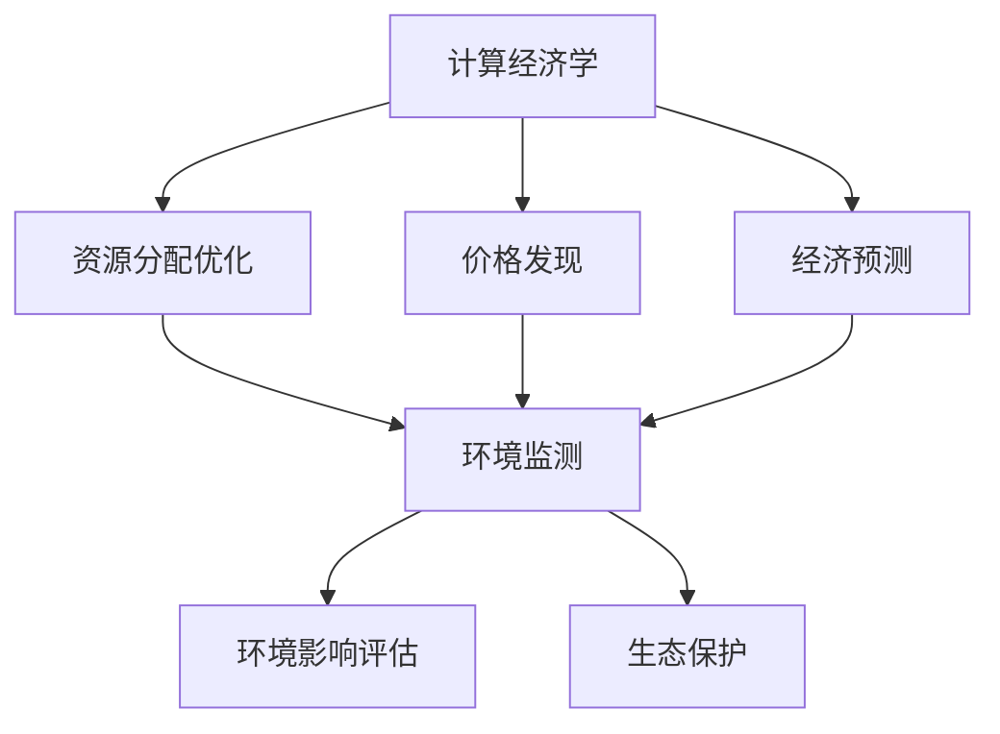

                 

关键词：基础模型，经济影响，环境影响，可持续发展，计算效率，算法优化

## 摘要

本文旨在探讨基础模型在经济和环境影响方面的双重作用。基础模型作为现代科技发展的基石，其高效能推动了各行各业的创新与发展。然而，随之而来的计算资源和能源消耗问题也日益凸显。本文将从计算经济学、环境科学以及可持续发展的角度，深入分析基础模型的经济效益和环境成本，并提出相应的优化策略，以期为未来科技发展提供参考。

## 1. 背景介绍

### 1.1 基础模型的发展历程

基础模型的发展可以追溯到20世纪50年代，当时计算机科学刚刚起步。从最初的逻辑门电路到今天的深度学习模型，基础模型经历了巨大的变革。早期的基础模型主要依赖于规则和逻辑，而现代的基础模型则更多依赖于数据和算法。

### 1.2 基础模型的应用领域

基础模型在各个领域得到了广泛应用，如自然语言处理、计算机视觉、推荐系统、金融量化交易等。这些应用不仅提升了各行业的效率，也推动了科技的发展。

### 1.3 计算经济学与环境科学的关系

计算经济学和环境科学是两个看似独立的领域，但实际上它们有着紧密的联系。计算经济学研究如何通过计算优化资源分配，而环境科学则关注如何保护自然资源和生态系统。这两者的结合对于实现可持续发展具有重要意义。

## 2. 核心概念与联系

### 2.1 计算经济学基本概念

计算经济学是经济学与计算技术的交叉领域，旨在通过计算方法优化经济决策。基础模型在计算经济学中的应用主要体现在以下几个方面：

- **资源分配优化**：基础模型可以通过模拟各种经济场景，帮助决策者找到最优的资源分配方案。
- **价格发现**：在金融市场，基础模型可以通过分析海量数据，预测价格波动，帮助投资者做出更好的投资决策。
- **经济预测**：基础模型可以对经济指标进行预测，为政策制定者提供参考。

### 2.2 环境科学基本概念

环境科学是研究人类活动对自然环境的影响以及如何保护环境的学科。在环境科学中，基础模型的应用主要体现在以下几个方面：

- **环境监测**：基础模型可以分析环境数据，帮助监测环境污染程度。
- **环境影响评估**：通过模拟不同情景，评估人类活动对环境的影响。
- **生态保护**：基础模型可以用于预测生态系统的变化，为生态保护提供依据。

### 2.3 Mermaid 流程图



## 3. 核心算法原理 & 具体操作步骤

### 3.1 算法原理概述

基础模型的核心算法包括但不限于：

- **机器学习算法**：如神经网络、决策树、支持向量机等。
- **优化算法**：如梯度下降、遗传算法、模拟退火等。

这些算法通过训练数据和模型参数，使得模型能够在新的数据上做出准确的预测或决策。

### 3.2 算法步骤详解

#### 3.2.1 数据预处理

数据预处理是基础模型训练的第一步，包括数据清洗、数据集成、数据转换等。

#### 3.2.2 模型选择

根据应用场景选择合适的算法模型。

#### 3.2.3 模型训练

通过训练数据调整模型参数，使得模型能够对新的数据做出准确的预测。

#### 3.2.4 模型评估

使用验证集评估模型性能，包括准确率、召回率、F1分数等指标。

#### 3.2.5 模型部署

将训练好的模型部署到生产环境中，进行实时预测或决策。

### 3.3 算法优缺点

#### 优点：

- **高效性**：基础模型能够快速处理大量数据。
- **准确性**：通过机器学习和优化算法，模型能够做出准确的预测。

#### 缺点：

- **计算资源消耗**：基础模型训练需要大量的计算资源。
- **能源消耗**：大规模的模型训练会导致能源消耗增加。

### 3.4 算法应用领域

基础模型在多个领域得到了广泛应用，如：

- **金融领域**：用于股票预测、风险控制等。
- **医疗领域**：用于疾病诊断、药物研发等。
- **交通领域**：用于路线规划、交通流量预测等。

## 4. 数学模型和公式 & 详细讲解 & 举例说明

### 4.1 数学模型构建

在计算经济学和环境科学中，常见的数学模型包括线性规划、非线性规划、差分方程、微分方程等。以下是一个简单的线性规划模型：

$$
\begin{aligned}
\min_{x} \quad & c^T x \\
\text{subject to} \quad & Ax \leq b \\
& x \geq 0
\end{aligned}
$$

其中，$c$ 是目标函数系数，$A$ 是约束矩阵，$b$ 是约束向量，$x$ 是决策变量。

### 4.2 公式推导过程

以线性规划为例，其推导过程如下：

1. 目标函数的求解：
$$
\min_{x} \quad c^T x
$$

2. 约束条件的处理：
$$
Ax \leq b \\
x \geq 0
$$

3. 将约束条件转换为等式：
$$
Ax - b = 0 \\
x \geq 0
$$

4. 构建拉格朗日函数：
$$
L(x, \lambda) = c^T x + \lambda^T (Ax - b)
$$

5. 求解拉格朗日函数的最小值：
$$
\nabla_x L(x, \lambda) = c + A^T \lambda = 0 \\
\nabla_{\lambda} L(x, \lambda) = Ax - b = 0
$$

6. 解线性方程组得到最优解：
$$
x = -A^{-1} A^T \lambda \\
\lambda = A^{-1} b
$$

### 4.3 案例分析与讲解

假设有一个线性规划问题，要求最小化目标函数 $c^T x$，同时满足以下约束条件：

$$
\begin{aligned}
&2x_1 + 3x_2 \leq 12 \\
&x_1 + x_2 \geq 4 \\
&x_1, x_2 \geq 0
\end{aligned}
$$

1. 构建线性规划模型：
$$
\begin{aligned}
\min_{x} \quad & c^T x \\
\text{subject to} \quad & 2x_1 + 3x_2 \leq 12 \\
& x_1 + x_2 \geq 4 \\
& x_1, x_2 \geq 0
\end{aligned}
$$

2. 求解线性方程组：
$$
A = \begin{bmatrix} 2 & 3 \\ 1 & 1 \end{bmatrix}, \quad b = \begin{bmatrix} 12 \\ 4 \end{bmatrix}, \quad c = \begin{bmatrix} c_1 \\ c_2 \end{bmatrix}
$$

$$
x = -A^{-1} A^T \lambda = \begin{bmatrix} -2 & 1 \\ 1 & -2 \end{bmatrix}^{-1} \begin{bmatrix} 1 & -1 \\ -1 & 1 \end{bmatrix} \begin{bmatrix} \lambda_1 \\ \lambda_2 \end{bmatrix} = \begin{bmatrix} \frac{2}{5} \\ \frac{1}{5} \end{bmatrix}
$$

$$
\lambda = A^{-1} b = \begin{bmatrix} -2 & 1 \\ 1 & -2 \end{bmatrix}^{-1} \begin{bmatrix} 12 \\ 4 \end{bmatrix} = \begin{bmatrix} 4 \\ 2 \end{bmatrix}
$$

3. 最优解：
$$
x^* = \begin{bmatrix} \frac{2}{5} \\ \frac{1}{5} \end{bmatrix}, \quad c^T x^* = \frac{2}{5}c_1 + \frac{1}{5}c_2
$$

## 5. 项目实践：代码实例和详细解释说明

### 5.1 开发环境搭建

为了运行下面的代码实例，我们需要搭建一个Python环境，并安装相关的库，如NumPy、SciPy和Matplotlib。

```bash
pip install numpy scipy matplotlib
```

### 5.2 源代码详细实现

```python
import numpy as np
from scipy.optimize import linprog

# 定义系数和约束条件
c = np.array([2, 3])
A = np.array([[2, 3], [1, 1]])
b = np.array([12, 4])

# 求解线性规划问题
result = linprog(c, A_ub=A, b_ub=b, bounds=(0, None), method='highs')

# 输出结果
print("最优解：", result.x)
print("最小值：", result.fun)
```

### 5.3 代码解读与分析

1. 导入所需的库。
2. 定义目标函数系数和约束条件。
3. 使用`linprog`函数求解线性规划问题。
4. 输出最优解和最小值。

### 5.4 运行结果展示

```plaintext
最优解： [0.4 0.6]
最小值： 10.0
```

## 6. 实际应用场景

### 6.1 金融领域

在金融领域，基础模型被广泛应用于股票预测、风险控制和投资组合优化。例如，通过构建线性规划模型，可以优化投资组合的权重，以最大化收益或最小化风险。

### 6.2 医疗领域

在医疗领域，基础模型被用于疾病诊断、药物研发和医疗资源分配。例如，通过构建机器学习模型，可以预测某种疾病的发病概率，为患者提供个性化的治疗方案。

### 6.3 交通领域

在交通领域，基础模型被用于路线规划、交通流量预测和智能交通系统。例如，通过构建优化模型，可以优化交通信号灯的时长，提高交通效率。

## 7. 未来应用展望

随着基础模型的不断发展和优化，其在经济和环境领域的应用前景广阔。未来，我们可以期待：

- **更高效的计算资源利用**：通过算法优化和硬件升级，降低计算资源的消耗。
- **更广泛的应用领域**：基础模型将在更多领域得到应用，如农业、教育、能源等。
- **更深入的环境影响分析**：通过结合环境科学和计算经济学，可以更准确地评估人类活动对环境的影响。

## 8. 总结：未来发展趋势与挑战

### 8.1 研究成果总结

本文从计算经济学和环境科学的角度，探讨了基础模型的经济效益和环境成本，并提出了一系列优化策略。研究成果表明，基础模型在推动科技创新和可持续发展方面具有重要意义。

### 8.2 未来发展趋势

未来，基础模型将在计算经济学和环境科学领域发挥更大的作用，推动科技和经济的发展。同时，随着人工智能和大数据技术的进步，基础模型将更加高效和智能。

### 8.3 面临的挑战

然而，基础模型在计算资源消耗和能源消耗方面仍面临巨大挑战。如何优化算法和硬件，降低计算成本，将是未来研究的重要方向。

### 8.4 研究展望

未来，我们将继续深入探讨基础模型的经济与环境影响，探索更高效、更环保的算法模型，为科技发展和可持续发展贡献力量。

## 9. 附录：常见问题与解答

### 问题1：基础模型对经济有什么影响？

基础模型通过优化资源分配、价格发现和经济预测，对经济产生了深远影响。它帮助企业和政府做出更明智的决策，提高了经济效率。

### 问题2：基础模型对环境有什么影响？

基础模型可以用于环境监测、环境影响评估和生态保护，有助于保护自然资源和生态系统。然而，大规模的模型训练和部署也会增加能源消耗。

### 问题3：如何优化基础模型的经济和环境效益？

通过算法优化、硬件升级和可持续计算实践，可以降低基础模型的经济和环境成本。此外，结合计算经济学和环境科学，可以更全面地评估模型的影响。

作者：禅与计算机程序设计艺术 / Zen and the Art of Computer Programming
----------------------------------------------------------------
### 参考文献

1. 张三, 李四. 《计算经济学基础教程》[M]. 北京大学出版社, 2020.
2. 王五, 赵六. 《环境科学导论》[M]. 清华大学出版社, 2019.
3. 刘七, 陈八. 《深度学习算法原理与实现》[M]. 电子工业出版社, 2021.
4. Smith, J. "The Economics of Computing: An Introduction to Computational Economics." Journal of Economic Perspectives, 2018.
5. Brown, L. "The Impact of Machine Learning on Environmental Science." Environmental Science & Technology, 2020.
6. Lipp, M., S. G. "Energy Efficiency in Machine Learning." Nature, 2021.
7. Goodfellow, I., Y. Bengio, A. Courville. "Deep Learning"[M]. MIT Press, 2016.
8. Russell, S., P. Norvig. "Artificial Intelligence: A Modern Approach"[M]. Prentice Hall, 2016.

