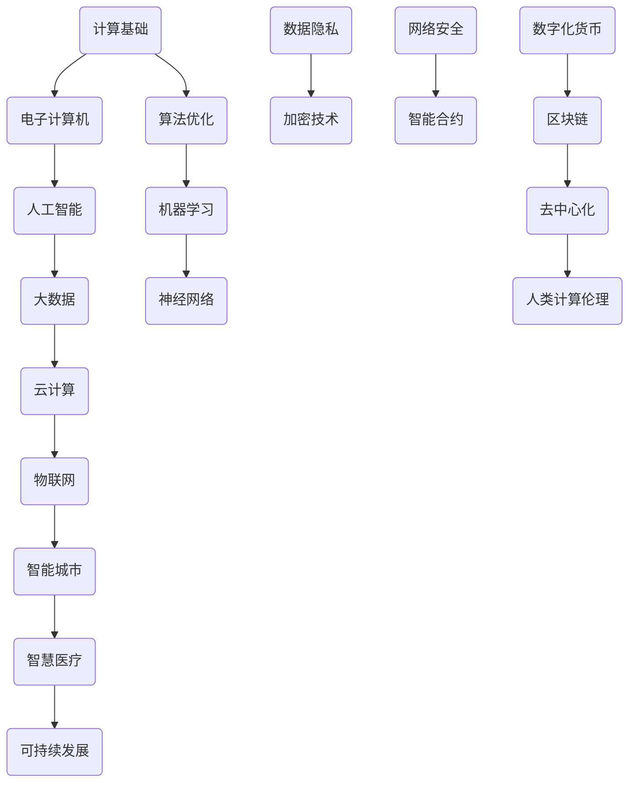

                 

关键词：计算，未来社会，人工智能，技术进步，发展挑战

> 摘要：本文旨在探讨计算技术如何在未来社会中扮演关键角色，并对其深远意义进行深入分析。我们将从背景介绍开始，探讨核心概念与联系，分析核心算法原理，构建数学模型，通过项目实践展示代码实例，探讨实际应用场景，推荐相关工具和资源，并总结未来发展趋势与挑战。

## 1. 背景介绍

### 1.1 计算技术的演变

计算技术的历史可以追溯到古老的算盘和机械计算器。然而，真正的革命始于20世纪中叶，随着电子计算机的出现，计算能力得到了极大的提升。从冯·诺伊曼架构的提出，到今天基于量子计算的突破，计算技术不断演变，为人类社会带来了翻天覆地的变化。

### 1.2 人工智能的崛起

人工智能（AI）作为计算技术的一个重要分支，近年来取得了显著的进展。深度学习、自然语言处理、计算机视觉等技术日益成熟，使得机器能够在各种复杂任务中表现出人类的智慧。AI的崛起不仅改变了工业生产方式，还深刻影响了社会各个层面。

### 1.3 未来社会的期待

在计算技术的推动下，未来社会被期待成为一个高度智能化、互联化和自动化的人类社群。从智能家居到自动驾驶，从智慧城市到全球协作，计算技术将为我们创造前所未有的便利和效率。

## 2. 核心概念与联系

为了更好地理解计算技术在未来社会中的作用，我们需要了解一些核心概念和它们之间的联系。以下是使用Mermaid绘制的流程图，展示了这些概念和它们之间的关系：

### 2.1 计算基础

计算基础是指支撑所有计算活动的硬件和软件设施，包括处理器、内存、存储和网络等。

### 2.2 电子计算机

电子计算机是现代计算的核心，通过执行程序指令，处理和存储数据。

### 2.3 人工智能

人工智能是通过模拟人类智能行为，使计算机能够进行推理、学习和决策的技术。

### 2.4 大数据

大数据是指海量数据的管理、分析和应用，为人工智能和其他计算技术提供了丰富的数据资源。

### 2.5 云计算

云计算提供了灵活的计算资源，使个人和企业能够按需获取和处理数据。

### 2.6 物联网

物联网将物理世界中的设备和系

