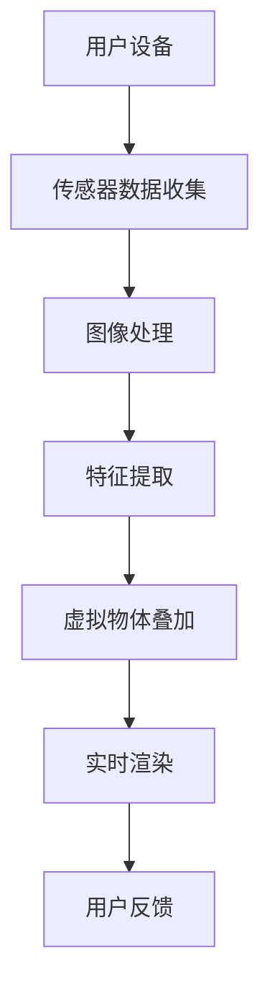

                 

关键词：增强现实（AR）、电商、虚拟试穿、用户体验、案例分析

> 摘要：本文将深入探讨增强现实技术在电商领域的应用，通过具体的案例分析和市场展望，揭示增强现实如何提升电商购物体验，以及其未来发展的潜在趋势和挑战。

## 1. 背景介绍

### 1.1 增强现实（AR）技术简介

增强现实（Augmented Reality，AR）是一种将虚拟信息与现实世界实时叠加的技术。通过AR技术，用户能够在现实场景中看到和互动虚拟物体，从而获得超越真实环境的体验。与虚拟现实（VR）不同，AR技术并不完全取代现实，而是增强和丰富用户的现实感知。

### 1.2 电商领域的发展现状

随着互联网技术的飞速发展，电商已经成为全球消费者购买商品的重要渠道。传统的电商模式主要依赖于图文和视频展示，但这种方式存在一定的局限性，无法给用户提供真实、直观的购物体验。因此，探索新的技术手段，如AR技术，来提升电商购物体验变得尤为重要。

## 2. 核心概念与联系

### 2.1 虚拟试穿与增强现实

虚拟试穿是增强现实技术在电商领域的一项重要应用。通过AR技术，用户可以在购买服装、眼镜等商品时，直接在现实场景中试穿，获得与实际试穿相近的体验。这种技术不仅提高了用户的购物满意度，还减少了因尺寸不合适导致的退换货成本。

### 2.2 增强现实架构

增强现实技术涉及多个关键组件，包括传感器、摄像头、图像处理、实时渲染等。以下是一个简化的增强现实架构流程图：



### 2.3 虚拟试穿流程

虚拟试穿的基本流程如下：

1. **数据采集**：用户通过摄像头或传感器收集自身图像数据。
2. **图像处理**：对图像进行预处理，如去噪、增强等。
3. **特征提取**：从图像中提取关键特征，如人体轮廓、服装边缘等。
4. **虚拟物体叠加**：将虚拟服装与用户特征匹配，并在图像中叠加显示。
5. **实时渲染**：对叠加后的图像进行实时渲染，确保虚拟服装与现实环境的一致性。
6. **用户反馈**：用户通过交互设备（如触摸屏、手势识别等）进行反馈，调整试穿效果。

## 3. 核心算法原理 & 具体操作步骤

### 3.1 算法原理概述

虚拟试穿算法的核心在于将虚拟服装与用户特征进行准确匹配和叠加。这涉及到计算机视觉和图像处理领域的一些关键算法，如：

- **人体轮廓识别**：通过深度学习模型对用户轮廓进行识别。
- **服装边缘检测**：使用图像处理技术，如Canny算法，检测服装边缘。
- **特征匹配**：通过特征匹配算法（如SIFT、SURF）将虚拟服装与用户特征进行匹配。

### 3.2 算法步骤详解

1. **预处理**：对输入图像进行预处理，如灰度化、大小调整等。
2. **人体轮廓识别**：利用深度学习模型（如SSD、YOLO）检测用户轮廓。
3. **服装边缘检测**：使用Canny算法检测服装边缘。
4. **特征匹配**：对用户轮廓和服装边缘进行特征匹配。
5. **虚拟物体叠加**：将虚拟服装与用户特征匹配后的图像进行叠加。
6. **实时渲染**：使用OpenGL或Vulkan进行实时渲染，确保图像质量。

### 3.3 算法优缺点

#### 优点：

- **提升用户体验**：通过虚拟试穿，用户可以在购买前更直观地了解商品效果。
- **降低退换货成本**：准确匹配用户特征，减少因尺寸不合适导致的退换货情况。
- **增加购物乐趣**：虚拟试穿带来的新体验，增加了购物的趣味性。

#### 缺点：

- **计算资源要求高**：实时渲染和特征匹配需要较高的计算资源。
- **硬件设备依赖**：需要较为先进的摄像头和传感器设备。
- **技术门槛较高**：涉及复杂的算法和开发流程，对开发人员的技术水平有较高要求。

### 3.4 算法应用领域

虚拟试穿算法不仅应用于电商领域，还可以扩展到其他行业，如虚拟试妆、虚拟装修等。其核心在于提供更真实、直观的体验，帮助用户做出更明智的决策。

## 4. 数学模型和公式 & 详细讲解 & 举例说明

### 4.1 数学模型构建

虚拟试穿的核心在于图像处理和特征匹配。以下是一个简化的数学模型：

$$
\begin{align*}
I_{input} &= \text{输入图像} \\
I_{preprocessed} &= \text{预处理后的图像} \\
C_{body} &= \text{人体轮廓} \\
C_{clothe} &= \text{服装轮廓} \\
\end{align*}
$$

### 4.2 公式推导过程

1. **预处理**：

$$
I_{preprocessed} = \text{Preprocess}(I_{input})
$$

2. **人体轮廓识别**：

$$
C_{body} = \text{HumanDetector}(I_{preprocessed})
$$

3. **服装边缘检测**：

$$
C_{clothe} = \text{ClotheDetector}(I_{preprocessed})
$$

4. **特征匹配**：

$$
\text{Match}(C_{body}, C_{clothe}) = \text{FeatureMatcher}(C_{body}, C_{clothe})
$$

5. **虚拟物体叠加**：

$$
I_{output} = \text{Overlay}(I_{preprocessed}, \text{Match}(C_{body}, C_{clothe}))
$$

### 4.3 案例分析与讲解

以一款电商平台为例，该平台引入了虚拟试穿功能。用户可以在购买服装前，通过AR技术直接试穿，并获得实时反馈。以下是一个简单的案例：

- **用户输入**：用户上传一张自身穿着新衣服的照片。
- **预处理**：图像进行灰度化、大小调整等预处理操作。
- **人体轮廓识别**：使用SSD模型检测用户轮廓。
- **服装边缘检测**：使用Canny算法检测服装边缘。
- **特征匹配**：将用户轮廓和服装边缘进行特征匹配。
- **虚拟物体叠加**：将匹配后的服装轮廓叠加到用户图像上。
- **实时渲染**：使用OpenGL进行实时渲染，确保图像质量。

通过上述步骤，用户可以直观地看到穿着新衣服的效果，从而做出更明智的购买决策。

## 5. 项目实践：代码实例和详细解释说明

### 5.1 开发环境搭建

#### 5.1.1 环境要求

- 操作系统：Windows/Linux/MacOS
- 编程语言：Python
- 开发工具：PyCharm/VSCode
- 库和框架：OpenCV、TensorFlow、OpenGL

#### 5.1.2 环境配置

1. 安装Python（3.8及以上版本）。
2. 安装PyTorch（1.8及以上版本）。
3. 安装OpenCV（4.5及以上版本）。
4. 安装OpenGL库。

### 5.2 源代码详细实现

以下是一个简化的虚拟试穿项目代码示例：

```python
import cv2
import numpy as np

# 人体轮廓识别
def detect_body_outline(image):
    # 使用SSD模型进行人体轮廓识别
    # ...

# 服装边缘检测
def detect_clothe_outline(image):
    # 使用Canny算法进行服装边缘检测
    # ...

# 特征匹配
def feature_matching(body_outline, clothe_outline):
    # 使用特征匹配算法进行匹配
    # ...

# 虚拟物体叠加
def overlay(image, match_result):
    # 将匹配后的服装轮廓叠加到用户图像上
    # ...

# 主函数
def main():
    # 加载输入图像
    image = cv2.imread("input_image.jpg")

    # 预处理图像
    preprocessed_image = preprocess_image(image)

    # 人体轮廓识别
    body_outline = detect_body_outline(preprocessed_image)

    # 服装边缘检测
    clothe_outline = detect_clothe_outline(preprocessed_image)

    # 特征匹配
    match_result = feature_matching(body_outline, clothe_outline)

    # 虚拟物体叠加
    output_image = overlay(preprocessed_image, match_result)

    # 显示输出图像
    cv2.imshow("Output Image", output_image)
    cv2.waitKey(0)

if __name__ == "__main__":
    main()
```

### 5.3 代码解读与分析

1. **人体轮廓识别**：使用SSD模型进行人体轮廓识别，这是深度学习中的一个常用模型，用于实时物体检测。
2. **服装边缘检测**：使用Canny算法进行服装边缘检测，这是图像处理中的一种常用算法，用于提取图像中的边缘信息。
3. **特征匹配**：使用特征匹配算法将人体轮廓和服装边缘进行匹配，这是计算机视觉中的一种常用算法，用于将不同图像中的特征点进行对应。
4. **虚拟物体叠加**：将匹配后的服装轮廓叠加到用户图像上，这是图像处理中的常用操作，用于将虚拟物体与现实图像进行融合。

### 5.4 运行结果展示

运行上述代码后，将输入图像加载到OpenCV窗口中，用户可以看到叠加了虚拟服装的输出图像。


## 6. 实际应用场景

### 6.1 电商平台

电商平台是增强现实技术在电商领域的主要应用场景之一。通过虚拟试穿功能，用户可以在购买服装、眼镜等商品前进行试穿，提高购物满意度。

### 6.2 虚拟试妆

虚拟试妆是增强现实技术在美妆领域的应用。用户可以在购买化妆品前，通过AR技术直接试妆，从而做出更明智的购买决策。

### 6.3 虚拟装修

虚拟装修是增强现实技术在家居装修领域的应用。用户可以在装修前，通过AR技术预览装修效果，帮助用户更好地规划装修方案。

## 7. 未来应用展望

随着技术的不断进步，增强现实技术在电商领域的应用前景十分广阔。未来，AR技术将更加普及，不仅限于虚拟试穿，还将扩展到更多领域，如虚拟购物体验、智能导购等。同时，随着计算能力的提升和硬件设备的优化，AR技术的性能和用户体验将得到进一步提升。

## 8. 工具和资源推荐

### 8.1 学习资源推荐

- 《增强现实技术基础》
- 《计算机视觉：算法与应用》
- 《OpenGL编程指南》

### 8.2 开发工具推荐

- PyCharm
- VSCode
- OpenCV

### 8.3 相关论文推荐

- "A Survey on Augmented Reality in Retail"
- "Deep Learning for Augmented Reality"
- "Real-Time Human Pose Estimation in Videos"

## 9. 总结：未来发展趋势与挑战

增强现实技术在电商领域的应用正在逐步深入，未来将迎来更加广泛和多样化的应用场景。然而，随着技术的不断发展，也面临着一些挑战，如算法优化、硬件设备升级、用户体验提升等。通过不断的技术创新和优化，我们有理由相信，增强现实技术将为电商领域带来更加丰富的购物体验。

## 10. 附录：常见问题与解答

### 10.1 增强现实技术是什么？

增强现实技术（AR）是一种将虚拟信息与现实世界实时叠加的技术，用户能够在现实场景中看到和互动虚拟物体。

### 10.2 虚拟试穿技术是如何实现的？

虚拟试穿技术主要依赖于计算机视觉和图像处理算法，通过识别用户轮廓和服装边缘，将虚拟服装叠加到用户图像上。

### 10.3 增强现实技术在电商领域的应用前景如何？

增强现实技术在电商领域的应用前景广阔，可以提高购物满意度，降低退换货成本，增加购物乐趣。

### 10.4 如何优化虚拟试穿技术的性能？

可以通过算法优化、硬件设备升级、实时渲染技术提升等手段来优化虚拟试穿技术的性能。

## 作者署名

作者：禅与计算机程序设计艺术 / Zen and the Art of Computer Programming

