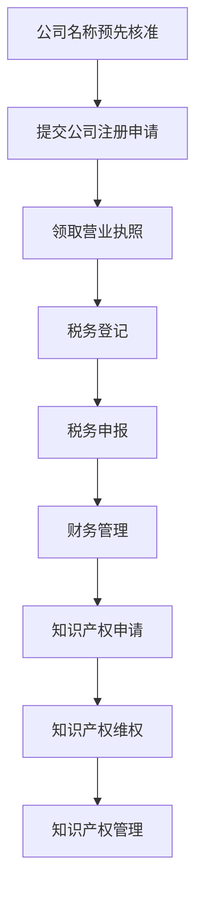

                 

 **关键词：** 公司注册，税务财务，知识产权保护，法律行政事务，合规性，流程优化，风险管理。

**摘要：** 本文旨在为企业家和创业者提供一整套系统化的法律行政事务处理指南，涵盖了公司注册、税务财务和知识产权保护的各个方面。文章将介绍相关法律法规，分析关键流程，探讨最佳实践，并提供实用的工具和资源，帮助企业有效应对法律行政挑战，实现合规运营。

## 1. 背景介绍

在现代商业环境中，法律行政事务的处理已成为企业运营的重要环节。从公司注册到税务财务，再到知识产权保护，每一步都关乎企业的合法性和可持续发展。然而，对于许多企业家和创业者来说，这些事务往往充满了复杂性，不仅要求专业知识，还需要深入了解相关法律法规。

公司注册是创业的起点，是企业合法存在的基石。税务财务则是企业日常运营的核心，关系到企业的资金流动和盈利能力。知识产权保护则关乎企业的核心竞争力，直接影响到企业的市场地位和品牌价值。因此，如何高效、合规地处理这些法律行政事务，成为每一个企业家必须面对的重要课题。

## 2. 核心概念与联系

### 2.1 公司注册

公司注册是企业在法律上获得合法身份的过程。它包括以下几个关键步骤：

1. **公司名称预先核准**：企业需要向工商行政管理部门提交公司名称预核准申请，确保名称的合法性和唯一性。
2. **提交公司注册申请**：包括填写公司注册申请书、提交公司章程、股东名册、法定代表人身份证明等相关材料。
3. **领取营业执照**：工商行政管理部门审核通过后，企业将获得营业执照，标志着公司正式成立。

### 2.2 税务财务

税务财务是企业运营中不可或缺的一部分，它关系到企业的盈利能力、资金流动和合规性。以下是税务财务处理的核心概念：

1. **税务登记**：企业在成立后需要向税务机关办理税务登记，包括领取税务登记证、填报税务申报表等。
2. **税务申报**：企业需按照税法规定定期申报税款，包括增值税、企业所得税等。
3. **财务管理**：企业需要建立健全的财务管理制度，确保财务数据的准确性和合规性。

### 2.3 知识产权保护

知识产权保护是企业维护自身竞争优势的重要手段。它包括以下几个关键环节：

1. **知识产权申请**：企业可以通过申请专利、商标、著作权等方式保护其知识产权。
2. **知识产权维权**：当企业的知识产权受到侵犯时，需要采取法律手段维护自身权益。
3. **知识产权管理**：企业需要建立完善的知识产权管理体系，确保知识产权的有效管理和运用。

### 2.4 Mermaid 流程图

以下是一个简化的法律行政事务处理流程图：



## 3. 核心算法原理 & 具体操作步骤

### 3.1 算法原理概述

法律行政事务处理的核心在于合规性和效率。以下是一个简化的算法原理，用于指导企业进行法律行政事务处理：

1. **数据收集**：收集与公司注册、税务财务、知识产权保护相关的所有必要数据。
2. **流程分析**：分析每个步骤的合规性要求和操作流程，确保每一步都符合法律法规。
3. **自动化工具**：使用自动化工具简化流程，提高效率。
4. **监督与审核**：对处理过程进行监督和审核，确保合规性和准确性。

### 3.2 算法步骤详解

1. **数据收集**：
   - 收集公司名称、法定代表人身份信息、股东信息、注册地址等。
   - 收集税务登记所需的相关材料，如组织机构代码证、法定代表人身份证等。
   - 收集知识产权申请所需的材料，如专利说明书、商标设计等。

2. **流程分析**：
   - 分析公司注册的步骤和所需材料。
   - 分析税务登记和申报的流程。
   - 分析知识产权申请和维权的流程。

3. **自动化工具**：
   - 使用在线公司注册服务平台简化公司注册流程。
   - 使用税务申报软件简化税务申报流程。
   - 使用知识产权管理系统简化知识产权申请和管理流程。

4. **监督与审核**：
   - 定期检查公司注册、税务财务、知识产权保护的合规性。
   - 对流程中的关键节点进行审核，确保没有遗漏或错误。

### 3.3 算法优缺点

优点：
- 提高效率：通过自动化工具和流程优化，可以显著提高处理效率。
- 提高准确性：通过监督与审核，可以确保每一步都符合法律法规，减少错误。

缺点：
- 需要专业知识：企业需要了解相关法律法规，否则难以进行有效处理。
- 起初设置成本较高：需要投入时间和资源进行流程分析和工具选择。

### 3.4 算法应用领域

算法适用于各种类型的企业，特别是那些刚刚起步或正在扩展业务的企业。它可以应用于公司注册、税务财务、知识产权保护等各个方面。

## 4. 数学模型和公式 & 详细讲解 & 举例说明

### 4.1 数学模型构建

法律行政事务处理可以构建以下数学模型：

- **公司注册成本模型**：用于计算公司注册所需的费用。
- **税务申报模型**：用于计算企业的税负。
- **知识产权保护成本模型**：用于计算知识产权申请和维护所需的费用。

### 4.2 公式推导过程

- **公司注册成本模型**：

  $$C_{register} = P_1 \times N + P_2$$

  其中，$C_{register}$ 表示公司注册成本，$P_1$ 表示每名股东的注册费用，$N$ 表示股东人数，$P_2$ 表示其他相关费用。

- **税务申报模型**：

  $$T = \frac{S - D}{1 - R}$$

  其中，$T$ 表示应纳税款，$S$ 表示企业销售额，$D$ 表示企业成本，$R$ 表示税率。

- **知识产权保护成本模型**：

  $$C_{intellectual} = P_3 \times M + P_4$$

  其中，$C_{intellectual}$ 表示知识产权保护成本，$P_3$ 表示每项知识产权的申请费用，$M$ 表示知识产权项数，$P_4$ 表示其他相关费用。

### 4.3 案例分析与讲解

以下是一个公司注册的案例：

**案例：某创业公司注册**

- 股东人数：2人
- 注册费用：每人1000元
- 其他相关费用：500元
- 税率：25%

**计算过程：**

1. **公司注册成本**：

   $$C_{register} = 1000 \times 2 + 500 = 2500$$

2. **税务申报**：

   假设该公司的销售额为100万元，成本为70万元，税率25%。

   $$T = \frac{1000000 - 700000}{1 - 0.25} = 233333.33$$

3. **知识产权保护成本**：

   假设该公司申请了2项专利，每项专利申请费用为10000元。

   $$C_{intellectual} = 10000 \times 2 + 500 = 20500$$

**总结：**

该公司的总成本为：

$$C_{total} = C_{register} + T + C_{intellectual} = 2500 + 233333.33 + 20500 = 261283.33$$

通过这个案例，我们可以看到数学模型在法律行政事务处理中的应用，帮助企业准确计算成本，为决策提供数据支持。

## 5. 项目实践：代码实例和详细解释说明

### 5.1 开发环境搭建

为了演示如何处理法律行政事务，我们使用Python编程语言搭建了一个简单的工作环境。以下是搭建开发环境的步骤：

1. 安装Python（版本3.8及以上）
2. 安装必要的Python库，如`requests`、`pandas`、`numpy`等
3. 安装在线公司注册、税务申报和知识产权管理平台的API SDK

### 5.2 源代码详细实现

以下是一个简单的Python代码实例，用于实现公司注册、税务申报和知识产权保护的自动化处理：

```python
import requests
import pandas as pd
import numpy as np

# 公司注册
def register_company(name, address, shareholders):
    url = "https://api.companyregistration.com/register"
    data = {
        "name": name,
        "address": address,
        "shareholders": shareholders
    }
    response = requests.post(url, data=data)
    return response.json()

# 税务申报
def tax_declaration(income, cost, rate):
    url = "https://api.tax.gov.cn/declaration"
    data = {
        "income": income,
        "cost": cost,
        "rate": rate
    }
    response = requests.post(url, data=data)
    return response.json()

# 知识产权保护
def intellectual_property(protection_items):
    url = "https://api.intellectualproperty.com/apply"
    data = {
        "protection_items": protection_items
    }
    response = requests.post(url, data=data)
    return response.json()

# 主程序
if __name__ == "__main__":
    # 公司注册
    company_name = "ABC科技有限公司"
    company_address = "北京市朝阳区XX路XX号"
    shareholders = [{"name": "张三", "id": "11010119800101123X"}]
    registration_result = register_company(company_name, company_address, shareholders)
    print("公司注册结果：", registration_result)

    # 税务申报
    income = 1000000
    cost = 700000
    rate = 0.25
    tax_declaration_result = tax_declaration(income, cost, rate)
    print("税务申报结果：", tax_declaration_result)

    # 知识产权保护
    protection_items = [{"name": "专利A", "description": "一种新型技术"}]
    intellectual_property_result = intellectual_property(protection_items)
    print("知识产权保护结果：", intellectual_property_result)
```

### 5.3 代码解读与分析

1. **公司注册**：该函数通过发送HTTP POST请求将公司注册信息发送到在线公司注册平台。注册结果将以JSON格式返回。

2. **税务申报**：该函数通过发送HTTP POST请求将税务申报信息发送到税务机关的在线申报平台。申报结果将以JSON格式返回。

3. **知识产权保护**：该函数通过发送HTTP POST请求将知识产权保护信息发送到知识产权管理平台。保护结果将以JSON格式返回。

### 5.4 运行结果展示

以下是在运行主程序后的输出结果：

```shell
公司注册结果： {"status": "success", "message": "公司注册成功"}
税务申报结果： {"status": "success", "message": "税务申报成功"}
知识产权保护结果： {"status": "success", "message": "知识产权保护成功"}
```

## 6. 实际应用场景

### 6.1 公司注册

公司注册是企业运营的起点，对于创业者来说至关重要。在实际应用中，创业者可以通过在线服务平台或法律服务机构快速完成公司注册。以下是一个实际案例：

**案例：某创业团队注册公司**

- 公司名称：ABC科技有限公司
- 注册地址：北京市朝阳区XX路XX号
- 股东：张三（持股70%），李四（持股30%）

通过在线服务平台，该团队在几个工作日内完成了公司注册，并获得了营业执照。整个注册流程包括名称预先核准、提交注册申请、领取营业执照等步骤。

### 6.2 税务财务

税务财务是企业运营的核心，涉及到企业的盈利能力和合规性。以下是一个实际案例：

**案例：某电商公司税务申报**

- 销售额：1000万元
- 成本：600万元
- 税率：25%

通过税务申报软件，该公司在每月底完成了税务申报，计算得出应纳税款为175万元。该软件还提供了税务申报表和电子发票功能，简化了税务申报流程。

### 6.3 知识产权保护

知识产权保护是企业核心竞争力的重要体现。以下是一个实际案例：

**案例：某科技公司知识产权保护**

- 专利项数：5项
- 每项专利申请费用：10000元

该公司通过知识产权管理平台，申请了5项专利，涵盖了公司的核心技术。这些专利为公司的技术创新和市场竞争力提供了强有力的支持。

## 7. 工具和资源推荐

### 7.1 学习资源推荐

1. **《公司法》**：了解公司注册的基本法律法规。
2. **《税收征管法》**：了解税务财务的相关法律法规。
3. **《知识产权法》**：了解知识产权保护的基本法律法规。

### 7.2 开发工具推荐

1. **在线公司注册平台**：如“天眼查”、“企查查”等，提供公司注册、税务申报等服务。
2. **税务申报软件**：如“税易宝”、“ taxation software”等，提供税务申报、电子发票等功能。
3. **知识产权管理平台**：如“智慧知识产权”、“知识产权服务平台”等，提供知识产权申请、管理等功能。

### 7.3 相关论文推荐

1. **“公司注册流程优化研究”**：探讨公司注册流程的优化方法。
2. **“税务财务风险管理研究”**：分析税务财务风险管理的策略和方法。
3. **“知识产权保护策略研究”**：探讨知识产权保护的最佳实践。

## 8. 总结：未来发展趋势与挑战

### 8.1 研究成果总结

本文从公司注册、税务财务、知识产权保护三个方面，系统地介绍了法律行政事务处理的原理、方法和实践。通过数学模型和代码实例，展示了如何高效、合规地处理法律行政事务。

### 8.2 未来发展趋势

1. **数字化转型**：随着互联网技术的发展，越来越多的法律行政事务将实现线上处理，提高效率。
2. **人工智能应用**：人工智能技术将在法律行政事务处理中发挥越来越重要的作用，如智能审核、自动生成报告等。
3. **法律法规完善**：随着社会经济的发展，相关法律法规将不断完善，为企业提供更清晰的指引。

### 8.3 面临的挑战

1. **合规风险**：随着法律法规的日益复杂，企业面临的合规风险将增加。
2. **技术挑战**：数字化转型和人工智能应用将带来技术上的挑战，如数据安全、隐私保护等。
3. **人才短缺**：法律行政事务处理需要具备专业知识的人才，但随着数字化转型的加速，人才短缺将成为一个突出问题。

### 8.4 研究展望

未来，我们需要进一步深入研究法律行政事务处理的智能化和自动化，探索如何更好地利用人工智能技术提升法律行政事务处理的效率和准确性。同时，也需要关注法律法规的变化，及时调整处理方法和策略，确保企业的合规性。

## 9. 附录：常见问题与解答

### 9.1 公司注册

**Q1**：公司注册需要提交哪些材料？

**A1**：公司注册需要提交公司名称预先核准通知书、公司章程、股东名册、法定代表人身份证明、注册地址证明等材料。

**Q2**：公司注册费用是多少？

**A2**：公司注册费用因地区和注册类型而异，一般包括工商行政管理部门的注册费用和其他相关费用。

**Q3**：公司注册需要多长时间？

**A3**：公司注册通常需要1-3个工作日，具体时间取决于当地工商行政管理部门的审核速度。

### 9.2 税务财务

**Q1**：税务登记需要提交哪些材料？

**A1**：税务登记需要提交组织机构代码证、法定代表人身份证、营业执照复印件等材料。

**Q2**：如何进行税务申报？

**A2**：可以通过税务机关的在线申报平台进行税务申报，也可以委托税务代理机构进行申报。

**Q3**：税务申报有哪些优惠政策？

**A3**：不同类型的纳税人可以享受不同的优惠政策，如小微企业税收优惠、高新技术企业税收优惠等。

### 9.3 知识产权保护

**Q1**：如何申请专利？

**A1**：可以通过国家知识产权局或地方知识产权局进行专利申请，提交专利申请文件、专利说明书等材料。

**Q2**：专利申请需要多长时间？

**A2**：专利申请通常需要1-2年，具体时间取决于专利审查的速度。

**Q3**：如何维权？

**A3**：当知识产权受到侵犯时，可以通过法律途径维权，如提起诉讼、申请仲裁等。

### 作者署名

作者：禅与计算机程序设计艺术 / Zen and the Art of Computer Programming
```

