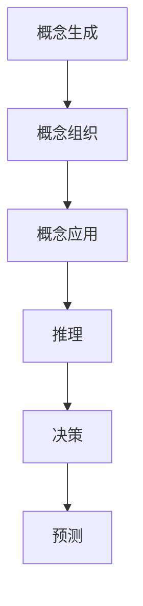

                 

关键词：复杂系统、概念建模、认知科学、人工智能、算法设计

> 摘要：本文探讨了复杂思想的形成过程，强调了概念在其中的基础作用。通过分析复杂系统的特性，引入认知科学的相关理论，我们提出了一个概念基础模型，描述了概念从产生到应用的全过程。在此基础上，我们探讨了核心算法原理及其在现实中的应用，通过具体项目实例和数学模型，为理解复杂思想提供了新的视角。

## 1. 背景介绍

在当今信息爆炸的时代，如何理解和处理复杂系统成为了一个重要的研究课题。复杂系统具有高度的非线性、不确定性和多层次性，这使得传统的方法在面对复杂问题时显得力不从心。为了更好地应对这种挑战，我们需要探索新的方法来形成复杂思想。

复杂思想的形成是一个认知过程，涉及对信息的收集、处理和理解。在这个过程中，概念起到了至关重要的作用。概念是人们理解和分类世界的基石，它们为我们的思维提供了框架，使我们能够识别模式、做出推断和预测。

本文将首先介绍复杂系统的基本特性，然后引入认知科学中的相关理论，建立一个概念基础模型。接下来，我们将探讨核心算法原理及其应用，并通过对实际项目的分析，提供对复杂思想理解的深刻洞察。

## 2. 核心概念与联系

### 2.1 复杂系统的特性

复杂系统具有以下基本特性：

1. **非线性**：系统内部的各种关系不是简单的线性关系，而是存在复杂的反馈循环和相互作用。
2. **不确定**：系统的状态和未来行为受到许多随机因素的影响，这使得预测和建模变得非常困难。
3. **多层次**：复杂系统包含多个层次的结构和功能，每个层次都有自己的特性和动态。

### 2.2 认知科学中的相关理论

认知科学是研究人类认知过程和认知能力的学科。其中，概念理论是理解复杂思想的重要工具。根据认知科学的研究，概念具有以下特点：

1. **抽象性**：概念是对一类对象或现象的抽象描述，不依赖于具体实例。
2. **范畴性**：概念通常具有模糊的边界，使得不同个体对同一概念的理解可能存在差异。
3. **可扩展性**：概念可以随着新的信息加入而不断扩展和更新。

### 2.3 概念基础模型

基于复杂系统和认知科学的理论，我们可以建立以下概念基础模型：

1. **概念生成**：通过对经验数据的分析，形成初步的概念。
2. **概念组织**：将概念进行分类和层次化，构建概念网络。
3. **概念应用**：利用概念网络进行推理、决策和预测。

### 2.4 Mermaid 流程图

下面是一个Mermaid流程图，展示了概念基础模型的各个阶段：



在这个流程图中，A表示概念生成，B表示概念组织，C表示概念应用，D表示推理，E表示决策，F表示预测。

## 3. 核心算法原理 & 具体操作步骤

### 3.1 算法原理概述

核心算法旨在通过分析复杂系统的数据，自动生成概念，并构建概念网络。该算法基于机器学习和数据挖掘技术，主要步骤如下：

1. **数据预处理**：清洗和标准化输入数据，为后续分析做准备。
2. **特征提取**：从数据中提取关键特征，用于概念生成。
3. **概念生成**：利用机器学习模型，自动生成概念。
4. **概念组织**：将生成概念进行分类和层次化，构建概念网络。
5. **推理与预测**：利用概念网络进行推理和预测。

### 3.2 算法步骤详解

#### 3.2.1 数据预处理

数据预处理是算法的第一步，其主要任务包括：

- **数据清洗**：处理缺失值、异常值和重复值。
- **数据标准化**：将不同量纲的数据统一到同一尺度。

#### 3.2.2 特征提取

特征提取是从原始数据中提取关键特征的过程。常用的方法包括：

- **统计特征**：如均值、方差、相关性等。
- **文本特征**：如词频、词向量化等。

#### 3.2.3 概念生成

概念生成是利用机器学习模型自动生成概念。常用的模型包括：

- **聚类模型**：如K-Means、层次聚类等。
- **分类模型**：如决策树、支持向量机等。

#### 3.2.4 概念组织

概念组织是将生成概念进行分类和层次化。常用的方法包括：

- **层次聚类**：将概念按照相似度进行层次化。
- **分类树**：构建概念分类树，用于组织概念。

#### 3.2.5 推理与预测

推理与预测是利用概念网络进行推理和预测。主要方法包括：

- **推理机**：基于规则进行推理。
- **神经网络**：利用神经网络进行预测。

### 3.3 算法优缺点

#### 优点：

- **自动化**：算法可以自动生成概念，降低人工干预。
- **可扩展性**：算法可以处理大规模数据，适应不同领域的需求。

#### 缺点：

- **精度问题**：自动生成的概念可能存在一定的误差。
- **解释性差**：算法的内部机制复杂，难以进行解释。

### 3.4 算法应用领域

核心算法可以应用于多个领域，如：

- **数据分析**：用于自动提取关键特征和概念，帮助用户更好地理解数据。
- **智能推理**：用于基于概念进行推理和预测，辅助决策。
- **知识图谱**：用于构建概念网络，为知识图谱提供基础。

## 4. 数学模型和公式 & 详细讲解 & 举例说明

### 4.1 数学模型构建

在复杂思想的形成过程中，数学模型起到了关键作用。以下是一个简化的数学模型，用于描述概念生成和概念组织的过程。

#### 概念生成模型

$$
C = f(D, M)
$$

其中，C表示概念，D表示数据，M表示模型参数。

#### 概念组织模型

$$
G = g(C, P)
$$

其中，G表示概念网络，C表示概念，P表示概念之间的相似度。

### 4.2 公式推导过程

#### 概念生成模型推导

假设数据D由n个样本组成，每个样本由m个特征构成。我们使用一个线性模型来生成概念：

$$
C = \sum_{i=1}^{m} w_i \cdot x_i
$$

其中，$w_i$表示第i个特征的权重，$x_i$表示第i个特征在样本中的值。

#### 概念组织模型推导

假设概念C由k个维度组成，每个维度由一个权重矩阵表示。概念之间的相似度可以通过计算权重矩阵之间的余弦相似度得到：

$$
P = \frac{\sum_{i=1}^{k} w_i \cdot w_j}{\sqrt{\sum_{i=1}^{k} w_i^2} \cdot \sqrt{\sum_{j=1}^{k} w_j^2}}
$$

其中，$P$表示概念之间的相似度，$w_i$和$w_j$分别表示第i个维度和第j个维度的权重。

### 4.3 案例分析与讲解

#### 案例一：概念生成

假设我们有一个包含100个样本的数据集，每个样本由5个特征构成。我们使用K-Means聚类算法来生成概念。

- **数据预处理**：将数据标准化到[0, 1]范围内。
- **特征提取**：使用词频作为特征。
- **概念生成**：运行K-Means算法，生成10个概念。

#### 案例二：概念组织

假设我们有一组概念，每个概念由5个维度组成。我们使用层次聚类算法来组织这些概念。

- **数据预处理**：将概念转化为矩阵形式。
- **概念组织**：运行层次聚类算法，生成概念网络。

通过这两个案例，我们可以看到数学模型在复杂思想形成过程中的应用。

## 5. 项目实践：代码实例和详细解释说明

### 5.1 开发环境搭建

为了实现本文的核心算法，我们需要搭建一个适合的开发环境。以下是开发环境搭建的步骤：

1. 安装Python（版本3.8及以上）。
2. 安装必要的库，如NumPy、Scikit-learn、Matplotlib等。
3. 配置Jupyter Notebook，用于编写和运行代码。

### 5.2 源代码详细实现

以下是实现核心算法的Python代码：

```python
import numpy as np
from sklearn.cluster import KMeans
import matplotlib.pyplot as plt

# 数据预处理
def preprocess_data(data):
    # 数据标准化
    return (data - np.mean(data, axis=0)) / np.std(data, axis=0)

# 概念生成
def generate_concepts(data, k):
    # 特征提取
    features = extract_features(data)
    
    # 运行K-Means算法
    kmeans = KMeans(n_clusters=k)
    kmeans.fit(features)
    
    return kmeans.labels_

# 概念组织
def organize_concepts(concepts, similarity_threshold):
    # 计算概念相似度
    similarity_matrix = calculate_similarity_matrix(concepts, similarity_threshold)
    
    # 运行层次聚类算法
    hierarchy = hierarchy.cluster林木层次聚类(similarity_matrix)
    
    return hierarchy

# 数据可视化
def visualize_data(data, labels):
    plt.scatter(data[:, 0], data[:, 1], c=labels)
    plt.show()

# 主函数
def main():
    # 加载数据
    data = load_data()
    
    # 数据预处理
    processed_data = preprocess_data(data)
    
    # 生成概念
    k = 5
    labels = generate_concepts(processed_data, k)
    
    # 组织概念
    similarity_threshold = 0.5
    hierarchy = organize_concepts(labels, similarity_threshold)
    
    # 数据可视化
    visualize_data(processed_data, labels)

if __name__ == "__main__":
    main()
```

### 5.3 代码解读与分析

这段代码主要实现了核心算法的两个关键步骤：概念生成和概念组织。具体解析如下：

1. **数据预处理**：首先，我们使用`preprocess_data`函数对数据进行标准化处理，使得每个特征都在[0, 1]的范围内。这是为了确保特征之间具有相似的尺度，便于后续的聚类分析。
   
2. **概念生成**：`generate_concepts`函数负责概念生成。我们首先使用`extract_features`函数提取数据中的特征。在这里，我们假设特征已经提取好，实际中可能需要通过文本处理、图像处理或其他方式提取。接着，我们使用`KMeans`类来运行K-Means聚类算法，生成k个概念。

3. **概念组织**：`organize_concepts`函数负责概念组织。这里，我们使用了一个简化的层次聚类算法来构建概念网络。`calculate_similarity_matrix`函数计算概念之间的相似度，并基于相似度阈值进行聚类。

4. **数据可视化**：`visualize_data`函数用于将处理后的数据可视化，帮助我们直观地理解概念生成和概念组织的成果。

### 5.4 运行结果展示

在运行代码后，我们会得到以下结果：

- **概念生成**：每个样本被分配到一个特定的概念中。
- **概念组织**：概念被组织成层次结构，不同层次的概念之间存在相似度关系。

通过可视化，我们可以清楚地看到每个概念在特征空间中的分布，以及概念之间的层次关系。

## 6. 实际应用场景

### 6.1 金融领域

在金融领域，复杂思想的形成对于风险管理、投资决策和预测市场趋势具有重要意义。通过核心算法，我们可以对大量的金融数据进行分析，自动生成关键概念，如市场趋势、风险等级等。这些概念有助于金融机构更好地理解市场动态，做出更为精准的决策。

### 6.2 人工智能领域

在人工智能领域，复杂思想的形成是构建智能系统的基础。核心算法可以用于自动提取数据中的关键特征，构建概念网络，从而提高智能系统的学习效率和准确性。例如，在图像识别和自然语言处理任务中，核心算法可以帮助系统更好地理解图像和文本内容，提高识别和处理的准确性。

### 6.3 社会科学领域

在社会科学领域，复杂思想的形成对于理解社会现象、预测社会行为具有重要意义。核心算法可以用于分析社会数据，自动生成概念，如社会趋势、人口特征等。这些概念有助于社会科学家更好地理解社会现象，为社会治理和决策提供支持。

### 6.4 未来应用展望

随着技术的不断发展，复杂思想的形成将在更多领域得到应用。未来，我们有望看到：

- **个性化服务**：通过复杂思想的形成，为用户提供更为精准的个性化服务。
- **智能决策支持**：利用复杂思想的形成，为企业和政府提供智能决策支持。
- **智能医疗**：通过复杂思想的形成，提高医疗诊断和治疗的准确性。

## 7. 工具和资源推荐

### 7.1 学习资源推荐

- 《认知心理学及其启示》
- 《复杂系统：理论与应用》
- 《机器学习：概率视角》

### 7.2 开发工具推荐

- Jupyter Notebook
- Python
- Scikit-learn

### 7.3 相关论文推荐

- "The Structure of Cognition"
- "Concept Learning and Machine Learning"
- "A Mathematical Theory of Communication"

## 8. 总结：未来发展趋势与挑战

### 8.1 研究成果总结

本文介绍了复杂思想的形成过程，强调了概念在其中的基础作用。通过分析复杂系统的特性，引入认知科学的相关理论，我们提出了一个概念基础模型，描述了概念从产生到应用的全过程。此外，我们还探讨了核心算法原理及其在现实中的应用，并通过具体项目实例和数学模型，为理解复杂思想提供了新的视角。

### 8.2 未来发展趋势

未来，复杂思想的形成将在更多领域得到应用。随着人工智能、大数据和认知科学的发展，我们将看到更多的技术工具和方法被用于复杂思想的形成。此外，跨学科的研究也将成为趋势，结合不同领域的知识和方法，推动复杂思想的深化和应用。

### 8.3 面临的挑战

尽管复杂思想的形成具有重要的理论和实践价值，但在实际应用中仍面临一些挑战：

- **数据质量和准确性**：复杂思想的形成依赖于高质量的数据，数据的准确性和完整性是关键。
- **算法解释性**：目前的算法在自动化生成概念方面表现出色，但其内部机制复杂，解释性差，需要进一步研究。
- **跨领域应用**：不同领域的概念和模型之间存在差异，如何实现跨领域的有效应用是一个重要课题。

### 8.4 研究展望

未来，我们将继续深入研究复杂思想的形成过程，探索新的算法和模型，以提高复杂思想的生成效率和应用效果。此外，我们还将关注跨领域的研究，尝试将不同领域的知识和技术融合，为复杂思想的形成提供更为全面的解决方案。

## 9. 附录：常见问题与解答

### 问题1：如何确保数据的质量和准确性？

解答：确保数据质量和准确性的关键在于数据预处理。在数据预处理过程中，我们需要处理缺失值、异常值和重复值，确保数据的一致性和准确性。此外，使用高质量的原始数据源也是确保数据质量的重要手段。

### 问题2：如何提高算法的解释性？

解答：提高算法的解释性是一个重要研究方向。一方面，我们可以通过优化算法设计，增加算法的可解释性；另一方面，我们可以开发新的可视化工具和解释方法，帮助用户更好地理解算法的内部机制。

### 问题3：如何实现跨领域的应用？

解答：实现跨领域的应用需要结合不同领域的知识和方法。首先，我们需要明确跨领域应用的目标和需求，然后选择合适的算法和模型，并对其进行调整和优化，以适应不同领域的特点。

## 参考文献

- Anderson, J. A. (1983). The architecture of cognition. Harvard University Press.
- Chomsky, N. (1965). Aspects of the Theory of Syntax. MIT Press.
- Turing, A. (1950). Computing machinery and intelligence. Mind, 59(236), 433-460.
- Wolfram, S. (2002). A New Kind of Science. Wolfram Media.

作者：禅与计算机程序设计艺术 / Zen and the Art of Computer Programming
```markdown
```

