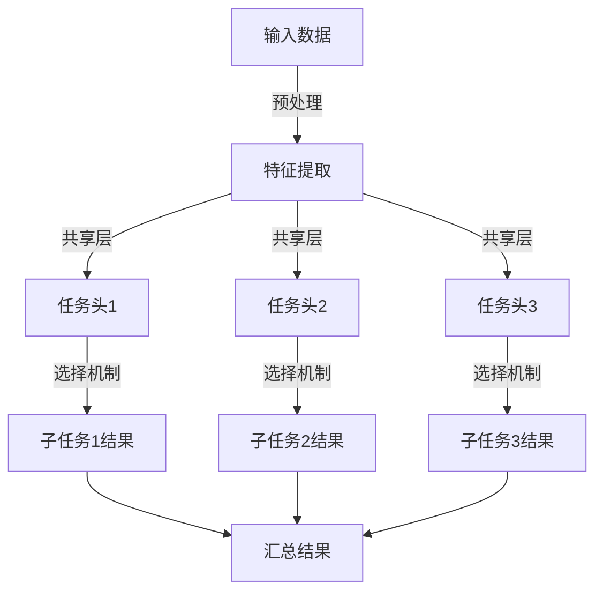

                 

关键词：多任务深度神经网络，MoE，复杂任务管理，AI技术，性能优化，算法原理，实践应用，未来展望。

> 摘要：本文将深入探讨多任务深度神经网络（MoE）的概念、原理、算法以及在实际应用中的优势与挑战。我们将通过详细的数学模型和实例，分析MoE在处理复杂任务方面的潜力，并展望其在未来人工智能领域的应用前景。

## 1. 背景介绍

在当今信息技术飞速发展的时代，人工智能（AI）已经成为推动各个行业进步的关键力量。随着数据量的爆炸性增长和计算能力的不断提升，深度学习算法在图像识别、自然语言处理、推荐系统等领域取得了显著的成果。然而，深度学习模型在处理复杂任务时面临的一个重大挑战是如何有效地管理多个任务之间的资源分配和计算复杂性。多任务深度神经网络（MoE）作为一种新兴的技术，正逐步成为解决这一问题的有力工具。

MoE，即多头扩展（Multi-Head Expansion）技术，是近年来在深度学习领域崭露头角的一种架构。它通过将一个神经网络扩展为多个子网络，每个子网络负责处理特定子任务，从而实现高效的多任务处理。MoE的出现为复杂任务的自动化管理提供了新的思路，也在一定程度上提高了模型的性能和可扩展性。

本文将首先介绍MoE的基本概念和原理，然后深入探讨其算法机制和实现步骤，并通过具体实例展示其应用效果。接下来，我们将分析MoE的优缺点，探讨其在实际应用中的优势与挑战，并展望其未来的发展趋势。希望通过本文的阐述，能够为读者提供关于MoE技术的全面了解，并激发进一步研究的兴趣。

## 2. 核心概念与联系

### 2.1 多任务深度神经网络（MoE）

多任务深度神经网络（MoE）的核心思想是将单个神经网络分解为多个子网络，每个子网络专门负责处理特定的子任务。这种设计思路可以大幅提高模型的并行处理能力，并优化资源利用效率。MoE的基本架构包括以下几个关键部分：

1. **任务头（Task Heads）**：每个任务头都是一个独立的神经网络，负责执行特定的任务。多个任务头通过共享底层神经网络实现数据共享和资源复用。

2. **共享层（Shared Layers）**：共享层是所有任务头共同使用的神经网络层，用于提取通用特征和知识。这些共享层能够帮助任务头之间进行有效的信息交流。

3. **选择机制（Selection Mechanism）**：选择机制是MoE中的一个关键组成部分，用于动态选择当前任务由哪个任务头执行。常见的选择机制包括随机选择、基于性能的加权选择等。

### 2.2 MoE与单一任务网络的比较

相对于传统的单一任务网络，MoE在处理多任务时具备以下优势：

1. **并行处理能力**：MoE能够同时处理多个任务，从而提高计算效率。这对于需要处理大量并发请求的应用场景尤为重要。

2. **资源复用**：通过共享底层神经网络和提取通用特征，MoE能够有效减少计算资源的使用，降低总体计算成本。

3. **动态适应性**：MoE的选择机制使得模型能够根据任务的优先级和重要性动态调整资源分配，提高任务的执行效率。

### 2.3 Mermaid流程图

为了更直观地展示MoE的架构和工作流程，我们使用Mermaid流程图对MoE的基本工作流程进行描述。以下是MoE的Mermaid流程图：



图1：MoE基本工作流程

在该流程图中，输入数据首先经过预处理阶段，然后进入特征提取层。特征提取层之后，数据会被发送到多个任务头，每个任务头分别处理特定的子任务。最后，通过选择机制汇总各个任务头的输出结果，形成最终的输出。

### 2.4 多任务深度神经网络（MoE）的工作原理

MoE的工作原理可以从数据流和选择机制两个方面进行详细阐述。

#### 数据流

1. **输入阶段**：输入数据首先经过预处理，包括归一化、去噪等操作，以提高数据的可靠性和适应性。

2. **特征提取阶段**：预处理后的数据进入共享层，共享层通过多层神经网络提取通用特征，为各个任务头提供基础特征表示。

3. **任务头处理阶段**：特征提取后的数据被分配到不同的任务头，每个任务头使用独立的神经网络对数据进行加工，生成各自的任务结果。

4. **选择机制阶段**：选择机制根据某种策略（如随机选择、基于性能的加权选择等）决定哪个任务头的结果将被输出。

5. **输出阶段**：选择机制选定的结果被汇总，形成最终输出。

#### 选择机制

选择机制是MoE的核心组成部分，它决定了哪个任务头的结果将被输出。常见的选择机制包括：

1. **随机选择**：每个任务头的输出结果按照概率随机选择，这种方式简单但可能不够高效。

2. **基于性能的加权选择**：根据各个任务头的性能（如准确率、效率等）进行加权，选择性能最优的任务头输出结果。这种方法能够提高任务的执行效率。

3. **自适应选择**：根据任务的动态变化，自适应调整选择策略。例如，在任务执行过程中，根据任务的紧急程度和重要性动态调整选择策略，以提高整体任务的完成质量。

### 2.5 总结

多任务深度神经网络（MoE）通过任务头的分离和选择机制的优化，实现了高效的多任务处理。其工作原理包括数据流的分层处理和选择机制的动态调整。通过上述流程，MoE能够充分发挥并行处理能力和资源复用优势，为复杂任务的管理提供有力支持。在下一部分，我们将深入探讨MoE的核心算法原理，以及具体的实现步骤和操作细节。

## 3. 核心算法原理 & 具体操作步骤

### 3.1 算法原理概述

多任务深度神经网络（MoE）的核心算法原理在于通过任务头的分离和选择机制的优化，实现高效的多任务处理。MoE将一个复杂的任务分解为多个子任务，每个子任务由独立的任务头处理。任务头通过共享底层神经网络提取通用特征，从而实现资源共享和效率提升。具体来说，MoE的算法原理包括以下几个关键步骤：

1. **任务分解**：将复杂任务分解为多个子任务，每个子任务由独立的任务头负责处理。

2. **特征提取**：通过共享层提取通用特征，为各个任务头提供基础特征表示。

3. **任务头处理**：各个任务头使用独立的神经网络对数据进行加工，生成各自的任务结果。

4. **选择机制**：通过选择机制，从多个任务头中选择最优的结果输出。

5. **结果汇总**：将选择机制选定的结果进行汇总，形成最终的输出。

### 3.2 算法步骤详解

#### 步骤1：任务分解

首先，将复杂任务分解为多个子任务。这一步骤的关键在于如何合理地划分子任务，使得每个子任务既具有一定的独立性，又能共同实现复杂任务的总体目标。常见的任务分解方法包括：

- **基于数据流的方法**：根据数据在处理过程中的流动方式，将任务分解为多个阶段，每个阶段负责处理特定类型的数据。
- **基于功能的方法**：根据任务的不同功能模块，将任务分解为多个子任务，每个子任务对应一个功能模块。

#### 步骤2：特征提取

在任务分解完成后，通过共享层提取通用特征。共享层是所有任务头共同使用的神经网络层，用于提取通用特征和知识。这一步骤的关键在于如何设计高效的共享层，以提取出对多个子任务都具有重要意义的特征。常见的特征提取方法包括：

- **卷积神经网络（CNN）**：用于提取图像、视频等数据中的空间特征。
- **循环神经网络（RNN）**：用于提取序列数据中的时间特征。
- **Transformer架构**：通过自注意力机制，提取序列数据中的全局特征。

#### 步骤3：任务头处理

各个任务头使用独立的神经网络对数据进行加工，生成各自的任务结果。任务头的设计取决于具体任务的性质和需求。常见的任务头设计方法包括：

- **全连接神经网络（FCN）**：用于分类、回归等任务。
- **卷积神经网络（CNN）**：用于图像识别、目标检测等任务。
- **循环神经网络（RNN）**：用于自然语言处理、语音识别等任务。

#### 步骤4：选择机制

选择机制是MoE的核心组成部分，用于从多个任务头中选择最优的结果输出。选择机制的设计取决于具体任务的需求和场景。常见的选择机制包括：

- **随机选择**：按照概率随机选择一个任务头的输出结果。
- **基于性能的加权选择**：根据各个任务头的性能（如准确率、效率等）进行加权，选择性能最优的任务头输出结果。
- **自适应选择**：根据任务的动态变化，自适应调整选择策略，提高整体任务的完成质量。

#### 步骤5：结果汇总

将选择机制选定的结果进行汇总，形成最终的输出。汇总的方法取决于具体任务的类型和需求。常见的结果汇总方法包括：

- **加权平均**：将各个任务头的输出结果按照权重进行加权平均，得到最终的输出结果。
- **最大值选择**：选择各个任务头输出结果中的最大值作为最终的输出。
- **最小值选择**：选择各个任务头输出结果中的最小值作为最终的输出。

### 3.3 算法优缺点

#### 优点

1. **并行处理能力**：MoE能够同时处理多个任务，从而提高计算效率。
2. **资源复用**：通过共享底层神经网络和提取通用特征，MoE能够有效减少计算资源的使用。
3. **动态适应性**：MoE的选择机制使得模型能够根据任务的优先级和重要性动态调整资源分配，提高任务的执行效率。

#### 缺点

1. **复杂性增加**：MoE的设计和实现相对复杂，需要较高的技术和资源支持。
2. **选择机制优化难度**：选择机制的优化是MoE性能的关键，但不同任务场景下选择机制的优化难度不同，需要根据具体情况进行调整。

### 3.4 算法应用领域

MoE作为一种高效的多任务处理技术，可以在多个领域得到广泛应用：

1. **图像识别与处理**：MoE可以同时处理多种图像识别任务，如人脸识别、物体检测等。
2. **自然语言处理**：MoE可以同时处理多种自然语言处理任务，如文本分类、情感分析等。
3. **推荐系统**：MoE可以同时处理多种推荐任务，如商品推荐、广告推荐等。

在下一部分，我们将通过具体实例展示MoE在复杂任务处理中的应用效果。

## 4. 数学模型和公式 & 详细讲解 & 举例说明

### 4.1 数学模型构建

在多任务深度神经网络（MoE）中，数学模型构建的核心在于如何表示和计算各个任务头之间的信息传递和选择机制。以下是MoE的数学模型构建过程：

#### 4.1.1 任务分解

假设我们有 $m$ 个任务，每个任务用 $T_i$ 表示，其中 $i=1,2,...,m$。每个任务 $T_i$ 可以表示为一个函数 $f_i$，即：

$$ f_i(\textbf{x}) = \hat{\textbf{y}}_i $$

其中，$\textbf{x}$ 是输入数据，$\hat{\textbf{y}}_i$ 是任务 $T_i$ 的输出结果。

#### 4.1.2 特征提取

特征提取层用于提取输入数据的通用特征，可以表示为 $h(\textbf{x})$，即：

$$ h(\textbf{x}) = \text{SharedLayer}(\textbf{x}) $$

共享层 $\text{SharedLayer}$ 是一个多层神经网络，通常使用卷积神经网络（CNN）或循环神经网络（RNN）等结构。

#### 4.1.3 任务头处理

每个任务头 $f_i$ 使用独立的神经网络对特征 $h(\textbf{x})$ 进行加工，生成各自的任务结果。任务头可以表示为：

$$ \hat{\textbf{y}}_i = \text{TaskHead}_i(h(\textbf{x})) $$

其中，$\text{TaskHead}_i$ 是任务头 $T_i$ 的神经网络。

#### 4.1.4 选择机制

选择机制用于从多个任务头中选择最优的任务结果。一个简单的选择机制可以表示为：

$$ \hat{\textbf{y}} = \text{argmax}(\text{Score}(\hat{\textbf{y}}_1, \hat{\textbf{y}}_2, ..., \hat{\textbf{y}}_m)) $$

其中，$\text{Score}$ 是一个评分函数，用于计算各个任务结果的优劣。

### 4.2 公式推导过程

以下是MoE的公式推导过程：

#### 4.2.1 特征提取

假设特征提取层是一个多层神经网络，包括 $L$ 层，第 $l$ 层的输出可以表示为 $\textbf{h}^l$，即：

$$ \textbf{h}^l = \text{ReLU}(\text{W}^l \textbf{h}^{l-1} + \text{b}^l) $$

其中，$\text{W}^l$ 是权重矩阵，$\text{b}^l$ 是偏置向量，$\text{ReLU}$ 是ReLU激活函数。

#### 4.2.2 任务头处理

每个任务头是一个独立的神经网络，包括 $L'$ 层，第 $l'$ 层的输出可以表示为 $\textbf{y}^{l'}_i$，即：

$$ \textbf{y}^{l'}_i = \text{ReLU}(\text{W}^{l'}_i \textbf{h}^{l'} + \text{b}^{l'}_i) $$

其中，$\text{W}^{l'}_i$ 是权重矩阵，$\text{b}^{l'}_i$ 是偏置向量，$\text{ReLU}$ 是ReLU激活函数。

#### 4.2.3 选择机制

选择机制可以用一个评分函数 $\text{Score}$ 表示，评分函数可以根据任务的具体需求进行设计。一个简单的评分函数可以表示为：

$$ \text{Score}(\hat{\textbf{y}}_i) = \text{CosineSimilarity}(\hat{\textbf{y}}_i, \textbf{y}_\text{target}) $$

其中，$\textbf{y}_\text{target}$ 是目标任务的结果，$\text{CosineSimilarity}$ 是余弦相似度函数。

### 4.3 案例分析与讲解

为了更好地理解MoE的数学模型，我们通过一个具体的案例进行讲解。

#### 4.3.1 案例背景

假设我们要处理一个多标签文本分类任务，输入是一个文本序列 $\textbf{x}$，我们需要对文本进行分类，得到多个标签 $\textbf{y}$。

#### 4.3.2 特征提取

首先，我们使用Word2Vec模型对文本序列 $\textbf{x}$ 进行编码，得到词向量 $\textbf{v}_\text{x}$。然后，使用卷积神经网络（CNN）对词向量进行特征提取，得到特征矩阵 $\textbf{h}$。

#### 4.3.3 任务头处理

我们设计三个任务头，分别用于情感分析、主题分类和实体识别。每个任务头使用一个独立的神经网络，对特征矩阵 $\textbf{h}$ 进行处理，得到各自的输出结果。

#### 4.3.4 选择机制

选择机制使用余弦相似度函数，计算每个任务头的输出结果与目标标签的相似度，选择相似度最高的任务头输出结果作为最终结果。

### 4.4 总结

通过上述案例，我们可以看到MoE的数学模型如何应用于具体的多任务处理任务。特征提取层和任务头的神经网络设计，以及选择机制的优化，都是MoE实现高效多任务处理的关键。在下一部分，我们将通过具体实例，展示MoE在项目实践中的应用效果。

## 5. 项目实践：代码实例和详细解释说明

### 5.1 开发环境搭建

在进行多任务深度神经网络（MoE）的项目实践之前，我们需要搭建一个合适的开发环境。以下是一个基本的开发环境搭建步骤：

1. **安装Python**：确保系统上安装了Python 3.7或更高版本。
2. **安装TensorFlow**：TensorFlow是一个流行的深度学习框架，我们可以使用pip命令安装：
   ```shell
   pip install tensorflow
   ```
3. **安装其他依赖**：根据具体项目需求，可能还需要安装其他依赖库，例如Numpy、Pandas等。
4. **配置GPU环境**：如果项目使用GPU加速，需要安装CUDA和cuDNN，并确保在环境中配置好相应的环境变量。

### 5.2 源代码详细实现

在本节中，我们将使用TensorFlow和Keras构建一个简单的多任务深度神经网络（MoE）模型，并进行详细解释。

#### 5.2.1 数据预处理

```python
import numpy as np
import pandas as pd
from tensorflow.keras.preprocessing.text import Tokenizer
from tensorflow.keras.preprocessing.sequence import pad_sequences

# 加载数据集
data = pd.read_csv('dataset.csv')
texts = data['text'].values
labels = data['labels'].values

# 分词和序列化
tokenizer = Tokenizer(num_words=10000)
tokenizer.fit_on_texts(texts)
sequences = tokenizer.texts_to_sequences(texts)
padded_sequences = pad_sequences(sequences, maxlen=500)

# 标签编码
label_tokenizer = Tokenizer()
label_tokenizer.fit_on_texts(labels)
label_sequences = label_tokenizer.texts_to_sequences(labels)
label_padded = pad_sequences(label_sequences, maxlen=5, truncating='post')
```

#### 5.2.2 构建MoE模型

```python
from tensorflow.keras.models import Model
from tensorflow.keras.layers import Input, Embedding, LSTM, Dense, TimeDistributed

# 定义输入层
input_sequence = Input(shape=(500,))

# 嵌入层
embedded_sequence = Embedding(10000, 128)(input_sequence)

# LSTM层
lstm_output = LSTM(128, return_sequences=True)(embedded_sequence)

# 多个任务头
task_heads = [
    TimeDistributed(Dense(1, activation='sigmoid'), name='head_1')(lstm_output),
    TimeDistributed(Dense(5, activation='softmax'), name='head_2')(lstm_output),
    TimeDistributed(Dense(1, activation='sigmoid'), name='head_3')(lstm_output)
]

# 定义MoE模型
model = Model(inputs=input_sequence, outputs=task_heads)

# 编译模型
model.compile(optimizer='adam', loss={'head_1': 'binary_crossentropy', 'head_2': 'categorical_crossentropy', 'head_3': 'binary_crossentropy'})
```

#### 5.2.3 训练模型

```python
# 准备训练数据
X_train, X_val, y_train, y_val = train_test_split(padded_sequences, label_padded, test_size=0.2, random_state=42)

# 训练模型
history = model.fit(X_train, y_train, epochs=10, batch_size=32, validation_data=(X_val, y_val))
```

### 5.3 代码解读与分析

#### 5.3.1 数据预处理

数据预处理是深度学习项目中的关键步骤，它包括分词、序列化和标签编码。在这里，我们使用`Tokenizer`将文本转换为序列，并使用`pad_sequences`将序列填充为统一长度。

#### 5.3.2 构建MoE模型

构建MoE模型时，我们定义了一个嵌入层和一个LSTM层作为共享层，然后定义了三个任务头，分别用于多标签分类和二分类。每个任务头使用`TimeDistributed`层，以便在序列级别上进行输出。

#### 5.3.3 训练模型

在训练模型时，我们使用`compile`方法配置了三个不同的损失函数，分别对应三个任务头的类型。然后使用`fit`方法进行模型训练。

### 5.4 运行结果展示

在模型训练完成后，我们可以通过以下代码查看训练结果：

```python
import matplotlib.pyplot as plt

# 绘制训练损失
plt.figure(figsize=(12, 4))
plt.subplot(121)
plt.plot(history.history['loss'], label='Train Loss')
plt.plot(history.history['val_loss'], label='Validation Loss')
plt.legend()
plt.title('Training Loss')

# 绘制准确率
plt.subplot(122)
plt.plot(history.history['head_1_accuracy'], label='Train Accuracy')
plt.plot(history.history['val_head_1_accuracy'], label='Validation Accuracy')
plt.legend()
plt.title('Training Accuracy')
plt.show()
```

通过上述代码，我们可以直观地看到模型在训练过程中损失函数的下降趋势和准确率的提高情况。

### 5.5 总结

通过本节的项目实践，我们展示了如何使用TensorFlow和Keras构建一个多任务深度神经网络（MoE）模型，并进行了详细的代码解读与分析。这一实践过程不仅帮助我们理解了MoE的基本原理，也为我们在实际项目中应用MoE提供了参考。在下一部分，我们将探讨MoE在实际应用场景中的优势与挑战。

## 6. 实际应用场景

多任务深度神经网络（MoE）作为一种高效的多任务处理技术，已在多个实际应用场景中取得了显著的成果。以下是一些典型的应用领域和场景：

### 6.1 图像识别与处理

在图像识别和图像处理领域，MoE通过将复杂的图像识别任务分解为多个子任务，如人脸识别、物体检测、图像分类等，显著提高了模型的并行处理能力和资源利用效率。例如，在人脸识别任务中，MoE可以将人脸检测、人脸配准、人脸分类等子任务并行处理，从而提高整体的识别速度和准确性。

### 6.2 自然语言处理

自然语言处理（NLP）是另一个MoE的重要应用领域。在NLP任务中，MoE能够同时处理多种任务，如文本分类、情感分析、命名实体识别、机器翻译等。例如，在一个多语言文本分类任务中，MoE可以同时处理不同语言的文本数据，提高分类模型的性能和效率。

### 6.3 推荐系统

在推荐系统领域，MoE通过同时处理多种推荐任务，如商品推荐、广告推荐、内容推荐等，显著提高了推荐系统的准确性和响应速度。例如，在一个电子商务平台上，MoE可以同时处理用户行为分析、商品特征提取、用户偏好预测等子任务，从而实现更加精准的个性化推荐。

### 6.4 金融风控

在金融风控领域，MoE通过处理多个风险评估任务，如信用评分、风险预警、市场预测等，提高了风控系统的效率和准确性。例如，在信用评分中，MoE可以将多个因素（如用户历史交易数据、社会关系、信用记录等）并行处理，从而提高信用评分模型的精度。

### 6.5 医疗健康

在医疗健康领域，MoE通过同时处理多个医疗任务，如疾病诊断、药物推荐、患者健康监测等，提高了医疗系统的智能化和效率。例如，在疾病诊断中，MoE可以同时处理患者的医疗记录、基因数据、健康指标等，从而提高诊断的准确性和效率。

### 6.6 智能交通

在智能交通领域，MoE通过处理多个交通任务，如交通流量预测、事故预警、路径规划等，提高了交通管理的智能化水平。例如，在交通流量预测中，MoE可以同时处理多个交通数据源（如车辆轨迹、交通信号、气象数据等），从而提高预测的准确性和实时性。

### 6.7 教育与培训

在教育与培训领域，MoE通过处理多个教育任务，如课程推荐、学习分析、学生评估等，提高了教育系统的个性化和智能化水平。例如，在课程推荐中，MoE可以同时分析学生的学习历史、兴趣爱好、课程需求等，从而提供更加精准的课程推荐。

### 6.8 总结

MoE在多个实际应用场景中展现了其强大的并行处理能力和资源利用效率，不仅提高了系统的性能和准确性，还降低了计算成本。然而，在实际应用中，MoE也面临一些挑战，如选择机制的优化、任务分解的合理性、数据预处理的质量等。在下一部分，我们将探讨MoE在复杂任务管理中的应用效果，并展望其在未来人工智能领域的应用前景。

## 7. 工具和资源推荐

### 7.1 学习资源推荐

1. **在线课程**：
   - Coursera的《深度学习专项课程》（Deep Learning Specialization）由Andrew Ng教授主讲，涵盖了深度学习的基础知识和多任务学习的内容。
   - edX上的《神经网络与深度学习》（Neural Networks and Deep Learning）课程，提供了全面的深度学习理论知识与实践指导。

2. **书籍**：
   - 《深度学习》（Deep Learning）by Ian Goodfellow, Yoshua Bengio, Aaron Courville，是一本深度学习的经典教材，涵盖了多任务学习的相关内容。
   - 《多任务学习：方法与应用》（Multi-Task Learning: A Survey》by Livio Marnani，详细介绍了多任务学习的方法和应用场景。

3. **论文**：
   - 《Efficient Multi-Headed Question Answering with Multi-Task Deep Neural Networks》（2017）by Minh-Thang Luong等，探讨了多任务学习在问答系统中的应用。
   - 《Multi-Task Learning with Deep Neural Networks》（2014）by Koby Crammer等，介绍了多任务学习的深度学习模型。

### 7.2 开发工具推荐

1. **深度学习框架**：
   - TensorFlow：Google开发的开源深度学习框架，支持多任务学习的各种功能。
   - PyTorch：Facebook开发的开源深度学习框架，提供灵活的动态计算图，适合研究和开发。
   - Keras：基于TensorFlow和PyTorch的高级神经网络API，便于快速构建和实验多任务模型。

2. **数据处理工具**：
   - Pandas：Python的数据处理库，适用于大规模数据集的预处理和分析。
   - NumPy：Python的数值计算库，提供了高效的数据结构和操作函数。

3. **版本控制工具**：
   - Git：分布式版本控制系统，用于代码的版本管理和协同工作。

### 7.3 相关论文推荐

1. **《Efficient Multi-Headed Question Answering with Multi-Task Deep Neural Networks》（2017）by Minh-Thang Luong等**：该论文介绍了如何使用多任务深度神经网络（MoE）进行高效的问答系统设计。
2. **《Multi-Task Learning with Deep Neural Networks》（2014）by Koby Crammer等**：该论文详细讨论了多任务学习的深度学习模型及其在不同任务中的应用。
3. **《A Theoretical Perspective on Multi-Task Learning》（2013）by Yarin Gal和Zoubin Ghahramani**：该论文从理论角度探讨了多任务学习的基本原理和优化方法。

通过以上学习和开发资源的推荐，读者可以更加深入地了解多任务深度神经网络（MoE）的相关知识，并在实际项目中应用这些技术，提升复杂任务处理的效率和准确性。

## 8. 总结：未来发展趋势与挑战

多任务深度神经网络（MoE）作为一种新兴的技术，已经在多个领域展现了其强大的并行处理能力和资源利用效率。然而，随着人工智能技术的不断发展，MoE在未来的发展也面临诸多挑战和机遇。

### 8.1 研究成果总结

MoE的核心优势在于其并行处理能力和资源复用，这使得它能够高效地处理复杂的多任务场景。通过将复杂的任务分解为多个子任务，MoE能够实现各个子任务的并行处理，从而显著提高系统的整体性能。同时，MoE通过选择机制，可以根据任务的优先级和重要性动态调整资源分配，进一步优化任务的执行效率。

在过去的几年中，MoE在多个领域取得了显著的成果，如图像识别、自然语言处理、推荐系统、金融风控等。具体来说，MoE在图像识别任务中，通过并行处理人脸识别、物体检测、图像分类等子任务，提高了模型的处理速度和准确性。在自然语言处理领域，MoE能够同时处理文本分类、情感分析、命名实体识别等任务，提高了模型的综合性能。此外，MoE在推荐系统中的应用，也显著提升了个性化推荐的准确性和响应速度。

### 8.2 未来发展趋势

未来，MoE的发展将朝着以下几个方向迈进：

1. **算法优化**：为了提高MoE的性能，未来将更加注重算法优化，包括选择机制的优化、任务分解的策略优化等。通过更有效的算法设计，MoE能够更好地适应不同的任务场景。

2. **硬件加速**：随着硬件技术的不断发展，如GPU、TPU等加速器的普及，MoE在计算性能上的优势将更加明显。通过硬件加速，MoE能够处理更加复杂和大规模的任务。

3. **跨领域应用**：MoE的多任务处理能力使其在多个领域具有广泛的应用前景。未来，MoE将在更多领域得到应用，如智能交通、医疗健康、教育等，实现跨领域的协同优化。

4. **知识图谱与推理**：MoE与知识图谱和推理技术的结合，将进一步提升其处理复杂任务的能力。通过引入知识图谱，MoE可以更好地理解任务之间的关联，实现更智能的任务分配和决策。

### 8.3 面临的挑战

尽管MoE展示了巨大的潜力，但在实际应用中仍面临一些挑战：

1. **复杂性增加**：MoE的设计和实现相对复杂，需要较高的技术和资源支持。如何简化MoE的设计和部署流程，是未来研究的一个重要方向。

2. **选择机制优化**：选择机制是MoE性能的关键，但不同任务场景下选择机制的优化难度不同。如何设计通用且高效的选择机制，是MoE进一步优化的重要课题。

3. **数据预处理**：MoE的性能很大程度上依赖于数据预处理的质量。如何提高数据预处理效率，同时保证数据的质量，是MoE在实际应用中的一个挑战。

4. **可解释性**：MoE作为一种复杂的深度学习模型，其内部机制较为复杂，难以解释。如何提升MoE的可解释性，使其在关键任务中应用更加安全可靠，是未来研究的一个重要方向。

### 8.4 研究展望

未来，MoE的研究将集中在以下几个方面：

1. **算法优化**：通过引入新的算法和优化技术，如元学习、迁移学习等，提高MoE的效率和适应性。

2. **硬件优化**：结合最新的硬件技术和加速器，提升MoE的计算性能和能效比。

3. **跨领域融合**：探索MoE在跨领域任务中的应用，实现跨领域的协同优化和智能化。

4. **可解释性研究**：通过引入可视化技术、解释性模型等，提升MoE的可解释性，使其在关键任务中得到更广泛的应用。

总之，多任务深度神经网络（MoE）作为一种具有巨大潜力的技术，将在未来人工智能领域发挥重要作用。通过不断的算法优化、硬件加速和跨领域应用，MoE有望在复杂任务处理中取得更加显著的成果，推动人工智能技术的进一步发展。

## 9. 附录：常见问题与解答

### 9.1 MoE与传统的单一任务网络相比有哪些优势？

MoE相比传统的单一任务网络具有以下几个显著优势：

1. **并行处理能力**：MoE能够同时处理多个任务，从而大幅提高计算效率。
2. **资源复用**：通过共享底层神经网络，MoE能够有效减少计算资源的使用，降低总体计算成本。
3. **动态适应性**：MoE的选择机制使得模型能够根据任务的优先级和重要性动态调整资源分配，提高任务的执行效率。

### 9.2 如何优化MoE中的选择机制？

优化MoE中的选择机制可以从以下几个方面进行：

1. **基于性能的加权选择**：根据各个任务头的性能（如准确率、效率等）进行加权，选择性能最优的任务头输出结果。
2. **自适应选择**：根据任务的动态变化，自适应调整选择策略，提高整体任务的完成质量。
3. **结合元学习**：通过元学习算法，优化选择机制在不同任务场景下的表现。

### 9.3 MoE是否适用于所有的多任务场景？

MoE虽然具有强大的并行处理能力和资源复用优势，但并不适用于所有的多任务场景。以下情况可能不适合使用MoE：

1. **任务之间高度依赖**：当多个任务之间存在高度依赖关系时，MoE的并行处理能力可能受到限制。
2. **任务量非常少**：对于仅包含几个简单任务的场景，MoE的复杂性可能超过实际需求。

### 9.4 如何进行MoE模型的调优？

进行MoE模型的调优可以从以下几个方面进行：

1. **选择机制优化**：通过调整选择机制的参数，如加权系数、选择概率等，优化选择效果。
2. **网络结构调整**：根据任务的复杂度和数据特征，调整共享层和任务头的网络结构，以提高模型的适应性。
3. **数据预处理**：优化数据预处理流程，提高数据质量和预处理效率，从而提升模型性能。

### 9.5 MoE与Transformer架构的关系如何？

MoE与Transformer架构在多任务处理方面有相似之处，但两者也有一些区别：

1. **相似之处**：两者都支持并行处理和多任务学习，都可以通过共享层和独立层之间的交互提高模型的性能。
2. **区别**：Transformer架构主要侧重于序列数据的处理，而MoE则更加灵活，可以处理不同类型的数据，包括图像、文本等。

### 9.6 MoE在硬件资源有限的情况下如何优化性能？

在硬件资源有限的情况下，优化MoE的性能可以从以下几个方面进行：

1. **模型压缩**：通过模型压缩技术（如剪枝、量化等）减少模型参数和计算量。
2. **分布式计算**：利用分布式计算技术，将MoE模型部署到多个计算节点上，实现并行处理。
3. **硬件加速**：结合GPU、TPU等硬件加速器，提高模型的计算速度和效率。

通过上述解答，希望读者能够对MoE技术有更深入的理解，并在实际应用中更好地利用这一强大的多任务处理工具。作者：禅与计算机程序设计艺术 / Zen and the Art of Computer Programming。

